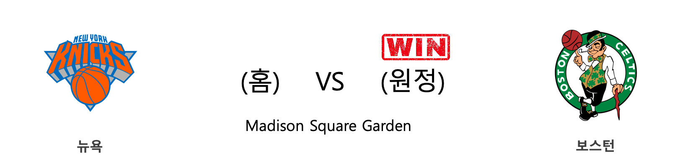
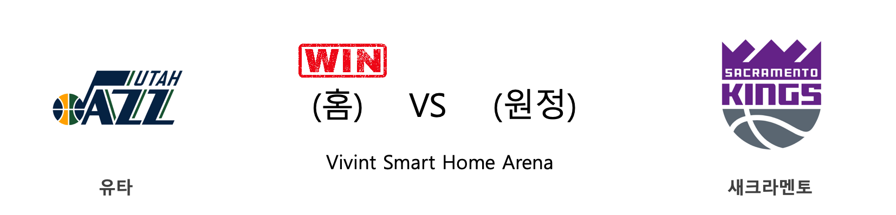
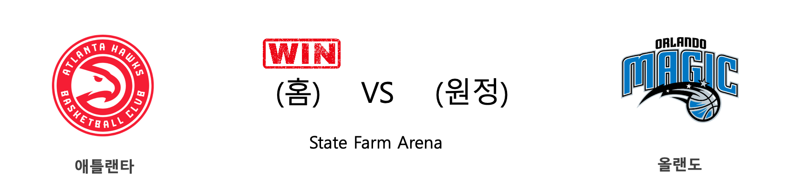

####  뉴욕(홈) VS 보스턴(원정) 

<table class="tg">
  <tr>
    <th class="tg-rr9t">NYK</th>
    <th class="tg-rr9t">팀</th>
    <th class="tg-rr9t">BOS</th>
  </tr>
  <tr>
    <td class="tg-dcpn">0승 1패</td>
    <td class="tg-rr9t">시즌 상대전적</td>
    <td class="tg-dcpn">1승 0패</td>
  </tr>
  <tr>
    <td class="tg-dcpn">95</td>
    <td class="tg-rr9t">점수</td>
    <td class="tg-dcpn">118</td>
  </tr>
  <tr>
    <td class="tg-dcpn">24/53(45%)</td>
    <td class="tg-rr9t">2점(%)</td>
    <td class="tg-dcpn">27/52(52%)</td>
  </tr>
  <tr>
    <td class="tg-dcpn">7/27(26%)</td>
    <td class="tg-rr9t">3점(%)</td>
    <td class="tg-dcpn">15/41(37%)</td>
  </tr>
  <tr>
    <td class="tg-dcpn">26/34(76%)</td>
    <td class="tg-rr9t">자유투(%)</td>
    <td class="tg-dcpn">19/29(66%)</td>
  </tr>
  <tr>
    <td class="tg-dcpn">55</td>
    <td class="tg-rr9t">리바운드</td>
    <td class="tg-dcpn">45</td>
  </tr>
  <tr>
    <td class="tg-dcpn">15</td>
    <td class="tg-rr9t">어시스트</td>
    <td class="tg-dcpn">24</td>
  </tr>
  <tr>
    <td class="tg-dcpn">7</td>
    <td class="tg-rr9t">스틸</td>
    <td class="tg-dcpn">16</td>
  </tr>
  <tr>
    <td class="tg-dcpn">4</td>
    <td class="tg-rr9t">블록</td>
    <td class="tg-dcpn">7</td>
  </tr>
  <tr>
    <td class="tg-dcpn">25</td>
    <td class="tg-rr9t">턴오버</td>
    <td class="tg-dcpn">12</td>
  </tr>
  <tr>
    <td class="tg-dcpn">MitchellRobin(17) RJBarrettG(26)</td>
    <td class="tg-rr9t">주요 득점선수</td>
    <td class="tg-dcpn">JaylenBrownG(19) JaysonTatumF(15) KembaWalkerG(32)</td>
  </tr>
</table>

#### 경기 관련 주요 기사         

[[오늘의 NBA] (10/27) 불사조 군단의 2019-20시즌 출사표](http://sports.news.naver.com/basketball/news/read.nhn?oid=486&aid=0000001119)

[[오늘의 NBA] (10/26) 루카 돈치치, 댈러스의 해결사](http://sports.news.naver.com/basketball/news/read.nhn?oid=486&aid=0000001118)

[[NBA] 시즌개막특집 ⑤ 2019-2020시즌, 점프볼이 추천하는 이적생들](http://sports.news.naver.com/basketball/news/read.nhn?oid=065&aid=0000190747)

[[오늘의 NBA] 시즌 프리뷰 : 클리블랜드, 다시 시작된 여행](http://sports.news.naver.com/basketball/news/read.nhn?oid=486&aid=0000001083)

[[오늘의 NBA] (10/24) 앤드류 위긴스, 위기 상황에서 웃는 일류 승부사](http://sports.news.naver.com/basketball/news/read.nhn?oid=486&aid=0000001116)

        
        

####  샌안토니오(홈) VS 워싱턴(원정) 

<table class="tg">
  <tr>
    <th class="tg-rr9t">SAS</th>
    <th class="tg-rr9t">팀</th>
    <th class="tg-rr9t">WAS</th>
  </tr>
  <tr>
    <td class="tg-dcpn">1승 0패</td>
    <td class="tg-rr9t">시즌 상대전적</td>
    <td class="tg-dcpn">0승 1패</td>
  </tr>
  <tr>
    <td class="tg-dcpn">124</td>
    <td class="tg-rr9t">점수</td>
    <td class="tg-dcpn">122</td>
  </tr>
  <tr>
    <td class="tg-dcpn">40/80(50%)</td>
    <td class="tg-rr9t">2점(%)</td>
    <td class="tg-dcpn">31/61(51%)</td>
  </tr>
  <tr>
    <td class="tg-dcpn">10/28(36%)</td>
    <td class="tg-rr9t">3점(%)</td>
    <td class="tg-dcpn">16/34(47%)</td>
  </tr>
  <tr>
    <td class="tg-dcpn">14/17(82%)</td>
    <td class="tg-rr9t">자유투(%)</td>
    <td class="tg-dcpn">12/17(71%)</td>
  </tr>
  <tr>
    <td class="tg-dcpn">53</td>
    <td class="tg-rr9t">리바운드</td>
    <td class="tg-dcpn">41</td>
  </tr>
  <tr>
    <td class="tg-dcpn">29</td>
    <td class="tg-rr9t">어시스트</td>
    <td class="tg-dcpn">30</td>
  </tr>
  <tr>
    <td class="tg-dcpn">6</td>
    <td class="tg-rr9t">스틸</td>
    <td class="tg-dcpn">3</td>
  </tr>
  <tr>
    <td class="tg-dcpn">7</td>
    <td class="tg-rr9t">블록</td>
    <td class="tg-dcpn">8</td>
  </tr>
  <tr>
    <td class="tg-dcpn">9</td>
    <td class="tg-rr9t">턴오버</td>
    <td class="tg-dcpn">12</td>
  </tr>
  <tr>
    <td class="tg-dcpn">LaMarcusAldri(27) BrynForbesG(16) DeMarDeRozanF(26) DejounteMurra(19)</td>
    <td class="tg-rr9t">주요 득점선수</td>
    <td class="tg-dcpn">BradleyBealG(25) IsaiahThomas(16) RuiHachimuraF(16) IshSmithG(19) DavisBertans(23)</td>
  </tr>
</table>

#### 경기 관련 주요 기사         

[[오늘의 NBA] (3/19) DAL, 덕 노비츠키 마일스톤 달성과 바꾼 패배](http://sports.news.naver.com/basketball/news/read.nhn?oid=486&aid=0000000990)

[[오늘의 NBA] (4/17) TOR, 카와이 레너드의 우아한 비행](http://sports.news.naver.com/basketball/news/read.nhn?oid=486&aid=0000001016)

[[오늘의 NBA] (4/14) 황금 전사 군단의 2019년 PO 출정식](http://sports.news.naver.com/basketball/news/read.nhn?oid=486&aid=0000001013)

[[오늘의 NBA] (10/24) 앤드류 위긴스, 위기 상황에서 웃는 일류 승부사](http://sports.news.naver.com/basketball/news/read.nhn?oid=486&aid=0000001116)

        
        

####  클리블랜드(홈) VS 인디애나(원정) 

<table class="tg">
  <tr>
    <th class="tg-rr9t">CLE</th>
    <th class="tg-rr9t">팀</th>
    <th class="tg-rr9t">IND</th>
  </tr>
  <tr>
    <td class="tg-dcpn">1승 0패</td>
    <td class="tg-rr9t">시즌 상대전적</td>
    <td class="tg-dcpn">0승 1패</td>
  </tr>
  <tr>
    <td class="tg-dcpn">110</td>
    <td class="tg-rr9t">점수</td>
    <td class="tg-dcpn">99</td>
  </tr>
  <tr>
    <td class="tg-dcpn">29/49(59%)</td>
    <td class="tg-rr9t">2점(%)</td>
    <td class="tg-dcpn">29/59(49%)</td>
  </tr>
  <tr>
    <td class="tg-dcpn">11/31(35%)</td>
    <td class="tg-rr9t">3점(%)</td>
    <td class="tg-dcpn">10/28(36%)</td>
  </tr>
  <tr>
    <td class="tg-dcpn">19/29(66%)</td>
    <td class="tg-rr9t">자유투(%)</td>
    <td class="tg-dcpn">11/13(85%)</td>
  </tr>
  <tr>
    <td class="tg-dcpn">44</td>
    <td class="tg-rr9t">리바운드</td>
    <td class="tg-dcpn">36</td>
  </tr>
  <tr>
    <td class="tg-dcpn">23</td>
    <td class="tg-rr9t">어시스트</td>
    <td class="tg-dcpn">23</td>
  </tr>
  <tr>
    <td class="tg-dcpn">9</td>
    <td class="tg-rr9t">스틸</td>
    <td class="tg-dcpn">7</td>
  </tr>
  <tr>
    <td class="tg-dcpn">7</td>
    <td class="tg-rr9t">블록</td>
    <td class="tg-dcpn">3</td>
  </tr>
  <tr>
    <td class="tg-dcpn">18</td>
    <td class="tg-rr9t">턴오버</td>
    <td class="tg-dcpn">17</td>
  </tr>
  <tr>
    <td class="tg-dcpn">TristanThomps(25) CollinSextonG(18) JordanClarkso(15) KevinLoveF(21)</td>
    <td class="tg-rr9t">주요 득점선수</td>
    <td class="tg-dcpn">MalcolmBrogdo(30)</td>
  </tr>
</table>

#### 경기 관련 주요 기사         

[[오늘의 NBA] (4/28) 카와이 레너드와 더마 드로잔의 뒤틀린 운명](http://sports.news.naver.com/basketball/news/read.nhn?oid=486&aid=0000001027)

[[오늘의 NBA] (4/18) BOS, 해결사는 많을수록 좋다](http://sports.news.naver.com/basketball/news/read.nhn?oid=486&aid=0000001017)

[[오늘의 NBA] (10/24) 앤드류 위긴스, 위기 상황에서 웃는 일류 승부사](http://sports.news.naver.com/basketball/news/read.nhn?oid=486&aid=0000001116)

[[오늘의 NBA] (10/27) 불사조 군단의 2019-20시즌 출사표](http://sports.news.naver.com/basketball/news/read.nhn?oid=486&aid=0000001119)

[[오늘의 NBA] (5/9) 밀워키 컨퍼런스파이널 진출!](http://sports.news.naver.com/basketball/news/read.nhn?oid=486&aid=0000001038)

        
        

####  시카고(홈) VS 토론토(원정) 

<table class="tg">
  <tr>
    <th class="tg-rr9t">CHI</th>
    <th class="tg-rr9t">팀</th>
    <th class="tg-rr9t">TOR</th>
  </tr>
  <tr>
    <td class="tg-dcpn">0승 1패</td>
    <td class="tg-rr9t">시즌 상대전적</td>
    <td class="tg-dcpn">1승 0패</td>
  </tr>
  <tr>
    <td class="tg-dcpn">84</td>
    <td class="tg-rr9t">점수</td>
    <td class="tg-dcpn">108</td>
  </tr>
  <tr>
    <td class="tg-dcpn">20/62(32%)</td>
    <td class="tg-rr9t">2점(%)</td>
    <td class="tg-dcpn">23/40(57%)</td>
  </tr>
  <tr>
    <td class="tg-dcpn">9/35(26%)</td>
    <td class="tg-rr9t">3점(%)</td>
    <td class="tg-dcpn">15/42(36%)</td>
  </tr>
  <tr>
    <td class="tg-dcpn">17/25(68%)</td>
    <td class="tg-rr9t">자유투(%)</td>
    <td class="tg-dcpn">17/18(94%)</td>
  </tr>
  <tr>
    <td class="tg-dcpn">45</td>
    <td class="tg-rr9t">리바운드</td>
    <td class="tg-dcpn">59</td>
  </tr>
  <tr>
    <td class="tg-dcpn">18</td>
    <td class="tg-rr9t">어시스트</td>
    <td class="tg-dcpn">27</td>
  </tr>
  <tr>
    <td class="tg-dcpn">9</td>
    <td class="tg-rr9t">스틸</td>
    <td class="tg-dcpn">9</td>
  </tr>
  <tr>
    <td class="tg-dcpn">2</td>
    <td class="tg-rr9t">블록</td>
    <td class="tg-dcpn">12</td>
  </tr>
  <tr>
    <td class="tg-dcpn">15</td>
    <td class="tg-rr9t">턴오버</td>
    <td class="tg-dcpn">22</td>
  </tr>
  <tr>
    <td class="tg-dcpn"></td>
    <td class="tg-rr9t">주요 득점선수</td>
    <td class="tg-dcpn">FredVanVleetG(16) PascalSiakamF(19) SergeIbaka(18) OGAnunobyF(17)</td>
  </tr>
</table>

#### 경기 관련 주요 기사         

[[여름의 NBA] 2019-20시즌 플레이어 포커스 ⑩ 마일스 터너](http://sports.news.naver.com/basketball/news/read.nhn?oid=486&aid=0000001074)

[[오늘의 NBA] (6/14) 토론토 우승, 파이널 MVP 카와이 레너드](http://sports.news.naver.com/basketball/news/read.nhn?oid=486&aid=0000001059)

[[오늘의 NBA] (10/26) 루카 돈치치, 댈러스의 해결사](http://sports.news.naver.com/basketball/news/read.nhn?oid=486&aid=0000001118)

[[여름의 NBA] 2019-20시즌 플레이어 포커스 ⑧ 지미 버틀러](http://sports.news.naver.com/basketball/news/read.nhn?oid=486&aid=0000001072)

[[오늘의 NBA] (5/31) 토론토, 디펜딩 챔피언을 제압하다](http://sports.news.naver.com/basketball/news/read.nhn?oid=486&aid=0000001054)

        
        

####  피닉스(홈) VS LA클리퍼스(원정) 

<table class="tg">
  <tr>
    <th class="tg-rr9t">PHX</th>
    <th class="tg-rr9t">팀</th>
    <th class="tg-rr9t">LAC</th>
  </tr>
  <tr>
    <td class="tg-dcpn">1승 0패</td>
    <td class="tg-rr9t">시즌 상대전적</td>
    <td class="tg-dcpn">0승 1패</td>
  </tr>
  <tr>
    <td class="tg-dcpn">130</td>
    <td class="tg-rr9t">점수</td>
    <td class="tg-dcpn">122</td>
  </tr>
  <tr>
    <td class="tg-dcpn">26/43(60%)</td>
    <td class="tg-rr9t">2점(%)</td>
    <td class="tg-dcpn">29/55(53%)</td>
  </tr>
  <tr>
    <td class="tg-dcpn">17/43(40%)</td>
    <td class="tg-rr9t">3점(%)</td>
    <td class="tg-dcpn">11/32(34%)</td>
  </tr>
  <tr>
    <td class="tg-dcpn">27/34(79%)</td>
    <td class="tg-rr9t">자유투(%)</td>
    <td class="tg-dcpn">31/39(79%)</td>
  </tr>
  <tr>
    <td class="tg-dcpn">49</td>
    <td class="tg-rr9t">리바운드</td>
    <td class="tg-dcpn">41</td>
  </tr>
  <tr>
    <td class="tg-dcpn">32</td>
    <td class="tg-rr9t">어시스트</td>
    <td class="tg-dcpn">20</td>
  </tr>
  <tr>
    <td class="tg-dcpn">9</td>
    <td class="tg-rr9t">스틸</td>
    <td class="tg-dcpn">8</td>
  </tr>
  <tr>
    <td class="tg-dcpn">3</td>
    <td class="tg-rr9t">블록</td>
    <td class="tg-dcpn">4</td>
  </tr>
  <tr>
    <td class="tg-dcpn">16</td>
    <td class="tg-rr9t">턴오버</td>
    <td class="tg-dcpn">12</td>
  </tr>
  <tr>
    <td class="tg-dcpn">KellyOubreJr.(20) DarioSaricF(15) DevinBookerG(30) FrankKaminsky(18)</td>
    <td class="tg-rr9t">주요 득점선수</td>
    <td class="tg-dcpn">MontrezlHarre(28) LouWilliams(23) KawhiLeonardF(27)</td>
  </tr>
</table>

#### 경기 관련 주요 기사         

[[오늘의 NBA] 시즌 프리뷰 : 밀워키, 야니스 아테토쿤보의 야망](http://sports.news.naver.com/basketball/news/read.nhn?oid=486&aid=0000001113)

[[오늘의 NBA] (10/26) 루카 돈치치, 댈러스의 해결사](http://sports.news.naver.com/basketball/news/read.nhn?oid=486&aid=0000001118)

[[오늘의 NBA] 시즌 프리뷰 : 포틀랜드, 근성과 낭만의 조화](http://sports.news.naver.com/basketball/news/read.nhn?oid=486&aid=0000001110)

[[오늘의 NBA] 시즌 프리뷰 : 덴버, 서부컨퍼런스 정복을 노린다](http://sports.news.naver.com/basketball/news/read.nhn?oid=486&aid=0000001111)

[[오늘의 NBA] (10/23) 카와이 레너드, 할리우드의 새로운 주인공](http://sports.news.naver.com/basketball/news/read.nhn?oid=486&aid=0000001115)

        
        

####  디트로이트(홈) VS 필라델피아(원정) 

<table class="tg">
  <tr>
    <th class="tg-rr9t">DET</th>
    <th class="tg-rr9t">팀</th>
    <th class="tg-rr9t">PHI</th>
  </tr>
  <tr>
    <td class="tg-dcpn">0승 1패</td>
    <td class="tg-rr9t">시즌 상대전적</td>
    <td class="tg-dcpn">1승 0패</td>
  </tr>
  <tr>
    <td class="tg-dcpn">111</td>
    <td class="tg-rr9t">점수</td>
    <td class="tg-dcpn">117</td>
  </tr>
  <tr>
    <td class="tg-dcpn">33/57(58%)</td>
    <td class="tg-rr9t">2점(%)</td>
    <td class="tg-dcpn">29/53(55%)</td>
  </tr>
  <tr>
    <td class="tg-dcpn">8/19(42%)</td>
    <td class="tg-rr9t">3점(%)</td>
    <td class="tg-dcpn">13/34(38%)</td>
  </tr>
  <tr>
    <td class="tg-dcpn">21/36(58%)</td>
    <td class="tg-rr9t">자유투(%)</td>
    <td class="tg-dcpn">20/30(67%)</td>
  </tr>
  <tr>
    <td class="tg-dcpn">35</td>
    <td class="tg-rr9t">리바운드</td>
    <td class="tg-dcpn">38</td>
  </tr>
  <tr>
    <td class="tg-dcpn">20</td>
    <td class="tg-rr9t">어시스트</td>
    <td class="tg-dcpn">30</td>
  </tr>
  <tr>
    <td class="tg-dcpn">11</td>
    <td class="tg-rr9t">스틸</td>
    <td class="tg-dcpn">14</td>
  </tr>
  <tr>
    <td class="tg-dcpn">7</td>
    <td class="tg-rr9t">블록</td>
    <td class="tg-dcpn">3</td>
  </tr>
  <tr>
    <td class="tg-dcpn">23</td>
    <td class="tg-rr9t">턴오버</td>
    <td class="tg-dcpn">22</td>
  </tr>
  <tr>
    <td class="tg-dcpn">MarkieffMorri(17) LukeKennard(16) DerrickRose(31)</td>
    <td class="tg-rr9t">주요 득점선수</td>
    <td class="tg-dcpn">TobiasHarrisF(29) AlHorfordC(23) MikeScott(17)</td>
  </tr>
</table>

#### 경기 관련 주요 기사         

[[오늘의 NBA] (10/23) 카와이 레너드, 할리우드의 새로운 주인공](http://sports.news.naver.com/basketball/news/read.nhn?oid=486&aid=0000001115)

[[NBA] 시즌개막특집 ⑤ 2019-2020시즌, 점프볼이 추천하는 이적생들](http://sports.news.naver.com/basketball/news/read.nhn?oid=065&aid=0000190747)

[[오늘의 NBA] (10/24) 앤드류 위긴스, 위기 상황에서 웃는 일류 승부사](http://sports.news.naver.com/basketball/news/read.nhn?oid=486&aid=0000001116)

[[오늘의 NBA] (10/27) 불사조 군단의 2019-20시즌 출사표](http://sports.news.naver.com/basketball/news/read.nhn?oid=486&aid=0000001119)

[엠비드 결장했지만, 해리스 터진 PHI, DET 꺽고 2연승](http://www.rookie.co.kr/news/articleView.html?idxno=34212)

        
        

####  밀워키(홈) VS 마이애미(원정) 

<table class="tg">
  <tr>
    <th class="tg-rr9t">MIL</th>
    <th class="tg-rr9t">팀</th>
    <th class="tg-rr9t">MIA</th>
  </tr>
  <tr>
    <td class="tg-dcpn">0승 1패</td>
    <td class="tg-rr9t">시즌 상대전적</td>
    <td class="tg-dcpn">1승 0패</td>
  </tr>
  <tr>
    <td class="tg-dcpn">126</td>
    <td class="tg-rr9t">점수</td>
    <td class="tg-dcpn">131</td>
  </tr>
  <tr>
    <td class="tg-dcpn">24/40(60%)</td>
    <td class="tg-rr9t">2점(%)</td>
    <td class="tg-dcpn">30/57(53%)</td>
  </tr>
  <tr>
    <td class="tg-dcpn">17/54(31%)</td>
    <td class="tg-rr9t">3점(%)</td>
    <td class="tg-dcpn">16/44(36%)</td>
  </tr>
  <tr>
    <td class="tg-dcpn">27/35(77%)</td>
    <td class="tg-rr9t">자유투(%)</td>
    <td class="tg-dcpn">23/36(64%)</td>
  </tr>
  <tr>
    <td class="tg-dcpn">47</td>
    <td class="tg-rr9t">리바운드</td>
    <td class="tg-dcpn">54</td>
  </tr>
  <tr>
    <td class="tg-dcpn">22</td>
    <td class="tg-rr9t">어시스트</td>
    <td class="tg-dcpn">33</td>
  </tr>
  <tr>
    <td class="tg-dcpn">8</td>
    <td class="tg-rr9t">스틸</td>
    <td class="tg-dcpn">7</td>
  </tr>
  <tr>
    <td class="tg-dcpn">4</td>
    <td class="tg-rr9t">블록</td>
    <td class="tg-dcpn">3</td>
  </tr>
  <tr>
    <td class="tg-dcpn">18</td>
    <td class="tg-rr9t">턴오버</td>
    <td class="tg-dcpn">16</td>
  </tr>
  <tr>
    <td class="tg-dcpn">KhrisMiddleto(25) GiannisAnteto(29)</td>
    <td class="tg-rr9t">주요 득점선수</td>
    <td class="tg-dcpn">GoranDragic(25) BamAdebayoF(19) KendrickNunnG(18)</td>
  </tr>
</table>

#### 경기 관련 주요 기사         

[[오늘의 NBA] (10/24) 앤드류 위긴스, 위기 상황에서 웃는 일류 승부사](http://sports.news.naver.com/basketball/news/read.nhn?oid=486&aid=0000001116)

[MIL 옐리치, MIA전 투런포...시즌 23호+선두 질주](http://isplus.live.joins.com/news/article/aid.asp?aid=23082868)

[[메이저리그 투나잇] 최지만의 빛바랜 홈런, TB 가을야구 '위태'](http://www.mbcsportsplus.com/news/?mode=view&cate=2&b_idx=99831654.000)

[[NBA] 시즌개막특집 ⑤ 2019-2020시즌, 점프볼이 추천하는 이적생들](http://sports.news.naver.com/basketball/news/read.nhn?oid=065&aid=0000190747)

[[오늘의 NBA] (10/27) 불사조 군단의 2019-20시즌 출사표](http://sports.news.naver.com/basketball/news/read.nhn?oid=486&aid=0000001119)

        
        

####  유타(홈) VS 새크라멘토(원정) 

<table class="tg">
  <tr>
    <th class="tg-rr9t">UTA</th>
    <th class="tg-rr9t">팀</th>
    <th class="tg-rr9t">SAC</th>
  </tr>
  <tr>
    <td class="tg-dcpn">1승 0패</td>
    <td class="tg-rr9t">시즌 상대전적</td>
    <td class="tg-dcpn">0승 1패</td>
  </tr>
  <tr>
    <td class="tg-dcpn">113</td>
    <td class="tg-rr9t">점수</td>
    <td class="tg-dcpn">81</td>
  </tr>
  <tr>
    <td class="tg-dcpn">26/41(63%)</td>
    <td class="tg-rr9t">2점(%)</td>
    <td class="tg-dcpn">23/55(42%)</td>
  </tr>
  <tr>
    <td class="tg-dcpn">18/37(49%)</td>
    <td class="tg-rr9t">3점(%)</td>
    <td class="tg-dcpn">7/26(27%)</td>
  </tr>
  <tr>
    <td class="tg-dcpn">7/12(58%)</td>
    <td class="tg-rr9t">자유투(%)</td>
    <td class="tg-dcpn">14/17(82%)</td>
  </tr>
  <tr>
    <td class="tg-dcpn">43</td>
    <td class="tg-rr9t">리바운드</td>
    <td class="tg-dcpn">31</td>
  </tr>
  <tr>
    <td class="tg-dcpn">28</td>
    <td class="tg-rr9t">어시스트</td>
    <td class="tg-dcpn">16</td>
  </tr>
  <tr>
    <td class="tg-dcpn">6</td>
    <td class="tg-rr9t">스틸</td>
    <td class="tg-dcpn">5</td>
  </tr>
  <tr>
    <td class="tg-dcpn">1</td>
    <td class="tg-rr9t">블록</td>
    <td class="tg-dcpn">3</td>
  </tr>
  <tr>
    <td class="tg-dcpn">21</td>
    <td class="tg-rr9t">턴오버</td>
    <td class="tg-dcpn">17</td>
  </tr>
  <tr>
    <td class="tg-dcpn">BojanBogdanov(26) DonovanMitche(15)</td>
    <td class="tg-rr9t">주요 득점선수</td>
    <td class="tg-dcpn"></td>
  </tr>
</table>

#### 경기 관련 주요 기사         

[[오늘의 NBA] (10/27) 불사조 군단의 2019-20시즌 출사표](http://sports.news.naver.com/basketball/news/read.nhn?oid=486&aid=0000001119)

[[여름의 NBA] 2019-20시즌 플레이어 포커스 ⑪ 잭 라빈](http://sports.news.naver.com/basketball/news/read.nhn?oid=486&aid=0000001075)

[[오늘의 NBA] (10/23) 카와이 레너드, 할리우드의 새로운 주인공](http://sports.news.naver.com/basketball/news/read.nhn?oid=486&aid=0000001115)

[[오늘의 NBA] (10/24) 앤드류 위긴스, 위기 상황에서 웃는 일류 승부사](http://sports.news.naver.com/basketball/news/read.nhn?oid=486&aid=0000001116)

[[오늘의 NBA] 2018-19시즌 정리 2부](http://sports.news.naver.com/basketball/news/read.nhn?oid=486&aid=0000001062)

        
        

####  애틀랜타(홈) VS 올랜도(원정) 

<table class="tg">
  <tr>
    <th class="tg-rr9t">ATL</th>
    <th class="tg-rr9t">팀</th>
    <th class="tg-rr9t">ORL</th>
  </tr>
  <tr>
    <td class="tg-dcpn">1승 0패</td>
    <td class="tg-rr9t">시즌 상대전적</td>
    <td class="tg-dcpn">0승 1패</td>
  </tr>
  <tr>
    <td class="tg-dcpn">103</td>
    <td class="tg-rr9t">점수</td>
    <td class="tg-dcpn">99</td>
  </tr>
  <tr>
    <td class="tg-dcpn">34/54(63%)</td>
    <td class="tg-rr9t">2점(%)</td>
    <td class="tg-dcpn">30/68(44%)</td>
  </tr>
  <tr>
    <td class="tg-dcpn">9/30(30%)</td>
    <td class="tg-rr9t">3점(%)</td>
    <td class="tg-dcpn">5/31(16%)</td>
  </tr>
  <tr>
    <td class="tg-dcpn">8/15(53%)</td>
    <td class="tg-rr9t">자유투(%)</td>
    <td class="tg-dcpn">24/26(92%)</td>
  </tr>
  <tr>
    <td class="tg-dcpn">52</td>
    <td class="tg-rr9t">리바운드</td>
    <td class="tg-dcpn">46</td>
  </tr>
  <tr>
    <td class="tg-dcpn">22</td>
    <td class="tg-rr9t">어시스트</td>
    <td class="tg-dcpn">15</td>
  </tr>
  <tr>
    <td class="tg-dcpn">5</td>
    <td class="tg-rr9t">스틸</td>
    <td class="tg-dcpn">8</td>
  </tr>
  <tr>
    <td class="tg-dcpn">9</td>
    <td class="tg-rr9t">블록</td>
    <td class="tg-dcpn">7</td>
  </tr>
  <tr>
    <td class="tg-dcpn">18</td>
    <td class="tg-rr9t">턴오버</td>
    <td class="tg-dcpn">10</td>
  </tr>
  <tr>
    <td class="tg-dcpn">TraeYoungG(39)</td>
    <td class="tg-rr9t">주요 득점선수</td>
    <td class="tg-dcpn">EvanFournierG(23) NikolaVucevic(16)</td>
  </tr>
</table>

#### 경기 관련 주요 기사         

[[오늘의 NBA] (10/24) 앤드류 위긴스, 위기 상황에서 웃는 일류 승부사](http://sports.news.naver.com/basketball/news/read.nhn?oid=486&aid=0000001116)

[[오늘의 NBA] 시즌 프리뷰 : 워싱턴, 철학 부재의 시대](http://sports.news.naver.com/basketball/news/read.nhn?oid=486&aid=0000001087)

[[오늘의 NBA] (5/8) DEN 자말 머레이의 농구 각성](http://sports.news.naver.com/basketball/news/read.nhn?oid=486&aid=0000001037)

[[오늘의 NBA] (10/23) 카와이 레너드, 할리우드의 새로운 주인공](http://sports.news.naver.com/basketball/news/read.nhn?oid=486&aid=0000001115)

[[오늘의 NBA] (10/25) 밀워키의 털보 사냥](http://sports.news.naver.com/basketball/news/read.nhn?oid=486&aid=0000001117)

        
        

####  휴스턴(홈) VS 뉴올리언스(원정) 

<table class="tg">
  <tr>
    <th class="tg-rr9t">HOU</th>
    <th class="tg-rr9t">팀</th>
    <th class="tg-rr9t">NOP</th>
  </tr>
  <tr>
    <td class="tg-dcpn">1승 0패</td>
    <td class="tg-rr9t">시즌 상대전적</td>
    <td class="tg-dcpn">0승 1패</td>
  </tr>
  <tr>
    <td class="tg-dcpn">126</td>
    <td class="tg-rr9t">점수</td>
    <td class="tg-dcpn">123</td>
  </tr>
  <tr>
    <td class="tg-dcpn">30/49(61%)</td>
    <td class="tg-rr9t">2점(%)</td>
    <td class="tg-dcpn">28/50(56%)</td>
  </tr>
  <tr>
    <td class="tg-dcpn">13/45(29%)</td>
    <td class="tg-rr9t">3점(%)</td>
    <td class="tg-dcpn">18/50(36%)</td>
  </tr>
  <tr>
    <td class="tg-dcpn">27/30(90%)</td>
    <td class="tg-rr9t">자유투(%)</td>
    <td class="tg-dcpn">13/16(81%)</td>
  </tr>
  <tr>
    <td class="tg-dcpn">45</td>
    <td class="tg-rr9t">리바운드</td>
    <td class="tg-dcpn">42</td>
  </tr>
  <tr>
    <td class="tg-dcpn">27</td>
    <td class="tg-rr9t">어시스트</td>
    <td class="tg-dcpn">27</td>
  </tr>
  <tr>
    <td class="tg-dcpn">7</td>
    <td class="tg-rr9t">스틸</td>
    <td class="tg-dcpn">9</td>
  </tr>
  <tr>
    <td class="tg-dcpn">4</td>
    <td class="tg-rr9t">블록</td>
    <td class="tg-dcpn">2</td>
  </tr>
  <tr>
    <td class="tg-dcpn">19</td>
    <td class="tg-rr9t">턴오버</td>
    <td class="tg-dcpn">17</td>
  </tr>
  <tr>
    <td class="tg-dcpn">RussellWestbr(28) PJTuckerF(16) DanuelHouseJr(15) ClintCapelaC(15) JamesHardenG(29)</td>
    <td class="tg-rr9t">주요 득점선수</td>
    <td class="tg-dcpn">BrandonIngram(35) JoshHartF(23) LonzoBallG(18)</td>
  </tr>
</table>

#### 경기 관련 주요 기사         

[[오늘의 NBA] (10/27) 불사조 군단의 2019-20시즌 출사표](http://sports.news.naver.com/basketball/news/read.nhn?oid=486&aid=0000001119)

[[NBA] 시즌개막특집 ⑤ 2019-2020시즌, 점프볼이 추천하는 이적생들](http://sports.news.naver.com/basketball/news/read.nhn?oid=065&aid=0000190747)

[[오늘의 NBA] 시즌 프리뷰 : 밀워키, 야니스 아테토쿤보의 야망](http://sports.news.naver.com/basketball/news/read.nhn?oid=486&aid=0000001113)

[[오늘의 NBA] (10/26) 루카 돈치치, 댈러스의 해결사](http://sports.news.naver.com/basketball/news/read.nhn?oid=486&aid=0000001118)

[[오늘의 NBA] 시즌 프리뷰 : 애틀랜타, 젊은이들의 양지](http://sports.news.naver.com/basketball/news/read.nhn?oid=486&aid=0000001086)

        
        

#### 리그 (Eastern) 순위
    

<table class="tg">
  <tr>
    <th class="tg-d14o">순위</th>
    <th class="tg-d14o">팀명</th>
    <th class="tg-d14o">경기수</th>
    <th class="tg-d14o">승</th>
    <th class="tg-d14o">패</th>
    <th class="tg-d14o">승차</th>
    <th class="tg-d14o">승률</th>
  </tr>
  
<tr>
    <td class="tg-50j8">1</td>
    <td class="tg-50j8">PHI</td>
    <td class="tg-50j8">2</td>
    <td class="tg-50j8">2</td>
    <td class="tg-50j8">0</td>
    <td class="tg-50j8">0</td>
    <td class="tg-50j8">1.0</td>
</tr>

<tr>
    <td class="tg-50j8">1</td>
    <td class="tg-50j8">MIA</td>
    <td class="tg-50j8">2</td>
    <td class="tg-50j8">2</td>
    <td class="tg-50j8">0</td>
    <td class="tg-50j8">0</td>
    <td class="tg-50j8">1.0</td>
</tr>

<tr>
    <td class="tg-50j8">1</td>
    <td class="tg-50j8">ATL</td>
    <td class="tg-50j8">2</td>
    <td class="tg-50j8">2</td>
    <td class="tg-50j8">0</td>
    <td class="tg-50j8">0</td>
    <td class="tg-50j8">1.0</td>
</tr>

<tr>
    <td class="tg-50j8">4</td>
    <td class="tg-50j8">TOR</td>
    <td class="tg-50j8">3</td>
    <td class="tg-50j8">2</td>
    <td class="tg-50j8">1</td>
    <td class="tg-50j8">0</td>
    <td class="tg-50j8">0.667</td>
</tr>

<tr>
    <td class="tg-50j8">4</td>
    <td class="tg-50j8">BOS</td>
    <td class="tg-50j8">3</td>
    <td class="tg-50j8">2</td>
    <td class="tg-50j8">1</td>
    <td class="tg-50j8">0</td>
    <td class="tg-50j8">0.667</td>
</tr>

<tr>
    <td class="tg-50j8">6</td>
    <td class="tg-50j8">CLE</td>
    <td class="tg-50j8">2</td>
    <td class="tg-50j8">1</td>
    <td class="tg-50j8">1</td>
    <td class="tg-50j8">1</td>
    <td class="tg-50j8">0.5</td>
</tr>

<tr>
    <td class="tg-50j8">6</td>
    <td class="tg-50j8">MIL</td>
    <td class="tg-50j8">2</td>
    <td class="tg-50j8">1</td>
    <td class="tg-50j8">1</td>
    <td class="tg-50j8">1</td>
    <td class="tg-50j8">0.5</td>
</tr>

<tr>
    <td class="tg-50j8">6</td>
    <td class="tg-50j8">BKN</td>
    <td class="tg-50j8">2</td>
    <td class="tg-50j8">1</td>
    <td class="tg-50j8">1</td>
    <td class="tg-50j8">1</td>
    <td class="tg-50j8">0.5</td>
</tr>

<tr>
    <td class="tg-50j8">6</td>
    <td class="tg-50j8">CHA</td>
    <td class="tg-50j8">2</td>
    <td class="tg-50j8">1</td>
    <td class="tg-50j8">1</td>
    <td class="tg-50j8">1</td>
    <td class="tg-50j8">0.5</td>
</tr>

<tr>
    <td class="tg-50j8">6</td>
    <td class="tg-50j8">ORL</td>
    <td class="tg-50j8">2</td>
    <td class="tg-50j8">1</td>
    <td class="tg-50j8">1</td>
    <td class="tg-50j8">1</td>
    <td class="tg-50j8">0.5</td>
</tr>

<tr>
    <td class="tg-50j8">11</td>
    <td class="tg-50j8">CHI</td>
    <td class="tg-50j8">3</td>
    <td class="tg-50j8">1</td>
    <td class="tg-50j8">2</td>
    <td class="tg-50j8">1</td>
    <td class="tg-50j8">0.333</td>
</tr>

<tr>
    <td class="tg-50j8">11</td>
    <td class="tg-50j8">WAS</td>
    <td class="tg-50j8">3</td>
    <td class="tg-50j8">1</td>
    <td class="tg-50j8">2</td>
    <td class="tg-50j8">1</td>
    <td class="tg-50j8">0.333</td>
</tr>

<tr>
    <td class="tg-50j8">11</td>
    <td class="tg-50j8">DET</td>
    <td class="tg-50j8">3</td>
    <td class="tg-50j8">1</td>
    <td class="tg-50j8">2</td>
    <td class="tg-50j8">1</td>
    <td class="tg-50j8">0.333</td>
</tr>

<tr>
    <td class="tg-50j8">14</td>
    <td class="tg-50j8">IND</td>
    <td class="tg-50j8">2</td>
    <td class="tg-50j8">0</td>
    <td class="tg-50j8">2</td>
    <td class="tg-50j8">2</td>
    <td class="tg-50j8">0.0</td>
</tr>

<tr>
    <td class="tg-50j8">15</td>
    <td class="tg-50j8">NYK</td>
    <td class="tg-50j8">3</td>
    <td class="tg-50j8">0</td>
    <td class="tg-50j8">3</td>
    <td class="tg-50j8">2</td>
    <td class="tg-50j8">0.0</td>
</tr>
</table> 
#### 리그 (Western) 순위
    

<table class="tg">
  <tr>
    <th class="tg-d14o">순위</th>
    <th class="tg-d14o">팀명</th>
    <th class="tg-d14o">경기수</th>
    <th class="tg-d14o">승</th>
    <th class="tg-d14o">패</th>
    <th class="tg-d14o">승차</th>
    <th class="tg-d14o">승률</th>
  </tr>
  
<tr>
    <td class="tg-50j8">1</td>
    <td class="tg-50j8">MIN</td>
    <td class="tg-50j8">2</td>
    <td class="tg-50j8">2</td>
    <td class="tg-50j8">0</td>
    <td class="tg-50j8">0</td>
    <td class="tg-50j8">1.0</td>
</tr>

<tr>
    <td class="tg-50j8">1</td>
    <td class="tg-50j8">DEN</td>
    <td class="tg-50j8">2</td>
    <td class="tg-50j8">2</td>
    <td class="tg-50j8">0</td>
    <td class="tg-50j8">0</td>
    <td class="tg-50j8">1.0</td>
</tr>

<tr>
    <td class="tg-50j8">1</td>
    <td class="tg-50j8">SAS</td>
    <td class="tg-50j8">2</td>
    <td class="tg-50j8">2</td>
    <td class="tg-50j8">0</td>
    <td class="tg-50j8">0</td>
    <td class="tg-50j8">1.0</td>
</tr>

<tr>
    <td class="tg-50j8">1</td>
    <td class="tg-50j8">DAL</td>
    <td class="tg-50j8">2</td>
    <td class="tg-50j8">2</td>
    <td class="tg-50j8">0</td>
    <td class="tg-50j8">0</td>
    <td class="tg-50j8">1.0</td>
</tr>

<tr>
    <td class="tg-50j8">5</td>
    <td class="tg-50j8">LAC</td>
    <td class="tg-50j8">3</td>
    <td class="tg-50j8">2</td>
    <td class="tg-50j8">1</td>
    <td class="tg-50j8">0</td>
    <td class="tg-50j8">0.667</td>
</tr>

<tr>
    <td class="tg-50j8">5</td>
    <td class="tg-50j8">PHX</td>
    <td class="tg-50j8">3</td>
    <td class="tg-50j8">2</td>
    <td class="tg-50j8">1</td>
    <td class="tg-50j8">0</td>
    <td class="tg-50j8">0.667</td>
</tr>

<tr>
    <td class="tg-50j8">5</td>
    <td class="tg-50j8">UTA</td>
    <td class="tg-50j8">3</td>
    <td class="tg-50j8">2</td>
    <td class="tg-50j8">1</td>
    <td class="tg-50j8">0</td>
    <td class="tg-50j8">0.667</td>
</tr>

<tr>
    <td class="tg-50j8">8</td>
    <td class="tg-50j8">HOU</td>
    <td class="tg-50j8">2</td>
    <td class="tg-50j8">1</td>
    <td class="tg-50j8">1</td>
    <td class="tg-50j8">1</td>
    <td class="tg-50j8">0.5</td>
</tr>

<tr>
    <td class="tg-50j8">8</td>
    <td class="tg-50j8">POR</td>
    <td class="tg-50j8">2</td>
    <td class="tg-50j8">1</td>
    <td class="tg-50j8">1</td>
    <td class="tg-50j8">1</td>
    <td class="tg-50j8">0.5</td>
</tr>

<tr>
    <td class="tg-50j8">8</td>
    <td class="tg-50j8">LAL</td>
    <td class="tg-50j8">2</td>
    <td class="tg-50j8">1</td>
    <td class="tg-50j8">1</td>
    <td class="tg-50j8">1</td>
    <td class="tg-50j8">0.5</td>
</tr>

<tr>
    <td class="tg-50j8">11</td>
    <td class="tg-50j8">GSW</td>
    <td class="tg-50j8">1</td>
    <td class="tg-50j8">0</td>
    <td class="tg-50j8">1</td>
    <td class="tg-50j8">2</td>
    <td class="tg-50j8">0.0</td>
</tr>

<tr>
    <td class="tg-50j8">12</td>
    <td class="tg-50j8">MEM</td>
    <td class="tg-50j8">2</td>
    <td class="tg-50j8">0</td>
    <td class="tg-50j8">2</td>
    <td class="tg-50j8">2</td>
    <td class="tg-50j8">0.0</td>
</tr>

<tr>
    <td class="tg-50j8">12</td>
    <td class="tg-50j8">OKC</td>
    <td class="tg-50j8">2</td>
    <td class="tg-50j8">0</td>
    <td class="tg-50j8">2</td>
    <td class="tg-50j8">2</td>
    <td class="tg-50j8">0.0</td>
</tr>

<tr>
    <td class="tg-50j8">14</td>
    <td class="tg-50j8">SAC</td>
    <td class="tg-50j8">3</td>
    <td class="tg-50j8">0</td>
    <td class="tg-50j8">3</td>
    <td class="tg-50j8">2</td>
    <td class="tg-50j8">0.0</td>
</tr>

<tr>
    <td class="tg-50j8">14</td>
    <td class="tg-50j8">NOP</td>
    <td class="tg-50j8">3</td>
    <td class="tg-50j8">0</td>
    <td class="tg-50j8">3</td>
    <td class="tg-50j8">2</td>
    <td class="tg-50j8">0.0</td>
</tr>
</table> 

        
        
#nba #미국농구 #엔비에이 #농구분석 #토토 #스포츠토토 #경기예측 #농구결과 #20191027 #뉴욕 #보스턴 #샌안토니오 #워싱턴 #클리블랜드 #인디애나 #시카고 #토론토 #피닉스 #LA클리퍼스 #디트로이트 #필라델피아 #밀워키 #마이애미 #유타 #새크라멘토 #애틀랜타 #올랜도 #휴스턴 #뉴올리언스 #뉴욕보스턴 #샌안토니오워싱턴 #클리블랜드인디애나 #시카고토론토 #피닉스LA클리퍼스 #디트로이트필라델피아 #밀워키마이애미 #유타새크라멘토 #애틀랜타올랜도 #휴스턴뉴올리언스 