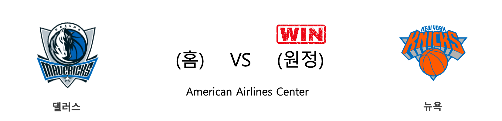
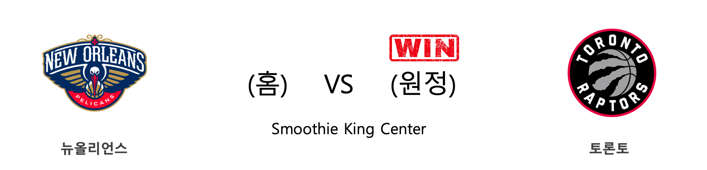
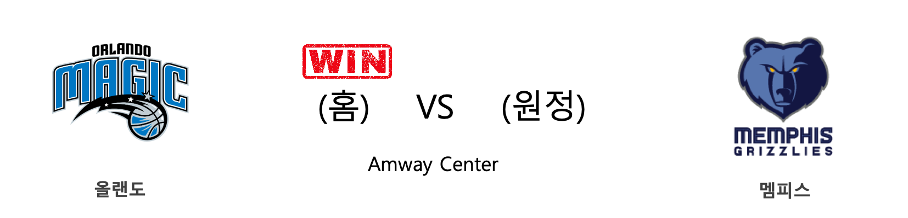
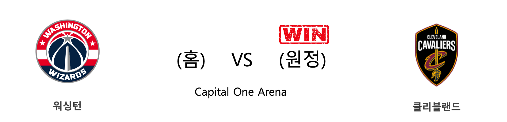
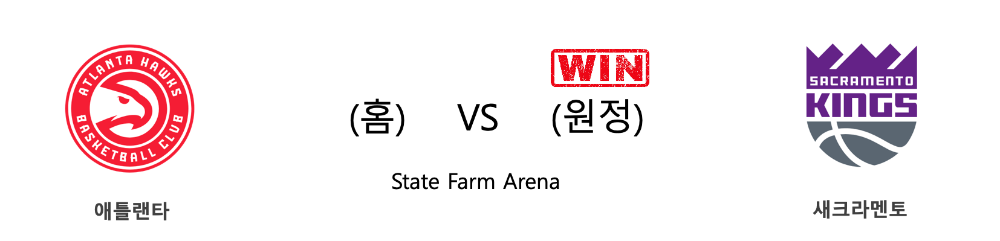
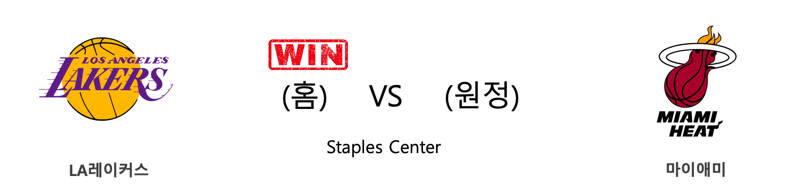

####  미네소타(홈) VS 골든스테이트(원정) 

<table class="tg">
  <tr>
    <th class="tg-rr9t">MIN</th>
    <th class="tg-rr9t">팀</th>
    <th class="tg-rr9t">GSW</th>
  </tr>
  <tr>
    <td class="tg-dcpn">1승 0패</td>
    <td class="tg-rr9t">시즌 상대전적</td>
    <td class="tg-dcpn">0승 1패</td>
  </tr>
  <tr>
    <td class="tg-dcpn">125</td>
    <td class="tg-rr9t">점수</td>
    <td class="tg-dcpn">119</td>
  </tr>
  <tr>
    <td class="tg-dcpn">39/75(52%)</td>
    <td class="tg-rr9t">2점(%)</td>
    <td class="tg-dcpn">33/68(49%)</td>
  </tr>
  <tr>
    <td class="tg-dcpn">9/36(25%)</td>
    <td class="tg-rr9t">3점(%)</td>
    <td class="tg-dcpn">10/35(29%)</td>
  </tr>
  <tr>
    <td class="tg-dcpn">20/29(69%)</td>
    <td class="tg-rr9t">자유투(%)</td>
    <td class="tg-dcpn">23/24(96%)</td>
  </tr>
  <tr>
    <td class="tg-dcpn">59</td>
    <td class="tg-rr9t">리바운드</td>
    <td class="tg-dcpn">49</td>
  </tr>
  <tr>
    <td class="tg-dcpn">20</td>
    <td class="tg-rr9t">어시스트</td>
    <td class="tg-dcpn">18</td>
  </tr>
  <tr>
    <td class="tg-dcpn">10</td>
    <td class="tg-rr9t">스틸</td>
    <td class="tg-dcpn">11</td>
  </tr>
  <tr>
    <td class="tg-dcpn">10</td>
    <td class="tg-rr9t">블록</td>
    <td class="tg-dcpn">9</td>
  </tr>
  <tr>
    <td class="tg-dcpn">17</td>
    <td class="tg-rr9t">턴오버</td>
    <td class="tg-dcpn">19</td>
  </tr>
  <tr>
    <td class="tg-dcpn">Karl-AnthonyT(20) RobertCovingt(17) AndrewWiggins(40)</td>
    <td class="tg-rr9t">주요 득점선수</td>
    <td class="tg-dcpn">D'AngeloRusse(52) AlecBurks(18)</td>
  </tr>
</table>

#### 경기 관련 주요 기사         

[오늘의 NBA] (11/3) 안드레 드러먼드, 모터 시티의 세계수](http://sports.news.naver.com/basketball/news/read.nhn?oid=486&aid=0000001126)

[[오늘의 NBA] (11/9) 위긴스 vs 러셀, 타깃 센터의 명승부](http://sports.news.naver.com/basketball/news/read.nhn?oid=486&aid=0000001132)

[[오늘의 NBA] (11/7) 야니스 아테토쿤보의 MVP 수성 의지](http://sports.news.naver.com/basketball/news/read.nhn?oid=486&aid=0000001130)

[[오늘의 NBA] (11/5) 데빈 부커, 강팀의 에이스](http://sports.news.naver.com/basketball/news/read.nhn?oid=486&aid=0000001128)

[[오늘의 NBA] (11/2) 르브론 제임스의 왕권신수설](http://sports.news.naver.com/basketball/news/read.nhn?oid=486&aid=0000001125)

        
        

####  댈러스(홈) VS 뉴욕(원정) 

<table class="tg">
  <tr>
    <th class="tg-rr9t">DAL</th>
    <th class="tg-rr9t">팀</th>
    <th class="tg-rr9t">NYK</th>
  </tr>
  <tr>
    <td class="tg-dcpn">0승 1패</td>
    <td class="tg-rr9t">시즌 상대전적</td>
    <td class="tg-dcpn">1승 0패</td>
  </tr>
  <tr>
    <td class="tg-dcpn">102</td>
    <td class="tg-rr9t">점수</td>
    <td class="tg-dcpn">106</td>
  </tr>
  <tr>
    <td class="tg-dcpn">23/46(50%)</td>
    <td class="tg-rr9t">2점(%)</td>
    <td class="tg-dcpn">23/61(38%)</td>
  </tr>
  <tr>
    <td class="tg-dcpn">14/44(32%)</td>
    <td class="tg-rr9t">3점(%)</td>
    <td class="tg-dcpn">14/28(50%)</td>
  </tr>
  <tr>
    <td class="tg-dcpn">14/17(82%)</td>
    <td class="tg-rr9t">자유투(%)</td>
    <td class="tg-dcpn">18/31(58%)</td>
  </tr>
  <tr>
    <td class="tg-dcpn">47</td>
    <td class="tg-rr9t">리바운드</td>
    <td class="tg-dcpn">56</td>
  </tr>
  <tr>
    <td class="tg-dcpn">18</td>
    <td class="tg-rr9t">어시스트</td>
    <td class="tg-dcpn">19</td>
  </tr>
  <tr>
    <td class="tg-dcpn">4</td>
    <td class="tg-rr9t">스틸</td>
    <td class="tg-dcpn">9</td>
  </tr>
  <tr>
    <td class="tg-dcpn">6</td>
    <td class="tg-rr9t">블록</td>
    <td class="tg-dcpn">3</td>
  </tr>
  <tr>
    <td class="tg-dcpn">13</td>
    <td class="tg-rr9t">턴오버</td>
    <td class="tg-dcpn">12</td>
  </tr>
  <tr>
    <td class="tg-dcpn">LukaDoncicG(38) KristapsPorzi(28)</td>
    <td class="tg-rr9t">주요 득점선수</td>
    <td class="tg-dcpn">MarcusMorrisS(29) JuliusRandleF(21)</td>
  </tr>
</table>

#### 경기 관련 주요 기사         

[[오늘의 NBA] (10/24) 앤드류 위긴스, 위기 상황에서 웃는 일류 승부사](http://sports.news.naver.com/basketball/news/read.nhn?oid=486&aid=0000001116)

[[오늘의 NBA] (10/31) HOU vs WAS, NBA 득점 쟁탈전 역사를 새로 쓰다](http://sports.news.naver.com/basketball/news/read.nhn?oid=486&aid=0000001123)

[[오늘의 NBA] (10/26) 루카 돈치치, 댈러스의 해결사](http://sports.news.naver.com/basketball/news/read.nhn?oid=486&aid=0000001118)

[[오늘의 NBA] (11/9) 위긴스 vs 러셀, 타깃 센터의 명승부](http://sports.news.naver.com/basketball/news/read.nhn?oid=486&aid=0000001132)

[[오늘의 NBA] (11/7) 야니스 아테토쿤보의 MVP 수성 의지](http://sports.news.naver.com/basketball/news/read.nhn?oid=486&aid=0000001130)

        
        

####  유타(홈) VS 밀워키(원정) 

<table class="tg">
  <tr>
    <th class="tg-rr9t">UTA</th>
    <th class="tg-rr9t">팀</th>
    <th class="tg-rr9t">MIL</th>
  </tr>
  <tr>
    <td class="tg-dcpn">1승 0패</td>
    <td class="tg-rr9t">시즌 상대전적</td>
    <td class="tg-dcpn">0승 1패</td>
  </tr>
  <tr>
    <td class="tg-dcpn">103</td>
    <td class="tg-rr9t">점수</td>
    <td class="tg-dcpn">100</td>
  </tr>
  <tr>
    <td class="tg-dcpn">19/48(40%)</td>
    <td class="tg-rr9t">2점(%)</td>
    <td class="tg-dcpn">24/59(41%)</td>
  </tr>
  <tr>
    <td class="tg-dcpn">15/36(42%)</td>
    <td class="tg-rr9t">3점(%)</td>
    <td class="tg-dcpn">10/36(28%)</td>
  </tr>
  <tr>
    <td class="tg-dcpn">20/29(69%)</td>
    <td class="tg-rr9t">자유투(%)</td>
    <td class="tg-dcpn">22/30(73%)</td>
  </tr>
  <tr>
    <td class="tg-dcpn">56</td>
    <td class="tg-rr9t">리바운드</td>
    <td class="tg-dcpn">54</td>
  </tr>
  <tr>
    <td class="tg-dcpn">15</td>
    <td class="tg-rr9t">어시스트</td>
    <td class="tg-dcpn">14</td>
  </tr>
  <tr>
    <td class="tg-dcpn">3</td>
    <td class="tg-rr9t">스틸</td>
    <td class="tg-dcpn">8</td>
  </tr>
  <tr>
    <td class="tg-dcpn">1</td>
    <td class="tg-rr9t">블록</td>
    <td class="tg-dcpn">4</td>
  </tr>
  <tr>
    <td class="tg-dcpn">20</td>
    <td class="tg-rr9t">턴오버</td>
    <td class="tg-dcpn">12</td>
  </tr>
  <tr>
    <td class="tg-dcpn">MikeConleyG(20) DonovanMitche(19) BojanBogdanov(33)</td>
    <td class="tg-rr9t">주요 득점선수</td>
    <td class="tg-dcpn">KhrisMiddleto(26) GiannisAnteto(30) EricBledsoeG(22)</td>
  </tr>
</table>

#### 경기 관련 주요 기사         

[[오늘의 NBA] (10/28) 모란트 vs 어빙, 페덱스 포럼의 결투](http://sports.news.naver.com/basketball/news/read.nhn?oid=486&aid=0000001120)

[[오늘의 NBA] (10/31) HOU vs WAS, NBA 득점 쟁탈전 역사를 새로 쓰다](http://sports.news.naver.com/basketball/news/read.nhn?oid=486&aid=0000001123)

[[오늘의 NBA] (11/2) 르브론 제임스의 왕권신수설](http://sports.news.naver.com/basketball/news/read.nhn?oid=486&aid=0000001125)

[[오늘의 NBA] (11/4) 마이애미의 대권 도전 행보](http://sports.news.naver.com/basketball/news/read.nhn?oid=486&aid=0000001127)

[[오늘의 NBA] (11/9) 위긴스 vs 러셀, 타깃 센터의 명승부](http://sports.news.naver.com/basketball/news/read.nhn?oid=486&aid=0000001132)

        
        

####  뉴올리언스(홈) VS 토론토(원정) 

<table class="tg">
  <tr>
    <th class="tg-rr9t">NOP</th>
    <th class="tg-rr9t">팀</th>
    <th class="tg-rr9t">TOR</th>
  </tr>
  <tr>
    <td class="tg-dcpn">0승 2패</td>
    <td class="tg-rr9t">시즌 상대전적</td>
    <td class="tg-dcpn">2승 0패</td>
  </tr>
  <tr>
    <td class="tg-dcpn">104</td>
    <td class="tg-rr9t">점수</td>
    <td class="tg-dcpn">122</td>
  </tr>
  <tr>
    <td class="tg-dcpn">30/58(52%)</td>
    <td class="tg-rr9t">2점(%)</td>
    <td class="tg-dcpn">22/50(44%)</td>
  </tr>
  <tr>
    <td class="tg-dcpn">10/41(24%)</td>
    <td class="tg-rr9t">3점(%)</td>
    <td class="tg-dcpn">19/43(44%)</td>
  </tr>
  <tr>
    <td class="tg-dcpn">14/21(67%)</td>
    <td class="tg-rr9t">자유투(%)</td>
    <td class="tg-dcpn">21/24(88%)</td>
  </tr>
  <tr>
    <td class="tg-dcpn">53</td>
    <td class="tg-rr9t">리바운드</td>
    <td class="tg-dcpn">53</td>
  </tr>
  <tr>
    <td class="tg-dcpn">21</td>
    <td class="tg-rr9t">어시스트</td>
    <td class="tg-dcpn">27</td>
  </tr>
  <tr>
    <td class="tg-dcpn">7</td>
    <td class="tg-rr9t">스틸</td>
    <td class="tg-dcpn">9</td>
  </tr>
  <tr>
    <td class="tg-dcpn">6</td>
    <td class="tg-rr9t">블록</td>
    <td class="tg-dcpn">3</td>
  </tr>
  <tr>
    <td class="tg-dcpn">18</td>
    <td class="tg-rr9t">턴오버</td>
    <td class="tg-dcpn">17</td>
  </tr>
  <tr>
    <td class="tg-dcpn">BrandonIngram(27) JrueHolidayG(16)</td>
    <td class="tg-rr9t">주요 득점선수</td>
    <td class="tg-dcpn">PascalSiakamF(44) NormanPowell(18) OGAnunobyF(21)</td>
  </tr>
</table>

#### 경기 관련 주요 기사         

[[오늘의 NBA] (11/4) 마이애미의 대권 도전 행보](http://sports.news.naver.com/basketball/news/read.nhn?oid=486&aid=0000001127)

[[오늘의 NBA] (11/9) 위긴스 vs 러셀, 타깃 센터의 명승부](http://sports.news.naver.com/basketball/news/read.nhn?oid=486&aid=0000001132)

[[오늘의 NBA] (10/29) 조엘 엠비드, 필라델피아의 괴수](http://sports.news.naver.com/basketball/news/read.nhn?oid=486&aid=0000001121)

[[오늘의 NBA] (11/7) 야니스 아테토쿤보의 MVP 수성 의지](http://sports.news.naver.com/basketball/news/read.nhn?oid=486&aid=0000001130)

[[오늘의 NBA] (10/31) HOU vs WAS, NBA 득점 쟁탈전 역사를 새로 쓰다](http://sports.news.naver.com/basketball/news/read.nhn?oid=486&aid=0000001123)

        
        

####  덴버(홈) VS 필라델피아(원정) 

<table class="tg">
  <tr>
    <th class="tg-rr9t">DEN</th>
    <th class="tg-rr9t">팀</th>
    <th class="tg-rr9t">PHI</th>
  </tr>
  <tr>
    <td class="tg-dcpn">1승 0패</td>
    <td class="tg-rr9t">시즌 상대전적</td>
    <td class="tg-dcpn">0승 1패</td>
  </tr>
  <tr>
    <td class="tg-dcpn">100</td>
    <td class="tg-rr9t">점수</td>
    <td class="tg-dcpn">97</td>
  </tr>
  <tr>
    <td class="tg-dcpn">30/65(46%)</td>
    <td class="tg-rr9t">2점(%)</td>
    <td class="tg-dcpn">25/60(42%)</td>
  </tr>
  <tr>
    <td class="tg-dcpn">9/22(41%)</td>
    <td class="tg-rr9t">3점(%)</td>
    <td class="tg-dcpn">13/26(50%)</td>
  </tr>
  <tr>
    <td class="tg-dcpn">13/17(76%)</td>
    <td class="tg-rr9t">자유투(%)</td>
    <td class="tg-dcpn">8/17(47%)</td>
  </tr>
  <tr>
    <td class="tg-dcpn">41</td>
    <td class="tg-rr9t">리바운드</td>
    <td class="tg-dcpn">49</td>
  </tr>
  <tr>
    <td class="tg-dcpn">28</td>
    <td class="tg-rr9t">어시스트</td>
    <td class="tg-dcpn">28</td>
  </tr>
  <tr>
    <td class="tg-dcpn">10</td>
    <td class="tg-rr9t">스틸</td>
    <td class="tg-dcpn">8</td>
  </tr>
  <tr>
    <td class="tg-dcpn">11</td>
    <td class="tg-rr9t">블록</td>
    <td class="tg-dcpn">8</td>
  </tr>
  <tr>
    <td class="tg-dcpn">10</td>
    <td class="tg-rr9t">턴오버</td>
    <td class="tg-dcpn">17</td>
  </tr>
  <tr>
    <td class="tg-dcpn">PaulMillsapF(15) JamalMurrayG(22) WillBartonF(20) NikolaJokicC(26)</td>
    <td class="tg-rr9t">주요 득점선수</td>
    <td class="tg-dcpn">JoelEmbiidC(19)</td>
  </tr>
</table>

#### 경기 관련 주요 기사         

[[오늘의 NBA] (11/1) MIA 에릭 스포엘스트라 감독의 승리 설계](http://sports.news.naver.com/basketball/news/read.nhn?oid=486&aid=0000001124)

[[오늘의 NBA] (11/2) 르브론 제임스의 왕권신수설](http://sports.news.naver.com/basketball/news/read.nhn?oid=486&aid=0000001125)

[[오늘의 NBA] (11/9) 위긴스 vs 러셀, 타깃 센터의 명승부](http://sports.news.naver.com/basketball/news/read.nhn?oid=486&aid=0000001132)

[[오늘의 NBA] (10/31) HOU vs WAS, NBA 득점 쟁탈전 역사를 새로 쓰다](http://sports.news.naver.com/basketball/news/read.nhn?oid=486&aid=0000001123)

[[오늘의 NBA] (10/28) 모란트 vs 어빙, 페덱스 포럼의 결투](http://sports.news.naver.com/basketball/news/read.nhn?oid=486&aid=0000001120)

        
        

####  인디애나(홈) VS 디트로이트(원정) 

<table class="tg">
  <tr>
    <th class="tg-rr9t">IND</th>
    <th class="tg-rr9t">팀</th>
    <th class="tg-rr9t">DET</th>
  </tr>
  <tr>
    <td class="tg-dcpn">1승 2패</td>
    <td class="tg-rr9t">시즌 상대전적</td>
    <td class="tg-dcpn">2승 1패</td>
  </tr>
  <tr>
    <td class="tg-dcpn">112</td>
    <td class="tg-rr9t">점수</td>
    <td class="tg-dcpn">106</td>
  </tr>
  <tr>
    <td class="tg-dcpn">39/68(57%)</td>
    <td class="tg-rr9t">2점(%)</td>
    <td class="tg-dcpn">26/53(49%)</td>
  </tr>
  <tr>
    <td class="tg-dcpn">4/15(27%)</td>
    <td class="tg-rr9t">3점(%)</td>
    <td class="tg-dcpn">13/33(39%)</td>
  </tr>
  <tr>
    <td class="tg-dcpn">22/25(88%)</td>
    <td class="tg-rr9t">자유투(%)</td>
    <td class="tg-dcpn">15/18(83%)</td>
  </tr>
  <tr>
    <td class="tg-dcpn">44</td>
    <td class="tg-rr9t">리바운드</td>
    <td class="tg-dcpn">40</td>
  </tr>
  <tr>
    <td class="tg-dcpn">23</td>
    <td class="tg-rr9t">어시스트</td>
    <td class="tg-dcpn">27</td>
  </tr>
  <tr>
    <td class="tg-dcpn">6</td>
    <td class="tg-rr9t">스틸</td>
    <td class="tg-dcpn">6</td>
  </tr>
  <tr>
    <td class="tg-dcpn">8</td>
    <td class="tg-rr9t">블록</td>
    <td class="tg-dcpn">4</td>
  </tr>
  <tr>
    <td class="tg-dcpn">12</td>
    <td class="tg-rr9t">턴오버</td>
    <td class="tg-dcpn">15</td>
  </tr>
  <tr>
    <td class="tg-dcpn">JustinHoliday(16) DomantasSabon(17) T.J.McConnell(17) T.J.WarrenF(17)</td>
    <td class="tg-rr9t">주요 득점선수</td>
    <td class="tg-dcpn">AndreDrummond(15) LangstonGallo(19) LukeKennardG(29)</td>
  </tr>
</table>

#### 경기 관련 주요 기사         

[[오늘의 NBA] (10/27) 불사조 군단의 2019-20시즌 출사표](http://sports.news.naver.com/basketball/news/read.nhn?oid=486&aid=0000001119)

[Here’s What We Learned in N.F.L. Week 1](https://www.nytimes.com/2019/09/08/sports/football/nfl-week-1.html?partner=naver)

[[오늘의 NBA] (10/25) 밀워키의 털보 사냥](http://sports.news.naver.com/basketball/news/read.nhn?oid=486&aid=0000001117)

[[오늘의 NBA] (11/7) 야니스 아테토쿤보의 MVP 수성 의지](http://sports.news.naver.com/basketball/news/read.nhn?oid=486&aid=0000001130)

[[오늘의 NBA] (10/31) HOU vs WAS, NBA 득점 쟁탈전 역사를 새로 쓰다](http://sports.news.naver.com/basketball/news/read.nhn?oid=486&aid=0000001123)

        
        

####  올랜도(홈) VS 멤피스(원정) 

<table class="tg">
  <tr>
    <th class="tg-rr9t">ORL</th>
    <th class="tg-rr9t">팀</th>
    <th class="tg-rr9t">MEM</th>
  </tr>
  <tr>
    <td class="tg-dcpn">1승 0패</td>
    <td class="tg-rr9t">시즌 상대전적</td>
    <td class="tg-dcpn">0승 1패</td>
  </tr>
  <tr>
    <td class="tg-dcpn">118</td>
    <td class="tg-rr9t">점수</td>
    <td class="tg-dcpn">86</td>
  </tr>
  <tr>
    <td class="tg-dcpn">37/65(57%)</td>
    <td class="tg-rr9t">2점(%)</td>
    <td class="tg-dcpn">21/57(37%)</td>
  </tr>
  <tr>
    <td class="tg-dcpn">7/28(25%)</td>
    <td class="tg-rr9t">3점(%)</td>
    <td class="tg-dcpn">11/29(38%)</td>
  </tr>
  <tr>
    <td class="tg-dcpn">23/27(85%)</td>
    <td class="tg-rr9t">자유투(%)</td>
    <td class="tg-dcpn">11/13(85%)</td>
  </tr>
  <tr>
    <td class="tg-dcpn">57</td>
    <td class="tg-rr9t">리바운드</td>
    <td class="tg-dcpn">36</td>
  </tr>
  <tr>
    <td class="tg-dcpn">24</td>
    <td class="tg-rr9t">어시스트</td>
    <td class="tg-dcpn">23</td>
  </tr>
  <tr>
    <td class="tg-dcpn">10</td>
    <td class="tg-rr9t">스틸</td>
    <td class="tg-dcpn">3</td>
  </tr>
  <tr>
    <td class="tg-dcpn">10</td>
    <td class="tg-rr9t">블록</td>
    <td class="tg-dcpn">5</td>
  </tr>
  <tr>
    <td class="tg-dcpn">9</td>
    <td class="tg-rr9t">턴오버</td>
    <td class="tg-dcpn">18</td>
  </tr>
  <tr>
    <td class="tg-dcpn">JonathanIsaac(22) NikolaVucevic(23) EvanFournierG(19) AaronGordonF(17)</td>
    <td class="tg-rr9t">주요 득점선수</td>
    <td class="tg-dcpn">JonasValanciu(15)</td>
  </tr>
</table>

#### 경기 관련 주요 기사         

[[오늘의 NBA] (11/7) 야니스 아테토쿤보의 MVP 수성 의지](http://sports.news.naver.com/basketball/news/read.nhn?oid=486&aid=0000001130)

[[오늘의 NBA] (11/9) 위긴스 vs 러셀, 타깃 센터의 명승부](http://sports.news.naver.com/basketball/news/read.nhn?oid=486&aid=0000001132)

[오늘의 NBA] (11/3) 안드레 드러먼드, 모터 시티의 세계수](http://sports.news.naver.com/basketball/news/read.nhn?oid=486&aid=0000001126)

[[오늘의 NBA] (11/6) 트레이 영, 애틀랜타의 특급 유망주](http://sports.news.naver.com/basketball/news/read.nhn?oid=486&aid=0000001129)

[[오늘의 NBA] (10/30) 앤써니 데이비스, 골드&퍼플 군단의 새로운 태양](http://sports.news.naver.com/basketball/news/read.nhn?oid=486&aid=0000001122)

        
        

####  포틀랜드(홈) VS 브루클린(원정) 

<table class="tg">
  <tr>
    <th class="tg-rr9t">POR</th>
    <th class="tg-rr9t">팀</th>
    <th class="tg-rr9t">BKN</th>
  </tr>
  <tr>
    <td class="tg-dcpn">0승 1패</td>
    <td class="tg-rr9t">시즌 상대전적</td>
    <td class="tg-dcpn">1승 0패</td>
  </tr>
  <tr>
    <td class="tg-dcpn">115</td>
    <td class="tg-rr9t">점수</td>
    <td class="tg-dcpn">119</td>
  </tr>
  <tr>
    <td class="tg-dcpn">29/67(43%)</td>
    <td class="tg-rr9t">2점(%)</td>
    <td class="tg-dcpn">25/62(40%)</td>
  </tr>
  <tr>
    <td class="tg-dcpn">11/30(37%)</td>
    <td class="tg-rr9t">3점(%)</td>
    <td class="tg-dcpn">16/37(43%)</td>
  </tr>
  <tr>
    <td class="tg-dcpn">24/25(96%)</td>
    <td class="tg-rr9t">자유투(%)</td>
    <td class="tg-dcpn">21/30(70%)</td>
  </tr>
  <tr>
    <td class="tg-dcpn">48</td>
    <td class="tg-rr9t">리바운드</td>
    <td class="tg-dcpn">51</td>
  </tr>
  <tr>
    <td class="tg-dcpn">11</td>
    <td class="tg-rr9t">어시스트</td>
    <td class="tg-dcpn">18</td>
  </tr>
  <tr>
    <td class="tg-dcpn">3</td>
    <td class="tg-rr9t">스틸</td>
    <td class="tg-dcpn">6</td>
  </tr>
  <tr>
    <td class="tg-dcpn">9</td>
    <td class="tg-rr9t">블록</td>
    <td class="tg-dcpn">9</td>
  </tr>
  <tr>
    <td class="tg-dcpn">10</td>
    <td class="tg-rr9t">턴오버</td>
    <td class="tg-dcpn">9</td>
  </tr>
  <tr>
    <td class="tg-dcpn">AnferneeSimon(15) DamianLillard(60)</td>
    <td class="tg-rr9t">주요 득점선수</td>
    <td class="tg-dcpn">KyrieIrvingG(33) SpencerDinwid(34)</td>
  </tr>
</table>

#### 경기 관련 주요 기사         

[[오늘의 NBA] (11/7) 야니스 아테토쿤보의 MVP 수성 의지](http://sports.news.naver.com/basketball/news/read.nhn?oid=486&aid=0000001130)

[[오늘의 NBA] (11/9) 위긴스 vs 러셀, 타깃 센터의 명승부](http://sports.news.naver.com/basketball/news/read.nhn?oid=486&aid=0000001132)

[[오늘의 NBA] (11/5) 데빈 부커, 강팀의 에이스](http://sports.news.naver.com/basketball/news/read.nhn?oid=486&aid=0000001128)

[[오늘의 NBA] (10/31) HOU vs WAS, NBA 득점 쟁탈전 역사를 새로 쓰다](http://sports.news.naver.com/basketball/news/read.nhn?oid=486&aid=0000001123)

[오늘의 NBA] (11/3) 안드레 드러먼드, 모터 시티의 세계수](http://sports.news.naver.com/basketball/news/read.nhn?oid=486&aid=0000001126)

        
        

####  워싱턴(홈) VS 클리블랜드(원정) 

<table class="tg">
  <tr>
    <th class="tg-rr9t">WAS</th>
    <th class="tg-rr9t">팀</th>
    <th class="tg-rr9t">CLE</th>
  </tr>
  <tr>
    <td class="tg-dcpn">0승 1패</td>
    <td class="tg-rr9t">시즌 상대전적</td>
    <td class="tg-dcpn">1승 0패</td>
  </tr>
  <tr>
    <td class="tg-dcpn">100</td>
    <td class="tg-rr9t">점수</td>
    <td class="tg-dcpn">113</td>
  </tr>
  <tr>
    <td class="tg-dcpn">38/65(58%)</td>
    <td class="tg-rr9t">2점(%)</td>
    <td class="tg-dcpn">35/63(56%)</td>
  </tr>
  <tr>
    <td class="tg-dcpn">7/31(23%)</td>
    <td class="tg-rr9t">3점(%)</td>
    <td class="tg-dcpn">6/27(22%)</td>
  </tr>
  <tr>
    <td class="tg-dcpn">3/6(50%)</td>
    <td class="tg-rr9t">자유투(%)</td>
    <td class="tg-dcpn">25/29(86%)</td>
  </tr>
  <tr>
    <td class="tg-dcpn">47</td>
    <td class="tg-rr9t">리바운드</td>
    <td class="tg-dcpn">48</td>
  </tr>
  <tr>
    <td class="tg-dcpn">26</td>
    <td class="tg-rr9t">어시스트</td>
    <td class="tg-dcpn">18</td>
  </tr>
  <tr>
    <td class="tg-dcpn">5</td>
    <td class="tg-rr9t">스틸</td>
    <td class="tg-dcpn">10</td>
  </tr>
  <tr>
    <td class="tg-dcpn">5</td>
    <td class="tg-rr9t">블록</td>
    <td class="tg-dcpn">5</td>
  </tr>
  <tr>
    <td class="tg-dcpn">18</td>
    <td class="tg-rr9t">턴오버</td>
    <td class="tg-dcpn">12</td>
  </tr>
  <tr>
    <td class="tg-dcpn">ThomasBryantC(23) BradleyBealG(20) RuiHachimuraF(21)</td>
    <td class="tg-rr9t">주요 득점선수</td>
    <td class="tg-dcpn">CollinSextonG(16) DariusGarland(15) KevinLoveF(16) TristanThomps(21)</td>
  </tr>
</table>

#### 경기 관련 주요 기사         

[[오늘의 NBA] (10/31) HOU vs WAS, NBA 득점 쟁탈전 역사를 새로 쓰다](http://sports.news.naver.com/basketball/news/read.nhn?oid=486&aid=0000001123)

[[오늘의 NBA] (11/9) 위긴스 vs 러셀, 타깃 센터의 명승부](http://sports.news.naver.com/basketball/news/read.nhn?oid=486&aid=0000001132)

        
        

####  애틀랜타(홈) VS 새크라멘토(원정) 

<table class="tg">
  <tr>
    <th class="tg-rr9t">ATL</th>
    <th class="tg-rr9t">팀</th>
    <th class="tg-rr9t">SAC</th>
  </tr>
  <tr>
    <td class="tg-dcpn">0승 1패</td>
    <td class="tg-rr9t">시즌 상대전적</td>
    <td class="tg-dcpn">1승 0패</td>
  </tr>
  <tr>
    <td class="tg-dcpn">109</td>
    <td class="tg-rr9t">점수</td>
    <td class="tg-dcpn">121</td>
  </tr>
  <tr>
    <td class="tg-dcpn">37/59(63%)</td>
    <td class="tg-rr9t">2점(%)</td>
    <td class="tg-dcpn">24/45(53%)</td>
  </tr>
  <tr>
    <td class="tg-dcpn">9/28(32%)</td>
    <td class="tg-rr9t">3점(%)</td>
    <td class="tg-dcpn">18/31(58%)</td>
  </tr>
  <tr>
    <td class="tg-dcpn">8/14(57%)</td>
    <td class="tg-rr9t">자유투(%)</td>
    <td class="tg-dcpn">19/22(86%)</td>
  </tr>
  <tr>
    <td class="tg-dcpn">34</td>
    <td class="tg-rr9t">리바운드</td>
    <td class="tg-dcpn">36</td>
  </tr>
  <tr>
    <td class="tg-dcpn">23</td>
    <td class="tg-rr9t">어시스트</td>
    <td class="tg-dcpn">27</td>
  </tr>
  <tr>
    <td class="tg-dcpn">8</td>
    <td class="tg-rr9t">스틸</td>
    <td class="tg-dcpn">7</td>
  </tr>
  <tr>
    <td class="tg-dcpn">6</td>
    <td class="tg-rr9t">블록</td>
    <td class="tg-dcpn">7</td>
  </tr>
  <tr>
    <td class="tg-dcpn">12</td>
    <td class="tg-rr9t">턴오버</td>
    <td class="tg-dcpn">14</td>
  </tr>
  <tr>
    <td class="tg-dcpn">KevinHuerter(17) TraeYoungG(30) JabariParkerF(25)</td>
    <td class="tg-rr9t">주요 득점선수</td>
    <td class="tg-dcpn">BogdanBogdano(20) HarrisonBarne(16) De'AaronFoxG(17) BuddyHieldG(22)</td>
  </tr>
</table>

#### 경기 관련 주요 기사         

[[오늘의 NBA] (11/4) 마이애미의 대권 도전 행보](http://sports.news.naver.com/basketball/news/read.nhn?oid=486&aid=0000001127)

[[오늘의 NBA] (11/7) 야니스 아테토쿤보의 MVP 수성 의지](http://sports.news.naver.com/basketball/news/read.nhn?oid=486&aid=0000001130)

[[오늘의 NBA] (10/24) 앤드류 위긴스, 위기 상황에서 웃는 일류 승부사](http://sports.news.naver.com/basketball/news/read.nhn?oid=486&aid=0000001116)

[[오늘의 NBA] (11/9) 위긴스 vs 러셀, 타깃 센터의 명승부](http://sports.news.naver.com/basketball/news/read.nhn?oid=486&aid=0000001132)

[[오늘의 NBA] (11/5) 데빈 부커, 강팀의 에이스](http://sports.news.naver.com/basketball/news/read.nhn?oid=486&aid=0000001128)

        
        

####  LA레이커스(홈) VS 마이애미(원정) 

<table class="tg">
  <tr>
    <th class="tg-rr9t">LAL</th>
    <th class="tg-rr9t">팀</th>
    <th class="tg-rr9t">MIA</th>
  </tr>
  <tr>
    <td class="tg-dcpn">1승 0패</td>
    <td class="tg-rr9t">시즌 상대전적</td>
    <td class="tg-dcpn">0승 1패</td>
  </tr>
  <tr>
    <td class="tg-dcpn">95</td>
    <td class="tg-rr9t">점수</td>
    <td class="tg-dcpn">80</td>
  </tr>
  <tr>
    <td class="tg-dcpn">32/57(56%)</td>
    <td class="tg-rr9t">2점(%)</td>
    <td class="tg-dcpn">22/45(49%)</td>
  </tr>
  <tr>
    <td class="tg-dcpn">8/32(25%)</td>
    <td class="tg-rr9t">3점(%)</td>
    <td class="tg-dcpn">6/35(17%)</td>
  </tr>
  <tr>
    <td class="tg-dcpn">7/8(88%)</td>
    <td class="tg-rr9t">자유투(%)</td>
    <td class="tg-dcpn">18/24(75%)</td>
  </tr>
  <tr>
    <td class="tg-dcpn">48</td>
    <td class="tg-rr9t">리바운드</td>
    <td class="tg-dcpn">37</td>
  </tr>
  <tr>
    <td class="tg-dcpn">30</td>
    <td class="tg-rr9t">어시스트</td>
    <td class="tg-dcpn">18</td>
  </tr>
  <tr>
    <td class="tg-dcpn">6</td>
    <td class="tg-rr9t">스틸</td>
    <td class="tg-dcpn">9</td>
  </tr>
  <tr>
    <td class="tg-dcpn">5</td>
    <td class="tg-rr9t">블록</td>
    <td class="tg-dcpn">2</td>
  </tr>
  <tr>
    <td class="tg-dcpn">18</td>
    <td class="tg-rr9t">턴오버</td>
    <td class="tg-dcpn">12</td>
  </tr>
  <tr>
    <td class="tg-dcpn">AnthonyDavisF(26) LeBronJamesF(25)</td>
    <td class="tg-rr9t">주요 득점선수</td>
    <td class="tg-dcpn">JimmyButlerF(22) GoranDragic(19)</td>
  </tr>
</table>

#### 경기 관련 주요 기사         

[[오늘의 NBA] (10/27) 불사조 군단의 2019-20시즌 출사표](http://sports.news.naver.com/basketball/news/read.nhn?oid=486&aid=0000001119)

[[오늘의 NBA] (11/8) 켐바 워커의 홈 커밍 데이](http://sports.news.naver.com/basketball/news/read.nhn?oid=486&aid=0000001131)

[[오늘의 NBA] (11/4) 마이애미의 대권 도전 행보](http://sports.news.naver.com/basketball/news/read.nhn?oid=486&aid=0000001127)

[[오늘의 NBA] (11/6) 트레이 영, 애틀랜타의 특급 유망주](http://sports.news.naver.com/basketball/news/read.nhn?oid=486&aid=0000001129)

[[오늘의 NBA] (10/28) 모란트 vs 어빙, 페덱스 포럼의 결투](http://sports.news.naver.com/basketball/news/read.nhn?oid=486&aid=0000001120)

        
        

#### 리그 (Eastern) 순위
    

<table class="tg">
  <tr>
    <th class="tg-d14o">순위</th>
    <th class="tg-d14o">팀명</th>
    <th class="tg-d14o">경기수</th>
    <th class="tg-d14o">승</th>
    <th class="tg-d14o">패</th>
    <th class="tg-d14o">승차</th>
    <th class="tg-d14o">승률</th>
  </tr>
  
<tr>
    <td class="tg-50j8">1</td>
    <td class="tg-50j8">BOS</td>
    <td class="tg-50j8">7</td>
    <td class="tg-50j8">6</td>
    <td class="tg-50j8">1</td>
    <td class="tg-50j8">1</td>
    <td class="tg-50j8">0.857</td>
</tr>

<tr>
    <td class="tg-50j8">2</td>
    <td class="tg-50j8">TOR</td>
    <td class="tg-50j8">8</td>
    <td class="tg-50j8">6</td>
    <td class="tg-50j8">2</td>
    <td class="tg-50j8">1</td>
    <td class="tg-50j8">0.75</td>
</tr>

<tr>
    <td class="tg-50j8">3</td>
    <td class="tg-50j8">MIA</td>
    <td class="tg-50j8">9</td>
    <td class="tg-50j8">6</td>
    <td class="tg-50j8">3</td>
    <td class="tg-50j8">1</td>
    <td class="tg-50j8">0.667</td>
</tr>

<tr>
    <td class="tg-50j8">3</td>
    <td class="tg-50j8">MIL</td>
    <td class="tg-50j8">9</td>
    <td class="tg-50j8">6</td>
    <td class="tg-50j8">3</td>
    <td class="tg-50j8">1</td>
    <td class="tg-50j8">0.667</td>
</tr>

<tr>
    <td class="tg-50j8">5</td>
    <td class="tg-50j8">PHI</td>
    <td class="tg-50j8">8</td>
    <td class="tg-50j8">5</td>
    <td class="tg-50j8">3</td>
    <td class="tg-50j8">2</td>
    <td class="tg-50j8">0.625</td>
</tr>

<tr>
    <td class="tg-50j8">6</td>
    <td class="tg-50j8">IND</td>
    <td class="tg-50j8">9</td>
    <td class="tg-50j8">5</td>
    <td class="tg-50j8">4</td>
    <td class="tg-50j8">2</td>
    <td class="tg-50j8">0.556</td>
</tr>

<tr>
    <td class="tg-50j8">7</td>
    <td class="tg-50j8">CHA</td>
    <td class="tg-50j8">8</td>
    <td class="tg-50j8">4</td>
    <td class="tg-50j8">4</td>
    <td class="tg-50j8">3</td>
    <td class="tg-50j8">0.5</td>
</tr>

<tr>
    <td class="tg-50j8">7</td>
    <td class="tg-50j8">BKN</td>
    <td class="tg-50j8">8</td>
    <td class="tg-50j8">4</td>
    <td class="tg-50j8">4</td>
    <td class="tg-50j8">3</td>
    <td class="tg-50j8">0.5</td>
</tr>

<tr>
    <td class="tg-50j8">9</td>
    <td class="tg-50j8">DET</td>
    <td class="tg-50j8">10</td>
    <td class="tg-50j8">4</td>
    <td class="tg-50j8">6</td>
    <td class="tg-50j8">3</td>
    <td class="tg-50j8">0.4</td>
</tr>

<tr>
    <td class="tg-50j8">10</td>
    <td class="tg-50j8">CLE</td>
    <td class="tg-50j8">8</td>
    <td class="tg-50j8">3</td>
    <td class="tg-50j8">5</td>
    <td class="tg-50j8">4</td>
    <td class="tg-50j8">0.375</td>
</tr>

<tr>
    <td class="tg-50j8">10</td>
    <td class="tg-50j8">ATL</td>
    <td class="tg-50j8">8</td>
    <td class="tg-50j8">3</td>
    <td class="tg-50j8">5</td>
    <td class="tg-50j8">4</td>
    <td class="tg-50j8">0.375</td>
</tr>

<tr>
    <td class="tg-50j8">12</td>
    <td class="tg-50j8">CHI</td>
    <td class="tg-50j8">9</td>
    <td class="tg-50j8">3</td>
    <td class="tg-50j8">6</td>
    <td class="tg-50j8">4</td>
    <td class="tg-50j8">0.333</td>
</tr>

<tr>
    <td class="tg-50j8">12</td>
    <td class="tg-50j8">ORL</td>
    <td class="tg-50j8">9</td>
    <td class="tg-50j8">3</td>
    <td class="tg-50j8">6</td>
    <td class="tg-50j8">4</td>
    <td class="tg-50j8">0.333</td>
</tr>

<tr>
    <td class="tg-50j8">14</td>
    <td class="tg-50j8">WAS</td>
    <td class="tg-50j8">8</td>
    <td class="tg-50j8">2</td>
    <td class="tg-50j8">6</td>
    <td class="tg-50j8">5</td>
    <td class="tg-50j8">0.25</td>
</tr>

<tr>
    <td class="tg-50j8">15</td>
    <td class="tg-50j8">NYK</td>
    <td class="tg-50j8">9</td>
    <td class="tg-50j8">2</td>
    <td class="tg-50j8">7</td>
    <td class="tg-50j8">5</td>
    <td class="tg-50j8">0.222</td>
</tr>
</table> 
#### 리그 (Western) 순위
    

<table class="tg">
  <tr>
    <th class="tg-d14o">순위</th>
    <th class="tg-d14o">팀명</th>
    <th class="tg-d14o">경기수</th>
    <th class="tg-d14o">승</th>
    <th class="tg-d14o">패</th>
    <th class="tg-d14o">승차</th>
    <th class="tg-d14o">승률</th>
  </tr>
  
<tr>
    <td class="tg-50j8">1</td>
    <td class="tg-50j8">LAL</td>
    <td class="tg-50j8">8</td>
    <td class="tg-50j8">7</td>
    <td class="tg-50j8">1</td>
    <td class="tg-50j8">0</td>
    <td class="tg-50j8">0.875</td>
</tr>

<tr>
    <td class="tg-50j8">2</td>
    <td class="tg-50j8">DEN</td>
    <td class="tg-50j8">8</td>
    <td class="tg-50j8">6</td>
    <td class="tg-50j8">2</td>
    <td class="tg-50j8">1</td>
    <td class="tg-50j8">0.75</td>
</tr>

<tr>
    <td class="tg-50j8">3</td>
    <td class="tg-50j8">LAC</td>
    <td class="tg-50j8">9</td>
    <td class="tg-50j8">6</td>
    <td class="tg-50j8">3</td>
    <td class="tg-50j8">1</td>
    <td class="tg-50j8">0.667</td>
</tr>

<tr>
    <td class="tg-50j8">3</td>
    <td class="tg-50j8">UTA</td>
    <td class="tg-50j8">9</td>
    <td class="tg-50j8">6</td>
    <td class="tg-50j8">3</td>
    <td class="tg-50j8">1</td>
    <td class="tg-50j8">0.667</td>
</tr>

<tr>
    <td class="tg-50j8">5</td>
    <td class="tg-50j8">MIN</td>
    <td class="tg-50j8">8</td>
    <td class="tg-50j8">5</td>
    <td class="tg-50j8">3</td>
    <td class="tg-50j8">2</td>
    <td class="tg-50j8">0.625</td>
</tr>

<tr>
    <td class="tg-50j8">5</td>
    <td class="tg-50j8">PHX</td>
    <td class="tg-50j8">8</td>
    <td class="tg-50j8">5</td>
    <td class="tg-50j8">3</td>
    <td class="tg-50j8">2</td>
    <td class="tg-50j8">0.625</td>
</tr>

<tr>
    <td class="tg-50j8">5</td>
    <td class="tg-50j8">HOU</td>
    <td class="tg-50j8">8</td>
    <td class="tg-50j8">5</td>
    <td class="tg-50j8">3</td>
    <td class="tg-50j8">2</td>
    <td class="tg-50j8">0.625</td>
</tr>

<tr>
    <td class="tg-50j8">5</td>
    <td class="tg-50j8">DAL</td>
    <td class="tg-50j8">8</td>
    <td class="tg-50j8">5</td>
    <td class="tg-50j8">3</td>
    <td class="tg-50j8">2</td>
    <td class="tg-50j8">0.625</td>
</tr>

<tr>
    <td class="tg-50j8">5</td>
    <td class="tg-50j8">SAS</td>
    <td class="tg-50j8">8</td>
    <td class="tg-50j8">5</td>
    <td class="tg-50j8">3</td>
    <td class="tg-50j8">2</td>
    <td class="tg-50j8">0.625</td>
</tr>

<tr>
    <td class="tg-50j8">10</td>
    <td class="tg-50j8">OKC</td>
    <td class="tg-50j8">8</td>
    <td class="tg-50j8">3</td>
    <td class="tg-50j8">5</td>
    <td class="tg-50j8">4</td>
    <td class="tg-50j8">0.375</td>
</tr>

<tr>
    <td class="tg-50j8">11</td>
    <td class="tg-50j8">POR</td>
    <td class="tg-50j8">9</td>
    <td class="tg-50j8">3</td>
    <td class="tg-50j8">6</td>
    <td class="tg-50j8">4</td>
    <td class="tg-50j8">0.333</td>
</tr>

<tr>
    <td class="tg-50j8">11</td>
    <td class="tg-50j8">SAC</td>
    <td class="tg-50j8">9</td>
    <td class="tg-50j8">3</td>
    <td class="tg-50j8">6</td>
    <td class="tg-50j8">4</td>
    <td class="tg-50j8">0.333</td>
</tr>

<tr>
    <td class="tg-50j8">13</td>
    <td class="tg-50j8">MEM</td>
    <td class="tg-50j8">8</td>
    <td class="tg-50j8">2</td>
    <td class="tg-50j8">6</td>
    <td class="tg-50j8">5</td>
    <td class="tg-50j8">0.25</td>
</tr>

<tr>
    <td class="tg-50j8">14</td>
    <td class="tg-50j8">GSW</td>
    <td class="tg-50j8">9</td>
    <td class="tg-50j8">2</td>
    <td class="tg-50j8">7</td>
    <td class="tg-50j8">5</td>
    <td class="tg-50j8">0.222</td>
</tr>

<tr>
    <td class="tg-50j8">15</td>
    <td class="tg-50j8">NOP</td>
    <td class="tg-50j8">8</td>
    <td class="tg-50j8">1</td>
    <td class="tg-50j8">7</td>
    <td class="tg-50j8">6</td>
    <td class="tg-50j8">0.125</td>
</tr>
</table> 

        
        
#nba #미국농구 #엔비에이 #농구분석 #토토 #스포츠토토 #경기예측 #농구결과 #20191109 #미네소타 #골든스테이트 #댈러스 #뉴욕 #유타 #밀워키 #뉴올리언스 #토론토 #덴버 #필라델피아 #인디애나 #디트로이트 #올랜도 #멤피스 #포틀랜드 #브루클린 #워싱턴 #클리블랜드 #애틀랜타 #새크라멘토 #LA레이커스 #마이애미 #미네소타골든스테이트 #댈러스뉴욕 #유타밀워키 #뉴올리언스토론토 #덴버필라델피아 #인디애나디트로이트 #올랜도멤피스 #포틀랜드브루클린 #워싱턴클리블랜드 #애틀랜타새크라멘토 #LA레이커스마이애미 