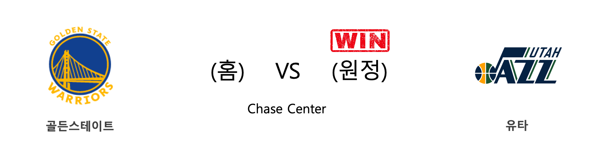
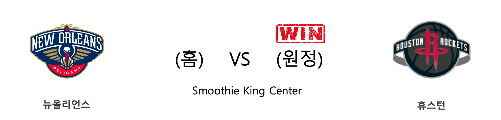
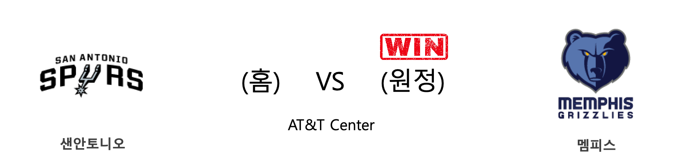
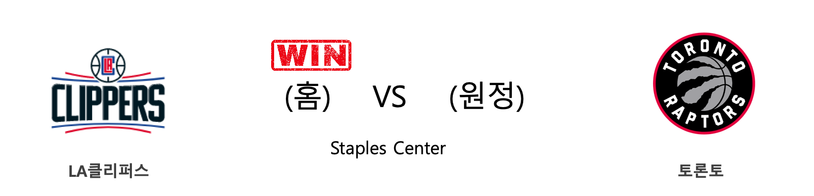

####  BOS(홈) VS DAL(원정) 

<table class="tg">
  <tr>
    <th class="tg-rr9t">BOS</th>
    <th class="tg-rr9t">팀</th>
    <th class="tg-rr9t">DAL</th>
  </tr>
  <tr>
    <td class="tg-dcpn">1승 0패</td>
    <td class="tg-rr9t">시즌 상대전적</td>
    <td class="tg-dcpn">0승 1패</td>
  </tr>
  <tr>
    <td class="tg-dcpn">116</td>
    <td class="tg-rr9t">점수</td>
    <td class="tg-dcpn">106</td>
  </tr>
  <tr>
    <td class="tg-dcpn">26/51(51%)</td>
    <td class="tg-rr9t">2점(%)</td>
    <td class="tg-dcpn">26/47(55%)</td>
  </tr>
  <tr>
    <td class="tg-dcpn">15/35(43%)</td>
    <td class="tg-rr9t">3점(%)</td>
    <td class="tg-dcpn">11/42(26%)</td>
  </tr>
  <tr>
    <td class="tg-dcpn">19/25(76%)</td>
    <td class="tg-rr9t">자유투(%)</td>
    <td class="tg-dcpn">21/28(75%)</td>
  </tr>
  <tr>
    <td class="tg-dcpn">46</td>
    <td class="tg-rr9t">리바운드</td>
    <td class="tg-dcpn">46</td>
  </tr>
  <tr>
    <td class="tg-dcpn">25</td>
    <td class="tg-rr9t">어시스트</td>
    <td class="tg-dcpn">22</td>
  </tr>
  <tr>
    <td class="tg-dcpn">4</td>
    <td class="tg-rr9t">스틸</td>
    <td class="tg-dcpn">2</td>
  </tr>
  <tr>
    <td class="tg-dcpn">5</td>
    <td class="tg-rr9t">블록</td>
    <td class="tg-dcpn">5</td>
  </tr>
  <tr>
    <td class="tg-dcpn">9</td>
    <td class="tg-rr9t">턴오버</td>
    <td class="tg-dcpn">6</td>
  </tr>
  <tr>
    <td class="tg-dcpn">JaylenBrownF(25) KembaWalkerG(29) MarcusSmartG(17)</td>
    <td class="tg-rr9t">주요 득점선수</td>
    <td class="tg-dcpn">LukaDoncicG(34) MaxiKleberC(15)</td>
  </tr>
</table>

#### 경기 관련 주요 기사         

[[오늘의 NBA] (10/31) HOU vs WAS, NBA 득점 쟁탈전 역사를 새로 쓰다](http://sports.news.naver.com/basketball/news/read.nhn?oid=486&aid=0000001123)

[[오늘의 NBA] (11/9) 위긴스 vs 러셀, 타깃 센터의 명승부](http://sports.news.naver.com/basketball/news/read.nhn?oid=486&aid=0000001132)

[[오늘의 NBA] (10/26) 루카 돈치치, 댈러스의 해결사](http://sports.news.naver.com/basketball/news/read.nhn?oid=486&aid=0000001118)

[[오늘의 NBA] (11/12) 샌안토니오와 토니 파커의 마지막 동반 여행](http://sports.news.naver.com/basketball/news/read.nhn?oid=486&aid=0000001135)

[[오늘의 NBA] (10/30) 앤써니 데이비스, 골드&퍼플 군단의 새로운 태양](http://sports.news.naver.com/basketball/news/read.nhn?oid=486&aid=0000001122)

        
        

####  GSW(홈) VS UTA(원정) 

<table class="tg">
  <tr>
    <th class="tg-rr9t">GSW</th>
    <th class="tg-rr9t">팀</th>
    <th class="tg-rr9t">UTA</th>
  </tr>
  <tr>
    <td class="tg-dcpn">0승 1패</td>
    <td class="tg-rr9t">시즌 상대전적</td>
    <td class="tg-dcpn">1승 0패</td>
  </tr>
  <tr>
    <td class="tg-dcpn">108</td>
    <td class="tg-rr9t">점수</td>
    <td class="tg-dcpn">122</td>
  </tr>
  <tr>
    <td class="tg-dcpn">35/63(56%)</td>
    <td class="tg-rr9t">2점(%)</td>
    <td class="tg-dcpn">24/46(52%)</td>
  </tr>
  <tr>
    <td class="tg-dcpn">10/31(32%)</td>
    <td class="tg-rr9t">3점(%)</td>
    <td class="tg-dcpn">16/35(46%)</td>
  </tr>
  <tr>
    <td class="tg-dcpn">8/14(57%)</td>
    <td class="tg-rr9t">자유투(%)</td>
    <td class="tg-dcpn">26/32(81%)</td>
  </tr>
  <tr>
    <td class="tg-dcpn">44</td>
    <td class="tg-rr9t">리바운드</td>
    <td class="tg-dcpn">43</td>
  </tr>
  <tr>
    <td class="tg-dcpn">23</td>
    <td class="tg-rr9t">어시스트</td>
    <td class="tg-dcpn">30</td>
  </tr>
  <tr>
    <td class="tg-dcpn">8</td>
    <td class="tg-rr9t">스틸</td>
    <td class="tg-dcpn">3</td>
  </tr>
  <tr>
    <td class="tg-dcpn">2</td>
    <td class="tg-rr9t">블록</td>
    <td class="tg-dcpn">3</td>
  </tr>
  <tr>
    <td class="tg-dcpn">10</td>
    <td class="tg-rr9t">턴오버</td>
    <td class="tg-dcpn">12</td>
  </tr>
  <tr>
    <td class="tg-dcpn">D'AngeloRussellG(33)</td>
    <td class="tg-rr9t">주요 득점선수</td>
    <td class="tg-dcpn">DonovanMitchellG(23) MikeConleyG(22) RudyGobertC(25)</td>
  </tr>
</table>

#### 경기 관련 주요 기사         

[[오늘의 NBA] 시즌 프리뷰 : 디트로이트, 슈팅 문제를 극복하라!](http://sports.news.naver.com/basketball/news/read.nhn?oid=486&aid=0000001096)

[[오늘의 NBA] (11/2) 르브론 제임스의 왕권신수설](http://sports.news.naver.com/basketball/news/read.nhn?oid=486&aid=0000001125)

[[오늘의 NBA] (11/9) 위긴스 vs 러셀, 타깃 센터의 명승부](http://sports.news.naver.com/basketball/news/read.nhn?oid=486&aid=0000001132)

[[오늘의 NBA] (10/31) HOU vs WAS, NBA 득점 쟁탈전 역사를 새로 쓰다](http://sports.news.naver.com/basketball/news/read.nhn?oid=486&aid=0000001123)

[[오늘의 NBA] (10/28) 모란트 vs 어빙, 페덱스 포럼의 결투](http://sports.news.naver.com/basketball/news/read.nhn?oid=486&aid=0000001120)

        
        

####  DET(홈) VS MIN(원정) 

<table class="tg">
  <tr>
    <th class="tg-rr9t">DET</th>
    <th class="tg-rr9t">팀</th>
    <th class="tg-rr9t">MIN</th>
  </tr>
  <tr>
    <td class="tg-dcpn">0승 1패</td>
    <td class="tg-rr9t">시즌 상대전적</td>
    <td class="tg-dcpn">1승 0패</td>
  </tr>
  <tr>
    <td class="tg-dcpn">114</td>
    <td class="tg-rr9t">점수</td>
    <td class="tg-dcpn">120</td>
  </tr>
  <tr>
    <td class="tg-dcpn">23/55(42%)</td>
    <td class="tg-rr9t">2점(%)</td>
    <td class="tg-dcpn">30/55(55%)</td>
  </tr>
  <tr>
    <td class="tg-dcpn">16/32(50%)</td>
    <td class="tg-rr9t">3점(%)</td>
    <td class="tg-dcpn">15/34(44%)</td>
  </tr>
  <tr>
    <td class="tg-dcpn">20/25(80%)</td>
    <td class="tg-rr9t">자유투(%)</td>
    <td class="tg-dcpn">15/19(79%)</td>
  </tr>
  <tr>
    <td class="tg-dcpn">39</td>
    <td class="tg-rr9t">리바운드</td>
    <td class="tg-dcpn">45</td>
  </tr>
  <tr>
    <td class="tg-dcpn">25</td>
    <td class="tg-rr9t">어시스트</td>
    <td class="tg-dcpn">25</td>
  </tr>
  <tr>
    <td class="tg-dcpn">9</td>
    <td class="tg-rr9t">스틸</td>
    <td class="tg-dcpn">7</td>
  </tr>
  <tr>
    <td class="tg-dcpn">5</td>
    <td class="tg-rr9t">블록</td>
    <td class="tg-dcpn">6</td>
  </tr>
  <tr>
    <td class="tg-dcpn">17</td>
    <td class="tg-rr9t">턴오버</td>
    <td class="tg-dcpn">16</td>
  </tr>
  <tr>
    <td class="tg-dcpn">LangstonGalloway(18) TonySnellF(16) BlakeGriffinF(19) LukeKennardG(25)</td>
    <td class="tg-rr9t">주요 득점선수</td>
    <td class="tg-dcpn">AndrewWigginsG(33) JakeLayman(16) Karl-AnthonyTownsC(25)</td>
  </tr>
</table>

#### 경기 관련 주요 기사         

[[오늘의 NBA] (10/31) HOU vs WAS, NBA 득점 쟁탈전 역사를 새로 쓰다](http://sports.news.naver.com/basketball/news/read.nhn?oid=486&aid=0000001123)

['My Guide Min Woo...' 김야니, 인스타그램을 통해 근황 공개](http://www.sisamagazine.co.kr/news/articleView.html?idxno=219581)

[Here’s What We Learned in N.F.L. Week 1](https://www.nytimes.com/2019/09/08/sports/football/nfl-week-1.html?partner=naver)

[[오늘의 NBA] (11/12) 샌안토니오와 토니 파커의 마지막 동반 여행](http://sports.news.naver.com/basketball/news/read.nhn?oid=486&aid=0000001135)

        
        

####  NOP(홈) VS HOU(원정) 

<table class="tg">
  <tr>
    <th class="tg-rr9t">NOP</th>
    <th class="tg-rr9t">팀</th>
    <th class="tg-rr9t">HOU</th>
  </tr>
  <tr>
    <td class="tg-dcpn">0승 2패</td>
    <td class="tg-rr9t">시즌 상대전적</td>
    <td class="tg-dcpn">2승 0패</td>
  </tr>
  <tr>
    <td class="tg-dcpn">116</td>
    <td class="tg-rr9t">점수</td>
    <td class="tg-dcpn">122</td>
  </tr>
  <tr>
    <td class="tg-dcpn">27/50(54%)</td>
    <td class="tg-rr9t">2점(%)</td>
    <td class="tg-dcpn">32/44(73%)</td>
  </tr>
  <tr>
    <td class="tg-dcpn">14/45(31%)</td>
    <td class="tg-rr9t">3점(%)</td>
    <td class="tg-dcpn">12/41(29%)</td>
  </tr>
  <tr>
    <td class="tg-dcpn">20/27(74%)</td>
    <td class="tg-rr9t">자유투(%)</td>
    <td class="tg-dcpn">22/32(69%)</td>
  </tr>
  <tr>
    <td class="tg-dcpn">46</td>
    <td class="tg-rr9t">리바운드</td>
    <td class="tg-dcpn">47</td>
  </tr>
  <tr>
    <td class="tg-dcpn">26</td>
    <td class="tg-rr9t">어시스트</td>
    <td class="tg-dcpn">16</td>
  </tr>
  <tr>
    <td class="tg-dcpn">8</td>
    <td class="tg-rr9t">스틸</td>
    <td class="tg-dcpn">9</td>
  </tr>
  <tr>
    <td class="tg-dcpn">3</td>
    <td class="tg-rr9t">블록</td>
    <td class="tg-dcpn">6</td>
  </tr>
  <tr>
    <td class="tg-dcpn">16</td>
    <td class="tg-rr9t">턴오버</td>
    <td class="tg-dcpn">17</td>
  </tr>
  <tr>
    <td class="tg-dcpn">JrueHolidayG(18) JoshHartF(19) JJRedickG(24)</td>
    <td class="tg-rr9t">주요 득점선수</td>
    <td class="tg-dcpn">JamesHardenG(39) RussellWestbrookG(26) EricGordon(17)</td>
  </tr>
</table>

#### 경기 관련 주요 기사         

[[오늘의 NBA] (11/7) 야니스 아테토쿤보의 MVP 수성 의지](http://sports.news.naver.com/basketball/news/read.nhn?oid=486&aid=0000001130)

[[오늘의 NBA] (11/12) 샌안토니오와 토니 파커의 마지막 동반 여행](http://sports.news.naver.com/basketball/news/read.nhn?oid=486&aid=0000001135)

[[오늘의 NBA] (11/10) 제임스 하든의 3점 라인 영점 사격](http://sports.news.naver.com/basketball/news/read.nhn?oid=486&aid=0000001133)

[[오늘의 NBA] (11/11) 토론토, 디펜딩 챔피언의 저력](http://sports.news.naver.com/basketball/news/read.nhn?oid=486&aid=0000001134)

[[오늘의 NBA] (11/9) 위긴스 vs 러셀, 타깃 센터의 명승부](http://sports.news.naver.com/basketball/news/read.nhn?oid=486&aid=0000001132)

        
        

####  SAS(홈) VS MEM(원정) 

<table class="tg">
  <tr>
    <th class="tg-rr9t">SAS</th>
    <th class="tg-rr9t">팀</th>
    <th class="tg-rr9t">MEM</th>
  </tr>
  <tr>
    <td class="tg-dcpn">0승 1패</td>
    <td class="tg-rr9t">시즌 상대전적</td>
    <td class="tg-dcpn">1승 0패</td>
  </tr>
  <tr>
    <td class="tg-dcpn">109</td>
    <td class="tg-rr9t">점수</td>
    <td class="tg-dcpn">113</td>
  </tr>
  <tr>
    <td class="tg-dcpn">30/60(50%)</td>
    <td class="tg-rr9t">2점(%)</td>
    <td class="tg-dcpn">33/59(56%)</td>
  </tr>
  <tr>
    <td class="tg-dcpn">12/30(40%)</td>
    <td class="tg-rr9t">3점(%)</td>
    <td class="tg-dcpn">11/28(39%)</td>
  </tr>
  <tr>
    <td class="tg-dcpn">13/17(76%)</td>
    <td class="tg-rr9t">자유투(%)</td>
    <td class="tg-dcpn">14/20(70%)</td>
  </tr>
  <tr>
    <td class="tg-dcpn">42</td>
    <td class="tg-rr9t">리바운드</td>
    <td class="tg-dcpn">47</td>
  </tr>
  <tr>
    <td class="tg-dcpn">29</td>
    <td class="tg-rr9t">어시스트</td>
    <td class="tg-dcpn">32</td>
  </tr>
  <tr>
    <td class="tg-dcpn">4</td>
    <td class="tg-rr9t">스틸</td>
    <td class="tg-dcpn">7</td>
  </tr>
  <tr>
    <td class="tg-dcpn">4</td>
    <td class="tg-rr9t">블록</td>
    <td class="tg-dcpn">5</td>
  </tr>
  <tr>
    <td class="tg-dcpn">13</td>
    <td class="tg-rr9t">턴오버</td>
    <td class="tg-dcpn">11</td>
  </tr>
  <tr>
    <td class="tg-dcpn">RudyGay(18) DerrickWhite(15) LaMarcusAldridgeF(19)</td>
    <td class="tg-rr9t">주요 득점선수</td>
    <td class="tg-dcpn">DillonBrooksG(21) JarenJacksonJr.F(24) JonasValanciunasC(18)</td>
  </tr>
</table>

#### 경기 관련 주요 기사         

[[오늘의 NBA] (10/24) 앤드류 위긴스, 위기 상황에서 웃는 일류 승부사](http://sports.news.naver.com/basketball/news/read.nhn?oid=486&aid=0000001116)

[[오늘의 NBA] (10/30) 앤써니 데이비스, 골드&퍼플 군단의 새로운 태양](http://sports.news.naver.com/basketball/news/read.nhn?oid=486&aid=0000001122)

[[오늘의 NBA] (10/28) 모란트 vs 어빙, 페덱스 포럼의 결투](http://sports.news.naver.com/basketball/news/read.nhn?oid=486&aid=0000001120)

[[오늘의 NBA] (11/9) 위긴스 vs 러셀, 타깃 센터의 명승부](http://sports.news.naver.com/basketball/news/read.nhn?oid=486&aid=0000001132)

[[오늘의 NBA] (11/12) 샌안토니오와 토니 파커의 마지막 동반 여행](http://sports.news.naver.com/basketball/news/read.nhn?oid=486&aid=0000001135)

        
        

####  LAC(홈) VS TOR(원정) 

<table class="tg">
  <tr>
    <th class="tg-rr9t">LAC</th>
    <th class="tg-rr9t">팀</th>
    <th class="tg-rr9t">TOR</th>
  </tr>
  <tr>
    <td class="tg-dcpn">1승 0패</td>
    <td class="tg-rr9t">시즌 상대전적</td>
    <td class="tg-dcpn">0승 1패</td>
  </tr>
  <tr>
    <td class="tg-dcpn">98</td>
    <td class="tg-rr9t">점수</td>
    <td class="tg-dcpn">88</td>
  </tr>
  <tr>
    <td class="tg-dcpn">26/56(46%)</td>
    <td class="tg-rr9t">2점(%)</td>
    <td class="tg-dcpn">23/55(42%)</td>
  </tr>
  <tr>
    <td class="tg-dcpn">8/36(22%)</td>
    <td class="tg-rr9t">3점(%)</td>
    <td class="tg-dcpn">11/30(37%)</td>
  </tr>
  <tr>
    <td class="tg-dcpn">22/30(73%)</td>
    <td class="tg-rr9t">자유투(%)</td>
    <td class="tg-dcpn">9/15(60%)</td>
  </tr>
  <tr>
    <td class="tg-dcpn">66</td>
    <td class="tg-rr9t">리바운드</td>
    <td class="tg-dcpn">38</td>
  </tr>
  <tr>
    <td class="tg-dcpn">25</td>
    <td class="tg-rr9t">어시스트</td>
    <td class="tg-dcpn">25</td>
  </tr>
  <tr>
    <td class="tg-dcpn">9</td>
    <td class="tg-rr9t">스틸</td>
    <td class="tg-dcpn">9</td>
  </tr>
  <tr>
    <td class="tg-dcpn">7</td>
    <td class="tg-rr9t">블록</td>
    <td class="tg-dcpn">8</td>
  </tr>
  <tr>
    <td class="tg-dcpn">19</td>
    <td class="tg-rr9t">턴오버</td>
    <td class="tg-dcpn">15</td>
  </tr>
  <tr>
    <td class="tg-dcpn">LouWilliams(21)</td>
    <td class="tg-rr9t">주요 득점선수</td>
    <td class="tg-dcpn">NormanPowellG(15) PascalSiakamF(16)</td>
  </tr>
</table>

#### 경기 관련 주요 기사         

[[오늘의 NBA] (11/9) 위긴스 vs 러셀, 타깃 센터의 명승부](http://sports.news.naver.com/basketball/news/read.nhn?oid=486&aid=0000001132)

[[오늘의 NBA] (11/7) 야니스 아테토쿤보의 MVP 수성 의지](http://sports.news.naver.com/basketball/news/read.nhn?oid=486&aid=0000001130)

[시아캄, 레너드 모두 웃었다… TOR-LAC 나란히 개막전 승리(종합)](http://www.rookie.co.kr/news/articleView.html?idxno=33970)

[[오늘의 NBA] (11/12) 샌안토니오와 토니 파커의 마지막 동반 여행](http://sports.news.naver.com/basketball/news/read.nhn?oid=486&aid=0000001135)

[[오늘의 NBA] (11/11) 토론토, 디펜딩 챔피언의 저력](http://sports.news.naver.com/basketball/news/read.nhn?oid=486&aid=0000001134)

        
        

#### 리그 (Eastern) 순위
    

<table class="tg">
  <tr>
    <th class="tg-d14o">순위</th>
    <th class="tg-d14o">팀명</th>
    <th class="tg-d14o">경기수</th>
    <th class="tg-d14o">승</th>
    <th class="tg-d14o">패</th>
    <th class="tg-d14o">승차</th>
    <th class="tg-d14o">승률</th>
  </tr>
  
<tr>
    <td class="tg-50j8">1</td>
    <td class="tg-50j8">BOS</td>
    <td class="tg-50j8">9</td>
    <td class="tg-50j8">8</td>
    <td class="tg-50j8">1</td>
    <td class="tg-50j8">0</td>
    <td class="tg-50j8">0.889</td>
</tr>

<tr>
    <td class="tg-50j8">2</td>
    <td class="tg-50j8">MIL</td>
    <td class="tg-50j8">10</td>
    <td class="tg-50j8">7</td>
    <td class="tg-50j8">3</td>
    <td class="tg-50j8">1</td>
    <td class="tg-50j8">0.7</td>
</tr>

<tr>
    <td class="tg-50j8">2</td>
    <td class="tg-50j8">TOR</td>
    <td class="tg-50j8">10</td>
    <td class="tg-50j8">7</td>
    <td class="tg-50j8">3</td>
    <td class="tg-50j8">1</td>
    <td class="tg-50j8">0.7</td>
</tr>

<tr>
    <td class="tg-50j8">4</td>
    <td class="tg-50j8">MIA</td>
    <td class="tg-50j8">9</td>
    <td class="tg-50j8">6</td>
    <td class="tg-50j8">3</td>
    <td class="tg-50j8">2</td>
    <td class="tg-50j8">0.667</td>
</tr>

<tr>
    <td class="tg-50j8">4</td>
    <td class="tg-50j8">PHI</td>
    <td class="tg-50j8">9</td>
    <td class="tg-50j8">6</td>
    <td class="tg-50j8">3</td>
    <td class="tg-50j8">2</td>
    <td class="tg-50j8">0.667</td>
</tr>

<tr>
    <td class="tg-50j8">6</td>
    <td class="tg-50j8">IND</td>
    <td class="tg-50j8">10</td>
    <td class="tg-50j8">6</td>
    <td class="tg-50j8">4</td>
    <td class="tg-50j8">2</td>
    <td class="tg-50j8">0.6</td>
</tr>

<tr>
    <td class="tg-50j8">7</td>
    <td class="tg-50j8">CLE</td>
    <td class="tg-50j8">9</td>
    <td class="tg-50j8">4</td>
    <td class="tg-50j8">5</td>
    <td class="tg-50j8">4</td>
    <td class="tg-50j8">0.444</td>
</tr>

<tr>
    <td class="tg-50j8">7</td>
    <td class="tg-50j8">BKN</td>
    <td class="tg-50j8">9</td>
    <td class="tg-50j8">4</td>
    <td class="tg-50j8">5</td>
    <td class="tg-50j8">4</td>
    <td class="tg-50j8">0.444</td>
</tr>

<tr>
    <td class="tg-50j8">9</td>
    <td class="tg-50j8">CHA</td>
    <td class="tg-50j8">10</td>
    <td class="tg-50j8">4</td>
    <td class="tg-50j8">6</td>
    <td class="tg-50j8">4</td>
    <td class="tg-50j8">0.4</td>
</tr>

<tr>
    <td class="tg-50j8">10</td>
    <td class="tg-50j8">DET</td>
    <td class="tg-50j8">11</td>
    <td class="tg-50j8">4</td>
    <td class="tg-50j8">7</td>
    <td class="tg-50j8">4</td>
    <td class="tg-50j8">0.364</td>
</tr>

<tr>
    <td class="tg-50j8">11</td>
    <td class="tg-50j8">ATL</td>
    <td class="tg-50j8">9</td>
    <td class="tg-50j8">3</td>
    <td class="tg-50j8">6</td>
    <td class="tg-50j8">5</td>
    <td class="tg-50j8">0.333</td>
</tr>

<tr>
    <td class="tg-50j8">12</td>
    <td class="tg-50j8">CHI</td>
    <td class="tg-50j8">10</td>
    <td class="tg-50j8">3</td>
    <td class="tg-50j8">7</td>
    <td class="tg-50j8">5</td>
    <td class="tg-50j8">0.3</td>
</tr>

<tr>
    <td class="tg-50j8">12</td>
    <td class="tg-50j8">ORL</td>
    <td class="tg-50j8">10</td>
    <td class="tg-50j8">3</td>
    <td class="tg-50j8">7</td>
    <td class="tg-50j8">5</td>
    <td class="tg-50j8">0.3</td>
</tr>

<tr>
    <td class="tg-50j8">14</td>
    <td class="tg-50j8">WAS</td>
    <td class="tg-50j8">8</td>
    <td class="tg-50j8">2</td>
    <td class="tg-50j8">6</td>
    <td class="tg-50j8">6</td>
    <td class="tg-50j8">0.25</td>
</tr>

<tr>
    <td class="tg-50j8">15</td>
    <td class="tg-50j8">NYK</td>
    <td class="tg-50j8">10</td>
    <td class="tg-50j8">2</td>
    <td class="tg-50j8">8</td>
    <td class="tg-50j8">6</td>
    <td class="tg-50j8">0.2</td>
</tr>
</table> 
#### 리그 (Western) 순위
    

<table class="tg">
  <tr>
    <th class="tg-d14o">순위</th>
    <th class="tg-d14o">팀명</th>
    <th class="tg-d14o">경기수</th>
    <th class="tg-d14o">승</th>
    <th class="tg-d14o">패</th>
    <th class="tg-d14o">승차</th>
    <th class="tg-d14o">승률</th>
  </tr>
  
<tr>
    <td class="tg-50j8">1</td>
    <td class="tg-50j8">DEN</td>
    <td class="tg-50j8">9</td>
    <td class="tg-50j8">7</td>
    <td class="tg-50j8">2</td>
    <td class="tg-50j8">1</td>
    <td class="tg-50j8">0.778</td>
</tr>

<tr>
    <td class="tg-50j8">1</td>
    <td class="tg-50j8">LAL</td>
    <td class="tg-50j8">9</td>
    <td class="tg-50j8">7</td>
    <td class="tg-50j8">2</td>
    <td class="tg-50j8">1</td>
    <td class="tg-50j8">0.778</td>
</tr>

<tr>
    <td class="tg-50j8">3</td>
    <td class="tg-50j8">LAC</td>
    <td class="tg-50j8">10</td>
    <td class="tg-50j8">7</td>
    <td class="tg-50j8">3</td>
    <td class="tg-50j8">1</td>
    <td class="tg-50j8">0.7</td>
</tr>

<tr>
    <td class="tg-50j8">3</td>
    <td class="tg-50j8">HOU</td>
    <td class="tg-50j8">10</td>
    <td class="tg-50j8">7</td>
    <td class="tg-50j8">3</td>
    <td class="tg-50j8">1</td>
    <td class="tg-50j8">0.7</td>
</tr>

<tr>
    <td class="tg-50j8">3</td>
    <td class="tg-50j8">UTA</td>
    <td class="tg-50j8">10</td>
    <td class="tg-50j8">7</td>
    <td class="tg-50j8">3</td>
    <td class="tg-50j8">1</td>
    <td class="tg-50j8">0.7</td>
</tr>

<tr>
    <td class="tg-50j8">6</td>
    <td class="tg-50j8">PHX</td>
    <td class="tg-50j8">9</td>
    <td class="tg-50j8">6</td>
    <td class="tg-50j8">3</td>
    <td class="tg-50j8">2</td>
    <td class="tg-50j8">0.667</td>
</tr>

<tr>
    <td class="tg-50j8">7</td>
    <td class="tg-50j8">DAL</td>
    <td class="tg-50j8">10</td>
    <td class="tg-50j8">6</td>
    <td class="tg-50j8">4</td>
    <td class="tg-50j8">2</td>
    <td class="tg-50j8">0.6</td>
</tr>

<tr>
    <td class="tg-50j8">7</td>
    <td class="tg-50j8">MIN</td>
    <td class="tg-50j8">10</td>
    <td class="tg-50j8">6</td>
    <td class="tg-50j8">4</td>
    <td class="tg-50j8">2</td>
    <td class="tg-50j8">0.6</td>
</tr>

<tr>
    <td class="tg-50j8">9</td>
    <td class="tg-50j8">SAS</td>
    <td class="tg-50j8">10</td>
    <td class="tg-50j8">5</td>
    <td class="tg-50j8">5</td>
    <td class="tg-50j8">3</td>
    <td class="tg-50j8">0.5</td>
</tr>

<tr>
    <td class="tg-50j8">10</td>
    <td class="tg-50j8">POR</td>
    <td class="tg-50j8">10</td>
    <td class="tg-50j8">4</td>
    <td class="tg-50j8">6</td>
    <td class="tg-50j8">4</td>
    <td class="tg-50j8">0.4</td>
</tr>

<tr>
    <td class="tg-50j8">10</td>
    <td class="tg-50j8">OKC</td>
    <td class="tg-50j8">10</td>
    <td class="tg-50j8">4</td>
    <td class="tg-50j8">6</td>
    <td class="tg-50j8">4</td>
    <td class="tg-50j8">0.4</td>
</tr>

<tr>
    <td class="tg-50j8">12</td>
    <td class="tg-50j8">SAC</td>
    <td class="tg-50j8">9</td>
    <td class="tg-50j8">3</td>
    <td class="tg-50j8">6</td>
    <td class="tg-50j8">5</td>
    <td class="tg-50j8">0.333</td>
</tr>

<tr>
    <td class="tg-50j8">13</td>
    <td class="tg-50j8">MEM</td>
    <td class="tg-50j8">10</td>
    <td class="tg-50j8">3</td>
    <td class="tg-50j8">7</td>
    <td class="tg-50j8">5</td>
    <td class="tg-50j8">0.3</td>
</tr>

<tr>
    <td class="tg-50j8">14</td>
    <td class="tg-50j8">NOP</td>
    <td class="tg-50j8">10</td>
    <td class="tg-50j8">2</td>
    <td class="tg-50j8">8</td>
    <td class="tg-50j8">6</td>
    <td class="tg-50j8">0.2</td>
</tr>

<tr>
    <td class="tg-50j8">15</td>
    <td class="tg-50j8">GSW</td>
    <td class="tg-50j8">11</td>
    <td class="tg-50j8">2</td>
    <td class="tg-50j8">9</td>
    <td class="tg-50j8">6</td>
    <td class="tg-50j8">0.182</td>
</tr>
</table> 

        
        
