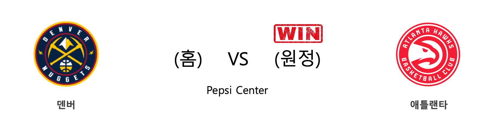

####  DEN(홈) VS ATL(원정) 

<table class="tg">
  <tr>
    <th class="tg-rr9t">DEN</th>
    <th class="tg-rr9t">팀</th>
    <th class="tg-rr9t">ATL</th>
  </tr>
  <tr>
    <td class="tg-dcpn">0승 1패</td>
    <td class="tg-rr9t">시즌 상대전적</td>
    <td class="tg-dcpn">1승 0패</td>
  </tr>
  <tr>
    <td class="tg-dcpn">121</td>
    <td class="tg-rr9t">점수</td>
    <td class="tg-dcpn">125</td>
  </tr>
  <tr>
    <td class="tg-dcpn">35/63(56%)</td>
    <td class="tg-rr9t">2점(%)</td>
    <td class="tg-dcpn">29/49(59%)</td>
  </tr>
  <tr>
    <td class="tg-dcpn">11/41(27%)</td>
    <td class="tg-rr9t">3점(%)</td>
    <td class="tg-dcpn">15/34(44%)</td>
  </tr>
  <tr>
    <td class="tg-dcpn">18/22(82%)</td>
    <td class="tg-rr9t">자유투(%)</td>
    <td class="tg-dcpn">22/34(65%)</td>
  </tr>
  <tr>
    <td class="tg-dcpn">40</td>
    <td class="tg-rr9t">리바운드</td>
    <td class="tg-dcpn">45</td>
  </tr>
  <tr>
    <td class="tg-dcpn">31</td>
    <td class="tg-rr9t">어시스트</td>
    <td class="tg-dcpn">30</td>
  </tr>
  <tr>
    <td class="tg-dcpn">7</td>
    <td class="tg-rr9t">스틸</td>
    <td class="tg-dcpn">1</td>
  </tr>
  <tr>
    <td class="tg-dcpn">5</td>
    <td class="tg-rr9t">블록</td>
    <td class="tg-dcpn">5</td>
  </tr>
  <tr>
    <td class="tg-dcpn">3</td>
    <td class="tg-rr9t">턴오버</td>
    <td class="tg-dcpn">14</td>
  </tr>
  <tr>
    <td class="tg-dcpn">NikolaJokicC(20) PaulMillsapF(19) WillBartonF(21) JamalMurrayG(18)</td>
    <td class="tg-rr9t">주요 득점선수</td>
    <td class="tg-dcpn">JabariParkerF(20) AlexLen(17) TraeYoungG(42)</td>
  </tr>
</table>

#### 경기 관련 주요 기사         

[[오늘의 NBA] (10/30) 앤써니 데이비스, 골드&퍼플 군단의 새로운 태양](http://sports.news.naver.com/basketball/news/read.nhn?oid=486&aid=0000001122)

[[오늘의 NBA] 시즌 프리뷰 : 클리퍼스의 과감한 베팅](http://sports.news.naver.com/basketball/news/read.nhn?oid=486&aid=0000001100)

[[오늘의 NBA] (11/11) 토론토, 디펜딩 챔피언의 저력](http://sports.news.naver.com/basketball/news/read.nhn?oid=486&aid=0000001134)

[[오늘의 NBA] (11/9) 위긴스 vs 러셀, 타깃 센터의 명승부](http://sports.news.naver.com/basketball/news/read.nhn?oid=486&aid=0000001132)

[[오늘의 NBA] (11/1) MIA 에릭 스포엘스트라 감독의 승리 설계](http://sports.news.naver.com/basketball/news/read.nhn?oid=486&aid=0000001124)

        
        

####  SAC(홈) VS POR(원정) 

<table class="tg">
  <tr>
    <th class="tg-rr9t">SAC</th>
    <th class="tg-rr9t">팀</th>
    <th class="tg-rr9t">POR</th>
  </tr>
  <tr>
    <td class="tg-dcpn">1승 1패</td>
    <td class="tg-rr9t">시즌 상대전적</td>
    <td class="tg-dcpn">1승 1패</td>
  </tr>
  <tr>
    <td class="tg-dcpn">107</td>
    <td class="tg-rr9t">점수</td>
    <td class="tg-dcpn">99</td>
  </tr>
  <tr>
    <td class="tg-dcpn">27/54(50%)</td>
    <td class="tg-rr9t">2점(%)</td>
    <td class="tg-dcpn">26/47(55%)</td>
  </tr>
  <tr>
    <td class="tg-dcpn">11/32(34%)</td>
    <td class="tg-rr9t">3점(%)</td>
    <td class="tg-dcpn">8/30(27%)</td>
  </tr>
  <tr>
    <td class="tg-dcpn">20/26(77%)</td>
    <td class="tg-rr9t">자유투(%)</td>
    <td class="tg-dcpn">23/30(77%)</td>
  </tr>
  <tr>
    <td class="tg-dcpn">46</td>
    <td class="tg-rr9t">리바운드</td>
    <td class="tg-dcpn">40</td>
  </tr>
  <tr>
    <td class="tg-dcpn">24</td>
    <td class="tg-rr9t">어시스트</td>
    <td class="tg-dcpn">15</td>
  </tr>
  <tr>
    <td class="tg-dcpn">9</td>
    <td class="tg-rr9t">스틸</td>
    <td class="tg-dcpn">4</td>
  </tr>
  <tr>
    <td class="tg-dcpn">5</td>
    <td class="tg-rr9t">블록</td>
    <td class="tg-dcpn">5</td>
  </tr>
  <tr>
    <td class="tg-dcpn">14</td>
    <td class="tg-rr9t">턴오버</td>
    <td class="tg-dcpn">17</td>
  </tr>
  <tr>
    <td class="tg-dcpn">BogdanBogdanovic(25) NemanjaBjelicaF(19) BuddyHieldG(20) HarrisonBarnesF(16)</td>
    <td class="tg-rr9t">주요 득점선수</td>
    <td class="tg-dcpn">DamianLillardG(27) CJMcCollumG(24) HassanWhitesideC(17)</td>
  </tr>
</table>

#### 경기 관련 주요 기사         

[[오늘의 NBA] (11/7) 야니스 아테토쿤보의 MVP 수성 의지](http://sports.news.naver.com/basketball/news/read.nhn?oid=486&aid=0000001130)

[[오늘의 NBA] (11/5) 데빈 부커, 강팀의 에이스](http://sports.news.naver.com/basketball/news/read.nhn?oid=486&aid=0000001128)

[[오늘의 NBA] (11/9) 위긴스 vs 러셀, 타깃 센터의 명승부](http://sports.news.naver.com/basketball/news/read.nhn?oid=486&aid=0000001132)

[[오늘의 NBA] 시즌 프리뷰 : 새크라멘토, 13년을 소모한 기다림](http://sports.news.naver.com/basketball/news/read.nhn?oid=486&aid=0000001095)

[오늘의 NBA] (11/3) 안드레 드러먼드, 모터 시티의 세계수](http://sports.news.naver.com/basketball/news/read.nhn?oid=486&aid=0000001126)

        
        

####  MIA(홈) VS DET(원정) 

<table class="tg">
  <tr>
    <th class="tg-rr9t">MIA</th>
    <th class="tg-rr9t">팀</th>
    <th class="tg-rr9t">DET</th>
  </tr>
  <tr>
    <td class="tg-dcpn">1승 0패</td>
    <td class="tg-rr9t">시즌 상대전적</td>
    <td class="tg-dcpn">0승 1패</td>
  </tr>
  <tr>
    <td class="tg-dcpn">117</td>
    <td class="tg-rr9t">점수</td>
    <td class="tg-dcpn">108</td>
  </tr>
  <tr>
    <td class="tg-dcpn">27/45(60%)</td>
    <td class="tg-rr9t">2점(%)</td>
    <td class="tg-dcpn">19/37(51%)</td>
  </tr>
  <tr>
    <td class="tg-dcpn">14/32(44%)</td>
    <td class="tg-rr9t">3점(%)</td>
    <td class="tg-dcpn">15/41(37%)</td>
  </tr>
  <tr>
    <td class="tg-dcpn">21/27(78%)</td>
    <td class="tg-rr9t">자유투(%)</td>
    <td class="tg-dcpn">25/37(68%)</td>
  </tr>
  <tr>
    <td class="tg-dcpn">42</td>
    <td class="tg-rr9t">리바운드</td>
    <td class="tg-dcpn">32</td>
  </tr>
  <tr>
    <td class="tg-dcpn">34</td>
    <td class="tg-rr9t">어시스트</td>
    <td class="tg-dcpn">27</td>
  </tr>
  <tr>
    <td class="tg-dcpn">6</td>
    <td class="tg-rr9t">스틸</td>
    <td class="tg-dcpn">9</td>
  </tr>
  <tr>
    <td class="tg-dcpn">1</td>
    <td class="tg-rr9t">블록</td>
    <td class="tg-dcpn">9</td>
  </tr>
  <tr>
    <td class="tg-dcpn">19</td>
    <td class="tg-rr9t">턴오버</td>
    <td class="tg-dcpn">16</td>
  </tr>
  <tr>
    <td class="tg-dcpn">GoranDragic(18) BamAdebayoF(18) KendrickNunnG(20) JimmyButlerF(20)</td>
    <td class="tg-rr9t">주요 득점선수</td>
    <td class="tg-dcpn">AndreDrummondC(16) LukeKennardG(22) ChristianWood(16)</td>
  </tr>
</table>

#### 경기 관련 주요 기사         

[[메이저리그 투나잇] ‘CLE 연패’ AL WC 레이스, OAK·TB 2파전 양상](http://www.mbcsportsplus.com/news/?mode=view&cate=2&b_idx=99830289.000)

[[오늘의 NBA] (10/27) 불사조 군단의 2019-20시즌 출사표](http://sports.news.naver.com/basketball/news/read.nhn?oid=486&aid=0000001119)

[[오늘의 NBA] (11/4) 마이애미의 대권 도전 행보](http://sports.news.naver.com/basketball/news/read.nhn?oid=486&aid=0000001127)

[[오늘의 NBA] (10/31) HOU vs WAS, NBA 득점 쟁탈전 역사를 새로 쓰다](http://sports.news.naver.com/basketball/news/read.nhn?oid=486&aid=0000001123)

[[오늘의 NBA] 시즌 프리뷰 : 디트로이트, 슈팅 문제를 극복하라!](http://sports.news.naver.com/basketball/news/read.nhn?oid=486&aid=0000001096)

        
        

####  CHI(홈) VS NYK(원정) 

<table class="tg">
  <tr>
    <th class="tg-rr9t">CHI</th>
    <th class="tg-rr9t">팀</th>
    <th class="tg-rr9t">NYK</th>
  </tr>
  <tr>
    <td class="tg-dcpn">1승 1패</td>
    <td class="tg-rr9t">시즌 상대전적</td>
    <td class="tg-dcpn">1승 1패</td>
  </tr>
  <tr>
    <td class="tg-dcpn">120</td>
    <td class="tg-rr9t">점수</td>
    <td class="tg-dcpn">102</td>
  </tr>
  <tr>
    <td class="tg-dcpn">27/48(56%)</td>
    <td class="tg-rr9t">2점(%)</td>
    <td class="tg-dcpn">26/56(46%)</td>
  </tr>
  <tr>
    <td class="tg-dcpn">14/33(42%)</td>
    <td class="tg-rr9t">3점(%)</td>
    <td class="tg-dcpn">10/32(31%)</td>
  </tr>
  <tr>
    <td class="tg-dcpn">24/31(77%)</td>
    <td class="tg-rr9t">자유투(%)</td>
    <td class="tg-dcpn">20/31(65%)</td>
  </tr>
  <tr>
    <td class="tg-dcpn">46</td>
    <td class="tg-rr9t">리바운드</td>
    <td class="tg-dcpn">38</td>
  </tr>
  <tr>
    <td class="tg-dcpn">22</td>
    <td class="tg-rr9t">어시스트</td>
    <td class="tg-dcpn">27</td>
  </tr>
  <tr>
    <td class="tg-dcpn">9</td>
    <td class="tg-rr9t">스틸</td>
    <td class="tg-dcpn">12</td>
  </tr>
  <tr>
    <td class="tg-dcpn">2</td>
    <td class="tg-rr9t">블록</td>
    <td class="tg-dcpn">1</td>
  </tr>
  <tr>
    <td class="tg-dcpn">19</td>
    <td class="tg-rr9t">턴오버</td>
    <td class="tg-dcpn">18</td>
  </tr>
  <tr>
    <td class="tg-dcpn">WendellCarterJr.C(17) ZachLaVineG(25) CobyWhite(27)</td>
    <td class="tg-rr9t">주요 득점선수</td>
    <td class="tg-dcpn">RJBarrettG(21) JuliusRandleF(17) TajGibsonC(17) MarcusMorrisSr.F(22)</td>
  </tr>
</table>

#### 경기 관련 주요 기사         

[[오늘의 NBA] (11/7) 야니스 아테토쿤보의 MVP 수성 의지](http://sports.news.naver.com/basketball/news/read.nhn?oid=486&aid=0000001130)

[[오늘의 NBA] (10/31) HOU vs WAS, NBA 득점 쟁탈전 역사를 새로 쓰다](http://sports.news.naver.com/basketball/news/read.nhn?oid=486&aid=0000001123)

[[오늘의 NBA] (10/26) 루카 돈치치, 댈러스의 해결사](http://sports.news.naver.com/basketball/news/read.nhn?oid=486&aid=0000001118)

[[오늘의 NBA] (10/29) 조엘 엠비드, 필라델피아의 괴수](http://sports.news.naver.com/basketball/news/read.nhn?oid=486&aid=0000001121)

[[오늘의 NBA] (11/10) 제임스 하든의 3점 라인 영점 사격](http://sports.news.naver.com/basketball/news/read.nhn?oid=486&aid=0000001133)

        
        

####  UTA(홈) VS BKN(원정) 

<table class="tg">
  <tr>
    <th class="tg-rr9t">UTA</th>
    <th class="tg-rr9t">팀</th>
    <th class="tg-rr9t">BKN</th>
  </tr>
  <tr>
    <td class="tg-dcpn">1승 0패</td>
    <td class="tg-rr9t">시즌 상대전적</td>
    <td class="tg-dcpn">0승 1패</td>
  </tr>
  <tr>
    <td class="tg-dcpn">119</td>
    <td class="tg-rr9t">점수</td>
    <td class="tg-dcpn">114</td>
  </tr>
  <tr>
    <td class="tg-dcpn">37/66(56%)</td>
    <td class="tg-rr9t">2점(%)</td>
    <td class="tg-dcpn">30/53(57%)</td>
  </tr>
  <tr>
    <td class="tg-dcpn">6/26(23%)</td>
    <td class="tg-rr9t">3점(%)</td>
    <td class="tg-dcpn">11/37(30%)</td>
  </tr>
  <tr>
    <td class="tg-dcpn">27/35(77%)</td>
    <td class="tg-rr9t">자유투(%)</td>
    <td class="tg-dcpn">21/25(84%)</td>
  </tr>
  <tr>
    <td class="tg-dcpn">46</td>
    <td class="tg-rr9t">리바운드</td>
    <td class="tg-dcpn">43</td>
  </tr>
  <tr>
    <td class="tg-dcpn">16</td>
    <td class="tg-rr9t">어시스트</td>
    <td class="tg-dcpn">19</td>
  </tr>
  <tr>
    <td class="tg-dcpn">7</td>
    <td class="tg-rr9t">스틸</td>
    <td class="tg-dcpn">5</td>
  </tr>
  <tr>
    <td class="tg-dcpn">4</td>
    <td class="tg-rr9t">블록</td>
    <td class="tg-dcpn">8</td>
  </tr>
  <tr>
    <td class="tg-dcpn">11</td>
    <td class="tg-rr9t">턴오버</td>
    <td class="tg-dcpn">16</td>
  </tr>
  <tr>
    <td class="tg-dcpn">DonovanMitchellG(30) MikeConleyG(18) RudyGobertC(18) EmmanuelMudiay(15)</td>
    <td class="tg-rr9t">주요 득점선수</td>
    <td class="tg-dcpn">KyrieIrvingG(27) DeAndreJordan(15) TaureanPrinceF(15) SpencerDinwiddie(21)</td>
  </tr>
</table>

#### 경기 관련 주요 기사         

[[오늘의 NBA] (10/31) HOU vs WAS, NBA 득점 쟁탈전 역사를 새로 쓰다](http://sports.news.naver.com/basketball/news/read.nhn?oid=486&aid=0000001123)

[[오늘의 NBA] (11/2) 르브론 제임스의 왕권신수설](http://sports.news.naver.com/basketball/news/read.nhn?oid=486&aid=0000001125)

[[오늘의 NBA] (10/28) 모란트 vs 어빙, 페덱스 포럼의 결투](http://sports.news.naver.com/basketball/news/read.nhn?oid=486&aid=0000001120)

[[오늘의 NBA] 시즌 프리뷰 : 애틀랜타, 젊은이들의 양지](http://sports.news.naver.com/basketball/news/read.nhn?oid=486&aid=0000001086)

[[오늘의 NBA] (11/9) 위긴스 vs 러셀, 타깃 센터의 명승부](http://sports.news.naver.com/basketball/news/read.nhn?oid=486&aid=0000001132)

        
        

####  PHX(홈) VS LAL(원정) 

<table class="tg">
  <tr>
    <th class="tg-rr9t">PHX</th>
    <th class="tg-rr9t">팀</th>
    <th class="tg-rr9t">LAL</th>
  </tr>
  <tr>
    <td class="tg-dcpn">0승 1패</td>
    <td class="tg-rr9t">시즌 상대전적</td>
    <td class="tg-dcpn">1승 0패</td>
  </tr>
  <tr>
    <td class="tg-dcpn">115</td>
    <td class="tg-rr9t">점수</td>
    <td class="tg-dcpn">123</td>
  </tr>
  <tr>
    <td class="tg-dcpn">27/53(51%)</td>
    <td class="tg-rr9t">2점(%)</td>
    <td class="tg-dcpn">41/70(59%)</td>
  </tr>
  <tr>
    <td class="tg-dcpn">16/38(42%)</td>
    <td class="tg-rr9t">3점(%)</td>
    <td class="tg-dcpn">10/25(40%)</td>
  </tr>
  <tr>
    <td class="tg-dcpn">13/17(76%)</td>
    <td class="tg-rr9t">자유투(%)</td>
    <td class="tg-dcpn">11/21(52%)</td>
  </tr>
  <tr>
    <td class="tg-dcpn">39</td>
    <td class="tg-rr9t">리바운드</td>
    <td class="tg-dcpn">44</td>
  </tr>
  <tr>
    <td class="tg-dcpn">32</td>
    <td class="tg-rr9t">어시스트</td>
    <td class="tg-dcpn">39</td>
  </tr>
  <tr>
    <td class="tg-dcpn">3</td>
    <td class="tg-rr9t">스틸</td>
    <td class="tg-dcpn">4</td>
  </tr>
  <tr>
    <td class="tg-dcpn">4</td>
    <td class="tg-rr9t">블록</td>
    <td class="tg-dcpn">4</td>
  </tr>
  <tr>
    <td class="tg-dcpn">11</td>
    <td class="tg-rr9t">턴오버</td>
    <td class="tg-dcpn">9</td>
  </tr>
  <tr>
    <td class="tg-dcpn">RickyRubioG(21) DarioSaricF(18) DevinBookerG(21) FrankKaminsky(16) AronBaynesC(20)</td>
    <td class="tg-rr9t">주요 득점선수</td>
    <td class="tg-dcpn">AnthonyDavisF(24) LeBronJamesF(19) KyleKuzma(23)</td>
  </tr>
</table>

#### 경기 관련 주요 기사         

[[오늘의 NBA] (11/11) 토론토, 디펜딩 챔피언의 저력](http://sports.news.naver.com/basketball/news/read.nhn?oid=486&aid=0000001134)

[[오늘의 NBA] (11/7) 야니스 아테토쿤보의 MVP 수성 의지](http://sports.news.naver.com/basketball/news/read.nhn?oid=486&aid=0000001130)

[[오늘의 NBA] (11/4) 마이애미의 대권 도전 행보](http://sports.news.naver.com/basketball/news/read.nhn?oid=486&aid=0000001127)

[[오늘의 NBA] (11/9) 위긴스 vs 러셀, 타깃 센터의 명승부](http://sports.news.naver.com/basketball/news/read.nhn?oid=486&aid=0000001132)

[[오늘의 NBA] (11/8) 켐바 워커의 홈 커밍 데이](http://sports.news.naver.com/basketball/news/read.nhn?oid=486&aid=0000001131)

        
        

####  IND(홈) VS OKC(원정) 

<table class="tg">
  <tr>
    <th class="tg-rr9t">IND</th>
    <th class="tg-rr9t">팀</th>
    <th class="tg-rr9t">OKC</th>
  </tr>
  <tr>
    <td class="tg-dcpn">1승 0패</td>
    <td class="tg-rr9t">시즌 상대전적</td>
    <td class="tg-dcpn">0승 1패</td>
  </tr>
  <tr>
    <td class="tg-dcpn">111</td>
    <td class="tg-rr9t">점수</td>
    <td class="tg-dcpn">85</td>
  </tr>
  <tr>
    <td class="tg-dcpn">39/71(55%)</td>
    <td class="tg-rr9t">2점(%)</td>
    <td class="tg-dcpn">23/56(41%)</td>
  </tr>
  <tr>
    <td class="tg-dcpn">7/23(30%)</td>
    <td class="tg-rr9t">3점(%)</td>
    <td class="tg-dcpn">6/25(24%)</td>
  </tr>
  <tr>
    <td class="tg-dcpn">12/13(92%)</td>
    <td class="tg-rr9t">자유투(%)</td>
    <td class="tg-dcpn">21/24(88%)</td>
  </tr>
  <tr>
    <td class="tg-dcpn">49</td>
    <td class="tg-rr9t">리바운드</td>
    <td class="tg-dcpn">40</td>
  </tr>
  <tr>
    <td class="tg-dcpn">21</td>
    <td class="tg-rr9t">어시스트</td>
    <td class="tg-dcpn">19</td>
  </tr>
  <tr>
    <td class="tg-dcpn">7</td>
    <td class="tg-rr9t">스틸</td>
    <td class="tg-dcpn">9</td>
  </tr>
  <tr>
    <td class="tg-dcpn">4</td>
    <td class="tg-rr9t">블록</td>
    <td class="tg-dcpn">4</td>
  </tr>
  <tr>
    <td class="tg-dcpn">14</td>
    <td class="tg-rr9t">턴오버</td>
    <td class="tg-dcpn">16</td>
  </tr>
  <tr>
    <td class="tg-dcpn">DomantasSabonisC(18) MalcolmBrogdonG(20) AaronHolidayG(17) T.J.WarrenF(23)</td>
    <td class="tg-rr9t">주요 득점선수</td>
    <td class="tg-dcpn"></td>
  </tr>
</table>

#### 경기 관련 주요 기사         

[[오늘의 NBA] (11/11) 토론토, 디펜딩 챔피언의 저력](http://sports.news.naver.com/basketball/news/read.nhn?oid=486&aid=0000001134)

[[오늘의 NBA] (10/31) HOU vs WAS, NBA 득점 쟁탈전 역사를 새로 쓰다](http://sports.news.naver.com/basketball/news/read.nhn?oid=486&aid=0000001123)

[[오늘의 NBA] (11/6) 트레이 영, 애틀랜타의 특급 유망주](http://sports.news.naver.com/basketball/news/read.nhn?oid=486&aid=0000001129)

[[오늘의 NBA] 시즌 프리뷰 : 오클라호마시티, 미래를 향해 달려간다](http://sports.news.naver.com/basketball/news/read.nhn?oid=486&aid=0000001102)

[[오늘의 NBA] (10/28) 모란트 vs 어빙, 페덱스 포럼의 결투](http://sports.news.naver.com/basketball/news/read.nhn?oid=486&aid=0000001120)

        
        

####  PHI(홈) VS CLE(원정) 

<table class="tg">
  <tr>
    <th class="tg-rr9t">PHI</th>
    <th class="tg-rr9t">팀</th>
    <th class="tg-rr9t">CLE</th>
  </tr>
  <tr>
    <td class="tg-dcpn">1승 0패</td>
    <td class="tg-rr9t">시즌 상대전적</td>
    <td class="tg-dcpn">0승 1패</td>
  </tr>
  <tr>
    <td class="tg-dcpn">98</td>
    <td class="tg-rr9t">점수</td>
    <td class="tg-dcpn">97</td>
  </tr>
  <tr>
    <td class="tg-dcpn">32/51(63%)</td>
    <td class="tg-rr9t">2점(%)</td>
    <td class="tg-dcpn">33/65(51%)</td>
  </tr>
  <tr>
    <td class="tg-dcpn">8/38(21%)</td>
    <td class="tg-rr9t">3점(%)</td>
    <td class="tg-dcpn">5/21(24%)</td>
  </tr>
  <tr>
    <td class="tg-dcpn">10/13(77%)</td>
    <td class="tg-rr9t">자유투(%)</td>
    <td class="tg-dcpn">16/20(80%)</td>
  </tr>
  <tr>
    <td class="tg-dcpn">46</td>
    <td class="tg-rr9t">리바운드</td>
    <td class="tg-dcpn">45</td>
  </tr>
  <tr>
    <td class="tg-dcpn">24</td>
    <td class="tg-rr9t">어시스트</td>
    <td class="tg-dcpn">13</td>
  </tr>
  <tr>
    <td class="tg-dcpn">8</td>
    <td class="tg-rr9t">스틸</td>
    <td class="tg-dcpn">10</td>
  </tr>
  <tr>
    <td class="tg-dcpn">8</td>
    <td class="tg-rr9t">블록</td>
    <td class="tg-dcpn">0</td>
  </tr>
  <tr>
    <td class="tg-dcpn">14</td>
    <td class="tg-rr9t">턴오버</td>
    <td class="tg-dcpn">13</td>
  </tr>
  <tr>
    <td class="tg-dcpn">BenSimmonsG(15) JoshRichardsonG(17) JoelEmbiidC(27)</td>
    <td class="tg-rr9t">주요 득점선수</td>
    <td class="tg-dcpn">CollinSextonG(18) KevinLoveF(20) JordanClarkson(20) TristanThompsonC(17)</td>
  </tr>
</table>

#### 경기 관련 주요 기사         

[[오늘의 NBA] (11/7) 야니스 아테토쿤보의 MVP 수성 의지](http://sports.news.naver.com/basketball/news/read.nhn?oid=486&aid=0000001130)

[ML, 2019 골드글러브 수상자 발표…아레나도 7년 연속 수상](http://www.mbcsportsplus.com/news/?mode=view&cate=2&b_idx=99826267.000)

[[오늘의 NBA] (11/11) 토론토, 디펜딩 챔피언의 저력](http://sports.news.naver.com/basketball/news/read.nhn?oid=486&aid=0000001134)

[[메이저리그 투나잇] '킴브럴 와르르' 컵스, 가을야구 멀어지나](http://www.mbcsportsplus.com/news/?mode=view&cate=2&b_idx=99831017.000)

[[오늘의 NBA] (11/9) 위긴스 vs 러셀, 타깃 센터의 명승부](http://sports.news.naver.com/basketball/news/read.nhn?oid=486&aid=0000001132)

        
        

#### 리그 (Eastern) 순위
    

<table class="tg">
  <tr>
    <th class="tg-d14o">순위</th>
    <th class="tg-d14o">팀명</th>
    <th class="tg-d14o">경기수</th>
    <th class="tg-d14o">승</th>
    <th class="tg-d14o">패</th>
    <th class="tg-d14o">승차</th>
    <th class="tg-d14o">승률</th>
  </tr>
  
<tr>
    <td class="tg-50j8">1</td>
    <td class="tg-50j8">BOS</td>
    <td class="tg-50j8">9</td>
    <td class="tg-50j8">8</td>
    <td class="tg-50j8">1</td>
    <td class="tg-50j8">0</td>
    <td class="tg-50j8">0.889</td>
</tr>

<tr>
    <td class="tg-50j8">2</td>
    <td class="tg-50j8">TOR</td>
    <td class="tg-50j8">10</td>
    <td class="tg-50j8">7</td>
    <td class="tg-50j8">3</td>
    <td class="tg-50j8">1</td>
    <td class="tg-50j8">0.7</td>
</tr>

<tr>
    <td class="tg-50j8">2</td>
    <td class="tg-50j8">MIA</td>
    <td class="tg-50j8">10</td>
    <td class="tg-50j8">7</td>
    <td class="tg-50j8">3</td>
    <td class="tg-50j8">1</td>
    <td class="tg-50j8">0.7</td>
</tr>

<tr>
    <td class="tg-50j8">2</td>
    <td class="tg-50j8">MIL</td>
    <td class="tg-50j8">10</td>
    <td class="tg-50j8">7</td>
    <td class="tg-50j8">3</td>
    <td class="tg-50j8">1</td>
    <td class="tg-50j8">0.7</td>
</tr>

<tr>
    <td class="tg-50j8">2</td>
    <td class="tg-50j8">PHI</td>
    <td class="tg-50j8">10</td>
    <td class="tg-50j8">7</td>
    <td class="tg-50j8">3</td>
    <td class="tg-50j8">1</td>
    <td class="tg-50j8">0.7</td>
</tr>

<tr>
    <td class="tg-50j8">6</td>
    <td class="tg-50j8">IND</td>
    <td class="tg-50j8">11</td>
    <td class="tg-50j8">7</td>
    <td class="tg-50j8">4</td>
    <td class="tg-50j8">1</td>
    <td class="tg-50j8">0.636</td>
</tr>

<tr>
    <td class="tg-50j8">7</td>
    <td class="tg-50j8">BKN</td>
    <td class="tg-50j8">10</td>
    <td class="tg-50j8">4</td>
    <td class="tg-50j8">6</td>
    <td class="tg-50j8">4</td>
    <td class="tg-50j8">0.4</td>
</tr>

<tr>
    <td class="tg-50j8">7</td>
    <td class="tg-50j8">CHA</td>
    <td class="tg-50j8">10</td>
    <td class="tg-50j8">4</td>
    <td class="tg-50j8">6</td>
    <td class="tg-50j8">4</td>
    <td class="tg-50j8">0.4</td>
</tr>

<tr>
    <td class="tg-50j8">7</td>
    <td class="tg-50j8">CLE</td>
    <td class="tg-50j8">10</td>
    <td class="tg-50j8">4</td>
    <td class="tg-50j8">6</td>
    <td class="tg-50j8">4</td>
    <td class="tg-50j8">0.4</td>
</tr>

<tr>
    <td class="tg-50j8">7</td>
    <td class="tg-50j8">ATL</td>
    <td class="tg-50j8">10</td>
    <td class="tg-50j8">4</td>
    <td class="tg-50j8">6</td>
    <td class="tg-50j8">4</td>
    <td class="tg-50j8">0.4</td>
</tr>

<tr>
    <td class="tg-50j8">11</td>
    <td class="tg-50j8">CHI</td>
    <td class="tg-50j8">11</td>
    <td class="tg-50j8">4</td>
    <td class="tg-50j8">7</td>
    <td class="tg-50j8">4</td>
    <td class="tg-50j8">0.364</td>
</tr>

<tr>
    <td class="tg-50j8">12</td>
    <td class="tg-50j8">DET</td>
    <td class="tg-50j8">12</td>
    <td class="tg-50j8">4</td>
    <td class="tg-50j8">8</td>
    <td class="tg-50j8">4</td>
    <td class="tg-50j8">0.333</td>
</tr>

<tr>
    <td class="tg-50j8">13</td>
    <td class="tg-50j8">ORL</td>
    <td class="tg-50j8">10</td>
    <td class="tg-50j8">3</td>
    <td class="tg-50j8">7</td>
    <td class="tg-50j8">5</td>
    <td class="tg-50j8">0.3</td>
</tr>

<tr>
    <td class="tg-50j8">14</td>
    <td class="tg-50j8">WAS</td>
    <td class="tg-50j8">8</td>
    <td class="tg-50j8">2</td>
    <td class="tg-50j8">6</td>
    <td class="tg-50j8">6</td>
    <td class="tg-50j8">0.25</td>
</tr>

<tr>
    <td class="tg-50j8">15</td>
    <td class="tg-50j8">NYK</td>
    <td class="tg-50j8">11</td>
    <td class="tg-50j8">2</td>
    <td class="tg-50j8">9</td>
    <td class="tg-50j8">6</td>
    <td class="tg-50j8">0.182</td>
</tr>
</table> 
#### 리그 (Western) 순위
    

<table class="tg">
  <tr>
    <th class="tg-d14o">순위</th>
    <th class="tg-d14o">팀명</th>
    <th class="tg-d14o">경기수</th>
    <th class="tg-d14o">승</th>
    <th class="tg-d14o">패</th>
    <th class="tg-d14o">승차</th>
    <th class="tg-d14o">승률</th>
  </tr>
  
<tr>
    <td class="tg-50j8">1</td>
    <td class="tg-50j8">LAL</td>
    <td class="tg-50j8">10</td>
    <td class="tg-50j8">8</td>
    <td class="tg-50j8">2</td>
    <td class="tg-50j8">0</td>
    <td class="tg-50j8">0.8</td>
</tr>

<tr>
    <td class="tg-50j8">2</td>
    <td class="tg-50j8">UTA</td>
    <td class="tg-50j8">11</td>
    <td class="tg-50j8">8</td>
    <td class="tg-50j8">3</td>
    <td class="tg-50j8">0</td>
    <td class="tg-50j8">0.727</td>
</tr>

<tr>
    <td class="tg-50j8">3</td>
    <td class="tg-50j8">DEN</td>
    <td class="tg-50j8">10</td>
    <td class="tg-50j8">7</td>
    <td class="tg-50j8">3</td>
    <td class="tg-50j8">1</td>
    <td class="tg-50j8">0.7</td>
</tr>

<tr>
    <td class="tg-50j8">3</td>
    <td class="tg-50j8">LAC</td>
    <td class="tg-50j8">10</td>
    <td class="tg-50j8">7</td>
    <td class="tg-50j8">3</td>
    <td class="tg-50j8">1</td>
    <td class="tg-50j8">0.7</td>
</tr>

<tr>
    <td class="tg-50j8">3</td>
    <td class="tg-50j8">HOU</td>
    <td class="tg-50j8">10</td>
    <td class="tg-50j8">7</td>
    <td class="tg-50j8">3</td>
    <td class="tg-50j8">1</td>
    <td class="tg-50j8">0.7</td>
</tr>

<tr>
    <td class="tg-50j8">6</td>
    <td class="tg-50j8">DAL</td>
    <td class="tg-50j8">10</td>
    <td class="tg-50j8">6</td>
    <td class="tg-50j8">4</td>
    <td class="tg-50j8">2</td>
    <td class="tg-50j8">0.6</td>
</tr>

<tr>
    <td class="tg-50j8">6</td>
    <td class="tg-50j8">MIN</td>
    <td class="tg-50j8">10</td>
    <td class="tg-50j8">6</td>
    <td class="tg-50j8">4</td>
    <td class="tg-50j8">2</td>
    <td class="tg-50j8">0.6</td>
</tr>

<tr>
    <td class="tg-50j8">6</td>
    <td class="tg-50j8">PHX</td>
    <td class="tg-50j8">10</td>
    <td class="tg-50j8">6</td>
    <td class="tg-50j8">4</td>
    <td class="tg-50j8">2</td>
    <td class="tg-50j8">0.6</td>
</tr>

<tr>
    <td class="tg-50j8">9</td>
    <td class="tg-50j8">SAS</td>
    <td class="tg-50j8">10</td>
    <td class="tg-50j8">5</td>
    <td class="tg-50j8">5</td>
    <td class="tg-50j8">3</td>
    <td class="tg-50j8">0.5</td>
</tr>

<tr>
    <td class="tg-50j8">10</td>
    <td class="tg-50j8">SAC</td>
    <td class="tg-50j8">10</td>
    <td class="tg-50j8">4</td>
    <td class="tg-50j8">6</td>
    <td class="tg-50j8">4</td>
    <td class="tg-50j8">0.4</td>
</tr>

<tr>
    <td class="tg-50j8">11</td>
    <td class="tg-50j8">POR</td>
    <td class="tg-50j8">11</td>
    <td class="tg-50j8">4</td>
    <td class="tg-50j8">7</td>
    <td class="tg-50j8">4</td>
    <td class="tg-50j8">0.364</td>
</tr>

<tr>
    <td class="tg-50j8">11</td>
    <td class="tg-50j8">OKC</td>
    <td class="tg-50j8">11</td>
    <td class="tg-50j8">4</td>
    <td class="tg-50j8">7</td>
    <td class="tg-50j8">4</td>
    <td class="tg-50j8">0.364</td>
</tr>

<tr>
    <td class="tg-50j8">13</td>
    <td class="tg-50j8">MEM</td>
    <td class="tg-50j8">10</td>
    <td class="tg-50j8">3</td>
    <td class="tg-50j8">7</td>
    <td class="tg-50j8">5</td>
    <td class="tg-50j8">0.3</td>
</tr>

<tr>
    <td class="tg-50j8">14</td>
    <td class="tg-50j8">NOP</td>
    <td class="tg-50j8">10</td>
    <td class="tg-50j8">2</td>
    <td class="tg-50j8">8</td>
    <td class="tg-50j8">6</td>
    <td class="tg-50j8">0.2</td>
</tr>

<tr>
    <td class="tg-50j8">15</td>
    <td class="tg-50j8">GSW</td>
    <td class="tg-50j8">11</td>
    <td class="tg-50j8">2</td>
    <td class="tg-50j8">9</td>
    <td class="tg-50j8">6</td>
    <td class="tg-50j8">0.182</td>
</tr>
</table> 

        
        
