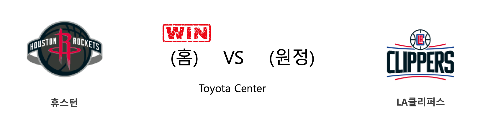
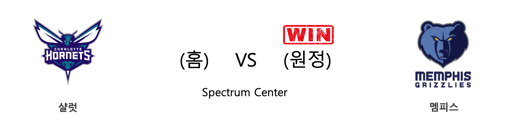
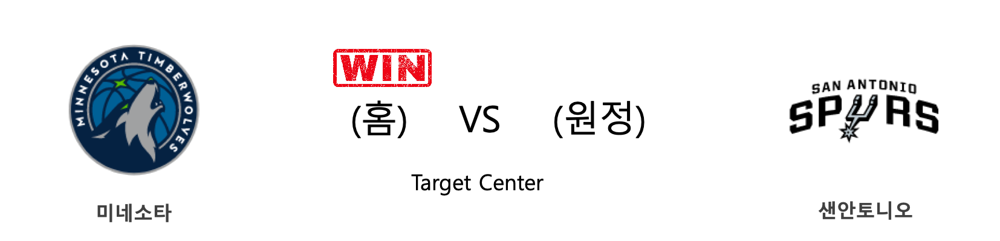

####  HOU(홈) VS LAC(원정) 

<table class="tg">
  <tr>
    <th class="tg-rr9t">HOU</th>
    <th class="tg-rr9t">팀</th>
    <th class="tg-rr9t">LAC</th>
  </tr>
  <tr>
    <td class="tg-dcpn">1승 0패</td>
    <td class="tg-rr9t">시즌 상대전적</td>
    <td class="tg-dcpn">0승 1패</td>
  </tr>
  <tr>
    <td class="tg-dcpn">102</td>
    <td class="tg-rr9t">점수</td>
    <td class="tg-dcpn">93</td>
  </tr>
  <tr>
    <td class="tg-dcpn">19/44(43%)</td>
    <td class="tg-rr9t">2점(%)</td>
    <td class="tg-dcpn">28/65(43%)</td>
  </tr>
  <tr>
    <td class="tg-dcpn">14/42(33%)</td>
    <td class="tg-rr9t">3점(%)</td>
    <td class="tg-dcpn">10/33(30%)</td>
  </tr>
  <tr>
    <td class="tg-dcpn">22/27(81%)</td>
    <td class="tg-rr9t">자유투(%)</td>
    <td class="tg-dcpn">7/14(50%)</td>
  </tr>
  <tr>
    <td class="tg-dcpn">53</td>
    <td class="tg-rr9t">리바운드</td>
    <td class="tg-dcpn">53</td>
  </tr>
  <tr>
    <td class="tg-dcpn">12</td>
    <td class="tg-rr9t">어시스트</td>
    <td class="tg-dcpn">17</td>
  </tr>
  <tr>
    <td class="tg-dcpn">7</td>
    <td class="tg-rr9t">스틸</td>
    <td class="tg-dcpn">3</td>
  </tr>
  <tr>
    <td class="tg-dcpn">6</td>
    <td class="tg-rr9t">블록</td>
    <td class="tg-dcpn">3</td>
  </tr>
  <tr>
    <td class="tg-dcpn">10</td>
    <td class="tg-rr9t">턴오버</td>
    <td class="tg-dcpn">13</td>
  </tr>
  <tr>
    <td class="tg-dcpn">JamesHardenG(47) RussellWestbrookG(17)</td>
    <td class="tg-rr9t">주요 득점선수</td>
    <td class="tg-dcpn">LouWilliams(20) KawhiLeonardF(26)</td>
  </tr>
</table>

#### 경기 관련 주요 기사         

[[오늘의 NBA] (11/11) 토론토, 디펜딩 챔피언의 저력](http://sports.news.naver.com/basketball/news/read.nhn?oid=486&aid=0000001134)

[[오늘의 NBA] 시즌 프리뷰 : 디트로이트, 슈팅 문제를 극복하라!](http://sports.news.naver.com/basketball/news/read.nhn?oid=486&aid=0000001096)

[[오늘의 NBA] (11/12) 샌안토니오와 토니 파커의 마지막 동반 여행](http://sports.news.naver.com/basketball/news/read.nhn?oid=486&aid=0000001135)

[[오늘의 NBA] (11/7) 야니스 아테토쿤보의 MVP 수성 의지](http://sports.news.naver.com/basketball/news/read.nhn?oid=486&aid=0000001130)

[[오늘의 NBA] (11/9) 위긴스 vs 러셀, 타깃 센터의 명승부](http://sports.news.naver.com/basketball/news/read.nhn?oid=486&aid=0000001132)

        
        

####  CHA(홈) VS MEM(원정) 

<table class="tg">
  <tr>
    <th class="tg-rr9t">CHA</th>
    <th class="tg-rr9t">팀</th>
    <th class="tg-rr9t">MEM</th>
  </tr>
  <tr>
    <td class="tg-dcpn">0승 1패</td>
    <td class="tg-rr9t">시즌 상대전적</td>
    <td class="tg-dcpn">1승 0패</td>
  </tr>
  <tr>
    <td class="tg-dcpn">117</td>
    <td class="tg-rr9t">점수</td>
    <td class="tg-dcpn">119</td>
  </tr>
  <tr>
    <td class="tg-dcpn">27/51(53%)</td>
    <td class="tg-rr9t">2점(%)</td>
    <td class="tg-dcpn">31/55(56%)</td>
  </tr>
  <tr>
    <td class="tg-dcpn">16/37(43%)</td>
    <td class="tg-rr9t">3점(%)</td>
    <td class="tg-dcpn">17/35(49%)</td>
  </tr>
  <tr>
    <td class="tg-dcpn">15/19(79%)</td>
    <td class="tg-rr9t">자유투(%)</td>
    <td class="tg-dcpn">6/9(67%)</td>
  </tr>
  <tr>
    <td class="tg-dcpn">35</td>
    <td class="tg-rr9t">리바운드</td>
    <td class="tg-dcpn">45</td>
  </tr>
  <tr>
    <td class="tg-dcpn">27</td>
    <td class="tg-rr9t">어시스트</td>
    <td class="tg-dcpn">32</td>
  </tr>
  <tr>
    <td class="tg-dcpn">7</td>
    <td class="tg-rr9t">스틸</td>
    <td class="tg-dcpn">9</td>
  </tr>
  <tr>
    <td class="tg-dcpn">6</td>
    <td class="tg-rr9t">블록</td>
    <td class="tg-dcpn">5</td>
  </tr>
  <tr>
    <td class="tg-dcpn">15</td>
    <td class="tg-rr9t">턴오버</td>
    <td class="tg-dcpn">22</td>
  </tr>
  <tr>
    <td class="tg-dcpn">MalikMonk(20) CodyZellerC(16) TerryRozierG(33) Devonte'GrahamG(19)</td>
    <td class="tg-rr9t">주요 득점선수</td>
    <td class="tg-dcpn">JonasValanciunasC(18) MarkoGuduric(17) JaMorantG(23) DillonBrooksG(15) JarenJacksonJr.F(16)</td>
  </tr>
</table>

#### 경기 관련 주요 기사         

[[오늘의 NBA] (10/26) 루카 돈치치, 댈러스의 해결사](http://sports.news.naver.com/basketball/news/read.nhn?oid=486&aid=0000001118)

[[오늘의 NBA] (10/30) 앤써니 데이비스, 골드&퍼플 군단의 새로운 태양](http://sports.news.naver.com/basketball/news/read.nhn?oid=486&aid=0000001122)

[[오늘의 NBA] (10/28) 모란트 vs 어빙, 페덱스 포럼의 결투](http://sports.news.naver.com/basketball/news/read.nhn?oid=486&aid=0000001120)

[오늘의 NBA] (11/3) 안드레 드러먼드, 모터 시티의 세계수](http://sports.news.naver.com/basketball/news/read.nhn?oid=486&aid=0000001126)

[[오늘의 NBA] (11/6) 트레이 영, 애틀랜타의 특급 유망주](http://sports.news.naver.com/basketball/news/read.nhn?oid=486&aid=0000001129)

        
        

####  BOS(홈) VS WAS(원정) 

<table class="tg">
  <tr>
    <th class="tg-rr9t">BOS</th>
    <th class="tg-rr9t">팀</th>
    <th class="tg-rr9t">WAS</th>
  </tr>
  <tr>
    <td class="tg-dcpn">1승 0패</td>
    <td class="tg-rr9t">시즌 상대전적</td>
    <td class="tg-dcpn">0승 1패</td>
  </tr>
  <tr>
    <td class="tg-dcpn">140</td>
    <td class="tg-rr9t">점수</td>
    <td class="tg-dcpn">133</td>
  </tr>
  <tr>
    <td class="tg-dcpn">33/60(55%)</td>
    <td class="tg-rr9t">2점(%)</td>
    <td class="tg-dcpn">39/67(58%)</td>
  </tr>
  <tr>
    <td class="tg-dcpn">16/36(44%)</td>
    <td class="tg-rr9t">3점(%)</td>
    <td class="tg-dcpn">11/29(38%)</td>
  </tr>
  <tr>
    <td class="tg-dcpn">26/29(90%)</td>
    <td class="tg-rr9t">자유투(%)</td>
    <td class="tg-dcpn">22/27(81%)</td>
  </tr>
  <tr>
    <td class="tg-dcpn">44</td>
    <td class="tg-rr9t">리바운드</td>
    <td class="tg-dcpn">36</td>
  </tr>
  <tr>
    <td class="tg-dcpn">32</td>
    <td class="tg-rr9t">어시스트</td>
    <td class="tg-dcpn">28</td>
  </tr>
  <tr>
    <td class="tg-dcpn">5</td>
    <td class="tg-rr9t">스틸</td>
    <td class="tg-dcpn">5</td>
  </tr>
  <tr>
    <td class="tg-dcpn">5</td>
    <td class="tg-rr9t">블록</td>
    <td class="tg-dcpn">4</td>
  </tr>
  <tr>
    <td class="tg-dcpn">11</td>
    <td class="tg-rr9t">턴오버</td>
    <td class="tg-dcpn">8</td>
  </tr>
  <tr>
    <td class="tg-dcpn">JaysonTatumF(23) KembaWalkerG(25) MarcusSmartG(17) CarsenEdwards(18) JaylenBrownF(22)</td>
    <td class="tg-rr9t">주요 득점선수</td>
    <td class="tg-dcpn">IsaiahThomasG(18) BradleyBealG(44) RuiHachimuraF(21)</td>
  </tr>
</table>

#### 경기 관련 주요 기사         

[[오늘의 NBA] (11/5) 데빈 부커, 강팀의 에이스](http://sports.news.naver.com/basketball/news/read.nhn?oid=486&aid=0000001128)

[Intel Fixes a Security Flaw It Said Was Repaired 6 Months Ago](https://www.nytimes.com/2019/11/12/technology/intel-chip-fix.html?partner=naver)

[[오늘의 NBA] (10/31) HOU vs WAS, NBA 득점 쟁탈전 역사를 새로 쓰다](http://sports.news.naver.com/basketball/news/read.nhn?oid=486&aid=0000001123)

[[오늘의 NBA] (11/9) 위긴스 vs 러셀, 타깃 센터의 명승부](http://sports.news.naver.com/basketball/news/read.nhn?oid=486&aid=0000001132)

[[오늘의 NBA] (10/24) 앤드류 위긴스, 위기 상황에서 웃는 일류 승부사](http://sports.news.naver.com/basketball/news/read.nhn?oid=486&aid=0000001116)

        
        

####  MIN(홈) VS SAS(원정) 

<table class="tg">
  <tr>
    <th class="tg-rr9t">MIN</th>
    <th class="tg-rr9t">팀</th>
    <th class="tg-rr9t">SAS</th>
  </tr>
  <tr>
    <td class="tg-dcpn">1승 0패</td>
    <td class="tg-rr9t">시즌 상대전적</td>
    <td class="tg-dcpn">0승 1패</td>
  </tr>
  <tr>
    <td class="tg-dcpn">129</td>
    <td class="tg-rr9t">점수</td>
    <td class="tg-dcpn">114</td>
  </tr>
  <tr>
    <td class="tg-dcpn">34/57(60%)</td>
    <td class="tg-rr9t">2점(%)</td>
    <td class="tg-dcpn">41/73(56%)</td>
  </tr>
  <tr>
    <td class="tg-dcpn">11/34(32%)</td>
    <td class="tg-rr9t">3점(%)</td>
    <td class="tg-dcpn">3/17(18%)</td>
  </tr>
  <tr>
    <td class="tg-dcpn">28/34(82%)</td>
    <td class="tg-rr9t">자유투(%)</td>
    <td class="tg-dcpn">23/29(79%)</td>
  </tr>
  <tr>
    <td class="tg-dcpn">50</td>
    <td class="tg-rr9t">리바운드</td>
    <td class="tg-dcpn">44</td>
  </tr>
  <tr>
    <td class="tg-dcpn">25</td>
    <td class="tg-rr9t">어시스트</td>
    <td class="tg-dcpn">24</td>
  </tr>
  <tr>
    <td class="tg-dcpn">11</td>
    <td class="tg-rr9t">스틸</td>
    <td class="tg-dcpn">4</td>
  </tr>
  <tr>
    <td class="tg-dcpn">4</td>
    <td class="tg-rr9t">블록</td>
    <td class="tg-dcpn">4</td>
  </tr>
  <tr>
    <td class="tg-dcpn">10</td>
    <td class="tg-rr9t">턴오버</td>
    <td class="tg-dcpn">11</td>
  </tr>
  <tr>
    <td class="tg-dcpn">JakeLayman(16) JeffTeague(18) AndrewWigginsG(30) Karl-AnthonyTownsC(28)</td>
    <td class="tg-rr9t">주요 득점선수</td>
    <td class="tg-dcpn">LaMarcusAldridgeF(23) DeMarDeRozanF(27)</td>
  </tr>
</table>

#### 경기 관련 주요 기사         

[[오늘의 NBA] (11/2) 르브론 제임스의 왕권신수설](http://sports.news.naver.com/basketball/news/read.nhn?oid=486&aid=0000001125)

[[오늘의 NBA] (11/6) 트레이 영, 애틀랜타의 특급 유망주](http://sports.news.naver.com/basketball/news/read.nhn?oid=486&aid=0000001129)

[[오늘의 NBA] (11/4) 마이애미의 대권 도전 행보](http://sports.news.naver.com/basketball/news/read.nhn?oid=486&aid=0000001127)

[[오늘의 NBA] (11/12) 샌안토니오와 토니 파커의 마지막 동반 여행](http://sports.news.naver.com/basketball/news/read.nhn?oid=486&aid=0000001135)

[[오늘의 NBA] (11/9) 위긴스 vs 러셀, 타깃 센터의 명승부](http://sports.news.naver.com/basketball/news/read.nhn?oid=486&aid=0000001132)

        
        

####  ORL(홈) VS PHI(원정) 

<table class="tg">
  <tr>
    <th class="tg-rr9t">ORL</th>
    <th class="tg-rr9t">팀</th>
    <th class="tg-rr9t">PHI</th>
  </tr>
  <tr>
    <td class="tg-dcpn">1승 0패</td>
    <td class="tg-rr9t">시즌 상대전적</td>
    <td class="tg-dcpn">0승 1패</td>
  </tr>
  <tr>
    <td class="tg-dcpn">112</td>
    <td class="tg-rr9t">점수</td>
    <td class="tg-dcpn">97</td>
  </tr>
  <tr>
    <td class="tg-dcpn">28/54(52%)</td>
    <td class="tg-rr9t">2점(%)</td>
    <td class="tg-dcpn">32/61(52%)</td>
  </tr>
  <tr>
    <td class="tg-dcpn">10/32(31%)</td>
    <td class="tg-rr9t">3점(%)</td>
    <td class="tg-dcpn">8/30(27%)</td>
  </tr>
  <tr>
    <td class="tg-dcpn">26/34(76%)</td>
    <td class="tg-rr9t">자유투(%)</td>
    <td class="tg-dcpn">9/13(69%)</td>
  </tr>
  <tr>
    <td class="tg-dcpn">48</td>
    <td class="tg-rr9t">리바운드</td>
    <td class="tg-dcpn">47</td>
  </tr>
  <tr>
    <td class="tg-dcpn">27</td>
    <td class="tg-rr9t">어시스트</td>
    <td class="tg-dcpn">25</td>
  </tr>
  <tr>
    <td class="tg-dcpn">6</td>
    <td class="tg-rr9t">스틸</td>
    <td class="tg-dcpn">5</td>
  </tr>
  <tr>
    <td class="tg-dcpn">2</td>
    <td class="tg-rr9t">블록</td>
    <td class="tg-dcpn">5</td>
  </tr>
  <tr>
    <td class="tg-dcpn">13</td>
    <td class="tg-rr9t">턴오버</td>
    <td class="tg-dcpn">15</td>
  </tr>
  <tr>
    <td class="tg-dcpn">AaronGordonF(18) NikolaVucevicC(25)</td>
    <td class="tg-rr9t">주요 득점선수</td>
    <td class="tg-dcpn">JoshRichardsonG(19) BenSimmonsG(18)</td>
  </tr>
</table>

#### 경기 관련 주요 기사         

[[오늘의 NBA] (11/9) 위긴스 vs 러셀, 타깃 센터의 명승부](http://sports.news.naver.com/basketball/news/read.nhn?oid=486&aid=0000001132)

[오늘의 NBA] (11/3) 안드레 드러먼드, 모터 시티의 세계수](http://sports.news.naver.com/basketball/news/read.nhn?oid=486&aid=0000001126)

[[오늘의 NBA] (11/2) 르브론 제임스의 왕권신수설](http://sports.news.naver.com/basketball/news/read.nhn?oid=486&aid=0000001125)

[[오늘의 NBA] (11/11) 토론토, 디펜딩 챔피언의 저력](http://sports.news.naver.com/basketball/news/read.nhn?oid=486&aid=0000001134)

[[오늘의 NBA] (11/7) 야니스 아테토쿤보의 MVP 수성 의지](http://sports.news.naver.com/basketball/news/read.nhn?oid=486&aid=0000001130)

        
        

####  POR(홈) VS TOR(원정) 

<table class="tg">
  <tr>
    <th class="tg-rr9t">POR</th>
    <th class="tg-rr9t">팀</th>
    <th class="tg-rr9t">TOR</th>
  </tr>
  <tr>
    <td class="tg-dcpn">0승 1패</td>
    <td class="tg-rr9t">시즌 상대전적</td>
    <td class="tg-dcpn">1승 0패</td>
  </tr>
  <tr>
    <td class="tg-dcpn">106</td>
    <td class="tg-rr9t">점수</td>
    <td class="tg-dcpn">114</td>
  </tr>
  <tr>
    <td class="tg-dcpn">21/48(44%)</td>
    <td class="tg-rr9t">2점(%)</td>
    <td class="tg-dcpn">28/60(47%)</td>
  </tr>
  <tr>
    <td class="tg-dcpn">17/48(35%)</td>
    <td class="tg-rr9t">3점(%)</td>
    <td class="tg-dcpn">14/32(44%)</td>
  </tr>
  <tr>
    <td class="tg-dcpn">13/16(81%)</td>
    <td class="tg-rr9t">자유투(%)</td>
    <td class="tg-dcpn">16/17(94%)</td>
  </tr>
  <tr>
    <td class="tg-dcpn">43</td>
    <td class="tg-rr9t">리바운드</td>
    <td class="tg-dcpn">50</td>
  </tr>
  <tr>
    <td class="tg-dcpn">24</td>
    <td class="tg-rr9t">어시스트</td>
    <td class="tg-dcpn">20</td>
  </tr>
  <tr>
    <td class="tg-dcpn">3</td>
    <td class="tg-rr9t">스틸</td>
    <td class="tg-dcpn">4</td>
  </tr>
  <tr>
    <td class="tg-dcpn">7</td>
    <td class="tg-rr9t">블록</td>
    <td class="tg-dcpn">9</td>
  </tr>
  <tr>
    <td class="tg-dcpn">12</td>
    <td class="tg-rr9t">턴오버</td>
    <td class="tg-dcpn">12</td>
  </tr>
  <tr>
    <td class="tg-dcpn">AnferneeSimons(17) RodneyHoodF(25) CJMcCollumG(19)</td>
    <td class="tg-rr9t">주요 득점선수</td>
    <td class="tg-dcpn">TerenceDavis(15) RondaeHollis-Jefferson(16) PascalSiakamF(36) FredVanVleetG(30)</td>
  </tr>
</table>

#### 경기 관련 주요 기사         

[오늘의 NBA] (11/3) 안드레 드러먼드, 모터 시티의 세계수](http://sports.news.naver.com/basketball/news/read.nhn?oid=486&aid=0000001126)

[[오늘의 NBA] (11/11) 토론토, 디펜딩 챔피언의 저력](http://sports.news.naver.com/basketball/news/read.nhn?oid=486&aid=0000001134)

[[오늘의 NBA] 시즌 프리뷰 : 새크라멘토, 13년을 소모한 기다림](http://sports.news.naver.com/basketball/news/read.nhn?oid=486&aid=0000001095)

[[오늘의 NBA] (11/7) 야니스 아테토쿤보의 MVP 수성 의지](http://sports.news.naver.com/basketball/news/read.nhn?oid=486&aid=0000001130)

[[오늘의 NBA] (11/9) 위긴스 vs 러셀, 타깃 센터의 명승부](http://sports.news.naver.com/basketball/news/read.nhn?oid=486&aid=0000001132)

        
        

####  LAL(홈) VS GSW(원정) 

<table class="tg">
  <tr>
    <th class="tg-rr9t">LAL</th>
    <th class="tg-rr9t">팀</th>
    <th class="tg-rr9t">GSW</th>
  </tr>
  <tr>
    <td class="tg-dcpn">1승 0패</td>
    <td class="tg-rr9t">시즌 상대전적</td>
    <td class="tg-dcpn">0승 1패</td>
  </tr>
  <tr>
    <td class="tg-dcpn">120</td>
    <td class="tg-rr9t">점수</td>
    <td class="tg-dcpn">94</td>
  </tr>
  <tr>
    <td class="tg-dcpn">39/69(57%)</td>
    <td class="tg-rr9t">2점(%)</td>
    <td class="tg-dcpn">27/54(50%)</td>
  </tr>
  <tr>
    <td class="tg-dcpn">9/20(45%)</td>
    <td class="tg-rr9t">3점(%)</td>
    <td class="tg-dcpn">9/35(26%)</td>
  </tr>
  <tr>
    <td class="tg-dcpn">15/18(83%)</td>
    <td class="tg-rr9t">자유투(%)</td>
    <td class="tg-dcpn">13/17(76%)</td>
  </tr>
  <tr>
    <td class="tg-dcpn">51</td>
    <td class="tg-rr9t">리바운드</td>
    <td class="tg-dcpn">33</td>
  </tr>
  <tr>
    <td class="tg-dcpn">31</td>
    <td class="tg-rr9t">어시스트</td>
    <td class="tg-dcpn">29</td>
  </tr>
  <tr>
    <td class="tg-dcpn">8</td>
    <td class="tg-rr9t">스틸</td>
    <td class="tg-dcpn">8</td>
  </tr>
  <tr>
    <td class="tg-dcpn">6</td>
    <td class="tg-rr9t">블록</td>
    <td class="tg-dcpn">7</td>
  </tr>
  <tr>
    <td class="tg-dcpn">19</td>
    <td class="tg-rr9t">턴오버</td>
    <td class="tg-dcpn">17</td>
  </tr>
  <tr>
    <td class="tg-dcpn">DwightHoward(15) LeBronJamesF(23) JaValeMcGeeC(18) KyleKuzmaF(22)</td>
    <td class="tg-rr9t">주요 득점선수</td>
    <td class="tg-dcpn">EricPaschall(15) D'AngeloRussellG(21)</td>
  </tr>
</table>

#### 경기 관련 주요 기사         

[AD, 갈비뼈 부상으로 GSW전 출전 불투명...LAL '비상'](http://www.rookie.co.kr/news/articleView.html?idxno=34941)

[[오늘의 NBA] (11/11) 토론토, 디펜딩 챔피언의 저력](http://sports.news.naver.com/basketball/news/read.nhn?oid=486&aid=0000001134)

[[오늘의 NBA] (11/8) 켐바 워커의 홈 커밍 데이](http://sports.news.naver.com/basketball/news/read.nhn?oid=486&aid=0000001131)

[[오늘의 NBA] (11/9) 위긴스 vs 러셀, 타깃 센터의 명승부](http://sports.news.naver.com/basketball/news/read.nhn?oid=486&aid=0000001132)

[[오늘의 NBA] (11/13) LAL 카일 쿠즈마의 대반격](http://sports.news.naver.com/basketball/news/read.nhn?oid=486&aid=0000001136)

        
        

#### 리그 (Eastern) 순위
    

<table class="tg">
  <tr>
    <th class="tg-d14o">순위</th>
    <th class="tg-d14o">팀명</th>
    <th class="tg-d14o">경기수</th>
    <th class="tg-d14o">승</th>
    <th class="tg-d14o">패</th>
    <th class="tg-d14o">승차</th>
    <th class="tg-d14o">승률</th>
  </tr>
  
<tr>
    <td class="tg-50j8">1</td>
    <td class="tg-50j8">BOS</td>
    <td class="tg-50j8">10</td>
    <td class="tg-50j8">9</td>
    <td class="tg-50j8">1</td>
    <td class="tg-50j8">0</td>
    <td class="tg-50j8">0.9</td>
</tr>

<tr>
    <td class="tg-50j8">2</td>
    <td class="tg-50j8">TOR</td>
    <td class="tg-50j8">11</td>
    <td class="tg-50j8">8</td>
    <td class="tg-50j8">3</td>
    <td class="tg-50j8">1</td>
    <td class="tg-50j8">0.727</td>
</tr>

<tr>
    <td class="tg-50j8">3</td>
    <td class="tg-50j8">MIL</td>
    <td class="tg-50j8">10</td>
    <td class="tg-50j8">7</td>
    <td class="tg-50j8">3</td>
    <td class="tg-50j8">2</td>
    <td class="tg-50j8">0.7</td>
</tr>

<tr>
    <td class="tg-50j8">3</td>
    <td class="tg-50j8">MIA</td>
    <td class="tg-50j8">10</td>
    <td class="tg-50j8">7</td>
    <td class="tg-50j8">3</td>
    <td class="tg-50j8">2</td>
    <td class="tg-50j8">0.7</td>
</tr>

<tr>
    <td class="tg-50j8">5</td>
    <td class="tg-50j8">IND</td>
    <td class="tg-50j8">11</td>
    <td class="tg-50j8">7</td>
    <td class="tg-50j8">4</td>
    <td class="tg-50j8">2</td>
    <td class="tg-50j8">0.636</td>
</tr>

<tr>
    <td class="tg-50j8">5</td>
    <td class="tg-50j8">PHI</td>
    <td class="tg-50j8">11</td>
    <td class="tg-50j8">7</td>
    <td class="tg-50j8">4</td>
    <td class="tg-50j8">2</td>
    <td class="tg-50j8">0.636</td>
</tr>

<tr>
    <td class="tg-50j8">7</td>
    <td class="tg-50j8">CLE</td>
    <td class="tg-50j8">10</td>
    <td class="tg-50j8">4</td>
    <td class="tg-50j8">6</td>
    <td class="tg-50j8">5</td>
    <td class="tg-50j8">0.4</td>
</tr>

<tr>
    <td class="tg-50j8">7</td>
    <td class="tg-50j8">ATL</td>
    <td class="tg-50j8">10</td>
    <td class="tg-50j8">4</td>
    <td class="tg-50j8">6</td>
    <td class="tg-50j8">5</td>
    <td class="tg-50j8">0.4</td>
</tr>

<tr>
    <td class="tg-50j8">7</td>
    <td class="tg-50j8">BKN</td>
    <td class="tg-50j8">10</td>
    <td class="tg-50j8">4</td>
    <td class="tg-50j8">6</td>
    <td class="tg-50j8">5</td>
    <td class="tg-50j8">0.4</td>
</tr>

<tr>
    <td class="tg-50j8">10</td>
    <td class="tg-50j8">ORL</td>
    <td class="tg-50j8">11</td>
    <td class="tg-50j8">4</td>
    <td class="tg-50j8">7</td>
    <td class="tg-50j8">5</td>
    <td class="tg-50j8">0.364</td>
</tr>

<tr>
    <td class="tg-50j8">10</td>
    <td class="tg-50j8">CHI</td>
    <td class="tg-50j8">11</td>
    <td class="tg-50j8">4</td>
    <td class="tg-50j8">7</td>
    <td class="tg-50j8">5</td>
    <td class="tg-50j8">0.364</td>
</tr>

<tr>
    <td class="tg-50j8">10</td>
    <td class="tg-50j8">CHA</td>
    <td class="tg-50j8">11</td>
    <td class="tg-50j8">4</td>
    <td class="tg-50j8">7</td>
    <td class="tg-50j8">5</td>
    <td class="tg-50j8">0.364</td>
</tr>

<tr>
    <td class="tg-50j8">13</td>
    <td class="tg-50j8">DET</td>
    <td class="tg-50j8">12</td>
    <td class="tg-50j8">4</td>
    <td class="tg-50j8">8</td>
    <td class="tg-50j8">5</td>
    <td class="tg-50j8">0.333</td>
</tr>

<tr>
    <td class="tg-50j8">14</td>
    <td class="tg-50j8">WAS</td>
    <td class="tg-50j8">9</td>
    <td class="tg-50j8">2</td>
    <td class="tg-50j8">7</td>
    <td class="tg-50j8">7</td>
    <td class="tg-50j8">0.222</td>
</tr>

<tr>
    <td class="tg-50j8">15</td>
    <td class="tg-50j8">NYK</td>
    <td class="tg-50j8">11</td>
    <td class="tg-50j8">2</td>
    <td class="tg-50j8">9</td>
    <td class="tg-50j8">7</td>
    <td class="tg-50j8">0.182</td>
</tr>
</table> 
#### 리그 (Western) 순위
    

<table class="tg">
  <tr>
    <th class="tg-d14o">순위</th>
    <th class="tg-d14o">팀명</th>
    <th class="tg-d14o">경기수</th>
    <th class="tg-d14o">승</th>
    <th class="tg-d14o">패</th>
    <th class="tg-d14o">승차</th>
    <th class="tg-d14o">승률</th>
  </tr>
  
<tr>
    <td class="tg-50j8">1</td>
    <td class="tg-50j8">LAL</td>
    <td class="tg-50j8">11</td>
    <td class="tg-50j8">9</td>
    <td class="tg-50j8">2</td>
    <td class="tg-50j8">0</td>
    <td class="tg-50j8">0.818</td>
</tr>

<tr>
    <td class="tg-50j8">2</td>
    <td class="tg-50j8">HOU</td>
    <td class="tg-50j8">11</td>
    <td class="tg-50j8">8</td>
    <td class="tg-50j8">3</td>
    <td class="tg-50j8">1</td>
    <td class="tg-50j8">0.727</td>
</tr>

<tr>
    <td class="tg-50j8">2</td>
    <td class="tg-50j8">UTA</td>
    <td class="tg-50j8">11</td>
    <td class="tg-50j8">8</td>
    <td class="tg-50j8">3</td>
    <td class="tg-50j8">1</td>
    <td class="tg-50j8">0.727</td>
</tr>

<tr>
    <td class="tg-50j8">4</td>
    <td class="tg-50j8">DEN</td>
    <td class="tg-50j8">10</td>
    <td class="tg-50j8">7</td>
    <td class="tg-50j8">3</td>
    <td class="tg-50j8">2</td>
    <td class="tg-50j8">0.7</td>
</tr>

<tr>
    <td class="tg-50j8">5</td>
    <td class="tg-50j8">LAC</td>
    <td class="tg-50j8">11</td>
    <td class="tg-50j8">7</td>
    <td class="tg-50j8">4</td>
    <td class="tg-50j8">2</td>
    <td class="tg-50j8">0.636</td>
</tr>

<tr>
    <td class="tg-50j8">5</td>
    <td class="tg-50j8">MIN</td>
    <td class="tg-50j8">11</td>
    <td class="tg-50j8">7</td>
    <td class="tg-50j8">4</td>
    <td class="tg-50j8">2</td>
    <td class="tg-50j8">0.636</td>
</tr>

<tr>
    <td class="tg-50j8">7</td>
    <td class="tg-50j8">PHX</td>
    <td class="tg-50j8">10</td>
    <td class="tg-50j8">6</td>
    <td class="tg-50j8">4</td>
    <td class="tg-50j8">3</td>
    <td class="tg-50j8">0.6</td>
</tr>

<tr>
    <td class="tg-50j8">7</td>
    <td class="tg-50j8">DAL</td>
    <td class="tg-50j8">10</td>
    <td class="tg-50j8">6</td>
    <td class="tg-50j8">4</td>
    <td class="tg-50j8">3</td>
    <td class="tg-50j8">0.6</td>
</tr>

<tr>
    <td class="tg-50j8">9</td>
    <td class="tg-50j8">SAS</td>
    <td class="tg-50j8">11</td>
    <td class="tg-50j8">5</td>
    <td class="tg-50j8">6</td>
    <td class="tg-50j8">4</td>
    <td class="tg-50j8">0.455</td>
</tr>

<tr>
    <td class="tg-50j8">10</td>
    <td class="tg-50j8">SAC</td>
    <td class="tg-50j8">10</td>
    <td class="tg-50j8">4</td>
    <td class="tg-50j8">6</td>
    <td class="tg-50j8">5</td>
    <td class="tg-50j8">0.4</td>
</tr>

<tr>
    <td class="tg-50j8">11</td>
    <td class="tg-50j8">OKC</td>
    <td class="tg-50j8">11</td>
    <td class="tg-50j8">4</td>
    <td class="tg-50j8">7</td>
    <td class="tg-50j8">5</td>
    <td class="tg-50j8">0.364</td>
</tr>

<tr>
    <td class="tg-50j8">11</td>
    <td class="tg-50j8">MEM</td>
    <td class="tg-50j8">11</td>
    <td class="tg-50j8">4</td>
    <td class="tg-50j8">7</td>
    <td class="tg-50j8">5</td>
    <td class="tg-50j8">0.364</td>
</tr>

<tr>
    <td class="tg-50j8">13</td>
    <td class="tg-50j8">POR</td>
    <td class="tg-50j8">12</td>
    <td class="tg-50j8">4</td>
    <td class="tg-50j8">8</td>
    <td class="tg-50j8">5</td>
    <td class="tg-50j8">0.333</td>
</tr>

<tr>
    <td class="tg-50j8">14</td>
    <td class="tg-50j8">NOP</td>
    <td class="tg-50j8">10</td>
    <td class="tg-50j8">2</td>
    <td class="tg-50j8">8</td>
    <td class="tg-50j8">7</td>
    <td class="tg-50j8">0.2</td>
</tr>

<tr>
    <td class="tg-50j8">15</td>
    <td class="tg-50j8">GSW</td>
    <td class="tg-50j8">12</td>
    <td class="tg-50j8">2</td>
    <td class="tg-50j8">10</td>
    <td class="tg-50j8">7</td>
    <td class="tg-50j8">0.167</td>
</tr>
</table> 

        
        
