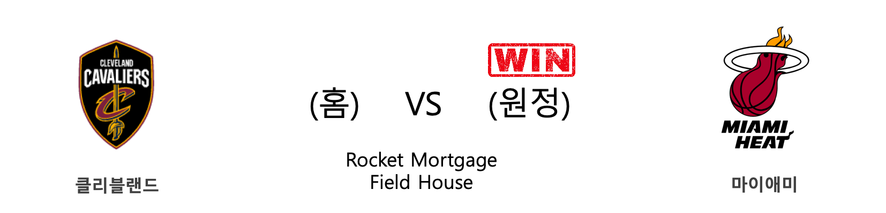
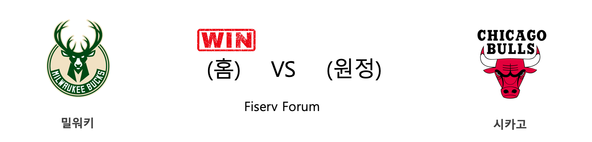
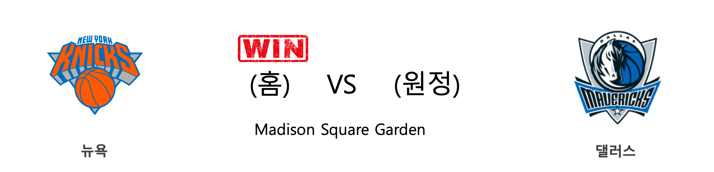
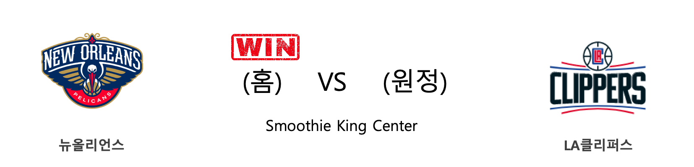
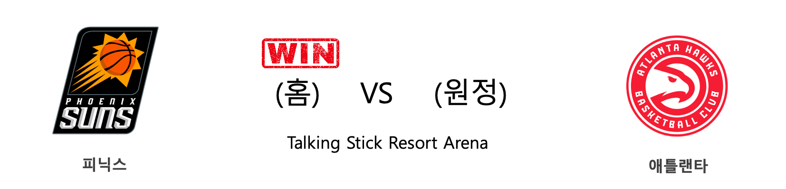
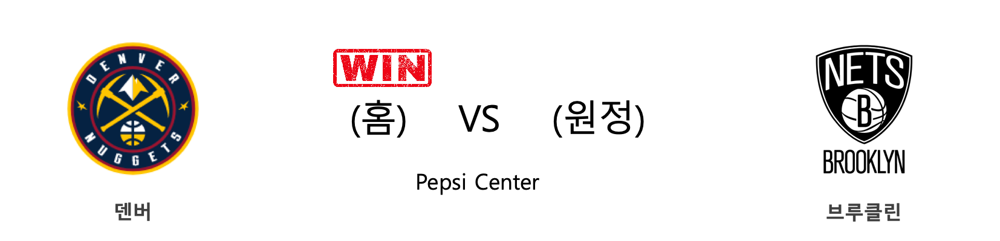

####  CLE(홈) VS MIA(원정) 

<table class="tg">
  <tr>
    <th class="tg-rr9t">CLE</th>
    <th class="tg-rr9t">팀</th>
    <th class="tg-rr9t">MIA</th>
  </tr>
  <tr>
    <td class="tg-dcpn">0승 1패</td>
    <td class="tg-rr9t">시즌 상대전적</td>
    <td class="tg-dcpn">1승 0패</td>
  </tr>
  <tr>
    <td class="tg-dcpn">97</td>
    <td class="tg-rr9t">점수</td>
    <td class="tg-dcpn">108</td>
  </tr>
  <tr>
    <td class="tg-dcpn">28/53(53%)</td>
    <td class="tg-rr9t">2점(%)</td>
    <td class="tg-dcpn">31/49(63%)</td>
  </tr>
  <tr>
    <td class="tg-dcpn">8/32(25%)</td>
    <td class="tg-rr9t">3점(%)</td>
    <td class="tg-dcpn">12/30(40%)</td>
  </tr>
  <tr>
    <td class="tg-dcpn">17/21(81%)</td>
    <td class="tg-rr9t">자유투(%)</td>
    <td class="tg-dcpn">10/11(91%)</td>
  </tr>
  <tr>
    <td class="tg-dcpn">41</td>
    <td class="tg-rr9t">리바운드</td>
    <td class="tg-dcpn">41</td>
  </tr>
  <tr>
    <td class="tg-dcpn">18</td>
    <td class="tg-rr9t">어시스트</td>
    <td class="tg-dcpn">31</td>
  </tr>
  <tr>
    <td class="tg-dcpn">14</td>
    <td class="tg-rr9t">스틸</td>
    <td class="tg-dcpn">10</td>
  </tr>
  <tr>
    <td class="tg-dcpn">2</td>
    <td class="tg-rr9t">블록</td>
    <td class="tg-dcpn">7</td>
  </tr>
  <tr>
    <td class="tg-dcpn">18</td>
    <td class="tg-rr9t">턴오버</td>
    <td class="tg-dcpn">18</td>
  </tr>
  <tr>
    <td class="tg-dcpn">CollinSextonG(15) KevinLoveF(21)</td>
    <td class="tg-rr9t">주요 득점선수</td>
    <td class="tg-dcpn">TylerHerro(16) KendrickNunnG(23) BamAdebayoF(16)</td>
  </tr>
</table>

#### 경기 관련 주요 기사         

[[오늘의 NBA] (11/8) 켐바 워커의 홈 커밍 데이](http://sports.news.naver.com/basketball/news/read.nhn?oid=486&aid=0000001131)

[[오늘의 NBA] (11/15) NOP 즈루 홀리데이, 뒤처리는 내가 맡는다!](http://sports.news.naver.com/basketball/news/read.nhn?oid=486&aid=0000001138)

[[오늘의 NBA] (11/13) LAL 카일 쿠즈마의 대반격](http://sports.news.naver.com/basketball/news/read.nhn?oid=486&aid=0000001136)

        
        

####  MIL(홈) VS CHI(원정) 

<table class="tg">
  <tr>
    <th class="tg-rr9t">MIL</th>
    <th class="tg-rr9t">팀</th>
    <th class="tg-rr9t">CHI</th>
  </tr>
  <tr>
    <td class="tg-dcpn">1승 0패</td>
    <td class="tg-rr9t">시즌 상대전적</td>
    <td class="tg-dcpn">0승 1패</td>
  </tr>
  <tr>
    <td class="tg-dcpn">124</td>
    <td class="tg-rr9t">점수</td>
    <td class="tg-dcpn">115</td>
  </tr>
  <tr>
    <td class="tg-dcpn">36/55(65%)</td>
    <td class="tg-rr9t">2점(%)</td>
    <td class="tg-dcpn">20/50(40%)</td>
  </tr>
  <tr>
    <td class="tg-dcpn">6/33(18%)</td>
    <td class="tg-rr9t">3점(%)</td>
    <td class="tg-dcpn">18/43(42%)</td>
  </tr>
  <tr>
    <td class="tg-dcpn">34/47(72%)</td>
    <td class="tg-rr9t">자유투(%)</td>
    <td class="tg-dcpn">21/25(84%)</td>
  </tr>
  <tr>
    <td class="tg-dcpn">58</td>
    <td class="tg-rr9t">리바운드</td>
    <td class="tg-dcpn">45</td>
  </tr>
  <tr>
    <td class="tg-dcpn">24</td>
    <td class="tg-rr9t">어시스트</td>
    <td class="tg-dcpn">25</td>
  </tr>
  <tr>
    <td class="tg-dcpn">9</td>
    <td class="tg-rr9t">스틸</td>
    <td class="tg-dcpn">14</td>
  </tr>
  <tr>
    <td class="tg-dcpn">4</td>
    <td class="tg-rr9t">블록</td>
    <td class="tg-dcpn">1</td>
  </tr>
  <tr>
    <td class="tg-dcpn">22</td>
    <td class="tg-rr9t">턴오버</td>
    <td class="tg-dcpn">20</td>
  </tr>
  <tr>
    <td class="tg-dcpn">WesleyMatthewsF(15) EricBledsoeG(31) GiannisAntetokounmpoF(38)</td>
    <td class="tg-rr9t">주요 득점선수</td>
    <td class="tg-dcpn">CobyWhite(26) ZachLaVineG(25)</td>
  </tr>
</table>

#### 경기 관련 주요 기사         

[[오늘의 NBA] (11/7) 야니스 아테토쿤보의 MVP 수성 의지](http://sports.news.naver.com/basketball/news/read.nhn?oid=486&aid=0000001130)

[[오늘의 NBA] (10/30) 앤써니 데이비스, 골드&퍼플 군단의 새로운 태양](http://sports.news.naver.com/basketball/news/read.nhn?oid=486&aid=0000001122)

[[오늘의 NBA] (11/2) 르브론 제임스의 왕권신수설](http://sports.news.naver.com/basketball/news/read.nhn?oid=486&aid=0000001125)

[[오늘의 NBA] (11/13) LAL 카일 쿠즈마의 대반격](http://sports.news.naver.com/basketball/news/read.nhn?oid=486&aid=0000001136)

[[오늘의 NBA] (11/15) NOP 즈루 홀리데이, 뒤처리는 내가 맡는다!](http://sports.news.naver.com/basketball/news/read.nhn?oid=486&aid=0000001138)

        
        

####  NYK(홈) VS DAL(원정) 

<table class="tg">
  <tr>
    <th class="tg-rr9t">NYK</th>
    <th class="tg-rr9t">팀</th>
    <th class="tg-rr9t">DAL</th>
  </tr>
  <tr>
    <td class="tg-dcpn">2승 0패</td>
    <td class="tg-rr9t">시즌 상대전적</td>
    <td class="tg-dcpn">0승 2패</td>
  </tr>
  <tr>
    <td class="tg-dcpn">106</td>
    <td class="tg-rr9t">점수</td>
    <td class="tg-dcpn">103</td>
  </tr>
  <tr>
    <td class="tg-dcpn">29/64(45%)</td>
    <td class="tg-rr9t">2점(%)</td>
    <td class="tg-dcpn">28/48(58%)</td>
  </tr>
  <tr>
    <td class="tg-dcpn">13/30(43%)</td>
    <td class="tg-rr9t">3점(%)</td>
    <td class="tg-dcpn">8/36(22%)</td>
  </tr>
  <tr>
    <td class="tg-dcpn">9/11(82%)</td>
    <td class="tg-rr9t">자유투(%)</td>
    <td class="tg-dcpn">23/31(74%)</td>
  </tr>
  <tr>
    <td class="tg-dcpn">53</td>
    <td class="tg-rr9t">리바운드</td>
    <td class="tg-dcpn">44</td>
  </tr>
  <tr>
    <td class="tg-dcpn">20</td>
    <td class="tg-rr9t">어시스트</td>
    <td class="tg-dcpn">21</td>
  </tr>
  <tr>
    <td class="tg-dcpn">6</td>
    <td class="tg-rr9t">스틸</td>
    <td class="tg-dcpn">8</td>
  </tr>
  <tr>
    <td class="tg-dcpn">2</td>
    <td class="tg-rr9t">블록</td>
    <td class="tg-dcpn">7</td>
  </tr>
  <tr>
    <td class="tg-dcpn">15</td>
    <td class="tg-rr9t">턴오버</td>
    <td class="tg-dcpn">11</td>
  </tr>
  <tr>
    <td class="tg-dcpn">MitchellRobinson(16) MarcusMorrisSr.F(20) JuliusRandleF(17)</td>
    <td class="tg-rr9t">주요 득점선수</td>
    <td class="tg-dcpn">KristapsPorzingisF(20) LukaDoncicG(33)</td>
  </tr>
</table>

#### 경기 관련 주요 기사         

[[오늘의 NBA] (10/26) 루카 돈치치, 댈러스의 해결사](http://sports.news.naver.com/basketball/news/read.nhn?oid=486&aid=0000001118)

[[오늘의 NBA] (11/9) 위긴스 vs 러셀, 타깃 센터의 명승부](http://sports.news.naver.com/basketball/news/read.nhn?oid=486&aid=0000001132)

[[오늘의 NBA] (11/14) 제임스 하든, 농구의 미래를 제시하다](http://sports.news.naver.com/basketball/news/read.nhn?oid=486&aid=0000001137)

[[오늘의 NBA] (11/15) NOP 즈루 홀리데이, 뒤처리는 내가 맡는다!](http://sports.news.naver.com/basketball/news/read.nhn?oid=486&aid=0000001138)

[[오늘의 NBA] (10/31) HOU vs WAS, NBA 득점 쟁탈전 역사를 새로 쓰다](http://sports.news.naver.com/basketball/news/read.nhn?oid=486&aid=0000001123)

        
        

####  NOP(홈) VS LAC(원정) 

<table class="tg">
  <tr>
    <th class="tg-rr9t">NOP</th>
    <th class="tg-rr9t">팀</th>
    <th class="tg-rr9t">LAC</th>
  </tr>
  <tr>
    <td class="tg-dcpn">1승 0패</td>
    <td class="tg-rr9t">시즌 상대전적</td>
    <td class="tg-dcpn">0승 1패</td>
  </tr>
  <tr>
    <td class="tg-dcpn">132</td>
    <td class="tg-rr9t">점수</td>
    <td class="tg-dcpn">127</td>
  </tr>
  <tr>
    <td class="tg-dcpn">29/64(45%)</td>
    <td class="tg-rr9t">2점(%)</td>
    <td class="tg-dcpn">35/60(58%)</td>
  </tr>
  <tr>
    <td class="tg-dcpn">18/34(53%)</td>
    <td class="tg-rr9t">3점(%)</td>
    <td class="tg-dcpn">11/24(46%)</td>
  </tr>
  <tr>
    <td class="tg-dcpn">20/29(69%)</td>
    <td class="tg-rr9t">자유투(%)</td>
    <td class="tg-dcpn">24/31(77%)</td>
  </tr>
  <tr>
    <td class="tg-dcpn">52</td>
    <td class="tg-rr9t">리바운드</td>
    <td class="tg-dcpn">37</td>
  </tr>
  <tr>
    <td class="tg-dcpn">26</td>
    <td class="tg-rr9t">어시스트</td>
    <td class="tg-dcpn">28</td>
  </tr>
  <tr>
    <td class="tg-dcpn">11</td>
    <td class="tg-rr9t">스틸</td>
    <td class="tg-dcpn">6</td>
  </tr>
  <tr>
    <td class="tg-dcpn">5</td>
    <td class="tg-rr9t">블록</td>
    <td class="tg-dcpn">6</td>
  </tr>
  <tr>
    <td class="tg-dcpn">15</td>
    <td class="tg-rr9t">턴오버</td>
    <td class="tg-dcpn">16</td>
  </tr>
  <tr>
    <td class="tg-dcpn">FrankJackson(23) JJRedickG(19) DerrickFavorsC(20) JrueHolidayG(36) E'TwaunMooreF(15)</td>
    <td class="tg-rr9t">주요 득점선수</td>
    <td class="tg-dcpn">LouWilliamsG(31) RodneyMcGruder(20) MontrezlHarrellC(18) PaulGeorgeF(33)</td>
  </tr>
</table>

#### 경기 관련 주요 기사         

[돌아온 폴 조지 "내 경기력, 형편이 없었다"](http://www.spotvnews.co.kr/?mod=news&act=articleView&idxno=329210)

['홀리데이 36점' NOP, '폴 조지 복귀한' LAC 제압](http://www.spotvnews.co.kr/?mod=news&act=articleView&idxno=329159)

[[오늘의 NBA] (11/12) 샌안토니오와 토니 파커의 마지막 동반 여행](http://sports.news.naver.com/basketball/news/read.nhn?oid=486&aid=0000001135)

[카멜로 앤서니가 돌아온다…POR과 비보장계약 체결](http://www.spotvnews.co.kr/?mod=news&act=articleView&idxno=329148)

[[오늘의 NBA] (11/15) NOP 즈루 홀리데이, 뒤처리는 내가 맡는다!](http://sports.news.naver.com/basketball/news/read.nhn?oid=486&aid=0000001138)

        
        

####  PHX(홈) VS ATL(원정) 

<table class="tg">
  <tr>
    <th class="tg-rr9t">PHX</th>
    <th class="tg-rr9t">팀</th>
    <th class="tg-rr9t">ATL</th>
  </tr>
  <tr>
    <td class="tg-dcpn">1승 0패</td>
    <td class="tg-rr9t">시즌 상대전적</td>
    <td class="tg-dcpn">0승 1패</td>
  </tr>
  <tr>
    <td class="tg-dcpn">128</td>
    <td class="tg-rr9t">점수</td>
    <td class="tg-dcpn">112</td>
  </tr>
  <tr>
    <td class="tg-dcpn">26/46(57%)</td>
    <td class="tg-rr9t">2점(%)</td>
    <td class="tg-dcpn">32/60(53%)</td>
  </tr>
  <tr>
    <td class="tg-dcpn">15/39(38%)</td>
    <td class="tg-rr9t">3점(%)</td>
    <td class="tg-dcpn">8/31(26%)</td>
  </tr>
  <tr>
    <td class="tg-dcpn">31/38(82%)</td>
    <td class="tg-rr9t">자유투(%)</td>
    <td class="tg-dcpn">24/30(80%)</td>
  </tr>
  <tr>
    <td class="tg-dcpn">39</td>
    <td class="tg-rr9t">리바운드</td>
    <td class="tg-dcpn">49</td>
  </tr>
  <tr>
    <td class="tg-dcpn">32</td>
    <td class="tg-rr9t">어시스트</td>
    <td class="tg-dcpn">25</td>
  </tr>
  <tr>
    <td class="tg-dcpn">6</td>
    <td class="tg-rr9t">스틸</td>
    <td class="tg-dcpn">15</td>
  </tr>
  <tr>
    <td class="tg-dcpn">2</td>
    <td class="tg-rr9t">블록</td>
    <td class="tg-dcpn">5</td>
  </tr>
  <tr>
    <td class="tg-dcpn">20</td>
    <td class="tg-rr9t">턴오버</td>
    <td class="tg-dcpn">22</td>
  </tr>
  <tr>
    <td class="tg-dcpn">CameronJohnson(15) DevinBookerG(27) KellyOubreJr.F(30) FrankKaminsky(19) DarioSaricF(23)</td>
    <td class="tg-rr9t">주요 득점선수</td>
    <td class="tg-dcpn">AlexLen(21) JabariParkerF(24) TraeYoungG(21)</td>
  </tr>
</table>

#### 경기 관련 주요 기사         

[[오늘의 NBA] (11/9) 위긴스 vs 러셀, 타깃 센터의 명승부](http://sports.news.naver.com/basketball/news/read.nhn?oid=486&aid=0000001132)

[[오늘의 NBA] (11/5) 데빈 부커, 강팀의 에이스](http://sports.news.naver.com/basketball/news/read.nhn?oid=486&aid=0000001128)

[[오늘의 NBA] (11/7) 야니스 아테토쿤보의 MVP 수성 의지](http://sports.news.naver.com/basketball/news/read.nhn?oid=486&aid=0000001130)

[[오늘의 NBA] (11/13) LAL 카일 쿠즈마의 대반격](http://sports.news.naver.com/basketball/news/read.nhn?oid=486&aid=0000001136)

[[오늘의 NBA] (11/11) 토론토, 디펜딩 챔피언의 저력](http://sports.news.naver.com/basketball/news/read.nhn?oid=486&aid=0000001134)

        
        

####  DEN(홈) VS BKN(원정) 

<table class="tg">
  <tr>
    <th class="tg-rr9t">DEN</th>
    <th class="tg-rr9t">팀</th>
    <th class="tg-rr9t">BKN</th>
  </tr>
  <tr>
    <td class="tg-dcpn">1승 0패</td>
    <td class="tg-rr9t">시즌 상대전적</td>
    <td class="tg-dcpn">0승 1패</td>
  </tr>
  <tr>
    <td class="tg-dcpn">101</td>
    <td class="tg-rr9t">점수</td>
    <td class="tg-dcpn">93</td>
  </tr>
  <tr>
    <td class="tg-dcpn">33/68(49%)</td>
    <td class="tg-rr9t">2점(%)</td>
    <td class="tg-dcpn">28/57(49%)</td>
  </tr>
  <tr>
    <td class="tg-dcpn">10/33(30%)</td>
    <td class="tg-rr9t">3점(%)</td>
    <td class="tg-dcpn">8/38(21%)</td>
  </tr>
  <tr>
    <td class="tg-dcpn">5/10(50%)</td>
    <td class="tg-rr9t">자유투(%)</td>
    <td class="tg-dcpn">13/16(81%)</td>
  </tr>
  <tr>
    <td class="tg-dcpn">62</td>
    <td class="tg-rr9t">리바운드</td>
    <td class="tg-dcpn">51</td>
  </tr>
  <tr>
    <td class="tg-dcpn">26</td>
    <td class="tg-rr9t">어시스트</td>
    <td class="tg-dcpn">19</td>
  </tr>
  <tr>
    <td class="tg-dcpn">4</td>
    <td class="tg-rr9t">스틸</td>
    <td class="tg-dcpn">3</td>
  </tr>
  <tr>
    <td class="tg-dcpn">3</td>
    <td class="tg-rr9t">블록</td>
    <td class="tg-dcpn">2</td>
  </tr>
  <tr>
    <td class="tg-dcpn">7</td>
    <td class="tg-rr9t">턴오버</td>
    <td class="tg-dcpn">7</td>
  </tr>
  <tr>
    <td class="tg-dcpn">NikolaJokicC(18) WillBartonF(17) PaulMillsapF(18)</td>
    <td class="tg-rr9t">주요 득점선수</td>
    <td class="tg-dcpn">KyrieIrvingG(17) JarrettAllenC(17) SpencerDinwiddie(17)</td>
  </tr>
</table>

#### 경기 관련 주요 기사         

[[오늘의 NBA] 시즌 프리뷰 : 클리퍼스의 과감한 베팅](http://sports.news.naver.com/basketball/news/read.nhn?oid=486&aid=0000001100)

[[오늘의 NBA] (11/13) LAL 카일 쿠즈마의 대반격](http://sports.news.naver.com/basketball/news/read.nhn?oid=486&aid=0000001136)

[[오늘의 NBA] (11/2) 르브론 제임스의 왕권신수설](http://sports.news.naver.com/basketball/news/read.nhn?oid=486&aid=0000001125)

[[오늘의 NBA] (11/9) 위긴스 vs 러셀, 타깃 센터의 명승부](http://sports.news.naver.com/basketball/news/read.nhn?oid=486&aid=0000001132)

[[오늘의 NBA] (11/11) 토론토, 디펜딩 챔피언의 저력](http://sports.news.naver.com/basketball/news/read.nhn?oid=486&aid=0000001134)

        
        

#### 리그 (Eastern) 순위
    

<table class="tg">
  <tr>
    <th class="tg-d14o">순위</th>
    <th class="tg-d14o">팀명</th>
    <th class="tg-d14o">경기수</th>
    <th class="tg-d14o">승</th>
    <th class="tg-d14o">패</th>
    <th class="tg-d14o">승차</th>
    <th class="tg-d14o">승률</th>
  </tr>
  
<tr>
    <td class="tg-50j8">1</td>
    <td class="tg-50j8">BOS</td>
    <td class="tg-50j8">10</td>
    <td class="tg-50j8">9</td>
    <td class="tg-50j8">1</td>
    <td class="tg-50j8">0</td>
    <td class="tg-50j8">0.9</td>
</tr>

<tr>
    <td class="tg-50j8">2</td>
    <td class="tg-50j8">MIL</td>
    <td class="tg-50j8">11</td>
    <td class="tg-50j8">8</td>
    <td class="tg-50j8">3</td>
    <td class="tg-50j8">1</td>
    <td class="tg-50j8">0.727</td>
</tr>

<tr>
    <td class="tg-50j8">2</td>
    <td class="tg-50j8">TOR</td>
    <td class="tg-50j8">11</td>
    <td class="tg-50j8">8</td>
    <td class="tg-50j8">3</td>
    <td class="tg-50j8">1</td>
    <td class="tg-50j8">0.727</td>
</tr>

<tr>
    <td class="tg-50j8">2</td>
    <td class="tg-50j8">MIA</td>
    <td class="tg-50j8">11</td>
    <td class="tg-50j8">8</td>
    <td class="tg-50j8">3</td>
    <td class="tg-50j8">1</td>
    <td class="tg-50j8">0.727</td>
</tr>

<tr>
    <td class="tg-50j8">5</td>
    <td class="tg-50j8">IND</td>
    <td class="tg-50j8">11</td>
    <td class="tg-50j8">7</td>
    <td class="tg-50j8">4</td>
    <td class="tg-50j8">2</td>
    <td class="tg-50j8">0.636</td>
</tr>

<tr>
    <td class="tg-50j8">5</td>
    <td class="tg-50j8">PHI</td>
    <td class="tg-50j8">11</td>
    <td class="tg-50j8">7</td>
    <td class="tg-50j8">4</td>
    <td class="tg-50j8">2</td>
    <td class="tg-50j8">0.636</td>
</tr>

<tr>
    <td class="tg-50j8">7</td>
    <td class="tg-50j8">BKN</td>
    <td class="tg-50j8">11</td>
    <td class="tg-50j8">4</td>
    <td class="tg-50j8">7</td>
    <td class="tg-50j8">5</td>
    <td class="tg-50j8">0.364</td>
</tr>

<tr>
    <td class="tg-50j8">7</td>
    <td class="tg-50j8">CLE</td>
    <td class="tg-50j8">11</td>
    <td class="tg-50j8">4</td>
    <td class="tg-50j8">7</td>
    <td class="tg-50j8">5</td>
    <td class="tg-50j8">0.364</td>
</tr>

<tr>
    <td class="tg-50j8">7</td>
    <td class="tg-50j8">ORL</td>
    <td class="tg-50j8">11</td>
    <td class="tg-50j8">4</td>
    <td class="tg-50j8">7</td>
    <td class="tg-50j8">5</td>
    <td class="tg-50j8">0.364</td>
</tr>

<tr>
    <td class="tg-50j8">7</td>
    <td class="tg-50j8">ATL</td>
    <td class="tg-50j8">11</td>
    <td class="tg-50j8">4</td>
    <td class="tg-50j8">7</td>
    <td class="tg-50j8">5</td>
    <td class="tg-50j8">0.364</td>
</tr>

<tr>
    <td class="tg-50j8">7</td>
    <td class="tg-50j8">CHA</td>
    <td class="tg-50j8">11</td>
    <td class="tg-50j8">4</td>
    <td class="tg-50j8">7</td>
    <td class="tg-50j8">5</td>
    <td class="tg-50j8">0.364</td>
</tr>

<tr>
    <td class="tg-50j8">12</td>
    <td class="tg-50j8">CHI</td>
    <td class="tg-50j8">12</td>
    <td class="tg-50j8">4</td>
    <td class="tg-50j8">8</td>
    <td class="tg-50j8">5</td>
    <td class="tg-50j8">0.333</td>
</tr>

<tr>
    <td class="tg-50j8">12</td>
    <td class="tg-50j8">DET</td>
    <td class="tg-50j8">12</td>
    <td class="tg-50j8">4</td>
    <td class="tg-50j8">8</td>
    <td class="tg-50j8">5</td>
    <td class="tg-50j8">0.333</td>
</tr>

<tr>
    <td class="tg-50j8">14</td>
    <td class="tg-50j8">NYK</td>
    <td class="tg-50j8">12</td>
    <td class="tg-50j8">3</td>
    <td class="tg-50j8">9</td>
    <td class="tg-50j8">6</td>
    <td class="tg-50j8">0.25</td>
</tr>

<tr>
    <td class="tg-50j8">15</td>
    <td class="tg-50j8">WAS</td>
    <td class="tg-50j8">9</td>
    <td class="tg-50j8">2</td>
    <td class="tg-50j8">7</td>
    <td class="tg-50j8">7</td>
    <td class="tg-50j8">0.222</td>
</tr>
</table> 
#### 리그 (Western) 순위
    

<table class="tg">
  <tr>
    <th class="tg-d14o">순위</th>
    <th class="tg-d14o">팀명</th>
    <th class="tg-d14o">경기수</th>
    <th class="tg-d14o">승</th>
    <th class="tg-d14o">패</th>
    <th class="tg-d14o">승차</th>
    <th class="tg-d14o">승률</th>
  </tr>
  
<tr>
    <td class="tg-50j8">1</td>
    <td class="tg-50j8">LAL</td>
    <td class="tg-50j8">11</td>
    <td class="tg-50j8">9</td>
    <td class="tg-50j8">2</td>
    <td class="tg-50j8">0</td>
    <td class="tg-50j8">0.818</td>
</tr>

<tr>
    <td class="tg-50j8">2</td>
    <td class="tg-50j8">DEN</td>
    <td class="tg-50j8">11</td>
    <td class="tg-50j8">8</td>
    <td class="tg-50j8">3</td>
    <td class="tg-50j8">1</td>
    <td class="tg-50j8">0.727</td>
</tr>

<tr>
    <td class="tg-50j8">2</td>
    <td class="tg-50j8">UTA</td>
    <td class="tg-50j8">11</td>
    <td class="tg-50j8">8</td>
    <td class="tg-50j8">3</td>
    <td class="tg-50j8">1</td>
    <td class="tg-50j8">0.727</td>
</tr>

<tr>
    <td class="tg-50j8">2</td>
    <td class="tg-50j8">HOU</td>
    <td class="tg-50j8">11</td>
    <td class="tg-50j8">8</td>
    <td class="tg-50j8">3</td>
    <td class="tg-50j8">1</td>
    <td class="tg-50j8">0.727</td>
</tr>

<tr>
    <td class="tg-50j8">5</td>
    <td class="tg-50j8">MIN</td>
    <td class="tg-50j8">11</td>
    <td class="tg-50j8">7</td>
    <td class="tg-50j8">4</td>
    <td class="tg-50j8">2</td>
    <td class="tg-50j8">0.636</td>
</tr>

<tr>
    <td class="tg-50j8">5</td>
    <td class="tg-50j8">PHX</td>
    <td class="tg-50j8">11</td>
    <td class="tg-50j8">7</td>
    <td class="tg-50j8">4</td>
    <td class="tg-50j8">2</td>
    <td class="tg-50j8">0.636</td>
</tr>

<tr>
    <td class="tg-50j8">7</td>
    <td class="tg-50j8">LAC</td>
    <td class="tg-50j8">12</td>
    <td class="tg-50j8">7</td>
    <td class="tg-50j8">5</td>
    <td class="tg-50j8">2</td>
    <td class="tg-50j8">0.583</td>
</tr>

<tr>
    <td class="tg-50j8">8</td>
    <td class="tg-50j8">DAL</td>
    <td class="tg-50j8">11</td>
    <td class="tg-50j8">6</td>
    <td class="tg-50j8">5</td>
    <td class="tg-50j8">3</td>
    <td class="tg-50j8">0.545</td>
</tr>

<tr>
    <td class="tg-50j8">9</td>
    <td class="tg-50j8">SAS</td>
    <td class="tg-50j8">11</td>
    <td class="tg-50j8">5</td>
    <td class="tg-50j8">6</td>
    <td class="tg-50j8">4</td>
    <td class="tg-50j8">0.455</td>
</tr>

<tr>
    <td class="tg-50j8">10</td>
    <td class="tg-50j8">SAC</td>
    <td class="tg-50j8">10</td>
    <td class="tg-50j8">4</td>
    <td class="tg-50j8">6</td>
    <td class="tg-50j8">5</td>
    <td class="tg-50j8">0.4</td>
</tr>

<tr>
    <td class="tg-50j8">11</td>
    <td class="tg-50j8">MEM</td>
    <td class="tg-50j8">11</td>
    <td class="tg-50j8">4</td>
    <td class="tg-50j8">7</td>
    <td class="tg-50j8">5</td>
    <td class="tg-50j8">0.364</td>
</tr>

<tr>
    <td class="tg-50j8">11</td>
    <td class="tg-50j8">OKC</td>
    <td class="tg-50j8">11</td>
    <td class="tg-50j8">4</td>
    <td class="tg-50j8">7</td>
    <td class="tg-50j8">5</td>
    <td class="tg-50j8">0.364</td>
</tr>

<tr>
    <td class="tg-50j8">13</td>
    <td class="tg-50j8">POR</td>
    <td class="tg-50j8">12</td>
    <td class="tg-50j8">4</td>
    <td class="tg-50j8">8</td>
    <td class="tg-50j8">5</td>
    <td class="tg-50j8">0.333</td>
</tr>

<tr>
    <td class="tg-50j8">14</td>
    <td class="tg-50j8">NOP</td>
    <td class="tg-50j8">11</td>
    <td class="tg-50j8">3</td>
    <td class="tg-50j8">8</td>
    <td class="tg-50j8">6</td>
    <td class="tg-50j8">0.273</td>
</tr>

<tr>
    <td class="tg-50j8">15</td>
    <td class="tg-50j8">GSW</td>
    <td class="tg-50j8">12</td>
    <td class="tg-50j8">2</td>
    <td class="tg-50j8">10</td>
    <td class="tg-50j8">7</td>
    <td class="tg-50j8">0.167</td>
</tr>
</table> 

        
        
