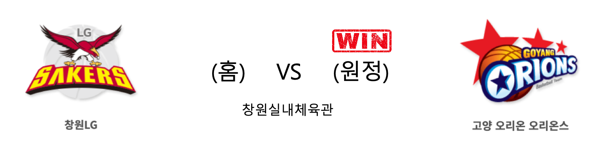
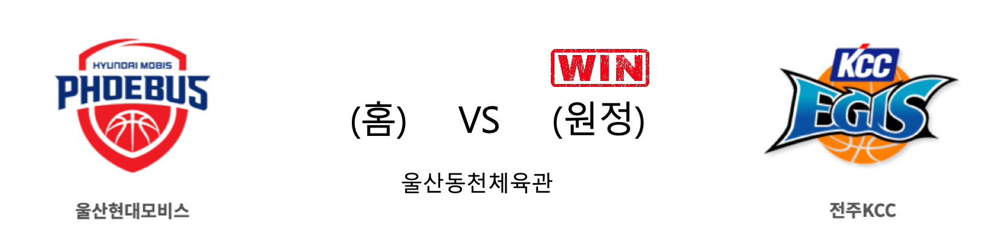

####  서울삼성(홈) VS 인천전자랜드(원정) 

<table class="tg">
  <tr>
    <th class="tg-rr9t">서울삼성</th>
    <th class="tg-rr9t">팀</th>
    <th class="tg-rr9t">인천전자랜드</th>
  </tr>
  <tr>
    <td class="tg-dcpn">1승 1패</td>
    <td class="tg-rr9t">시즌 상대전적</td>
    <td class="tg-dcpn">1승 1패</td>
  </tr>
  <tr>
    <td class="tg-dcpn">84</td>
    <td class="tg-rr9t">점수</td>
    <td class="tg-dcpn">77</td>
  </tr>
  <tr>
    <td class="tg-dcpn">26/46(57%)</td>
    <td class="tg-rr9t">2점(%)</td>
    <td class="tg-dcpn">31/52(60%)</td>
  </tr>
  <tr>
    <td class="tg-dcpn">6/23(26%)</td>
    <td class="tg-rr9t">3점(%)</td>
    <td class="tg-dcpn">2/17(12%)</td>
  </tr>
  <tr>
    <td class="tg-dcpn">14/19(74%)</td>
    <td class="tg-rr9t">자유투(%)</td>
    <td class="tg-dcpn">9/12(75%)</td>
  </tr>
  <tr>
    <td class="tg-dcpn">33</td>
    <td class="tg-rr9t">리바운드</td>
    <td class="tg-dcpn">38</td>
  </tr>
  <tr>
    <td class="tg-dcpn">20</td>
    <td class="tg-rr9t">어시스트</td>
    <td class="tg-dcpn">21</td>
  </tr>
  <tr>
    <td class="tg-dcpn">9</td>
    <td class="tg-rr9t">스틸</td>
    <td class="tg-dcpn">7</td>
  </tr>
  <tr>
    <td class="tg-dcpn">2</td>
    <td class="tg-rr9t">블록</td>
    <td class="tg-dcpn">1</td>
  </tr>
  <tr>
    <td class="tg-dcpn">11</td>
    <td class="tg-rr9t">턴오버</td>
    <td class="tg-dcpn">13</td>
  </tr>
  <tr>
    <td class="tg-dcpn">닉 미네라스(30) 김준일(16)</td>
    <td class="tg-rr9t">주요 득점선수</td>
    <td class="tg-dcpn">강상재(17) 섀넌 쇼터(16)</td>
  </tr>
</table>

#### 경기 관련 주요 기사         

[프로농구 삼성, 전자랜드 꺾고 3연승 질주](http://www.newsis.com/view/?id=NISX20191116_0000831807&cID=10505&pID=10500)

['미네라스·제임스 펄펄' 삼성, 전자랜드 전 7연패 탈출](http://yna.kr/AKR20191116042800007?did=1195m)

[[사진]서울 삼성,'전자랜드 상대 완승'](http://www.osen.co.kr/article/G1111262341)

[[라커룸에서] 서울 삼성과 인천 전자랜드의 2차 대전 키워드는? ‘빅 라인업’](http://sports.news.naver.com/basketball/news/read.nhn?oid=065&aid=0000192434)

        
        

####  창원LG(홈) VS 고양오리온(원정) 

<table class="tg">
  <tr>
    <th class="tg-rr9t">창원LG</th>
    <th class="tg-rr9t">팀</th>
    <th class="tg-rr9t">고양오리온</th>
  </tr>
  <tr>
    <td class="tg-dcpn">1승 1패</td>
    <td class="tg-rr9t">시즌 상대전적</td>
    <td class="tg-dcpn">1승 1패</td>
  </tr>
  <tr>
    <td class="tg-dcpn">80</td>
    <td class="tg-rr9t">점수</td>
    <td class="tg-dcpn">81</td>
  </tr>
  <tr>
    <td class="tg-dcpn">21/45(47%)</td>
    <td class="tg-rr9t">2점(%)</td>
    <td class="tg-dcpn">20/46(43%)</td>
  </tr>
  <tr>
    <td class="tg-dcpn">8/20(40%)</td>
    <td class="tg-rr9t">3점(%)</td>
    <td class="tg-dcpn">7/21(33%)</td>
  </tr>
  <tr>
    <td class="tg-dcpn">14/21(67%)</td>
    <td class="tg-rr9t">자유투(%)</td>
    <td class="tg-dcpn">20/25(80%)</td>
  </tr>
  <tr>
    <td class="tg-dcpn">39</td>
    <td class="tg-rr9t">리바운드</td>
    <td class="tg-dcpn">34</td>
  </tr>
  <tr>
    <td class="tg-dcpn">17</td>
    <td class="tg-rr9t">어시스트</td>
    <td class="tg-dcpn">14</td>
  </tr>
  <tr>
    <td class="tg-dcpn">4</td>
    <td class="tg-rr9t">스틸</td>
    <td class="tg-dcpn">5</td>
  </tr>
  <tr>
    <td class="tg-dcpn">1</td>
    <td class="tg-rr9t">블록</td>
    <td class="tg-dcpn">3</td>
  </tr>
  <tr>
    <td class="tg-dcpn">12</td>
    <td class="tg-rr9t">턴오버</td>
    <td class="tg-dcpn">9</td>
  </tr>
  <tr>
    <td class="tg-dcpn">캐디 라렌(25) 김시래(21)</td>
    <td class="tg-rr9t">주요 득점선수</td>
    <td class="tg-dcpn">보리스 사보비치(28) 이현민(15)</td>
  </tr>
</table>

#### 경기 관련 주요 기사         

['이현민 결승 3점포' 오리온, 연장 접전 끝 LG 격파](http://www.rookie.co.kr/news/articleView.html?idxno=35015)

[라렌을 봉쇄하는 오리온 수비](http://yna.kr/PYH20191116038200052?did=1196m)

[[JB포토화보] 오리온, 연장 접전 끝 81-80으로 LG에 원정 승리](http://sports.news.naver.com/basketball/news/read.nhn?oid=065&aid=0000192474)

[오리온 연장 혈투 끝 LG 제압…꼴찌싸움 백중세](http://www.sportsseoul.com/news/read/849619)

        
        

####  울산현대모비스(홈) VS 전주KCC(원정) 

<table class="tg">
  <tr>
    <th class="tg-rr9t">울산현대모비스</th>
    <th class="tg-rr9t">팀</th>
    <th class="tg-rr9t">전주KCC</th>
  </tr>
  <tr>
    <td class="tg-dcpn">1승 1패</td>
    <td class="tg-rr9t">시즌 상대전적</td>
    <td class="tg-dcpn">1승 1패</td>
  </tr>
  <tr>
    <td class="tg-dcpn">76</td>
    <td class="tg-rr9t">점수</td>
    <td class="tg-dcpn">79</td>
  </tr>
  <tr>
    <td class="tg-dcpn">23/51(45%)</td>
    <td class="tg-rr9t">2점(%)</td>
    <td class="tg-dcpn">31/51(61%)</td>
  </tr>
  <tr>
    <td class="tg-dcpn">7/22(32%)</td>
    <td class="tg-rr9t">3점(%)</td>
    <td class="tg-dcpn">3/15(20%)</td>
  </tr>
  <tr>
    <td class="tg-dcpn">9/15(60%)</td>
    <td class="tg-rr9t">자유투(%)</td>
    <td class="tg-dcpn">8/13(62%)</td>
  </tr>
  <tr>
    <td class="tg-dcpn">31</td>
    <td class="tg-rr9t">리바운드</td>
    <td class="tg-dcpn">38</td>
  </tr>
  <tr>
    <td class="tg-dcpn">16</td>
    <td class="tg-rr9t">어시스트</td>
    <td class="tg-dcpn">19</td>
  </tr>
  <tr>
    <td class="tg-dcpn">12</td>
    <td class="tg-rr9t">스틸</td>
    <td class="tg-dcpn">6</td>
  </tr>
  <tr>
    <td class="tg-dcpn">1</td>
    <td class="tg-rr9t">블록</td>
    <td class="tg-dcpn">5</td>
  </tr>
  <tr>
    <td class="tg-dcpn">9</td>
    <td class="tg-rr9t">턴오버</td>
    <td class="tg-dcpn">14</td>
  </tr>
  <tr>
    <td class="tg-dcpn">김국찬(20)</td>
    <td class="tg-rr9t">주요 득점선수</td>
    <td class="tg-dcpn">라건아(26) 송교창(21) 송창용(17)</td>
  </tr>
</table>

#### 경기 관련 주요 기사         

[훈련도 버거운 이대성-라건아, KCC 적응 시간 필요하다](http://www.rookie.co.kr/news/articleView.html?idxno=35008)

[[내 맘대로 프리뷰] 트레이드 후 첫 빅뱅, 현대모비스-KCC의 공통 과제는?](http://www.basketkorea.com/news/articleView.html?idxno=190162)

[[JB포토화보] KCC, 울산에서 현대모비스에 승리 (KCC 79-76 현대모비스)](http://sports.news.naver.com/basketball/news/read.nhn?oid=065&aid=0000192472)

        
        

#### 리그 순위

<table class="tg">
  <tr>
    <th class="tg-d14o">순위</th>
    <th class="tg-d14o">팀명</th>
    <th class="tg-d14o">경기수</th>
    <th class="tg-d14o">승</th>
    <th class="tg-d14o">패</th>
    <th class="tg-d14o">승차</th>
    <th class="tg-d14o">승률</th>
  </tr>
  
<tr>
    <td class="tg-50j8">1</td>
    <td class="tg-50j8">서울SK</td>
    <td class="tg-50j8">13</td>
    <td class="tg-50j8">10</td>
    <td class="tg-50j8">3</td>
    <td class="tg-50j8">0</td>
    <td class="tg-50j8">0.769</td>
</tr>

<tr>
    <td class="tg-50j8">2</td>
    <td class="tg-50j8">인천전자랜드</td>
    <td class="tg-50j8">14</td>
    <td class="tg-50j8">9</td>
    <td class="tg-50j8">5</td>
    <td class="tg-50j8">1</td>
    <td class="tg-50j8">0.643</td>
</tr>

<tr>
    <td class="tg-50j8">3</td>
    <td class="tg-50j8">전주KCC</td>
    <td class="tg-50j8">15</td>
    <td class="tg-50j8">9</td>
    <td class="tg-50j8">6</td>
    <td class="tg-50j8">1</td>
    <td class="tg-50j8">0.6</td>
</tr>

<tr>
    <td class="tg-50j8">4</td>
    <td class="tg-50j8">원주DB</td>
    <td class="tg-50j8">14</td>
    <td class="tg-50j8">8</td>
    <td class="tg-50j8">6</td>
    <td class="tg-50j8">2</td>
    <td class="tg-50j8">0.571</td>
</tr>

<tr>
    <td class="tg-50j8">5</td>
    <td class="tg-50j8">서울삼성</td>
    <td class="tg-50j8">14</td>
    <td class="tg-50j8">7</td>
    <td class="tg-50j8">7</td>
    <td class="tg-50j8">3</td>
    <td class="tg-50j8">0.5</td>
</tr>

<tr>
    <td class="tg-50j8">5</td>
    <td class="tg-50j8">안양KGC</td>
    <td class="tg-50j8">14</td>
    <td class="tg-50j8">7</td>
    <td class="tg-50j8">7</td>
    <td class="tg-50j8">3</td>
    <td class="tg-50j8">0.5</td>
</tr>

<tr>
    <td class="tg-50j8">7</td>
    <td class="tg-50j8">울산현대모비스</td>
    <td class="tg-50j8">15</td>
    <td class="tg-50j8">6</td>
    <td class="tg-50j8">9</td>
    <td class="tg-50j8">4</td>
    <td class="tg-50j8">0.4</td>
</tr>

<tr>
    <td class="tg-50j8">8</td>
    <td class="tg-50j8">부산KT</td>
    <td class="tg-50j8">13</td>
    <td class="tg-50j8">5</td>
    <td class="tg-50j8">8</td>
    <td class="tg-50j8">5</td>
    <td class="tg-50j8">0.385</td>
</tr>

<tr>
    <td class="tg-50j8">9</td>
    <td class="tg-50j8">고양오리온</td>
    <td class="tg-50j8">14</td>
    <td class="tg-50j8">5</td>
    <td class="tg-50j8">9</td>
    <td class="tg-50j8">5</td>
    <td class="tg-50j8">0.357</td>
</tr>

<tr>
    <td class="tg-50j8">10</td>
    <td class="tg-50j8">창원LG</td>
    <td class="tg-50j8">16</td>
    <td class="tg-50j8">5</td>
    <td class="tg-50j8">11</td>
    <td class="tg-50j8">5</td>
    <td class="tg-50j8">0.312</td>
</tr>
</table> 

        
        
