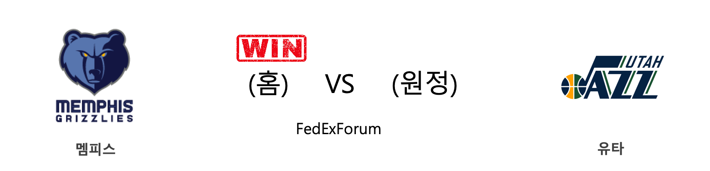
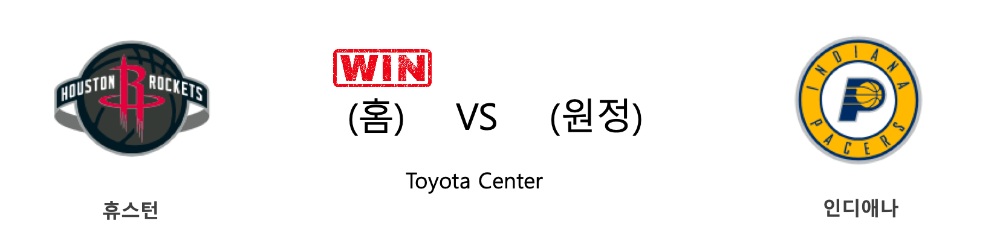
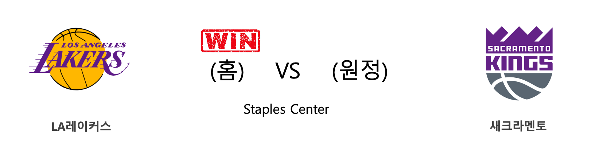
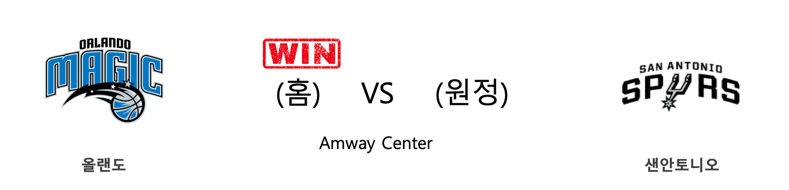

####  GSW(홈) VS BOS(원정) 

<table class="tg">
  <tr>
    <th class="tg-rr9t">GSW</th>
    <th class="tg-rr9t">팀</th>
    <th class="tg-rr9t">BOS</th>
  </tr>
  <tr>
    <td class="tg-dcpn">0승 1패</td>
    <td class="tg-rr9t">시즌 상대전적</td>
    <td class="tg-dcpn">1승 0패</td>
  </tr>
  <tr>
    <td class="tg-dcpn">100</td>
    <td class="tg-rr9t">점수</td>
    <td class="tg-dcpn">105</td>
  </tr>
  <tr>
    <td class="tg-dcpn">29/54(54%)</td>
    <td class="tg-rr9t">2점(%)</td>
    <td class="tg-dcpn">24/58(41%)</td>
  </tr>
  <tr>
    <td class="tg-dcpn">5/28(18%)</td>
    <td class="tg-rr9t">3점(%)</td>
    <td class="tg-dcpn">13/33(39%)</td>
  </tr>
  <tr>
    <td class="tg-dcpn">27/34(79%)</td>
    <td class="tg-rr9t">자유투(%)</td>
    <td class="tg-dcpn">18/23(78%)</td>
  </tr>
  <tr>
    <td class="tg-dcpn">55</td>
    <td class="tg-rr9t">리바운드</td>
    <td class="tg-dcpn">47</td>
  </tr>
  <tr>
    <td class="tg-dcpn">17</td>
    <td class="tg-rr9t">어시스트</td>
    <td class="tg-dcpn">24</td>
  </tr>
  <tr>
    <td class="tg-dcpn">8</td>
    <td class="tg-rr9t">스틸</td>
    <td class="tg-dcpn">13</td>
  </tr>
  <tr>
    <td class="tg-dcpn">4</td>
    <td class="tg-rr9t">블록</td>
    <td class="tg-dcpn">5</td>
  </tr>
  <tr>
    <td class="tg-dcpn">19</td>
    <td class="tg-rr9t">턴오버</td>
    <td class="tg-dcpn">14</td>
  </tr>
  <tr>
    <td class="tg-dcpn">AlecBurks(20) EricPaschallF(16)</td>
    <td class="tg-rr9t">주요 득점선수</td>
    <td class="tg-dcpn">KembaWalkerG(20) JaysonTatumF(24) MarcusSmartG(15) JaylenBrownF(22)</td>
  </tr>
</table>

#### 경기 관련 주요 기사         

[[오늘의 NBA] (11/10) 제임스 하든의 3점 라인 영점 사격](http://sports.news.naver.com/basketball/news/read.nhn?oid=486&aid=0000001133)

[[오늘의 NBA] (11/16) 멤피스, Grit&Grind 시대와의 성공적인 단절](http://sports.news.naver.com/basketball/news/read.nhn?oid=486&aid=0000001139)

[[오늘의 NBA] (11/13) LAL 카일 쿠즈마의 대반격](http://sports.news.naver.com/basketball/news/read.nhn?oid=486&aid=0000001136)

[[오늘의 NBA] (11/9) 위긴스 vs 러셀, 타깃 센터의 명승부](http://sports.news.naver.com/basketball/news/read.nhn?oid=486&aid=0000001132)

[[오늘의 NBA] (11/8) 켐바 워커의 홈 커밍 데이](http://sports.news.naver.com/basketball/news/read.nhn?oid=486&aid=0000001131)

        
        

####  MEM(홈) VS UTA(원정) 

<table class="tg">
  <tr>
    <th class="tg-rr9t">MEM</th>
    <th class="tg-rr9t">팀</th>
    <th class="tg-rr9t">UTA</th>
  </tr>
  <tr>
    <td class="tg-dcpn">1승 0패</td>
    <td class="tg-rr9t">시즌 상대전적</td>
    <td class="tg-dcpn">0승 1패</td>
  </tr>
  <tr>
    <td class="tg-dcpn">107</td>
    <td class="tg-rr9t">점수</td>
    <td class="tg-dcpn">106</td>
  </tr>
  <tr>
    <td class="tg-dcpn">33/61(54%)</td>
    <td class="tg-rr9t">2점(%)</td>
    <td class="tg-dcpn">26/53(49%)</td>
  </tr>
  <tr>
    <td class="tg-dcpn">10/35(29%)</td>
    <td class="tg-rr9t">3점(%)</td>
    <td class="tg-dcpn">9/34(26%)</td>
  </tr>
  <tr>
    <td class="tg-dcpn">11/13(85%)</td>
    <td class="tg-rr9t">자유투(%)</td>
    <td class="tg-dcpn">27/32(84%)</td>
  </tr>
  <tr>
    <td class="tg-dcpn">46</td>
    <td class="tg-rr9t">리바운드</td>
    <td class="tg-dcpn">45</td>
  </tr>
  <tr>
    <td class="tg-dcpn">25</td>
    <td class="tg-rr9t">어시스트</td>
    <td class="tg-dcpn">17</td>
  </tr>
  <tr>
    <td class="tg-dcpn">6</td>
    <td class="tg-rr9t">스틸</td>
    <td class="tg-dcpn">5</td>
  </tr>
  <tr>
    <td class="tg-dcpn">5</td>
    <td class="tg-rr9t">블록</td>
    <td class="tg-dcpn">6</td>
  </tr>
  <tr>
    <td class="tg-dcpn">11</td>
    <td class="tg-rr9t">턴오버</td>
    <td class="tg-dcpn">14</td>
  </tr>
  <tr>
    <td class="tg-dcpn">JaMorantG(25) DillonBrooksG(20)</td>
    <td class="tg-rr9t">주요 득점선수</td>
    <td class="tg-dcpn">RudyGobertC(23) DonovanMitche(29) MikeConleyG(15) BojanBogdanov(20)</td>
  </tr>
</table>

#### 경기 관련 주요 기사         

[[NBA] 시즌개막특집 ⑤ 2019-2020시즌, 점프볼이 추천하는 이적생들](http://sports.news.naver.com/basketball/news/read.nhn?oid=065&aid=0000190747)

[[오늘의 NBA] (10/31) HOU vs WAS, NBA 득점 쟁탈전 역사를 새로 쓰다](http://sports.news.naver.com/basketball/news/read.nhn?oid=486&aid=0000001123)

[[오늘의 NBA] (11/6) 트레이 영, 애틀랜타의 특급 유망주](http://sports.news.naver.com/basketball/news/read.nhn?oid=486&aid=0000001129)

[[오늘의 NBA] (11/9) 위긴스 vs 러셀, 타깃 센터의 명승부](http://sports.news.naver.com/basketball/news/read.nhn?oid=486&aid=0000001132)

[[오늘의 NBA] (11/16) 멤피스, Grit&Grind 시대와의 성공적인 단절](http://sports.news.naver.com/basketball/news/read.nhn?oid=486&aid=0000001139)

        
        

####  CHA(홈) VS DET(원정) 

<table class="tg">
  <tr>
    <th class="tg-rr9t">CHA</th>
    <th class="tg-rr9t">팀</th>
    <th class="tg-rr9t">DET</th>
  </tr>
  <tr>
    <td class="tg-dcpn">1승 0패</td>
    <td class="tg-rr9t">시즌 상대전적</td>
    <td class="tg-dcpn">0승 1패</td>
  </tr>
  <tr>
    <td class="tg-dcpn">109</td>
    <td class="tg-rr9t">점수</td>
    <td class="tg-dcpn">106</td>
  </tr>
  <tr>
    <td class="tg-dcpn">30/61(49%)</td>
    <td class="tg-rr9t">2점(%)</td>
    <td class="tg-dcpn">25/46(54%)</td>
  </tr>
  <tr>
    <td class="tg-dcpn">13/35(37%)</td>
    <td class="tg-rr9t">3점(%)</td>
    <td class="tg-dcpn">15/35(43%)</td>
  </tr>
  <tr>
    <td class="tg-dcpn">10/16(62%)</td>
    <td class="tg-rr9t">자유투(%)</td>
    <td class="tg-dcpn">11/11(100%)</td>
  </tr>
  <tr>
    <td class="tg-dcpn">41</td>
    <td class="tg-rr9t">리바운드</td>
    <td class="tg-dcpn">42</td>
  </tr>
  <tr>
    <td class="tg-dcpn">22</td>
    <td class="tg-rr9t">어시스트</td>
    <td class="tg-dcpn">25</td>
  </tr>
  <tr>
    <td class="tg-dcpn">10</td>
    <td class="tg-rr9t">스틸</td>
    <td class="tg-dcpn">3</td>
  </tr>
  <tr>
    <td class="tg-dcpn">3</td>
    <td class="tg-rr9t">블록</td>
    <td class="tg-dcpn">3</td>
  </tr>
  <tr>
    <td class="tg-dcpn">10</td>
    <td class="tg-rr9t">턴오버</td>
    <td class="tg-dcpn">19</td>
  </tr>
  <tr>
    <td class="tg-dcpn">TerryRozierG(19) MalikMonk(19) Devonte'Graha(18)</td>
    <td class="tg-rr9t">주요 득점선수</td>
    <td class="tg-dcpn">LangstonGallo(32) AndreDrummond(16) BlakeGriffinF(19) DerrickRose(16)</td>
  </tr>
</table>

#### 경기 관련 주요 기사         

[[오늘의 NBA] (11/16) 멤피스, Grit&Grind 시대와의 성공적인 단절](http://sports.news.naver.com/basketball/news/read.nhn?oid=486&aid=0000001139)

[[오늘의 NBA] (10/31) HOU vs WAS, NBA 득점 쟁탈전 역사를 새로 쓰다](http://sports.news.naver.com/basketball/news/read.nhn?oid=486&aid=0000001123)

[[오늘의 NBA] (11/11) 토론토, 디펜딩 챔피언의 저력](http://sports.news.naver.com/basketball/news/read.nhn?oid=486&aid=0000001134)

[[오늘의 NBA] 시즌 프리뷰 : 디트로이트, 슈팅 문제를 극복하라!](http://sports.news.naver.com/basketball/news/read.nhn?oid=486&aid=0000001096)

[오늘의 NBA] (11/3) 안드레 드러먼드, 모터 시티의 세계수](http://sports.news.naver.com/basketball/news/read.nhn?oid=486&aid=0000001126)

        
        

####  HOU(홈) VS IND(원정) 

<table class="tg">
  <tr>
    <th class="tg-rr9t">HOU</th>
    <th class="tg-rr9t">팀</th>
    <th class="tg-rr9t">IND</th>
  </tr>
  <tr>
    <td class="tg-dcpn">1승 0패</td>
    <td class="tg-rr9t">시즌 상대전적</td>
    <td class="tg-dcpn">0승 1패</td>
  </tr>
  <tr>
    <td class="tg-dcpn">111</td>
    <td class="tg-rr9t">점수</td>
    <td class="tg-dcpn">102</td>
  </tr>
  <tr>
    <td class="tg-dcpn">22/43(51%)</td>
    <td class="tg-rr9t">2점(%)</td>
    <td class="tg-dcpn">29/49(59%)</td>
  </tr>
  <tr>
    <td class="tg-dcpn">14/46(30%)</td>
    <td class="tg-rr9t">3점(%)</td>
    <td class="tg-dcpn">8/33(24%)</td>
  </tr>
  <tr>
    <td class="tg-dcpn">25/29(86%)</td>
    <td class="tg-rr9t">자유투(%)</td>
    <td class="tg-dcpn">20/26(77%)</td>
  </tr>
  <tr>
    <td class="tg-dcpn">44</td>
    <td class="tg-rr9t">리바운드</td>
    <td class="tg-dcpn">42</td>
  </tr>
  <tr>
    <td class="tg-dcpn">12</td>
    <td class="tg-rr9t">어시스트</td>
    <td class="tg-dcpn">24</td>
  </tr>
  <tr>
    <td class="tg-dcpn">11</td>
    <td class="tg-rr9t">스틸</td>
    <td class="tg-dcpn">2</td>
  </tr>
  <tr>
    <td class="tg-dcpn">3</td>
    <td class="tg-rr9t">블록</td>
    <td class="tg-dcpn">2</td>
  </tr>
  <tr>
    <td class="tg-dcpn">8</td>
    <td class="tg-rr9t">턴오버</td>
    <td class="tg-dcpn">16</td>
  </tr>
  <tr>
    <td class="tg-dcpn">JamesHardenG(44) RussellWestbr(17) BenMcLemoreF(21)</td>
    <td class="tg-rr9t">주요 득점선수</td>
    <td class="tg-dcpn">DougMcDermott(18) DomantasSabon(18)</td>
  </tr>
</table>

#### 경기 관련 주요 기사         

[[오늘의 NBA] (11/7) 야니스 아테토쿤보의 MVP 수성 의지](http://sports.news.naver.com/basketball/news/read.nhn?oid=486&aid=0000001130)

[[오늘의 NBA] (11/11) 토론토, 디펜딩 챔피언의 저력](http://sports.news.naver.com/basketball/news/read.nhn?oid=486&aid=0000001134)

[[오늘의 NBA] (11/4) 마이애미의 대권 도전 행보](http://sports.news.naver.com/basketball/news/read.nhn?oid=486&aid=0000001127)

[[오늘의 NBA] (11/16) 멤피스, Grit&Grind 시대와의 성공적인 단절](http://sports.news.naver.com/basketball/news/read.nhn?oid=486&aid=0000001139)

[[오늘의 NBA] (11/9) 위긴스 vs 러셀, 타깃 센터의 명승부](http://sports.news.naver.com/basketball/news/read.nhn?oid=486&aid=0000001132)

        
        

####  OKC(홈) VS PHI(원정) 

<table class="tg">
  <tr>
    <th class="tg-rr9t">OKC</th>
    <th class="tg-rr9t">팀</th>
    <th class="tg-rr9t">PHI</th>
  </tr>
  <tr>
    <td class="tg-dcpn">1승 0패</td>
    <td class="tg-rr9t">시즌 상대전적</td>
    <td class="tg-dcpn">0승 1패</td>
  </tr>
  <tr>
    <td class="tg-dcpn">127</td>
    <td class="tg-rr9t">점수</td>
    <td class="tg-dcpn">119</td>
  </tr>
  <tr>
    <td class="tg-dcpn">31/52(60%)</td>
    <td class="tg-rr9t">2점(%)</td>
    <td class="tg-dcpn">31/58(53%)</td>
  </tr>
  <tr>
    <td class="tg-dcpn">10/24(42%)</td>
    <td class="tg-rr9t">3점(%)</td>
    <td class="tg-dcpn">14/32(44%)</td>
  </tr>
  <tr>
    <td class="tg-dcpn">35/41(85%)</td>
    <td class="tg-rr9t">자유투(%)</td>
    <td class="tg-dcpn">15/22(68%)</td>
  </tr>
  <tr>
    <td class="tg-dcpn">36</td>
    <td class="tg-rr9t">리바운드</td>
    <td class="tg-dcpn">43</td>
  </tr>
  <tr>
    <td class="tg-dcpn">22</td>
    <td class="tg-rr9t">어시스트</td>
    <td class="tg-dcpn">24</td>
  </tr>
  <tr>
    <td class="tg-dcpn">7</td>
    <td class="tg-rr9t">스틸</td>
    <td class="tg-dcpn">6</td>
  </tr>
  <tr>
    <td class="tg-dcpn">3</td>
    <td class="tg-rr9t">블록</td>
    <td class="tg-dcpn">0</td>
  </tr>
  <tr>
    <td class="tg-dcpn">13</td>
    <td class="tg-rr9t">턴오버</td>
    <td class="tg-dcpn">14</td>
  </tr>
  <tr>
    <td class="tg-dcpn">ShaiGilgeous-(24) TerranceFergu(19) DaniloGallina(28) ChrisPaulG(27)</td>
    <td class="tg-rr9t">주요 득점선수</td>
    <td class="tg-dcpn">BenSimmonsG(16) JoshRichardso(28) JoelEmbiidC(31) TobiasHarrisF(21)</td>
  </tr>
</table>

#### 경기 관련 주요 기사         

['CP3 맹활약' OKC, 연장 접전 끝에 PHI 격파](http://www.rookie.co.kr/news/articleView.html?idxno=34997)

[[오늘의 NBA] (11/16) 멤피스, Grit&Grind 시대와의 성공적인 단절](http://sports.news.naver.com/basketball/news/read.nhn?oid=486&aid=0000001139)

[[오늘의 NBA] (11/5) 데빈 부커, 강팀의 에이스](http://sports.news.naver.com/basketball/news/read.nhn?oid=486&aid=0000001128)

[[오늘의 NBA] (11/11) 토론토, 디펜딩 챔피언의 저력](http://sports.news.naver.com/basketball/news/read.nhn?oid=486&aid=0000001134)

[오늘의 NBA] (11/3) 안드레 드러먼드, 모터 시티의 세계수](http://sports.news.naver.com/basketball/news/read.nhn?oid=486&aid=0000001126)

        
        

####  LAL(홈) VS SAC(원정) 

<table class="tg">
  <tr>
    <th class="tg-rr9t">LAL</th>
    <th class="tg-rr9t">팀</th>
    <th class="tg-rr9t">SAC</th>
  </tr>
  <tr>
    <td class="tg-dcpn">1승 0패</td>
    <td class="tg-rr9t">시즌 상대전적</td>
    <td class="tg-dcpn">0승 1패</td>
  </tr>
  <tr>
    <td class="tg-dcpn">99</td>
    <td class="tg-rr9t">점수</td>
    <td class="tg-dcpn">97</td>
  </tr>
  <tr>
    <td class="tg-dcpn">23/44(52%)</td>
    <td class="tg-rr9t">2점(%)</td>
    <td class="tg-dcpn">20/43(47%)</td>
  </tr>
  <tr>
    <td class="tg-dcpn">11/37(30%)</td>
    <td class="tg-rr9t">3점(%)</td>
    <td class="tg-dcpn">16/39(41%)</td>
  </tr>
  <tr>
    <td class="tg-dcpn">20/22(91%)</td>
    <td class="tg-rr9t">자유투(%)</td>
    <td class="tg-dcpn">9/9(100%)</td>
  </tr>
  <tr>
    <td class="tg-dcpn">41</td>
    <td class="tg-rr9t">리바운드</td>
    <td class="tg-dcpn">43</td>
  </tr>
  <tr>
    <td class="tg-dcpn">22</td>
    <td class="tg-rr9t">어시스트</td>
    <td class="tg-dcpn">24</td>
  </tr>
  <tr>
    <td class="tg-dcpn">11</td>
    <td class="tg-rr9t">스틸</td>
    <td class="tg-dcpn">7</td>
  </tr>
  <tr>
    <td class="tg-dcpn">6</td>
    <td class="tg-rr9t">블록</td>
    <td class="tg-dcpn">0</td>
  </tr>
  <tr>
    <td class="tg-dcpn">13</td>
    <td class="tg-rr9t">턴오버</td>
    <td class="tg-dcpn">17</td>
  </tr>
  <tr>
    <td class="tg-dcpn">LeBronJamesF(29) KentaviousCal(16) AnthonyDavisF(17)</td>
    <td class="tg-rr9t">주요 득점선수</td>
    <td class="tg-dcpn">BuddyHieldG(21) BogdanBogdano(18) RichaunHolmes(17)</td>
  </tr>
</table>

#### 경기 관련 주요 기사         

[[오늘의 NBA] (11/16) 멤피스, Grit&Grind 시대와의 성공적인 단절](http://sports.news.naver.com/basketball/news/read.nhn?oid=486&aid=0000001139)

[[오늘의 NBA] (11/4) 마이애미의 대권 도전 행보](http://sports.news.naver.com/basketball/news/read.nhn?oid=486&aid=0000001127)

[[오늘의 NBA] (11/9) 위긴스 vs 러셀, 타깃 센터의 명승부](http://sports.news.naver.com/basketball/news/read.nhn?oid=486&aid=0000001132)

[[오늘의 NBA] (11/13) LAL 카일 쿠즈마의 대반격](http://sports.news.naver.com/basketball/news/read.nhn?oid=486&aid=0000001136)

[[오늘의 NBA] (11/7) 야니스 아테토쿤보의 MVP 수성 의지](http://sports.news.naver.com/basketball/news/read.nhn?oid=486&aid=0000001130)

        
        

####  ORL(홈) VS SAS(원정) 

<table class="tg">
  <tr>
    <th class="tg-rr9t">ORL</th>
    <th class="tg-rr9t">팀</th>
    <th class="tg-rr9t">SAS</th>
  </tr>
  <tr>
    <td class="tg-dcpn">1승 0패</td>
    <td class="tg-rr9t">시즌 상대전적</td>
    <td class="tg-dcpn">0승 1패</td>
  </tr>
  <tr>
    <td class="tg-dcpn">111</td>
    <td class="tg-rr9t">점수</td>
    <td class="tg-dcpn">109</td>
  </tr>
  <tr>
    <td class="tg-dcpn">24/58(41%)</td>
    <td class="tg-rr9t">2점(%)</td>
    <td class="tg-dcpn">32/63(51%)</td>
  </tr>
  <tr>
    <td class="tg-dcpn">12/29(41%)</td>
    <td class="tg-rr9t">3점(%)</td>
    <td class="tg-dcpn">13/26(50%)</td>
  </tr>
  <tr>
    <td class="tg-dcpn">27/34(79%)</td>
    <td class="tg-rr9t">자유투(%)</td>
    <td class="tg-dcpn">6/10(60%)</td>
  </tr>
  <tr>
    <td class="tg-dcpn">48</td>
    <td class="tg-rr9t">리바운드</td>
    <td class="tg-dcpn">41</td>
  </tr>
  <tr>
    <td class="tg-dcpn">22</td>
    <td class="tg-rr9t">어시스트</td>
    <td class="tg-dcpn">23</td>
  </tr>
  <tr>
    <td class="tg-dcpn">6</td>
    <td class="tg-rr9t">스틸</td>
    <td class="tg-dcpn">8</td>
  </tr>
  <tr>
    <td class="tg-dcpn">5</td>
    <td class="tg-rr9t">블록</td>
    <td class="tg-dcpn">8</td>
  </tr>
  <tr>
    <td class="tg-dcpn">10</td>
    <td class="tg-rr9t">턴오버</td>
    <td class="tg-dcpn">11</td>
  </tr>
  <tr>
    <td class="tg-dcpn">EvanFournierG(26) TerrenceRoss(20)</td>
    <td class="tg-rr9t">주요 득점선수</td>
    <td class="tg-dcpn">DeMarDeRozanF(21)</td>
  </tr>
</table>

#### 경기 관련 주요 기사         

[[오늘의 NBA] (11/9) 위긴스 vs 러셀, 타깃 센터의 명승부](http://sports.news.naver.com/basketball/news/read.nhn?oid=486&aid=0000001132)

[[오늘의 NBA] (11/7) 야니스 아테토쿤보의 MVP 수성 의지](http://sports.news.naver.com/basketball/news/read.nhn?oid=486&aid=0000001130)

[[오늘의 NBA] (11/2) 르브론 제임스의 왕권신수설](http://sports.news.naver.com/basketball/news/read.nhn?oid=486&aid=0000001125)

[[오늘의 NBA] (10/30) 앤써니 데이비스, 골드&퍼플 군단의 새로운 태양](http://sports.news.naver.com/basketball/news/read.nhn?oid=486&aid=0000001122)

[[오늘의 NBA] (11/4) 마이애미의 대권 도전 행보](http://sports.news.naver.com/basketball/news/read.nhn?oid=486&aid=0000001127)

        
        

####  MIN(홈) VS WAS(원정) 

<table class="tg">
  <tr>
    <th class="tg-rr9t">MIN</th>
    <th class="tg-rr9t">팀</th>
    <th class="tg-rr9t">WAS</th>
  </tr>
  <tr>
    <td class="tg-dcpn">1승 1패</td>
    <td class="tg-rr9t">시즌 상대전적</td>
    <td class="tg-dcpn">1승 1패</td>
  </tr>
  <tr>
    <td class="tg-dcpn">116</td>
    <td class="tg-rr9t">점수</td>
    <td class="tg-dcpn">137</td>
  </tr>
  <tr>
    <td class="tg-dcpn">31/52(60%)</td>
    <td class="tg-rr9t">2점(%)</td>
    <td class="tg-dcpn">44/72(61%)</td>
  </tr>
  <tr>
    <td class="tg-dcpn">11/37(30%)</td>
    <td class="tg-rr9t">3점(%)</td>
    <td class="tg-dcpn">10/28(36%)</td>
  </tr>
  <tr>
    <td class="tg-dcpn">21/29(72%)</td>
    <td class="tg-rr9t">자유투(%)</td>
    <td class="tg-dcpn">19/25(76%)</td>
  </tr>
  <tr>
    <td class="tg-dcpn">43</td>
    <td class="tg-rr9t">리바운드</td>
    <td class="tg-dcpn">51</td>
  </tr>
  <tr>
    <td class="tg-dcpn">26</td>
    <td class="tg-rr9t">어시스트</td>
    <td class="tg-dcpn">38</td>
  </tr>
  <tr>
    <td class="tg-dcpn">6</td>
    <td class="tg-rr9t">스틸</td>
    <td class="tg-dcpn">10</td>
  </tr>
  <tr>
    <td class="tg-dcpn">5</td>
    <td class="tg-rr9t">블록</td>
    <td class="tg-dcpn">5</td>
  </tr>
  <tr>
    <td class="tg-dcpn">20</td>
    <td class="tg-rr9t">턴오버</td>
    <td class="tg-dcpn">13</td>
  </tr>
  <tr>
    <td class="tg-dcpn">RobertCovingt(20) Karl-AnthonyT(36)</td>
    <td class="tg-rr9t">주요 득점선수</td>
    <td class="tg-dcpn">MoritzWagner(30) BradleyBealG(44)</td>
  </tr>
</table>

#### 경기 관련 주요 기사         

[Michelin Guide Seoul diversifies its honorees: Pivoting its focus away from modern Korean, the 2020 list celebrates crea](http://koreajoongangdaily.joins.com/news/article/article.aspx?aid=3070307)

[Actor Kim Min-jae calls first period drama 'gift'](http://www.koreatimes.co.kr/www/nation/2019/11/688_278590.html)

[Vice fin min verbally intervenes to ease supply concerns in Korean debt market](http://pulsenews.co.kr/view.php?year=2019&no=945336)

[(Premier12) S Korea-offense](http://yna.kr/AEN20191112009300315?did=2106m)

[(Premier12) S Korea-offense](http://yna.kr/AEN20191106011600315?did=2106m)

        
        

#### 리그 (Eastern) 순위
    

<table class="tg">
  <tr>
    <th class="tg-d14o">순위</th>
    <th class="tg-d14o">팀명</th>
    <th class="tg-d14o">경기수</th>
    <th class="tg-d14o">승</th>
    <th class="tg-d14o">패</th>
    <th class="tg-d14o">승차</th>
    <th class="tg-d14o">승률</th>
  </tr>
  
<tr>
    <td class="tg-50j8">1</td>
    <td class="tg-50j8">BOS</td>
    <td class="tg-50j8">11</td>
    <td class="tg-50j8">10</td>
    <td class="tg-50j8">1</td>
    <td class="tg-50j8">0</td>
    <td class="tg-50j8">0.909</td>
</tr>

<tr>
    <td class="tg-50j8">2</td>
    <td class="tg-50j8">MIL</td>
    <td class="tg-50j8">11</td>
    <td class="tg-50j8">8</td>
    <td class="tg-50j8">3</td>
    <td class="tg-50j8">2</td>
    <td class="tg-50j8">0.727</td>
</tr>

<tr>
    <td class="tg-50j8">2</td>
    <td class="tg-50j8">MIA</td>
    <td class="tg-50j8">11</td>
    <td class="tg-50j8">8</td>
    <td class="tg-50j8">3</td>
    <td class="tg-50j8">2</td>
    <td class="tg-50j8">0.727</td>
</tr>

<tr>
    <td class="tg-50j8">2</td>
    <td class="tg-50j8">TOR</td>
    <td class="tg-50j8">11</td>
    <td class="tg-50j8">8</td>
    <td class="tg-50j8">3</td>
    <td class="tg-50j8">2</td>
    <td class="tg-50j8">0.727</td>
</tr>

<tr>
    <td class="tg-50j8">5</td>
    <td class="tg-50j8">PHI</td>
    <td class="tg-50j8">12</td>
    <td class="tg-50j8">7</td>
    <td class="tg-50j8">5</td>
    <td class="tg-50j8">3</td>
    <td class="tg-50j8">0.583</td>
</tr>

<tr>
    <td class="tg-50j8">5</td>
    <td class="tg-50j8">IND</td>
    <td class="tg-50j8">12</td>
    <td class="tg-50j8">7</td>
    <td class="tg-50j8">5</td>
    <td class="tg-50j8">3</td>
    <td class="tg-50j8">0.583</td>
</tr>

<tr>
    <td class="tg-50j8">7</td>
    <td class="tg-50j8">CHA</td>
    <td class="tg-50j8">12</td>
    <td class="tg-50j8">5</td>
    <td class="tg-50j8">7</td>
    <td class="tg-50j8">5</td>
    <td class="tg-50j8">0.417</td>
</tr>

<tr>
    <td class="tg-50j8">7</td>
    <td class="tg-50j8">ORL</td>
    <td class="tg-50j8">12</td>
    <td class="tg-50j8">5</td>
    <td class="tg-50j8">7</td>
    <td class="tg-50j8">5</td>
    <td class="tg-50j8">0.417</td>
</tr>

<tr>
    <td class="tg-50j8">9</td>
    <td class="tg-50j8">ATL</td>
    <td class="tg-50j8">11</td>
    <td class="tg-50j8">4</td>
    <td class="tg-50j8">7</td>
    <td class="tg-50j8">6</td>
    <td class="tg-50j8">0.364</td>
</tr>

<tr>
    <td class="tg-50j8">9</td>
    <td class="tg-50j8">BKN</td>
    <td class="tg-50j8">11</td>
    <td class="tg-50j8">4</td>
    <td class="tg-50j8">7</td>
    <td class="tg-50j8">6</td>
    <td class="tg-50j8">0.364</td>
</tr>

<tr>
    <td class="tg-50j8">9</td>
    <td class="tg-50j8">CLE</td>
    <td class="tg-50j8">11</td>
    <td class="tg-50j8">4</td>
    <td class="tg-50j8">7</td>
    <td class="tg-50j8">6</td>
    <td class="tg-50j8">0.364</td>
</tr>

<tr>
    <td class="tg-50j8">12</td>
    <td class="tg-50j8">CHI</td>
    <td class="tg-50j8">12</td>
    <td class="tg-50j8">4</td>
    <td class="tg-50j8">8</td>
    <td class="tg-50j8">6</td>
    <td class="tg-50j8">0.333</td>
</tr>

<tr>
    <td class="tg-50j8">13</td>
    <td class="tg-50j8">DET</td>
    <td class="tg-50j8">13</td>
    <td class="tg-50j8">4</td>
    <td class="tg-50j8">9</td>
    <td class="tg-50j8">6</td>
    <td class="tg-50j8">0.308</td>
</tr>

<tr>
    <td class="tg-50j8">14</td>
    <td class="tg-50j8">WAS</td>
    <td class="tg-50j8">10</td>
    <td class="tg-50j8">3</td>
    <td class="tg-50j8">7</td>
    <td class="tg-50j8">7</td>
    <td class="tg-50j8">0.3</td>
</tr>

<tr>
    <td class="tg-50j8">15</td>
    <td class="tg-50j8">NYK</td>
    <td class="tg-50j8">12</td>
    <td class="tg-50j8">3</td>
    <td class="tg-50j8">9</td>
    <td class="tg-50j8">7</td>
    <td class="tg-50j8">0.25</td>
</tr>
</table> 
#### 리그 (Western) 순위
    

<table class="tg">
  <tr>
    <th class="tg-d14o">순위</th>
    <th class="tg-d14o">팀명</th>
    <th class="tg-d14o">경기수</th>
    <th class="tg-d14o">승</th>
    <th class="tg-d14o">패</th>
    <th class="tg-d14o">승차</th>
    <th class="tg-d14o">승률</th>
  </tr>
  
<tr>
    <td class="tg-50j8">1</td>
    <td class="tg-50j8">LAL</td>
    <td class="tg-50j8">12</td>
    <td class="tg-50j8">10</td>
    <td class="tg-50j8">2</td>
    <td class="tg-50j8">0</td>
    <td class="tg-50j8">0.833</td>
</tr>

<tr>
    <td class="tg-50j8">2</td>
    <td class="tg-50j8">HOU</td>
    <td class="tg-50j8">12</td>
    <td class="tg-50j8">9</td>
    <td class="tg-50j8">3</td>
    <td class="tg-50j8">1</td>
    <td class="tg-50j8">0.75</td>
</tr>

<tr>
    <td class="tg-50j8">3</td>
    <td class="tg-50j8">DEN</td>
    <td class="tg-50j8">11</td>
    <td class="tg-50j8">8</td>
    <td class="tg-50j8">3</td>
    <td class="tg-50j8">2</td>
    <td class="tg-50j8">0.727</td>
</tr>

<tr>
    <td class="tg-50j8">4</td>
    <td class="tg-50j8">UTA</td>
    <td class="tg-50j8">12</td>
    <td class="tg-50j8">8</td>
    <td class="tg-50j8">4</td>
    <td class="tg-50j8">2</td>
    <td class="tg-50j8">0.667</td>
</tr>

<tr>
    <td class="tg-50j8">5</td>
    <td class="tg-50j8">PHX</td>
    <td class="tg-50j8">11</td>
    <td class="tg-50j8">7</td>
    <td class="tg-50j8">4</td>
    <td class="tg-50j8">3</td>
    <td class="tg-50j8">0.636</td>
</tr>

<tr>
    <td class="tg-50j8">6</td>
    <td class="tg-50j8">LAC</td>
    <td class="tg-50j8">12</td>
    <td class="tg-50j8">7</td>
    <td class="tg-50j8">5</td>
    <td class="tg-50j8">3</td>
    <td class="tg-50j8">0.583</td>
</tr>

<tr>
    <td class="tg-50j8">6</td>
    <td class="tg-50j8">MIN</td>
    <td class="tg-50j8">12</td>
    <td class="tg-50j8">7</td>
    <td class="tg-50j8">5</td>
    <td class="tg-50j8">3</td>
    <td class="tg-50j8">0.583</td>
</tr>

<tr>
    <td class="tg-50j8">8</td>
    <td class="tg-50j8">DAL</td>
    <td class="tg-50j8">11</td>
    <td class="tg-50j8">6</td>
    <td class="tg-50j8">5</td>
    <td class="tg-50j8">4</td>
    <td class="tg-50j8">0.545</td>
</tr>

<tr>
    <td class="tg-50j8">9</td>
    <td class="tg-50j8">MEM</td>
    <td class="tg-50j8">12</td>
    <td class="tg-50j8">5</td>
    <td class="tg-50j8">7</td>
    <td class="tg-50j8">5</td>
    <td class="tg-50j8">0.417</td>
</tr>

<tr>
    <td class="tg-50j8">9</td>
    <td class="tg-50j8">SAS</td>
    <td class="tg-50j8">12</td>
    <td class="tg-50j8">5</td>
    <td class="tg-50j8">7</td>
    <td class="tg-50j8">5</td>
    <td class="tg-50j8">0.417</td>
</tr>

<tr>
    <td class="tg-50j8">9</td>
    <td class="tg-50j8">OKC</td>
    <td class="tg-50j8">12</td>
    <td class="tg-50j8">5</td>
    <td class="tg-50j8">7</td>
    <td class="tg-50j8">5</td>
    <td class="tg-50j8">0.417</td>
</tr>

<tr>
    <td class="tg-50j8">12</td>
    <td class="tg-50j8">SAC</td>
    <td class="tg-50j8">11</td>
    <td class="tg-50j8">4</td>
    <td class="tg-50j8">7</td>
    <td class="tg-50j8">6</td>
    <td class="tg-50j8">0.364</td>
</tr>

<tr>
    <td class="tg-50j8">13</td>
    <td class="tg-50j8">POR</td>
    <td class="tg-50j8">12</td>
    <td class="tg-50j8">4</td>
    <td class="tg-50j8">8</td>
    <td class="tg-50j8">6</td>
    <td class="tg-50j8">0.333</td>
</tr>

<tr>
    <td class="tg-50j8">14</td>
    <td class="tg-50j8">NOP</td>
    <td class="tg-50j8">11</td>
    <td class="tg-50j8">3</td>
    <td class="tg-50j8">8</td>
    <td class="tg-50j8">7</td>
    <td class="tg-50j8">0.273</td>
</tr>

<tr>
    <td class="tg-50j8">15</td>
    <td class="tg-50j8">GSW</td>
    <td class="tg-50j8">13</td>
    <td class="tg-50j8">2</td>
    <td class="tg-50j8">11</td>
    <td class="tg-50j8">8</td>
    <td class="tg-50j8">0.154</td>
</tr>
</table> 

        
        
