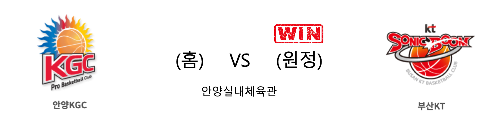

####  원주DB(홈) VS 서울SK(원정) 

<table class="tg">
  <tr>
    <th class="tg-rr9t">원주DB</th>
    <th class="tg-rr9t">팀</th>
    <th class="tg-rr9t">서울SK</th>
  </tr>
  <tr>
    <td class="tg-dcpn">2승 0패</td>
    <td class="tg-rr9t">시즌 상대전적</td>
    <td class="tg-dcpn">0승 2패</td>
  </tr>
  <tr>
    <td class="tg-dcpn">83</td>
    <td class="tg-rr9t">점수</td>
    <td class="tg-dcpn">77</td>
  </tr>
  <tr>
    <td class="tg-dcpn">19/39(49%)</td>
    <td class="tg-rr9t">2점(%)</td>
    <td class="tg-dcpn">24/55(44%)</td>
  </tr>
  <tr>
    <td class="tg-dcpn">8/19(42%)</td>
    <td class="tg-rr9t">3점(%)</td>
    <td class="tg-dcpn">8/24(33%)</td>
  </tr>
  <tr>
    <td class="tg-dcpn">21/24(88%)</td>
    <td class="tg-rr9t">자유투(%)</td>
    <td class="tg-dcpn">5/7(71%)</td>
  </tr>
  <tr>
    <td class="tg-dcpn">37</td>
    <td class="tg-rr9t">리바운드</td>
    <td class="tg-dcpn">38</td>
  </tr>
  <tr>
    <td class="tg-dcpn">19</td>
    <td class="tg-rr9t">어시스트</td>
    <td class="tg-dcpn">14</td>
  </tr>
  <tr>
    <td class="tg-dcpn">7</td>
    <td class="tg-rr9t">스틸</td>
    <td class="tg-dcpn">8</td>
  </tr>
  <tr>
    <td class="tg-dcpn">4</td>
    <td class="tg-rr9t">블록</td>
    <td class="tg-dcpn">1</td>
  </tr>
  <tr>
    <td class="tg-dcpn">12</td>
    <td class="tg-rr9t">턴오버</td>
    <td class="tg-dcpn">9</td>
  </tr>
  <tr>
    <td class="tg-dcpn">칼렙 그린(40)</td>
    <td class="tg-rr9t">주요 득점선수</td>
    <td class="tg-dcpn">자밀 워니(20)</td>
  </tr>
</table>

#### 경기 관련 주요 기사         

['안방에선 질 수 없지'…DB, 선두 SK 연승 저지](https://news.sbs.co.kr/news/endPage.do?news_id=N1005526253&plink=ORI&cooper=NAVER)

[[JB포토] DB 김태홍 'DB는 강하다!'](http://sports.news.naver.com/basketball/news/read.nhn?oid=065&aid=0000192541)

['그린 40점' DB, 선두 SK 연승 행진에 제동…KT 4연패 탈출](http://www.newsis.com/view/?id=NISX20191117_0000832203&cID=10505&pID=10500)

[나란히 상위권 형성한 DB-SK, 양 팀 감독의 고민은 '부상'](http://www.rookie.co.kr/news/articleView.html?idxno=35031)

        
        

####  안양KGC(홈) VS 부산KT(원정) 

<table class="tg">
  <tr>
    <th class="tg-rr9t">안양KGC</th>
    <th class="tg-rr9t">팀</th>
    <th class="tg-rr9t">부산KT</th>
  </tr>
  <tr>
    <td class="tg-dcpn">0승 2패</td>
    <td class="tg-rr9t">시즌 상대전적</td>
    <td class="tg-dcpn">2승 0패</td>
  </tr>
  <tr>
    <td class="tg-dcpn">73</td>
    <td class="tg-rr9t">점수</td>
    <td class="tg-dcpn">86</td>
  </tr>
  <tr>
    <td class="tg-dcpn">25/43(58%)</td>
    <td class="tg-rr9t">2점(%)</td>
    <td class="tg-dcpn">27/51(53%)</td>
  </tr>
  <tr>
    <td class="tg-dcpn">4/25(16%)</td>
    <td class="tg-rr9t">3점(%)</td>
    <td class="tg-dcpn">7/23(30%)</td>
  </tr>
  <tr>
    <td class="tg-dcpn">11/14(79%)</td>
    <td class="tg-rr9t">자유투(%)</td>
    <td class="tg-dcpn">11/17(65%)</td>
  </tr>
  <tr>
    <td class="tg-dcpn">30</td>
    <td class="tg-rr9t">리바운드</td>
    <td class="tg-dcpn">40</td>
  </tr>
  <tr>
    <td class="tg-dcpn">18</td>
    <td class="tg-rr9t">어시스트</td>
    <td class="tg-dcpn">17</td>
  </tr>
  <tr>
    <td class="tg-dcpn">5</td>
    <td class="tg-rr9t">스틸</td>
    <td class="tg-dcpn">7</td>
  </tr>
  <tr>
    <td class="tg-dcpn">5</td>
    <td class="tg-rr9t">블록</td>
    <td class="tg-dcpn">1</td>
  </tr>
  <tr>
    <td class="tg-dcpn">15</td>
    <td class="tg-rr9t">턴오버</td>
    <td class="tg-dcpn">13</td>
  </tr>
  <tr>
    <td class="tg-dcpn">크리스 맥컬러(34)</td>
    <td class="tg-rr9t">주요 득점선수</td>
    <td class="tg-dcpn">양홍석(23) 바이런 멀린스(21)</td>
  </tr>
</table>

#### 경기 관련 주요 기사         

[[KBL]안양KGC 치어리더,'신나는 댄스'](http://www.polinews.co.kr/news/article.html?no=434150)

['양홍석 23점 폭격' KT, KGC인삼공사 잡고 4연패 탈출](http://www.rookie.co.kr/news/articleView.html?idxno=35034)

[[JB포토화보]KT, 'KGC 잡고 4연패 늪에서 탈출'](http://sports.news.naver.com/basketball/news/read.nhn?oid=065&aid=0000192536)

[4연패 사슬 끊어낸 KT 서동철 감독 "선수들 자세가 좋았다"](http://www.basketkorea.com/news/articleView.html?idxno=190208)

        
        

####  전주KCC(홈) VS 서울삼성(원정) 

<table class="tg">
  <tr>
    <th class="tg-rr9t">전주KCC</th>
    <th class="tg-rr9t">팀</th>
    <th class="tg-rr9t">서울삼성</th>
  </tr>
  <tr>
    <td class="tg-dcpn">1승 1패</td>
    <td class="tg-rr9t">시즌 상대전적</td>
    <td class="tg-dcpn">1승 1패</td>
  </tr>
  <tr>
    <td class="tg-dcpn">65</td>
    <td class="tg-rr9t">점수</td>
    <td class="tg-dcpn">68</td>
  </tr>
  <tr>
    <td class="tg-dcpn">8/28(29%)</td>
    <td class="tg-rr9t">2점(%)</td>
    <td class="tg-dcpn">20/44(45%)</td>
  </tr>
  <tr>
    <td class="tg-dcpn">13/32(41%)</td>
    <td class="tg-rr9t">3점(%)</td>
    <td class="tg-dcpn">7/22(32%)</td>
  </tr>
  <tr>
    <td class="tg-dcpn">10/21(48%)</td>
    <td class="tg-rr9t">자유투(%)</td>
    <td class="tg-dcpn">7/12(58%)</td>
  </tr>
  <tr>
    <td class="tg-dcpn">45</td>
    <td class="tg-rr9t">리바운드</td>
    <td class="tg-dcpn">33</td>
  </tr>
  <tr>
    <td class="tg-dcpn">12</td>
    <td class="tg-rr9t">어시스트</td>
    <td class="tg-dcpn">11</td>
  </tr>
  <tr>
    <td class="tg-dcpn">5</td>
    <td class="tg-rr9t">스틸</td>
    <td class="tg-dcpn">10</td>
  </tr>
  <tr>
    <td class="tg-dcpn">2</td>
    <td class="tg-rr9t">블록</td>
    <td class="tg-dcpn">5</td>
  </tr>
  <tr>
    <td class="tg-dcpn">17</td>
    <td class="tg-rr9t">턴오버</td>
    <td class="tg-dcpn">8</td>
  </tr>
  <tr>
    <td class="tg-dcpn">이정현(17) 송교창(16)</td>
    <td class="tg-rr9t">주요 득점선수</td>
    <td class="tg-dcpn">이관희(27)</td>
  </tr>
</table>

#### 경기 관련 주요 기사         

[전주 KCC-서울 삼성 경기 시작](http://yna.kr/PYH20191117099600055?did=1196m)

[[기록] ‘4022명 입장’ KCC, 시즌 3번째 홈 만원 관중](http://sports.news.naver.com/basketball/news/read.nhn?oid=065&aid=0000192540)

['이관희 27점' 삼성, KCC 꺾고 4연승 질주](http://www.rookie.co.kr/news/articleView.html?idxno=35043)

[[BK Review] '이관희 27점' 서울 삼성, KCC 꺾고 4연승 질주](http://www.basketkorea.com/news/articleView.html?idxno=190211)

        
        

####  고양오리온(홈) VS 울산현대모비스(원정) 

<table class="tg">
  <tr>
    <th class="tg-rr9t">고양오리온</th>
    <th class="tg-rr9t">팀</th>
    <th class="tg-rr9t">울산현대모비스</th>
  </tr>
  <tr>
    <td class="tg-dcpn">1승 1패</td>
    <td class="tg-rr9t">시즌 상대전적</td>
    <td class="tg-dcpn">1승 1패</td>
  </tr>
  <tr>
    <td class="tg-dcpn">70</td>
    <td class="tg-rr9t">점수</td>
    <td class="tg-dcpn">88</td>
  </tr>
  <tr>
    <td class="tg-dcpn">19/45(42%)</td>
    <td class="tg-rr9t">2점(%)</td>
    <td class="tg-dcpn">21/39(54%)</td>
  </tr>
  <tr>
    <td class="tg-dcpn">8/16(50%)</td>
    <td class="tg-rr9t">3점(%)</td>
    <td class="tg-dcpn">12/23(52%)</td>
  </tr>
  <tr>
    <td class="tg-dcpn">8/17(47%)</td>
    <td class="tg-rr9t">자유투(%)</td>
    <td class="tg-dcpn">10/14(71%)</td>
  </tr>
  <tr>
    <td class="tg-dcpn">29</td>
    <td class="tg-rr9t">리바운드</td>
    <td class="tg-dcpn">35</td>
  </tr>
  <tr>
    <td class="tg-dcpn">20</td>
    <td class="tg-rr9t">어시스트</td>
    <td class="tg-dcpn">17</td>
  </tr>
  <tr>
    <td class="tg-dcpn">5</td>
    <td class="tg-rr9t">스틸</td>
    <td class="tg-dcpn">7</td>
  </tr>
  <tr>
    <td class="tg-dcpn">5</td>
    <td class="tg-rr9t">블록</td>
    <td class="tg-dcpn">3</td>
  </tr>
  <tr>
    <td class="tg-dcpn">11</td>
    <td class="tg-rr9t">턴오버</td>
    <td class="tg-dcpn">12</td>
  </tr>
  <tr>
    <td class="tg-dcpn">최진수(15) 이승현(20)</td>
    <td class="tg-rr9t">주요 득점선수</td>
    <td class="tg-dcpn">리온 윌리엄스(17) 김국찬(22) 양동근(18) 서명진(15)</td>
  </tr>
</table>

#### 경기 관련 주요 기사         

['김국찬 22득점' 모비스, 오리온 88-70 대파](http://www.osen.co.kr/article/G1111262846)

[[포토] 유재학 감독, 오리온에 88-70승리!](http://sports.chosun.com/news/ntype.htm?id=201911170100141210009542&servicedate=20191117)

[[MD포토] 장재석 '고양 오리온 공격은 내가 이끈다'](http://www.mydaily.co.kr/new_yk/html/read.php?newsid=201911171711142262&ext=na)

['김국찬 22점 폭발' 현대모비스, 오리온 대파하며 2연패 마감](http://www.rookie.co.kr/news/articleView.html?idxno=35044)

        
        

#### 리그 순위

<table class="tg">
  <tr>
    <th class="tg-d14o">순위</th>
    <th class="tg-d14o">팀명</th>
    <th class="tg-d14o">경기수</th>
    <th class="tg-d14o">승</th>
    <th class="tg-d14o">패</th>
    <th class="tg-d14o">승차</th>
    <th class="tg-d14o">승률</th>
  </tr>
  
<tr>
    <td class="tg-50j8">1</td>
    <td class="tg-50j8">서울SK</td>
    <td class="tg-50j8">14</td>
    <td class="tg-50j8">10</td>
    <td class="tg-50j8">4</td>
    <td class="tg-50j8">0</td>
    <td class="tg-50j8">0.714</td>
</tr>

<tr>
    <td class="tg-50j8">2</td>
    <td class="tg-50j8">인천전자랜드</td>
    <td class="tg-50j8">14</td>
    <td class="tg-50j8">9</td>
    <td class="tg-50j8">5</td>
    <td class="tg-50j8">1</td>
    <td class="tg-50j8">0.643</td>
</tr>

<tr>
    <td class="tg-50j8">3</td>
    <td class="tg-50j8">원주DB</td>
    <td class="tg-50j8">15</td>
    <td class="tg-50j8">9</td>
    <td class="tg-50j8">6</td>
    <td class="tg-50j8">1</td>
    <td class="tg-50j8">0.6</td>
</tr>

<tr>
    <td class="tg-50j8">4</td>
    <td class="tg-50j8">전주KCC</td>
    <td class="tg-50j8">16</td>
    <td class="tg-50j8">9</td>
    <td class="tg-50j8">7</td>
    <td class="tg-50j8">1</td>
    <td class="tg-50j8">0.562</td>
</tr>

<tr>
    <td class="tg-50j8">5</td>
    <td class="tg-50j8">서울삼성</td>
    <td class="tg-50j8">15</td>
    <td class="tg-50j8">8</td>
    <td class="tg-50j8">7</td>
    <td class="tg-50j8">2</td>
    <td class="tg-50j8">0.533</td>
</tr>

<tr>
    <td class="tg-50j8">6</td>
    <td class="tg-50j8">안양KGC</td>
    <td class="tg-50j8">15</td>
    <td class="tg-50j8">7</td>
    <td class="tg-50j8">8</td>
    <td class="tg-50j8">3</td>
    <td class="tg-50j8">0.467</td>
</tr>

<tr>
    <td class="tg-50j8">7</td>
    <td class="tg-50j8">울산현대모비스</td>
    <td class="tg-50j8">16</td>
    <td class="tg-50j8">7</td>
    <td class="tg-50j8">9</td>
    <td class="tg-50j8">3</td>
    <td class="tg-50j8">0.438</td>
</tr>

<tr>
    <td class="tg-50j8">8</td>
    <td class="tg-50j8">부산KT</td>
    <td class="tg-50j8">14</td>
    <td class="tg-50j8">6</td>
    <td class="tg-50j8">8</td>
    <td class="tg-50j8">4</td>
    <td class="tg-50j8">0.429</td>
</tr>

<tr>
    <td class="tg-50j8">9</td>
    <td class="tg-50j8">고양오리온</td>
    <td class="tg-50j8">15</td>
    <td class="tg-50j8">5</td>
    <td class="tg-50j8">10</td>
    <td class="tg-50j8">5</td>
    <td class="tg-50j8">0.333</td>
</tr>

<tr>
    <td class="tg-50j8">10</td>
    <td class="tg-50j8">창원LG</td>
    <td class="tg-50j8">16</td>
    <td class="tg-50j8">5</td>
    <td class="tg-50j8">11</td>
    <td class="tg-50j8">5</td>
    <td class="tg-50j8">0.312</td>
</tr>
</table> 

        
        
