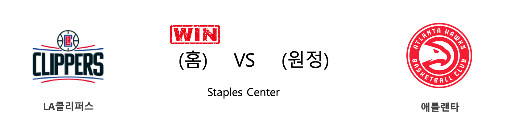

####  LAC(홈) VS ATL(원정) 

<table class="tg">
  <tr>
    <th class="tg-rr9t">LAC</th>
    <th class="tg-rr9t">팀</th>
    <th class="tg-rr9t">ATL</th>
  </tr>
  <tr>
    <td class="tg-dcpn">1승 0패</td>
    <td class="tg-rr9t">시즌 상대전적</td>
    <td class="tg-dcpn">0승 1패</td>
  </tr>
  <tr>
    <td class="tg-dcpn">150</td>
    <td class="tg-rr9t">점수</td>
    <td class="tg-dcpn">101</td>
  </tr>
  <tr>
    <td class="tg-dcpn">33/60(55%)</td>
    <td class="tg-rr9t">2점(%)</td>
    <td class="tg-dcpn">28/66(42%)</td>
  </tr>
  <tr>
    <td class="tg-dcpn">17/33(52%)</td>
    <td class="tg-rr9t">3점(%)</td>
    <td class="tg-dcpn">6/24(25%)</td>
  </tr>
  <tr>
    <td class="tg-dcpn">33/35(94%)</td>
    <td class="tg-rr9t">자유투(%)</td>
    <td class="tg-dcpn">27/37(73%)</td>
  </tr>
  <tr>
    <td class="tg-dcpn">53</td>
    <td class="tg-rr9t">리바운드</td>
    <td class="tg-dcpn">38</td>
  </tr>
  <tr>
    <td class="tg-dcpn">30</td>
    <td class="tg-rr9t">어시스트</td>
    <td class="tg-dcpn">19</td>
  </tr>
  <tr>
    <td class="tg-dcpn">10</td>
    <td class="tg-rr9t">스틸</td>
    <td class="tg-dcpn">11</td>
  </tr>
  <tr>
    <td class="tg-dcpn">12</td>
    <td class="tg-rr9t">블록</td>
    <td class="tg-dcpn">10</td>
  </tr>
  <tr>
    <td class="tg-dcpn">19</td>
    <td class="tg-rr9t">턴오버</td>
    <td class="tg-dcpn">19</td>
  </tr>
  <tr>
    <td class="tg-dcpn">LouWilliams(25) MontrezlHarre(17) JeromeRobinso(21) PaulGeorgeF(37)</td>
    <td class="tg-rr9t">주요 득점선수</td>
    <td class="tg-dcpn">TraeYoungG(20)</td>
  </tr>
</table>

#### 경기 관련 주요 기사         

[[오늘의 NBA] (11/9) 위긴스 vs 러셀, 타깃 센터의 명승부](http://sports.news.naver.com/basketball/news/read.nhn?oid=486&aid=0000001132)

[[오늘의 NBA] (11/11) 토론토, 디펜딩 챔피언의 저력](http://sports.news.naver.com/basketball/news/read.nhn?oid=486&aid=0000001134)

[[오늘의 NBA] 시즌 프리뷰 : 클리퍼스의 과감한 베팅](http://sports.news.naver.com/basketball/news/read.nhn?oid=486&aid=0000001100)

[[오늘의 NBA] (11/16) 멤피스, Grit&Grind 시대와의 성공적인 단절](http://sports.news.naver.com/basketball/news/read.nhn?oid=486&aid=0000001139)

[[오늘의 NBA] (11/7) 야니스 아테토쿤보의 MVP 수성 의지](http://sports.news.naver.com/basketball/news/read.nhn?oid=486&aid=0000001130)

        
        

####  IND(홈) VS MIL(원정) 

<table class="tg">
  <tr>
    <th class="tg-rr9t">IND</th>
    <th class="tg-rr9t">팀</th>
    <th class="tg-rr9t">MIL</th>
  </tr>
  <tr>
    <td class="tg-dcpn">0승 1패</td>
    <td class="tg-rr9t">시즌 상대전적</td>
    <td class="tg-dcpn">1승 0패</td>
  </tr>
  <tr>
    <td class="tg-dcpn">83</td>
    <td class="tg-rr9t">점수</td>
    <td class="tg-dcpn">102</td>
  </tr>
  <tr>
    <td class="tg-dcpn">20/66(30%)</td>
    <td class="tg-rr9t">2점(%)</td>
    <td class="tg-dcpn">32/57(56%)</td>
  </tr>
  <tr>
    <td class="tg-dcpn">12/34(35%)</td>
    <td class="tg-rr9t">3점(%)</td>
    <td class="tg-dcpn">11/39(28%)</td>
  </tr>
  <tr>
    <td class="tg-dcpn">7/9(78%)</td>
    <td class="tg-rr9t">자유투(%)</td>
    <td class="tg-dcpn">5/7(71%)</td>
  </tr>
  <tr>
    <td class="tg-dcpn">54</td>
    <td class="tg-rr9t">리바운드</td>
    <td class="tg-dcpn">55</td>
  </tr>
  <tr>
    <td class="tg-dcpn">19</td>
    <td class="tg-rr9t">어시스트</td>
    <td class="tg-dcpn">23</td>
  </tr>
  <tr>
    <td class="tg-dcpn">8</td>
    <td class="tg-rr9t">스틸</td>
    <td class="tg-dcpn">6</td>
  </tr>
  <tr>
    <td class="tg-dcpn">7</td>
    <td class="tg-rr9t">블록</td>
    <td class="tg-dcpn">8</td>
  </tr>
  <tr>
    <td class="tg-dcpn">13</td>
    <td class="tg-rr9t">턴오버</td>
    <td class="tg-dcpn">14</td>
  </tr>
  <tr>
    <td class="tg-dcpn">MylesTurnerC(16) T.J.WarrenF(15)</td>
    <td class="tg-rr9t">주요 득점선수</td>
    <td class="tg-dcpn">BrookLopezC(15) GiannisAnteto(26)</td>
  </tr>
</table>

#### 경기 관련 주요 기사         

[[오늘의 NBA] (11/11) 토론토, 디펜딩 챔피언의 저력](http://sports.news.naver.com/basketball/news/read.nhn?oid=486&aid=0000001134)

[[오늘의 NBA] (11/9) 위긴스 vs 러셀, 타깃 센터의 명승부](http://sports.news.naver.com/basketball/news/read.nhn?oid=486&aid=0000001132)

[[오늘의 NBA] (11/13) LAL 카일 쿠즈마의 대반격](http://sports.news.naver.com/basketball/news/read.nhn?oid=486&aid=0000001136)

[[오늘의 NBA] (11/7) 야니스 아테토쿤보의 MVP 수성 의지](http://sports.news.naver.com/basketball/news/read.nhn?oid=486&aid=0000001130)

[[오늘의 NBA] (11/17) 샬럿, 설계된 플레이 연출의 달인](http://sports.news.naver.com/basketball/news/read.nhn?oid=486&aid=0000001140)

        
        

####  NYK(홈) VS CHA(원정) 

<table class="tg">
  <tr>
    <th class="tg-rr9t">NYK</th>
    <th class="tg-rr9t">팀</th>
    <th class="tg-rr9t">CHA</th>
  </tr>
  <tr>
    <td class="tg-dcpn">0승 1패</td>
    <td class="tg-rr9t">시즌 상대전적</td>
    <td class="tg-dcpn">1승 0패</td>
  </tr>
  <tr>
    <td class="tg-dcpn">102</td>
    <td class="tg-rr9t">점수</td>
    <td class="tg-dcpn">103</td>
  </tr>
  <tr>
    <td class="tg-dcpn">33/66(50%)</td>
    <td class="tg-rr9t">2점(%)</td>
    <td class="tg-dcpn">19/39(49%)</td>
  </tr>
  <tr>
    <td class="tg-dcpn">6/20(30%)</td>
    <td class="tg-rr9t">3점(%)</td>
    <td class="tg-dcpn">17/48(35%)</td>
  </tr>
  <tr>
    <td class="tg-dcpn">18/23(78%)</td>
    <td class="tg-rr9t">자유투(%)</td>
    <td class="tg-dcpn">14/19(74%)</td>
  </tr>
  <tr>
    <td class="tg-dcpn">48</td>
    <td class="tg-rr9t">리바운드</td>
    <td class="tg-dcpn">42</td>
  </tr>
  <tr>
    <td class="tg-dcpn">22</td>
    <td class="tg-rr9t">어시스트</td>
    <td class="tg-dcpn">22</td>
  </tr>
  <tr>
    <td class="tg-dcpn">5</td>
    <td class="tg-rr9t">스틸</td>
    <td class="tg-dcpn">5</td>
  </tr>
  <tr>
    <td class="tg-dcpn">1</td>
    <td class="tg-rr9t">블록</td>
    <td class="tg-dcpn">3</td>
  </tr>
  <tr>
    <td class="tg-dcpn">11</td>
    <td class="tg-rr9t">턴오버</td>
    <td class="tg-dcpn">10</td>
  </tr>
  <tr>
    <td class="tg-dcpn">RJBarrettG(22) MitchellRobin(17)</td>
    <td class="tg-rr9t">주요 득점선수</td>
    <td class="tg-dcpn">Devonte'Graha(29) P.J.Washingto(19) TerryRozierG(16)</td>
  </tr>
</table>

#### 경기 관련 주요 기사         

[[오늘의 NBA] (11/10) 제임스 하든의 3점 라인 영점 사격](http://sports.news.naver.com/basketball/news/read.nhn?oid=486&aid=0000001133)

[[오늘의 NBA] (11/4) 마이애미의 대권 도전 행보](http://sports.news.naver.com/basketball/news/read.nhn?oid=486&aid=0000001127)

[[오늘의 NBA] (11/14) 제임스 하든, 농구의 미래를 제시하다](http://sports.news.naver.com/basketball/news/read.nhn?oid=486&aid=0000001137)

[[오늘의 NBA] (11/17) 샬럿, 설계된 플레이 연출의 달인](http://sports.news.naver.com/basketball/news/read.nhn?oid=486&aid=0000001140)

[[오늘의 NBA] (11/11) 토론토, 디펜딩 챔피언의 저력](http://sports.news.naver.com/basketball/news/read.nhn?oid=486&aid=0000001134)

        
        

####  SAS(홈) VS POR(원정) 

<table class="tg">
  <tr>
    <th class="tg-rr9t">SAS</th>
    <th class="tg-rr9t">팀</th>
    <th class="tg-rr9t">POR</th>
  </tr>
  <tr>
    <td class="tg-dcpn">1승 1패</td>
    <td class="tg-rr9t">시즌 상대전적</td>
    <td class="tg-dcpn">1승 1패</td>
  </tr>
  <tr>
    <td class="tg-dcpn">116</td>
    <td class="tg-rr9t">점수</td>
    <td class="tg-dcpn">121</td>
  </tr>
  <tr>
    <td class="tg-dcpn">36/70(51%)</td>
    <td class="tg-rr9t">2점(%)</td>
    <td class="tg-dcpn">29/54(54%)</td>
  </tr>
  <tr>
    <td class="tg-dcpn">5/18(28%)</td>
    <td class="tg-rr9t">3점(%)</td>
    <td class="tg-dcpn">13/39(33%)</td>
  </tr>
  <tr>
    <td class="tg-dcpn">29/34(85%)</td>
    <td class="tg-rr9t">자유투(%)</td>
    <td class="tg-dcpn">24/26(92%)</td>
  </tr>
  <tr>
    <td class="tg-dcpn">43</td>
    <td class="tg-rr9t">리바운드</td>
    <td class="tg-dcpn">48</td>
  </tr>
  <tr>
    <td class="tg-dcpn">25</td>
    <td class="tg-rr9t">어시스트</td>
    <td class="tg-dcpn">21</td>
  </tr>
  <tr>
    <td class="tg-dcpn">8</td>
    <td class="tg-rr9t">스틸</td>
    <td class="tg-dcpn">2</td>
  </tr>
  <tr>
    <td class="tg-dcpn">7</td>
    <td class="tg-rr9t">블록</td>
    <td class="tg-dcpn">4</td>
  </tr>
  <tr>
    <td class="tg-dcpn">10</td>
    <td class="tg-rr9t">턴오버</td>
    <td class="tg-dcpn">12</td>
  </tr>
  <tr>
    <td class="tg-dcpn">DeMarDeRozanF(16) RudyGay(16) BrynForbesG(17) LaMarcusAldri(30)</td>
    <td class="tg-rr9t">주요 득점선수</td>
    <td class="tg-dcpn">RodneyHoodF(16) CJMcCollumG(32) DamianLillard(22) HassanWhitesi(21)</td>
  </tr>
</table>

#### 경기 관련 주요 기사         

[[오늘의 NBA] (11/7) 야니스 아테토쿤보의 MVP 수성 의지](http://sports.news.naver.com/basketball/news/read.nhn?oid=486&aid=0000001130)

[[오늘의 NBA] (11/9) 위긴스 vs 러셀, 타깃 센터의 명승부](http://sports.news.naver.com/basketball/news/read.nhn?oid=486&aid=0000001132)

[[오늘의 NBA] 시즌 프리뷰 : 오클라호마시티, 미래를 향해 달려간다](http://sports.news.naver.com/basketball/news/read.nhn?oid=486&aid=0000001102)

[[오늘의 NBA] (11/17) 샬럿, 설계된 플레이 연출의 달인](http://sports.news.naver.com/basketball/news/read.nhn?oid=486&aid=0000001140)

[[오늘의 NBA] (10/29) 조엘 엠비드, 필라델피아의 괴수](http://sports.news.naver.com/basketball/news/read.nhn?oid=486&aid=0000001121)

        
        

####  MIN(홈) VS HOU(원정) 

<table class="tg">
  <tr>
    <th class="tg-rr9t">MIN</th>
    <th class="tg-rr9t">팀</th>
    <th class="tg-rr9t">HOU</th>
  </tr>
  <tr>
    <td class="tg-dcpn">0승 1패</td>
    <td class="tg-rr9t">시즌 상대전적</td>
    <td class="tg-dcpn">1승 0패</td>
  </tr>
  <tr>
    <td class="tg-dcpn">105</td>
    <td class="tg-rr9t">점수</td>
    <td class="tg-dcpn">125</td>
  </tr>
  <tr>
    <td class="tg-dcpn">26/46(57%)</td>
    <td class="tg-rr9t">2점(%)</td>
    <td class="tg-dcpn">24/45(53%)</td>
  </tr>
  <tr>
    <td class="tg-dcpn">12/38(32%)</td>
    <td class="tg-rr9t">3점(%)</td>
    <td class="tg-dcpn">19/49(39%)</td>
  </tr>
  <tr>
    <td class="tg-dcpn">17/23(74%)</td>
    <td class="tg-rr9t">자유투(%)</td>
    <td class="tg-dcpn">20/22(91%)</td>
  </tr>
  <tr>
    <td class="tg-dcpn">47</td>
    <td class="tg-rr9t">리바운드</td>
    <td class="tg-dcpn">41</td>
  </tr>
  <tr>
    <td class="tg-dcpn">23</td>
    <td class="tg-rr9t">어시스트</td>
    <td class="tg-dcpn">15</td>
  </tr>
  <tr>
    <td class="tg-dcpn">6</td>
    <td class="tg-rr9t">스틸</td>
    <td class="tg-dcpn">7</td>
  </tr>
  <tr>
    <td class="tg-dcpn">5</td>
    <td class="tg-rr9t">블록</td>
    <td class="tg-dcpn">3</td>
  </tr>
  <tr>
    <td class="tg-dcpn">18</td>
    <td class="tg-rr9t">턴오버</td>
    <td class="tg-dcpn">11</td>
  </tr>
  <tr>
    <td class="tg-dcpn">RobertCovingt(17) JakeLaymanG(21) Karl-AnthonyT(27)</td>
    <td class="tg-rr9t">주요 득점선수</td>
    <td class="tg-dcpn">JamesHardenG(49) ChrisClemons(19) BenMcLemoreF(20) AustinRiversG(19)</td>
  </tr>
</table>

#### 경기 관련 주요 기사         

        
        

####  DAL(홈) VS TOR(원정) 

<table class="tg">
  <tr>
    <th class="tg-rr9t">DAL</th>
    <th class="tg-rr9t">팀</th>
    <th class="tg-rr9t">TOR</th>
  </tr>
  <tr>
    <td class="tg-dcpn">1승 0패</td>
    <td class="tg-rr9t">시즌 상대전적</td>
    <td class="tg-dcpn">0승 1패</td>
  </tr>
  <tr>
    <td class="tg-dcpn">110</td>
    <td class="tg-rr9t">점수</td>
    <td class="tg-dcpn">102</td>
  </tr>
  <tr>
    <td class="tg-dcpn">28/49(57%)</td>
    <td class="tg-rr9t">2점(%)</td>
    <td class="tg-dcpn">20/48(42%)</td>
  </tr>
  <tr>
    <td class="tg-dcpn">9/39(23%)</td>
    <td class="tg-rr9t">3점(%)</td>
    <td class="tg-dcpn">17/41(41%)</td>
  </tr>
  <tr>
    <td class="tg-dcpn">27/33(82%)</td>
    <td class="tg-rr9t">자유투(%)</td>
    <td class="tg-dcpn">11/15(73%)</td>
  </tr>
  <tr>
    <td class="tg-dcpn">55</td>
    <td class="tg-rr9t">리바운드</td>
    <td class="tg-dcpn">42</td>
  </tr>
  <tr>
    <td class="tg-dcpn">24</td>
    <td class="tg-rr9t">어시스트</td>
    <td class="tg-dcpn">21</td>
  </tr>
  <tr>
    <td class="tg-dcpn">7</td>
    <td class="tg-rr9t">스틸</td>
    <td class="tg-dcpn">7</td>
  </tr>
  <tr>
    <td class="tg-dcpn">4</td>
    <td class="tg-rr9t">블록</td>
    <td class="tg-dcpn">2</td>
  </tr>
  <tr>
    <td class="tg-dcpn">12</td>
    <td class="tg-rr9t">턴오버</td>
    <td class="tg-dcpn">14</td>
  </tr>
  <tr>
    <td class="tg-dcpn">KristapsPorzi(20) LukaDoncicG(26) DelonWright(15) SethCurryG(15)</td>
    <td class="tg-rr9t">주요 득점선수</td>
    <td class="tg-dcpn">FredVanVleetG(24) PascalSiakamF(15) NormanPowellG(26)</td>
  </tr>
</table>

#### 경기 관련 주요 기사         

[[오늘의 NBA] (11/12) 샌안토니오와 토니 파커의 마지막 동반 여행](http://sports.news.naver.com/basketball/news/read.nhn?oid=486&aid=0000001135)

[[오늘의 NBA] (11/15) NOP 즈루 홀리데이, 뒤처리는 내가 맡는다!](http://sports.news.naver.com/basketball/news/read.nhn?oid=486&aid=0000001138)

[[오늘의 NBA] (11/7) 야니스 아테토쿤보의 MVP 수성 의지](http://sports.news.naver.com/basketball/news/read.nhn?oid=486&aid=0000001130)

[[오늘의 NBA] (11/9) 위긴스 vs 러셀, 타깃 센터의 명승부](http://sports.news.naver.com/basketball/news/read.nhn?oid=486&aid=0000001132)

[[오늘의 NBA] 시즌 프리뷰 : 포틀랜드, 근성과 낭만의 조화](http://sports.news.naver.com/basketball/news/read.nhn?oid=486&aid=0000001110)

        
        

####  CHI(홈) VS BKN(원정) 

<table class="tg">
  <tr>
    <th class="tg-rr9t">CHI</th>
    <th class="tg-rr9t">팀</th>
    <th class="tg-rr9t">BKN</th>
  </tr>
  <tr>
    <td class="tg-dcpn">0승 1패</td>
    <td class="tg-rr9t">시즌 상대전적</td>
    <td class="tg-dcpn">1승 0패</td>
  </tr>
  <tr>
    <td class="tg-dcpn">111</td>
    <td class="tg-rr9t">점수</td>
    <td class="tg-dcpn">117</td>
  </tr>
  <tr>
    <td class="tg-dcpn">23/52(44%)</td>
    <td class="tg-rr9t">2점(%)</td>
    <td class="tg-dcpn">30/45(67%)</td>
  </tr>
  <tr>
    <td class="tg-dcpn">9/39(23%)</td>
    <td class="tg-rr9t">3점(%)</td>
    <td class="tg-dcpn">10/43(23%)</td>
  </tr>
  <tr>
    <td class="tg-dcpn">38/41(93%)</td>
    <td class="tg-rr9t">자유투(%)</td>
    <td class="tg-dcpn">27/31(87%)</td>
  </tr>
  <tr>
    <td class="tg-dcpn">56</td>
    <td class="tg-rr9t">리바운드</td>
    <td class="tg-dcpn">40</td>
  </tr>
  <tr>
    <td class="tg-dcpn">15</td>
    <td class="tg-rr9t">어시스트</td>
    <td class="tg-dcpn">30</td>
  </tr>
  <tr>
    <td class="tg-dcpn">8</td>
    <td class="tg-rr9t">스틸</td>
    <td class="tg-dcpn">10</td>
  </tr>
  <tr>
    <td class="tg-dcpn">2</td>
    <td class="tg-rr9t">블록</td>
    <td class="tg-dcpn">9</td>
  </tr>
  <tr>
    <td class="tg-dcpn">19</td>
    <td class="tg-rr9t">턴오버</td>
    <td class="tg-dcpn">15</td>
  </tr>
  <tr>
    <td class="tg-dcpn">WendellCarter(18) ZachLaVineG(36) LauriMarkkane(16)</td>
    <td class="tg-rr9t">주요 득점선수</td>
    <td class="tg-dcpn">SpencerDinwid(24) JoeHarrisF(22)</td>
  </tr>
</table>

#### 경기 관련 주요 기사         

[[오늘의 NBA] (11/2) 르브론 제임스의 왕권신수설](http://sports.news.naver.com/basketball/news/read.nhn?oid=486&aid=0000001125)

[[오늘의 NBA] (11/13) LAL 카일 쿠즈마의 대반격](http://sports.news.naver.com/basketball/news/read.nhn?oid=486&aid=0000001136)

[[오늘의 NBA] (11/7) 야니스 아테토쿤보의 MVP 수성 의지](http://sports.news.naver.com/basketball/news/read.nhn?oid=486&aid=0000001130)

[[오늘의 NBA] 시즌 프리뷰 : 오클라호마시티, 미래를 향해 달려간다](http://sports.news.naver.com/basketball/news/read.nhn?oid=486&aid=0000001102)

[[오늘의 NBA] (11/17) 샬럿, 설계된 플레이 연출의 달인](http://sports.news.naver.com/basketball/news/read.nhn?oid=486&aid=0000001140)

        
        

####  MIA(홈) VS NOP(원정) 

<table class="tg">
  <tr>
    <th class="tg-rr9t">MIA</th>
    <th class="tg-rr9t">팀</th>
    <th class="tg-rr9t">NOP</th>
  </tr>
  <tr>
    <td class="tg-dcpn">1승 0패</td>
    <td class="tg-rr9t">시즌 상대전적</td>
    <td class="tg-dcpn">0승 1패</td>
  </tr>
  <tr>
    <td class="tg-dcpn">109</td>
    <td class="tg-rr9t">점수</td>
    <td class="tg-dcpn">94</td>
  </tr>
  <tr>
    <td class="tg-dcpn">35/57(61%)</td>
    <td class="tg-rr9t">2점(%)</td>
    <td class="tg-dcpn">21/47(45%)</td>
  </tr>
  <tr>
    <td class="tg-dcpn">9/24(38%)</td>
    <td class="tg-rr9t">3점(%)</td>
    <td class="tg-dcpn">16/35(46%)</td>
  </tr>
  <tr>
    <td class="tg-dcpn">12/13(92%)</td>
    <td class="tg-rr9t">자유투(%)</td>
    <td class="tg-dcpn">4/6(67%)</td>
  </tr>
  <tr>
    <td class="tg-dcpn">46</td>
    <td class="tg-rr9t">리바운드</td>
    <td class="tg-dcpn">31</td>
  </tr>
  <tr>
    <td class="tg-dcpn">25</td>
    <td class="tg-rr9t">어시스트</td>
    <td class="tg-dcpn">23</td>
  </tr>
  <tr>
    <td class="tg-dcpn">13</td>
    <td class="tg-rr9t">스틸</td>
    <td class="tg-dcpn">10</td>
  </tr>
  <tr>
    <td class="tg-dcpn">3</td>
    <td class="tg-rr9t">블록</td>
    <td class="tg-dcpn">2</td>
  </tr>
  <tr>
    <td class="tg-dcpn">21</td>
    <td class="tg-rr9t">턴오버</td>
    <td class="tg-dcpn">18</td>
  </tr>
  <tr>
    <td class="tg-dcpn">BamAdebayoF(18) DuncanRobinso(15) KendrickNunnG(22) JimmyButlerF(16)</td>
    <td class="tg-rr9t">주요 득점선수</td>
    <td class="tg-dcpn">E'TwaunMooreF(18) NickeilAlexan(27)</td>
  </tr>
</table>

#### 경기 관련 주요 기사         

[[오늘의 NBA] (11/15) NOP 즈루 홀리데이, 뒤처리는 내가 맡는다!](http://sports.news.naver.com/basketball/news/read.nhn?oid=486&aid=0000001138)

[[오늘의 NBA] (11/17) 샬럿, 설계된 플레이 연출의 달인](http://sports.news.naver.com/basketball/news/read.nhn?oid=486&aid=0000001140)

[[오늘의 NBA] (11/4) 마이애미의 대권 도전 행보](http://sports.news.naver.com/basketball/news/read.nhn?oid=486&aid=0000001127)

[[오늘의 NBA] (11/16) 멤피스, Grit&Grind 시대와의 성공적인 단절](http://sports.news.naver.com/basketball/news/read.nhn?oid=486&aid=0000001139)

[[오늘의 NBA] (11/1) MIA 에릭 스포엘스트라 감독의 승리 설계](http://sports.news.naver.com/basketball/news/read.nhn?oid=486&aid=0000001124)

        
        

#### 리그 (Eastern) 순위
    

<table class="tg">
  <tr>
    <th class="tg-d14o">순위</th>
    <th class="tg-d14o">팀명</th>
    <th class="tg-d14o">경기수</th>
    <th class="tg-d14o">승</th>
    <th class="tg-d14o">패</th>
    <th class="tg-d14o">승차</th>
    <th class="tg-d14o">승률</th>
  </tr>
  
<tr>
    <td class="tg-50j8">1</td>
    <td class="tg-50j8">BOS</td>
    <td class="tg-50j8">11</td>
    <td class="tg-50j8">10</td>
    <td class="tg-50j8">1</td>
    <td class="tg-50j8">0</td>
    <td class="tg-50j8">0.909</td>
</tr>

<tr>
    <td class="tg-50j8">2</td>
    <td class="tg-50j8">MIL</td>
    <td class="tg-50j8">12</td>
    <td class="tg-50j8">9</td>
    <td class="tg-50j8">3</td>
    <td class="tg-50j8">1</td>
    <td class="tg-50j8">0.75</td>
</tr>

<tr>
    <td class="tg-50j8">2</td>
    <td class="tg-50j8">MIA</td>
    <td class="tg-50j8">12</td>
    <td class="tg-50j8">9</td>
    <td class="tg-50j8">3</td>
    <td class="tg-50j8">1</td>
    <td class="tg-50j8">0.75</td>
</tr>

<tr>
    <td class="tg-50j8">4</td>
    <td class="tg-50j8">TOR</td>
    <td class="tg-50j8">12</td>
    <td class="tg-50j8">8</td>
    <td class="tg-50j8">4</td>
    <td class="tg-50j8">2</td>
    <td class="tg-50j8">0.667</td>
</tr>

<tr>
    <td class="tg-50j8">5</td>
    <td class="tg-50j8">PHI</td>
    <td class="tg-50j8">12</td>
    <td class="tg-50j8">7</td>
    <td class="tg-50j8">5</td>
    <td class="tg-50j8">3</td>
    <td class="tg-50j8">0.583</td>
</tr>

<tr>
    <td class="tg-50j8">6</td>
    <td class="tg-50j8">IND</td>
    <td class="tg-50j8">13</td>
    <td class="tg-50j8">7</td>
    <td class="tg-50j8">6</td>
    <td class="tg-50j8">3</td>
    <td class="tg-50j8">0.538</td>
</tr>

<tr>
    <td class="tg-50j8">7</td>
    <td class="tg-50j8">CHA</td>
    <td class="tg-50j8">13</td>
    <td class="tg-50j8">6</td>
    <td class="tg-50j8">7</td>
    <td class="tg-50j8">4</td>
    <td class="tg-50j8">0.462</td>
</tr>

<tr>
    <td class="tg-50j8">8</td>
    <td class="tg-50j8">ORL</td>
    <td class="tg-50j8">12</td>
    <td class="tg-50j8">5</td>
    <td class="tg-50j8">7</td>
    <td class="tg-50j8">5</td>
    <td class="tg-50j8">0.417</td>
</tr>

<tr>
    <td class="tg-50j8">8</td>
    <td class="tg-50j8">BKN</td>
    <td class="tg-50j8">12</td>
    <td class="tg-50j8">5</td>
    <td class="tg-50j8">7</td>
    <td class="tg-50j8">5</td>
    <td class="tg-50j8">0.417</td>
</tr>

<tr>
    <td class="tg-50j8">10</td>
    <td class="tg-50j8">CLE</td>
    <td class="tg-50j8">11</td>
    <td class="tg-50j8">4</td>
    <td class="tg-50j8">7</td>
    <td class="tg-50j8">6</td>
    <td class="tg-50j8">0.364</td>
</tr>

<tr>
    <td class="tg-50j8">11</td>
    <td class="tg-50j8">ATL</td>
    <td class="tg-50j8">12</td>
    <td class="tg-50j8">4</td>
    <td class="tg-50j8">8</td>
    <td class="tg-50j8">6</td>
    <td class="tg-50j8">0.333</td>
</tr>

<tr>
    <td class="tg-50j8">12</td>
    <td class="tg-50j8">DET</td>
    <td class="tg-50j8">13</td>
    <td class="tg-50j8">4</td>
    <td class="tg-50j8">9</td>
    <td class="tg-50j8">6</td>
    <td class="tg-50j8">0.308</td>
</tr>

<tr>
    <td class="tg-50j8">12</td>
    <td class="tg-50j8">CHI</td>
    <td class="tg-50j8">13</td>
    <td class="tg-50j8">4</td>
    <td class="tg-50j8">9</td>
    <td class="tg-50j8">6</td>
    <td class="tg-50j8">0.308</td>
</tr>

<tr>
    <td class="tg-50j8">14</td>
    <td class="tg-50j8">WAS</td>
    <td class="tg-50j8">10</td>
    <td class="tg-50j8">3</td>
    <td class="tg-50j8">7</td>
    <td class="tg-50j8">7</td>
    <td class="tg-50j8">0.3</td>
</tr>

<tr>
    <td class="tg-50j8">15</td>
    <td class="tg-50j8">NYK</td>
    <td class="tg-50j8">13</td>
    <td class="tg-50j8">3</td>
    <td class="tg-50j8">10</td>
    <td class="tg-50j8">7</td>
    <td class="tg-50j8">0.231</td>
</tr>
</table> 
#### 리그 (Western) 순위
    

<table class="tg">
  <tr>
    <th class="tg-d14o">순위</th>
    <th class="tg-d14o">팀명</th>
    <th class="tg-d14o">경기수</th>
    <th class="tg-d14o">승</th>
    <th class="tg-d14o">패</th>
    <th class="tg-d14o">승차</th>
    <th class="tg-d14o">승률</th>
  </tr>
  
<tr>
    <td class="tg-50j8">1</td>
    <td class="tg-50j8">LAL</td>
    <td class="tg-50j8">12</td>
    <td class="tg-50j8">10</td>
    <td class="tg-50j8">2</td>
    <td class="tg-50j8">0</td>
    <td class="tg-50j8">0.833</td>
</tr>

<tr>
    <td class="tg-50j8">2</td>
    <td class="tg-50j8">HOU</td>
    <td class="tg-50j8">13</td>
    <td class="tg-50j8">10</td>
    <td class="tg-50j8">3</td>
    <td class="tg-50j8">0</td>
    <td class="tg-50j8">0.769</td>
</tr>

<tr>
    <td class="tg-50j8">3</td>
    <td class="tg-50j8">DEN</td>
    <td class="tg-50j8">11</td>
    <td class="tg-50j8">8</td>
    <td class="tg-50j8">3</td>
    <td class="tg-50j8">2</td>
    <td class="tg-50j8">0.727</td>
</tr>

<tr>
    <td class="tg-50j8">4</td>
    <td class="tg-50j8">UTA</td>
    <td class="tg-50j8">12</td>
    <td class="tg-50j8">8</td>
    <td class="tg-50j8">4</td>
    <td class="tg-50j8">2</td>
    <td class="tg-50j8">0.667</td>
</tr>

<tr>
    <td class="tg-50j8">5</td>
    <td class="tg-50j8">LAC</td>
    <td class="tg-50j8">13</td>
    <td class="tg-50j8">8</td>
    <td class="tg-50j8">5</td>
    <td class="tg-50j8">2</td>
    <td class="tg-50j8">0.615</td>
</tr>

<tr>
    <td class="tg-50j8">6</td>
    <td class="tg-50j8">PHX</td>
    <td class="tg-50j8">11</td>
    <td class="tg-50j8">7</td>
    <td class="tg-50j8">4</td>
    <td class="tg-50j8">3</td>
    <td class="tg-50j8">0.636</td>
</tr>

<tr>
    <td class="tg-50j8">7</td>
    <td class="tg-50j8">DAL</td>
    <td class="tg-50j8">12</td>
    <td class="tg-50j8">7</td>
    <td class="tg-50j8">5</td>
    <td class="tg-50j8">3</td>
    <td class="tg-50j8">0.583</td>
</tr>

<tr>
    <td class="tg-50j8">8</td>
    <td class="tg-50j8">MIN</td>
    <td class="tg-50j8">13</td>
    <td class="tg-50j8">7</td>
    <td class="tg-50j8">6</td>
    <td class="tg-50j8">3</td>
    <td class="tg-50j8">0.538</td>
</tr>

<tr>
    <td class="tg-50j8">9</td>
    <td class="tg-50j8">MEM</td>
    <td class="tg-50j8">12</td>
    <td class="tg-50j8">5</td>
    <td class="tg-50j8">7</td>
    <td class="tg-50j8">5</td>
    <td class="tg-50j8">0.417</td>
</tr>

<tr>
    <td class="tg-50j8">9</td>
    <td class="tg-50j8">OKC</td>
    <td class="tg-50j8">12</td>
    <td class="tg-50j8">5</td>
    <td class="tg-50j8">7</td>
    <td class="tg-50j8">5</td>
    <td class="tg-50j8">0.417</td>
</tr>

<tr>
    <td class="tg-50j8">11</td>
    <td class="tg-50j8">SAS</td>
    <td class="tg-50j8">13</td>
    <td class="tg-50j8">5</td>
    <td class="tg-50j8">8</td>
    <td class="tg-50j8">5</td>
    <td class="tg-50j8">0.385</td>
</tr>

<tr>
    <td class="tg-50j8">11</td>
    <td class="tg-50j8">POR</td>
    <td class="tg-50j8">13</td>
    <td class="tg-50j8">5</td>
    <td class="tg-50j8">8</td>
    <td class="tg-50j8">5</td>
    <td class="tg-50j8">0.385</td>
</tr>

<tr>
    <td class="tg-50j8">13</td>
    <td class="tg-50j8">SAC</td>
    <td class="tg-50j8">11</td>
    <td class="tg-50j8">4</td>
    <td class="tg-50j8">7</td>
    <td class="tg-50j8">6</td>
    <td class="tg-50j8">0.364</td>
</tr>

<tr>
    <td class="tg-50j8">14</td>
    <td class="tg-50j8">NOP</td>
    <td class="tg-50j8">12</td>
    <td class="tg-50j8">3</td>
    <td class="tg-50j8">9</td>
    <td class="tg-50j8">7</td>
    <td class="tg-50j8">0.25</td>
</tr>

<tr>
    <td class="tg-50j8">15</td>
    <td class="tg-50j8">GSW</td>
    <td class="tg-50j8">13</td>
    <td class="tg-50j8">2</td>
    <td class="tg-50j8">11</td>
    <td class="tg-50j8">8</td>
    <td class="tg-50j8">0.154</td>
</tr>
</table> 

        
        
