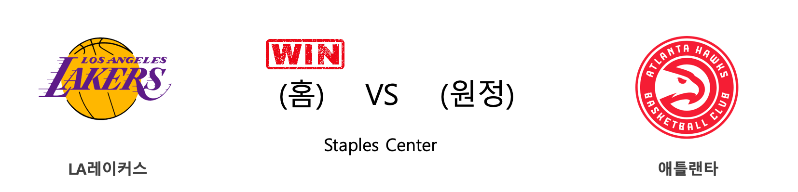

####  뉴올리언스(홈) VS 골든스테이트(원정) 

<table class="tg">
  <tr>
    <th class="tg-rr9t">NOP</th>
    <th class="tg-rr9t">팀</th>
    <th class="tg-rr9t">GSW</th>
  </tr>
  <tr>
    <td class="tg-dcpn">1승 1패</td>
    <td class="tg-rr9t">시즌 상대전적</td>
    <td class="tg-dcpn">1승 1패</td>
  </tr>
  <tr>
    <td class="tg-dcpn">108</td>
    <td class="tg-rr9t">점수</td>
    <td class="tg-dcpn">100</td>
  </tr>
  <tr>
    <td class="tg-dcpn">19/43(44%)</td>
    <td class="tg-rr9t">2점(%)</td>
    <td class="tg-dcpn">30/66(45%)</td>
  </tr>
  <tr>
    <td class="tg-dcpn">18/46(39%)</td>
    <td class="tg-rr9t">3점(%)</td>
    <td class="tg-dcpn">7/25(28%)</td>
  </tr>
  <tr>
    <td class="tg-dcpn">16/20(80%)</td>
    <td class="tg-rr9t">자유투(%)</td>
    <td class="tg-dcpn">19/23(83%)</td>
  </tr>
  <tr>
    <td class="tg-dcpn">48</td>
    <td class="tg-rr9t">리바운드</td>
    <td class="tg-dcpn">43</td>
  </tr>
  <tr>
    <td class="tg-dcpn">24</td>
    <td class="tg-rr9t">어시스트</td>
    <td class="tg-dcpn">23</td>
  </tr>
  <tr>
    <td class="tg-dcpn">3</td>
    <td class="tg-rr9t">스틸</td>
    <td class="tg-dcpn">7</td>
  </tr>
  <tr>
    <td class="tg-dcpn">5</td>
    <td class="tg-rr9t">블록</td>
    <td class="tg-dcpn">3</td>
  </tr>
  <tr>
    <td class="tg-dcpn">13</td>
    <td class="tg-rr9t">턴오버</td>
    <td class="tg-dcpn">10</td>
  </tr>
  <tr>
    <td class="tg-dcpn">JrueHolidayG(22) NicoloMelli(16) NickeilAlexan(19) JJRedickG(26)</td>
    <td class="tg-rr9t">주요 득점선수</td>
    <td class="tg-dcpn">KyBowman(19) EricPaschallF(30)</td>
  </tr>
</table>

#### 경기 관련 주요 기사         

[[오늘의 NBA] (11/17) 샬럿, 설계된 플레이 연출의 달인](http://sports.news.naver.com/basketball/news/read.nhn?oid=486&aid=0000001140)

[[오늘의 NBA] (11/18) 새크라멘토, 리그 선두 보스턴을 제압하다](http://sports.news.naver.com/basketball/news/read.nhn?oid=486&aid=0000001141)

[[★리뷰] '커리 26점 맹폭' GSW, NOP 완파 '휴, 드디어 첫 승'](http://star.mt.co.kr/stview.php?no=2019102910551983830)

[[오늘의 NBA] (11/16) 멤피스, Grit&Grind 시대와의 성공적인 단절](http://sports.news.naver.com/basketball/news/read.nhn?oid=486&aid=0000001139)

[[오늘의 NBA] (11/15) NOP 즈루 홀리데이, 뒤처리는 내가 맡는다!](http://sports.news.naver.com/basketball/news/read.nhn?oid=486&aid=0000001138)

        
        

####  클리블랜드(홈) VS 필라델피아(원정) 

<table class="tg">
  <tr>
    <th class="tg-rr9t">CLE</th>
    <th class="tg-rr9t">팀</th>
    <th class="tg-rr9t">PHI</th>
  </tr>
  <tr>
    <td class="tg-dcpn">0승 2패</td>
    <td class="tg-rr9t">시즌 상대전적</td>
    <td class="tg-dcpn">2승 0패</td>
  </tr>
  <tr>
    <td class="tg-dcpn">95</td>
    <td class="tg-rr9t">점수</td>
    <td class="tg-dcpn">114</td>
  </tr>
  <tr>
    <td class="tg-dcpn">28/65(43%)</td>
    <td class="tg-rr9t">2점(%)</td>
    <td class="tg-dcpn">37/61(61%)</td>
  </tr>
  <tr>
    <td class="tg-dcpn">6/25(24%)</td>
    <td class="tg-rr9t">3점(%)</td>
    <td class="tg-dcpn">9/23(39%)</td>
  </tr>
  <tr>
    <td class="tg-dcpn">21/24(88%)</td>
    <td class="tg-rr9t">자유투(%)</td>
    <td class="tg-dcpn">13/17(76%)</td>
  </tr>
  <tr>
    <td class="tg-dcpn">42</td>
    <td class="tg-rr9t">리바운드</td>
    <td class="tg-dcpn">44</td>
  </tr>
  <tr>
    <td class="tg-dcpn">14</td>
    <td class="tg-rr9t">어시스트</td>
    <td class="tg-dcpn">33</td>
  </tr>
  <tr>
    <td class="tg-dcpn">9</td>
    <td class="tg-rr9t">스틸</td>
    <td class="tg-dcpn">6</td>
  </tr>
  <tr>
    <td class="tg-dcpn">5</td>
    <td class="tg-rr9t">블록</td>
    <td class="tg-dcpn">11</td>
  </tr>
  <tr>
    <td class="tg-dcpn">14</td>
    <td class="tg-rr9t">턴오버</td>
    <td class="tg-dcpn">13</td>
  </tr>
  <tr>
    <td class="tg-dcpn">CollinSextonG(17) JordanClarkso(15)</td>
    <td class="tg-rr9t">주요 득점선수</td>
    <td class="tg-dcpn">TobiasHarrisF(27)</td>
  </tr>
</table>

#### 경기 관련 주요 기사         

[[오늘의 NBA] (11/17) 샬럿, 설계된 플레이 연출의 달인](http://sports.news.naver.com/basketball/news/read.nhn?oid=486&aid=0000001140)

[[오늘의 NBA] (11/14) 제임스 하든, 농구의 미래를 제시하다](http://sports.news.naver.com/basketball/news/read.nhn?oid=486&aid=0000001137)

[ML, 2019 골드글러브 수상자 발표…아레나도 7년 연속 수상](http://www.mbcsportsplus.com/news/?mode=view&cate=2&b_idx=99826267.000)

[[오늘의 NBA] (11/11) 토론토, 디펜딩 챔피언의 저력](http://sports.news.naver.com/basketball/news/read.nhn?oid=486&aid=0000001134)

[[오늘의 NBA] (11/18) 새크라멘토, 리그 선두 보스턴을 제압하다](http://sports.news.naver.com/basketball/news/read.nhn?oid=486&aid=0000001141)

        
        

####  멤피스(홈) VS 덴버(원정) 

<table class="tg">
  <tr>
    <th class="tg-rr9t">MEM</th>
    <th class="tg-rr9t">팀</th>
    <th class="tg-rr9t">DEN</th>
  </tr>
  <tr>
    <td class="tg-dcpn">0승 1패</td>
    <td class="tg-rr9t">시즌 상대전적</td>
    <td class="tg-dcpn">1승 0패</td>
  </tr>
  <tr>
    <td class="tg-dcpn">114</td>
    <td class="tg-rr9t">점수</td>
    <td class="tg-dcpn">131</td>
  </tr>
  <tr>
    <td class="tg-dcpn">23/48(48%)</td>
    <td class="tg-rr9t">2점(%)</td>
    <td class="tg-dcpn">31/57(54%)</td>
  </tr>
  <tr>
    <td class="tg-dcpn">16/36(44%)</td>
    <td class="tg-rr9t">3점(%)</td>
    <td class="tg-dcpn">18/32(56%)</td>
  </tr>
  <tr>
    <td class="tg-dcpn">20/24(83%)</td>
    <td class="tg-rr9t">자유투(%)</td>
    <td class="tg-dcpn">15/23(65%)</td>
  </tr>
  <tr>
    <td class="tg-dcpn">45</td>
    <td class="tg-rr9t">리바운드</td>
    <td class="tg-dcpn">39</td>
  </tr>
  <tr>
    <td class="tg-dcpn">29</td>
    <td class="tg-rr9t">어시스트</td>
    <td class="tg-dcpn">36</td>
  </tr>
  <tr>
    <td class="tg-dcpn">4</td>
    <td class="tg-rr9t">스틸</td>
    <td class="tg-dcpn">10</td>
  </tr>
  <tr>
    <td class="tg-dcpn">3</td>
    <td class="tg-rr9t">블록</td>
    <td class="tg-dcpn">10</td>
  </tr>
  <tr>
    <td class="tg-dcpn">16</td>
    <td class="tg-rr9t">턴오버</td>
    <td class="tg-dcpn">12</td>
  </tr>
  <tr>
    <td class="tg-dcpn">JarenJacksonJ(22) JonasValanciu(16) BrandonClarke(19)</td>
    <td class="tg-rr9t">주요 득점선수</td>
    <td class="tg-dcpn">JuanchoHernan(15) PaulMillsapF(23) JamalMurrayG(39)</td>
  </tr>
</table>

#### 경기 관련 주요 기사         

[[오늘의 NBA] (11/13) LAL 카일 쿠즈마의 대반격](http://sports.news.naver.com/basketball/news/read.nhn?oid=486&aid=0000001136)

[[오늘의 NBA] (11/18) 새크라멘토, 리그 선두 보스턴을 제압하다](http://sports.news.naver.com/basketball/news/read.nhn?oid=486&aid=0000001141)

[[오늘의 NBA] (11/16) 멤피스, Grit&Grind 시대와의 성공적인 단절](http://sports.news.naver.com/basketball/news/read.nhn?oid=486&aid=0000001139)

[[오늘의 NBA] (11/9) 위긴스 vs 러셀, 타깃 센터의 명승부](http://sports.news.naver.com/basketball/news/read.nhn?oid=486&aid=0000001132)

[[오늘의 NBA] (11/12) 샌안토니오와 토니 파커의 마지막 동반 여행](http://sports.news.naver.com/basketball/news/read.nhn?oid=486&aid=0000001135)

        
        

####  새크라멘토(홈) VS 보스턴(원정) 

<table class="tg">
  <tr>
    <th class="tg-rr9t">SAC</th>
    <th class="tg-rr9t">팀</th>
    <th class="tg-rr9t">BOS</th>
  </tr>
  <tr>
    <td class="tg-dcpn">1승 0패</td>
    <td class="tg-rr9t">시즌 상대전적</td>
    <td class="tg-dcpn">0승 1패</td>
  </tr>
  <tr>
    <td class="tg-dcpn">100</td>
    <td class="tg-rr9t">점수</td>
    <td class="tg-dcpn">99</td>
  </tr>
  <tr>
    <td class="tg-dcpn">24/54(44%)</td>
    <td class="tg-rr9t">2점(%)</td>
    <td class="tg-dcpn">24/52(46%)</td>
  </tr>
  <tr>
    <td class="tg-dcpn">14/35(40%)</td>
    <td class="tg-rr9t">3점(%)</td>
    <td class="tg-dcpn">10/30(33%)</td>
  </tr>
  <tr>
    <td class="tg-dcpn">10/12(83%)</td>
    <td class="tg-rr9t">자유투(%)</td>
    <td class="tg-dcpn">21/24(88%)</td>
  </tr>
  <tr>
    <td class="tg-dcpn">45</td>
    <td class="tg-rr9t">리바운드</td>
    <td class="tg-dcpn">46</td>
  </tr>
  <tr>
    <td class="tg-dcpn">22</td>
    <td class="tg-rr9t">어시스트</td>
    <td class="tg-dcpn">26</td>
  </tr>
  <tr>
    <td class="tg-dcpn">8</td>
    <td class="tg-rr9t">스틸</td>
    <td class="tg-dcpn">7</td>
  </tr>
  <tr>
    <td class="tg-dcpn">7</td>
    <td class="tg-rr9t">블록</td>
    <td class="tg-dcpn">3</td>
  </tr>
  <tr>
    <td class="tg-dcpn">12</td>
    <td class="tg-rr9t">턴오버</td>
    <td class="tg-dcpn">14</td>
  </tr>
  <tr>
    <td class="tg-dcpn">BuddyHieldG(35)</td>
    <td class="tg-rr9t">주요 득점선수</td>
    <td class="tg-dcpn">KembaWalkerG(15) JaylenBrownF(18)</td>
  </tr>
</table>

#### 경기 관련 주요 기사         

[[오늘의 NBA] (11/8) 켐바 워커의 홈 커밍 데이](http://sports.news.naver.com/basketball/news/read.nhn?oid=486&aid=0000001131)

[[오늘의 NBA] (11/9) 위긴스 vs 러셀, 타깃 센터의 명승부](http://sports.news.naver.com/basketball/news/read.nhn?oid=486&aid=0000001132)

[[오늘의 NBA] (11/7) 야니스 아테토쿤보의 MVP 수성 의지](http://sports.news.naver.com/basketball/news/read.nhn?oid=486&aid=0000001130)

[[오늘의 NBA] (11/18) 새크라멘토, 리그 선두 보스턴을 제압하다](http://sports.news.naver.com/basketball/news/read.nhn?oid=486&aid=0000001141)

[[오늘의 NBA] (11/16) 멤피스, Grit&Grind 시대와의 성공적인 단절](http://sports.news.naver.com/basketball/news/read.nhn?oid=486&aid=0000001139)

        
        

####  올랜도(홈) VS 워싱턴(원정) 

<table class="tg">
  <tr>
    <th class="tg-rr9t">ORL</th>
    <th class="tg-rr9t">팀</th>
    <th class="tg-rr9t">WAS</th>
  </tr>
  <tr>
    <td class="tg-dcpn">1승 0패</td>
    <td class="tg-rr9t">시즌 상대전적</td>
    <td class="tg-dcpn">0승 1패</td>
  </tr>
  <tr>
    <td class="tg-dcpn">125</td>
    <td class="tg-rr9t">점수</td>
    <td class="tg-dcpn">121</td>
  </tr>
  <tr>
    <td class="tg-dcpn">28/49(57%)</td>
    <td class="tg-rr9t">2점(%)</td>
    <td class="tg-dcpn">27/56(48%)</td>
  </tr>
  <tr>
    <td class="tg-dcpn">15/38(39%)</td>
    <td class="tg-rr9t">3점(%)</td>
    <td class="tg-dcpn">19/41(46%)</td>
  </tr>
  <tr>
    <td class="tg-dcpn">24/26(92%)</td>
    <td class="tg-rr9t">자유투(%)</td>
    <td class="tg-dcpn">10/12(83%)</td>
  </tr>
  <tr>
    <td class="tg-dcpn">52</td>
    <td class="tg-rr9t">리바운드</td>
    <td class="tg-dcpn">38</td>
  </tr>
  <tr>
    <td class="tg-dcpn">25</td>
    <td class="tg-rr9t">어시스트</td>
    <td class="tg-dcpn">31</td>
  </tr>
  <tr>
    <td class="tg-dcpn">5</td>
    <td class="tg-rr9t">스틸</td>
    <td class="tg-dcpn">7</td>
  </tr>
  <tr>
    <td class="tg-dcpn">3</td>
    <td class="tg-rr9t">블록</td>
    <td class="tg-dcpn">2</td>
  </tr>
  <tr>
    <td class="tg-dcpn">14</td>
    <td class="tg-rr9t">턴오버</td>
    <td class="tg-dcpn">9</td>
  </tr>
  <tr>
    <td class="tg-dcpn">TerrenceRoss(15) MarkelleFultz(19) NikolaVucevic(30) EvanFournierG(25)</td>
    <td class="tg-rr9t">주요 득점선수</td>
    <td class="tg-dcpn">DavisBertans(15) CJMiles(21) BradleyBealG(34)</td>
  </tr>
</table>

#### 경기 관련 주요 기사         

[[오늘의 NBA] (11/7) 야니스 아테토쿤보의 MVP 수성 의지](http://sports.news.naver.com/basketball/news/read.nhn?oid=486&aid=0000001130)

[[오늘의 NBA] (11/14) 제임스 하든, 농구의 미래를 제시하다](http://sports.news.naver.com/basketball/news/read.nhn?oid=486&aid=0000001137)

[[오늘의 NBA] (11/18) 새크라멘토, 리그 선두 보스턴을 제압하다](http://sports.news.naver.com/basketball/news/read.nhn?oid=486&aid=0000001141)

[[오늘의 NBA] (11/11) 토론토, 디펜딩 챔피언의 저력](http://sports.news.naver.com/basketball/news/read.nhn?oid=486&aid=0000001134)

[[오늘의 NBA] (11/9) 위긴스 vs 러셀, 타깃 센터의 명승부](http://sports.news.naver.com/basketball/news/read.nhn?oid=486&aid=0000001132)

        
        

####  LA레이커스(홈) VS 애틀랜타(원정) 

<table class="tg">
  <tr>
    <th class="tg-rr9t">LAL</th>
    <th class="tg-rr9t">팀</th>
    <th class="tg-rr9t">ATL</th>
  </tr>
  <tr>
    <td class="tg-dcpn">1승 0패</td>
    <td class="tg-rr9t">시즌 상대전적</td>
    <td class="tg-dcpn">0승 1패</td>
  </tr>
  <tr>
    <td class="tg-dcpn">122</td>
    <td class="tg-rr9t">점수</td>
    <td class="tg-dcpn">101</td>
  </tr>
  <tr>
    <td class="tg-dcpn">32/54(59%)</td>
    <td class="tg-rr9t">2점(%)</td>
    <td class="tg-dcpn">29/58(50%)</td>
  </tr>
  <tr>
    <td class="tg-dcpn">15/35(43%)</td>
    <td class="tg-rr9t">3점(%)</td>
    <td class="tg-dcpn">8/28(29%)</td>
  </tr>
  <tr>
    <td class="tg-dcpn">13/16(81%)</td>
    <td class="tg-rr9t">자유투(%)</td>
    <td class="tg-dcpn">19/25(76%)</td>
  </tr>
  <tr>
    <td class="tg-dcpn">43</td>
    <td class="tg-rr9t">리바운드</td>
    <td class="tg-dcpn">36</td>
  </tr>
  <tr>
    <td class="tg-dcpn">26</td>
    <td class="tg-rr9t">어시스트</td>
    <td class="tg-dcpn">16</td>
  </tr>
  <tr>
    <td class="tg-dcpn">9</td>
    <td class="tg-rr9t">스틸</td>
    <td class="tg-dcpn">11</td>
  </tr>
  <tr>
    <td class="tg-dcpn">14</td>
    <td class="tg-rr9t">블록</td>
    <td class="tg-dcpn">2</td>
  </tr>
  <tr>
    <td class="tg-dcpn">16</td>
    <td class="tg-rr9t">턴오버</td>
    <td class="tg-dcpn">17</td>
  </tr>
  <tr>
    <td class="tg-dcpn">LeBronJamesF(33) KyleKuzma(17) RajonRondo(15)</td>
    <td class="tg-rr9t">주요 득점선수</td>
    <td class="tg-dcpn">TraeYoungG(31)</td>
  </tr>
</table>

#### 경기 관련 주요 기사         

[[오늘의 NBA] (11/17) 샬럿, 설계된 플레이 연출의 달인](http://sports.news.naver.com/basketball/news/read.nhn?oid=486&aid=0000001140)

[[오늘의 NBA] (11/13) LAL 카일 쿠즈마의 대반격](http://sports.news.naver.com/basketball/news/read.nhn?oid=486&aid=0000001136)

[[오늘의 NBA] (11/18) 새크라멘토, 리그 선두 보스턴을 제압하다](http://sports.news.naver.com/basketball/news/read.nhn?oid=486&aid=0000001141)

[[오늘의 NBA] (11/11) 토론토, 디펜딩 챔피언의 저력](http://sports.news.naver.com/basketball/news/read.nhn?oid=486&aid=0000001134)

[[오늘의 NBA] (11/16) 멤피스, Grit&Grind 시대와의 성공적인 단절](http://sports.news.naver.com/basketball/news/read.nhn?oid=486&aid=0000001139)

        
        

#### 리그 (Eastern) 순위
    

<table class="tg">
  <tr>
    <th class="tg-d14o">순위</th>
    <th class="tg-d14o">팀명</th>
    <th class="tg-d14o">경기수</th>
    <th class="tg-d14o">승</th>
    <th class="tg-d14o">패</th>
    <th class="tg-d14o">승차</th>
    <th class="tg-d14o">승률</th>
  </tr>
  
<tr>
    <td class="tg-50j8">1</td>
    <td class="tg-50j8">BOS</td>
    <td class="tg-50j8">12</td>
    <td class="tg-50j8">10</td>
    <td class="tg-50j8">2</td>
    <td class="tg-50j8">1</td>
    <td class="tg-50j8">0.833</td>
</tr>

<tr>
    <td class="tg-50j8">2</td>
    <td class="tg-50j8">MIA</td>
    <td class="tg-50j8">12</td>
    <td class="tg-50j8">9</td>
    <td class="tg-50j8">3</td>
    <td class="tg-50j8">2</td>
    <td class="tg-50j8">0.75</td>
</tr>

<tr>
    <td class="tg-50j8">2</td>
    <td class="tg-50j8">MIL</td>
    <td class="tg-50j8">12</td>
    <td class="tg-50j8">9</td>
    <td class="tg-50j8">3</td>
    <td class="tg-50j8">2</td>
    <td class="tg-50j8">0.75</td>
</tr>

<tr>
    <td class="tg-50j8">4</td>
    <td class="tg-50j8">TOR</td>
    <td class="tg-50j8">12</td>
    <td class="tg-50j8">8</td>
    <td class="tg-50j8">4</td>
    <td class="tg-50j8">3</td>
    <td class="tg-50j8">0.667</td>
</tr>

<tr>
    <td class="tg-50j8">5</td>
    <td class="tg-50j8">PHI</td>
    <td class="tg-50j8">13</td>
    <td class="tg-50j8">8</td>
    <td class="tg-50j8">5</td>
    <td class="tg-50j8">3</td>
    <td class="tg-50j8">0.615</td>
</tr>

<tr>
    <td class="tg-50j8">6</td>
    <td class="tg-50j8">IND</td>
    <td class="tg-50j8">13</td>
    <td class="tg-50j8">7</td>
    <td class="tg-50j8">6</td>
    <td class="tg-50j8">4</td>
    <td class="tg-50j8">0.538</td>
</tr>

<tr>
    <td class="tg-50j8">7</td>
    <td class="tg-50j8">ORL</td>
    <td class="tg-50j8">13</td>
    <td class="tg-50j8">6</td>
    <td class="tg-50j8">7</td>
    <td class="tg-50j8">5</td>
    <td class="tg-50j8">0.462</td>
</tr>

<tr>
    <td class="tg-50j8">7</td>
    <td class="tg-50j8">CHA</td>
    <td class="tg-50j8">13</td>
    <td class="tg-50j8">6</td>
    <td class="tg-50j8">7</td>
    <td class="tg-50j8">5</td>
    <td class="tg-50j8">0.462</td>
</tr>

<tr>
    <td class="tg-50j8">9</td>
    <td class="tg-50j8">BKN</td>
    <td class="tg-50j8">12</td>
    <td class="tg-50j8">5</td>
    <td class="tg-50j8">7</td>
    <td class="tg-50j8">6</td>
    <td class="tg-50j8">0.417</td>
</tr>

<tr>
    <td class="tg-50j8">10</td>
    <td class="tg-50j8">CLE</td>
    <td class="tg-50j8">12</td>
    <td class="tg-50j8">4</td>
    <td class="tg-50j8">8</td>
    <td class="tg-50j8">7</td>
    <td class="tg-50j8">0.333</td>
</tr>

<tr>
    <td class="tg-50j8">11</td>
    <td class="tg-50j8">DET</td>
    <td class="tg-50j8">13</td>
    <td class="tg-50j8">4</td>
    <td class="tg-50j8">9</td>
    <td class="tg-50j8">7</td>
    <td class="tg-50j8">0.308</td>
</tr>

<tr>
    <td class="tg-50j8">11</td>
    <td class="tg-50j8">CHI</td>
    <td class="tg-50j8">13</td>
    <td class="tg-50j8">4</td>
    <td class="tg-50j8">9</td>
    <td class="tg-50j8">7</td>
    <td class="tg-50j8">0.308</td>
</tr>

<tr>
    <td class="tg-50j8">11</td>
    <td class="tg-50j8">ATL</td>
    <td class="tg-50j8">13</td>
    <td class="tg-50j8">4</td>
    <td class="tg-50j8">9</td>
    <td class="tg-50j8">7</td>
    <td class="tg-50j8">0.308</td>
</tr>

<tr>
    <td class="tg-50j8">14</td>
    <td class="tg-50j8">WAS</td>
    <td class="tg-50j8">11</td>
    <td class="tg-50j8">3</td>
    <td class="tg-50j8">8</td>
    <td class="tg-50j8">8</td>
    <td class="tg-50j8">0.273</td>
</tr>

<tr>
    <td class="tg-50j8">15</td>
    <td class="tg-50j8">NYK</td>
    <td class="tg-50j8">13</td>
    <td class="tg-50j8">3</td>
    <td class="tg-50j8">10</td>
    <td class="tg-50j8">8</td>
    <td class="tg-50j8">0.231</td>
</tr>
</table> 
#### 리그 (Western) 순위
    

<table class="tg">
  <tr>
    <th class="tg-d14o">순위</th>
    <th class="tg-d14o">팀명</th>
    <th class="tg-d14o">경기수</th>
    <th class="tg-d14o">승</th>
    <th class="tg-d14o">패</th>
    <th class="tg-d14o">승차</th>
    <th class="tg-d14o">승률</th>
  </tr>
  
<tr>
    <td class="tg-50j8">1</td>
    <td class="tg-50j8">LAL</td>
    <td class="tg-50j8">13</td>
    <td class="tg-50j8">11</td>
    <td class="tg-50j8">2</td>
    <td class="tg-50j8">0</td>
    <td class="tg-50j8">0.846</td>
</tr>

<tr>
    <td class="tg-50j8">2</td>
    <td class="tg-50j8">HOU</td>
    <td class="tg-50j8">13</td>
    <td class="tg-50j8">10</td>
    <td class="tg-50j8">3</td>
    <td class="tg-50j8">1</td>
    <td class="tg-50j8">0.769</td>
</tr>

<tr>
    <td class="tg-50j8">3</td>
    <td class="tg-50j8">DEN</td>
    <td class="tg-50j8">12</td>
    <td class="tg-50j8">9</td>
    <td class="tg-50j8">3</td>
    <td class="tg-50j8">2</td>
    <td class="tg-50j8">0.75</td>
</tr>

<tr>
    <td class="tg-50j8">4</td>
    <td class="tg-50j8">UTA</td>
    <td class="tg-50j8">12</td>
    <td class="tg-50j8">8</td>
    <td class="tg-50j8">4</td>
    <td class="tg-50j8">3</td>
    <td class="tg-50j8">0.667</td>
</tr>

<tr>
    <td class="tg-50j8">5</td>
    <td class="tg-50j8">LAC</td>
    <td class="tg-50j8">13</td>
    <td class="tg-50j8">8</td>
    <td class="tg-50j8">5</td>
    <td class="tg-50j8">3</td>
    <td class="tg-50j8">0.615</td>
</tr>

<tr>
    <td class="tg-50j8">6</td>
    <td class="tg-50j8">PHX</td>
    <td class="tg-50j8">11</td>
    <td class="tg-50j8">7</td>
    <td class="tg-50j8">4</td>
    <td class="tg-50j8">4</td>
    <td class="tg-50j8">0.636</td>
</tr>

<tr>
    <td class="tg-50j8">7</td>
    <td class="tg-50j8">DAL</td>
    <td class="tg-50j8">12</td>
    <td class="tg-50j8">7</td>
    <td class="tg-50j8">5</td>
    <td class="tg-50j8">4</td>
    <td class="tg-50j8">0.583</td>
</tr>

<tr>
    <td class="tg-50j8">8</td>
    <td class="tg-50j8">MIN</td>
    <td class="tg-50j8">13</td>
    <td class="tg-50j8">7</td>
    <td class="tg-50j8">6</td>
    <td class="tg-50j8">4</td>
    <td class="tg-50j8">0.538</td>
</tr>

<tr>
    <td class="tg-50j8">9</td>
    <td class="tg-50j8">OKC</td>
    <td class="tg-50j8">12</td>
    <td class="tg-50j8">5</td>
    <td class="tg-50j8">7</td>
    <td class="tg-50j8">6</td>
    <td class="tg-50j8">0.417</td>
</tr>

<tr>
    <td class="tg-50j8">9</td>
    <td class="tg-50j8">SAC</td>
    <td class="tg-50j8">12</td>
    <td class="tg-50j8">5</td>
    <td class="tg-50j8">7</td>
    <td class="tg-50j8">6</td>
    <td class="tg-50j8">0.417</td>
</tr>

<tr>
    <td class="tg-50j8">11</td>
    <td class="tg-50j8">MEM</td>
    <td class="tg-50j8">13</td>
    <td class="tg-50j8">5</td>
    <td class="tg-50j8">8</td>
    <td class="tg-50j8">6</td>
    <td class="tg-50j8">0.385</td>
</tr>

<tr>
    <td class="tg-50j8">11</td>
    <td class="tg-50j8">POR</td>
    <td class="tg-50j8">13</td>
    <td class="tg-50j8">5</td>
    <td class="tg-50j8">8</td>
    <td class="tg-50j8">6</td>
    <td class="tg-50j8">0.385</td>
</tr>

<tr>
    <td class="tg-50j8">11</td>
    <td class="tg-50j8">SAS</td>
    <td class="tg-50j8">13</td>
    <td class="tg-50j8">5</td>
    <td class="tg-50j8">8</td>
    <td class="tg-50j8">6</td>
    <td class="tg-50j8">0.385</td>
</tr>

<tr>
    <td class="tg-50j8">14</td>
    <td class="tg-50j8">NOP</td>
    <td class="tg-50j8">13</td>
    <td class="tg-50j8">4</td>
    <td class="tg-50j8">9</td>
    <td class="tg-50j8">7</td>
    <td class="tg-50j8">0.308</td>
</tr>

<tr>
    <td class="tg-50j8">15</td>
    <td class="tg-50j8">GSW</td>
    <td class="tg-50j8">14</td>
    <td class="tg-50j8">2</td>
    <td class="tg-50j8">12</td>
    <td class="tg-50j8">9</td>
    <td class="tg-50j8">0.143</td>
</tr>
</table> 

        
        
#nba #미국농구 #엔비에이 #농구분석 #토토 #스포츠토토 #경기예측 #농구결과 #20191118 #뉴올리언스 #골든스테이트 #클리블랜드 #필라델피아 #멤피스 #덴버 #새크라멘토 #보스턴 #올랜도 #워싱턴 #LA레이커스 #애틀랜타 #뉴올리언스골든스테이트 #클리블랜드필라델피아 #멤피스덴버 #새크라멘토보스턴 #올랜도워싱턴 #LA레이커스애틀랜타 