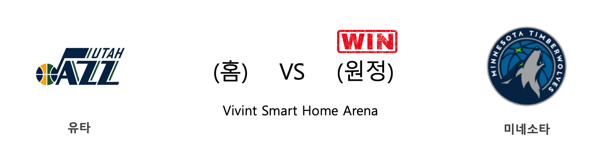
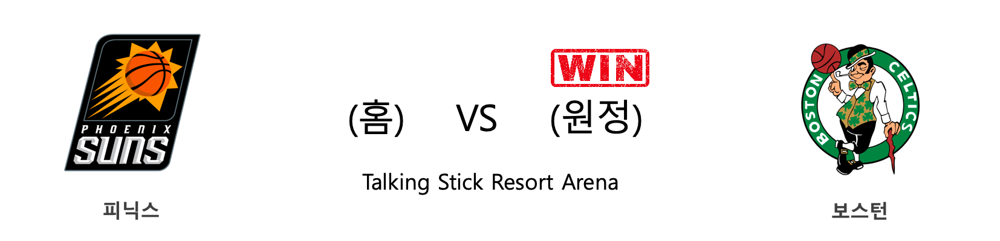
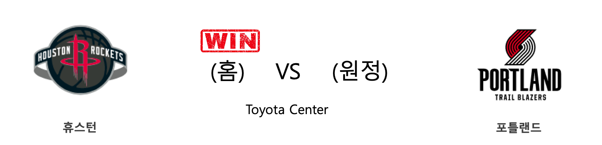
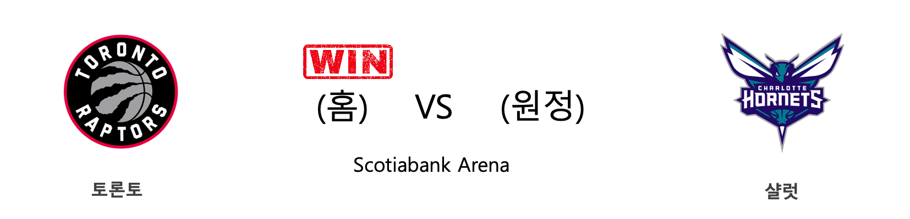
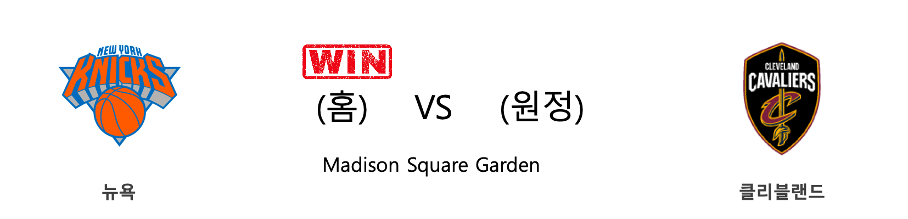
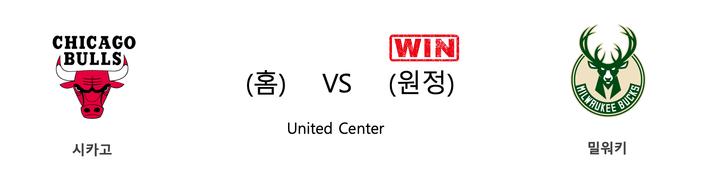
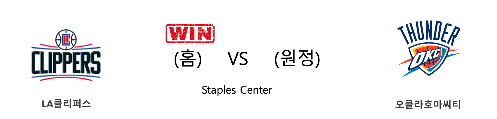
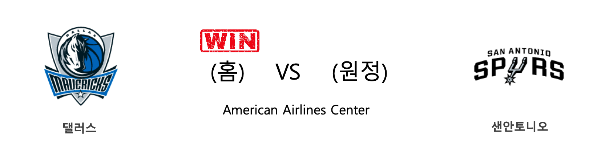

####  유타(홈) VS 미네소타(원정) 

<table class="tg">
  <tr>
    <th class="tg-rr9t">UTA</th>
    <th class="tg-rr9t">팀</th>
    <th class="tg-rr9t">MIN</th>
  </tr>
  <tr>
    <td class="tg-dcpn">0승 1패</td>
    <td class="tg-rr9t">시즌 상대전적</td>
    <td class="tg-dcpn">1승 0패</td>
  </tr>
  <tr>
    <td class="tg-dcpn">102</td>
    <td class="tg-rr9t">점수</td>
    <td class="tg-dcpn">112</td>
  </tr>
  <tr>
    <td class="tg-dcpn">23/65(35%)</td>
    <td class="tg-rr9t">2점(%)</td>
    <td class="tg-dcpn">27/51(53%)</td>
  </tr>
  <tr>
    <td class="tg-dcpn">12/31(39%)</td>
    <td class="tg-rr9t">3점(%)</td>
    <td class="tg-dcpn">14/38(37%)</td>
  </tr>
  <tr>
    <td class="tg-dcpn">20/26(77%)</td>
    <td class="tg-rr9t">자유투(%)</td>
    <td class="tg-dcpn">16/19(84%)</td>
  </tr>
  <tr>
    <td class="tg-dcpn">53</td>
    <td class="tg-rr9t">리바운드</td>
    <td class="tg-dcpn">51</td>
  </tr>
  <tr>
    <td class="tg-dcpn">20</td>
    <td class="tg-rr9t">어시스트</td>
    <td class="tg-dcpn">22</td>
  </tr>
  <tr>
    <td class="tg-dcpn">5</td>
    <td class="tg-rr9t">스틸</td>
    <td class="tg-dcpn">6</td>
  </tr>
  <tr>
    <td class="tg-dcpn">5</td>
    <td class="tg-rr9t">블록</td>
    <td class="tg-dcpn">10</td>
  </tr>
  <tr>
    <td class="tg-dcpn">14</td>
    <td class="tg-rr9t">턴오버</td>
    <td class="tg-dcpn">15</td>
  </tr>
  <tr>
    <td class="tg-dcpn">BojanBogdanov(18) DonovanMitche(17) RudyGobertC(16) MikeConleyG(15)</td>
    <td class="tg-rr9t">주요 득점선수</td>
    <td class="tg-dcpn">Karl-AnthonyT(29) JeffTeagueG(21) RobertCovingt(15)</td>
  </tr>
</table>

#### 경기 관련 주요 기사         

[[오늘의 NBA] (11/16) 멤피스, Grit&Grind 시대와의 성공적인 단절](http://sports.news.naver.com/basketball/news/read.nhn?oid=486&aid=0000001139)

[[오늘의 NBA] (11/9) 위긴스 vs 러셀, 타깃 센터의 명승부](http://sports.news.naver.com/basketball/news/read.nhn?oid=486&aid=0000001132)

[[오늘의 NBA] (11/4) 마이애미의 대권 도전 행보](http://sports.news.naver.com/basketball/news/read.nhn?oid=486&aid=0000001127)

[[오늘의 NBA] (11/2) 르브론 제임스의 왕권신수설](http://sports.news.naver.com/basketball/news/read.nhn?oid=486&aid=0000001125)

[[오늘의 NBA] (10/31) HOU vs WAS, NBA 득점 쟁탈전 역사를 새로 쓰다](http://sports.news.naver.com/basketball/news/read.nhn?oid=486&aid=0000001123)

        
        

####  피닉스(홈) VS 보스턴(원정) 

<table class="tg">
  <tr>
    <th class="tg-rr9t">PHX</th>
    <th class="tg-rr9t">팀</th>
    <th class="tg-rr9t">BOS</th>
  </tr>
  <tr>
    <td class="tg-dcpn">0승 1패</td>
    <td class="tg-rr9t">시즌 상대전적</td>
    <td class="tg-dcpn">1승 0패</td>
  </tr>
  <tr>
    <td class="tg-dcpn">85</td>
    <td class="tg-rr9t">점수</td>
    <td class="tg-dcpn">99</td>
  </tr>
  <tr>
    <td class="tg-dcpn">23/46(50%)</td>
    <td class="tg-rr9t">2점(%)</td>
    <td class="tg-dcpn">25/48(52%)</td>
  </tr>
  <tr>
    <td class="tg-dcpn">10/36(28%)</td>
    <td class="tg-rr9t">3점(%)</td>
    <td class="tg-dcpn">12/41(29%)</td>
  </tr>
  <tr>
    <td class="tg-dcpn">9/12(75%)</td>
    <td class="tg-rr9t">자유투(%)</td>
    <td class="tg-dcpn">13/17(76%)</td>
  </tr>
  <tr>
    <td class="tg-dcpn">45</td>
    <td class="tg-rr9t">리바운드</td>
    <td class="tg-dcpn">52</td>
  </tr>
  <tr>
    <td class="tg-dcpn">22</td>
    <td class="tg-rr9t">어시스트</td>
    <td class="tg-dcpn">22</td>
  </tr>
  <tr>
    <td class="tg-dcpn">7</td>
    <td class="tg-rr9t">스틸</td>
    <td class="tg-dcpn">12</td>
  </tr>
  <tr>
    <td class="tg-dcpn">6</td>
    <td class="tg-rr9t">블록</td>
    <td class="tg-dcpn">5</td>
  </tr>
  <tr>
    <td class="tg-dcpn">19</td>
    <td class="tg-rr9t">턴오버</td>
    <td class="tg-dcpn">17</td>
  </tr>
  <tr>
    <td class="tg-dcpn">KellyOubreJr.(15) DevinBookerG(20)</td>
    <td class="tg-rr9t">주요 득점선수</td>
    <td class="tg-dcpn">KembaWalkerG(19) MarcusSmartG(17) JaysonTatumF(26)</td>
  </tr>
</table>

#### 경기 관련 주요 기사         

[[오늘의 NBA] (11/13) LAL 카일 쿠즈마의 대반격](http://sports.news.naver.com/basketball/news/read.nhn?oid=486&aid=0000001136)

[[오늘의 NBA] (11/8) 켐바 워커의 홈 커밍 데이](http://sports.news.naver.com/basketball/news/read.nhn?oid=486&aid=0000001131)

[[오늘의 NBA] (11/19) 댈러스의 루카 복음 낭송](http://sports.news.naver.com/basketball/news/read.nhn?oid=486&aid=0000001142)

[[오늘의 NBA] (11/9) 위긴스 vs 러셀, 타깃 센터의 명승부](http://sports.news.naver.com/basketball/news/read.nhn?oid=486&aid=0000001132)

[[오늘의 NBA] (11/16) 멤피스, Grit&Grind 시대와의 성공적인 단절](http://sports.news.naver.com/basketball/news/read.nhn?oid=486&aid=0000001139)

        
        

####  휴스턴(홈) VS 포틀랜드(원정) 

<table class="tg">
  <tr>
    <th class="tg-rr9t">HOU</th>
    <th class="tg-rr9t">팀</th>
    <th class="tg-rr9t">POR</th>
  </tr>
  <tr>
    <td class="tg-dcpn">1승 0패</td>
    <td class="tg-rr9t">시즌 상대전적</td>
    <td class="tg-dcpn">0승 1패</td>
  </tr>
  <tr>
    <td class="tg-dcpn">132</td>
    <td class="tg-rr9t">점수</td>
    <td class="tg-dcpn">108</td>
  </tr>
  <tr>
    <td class="tg-dcpn">30/55(55%)</td>
    <td class="tg-rr9t">2점(%)</td>
    <td class="tg-dcpn">29/60(48%)</td>
  </tr>
  <tr>
    <td class="tg-dcpn">17/45(38%)</td>
    <td class="tg-rr9t">3점(%)</td>
    <td class="tg-dcpn">11/36(31%)</td>
  </tr>
  <tr>
    <td class="tg-dcpn">21/26(81%)</td>
    <td class="tg-rr9t">자유투(%)</td>
    <td class="tg-dcpn">17/23(74%)</td>
  </tr>
  <tr>
    <td class="tg-dcpn">58</td>
    <td class="tg-rr9t">리바운드</td>
    <td class="tg-dcpn">44</td>
  </tr>
  <tr>
    <td class="tg-dcpn">24</td>
    <td class="tg-rr9t">어시스트</td>
    <td class="tg-dcpn">28</td>
  </tr>
  <tr>
    <td class="tg-dcpn">9</td>
    <td class="tg-rr9t">스틸</td>
    <td class="tg-dcpn">7</td>
  </tr>
  <tr>
    <td class="tg-dcpn">10</td>
    <td class="tg-rr9t">블록</td>
    <td class="tg-dcpn">5</td>
  </tr>
  <tr>
    <td class="tg-dcpn">16</td>
    <td class="tg-rr9t">턴오버</td>
    <td class="tg-dcpn">17</td>
  </tr>
  <tr>
    <td class="tg-dcpn">RussellWestbr(28) JamesHardenG(36) ClintCapelaC(22)</td>
    <td class="tg-rr9t">주요 득점선수</td>
    <td class="tg-dcpn">SkalLabissier(15) CJMcCollumG(25)</td>
  </tr>
</table>

#### 경기 관련 주요 기사         

[[오늘의 NBA] (11/14) 제임스 하든, 농구의 미래를 제시하다](http://sports.news.naver.com/basketball/news/read.nhn?oid=486&aid=0000001137)

[[오늘의 NBA] (11/11) 토론토, 디펜딩 챔피언의 저력](http://sports.news.naver.com/basketball/news/read.nhn?oid=486&aid=0000001134)

[[오늘의 NBA] (11/19) 댈러스의 루카 복음 낭송](http://sports.news.naver.com/basketball/news/read.nhn?oid=486&aid=0000001142)

[[오늘의 NBA] (11/17) 샬럿, 설계된 플레이 연출의 달인](http://sports.news.naver.com/basketball/news/read.nhn?oid=486&aid=0000001140)

[[오늘의 NBA] (11/10) 제임스 하든의 3점 라인 영점 사격](http://sports.news.naver.com/basketball/news/read.nhn?oid=486&aid=0000001133)

        
        

####  토론토(홈) VS 샬럿(원정) 

<table class="tg">
  <tr>
    <th class="tg-rr9t">TOR</th>
    <th class="tg-rr9t">팀</th>
    <th class="tg-rr9t">CHA</th>
  </tr>
  <tr>
    <td class="tg-dcpn">1승 0패</td>
    <td class="tg-rr9t">시즌 상대전적</td>
    <td class="tg-dcpn">0승 1패</td>
  </tr>
  <tr>
    <td class="tg-dcpn">132</td>
    <td class="tg-rr9t">점수</td>
    <td class="tg-dcpn">96</td>
  </tr>
  <tr>
    <td class="tg-dcpn">30/54(56%)</td>
    <td class="tg-rr9t">2점(%)</td>
    <td class="tg-dcpn">18/33(55%)</td>
  </tr>
  <tr>
    <td class="tg-dcpn">20/43(47%)</td>
    <td class="tg-rr9t">3점(%)</td>
    <td class="tg-dcpn">15/45(33%)</td>
  </tr>
  <tr>
    <td class="tg-dcpn">12/15(80%)</td>
    <td class="tg-rr9t">자유투(%)</td>
    <td class="tg-dcpn">15/24(62%)</td>
  </tr>
  <tr>
    <td class="tg-dcpn">53</td>
    <td class="tg-rr9t">리바운드</td>
    <td class="tg-dcpn">37</td>
  </tr>
  <tr>
    <td class="tg-dcpn">40</td>
    <td class="tg-rr9t">어시스트</td>
    <td class="tg-dcpn">26</td>
  </tr>
  <tr>
    <td class="tg-dcpn">13</td>
    <td class="tg-rr9t">스틸</td>
    <td class="tg-dcpn">3</td>
  </tr>
  <tr>
    <td class="tg-dcpn">2</td>
    <td class="tg-rr9t">블록</td>
    <td class="tg-dcpn">8</td>
  </tr>
  <tr>
    <td class="tg-dcpn">10</td>
    <td class="tg-rr9t">턴오버</td>
    <td class="tg-dcpn">19</td>
  </tr>
  <tr>
    <td class="tg-dcpn">TerenceDavis(16) PascalSiakamF(20) RondaeHollis-(15) OGAnunobyF(24) NormanPowellG(17)</td>
    <td class="tg-rr9t">주요 득점선수</td>
    <td class="tg-dcpn"></td>
  </tr>
</table>

#### 경기 관련 주요 기사         

[[오늘의 NBA] 시즌 프리뷰 : 포틀랜드, 근성과 낭만의 조화](http://sports.news.naver.com/basketball/news/read.nhn?oid=486&aid=0000001110)

[오늘의 NBA] (11/3) 안드레 드러먼드, 모터 시티의 세계수](http://sports.news.naver.com/basketball/news/read.nhn?oid=486&aid=0000001126)

[[오늘의 NBA] (11/11) 토론토, 디펜딩 챔피언의 저력](http://sports.news.naver.com/basketball/news/read.nhn?oid=486&aid=0000001134)

[[오늘의 NBA] (11/17) 샬럿, 설계된 플레이 연출의 달인](http://sports.news.naver.com/basketball/news/read.nhn?oid=486&aid=0000001140)

[[오늘의 NBA] (11/7) 야니스 아테토쿤보의 MVP 수성 의지](http://sports.news.naver.com/basketball/news/read.nhn?oid=486&aid=0000001130)

        
        

####  뉴욕(홈) VS 클리블랜드(원정) 

<table class="tg">
  <tr>
    <th class="tg-rr9t">NYK</th>
    <th class="tg-rr9t">팀</th>
    <th class="tg-rr9t">CLE</th>
  </tr>
  <tr>
    <td class="tg-dcpn">1승 1패</td>
    <td class="tg-rr9t">시즌 상대전적</td>
    <td class="tg-dcpn">1승 1패</td>
  </tr>
  <tr>
    <td class="tg-dcpn">123</td>
    <td class="tg-rr9t">점수</td>
    <td class="tg-dcpn">105</td>
  </tr>
  <tr>
    <td class="tg-dcpn">36/75(48%)</td>
    <td class="tg-rr9t">2점(%)</td>
    <td class="tg-dcpn">19/40(48%)</td>
  </tr>
  <tr>
    <td class="tg-dcpn">8/23(35%)</td>
    <td class="tg-rr9t">3점(%)</td>
    <td class="tg-dcpn">17/36(47%)</td>
  </tr>
  <tr>
    <td class="tg-dcpn">27/35(77%)</td>
    <td class="tg-rr9t">자유투(%)</td>
    <td class="tg-dcpn">16/30(53%)</td>
  </tr>
  <tr>
    <td class="tg-dcpn">47</td>
    <td class="tg-rr9t">리바운드</td>
    <td class="tg-dcpn">41</td>
  </tr>
  <tr>
    <td class="tg-dcpn">17</td>
    <td class="tg-rr9t">어시스트</td>
    <td class="tg-dcpn">18</td>
  </tr>
  <tr>
    <td class="tg-dcpn">8</td>
    <td class="tg-rr9t">스틸</td>
    <td class="tg-dcpn">2</td>
  </tr>
  <tr>
    <td class="tg-dcpn">10</td>
    <td class="tg-rr9t">블록</td>
    <td class="tg-dcpn">1</td>
  </tr>
  <tr>
    <td class="tg-dcpn">7</td>
    <td class="tg-rr9t">턴오버</td>
    <td class="tg-dcpn">19</td>
  </tr>
  <tr>
    <td class="tg-dcpn">RJBarrettG(15) MarcusMorrisS(23) JuliusRandleF(30)</td>
    <td class="tg-rr9t">주요 득점선수</td>
    <td class="tg-dcpn">KevinPorterJr(18)</td>
  </tr>
</table>

#### 경기 관련 주요 기사         

[[오늘의 NBA] (11/13) LAL 카일 쿠즈마의 대반격](http://sports.news.naver.com/basketball/news/read.nhn?oid=486&aid=0000001136)

[[오늘의 NBA] (11/15) NOP 즈루 홀리데이, 뒤처리는 내가 맡는다!](http://sports.news.naver.com/basketball/news/read.nhn?oid=486&aid=0000001138)

[[오늘의 NBA] (11/19) 댈러스의 루카 복음 낭송](http://sports.news.naver.com/basketball/news/read.nhn?oid=486&aid=0000001142)

[[오늘의 NBA] (11/14) 제임스 하든, 농구의 미래를 제시하다](http://sports.news.naver.com/basketball/news/read.nhn?oid=486&aid=0000001137)

[[오늘의 NBA] (11/17) 샬럿, 설계된 플레이 연출의 달인](http://sports.news.naver.com/basketball/news/read.nhn?oid=486&aid=0000001140)

        
        

####  시카고(홈) VS 밀워키(원정) 

<table class="tg">
  <tr>
    <th class="tg-rr9t">CHI</th>
    <th class="tg-rr9t">팀</th>
    <th class="tg-rr9t">MIL</th>
  </tr>
  <tr>
    <td class="tg-dcpn">0승 2패</td>
    <td class="tg-rr9t">시즌 상대전적</td>
    <td class="tg-dcpn">2승 0패</td>
  </tr>
  <tr>
    <td class="tg-dcpn">101</td>
    <td class="tg-rr9t">점수</td>
    <td class="tg-dcpn">115</td>
  </tr>
  <tr>
    <td class="tg-dcpn">27/63(43%)</td>
    <td class="tg-rr9t">2점(%)</td>
    <td class="tg-dcpn">23/41(56%)</td>
  </tr>
  <tr>
    <td class="tg-dcpn">12/34(35%)</td>
    <td class="tg-rr9t">3점(%)</td>
    <td class="tg-dcpn">15/41(37%)</td>
  </tr>
  <tr>
    <td class="tg-dcpn">11/14(79%)</td>
    <td class="tg-rr9t">자유투(%)</td>
    <td class="tg-dcpn">24/35(69%)</td>
  </tr>
  <tr>
    <td class="tg-dcpn">50</td>
    <td class="tg-rr9t">리바운드</td>
    <td class="tg-dcpn">48</td>
  </tr>
  <tr>
    <td class="tg-dcpn">25</td>
    <td class="tg-rr9t">어시스트</td>
    <td class="tg-dcpn">24</td>
  </tr>
  <tr>
    <td class="tg-dcpn">6</td>
    <td class="tg-rr9t">스틸</td>
    <td class="tg-dcpn">12</td>
  </tr>
  <tr>
    <td class="tg-dcpn">6</td>
    <td class="tg-rr9t">블록</td>
    <td class="tg-dcpn">9</td>
  </tr>
  <tr>
    <td class="tg-dcpn">14</td>
    <td class="tg-rr9t">턴오버</td>
    <td class="tg-dcpn">15</td>
  </tr>
  <tr>
    <td class="tg-dcpn">DanielGafford(21)</td>
    <td class="tg-rr9t">주요 득점선수</td>
    <td class="tg-dcpn">BrookLopezC(19) DonteDiVincen(15) GeorgeHill(18) GiannisAnteto(33)</td>
  </tr>
</table>

#### 경기 관련 주요 기사         

[[오늘의 NBA] (11/15) NOP 즈루 홀리데이, 뒤처리는 내가 맡는다!](http://sports.news.naver.com/basketball/news/read.nhn?oid=486&aid=0000001138)

[[오늘의 NBA] (11/7) 야니스 아테토쿤보의 MVP 수성 의지](http://sports.news.naver.com/basketball/news/read.nhn?oid=486&aid=0000001130)

[[오늘의 NBA] (11/17) 샬럿, 설계된 플레이 연출의 달인](http://sports.news.naver.com/basketball/news/read.nhn?oid=486&aid=0000001140)

[[오늘의 NBA] (11/13) LAL 카일 쿠즈마의 대반격](http://sports.news.naver.com/basketball/news/read.nhn?oid=486&aid=0000001136)

[[오늘의 NBA] (11/19) 댈러스의 루카 복음 낭송](http://sports.news.naver.com/basketball/news/read.nhn?oid=486&aid=0000001142)

        
        

####  LA클리퍼스(홈) VS 오클라호마씨티(원정) 

<table class="tg">
  <tr>
    <th class="tg-rr9t">LAC</th>
    <th class="tg-rr9t">팀</th>
    <th class="tg-rr9t">OKC</th>
  </tr>
  <tr>
    <td class="tg-dcpn">1승 0패</td>
    <td class="tg-rr9t">시즌 상대전적</td>
    <td class="tg-dcpn">0승 1패</td>
  </tr>
  <tr>
    <td class="tg-dcpn">90</td>
    <td class="tg-rr9t">점수</td>
    <td class="tg-dcpn">88</td>
  </tr>
  <tr>
    <td class="tg-dcpn">25/51(49%)</td>
    <td class="tg-rr9t">2점(%)</td>
    <td class="tg-dcpn">21/48(44%)</td>
  </tr>
  <tr>
    <td class="tg-dcpn">10/36(28%)</td>
    <td class="tg-rr9t">3점(%)</td>
    <td class="tg-dcpn">7/27(26%)</td>
  </tr>
  <tr>
    <td class="tg-dcpn">10/14(71%)</td>
    <td class="tg-rr9t">자유투(%)</td>
    <td class="tg-dcpn">25/28(89%)</td>
  </tr>
  <tr>
    <td class="tg-dcpn">49</td>
    <td class="tg-rr9t">리바운드</td>
    <td class="tg-dcpn">45</td>
  </tr>
  <tr>
    <td class="tg-dcpn">23</td>
    <td class="tg-rr9t">어시스트</td>
    <td class="tg-dcpn">17</td>
  </tr>
  <tr>
    <td class="tg-dcpn">7</td>
    <td class="tg-rr9t">스틸</td>
    <td class="tg-dcpn">12</td>
  </tr>
  <tr>
    <td class="tg-dcpn">5</td>
    <td class="tg-rr9t">블록</td>
    <td class="tg-dcpn">4</td>
  </tr>
  <tr>
    <td class="tg-dcpn">17</td>
    <td class="tg-rr9t">턴오버</td>
    <td class="tg-dcpn">17</td>
  </tr>
  <tr>
    <td class="tg-dcpn">MontrezlHarre(28) PaulGeorgeF(18)</td>
    <td class="tg-rr9t">주요 득점선수</td>
    <td class="tg-dcpn">ChrisPaulG(22)</td>
  </tr>
</table>

#### 경기 관련 주요 기사         

[[오늘의 NBA] (11/11) 토론토, 디펜딩 챔피언의 저력](http://sports.news.naver.com/basketball/news/read.nhn?oid=486&aid=0000001134)

[[오늘의 NBA] (11/15) NOP 즈루 홀리데이, 뒤처리는 내가 맡는다!](http://sports.news.naver.com/basketball/news/read.nhn?oid=486&aid=0000001138)

[[줌 인 NBA] 마이애미의 상승세, 스포엘스트라와 영건들의 콜라보!](http://sports.news.naver.com/basketball/news/read.nhn?oid=065&aid=0000191826)

[[오늘의 NBA] (11/19) 댈러스의 루카 복음 낭송](http://sports.news.naver.com/basketball/news/read.nhn?oid=486&aid=0000001142)

[[오늘의 NBA] (11/16) 멤피스, Grit&Grind 시대와의 성공적인 단절](http://sports.news.naver.com/basketball/news/read.nhn?oid=486&aid=0000001139)

        
        

####  댈러스(홈) VS 샌안토니오(원정) 

<table class="tg">
  <tr>
    <th class="tg-rr9t">DAL</th>
    <th class="tg-rr9t">팀</th>
    <th class="tg-rr9t">SAS</th>
  </tr>
  <tr>
    <td class="tg-dcpn">1승 0패</td>
    <td class="tg-rr9t">시즌 상대전적</td>
    <td class="tg-dcpn">0승 1패</td>
  </tr>
  <tr>
    <td class="tg-dcpn">117</td>
    <td class="tg-rr9t">점수</td>
    <td class="tg-dcpn">110</td>
  </tr>
  <tr>
    <td class="tg-dcpn">25/43(58%)</td>
    <td class="tg-rr9t">2점(%)</td>
    <td class="tg-dcpn">36/72(50%)</td>
  </tr>
  <tr>
    <td class="tg-dcpn">17/41(41%)</td>
    <td class="tg-rr9t">3점(%)</td>
    <td class="tg-dcpn">8/24(33%)</td>
  </tr>
  <tr>
    <td class="tg-dcpn">16/23(70%)</td>
    <td class="tg-rr9t">자유투(%)</td>
    <td class="tg-dcpn">14/16(88%)</td>
  </tr>
  <tr>
    <td class="tg-dcpn">41</td>
    <td class="tg-rr9t">리바운드</td>
    <td class="tg-dcpn">48</td>
  </tr>
  <tr>
    <td class="tg-dcpn">28</td>
    <td class="tg-rr9t">어시스트</td>
    <td class="tg-dcpn">18</td>
  </tr>
  <tr>
    <td class="tg-dcpn">4</td>
    <td class="tg-rr9t">스틸</td>
    <td class="tg-dcpn">6</td>
  </tr>
  <tr>
    <td class="tg-dcpn">3</td>
    <td class="tg-rr9t">블록</td>
    <td class="tg-dcpn">2</td>
  </tr>
  <tr>
    <td class="tg-dcpn">13</td>
    <td class="tg-rr9t">턴오버</td>
    <td class="tg-dcpn">9</td>
  </tr>
  <tr>
    <td class="tg-dcpn">KristapsPorzi(18) DorianFinney-(22) LukaDoncicG(42)</td>
    <td class="tg-rr9t">주요 득점선수</td>
    <td class="tg-dcpn">LaMarcusAldri(16) DeMarDeRozanF(36)</td>
  </tr>
</table>

#### 경기 관련 주요 기사         

[[오늘의 NBA] (11/19) 댈러스의 루카 복음 낭송](http://sports.news.naver.com/basketball/news/read.nhn?oid=486&aid=0000001142)

[[오늘의 NBA] (11/9) 위긴스 vs 러셀, 타깃 센터의 명승부](http://sports.news.naver.com/basketball/news/read.nhn?oid=486&aid=0000001132)

[[오늘의 NBA] (11/2) 르브론 제임스의 왕권신수설](http://sports.news.naver.com/basketball/news/read.nhn?oid=486&aid=0000001125)

[[오늘의 NBA] (11/12) 샌안토니오와 토니 파커의 마지막 동반 여행](http://sports.news.naver.com/basketball/news/read.nhn?oid=486&aid=0000001135)

[[오늘의 NBA] (10/30) 앤써니 데이비스, 골드&퍼플 군단의 새로운 태양](http://sports.news.naver.com/basketball/news/read.nhn?oid=486&aid=0000001122)

        
        

####  브루클린(홈) VS 인디애나(원정) 

<table class="tg">
  <tr>
    <th class="tg-rr9t">BKN</th>
    <th class="tg-rr9t">팀</th>
    <th class="tg-rr9t">IND</th>
  </tr>
  <tr>
    <td class="tg-dcpn">0승 2패</td>
    <td class="tg-rr9t">시즌 상대전적</td>
    <td class="tg-dcpn">2승 0패</td>
  </tr>
  <tr>
    <td class="tg-dcpn">86</td>
    <td class="tg-rr9t">점수</td>
    <td class="tg-dcpn">115</td>
  </tr>
  <tr>
    <td class="tg-dcpn">19/50(38%)</td>
    <td class="tg-rr9t">2점(%)</td>
    <td class="tg-dcpn">30/68(44%)</td>
  </tr>
  <tr>
    <td class="tg-dcpn">11/34(32%)</td>
    <td class="tg-rr9t">3점(%)</td>
    <td class="tg-dcpn">14/33(42%)</td>
  </tr>
  <tr>
    <td class="tg-dcpn">15/24(62%)</td>
    <td class="tg-rr9t">자유투(%)</td>
    <td class="tg-dcpn">13/17(76%)</td>
  </tr>
  <tr>
    <td class="tg-dcpn">40</td>
    <td class="tg-rr9t">리바운드</td>
    <td class="tg-dcpn">63</td>
  </tr>
  <tr>
    <td class="tg-dcpn">18</td>
    <td class="tg-rr9t">어시스트</td>
    <td class="tg-dcpn">26</td>
  </tr>
  <tr>
    <td class="tg-dcpn">2</td>
    <td class="tg-rr9t">스틸</td>
    <td class="tg-dcpn">5</td>
  </tr>
  <tr>
    <td class="tg-dcpn">7</td>
    <td class="tg-rr9t">블록</td>
    <td class="tg-dcpn">8</td>
  </tr>
  <tr>
    <td class="tg-dcpn">9</td>
    <td class="tg-rr9t">턴오버</td>
    <td class="tg-dcpn">10</td>
  </tr>
  <tr>
    <td class="tg-dcpn">SpencerDinwid(28)</td>
    <td class="tg-rr9t">주요 득점선수</td>
    <td class="tg-dcpn">T.J.WarrenF(19) AaronHolidayG(24) DomantasSabon(16) JustinHoliday(20)</td>
  </tr>
</table>

#### 경기 관련 주요 기사         

[[오늘의 NBA] (11/13) LAL 카일 쿠즈마의 대반격](http://sports.news.naver.com/basketball/news/read.nhn?oid=486&aid=0000001136)

[[오늘의 NBA] (11/17) 샬럿, 설계된 플레이 연출의 달인](http://sports.news.naver.com/basketball/news/read.nhn?oid=486&aid=0000001140)

[[오늘의 NBA] (11/11) 토론토, 디펜딩 챔피언의 저력](http://sports.news.naver.com/basketball/news/read.nhn?oid=486&aid=0000001134)

[[오늘의 NBA] (11/19) 댈러스의 루카 복음 낭송](http://sports.news.naver.com/basketball/news/read.nhn?oid=486&aid=0000001142)

[[오늘의 NBA] (11/18) 새크라멘토, 리그 선두 보스턴을 제압하다](http://sports.news.naver.com/basketball/news/read.nhn?oid=486&aid=0000001141)

        
        

#### 리그 (Eastern) 순위
    

<table class="tg">
  <tr>
    <th class="tg-d14o">순위</th>
    <th class="tg-d14o">팀명</th>
    <th class="tg-d14o">경기수</th>
    <th class="tg-d14o">승</th>
    <th class="tg-d14o">패</th>
    <th class="tg-d14o">승차</th>
    <th class="tg-d14o">승률</th>
  </tr>
  
<tr>
    <td class="tg-50j8">1</td>
    <td class="tg-50j8">BOS</td>
    <td class="tg-50j8">13</td>
    <td class="tg-50j8">11</td>
    <td class="tg-50j8">2</td>
    <td class="tg-50j8">0</td>
    <td class="tg-50j8">0.846</td>
</tr>

<tr>
    <td class="tg-50j8">2</td>
    <td class="tg-50j8">MIL</td>
    <td class="tg-50j8">13</td>
    <td class="tg-50j8">10</td>
    <td class="tg-50j8">3</td>
    <td class="tg-50j8">1</td>
    <td class="tg-50j8">0.769</td>
</tr>

<tr>
    <td class="tg-50j8">3</td>
    <td class="tg-50j8">MIA</td>
    <td class="tg-50j8">12</td>
    <td class="tg-50j8">9</td>
    <td class="tg-50j8">3</td>
    <td class="tg-50j8">2</td>
    <td class="tg-50j8">0.75</td>
</tr>

<tr>
    <td class="tg-50j8">4</td>
    <td class="tg-50j8">TOR</td>
    <td class="tg-50j8">13</td>
    <td class="tg-50j8">9</td>
    <td class="tg-50j8">4</td>
    <td class="tg-50j8">2</td>
    <td class="tg-50j8">0.692</td>
</tr>

<tr>
    <td class="tg-50j8">5</td>
    <td class="tg-50j8">PHI</td>
    <td class="tg-50j8">13</td>
    <td class="tg-50j8">8</td>
    <td class="tg-50j8">5</td>
    <td class="tg-50j8">3</td>
    <td class="tg-50j8">0.615</td>
</tr>

<tr>
    <td class="tg-50j8">6</td>
    <td class="tg-50j8">IND</td>
    <td class="tg-50j8">14</td>
    <td class="tg-50j8">8</td>
    <td class="tg-50j8">6</td>
    <td class="tg-50j8">3</td>
    <td class="tg-50j8">0.571</td>
</tr>

<tr>
    <td class="tg-50j8">7</td>
    <td class="tg-50j8">ORL</td>
    <td class="tg-50j8">13</td>
    <td class="tg-50j8">6</td>
    <td class="tg-50j8">7</td>
    <td class="tg-50j8">5</td>
    <td class="tg-50j8">0.462</td>
</tr>

<tr>
    <td class="tg-50j8">8</td>
    <td class="tg-50j8">CHA</td>
    <td class="tg-50j8">14</td>
    <td class="tg-50j8">6</td>
    <td class="tg-50j8">8</td>
    <td class="tg-50j8">5</td>
    <td class="tg-50j8">0.429</td>
</tr>

<tr>
    <td class="tg-50j8">9</td>
    <td class="tg-50j8">BKN</td>
    <td class="tg-50j8">13</td>
    <td class="tg-50j8">5</td>
    <td class="tg-50j8">8</td>
    <td class="tg-50j8">6</td>
    <td class="tg-50j8">0.385</td>
</tr>

<tr>
    <td class="tg-50j8">10</td>
    <td class="tg-50j8">DET</td>
    <td class="tg-50j8">13</td>
    <td class="tg-50j8">4</td>
    <td class="tg-50j8">9</td>
    <td class="tg-50j8">7</td>
    <td class="tg-50j8">0.308</td>
</tr>

<tr>
    <td class="tg-50j8">10</td>
    <td class="tg-50j8">CLE</td>
    <td class="tg-50j8">13</td>
    <td class="tg-50j8">4</td>
    <td class="tg-50j8">9</td>
    <td class="tg-50j8">7</td>
    <td class="tg-50j8">0.308</td>
</tr>

<tr>
    <td class="tg-50j8">10</td>
    <td class="tg-50j8">ATL</td>
    <td class="tg-50j8">13</td>
    <td class="tg-50j8">4</td>
    <td class="tg-50j8">9</td>
    <td class="tg-50j8">7</td>
    <td class="tg-50j8">0.308</td>
</tr>

<tr>
    <td class="tg-50j8">13</td>
    <td class="tg-50j8">CHI</td>
    <td class="tg-50j8">14</td>
    <td class="tg-50j8">4</td>
    <td class="tg-50j8">10</td>
    <td class="tg-50j8">7</td>
    <td class="tg-50j8">0.286</td>
</tr>

<tr>
    <td class="tg-50j8">13</td>
    <td class="tg-50j8">NYK</td>
    <td class="tg-50j8">14</td>
    <td class="tg-50j8">4</td>
    <td class="tg-50j8">10</td>
    <td class="tg-50j8">7</td>
    <td class="tg-50j8">0.286</td>
</tr>

<tr>
    <td class="tg-50j8">15</td>
    <td class="tg-50j8">WAS</td>
    <td class="tg-50j8">11</td>
    <td class="tg-50j8">3</td>
    <td class="tg-50j8">8</td>
    <td class="tg-50j8">8</td>
    <td class="tg-50j8">0.273</td>
</tr>
</table> 
#### 리그 (Western) 순위
    

<table class="tg">
  <tr>
    <th class="tg-d14o">순위</th>
    <th class="tg-d14o">팀명</th>
    <th class="tg-d14o">경기수</th>
    <th class="tg-d14o">승</th>
    <th class="tg-d14o">패</th>
    <th class="tg-d14o">승차</th>
    <th class="tg-d14o">승률</th>
  </tr>
  
<tr>
    <td class="tg-50j8">1</td>
    <td class="tg-50j8">LAL</td>
    <td class="tg-50j8">13</td>
    <td class="tg-50j8">11</td>
    <td class="tg-50j8">2</td>
    <td class="tg-50j8">0</td>
    <td class="tg-50j8">0.846</td>
</tr>

<tr>
    <td class="tg-50j8">2</td>
    <td class="tg-50j8">HOU</td>
    <td class="tg-50j8">14</td>
    <td class="tg-50j8">11</td>
    <td class="tg-50j8">3</td>
    <td class="tg-50j8">0</td>
    <td class="tg-50j8">0.786</td>
</tr>

<tr>
    <td class="tg-50j8">3</td>
    <td class="tg-50j8">DEN</td>
    <td class="tg-50j8">12</td>
    <td class="tg-50j8">9</td>
    <td class="tg-50j8">3</td>
    <td class="tg-50j8">2</td>
    <td class="tg-50j8">0.75</td>
</tr>

<tr>
    <td class="tg-50j8">4</td>
    <td class="tg-50j8">LAC</td>
    <td class="tg-50j8">14</td>
    <td class="tg-50j8">9</td>
    <td class="tg-50j8">5</td>
    <td class="tg-50j8">2</td>
    <td class="tg-50j8">0.643</td>
</tr>

<tr>
    <td class="tg-50j8">5</td>
    <td class="tg-50j8">DAL</td>
    <td class="tg-50j8">13</td>
    <td class="tg-50j8">8</td>
    <td class="tg-50j8">5</td>
    <td class="tg-50j8">3</td>
    <td class="tg-50j8">0.615</td>
</tr>

<tr>
    <td class="tg-50j8">5</td>
    <td class="tg-50j8">UTA</td>
    <td class="tg-50j8">13</td>
    <td class="tg-50j8">8</td>
    <td class="tg-50j8">5</td>
    <td class="tg-50j8">3</td>
    <td class="tg-50j8">0.615</td>
</tr>

<tr>
    <td class="tg-50j8">7</td>
    <td class="tg-50j8">MIN</td>
    <td class="tg-50j8">14</td>
    <td class="tg-50j8">8</td>
    <td class="tg-50j8">6</td>
    <td class="tg-50j8">3</td>
    <td class="tg-50j8">0.571</td>
</tr>

<tr>
    <td class="tg-50j8">8</td>
    <td class="tg-50j8">PHX</td>
    <td class="tg-50j8">12</td>
    <td class="tg-50j8">7</td>
    <td class="tg-50j8">5</td>
    <td class="tg-50j8">4</td>
    <td class="tg-50j8">0.583</td>
</tr>

<tr>
    <td class="tg-50j8">9</td>
    <td class="tg-50j8">SAC</td>
    <td class="tg-50j8">12</td>
    <td class="tg-50j8">5</td>
    <td class="tg-50j8">7</td>
    <td class="tg-50j8">6</td>
    <td class="tg-50j8">0.417</td>
</tr>

<tr>
    <td class="tg-50j8">10</td>
    <td class="tg-50j8">OKC</td>
    <td class="tg-50j8">13</td>
    <td class="tg-50j8">5</td>
    <td class="tg-50j8">8</td>
    <td class="tg-50j8">6</td>
    <td class="tg-50j8">0.385</td>
</tr>

<tr>
    <td class="tg-50j8">10</td>
    <td class="tg-50j8">MEM</td>
    <td class="tg-50j8">13</td>
    <td class="tg-50j8">5</td>
    <td class="tg-50j8">8</td>
    <td class="tg-50j8">6</td>
    <td class="tg-50j8">0.385</td>
</tr>

<tr>
    <td class="tg-50j8">12</td>
    <td class="tg-50j8">SAS</td>
    <td class="tg-50j8">14</td>
    <td class="tg-50j8">5</td>
    <td class="tg-50j8">9</td>
    <td class="tg-50j8">6</td>
    <td class="tg-50j8">0.357</td>
</tr>

<tr>
    <td class="tg-50j8">12</td>
    <td class="tg-50j8">POR</td>
    <td class="tg-50j8">14</td>
    <td class="tg-50j8">5</td>
    <td class="tg-50j8">9</td>
    <td class="tg-50j8">6</td>
    <td class="tg-50j8">0.357</td>
</tr>

<tr>
    <td class="tg-50j8">14</td>
    <td class="tg-50j8">NOP</td>
    <td class="tg-50j8">13</td>
    <td class="tg-50j8">4</td>
    <td class="tg-50j8">9</td>
    <td class="tg-50j8">7</td>
    <td class="tg-50j8">0.308</td>
</tr>

<tr>
    <td class="tg-50j8">15</td>
    <td class="tg-50j8">GSW</td>
    <td class="tg-50j8">14</td>
    <td class="tg-50j8">2</td>
    <td class="tg-50j8">12</td>
    <td class="tg-50j8">9</td>
    <td class="tg-50j8">0.143</td>
</tr>
</table> 

        
        
#nba #미국농구 #엔비에이 #농구분석 #토토 #스포츠토토 #경기예측 #농구결과 #20191119 #유타 #미네소타 #피닉스 #보스턴 #휴스턴 #포틀랜드 #토론토 #샬럿 #뉴욕 #클리블랜드 #시카고 #밀워키 #LA클리퍼스 #오클라호마씨티 #댈러스 #샌안토니오 #브루클린 #인디애나 #유타미네소타 #피닉스보스턴 #휴스턴포틀랜드 #토론토샬럿 #뉴욕클리블랜드 #시카고밀워키 #LA클리퍼스오클라호마씨티 #댈러스샌안토니오 #브루클린인디애나 