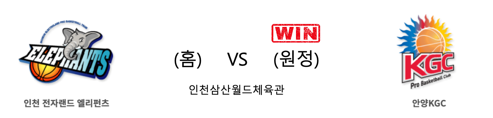

####  서울삼성(홈) VS 울산현대모비스(원정) 

<table class="tg">
  <tr>
    <th class="tg-rr9t">서울삼성</th>
    <th class="tg-rr9t">팀</th>
    <th class="tg-rr9t">울산현대모비스</th>
  </tr>
  <tr>
    <td class="tg-dcpn">1승 1패</td>
    <td class="tg-rr9t">시즌 상대전적</td>
    <td class="tg-dcpn">1승 1패</td>
  </tr>
  <tr>
    <td class="tg-dcpn">63</td>
    <td class="tg-rr9t">점수</td>
    <td class="tg-dcpn">75</td>
  </tr>
  <tr>
    <td class="tg-dcpn">19/38(50%)</td>
    <td class="tg-rr9t">2점(%)</td>
    <td class="tg-dcpn">18/36(50%)</td>
  </tr>
  <tr>
    <td class="tg-dcpn">5/21(24%)</td>
    <td class="tg-rr9t">3점(%)</td>
    <td class="tg-dcpn">10/25(40%)</td>
  </tr>
  <tr>
    <td class="tg-dcpn">10/14(71%)</td>
    <td class="tg-rr9t">자유투(%)</td>
    <td class="tg-dcpn">9/13(69%)</td>
  </tr>
  <tr>
    <td class="tg-dcpn">33</td>
    <td class="tg-rr9t">리바운드</td>
    <td class="tg-dcpn">35</td>
  </tr>
  <tr>
    <td class="tg-dcpn">1</td>
    <td class="tg-rr9t">어시스트</td>
    <td class="tg-dcpn">1</td>
  </tr>
  <tr>
    <td class="tg-dcpn">12</td>
    <td class="tg-rr9t">스틸</td>
    <td class="tg-dcpn">8</td>
  </tr>
  <tr>
    <td class="tg-dcpn">3</td>
    <td class="tg-rr9t">블록</td>
    <td class="tg-dcpn">8</td>
  </tr>
  <tr>
    <td class="tg-dcpn">11</td>
    <td class="tg-rr9t">턴오버</td>
    <td class="tg-dcpn">15</td>
  </tr>
  <tr>
    <td class="tg-dcpn">닉 미네라스(16)</td>
    <td class="tg-rr9t">주요 득점선수</td>
    <td class="tg-dcpn">김국찬(15) 박지훈(17)</td>
  </tr>
</table>

#### 경기 관련 주요 기사         

[[부상] 현대모비스 함지훈, 삼성 임동섭 20일 경기 결장](http://sports.news.naver.com/basketball/news/read.nhn?oid=065&aid=0000192703)

[현대모비스 '삼성의 연승을 저지'[포토]](http://www.xportsnews.com/?ac=article_view&entry_id=1200842)

[지훈·국찬 '이적생 듀오' 펄펄…현대모비스, 4연승 삼성 격파](http://www.rookie.co.kr/news/articleView.html?idxno=35121)

[울산 현대모비스, 서울 삼성 연승 행진에 제동… 75-63 완승](http://www.sporbiz.co.kr/news/articleView.html?idxno=393503)

        
        

####  인천전자랜드(홈) VS 안양KGC(원정) 

<table class="tg">
  <tr>
    <th class="tg-rr9t">인천전자랜드</th>
    <th class="tg-rr9t">팀</th>
    <th class="tg-rr9t">안양KGC</th>
  </tr>
  <tr>
    <td class="tg-dcpn">0승 1패</td>
    <td class="tg-rr9t">시즌 상대전적</td>
    <td class="tg-dcpn">1승 0패</td>
  </tr>
  <tr>
    <td class="tg-dcpn">69</td>
    <td class="tg-rr9t">점수</td>
    <td class="tg-dcpn">70</td>
  </tr>
  <tr>
    <td class="tg-dcpn">18/39(46%)</td>
    <td class="tg-rr9t">2점(%)</td>
    <td class="tg-dcpn">18/42(43%)</td>
  </tr>
  <tr>
    <td class="tg-dcpn">9/33(27%)</td>
    <td class="tg-rr9t">3점(%)</td>
    <td class="tg-dcpn">6/27(22%)</td>
  </tr>
  <tr>
    <td class="tg-dcpn">6/11(55%)</td>
    <td class="tg-rr9t">자유투(%)</td>
    <td class="tg-dcpn">16/19(84%)</td>
  </tr>
  <tr>
    <td class="tg-dcpn">42</td>
    <td class="tg-rr9t">리바운드</td>
    <td class="tg-dcpn">41</td>
  </tr>
  <tr>
    <td class="tg-dcpn">0</td>
    <td class="tg-rr9t">어시스트</td>
    <td class="tg-dcpn">2</td>
  </tr>
  <tr>
    <td class="tg-dcpn">13</td>
    <td class="tg-rr9t">스틸</td>
    <td class="tg-dcpn">11</td>
  </tr>
  <tr>
    <td class="tg-dcpn">6</td>
    <td class="tg-rr9t">블록</td>
    <td class="tg-dcpn">9</td>
  </tr>
  <tr>
    <td class="tg-dcpn">17</td>
    <td class="tg-rr9t">턴오버</td>
    <td class="tg-dcpn">16</td>
  </tr>
  <tr>
    <td class="tg-dcpn">머피 할로웨이(16) 김낙현(15) 섀넌 쇼터(15)</td>
    <td class="tg-rr9t">주요 득점선수</td>
    <td class="tg-dcpn">크리스 맥컬러(25)</td>
  </tr>
</table>

#### 경기 관련 주요 기사         

[KGC인삼공사, 전자랜드 제압하며 6위 지켜...전자랜드는 2연패](http://www.rookie.co.kr/news/articleView.html?idxno=35122)

[KGC 오세근 vs 전자랜드 이대헌 맞대결 관심↑](http://mksports.co.kr/view/2019/963959/)

[[루키 프리뷰] 부진 빠진 전자랜드-KGC, 외나무다리서 만나다](http://www.rookie.co.kr/news/articleView.html?idxno=35116)

[[BK Review] '맥컬러 25점' KGC, 전자랜드 전 5연패 탈출](http://www.basketkorea.com/news/articleView.html?idxno=190266)

        
        

#### 리그 순위

<table class="tg">
  <tr>
    <th class="tg-d14o">순위</th>
    <th class="tg-d14o">팀명</th>
    <th class="tg-d14o">경기수</th>
    <th class="tg-d14o">승</th>
    <th class="tg-d14o">패</th>
    <th class="tg-d14o">승차</th>
    <th class="tg-d14o">승률</th>
  </tr>
  
<tr>
    <td class="tg-50j8">1</td>
    <td class="tg-50j8">서울SK</td>
    <td class="tg-50j8">15</td>
    <td class="tg-50j8">11</td>
    <td class="tg-50j8">4</td>
    <td class="tg-50j8">0</td>
    <td class="tg-50j8">0.733</td>
</tr>

<tr>
    <td class="tg-50j8">2</td>
    <td class="tg-50j8">원주DB</td>
    <td class="tg-50j8">15</td>
    <td class="tg-50j8">9</td>
    <td class="tg-50j8">6</td>
    <td class="tg-50j8">2</td>
    <td class="tg-50j8">0.6</td>
</tr>

<tr>
    <td class="tg-50j8">2</td>
    <td class="tg-50j8">인천전자랜드</td>
    <td class="tg-50j8">15</td>
    <td class="tg-50j8">9</td>
    <td class="tg-50j8">6</td>
    <td class="tg-50j8">2</td>
    <td class="tg-50j8">0.6</td>
</tr>

<tr>
    <td class="tg-50j8">4</td>
    <td class="tg-50j8">전주KCC</td>
    <td class="tg-50j8">16</td>
    <td class="tg-50j8">9</td>
    <td class="tg-50j8">7</td>
    <td class="tg-50j8">2</td>
    <td class="tg-50j8">0.562</td>
</tr>

<tr>
    <td class="tg-50j8">5</td>
    <td class="tg-50j8">안양KGC</td>
    <td class="tg-50j8">16</td>
    <td class="tg-50j8">8</td>
    <td class="tg-50j8">8</td>
    <td class="tg-50j8">3</td>
    <td class="tg-50j8">0.5</td>
</tr>

<tr>
    <td class="tg-50j8">5</td>
    <td class="tg-50j8">서울삼성</td>
    <td class="tg-50j8">16</td>
    <td class="tg-50j8">8</td>
    <td class="tg-50j8">8</td>
    <td class="tg-50j8">3</td>
    <td class="tg-50j8">0.5</td>
</tr>

<tr>
    <td class="tg-50j8">7</td>
    <td class="tg-50j8">울산현대모비스</td>
    <td class="tg-50j8">17</td>
    <td class="tg-50j8">8</td>
    <td class="tg-50j8">9</td>
    <td class="tg-50j8">3</td>
    <td class="tg-50j8">0.471</td>
</tr>

<tr>
    <td class="tg-50j8">8</td>
    <td class="tg-50j8">부산KT</td>
    <td class="tg-50j8">14</td>
    <td class="tg-50j8">6</td>
    <td class="tg-50j8">8</td>
    <td class="tg-50j8">5</td>
    <td class="tg-50j8">0.429</td>
</tr>

<tr>
    <td class="tg-50j8">9</td>
    <td class="tg-50j8">고양오리온</td>
    <td class="tg-50j8">15</td>
    <td class="tg-50j8">5</td>
    <td class="tg-50j8">10</td>
    <td class="tg-50j8">6</td>
    <td class="tg-50j8">0.333</td>
</tr>

<tr>
    <td class="tg-50j8">10</td>
    <td class="tg-50j8">창원LG</td>
    <td class="tg-50j8">17</td>
    <td class="tg-50j8">5</td>
    <td class="tg-50j8">12</td>
    <td class="tg-50j8">6</td>
    <td class="tg-50j8">0.294</td>
</tr>
</table> 

        
        
