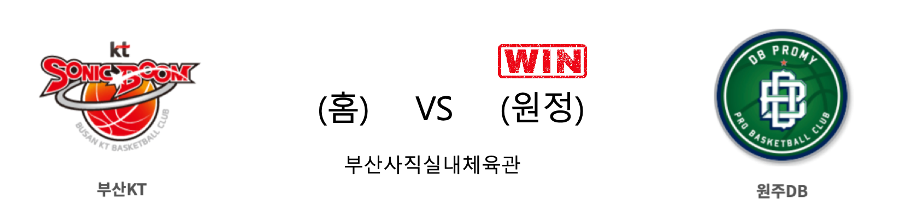

####  부산KT(홈) VS 원주DB(원정) 

<table class="tg">
  <tr>
    <th class="tg-rr9t">부산KT</th>
    <th class="tg-rr9t">팀</th>
    <th class="tg-rr9t">원주DB</th>
  </tr>
  <tr>
    <td class="tg-dcpn">0승 2패</td>
    <td class="tg-rr9t">시즌 상대전적</td>
    <td class="tg-dcpn">2승 0패</td>
  </tr>
  <tr>
    <td class="tg-dcpn">70</td>
    <td class="tg-rr9t">점수</td>
    <td class="tg-dcpn">87</td>
  </tr>
  <tr>
    <td class="tg-dcpn">21/44(48%)</td>
    <td class="tg-rr9t">2점(%)</td>
    <td class="tg-dcpn">31/51(61%)</td>
  </tr>
  <tr>
    <td class="tg-dcpn">6/27(22%)</td>
    <td class="tg-rr9t">3점(%)</td>
    <td class="tg-dcpn">5/17(29%)</td>
  </tr>
  <tr>
    <td class="tg-dcpn">10/14(71%)</td>
    <td class="tg-rr9t">자유투(%)</td>
    <td class="tg-dcpn">10/16(62%)</td>
  </tr>
  <tr>
    <td class="tg-dcpn">35</td>
    <td class="tg-rr9t">리바운드</td>
    <td class="tg-dcpn">41</td>
  </tr>
  <tr>
    <td class="tg-dcpn">3</td>
    <td class="tg-rr9t">어시스트</td>
    <td class="tg-dcpn">3</td>
  </tr>
  <tr>
    <td class="tg-dcpn">11</td>
    <td class="tg-rr9t">스틸</td>
    <td class="tg-dcpn">13</td>
  </tr>
  <tr>
    <td class="tg-dcpn">4</td>
    <td class="tg-rr9t">블록</td>
    <td class="tg-dcpn">3</td>
  </tr>
  <tr>
    <td class="tg-dcpn">20</td>
    <td class="tg-rr9t">턴오버</td>
    <td class="tg-dcpn">23</td>
  </tr>
  <tr>
    <td class="tg-dcpn">바이런 멀린스(27)</td>
    <td class="tg-rr9t">주요 득점선수</td>
    <td class="tg-dcpn">칼렙 그린(19) 치나누 오누아쿠(15)</td>
  </tr>
</table>

#### 경기 관련 주요 기사         

['4명 두 자릿수 득점' DB, KT 꺾고 10승 고지](http://www.newsis.com/view/?id=NISX20191121_0000837604&cID=10505&pID=10500)

['농구 대통령' 허재 전 감독, 아들 소속팀 kt 경기서 시투](http://yna.kr/AKR20191121098900007?did=1195m)

[[내 맘대로 프리뷰] 연승 노리는 두 팀의 맞대결, KT vs DB](http://www.basketkorea.com/news/articleView.html?idxno=190275)

[원주DB 오누아쿠 '또 들어갔어'](http://news1.kr/photos/view/?3930037)

        
        

#### 리그 순위

<table class="tg">
  <tr>
    <th class="tg-d14o">순위</th>
    <th class="tg-d14o">팀명</th>
    <th class="tg-d14o">경기수</th>
    <th class="tg-d14o">승</th>
    <th class="tg-d14o">패</th>
    <th class="tg-d14o">승차</th>
    <th class="tg-d14o">승률</th>
  </tr>
  
<tr>
    <td class="tg-50j8">1</td>
    <td class="tg-50j8">서울SK</td>
    <td class="tg-50j8">15</td>
    <td class="tg-50j8">11</td>
    <td class="tg-50j8">4</td>
    <td class="tg-50j8">0</td>
    <td class="tg-50j8">0.733</td>
</tr>

<tr>
    <td class="tg-50j8">2</td>
    <td class="tg-50j8">원주DB</td>
    <td class="tg-50j8">16</td>
    <td class="tg-50j8">10</td>
    <td class="tg-50j8">6</td>
    <td class="tg-50j8">1</td>
    <td class="tg-50j8">0.625</td>
</tr>

<tr>
    <td class="tg-50j8">3</td>
    <td class="tg-50j8">인천전자랜드</td>
    <td class="tg-50j8">15</td>
    <td class="tg-50j8">9</td>
    <td class="tg-50j8">6</td>
    <td class="tg-50j8">2</td>
    <td class="tg-50j8">0.6</td>
</tr>

<tr>
    <td class="tg-50j8">4</td>
    <td class="tg-50j8">전주KCC</td>
    <td class="tg-50j8">16</td>
    <td class="tg-50j8">9</td>
    <td class="tg-50j8">7</td>
    <td class="tg-50j8">2</td>
    <td class="tg-50j8">0.562</td>
</tr>

<tr>
    <td class="tg-50j8">5</td>
    <td class="tg-50j8">안양KGC</td>
    <td class="tg-50j8">16</td>
    <td class="tg-50j8">8</td>
    <td class="tg-50j8">8</td>
    <td class="tg-50j8">3</td>
    <td class="tg-50j8">0.5</td>
</tr>

<tr>
    <td class="tg-50j8">5</td>
    <td class="tg-50j8">서울삼성</td>
    <td class="tg-50j8">16</td>
    <td class="tg-50j8">8</td>
    <td class="tg-50j8">8</td>
    <td class="tg-50j8">3</td>
    <td class="tg-50j8">0.5</td>
</tr>

<tr>
    <td class="tg-50j8">7</td>
    <td class="tg-50j8">울산현대모비스</td>
    <td class="tg-50j8">17</td>
    <td class="tg-50j8">8</td>
    <td class="tg-50j8">9</td>
    <td class="tg-50j8">3</td>
    <td class="tg-50j8">0.471</td>
</tr>

<tr>
    <td class="tg-50j8">8</td>
    <td class="tg-50j8">부산KT</td>
    <td class="tg-50j8">15</td>
    <td class="tg-50j8">6</td>
    <td class="tg-50j8">9</td>
    <td class="tg-50j8">5</td>
    <td class="tg-50j8">0.4</td>
</tr>

<tr>
    <td class="tg-50j8">9</td>
    <td class="tg-50j8">고양오리온</td>
    <td class="tg-50j8">15</td>
    <td class="tg-50j8">5</td>
    <td class="tg-50j8">10</td>
    <td class="tg-50j8">6</td>
    <td class="tg-50j8">0.333</td>
</tr>

<tr>
    <td class="tg-50j8">10</td>
    <td class="tg-50j8">창원LG</td>
    <td class="tg-50j8">17</td>
    <td class="tg-50j8">5</td>
    <td class="tg-50j8">12</td>
    <td class="tg-50j8">6</td>
    <td class="tg-50j8">0.294</td>
</tr>
</table> 

        
        
