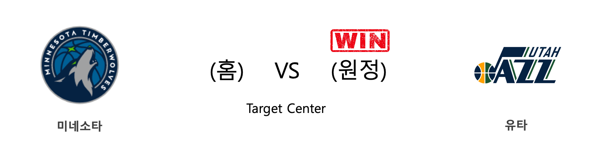
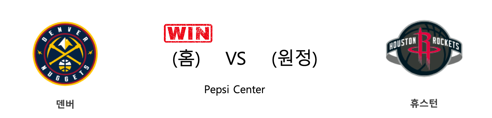
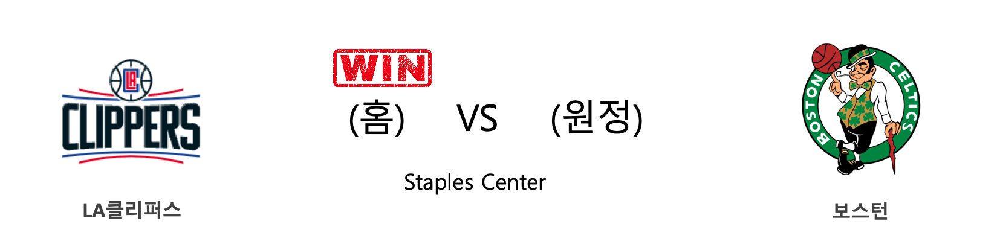
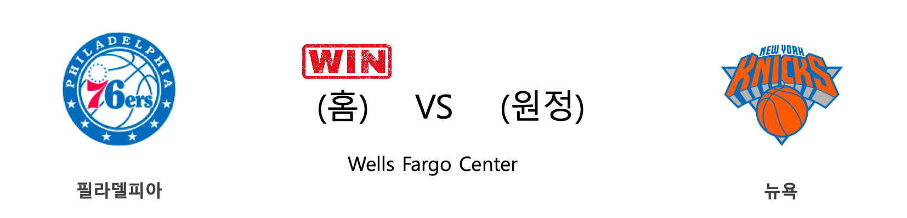
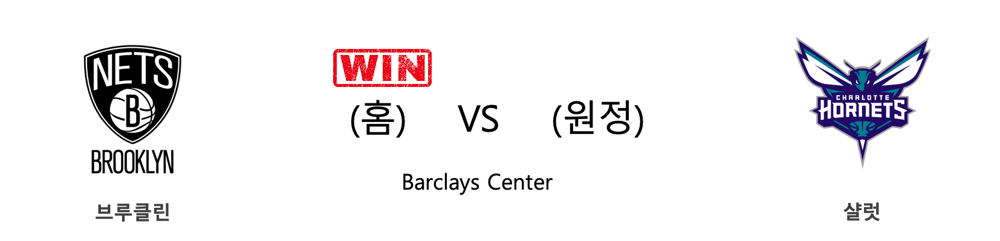
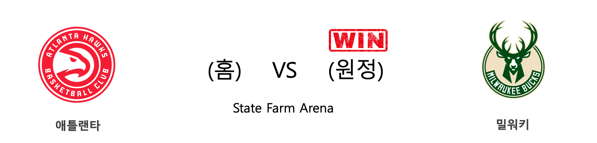
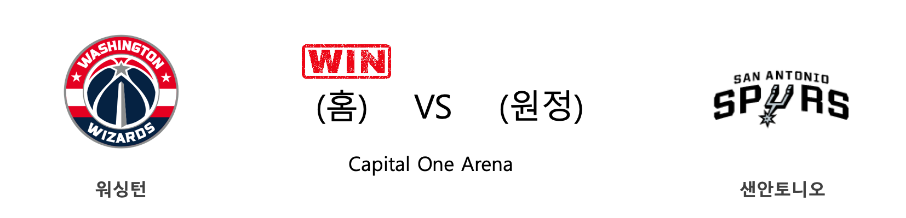

####  미네소타(홈) VS 유타(원정) 

<table class="tg">
  <tr>
    <th class="tg-rr9t">MIN</th>
    <th class="tg-rr9t">팀</th>
    <th class="tg-rr9t">UTA</th>
  </tr>
  <tr>
    <td class="tg-dcpn">1승 1패</td>
    <td class="tg-rr9t">시즌 상대전적</td>
    <td class="tg-dcpn">1승 1패</td>
  </tr>
  <tr>
    <td class="tg-dcpn">95</td>
    <td class="tg-rr9t">점수</td>
    <td class="tg-dcpn">103</td>
  </tr>
  <tr>
    <td class="tg-dcpn">21/44(48%)</td>
    <td class="tg-rr9t">2점(%)</td>
    <td class="tg-dcpn">21/53(40%)</td>
  </tr>
  <tr>
    <td class="tg-dcpn">14/45(31%)</td>
    <td class="tg-rr9t">3점(%)</td>
    <td class="tg-dcpn">14/33(42%)</td>
  </tr>
  <tr>
    <td class="tg-dcpn">11/21(52%)</td>
    <td class="tg-rr9t">자유투(%)</td>
    <td class="tg-dcpn">19/27(70%)</td>
  </tr>
  <tr>
    <td class="tg-dcpn">51</td>
    <td class="tg-rr9t">리바운드</td>
    <td class="tg-dcpn">51</td>
  </tr>
  <tr>
    <td class="tg-dcpn">13</td>
    <td class="tg-rr9t">어시스트</td>
    <td class="tg-dcpn">22</td>
  </tr>
  <tr>
    <td class="tg-dcpn">5</td>
    <td class="tg-rr9t">스틸</td>
    <td class="tg-dcpn">7</td>
  </tr>
  <tr>
    <td class="tg-dcpn">9</td>
    <td class="tg-rr9t">블록</td>
    <td class="tg-dcpn">6</td>
  </tr>
  <tr>
    <td class="tg-dcpn">13</td>
    <td class="tg-rr9t">턴오버</td>
    <td class="tg-dcpn">11</td>
  </tr>
  <tr>
    <td class="tg-dcpn">AndrewWiggins(22)</td>
    <td class="tg-rr9t">주요 득점선수</td>
    <td class="tg-dcpn">BojanBogdanov(30) MikeConleyG(16) DonovanMitche(26)</td>
  </tr>
</table>

#### 경기 관련 주요 기사         

[[오늘의 NBA] (11/4) 마이애미의 대권 도전 행보](http://sports.news.naver.com/basketball/news/read.nhn?oid=486&aid=0000001127)

[[오늘의 NBA] (11/9) 위긴스 vs 러셀, 타깃 센터의 명승부](http://sports.news.naver.com/basketball/news/read.nhn?oid=486&aid=0000001132)

[[오늘의 NBA] (11/21) 클리퍼스, 안티 볼 핸들러 세계관을 구축하다](http://sports.news.naver.com/basketball/news/read.nhn?oid=486&aid=0000001144)

[[오늘의 NBA] (11/16) 멤피스, Grit&Grind 시대와의 성공적인 단절](http://sports.news.naver.com/basketball/news/read.nhn?oid=486&aid=0000001139)

[[NBA] 시즌개막특집 ⑤ 2019-2020시즌, 점프볼이 추천하는 이적생들](http://sports.news.naver.com/basketball/news/read.nhn?oid=065&aid=0000190747)

        
        

####  덴버(홈) VS 휴스턴(원정) 

<table class="tg">
  <tr>
    <th class="tg-rr9t">DEN</th>
    <th class="tg-rr9t">팀</th>
    <th class="tg-rr9t">HOU</th>
  </tr>
  <tr>
    <td class="tg-dcpn">1승 0패</td>
    <td class="tg-rr9t">시즌 상대전적</td>
    <td class="tg-dcpn">0승 1패</td>
  </tr>
  <tr>
    <td class="tg-dcpn">105</td>
    <td class="tg-rr9t">점수</td>
    <td class="tg-dcpn">95</td>
  </tr>
  <tr>
    <td class="tg-dcpn">35/67(52%)</td>
    <td class="tg-rr9t">2점(%)</td>
    <td class="tg-dcpn">20/38(53%)</td>
  </tr>
  <tr>
    <td class="tg-dcpn">9/27(33%)</td>
    <td class="tg-rr9t">3점(%)</td>
    <td class="tg-dcpn">12/38(32%)</td>
  </tr>
  <tr>
    <td class="tg-dcpn">8/15(53%)</td>
    <td class="tg-rr9t">자유투(%)</td>
    <td class="tg-dcpn">19/25(76%)</td>
  </tr>
  <tr>
    <td class="tg-dcpn">48</td>
    <td class="tg-rr9t">리바운드</td>
    <td class="tg-dcpn">43</td>
  </tr>
  <tr>
    <td class="tg-dcpn">29</td>
    <td class="tg-rr9t">어시스트</td>
    <td class="tg-dcpn">19</td>
  </tr>
  <tr>
    <td class="tg-dcpn">13</td>
    <td class="tg-rr9t">스틸</td>
    <td class="tg-dcpn">9</td>
  </tr>
  <tr>
    <td class="tg-dcpn">4</td>
    <td class="tg-rr9t">블록</td>
    <td class="tg-dcpn">2</td>
  </tr>
  <tr>
    <td class="tg-dcpn">14</td>
    <td class="tg-rr9t">턴오버</td>
    <td class="tg-dcpn">20</td>
  </tr>
  <tr>
    <td class="tg-dcpn">WillBartonF(15) NikolaJokicC(27)</td>
    <td class="tg-rr9t">주요 득점선수</td>
    <td class="tg-dcpn">JamesHardenG(27) RussellWestbr(25)</td>
  </tr>
</table>

#### 경기 관련 주요 기사         

[[오늘의 NBA] (11/11) 토론토, 디펜딩 챔피언의 저력](http://sports.news.naver.com/basketball/news/read.nhn?oid=486&aid=0000001134)

[[오늘의 NBA] (11/16) 멤피스, Grit&Grind 시대와의 성공적인 단절](http://sports.news.naver.com/basketball/news/read.nhn?oid=486&aid=0000001139)

[[오늘의 NBA] (11/9) 위긴스 vs 러셀, 타깃 센터의 명승부](http://sports.news.naver.com/basketball/news/read.nhn?oid=486&aid=0000001132)

[[오늘의 NBA] (11/12) 샌안토니오와 토니 파커의 마지막 동반 여행](http://sports.news.naver.com/basketball/news/read.nhn?oid=486&aid=0000001135)

[[오늘의 NBA] (11/21) 클리퍼스, 안티 볼 핸들러 세계관을 구축하다](http://sports.news.naver.com/basketball/news/read.nhn?oid=486&aid=0000001144)

        
        

####  시카고(홈) VS 디트로이트(원정) 

<table class="tg">
  <tr>
    <th class="tg-rr9t">CHI</th>
    <th class="tg-rr9t">팀</th>
    <th class="tg-rr9t">DET</th>
  </tr>
  <tr>
    <td class="tg-dcpn">2승 0패</td>
    <td class="tg-rr9t">시즌 상대전적</td>
    <td class="tg-dcpn">0승 2패</td>
  </tr>
  <tr>
    <td class="tg-dcpn">109</td>
    <td class="tg-rr9t">점수</td>
    <td class="tg-dcpn">89</td>
  </tr>
  <tr>
    <td class="tg-dcpn">25/64(39%)</td>
    <td class="tg-rr9t">2점(%)</td>
    <td class="tg-dcpn">20/50(40%)</td>
  </tr>
  <tr>
    <td class="tg-dcpn">14/27(52%)</td>
    <td class="tg-rr9t">3점(%)</td>
    <td class="tg-dcpn">8/33(24%)</td>
  </tr>
  <tr>
    <td class="tg-dcpn">17/26(65%)</td>
    <td class="tg-rr9t">자유투(%)</td>
    <td class="tg-dcpn">25/32(78%)</td>
  </tr>
  <tr>
    <td class="tg-dcpn">55</td>
    <td class="tg-rr9t">리바운드</td>
    <td class="tg-dcpn">46</td>
  </tr>
  <tr>
    <td class="tg-dcpn">25</td>
    <td class="tg-rr9t">어시스트</td>
    <td class="tg-dcpn">23</td>
  </tr>
  <tr>
    <td class="tg-dcpn">9</td>
    <td class="tg-rr9t">스틸</td>
    <td class="tg-dcpn">6</td>
  </tr>
  <tr>
    <td class="tg-dcpn">7</td>
    <td class="tg-rr9t">블록</td>
    <td class="tg-dcpn">8</td>
  </tr>
  <tr>
    <td class="tg-dcpn">14</td>
    <td class="tg-rr9t">턴오버</td>
    <td class="tg-dcpn">16</td>
  </tr>
  <tr>
    <td class="tg-dcpn">TomasSatorans(15) LauriMarkkane(24) ShaquilleHarr(15)</td>
    <td class="tg-rr9t">주요 득점선수</td>
    <td class="tg-dcpn">BlakeGriffinF(16) DerrickRose(18)</td>
  </tr>
</table>

#### 경기 관련 주요 기사         

[[오늘의 NBA] (11/2) 르브론 제임스의 왕권신수설](http://sports.news.naver.com/basketball/news/read.nhn?oid=486&aid=0000001125)

[[오늘의 NBA] (11/7) 야니스 아테토쿤보의 MVP 수성 의지](http://sports.news.naver.com/basketball/news/read.nhn?oid=486&aid=0000001130)

[[오늘의 NBA] (11/19) 댈러스의 루카 복음 낭송](http://sports.news.naver.com/basketball/news/read.nhn?oid=486&aid=0000001142)

[[오늘의 NBA] (11/21) 클리퍼스, 안티 볼 핸들러 세계관을 구축하다](http://sports.news.naver.com/basketball/news/read.nhn?oid=486&aid=0000001144)

[[오늘의 NBA] (11/13) LAL 카일 쿠즈마의 대반격](http://sports.news.naver.com/basketball/news/read.nhn?oid=486&aid=0000001136)

        
        

####  LA클리퍼스(홈) VS 보스턴(원정) 

<table class="tg">
  <tr>
    <th class="tg-rr9t">LAC</th>
    <th class="tg-rr9t">팀</th>
    <th class="tg-rr9t">BOS</th>
  </tr>
  <tr>
    <td class="tg-dcpn">1승 0패</td>
    <td class="tg-rr9t">시즌 상대전적</td>
    <td class="tg-dcpn">0승 1패</td>
  </tr>
  <tr>
    <td class="tg-dcpn">107</td>
    <td class="tg-rr9t">점수</td>
    <td class="tg-dcpn">104</td>
  </tr>
  <tr>
    <td class="tg-dcpn">22/48(46%)</td>
    <td class="tg-rr9t">2점(%)</td>
    <td class="tg-dcpn">29/59(49%)</td>
  </tr>
  <tr>
    <td class="tg-dcpn">17/45(38%)</td>
    <td class="tg-rr9t">3점(%)</td>
    <td class="tg-dcpn">12/45(27%)</td>
  </tr>
  <tr>
    <td class="tg-dcpn">12/16(75%)</td>
    <td class="tg-rr9t">자유투(%)</td>
    <td class="tg-dcpn">10/14(71%)</td>
  </tr>
  <tr>
    <td class="tg-dcpn">53</td>
    <td class="tg-rr9t">리바운드</td>
    <td class="tg-dcpn">53</td>
  </tr>
  <tr>
    <td class="tg-dcpn">26</td>
    <td class="tg-rr9t">어시스트</td>
    <td class="tg-dcpn">26</td>
  </tr>
  <tr>
    <td class="tg-dcpn">12</td>
    <td class="tg-rr9t">스틸</td>
    <td class="tg-dcpn">11</td>
  </tr>
  <tr>
    <td class="tg-dcpn">9</td>
    <td class="tg-rr9t">블록</td>
    <td class="tg-dcpn">2</td>
  </tr>
  <tr>
    <td class="tg-dcpn">23</td>
    <td class="tg-rr9t">턴오버</td>
    <td class="tg-dcpn">17</td>
  </tr>
  <tr>
    <td class="tg-dcpn">KawhiLeonardF(17) LouWilliams(27) PaulGeorgeG(25)</td>
    <td class="tg-rr9t">주요 득점선수</td>
    <td class="tg-dcpn">JaysonTatumF(30) MarcusSmartG(15)</td>
  </tr>
</table>

#### 경기 관련 주요 기사         

[[오늘의 NBA] (11/14) 제임스 하든, 농구의 미래를 제시하다](http://sports.news.naver.com/basketball/news/read.nhn?oid=486&aid=0000001137)

[[오늘의 NBA] (11/12) 샌안토니오와 토니 파커의 마지막 동반 여행](http://sports.news.naver.com/basketball/news/read.nhn?oid=486&aid=0000001135)

[[오늘의 NBA] (11/21) 클리퍼스, 안티 볼 핸들러 세계관을 구축하다](http://sports.news.naver.com/basketball/news/read.nhn?oid=486&aid=0000001144)

[[오늘의 NBA] (11/19) 댈러스의 루카 복음 낭송](http://sports.news.naver.com/basketball/news/read.nhn?oid=486&aid=0000001142)

[[오늘의 NBA] (11/16) 멤피스, Grit&Grind 시대와의 성공적인 단절](http://sports.news.naver.com/basketball/news/read.nhn?oid=486&aid=0000001139)

        
        

####  필라델피아(홈) VS 뉴욕(원정) 

<table class="tg">
  <tr>
    <th class="tg-rr9t">PHI</th>
    <th class="tg-rr9t">팀</th>
    <th class="tg-rr9t">NYK</th>
  </tr>
  <tr>
    <td class="tg-dcpn">1승 0패</td>
    <td class="tg-rr9t">시즌 상대전적</td>
    <td class="tg-dcpn">0승 1패</td>
  </tr>
  <tr>
    <td class="tg-dcpn">109</td>
    <td class="tg-rr9t">점수</td>
    <td class="tg-dcpn">104</td>
  </tr>
  <tr>
    <td class="tg-dcpn">26/57(46%)</td>
    <td class="tg-rr9t">2점(%)</td>
    <td class="tg-dcpn">27/59(46%)</td>
  </tr>
  <tr>
    <td class="tg-dcpn">13/32(41%)</td>
    <td class="tg-rr9t">3점(%)</td>
    <td class="tg-dcpn">13/25(52%)</td>
  </tr>
  <tr>
    <td class="tg-dcpn">18/26(69%)</td>
    <td class="tg-rr9t">자유투(%)</td>
    <td class="tg-dcpn">11/15(73%)</td>
  </tr>
  <tr>
    <td class="tg-dcpn">44</td>
    <td class="tg-rr9t">리바운드</td>
    <td class="tg-dcpn">42</td>
  </tr>
  <tr>
    <td class="tg-dcpn">30</td>
    <td class="tg-rr9t">어시스트</td>
    <td class="tg-dcpn">17</td>
  </tr>
  <tr>
    <td class="tg-dcpn">5</td>
    <td class="tg-rr9t">스틸</td>
    <td class="tg-dcpn">8</td>
  </tr>
  <tr>
    <td class="tg-dcpn">6</td>
    <td class="tg-rr9t">블록</td>
    <td class="tg-dcpn">6</td>
  </tr>
  <tr>
    <td class="tg-dcpn">10</td>
    <td class="tg-rr9t">턴오버</td>
    <td class="tg-dcpn">14</td>
  </tr>
  <tr>
    <td class="tg-dcpn">BenSimmonsG(18) JoelEmbiidC(23)</td>
    <td class="tg-rr9t">주요 득점선수</td>
    <td class="tg-dcpn">JuliusRandleF(17) MarcusMorrisS(22) FrankNtilikin(17)</td>
  </tr>
</table>

#### 경기 관련 주요 기사         

[[오늘의 NBA] (11/21) 클리퍼스, 안티 볼 핸들러 세계관을 구축하다](http://sports.news.naver.com/basketball/news/read.nhn?oid=486&aid=0000001144)

[[오늘의 NBA] (11/14) 제임스 하든, 농구의 미래를 제시하다](http://sports.news.naver.com/basketball/news/read.nhn?oid=486&aid=0000001137)

[[오늘의 NBA] (11/16) 멤피스, Grit&Grind 시대와의 성공적인 단절](http://sports.news.naver.com/basketball/news/read.nhn?oid=486&aid=0000001139)

[[오늘의 NBA] (11/17) 샬럿, 설계된 플레이 연출의 달인](http://sports.news.naver.com/basketball/news/read.nhn?oid=486&aid=0000001140)

[[오늘의 NBA] (11/19) 댈러스의 루카 복음 낭송](http://sports.news.naver.com/basketball/news/read.nhn?oid=486&aid=0000001142)

        
        

####  마이애미(홈) VS 클리블랜드(원정) 

<table class="tg">
  <tr>
    <th class="tg-rr9t">MIA</th>
    <th class="tg-rr9t">팀</th>
    <th class="tg-rr9t">CLE</th>
  </tr>
  <tr>
    <td class="tg-dcpn">2승 0패</td>
    <td class="tg-rr9t">시즌 상대전적</td>
    <td class="tg-dcpn">0승 2패</td>
  </tr>
  <tr>
    <td class="tg-dcpn">124</td>
    <td class="tg-rr9t">점수</td>
    <td class="tg-dcpn">100</td>
  </tr>
  <tr>
    <td class="tg-dcpn">22/41(54%)</td>
    <td class="tg-rr9t">2점(%)</td>
    <td class="tg-dcpn">25/49(51%)</td>
  </tr>
  <tr>
    <td class="tg-dcpn">19/37(51%)</td>
    <td class="tg-rr9t">3점(%)</td>
    <td class="tg-dcpn">12/38(32%)</td>
  </tr>
  <tr>
    <td class="tg-dcpn">23/31(74%)</td>
    <td class="tg-rr9t">자유투(%)</td>
    <td class="tg-dcpn">14/16(88%)</td>
  </tr>
  <tr>
    <td class="tg-dcpn">44</td>
    <td class="tg-rr9t">리바운드</td>
    <td class="tg-dcpn">34</td>
  </tr>
  <tr>
    <td class="tg-dcpn">25</td>
    <td class="tg-rr9t">어시스트</td>
    <td class="tg-dcpn">19</td>
  </tr>
  <tr>
    <td class="tg-dcpn">8</td>
    <td class="tg-rr9t">스틸</td>
    <td class="tg-dcpn">13</td>
  </tr>
  <tr>
    <td class="tg-dcpn">5</td>
    <td class="tg-rr9t">블록</td>
    <td class="tg-dcpn">2</td>
  </tr>
  <tr>
    <td class="tg-dcpn">23</td>
    <td class="tg-rr9t">턴오버</td>
    <td class="tg-dcpn">19</td>
  </tr>
  <tr>
    <td class="tg-dcpn">JimmyButlerF(21) TylerHerro(22) DuncanRobinso(29)</td>
    <td class="tg-rr9t">주요 득점선수</td>
    <td class="tg-dcpn">LarryNanceJr.(16) KevinLoveF(25) CollinSextonG(19)</td>
  </tr>
</table>

#### 경기 관련 주요 기사         

[[오늘의 NBA] (11/15) NOP 즈루 홀리데이, 뒤처리는 내가 맡는다!](http://sports.news.naver.com/basketball/news/read.nhn?oid=486&aid=0000001138)

[[오늘의 NBA] (11/13) LAL 카일 쿠즈마의 대반격](http://sports.news.naver.com/basketball/news/read.nhn?oid=486&aid=0000001136)

[[오늘의 NBA] (11/17) 샬럿, 설계된 플레이 연출의 달인](http://sports.news.naver.com/basketball/news/read.nhn?oid=486&aid=0000001140)

[[오늘의 NBA] (11/21) 클리퍼스, 안티 볼 핸들러 세계관을 구축하다](http://sports.news.naver.com/basketball/news/read.nhn?oid=486&aid=0000001144)

        
        

####  토론토(홈) VS 올랜도(원정) 

<table class="tg">
  <tr>
    <th class="tg-rr9t">TOR</th>
    <th class="tg-rr9t">팀</th>
    <th class="tg-rr9t">ORL</th>
  </tr>
  <tr>
    <td class="tg-dcpn">2승 0패</td>
    <td class="tg-rr9t">시즌 상대전적</td>
    <td class="tg-dcpn">0승 2패</td>
  </tr>
  <tr>
    <td class="tg-dcpn">113</td>
    <td class="tg-rr9t">점수</td>
    <td class="tg-dcpn">97</td>
  </tr>
  <tr>
    <td class="tg-dcpn">36/59(61%)</td>
    <td class="tg-rr9t">2점(%)</td>
    <td class="tg-dcpn">26/59(44%)</td>
  </tr>
  <tr>
    <td class="tg-dcpn">9/27(33%)</td>
    <td class="tg-rr9t">3점(%)</td>
    <td class="tg-dcpn">9/32(28%)</td>
  </tr>
  <tr>
    <td class="tg-dcpn">14/19(74%)</td>
    <td class="tg-rr9t">자유투(%)</td>
    <td class="tg-dcpn">18/28(64%)</td>
  </tr>
  <tr>
    <td class="tg-dcpn">47</td>
    <td class="tg-rr9t">리바운드</td>
    <td class="tg-dcpn">43</td>
  </tr>
  <tr>
    <td class="tg-dcpn">26</td>
    <td class="tg-rr9t">어시스트</td>
    <td class="tg-dcpn">26</td>
  </tr>
  <tr>
    <td class="tg-dcpn">5</td>
    <td class="tg-rr9t">스틸</td>
    <td class="tg-dcpn">9</td>
  </tr>
  <tr>
    <td class="tg-dcpn">5</td>
    <td class="tg-rr9t">블록</td>
    <td class="tg-dcpn">7</td>
  </tr>
  <tr>
    <td class="tg-dcpn">11</td>
    <td class="tg-rr9t">턴오버</td>
    <td class="tg-dcpn">11</td>
  </tr>
  <tr>
    <td class="tg-dcpn">PascalSiakamF(18) TerenceDavis(19) FredVanVleetG(24) NormanPowellG(15)</td>
    <td class="tg-rr9t">주요 득점선수</td>
    <td class="tg-dcpn">JonathanIsaac(16) EvanFournierG(21)</td>
  </tr>
</table>

#### 경기 관련 주요 기사         

[[오늘의 NBA] (11/17) 샬럿, 설계된 플레이 연출의 달인](http://sports.news.naver.com/basketball/news/read.nhn?oid=486&aid=0000001140)

[[오늘의 NBA] (11/18) 새크라멘토, 리그 선두 보스턴을 제압하다](http://sports.news.naver.com/basketball/news/read.nhn?oid=486&aid=0000001141)

[[오늘의 NBA] (11/9) 위긴스 vs 러셀, 타깃 센터의 명승부](http://sports.news.naver.com/basketball/news/read.nhn?oid=486&aid=0000001132)

[[오늘의 NBA] (11/11) 토론토, 디펜딩 챔피언의 저력](http://sports.news.naver.com/basketball/news/read.nhn?oid=486&aid=0000001134)

[[오늘의 NBA] (11/21) 클리퍼스, 안티 볼 핸들러 세계관을 구축하다](http://sports.news.naver.com/basketball/news/read.nhn?oid=486&aid=0000001144)

        
        

####  브루클린(홈) VS 샬럿(원정) 

<table class="tg">
  <tr>
    <th class="tg-rr9t">BKN</th>
    <th class="tg-rr9t">팀</th>
    <th class="tg-rr9t">CHA</th>
  </tr>
  <tr>
    <td class="tg-dcpn">1승 0패</td>
    <td class="tg-rr9t">시즌 상대전적</td>
    <td class="tg-dcpn">0승 1패</td>
  </tr>
  <tr>
    <td class="tg-dcpn">101</td>
    <td class="tg-rr9t">점수</td>
    <td class="tg-dcpn">91</td>
  </tr>
  <tr>
    <td class="tg-dcpn">26/51(51%)</td>
    <td class="tg-rr9t">2점(%)</td>
    <td class="tg-dcpn">19/48(40%)</td>
  </tr>
  <tr>
    <td class="tg-dcpn">10/39(26%)</td>
    <td class="tg-rr9t">3점(%)</td>
    <td class="tg-dcpn">11/33(33%)</td>
  </tr>
  <tr>
    <td class="tg-dcpn">19/23(83%)</td>
    <td class="tg-rr9t">자유투(%)</td>
    <td class="tg-dcpn">20/26(77%)</td>
  </tr>
  <tr>
    <td class="tg-dcpn">53</td>
    <td class="tg-rr9t">리바운드</td>
    <td class="tg-dcpn">41</td>
  </tr>
  <tr>
    <td class="tg-dcpn">19</td>
    <td class="tg-rr9t">어시스트</td>
    <td class="tg-dcpn">17</td>
  </tr>
  <tr>
    <td class="tg-dcpn">11</td>
    <td class="tg-rr9t">스틸</td>
    <td class="tg-dcpn">8</td>
  </tr>
  <tr>
    <td class="tg-dcpn">1</td>
    <td class="tg-rr9t">블록</td>
    <td class="tg-dcpn">3</td>
  </tr>
  <tr>
    <td class="tg-dcpn">15</td>
    <td class="tg-rr9t">턴오버</td>
    <td class="tg-dcpn">16</td>
  </tr>
  <tr>
    <td class="tg-dcpn">SpencerDinwid(20) TaureanPrince(20) JarrettAllenC(22)</td>
    <td class="tg-rr9t">주요 득점선수</td>
    <td class="tg-dcpn">TerryRozierG(18) Devonte'Graha(17)</td>
  </tr>
</table>

#### 경기 관련 주요 기사         

[[NBA] 시즌개막특집 ⑤ 2019-2020시즌, 점프볼이 추천하는 이적생들](http://sports.news.naver.com/basketball/news/read.nhn?oid=065&aid=0000190747)

[[오늘의 NBA] (11/17) 샬럿, 설계된 플레이 연출의 달인](http://sports.news.naver.com/basketball/news/read.nhn?oid=486&aid=0000001140)

[[오늘의 NBA] (11/21) 클리퍼스, 안티 볼 핸들러 세계관을 구축하다](http://sports.news.naver.com/basketball/news/read.nhn?oid=486&aid=0000001144)

[[오늘의 NBA] (11/19) 댈러스의 루카 복음 낭송](http://sports.news.naver.com/basketball/news/read.nhn?oid=486&aid=0000001142)

[[오늘의 NBA] (11/11) 토론토, 디펜딩 챔피언의 저력](http://sports.news.naver.com/basketball/news/read.nhn?oid=486&aid=0000001134)

        
        

####  댈러스(홈) VS 골든스테이트(원정) 

<table class="tg">
  <tr>
    <th class="tg-rr9t">DAL</th>
    <th class="tg-rr9t">팀</th>
    <th class="tg-rr9t">GSW</th>
  </tr>
  <tr>
    <td class="tg-dcpn">1승 0패</td>
    <td class="tg-rr9t">시즌 상대전적</td>
    <td class="tg-dcpn">0승 1패</td>
  </tr>
  <tr>
    <td class="tg-dcpn">142</td>
    <td class="tg-rr9t">점수</td>
    <td class="tg-dcpn">94</td>
  </tr>
  <tr>
    <td class="tg-dcpn">29/51(57%)</td>
    <td class="tg-rr9t">2점(%)</td>
    <td class="tg-dcpn">27/63(43%)</td>
  </tr>
  <tr>
    <td class="tg-dcpn">22/38(58%)</td>
    <td class="tg-rr9t">3점(%)</td>
    <td class="tg-dcpn">8/27(30%)</td>
  </tr>
  <tr>
    <td class="tg-dcpn">18/23(78%)</td>
    <td class="tg-rr9t">자유투(%)</td>
    <td class="tg-dcpn">16/25(64%)</td>
  </tr>
  <tr>
    <td class="tg-dcpn">50</td>
    <td class="tg-rr9t">리바운드</td>
    <td class="tg-dcpn">33</td>
  </tr>
  <tr>
    <td class="tg-dcpn">33</td>
    <td class="tg-rr9t">어시스트</td>
    <td class="tg-dcpn">18</td>
  </tr>
  <tr>
    <td class="tg-dcpn">7</td>
    <td class="tg-rr9t">스틸</td>
    <td class="tg-dcpn">8</td>
  </tr>
  <tr>
    <td class="tg-dcpn">7</td>
    <td class="tg-rr9t">블록</td>
    <td class="tg-dcpn">4</td>
  </tr>
  <tr>
    <td class="tg-dcpn">12</td>
    <td class="tg-rr9t">턴오버</td>
    <td class="tg-dcpn">9</td>
  </tr>
  <tr>
    <td class="tg-dcpn">JalenBrunson(15) TimHardawayJr(20) LukaDoncicG(35)</td>
    <td class="tg-rr9t">주요 득점선수</td>
    <td class="tg-dcpn">EricPaschallF(22) KyBowmanG(16)</td>
  </tr>
</table>

#### 경기 관련 주요 기사         

[[오늘의 NBA] (11/21) 클리퍼스, 안티 볼 핸들러 세계관을 구축하다](http://sports.news.naver.com/basketball/news/read.nhn?oid=486&aid=0000001144)

[[오늘의 NBA] 시즌 프리뷰 : 포틀랜드, 근성과 낭만의 조화](http://sports.news.naver.com/basketball/news/read.nhn?oid=486&aid=0000001110)

[[오늘의 NBA] (11/9) 위긴스 vs 러셀, 타깃 센터의 명승부](http://sports.news.naver.com/basketball/news/read.nhn?oid=486&aid=0000001132)

[[오늘의 NBA] (11/16) 멤피스, Grit&Grind 시대와의 성공적인 단절](http://sports.news.naver.com/basketball/news/read.nhn?oid=486&aid=0000001139)

[[오늘의 NBA] (11/7) 야니스 아테토쿤보의 MVP 수성 의지](http://sports.news.naver.com/basketball/news/read.nhn?oid=486&aid=0000001130)

        
        

####  애틀랜타(홈) VS 밀워키(원정) 

<table class="tg">
  <tr>
    <th class="tg-rr9t">ATL</th>
    <th class="tg-rr9t">팀</th>
    <th class="tg-rr9t">MIL</th>
  </tr>
  <tr>
    <td class="tg-dcpn">0승 1패</td>
    <td class="tg-rr9t">시즌 상대전적</td>
    <td class="tg-dcpn">1승 0패</td>
  </tr>
  <tr>
    <td class="tg-dcpn">127</td>
    <td class="tg-rr9t">점수</td>
    <td class="tg-dcpn">135</td>
  </tr>
  <tr>
    <td class="tg-dcpn">30/65(46%)</td>
    <td class="tg-rr9t">2점(%)</td>
    <td class="tg-dcpn">29/44(66%)</td>
  </tr>
  <tr>
    <td class="tg-dcpn">14/31(45%)</td>
    <td class="tg-rr9t">3점(%)</td>
    <td class="tg-dcpn">17/43(40%)</td>
  </tr>
  <tr>
    <td class="tg-dcpn">25/31(81%)</td>
    <td class="tg-rr9t">자유투(%)</td>
    <td class="tg-dcpn">26/34(76%)</td>
  </tr>
  <tr>
    <td class="tg-dcpn">43</td>
    <td class="tg-rr9t">리바운드</td>
    <td class="tg-dcpn">46</td>
  </tr>
  <tr>
    <td class="tg-dcpn">27</td>
    <td class="tg-rr9t">어시스트</td>
    <td class="tg-dcpn">25</td>
  </tr>
  <tr>
    <td class="tg-dcpn">8</td>
    <td class="tg-rr9t">스틸</td>
    <td class="tg-dcpn">6</td>
  </tr>
  <tr>
    <td class="tg-dcpn">2</td>
    <td class="tg-rr9t">블록</td>
    <td class="tg-dcpn">8</td>
  </tr>
  <tr>
    <td class="tg-dcpn">13</td>
    <td class="tg-rr9t">턴오버</td>
    <td class="tg-dcpn">19</td>
  </tr>
  <tr>
    <td class="tg-dcpn">TraeYoungG(25) De'AndreHunte(27) CamReddishG(17)</td>
    <td class="tg-rr9t">주요 득점선수</td>
    <td class="tg-dcpn">EricBledsoeG(28) GiannisAnteto(33)</td>
  </tr>
</table>

#### 경기 관련 주요 기사         

[[오늘의 NBA] (11/9) 위긴스 vs 러셀, 타깃 센터의 명승부](http://sports.news.naver.com/basketball/news/read.nhn?oid=486&aid=0000001132)

[[오늘의 NBA] (11/11) 토론토, 디펜딩 챔피언의 저력](http://sports.news.naver.com/basketball/news/read.nhn?oid=486&aid=0000001134)

[[오늘의 NBA] (11/19) 댈러스의 루카 복음 낭송](http://sports.news.naver.com/basketball/news/read.nhn?oid=486&aid=0000001142)

[[포스트시즌 투데이] '뷸러 1선발 통했다' 다저스, NLDS 기선제압](http://www.mbcsportsplus.com/news/?mode=view&cate=2&b_idx=99829447.000)

[[오늘의 NBA] (11/17) 샬럿, 설계된 플레이 연출의 달인](http://sports.news.naver.com/basketball/news/read.nhn?oid=486&aid=0000001140)

        
        

####  워싱턴(홈) VS 샌안토니오(원정) 

<table class="tg">
  <tr>
    <th class="tg-rr9t">WAS</th>
    <th class="tg-rr9t">팀</th>
    <th class="tg-rr9t">SAS</th>
  </tr>
  <tr>
    <td class="tg-dcpn">1승 1패</td>
    <td class="tg-rr9t">시즌 상대전적</td>
    <td class="tg-dcpn">1승 1패</td>
  </tr>
  <tr>
    <td class="tg-dcpn">138</td>
    <td class="tg-rr9t">점수</td>
    <td class="tg-dcpn">132</td>
  </tr>
  <tr>
    <td class="tg-dcpn">36/62(58%)</td>
    <td class="tg-rr9t">2점(%)</td>
    <td class="tg-dcpn">37/61(61%)</td>
  </tr>
  <tr>
    <td class="tg-dcpn">18/30(60%)</td>
    <td class="tg-rr9t">3점(%)</td>
    <td class="tg-dcpn">12/32(38%)</td>
  </tr>
  <tr>
    <td class="tg-dcpn">12/15(80%)</td>
    <td class="tg-rr9t">자유투(%)</td>
    <td class="tg-dcpn">22/29(76%)</td>
  </tr>
  <tr>
    <td class="tg-dcpn">38</td>
    <td class="tg-rr9t">리바운드</td>
    <td class="tg-dcpn">41</td>
  </tr>
  <tr>
    <td class="tg-dcpn">37</td>
    <td class="tg-rr9t">어시스트</td>
    <td class="tg-dcpn">32</td>
  </tr>
  <tr>
    <td class="tg-dcpn">4</td>
    <td class="tg-rr9t">스틸</td>
    <td class="tg-dcpn">8</td>
  </tr>
  <tr>
    <td class="tg-dcpn">3</td>
    <td class="tg-rr9t">블록</td>
    <td class="tg-dcpn">8</td>
  </tr>
  <tr>
    <td class="tg-dcpn">17</td>
    <td class="tg-rr9t">턴오버</td>
    <td class="tg-dcpn">12</td>
  </tr>
  <tr>
    <td class="tg-dcpn">RuiHachimuraF(15) IshSmith(21) DavisBertans(21) BradleyBealG(33)</td>
    <td class="tg-rr9t">주요 득점선수</td>
    <td class="tg-dcpn">PattyMillsG(16) DeMarDeRozanF(31) RudyGay(18) BrynForbesG(19) DejounteMurra(15)</td>
  </tr>
</table>

#### 경기 관련 주요 기사         

[[오늘의 NBA] (11/9) 위긴스 vs 러셀, 타깃 센터의 명승부](http://sports.news.naver.com/basketball/news/read.nhn?oid=486&aid=0000001132)

[[오늘의 NBA] (11/19) 댈러스의 루카 복음 낭송](http://sports.news.naver.com/basketball/news/read.nhn?oid=486&aid=0000001142)

[[오늘의 NBA] (11/17) 샬럿, 설계된 플레이 연출의 달인](http://sports.news.naver.com/basketball/news/read.nhn?oid=486&aid=0000001140)

[[오늘의 NBA] (11/21) 클리퍼스, 안티 볼 핸들러 세계관을 구축하다](http://sports.news.naver.com/basketball/news/read.nhn?oid=486&aid=0000001144)

[The Travel Industry’s New Fix for Jet Lag](https://www.nytimes.com/2019/11/21/travel/jet-lag.html?partner=naver)

        
        

#### 리그 (Eastern) 순위
    

<table class="tg">
  <tr>
    <th class="tg-d14o">순위</th>
    <th class="tg-d14o">팀명</th>
    <th class="tg-d14o">경기수</th>
    <th class="tg-d14o">승</th>
    <th class="tg-d14o">패</th>
    <th class="tg-d14o">승차</th>
    <th class="tg-d14o">승률</th>
  </tr>
  
<tr>
    <td class="tg-50j8">1</td>
    <td class="tg-50j8">BOS</td>
    <td class="tg-50j8">14</td>
    <td class="tg-50j8">11</td>
    <td class="tg-50j8">3</td>
    <td class="tg-50j8">1</td>
    <td class="tg-50j8">0.786</td>
</tr>

<tr>
    <td class="tg-50j8">1</td>
    <td class="tg-50j8">MIL</td>
    <td class="tg-50j8">14</td>
    <td class="tg-50j8">11</td>
    <td class="tg-50j8">3</td>
    <td class="tg-50j8">1</td>
    <td class="tg-50j8">0.786</td>
</tr>

<tr>
    <td class="tg-50j8">3</td>
    <td class="tg-50j8">MIA</td>
    <td class="tg-50j8">13</td>
    <td class="tg-50j8">10</td>
    <td class="tg-50j8">3</td>
    <td class="tg-50j8">2</td>
    <td class="tg-50j8">0.769</td>
</tr>

<tr>
    <td class="tg-50j8">4</td>
    <td class="tg-50j8">TOR</td>
    <td class="tg-50j8">14</td>
    <td class="tg-50j8">10</td>
    <td class="tg-50j8">4</td>
    <td class="tg-50j8">2</td>
    <td class="tg-50j8">0.714</td>
</tr>

<tr>
    <td class="tg-50j8">5</td>
    <td class="tg-50j8">PHI</td>
    <td class="tg-50j8">14</td>
    <td class="tg-50j8">9</td>
    <td class="tg-50j8">5</td>
    <td class="tg-50j8">3</td>
    <td class="tg-50j8">0.643</td>
</tr>

<tr>
    <td class="tg-50j8">6</td>
    <td class="tg-50j8">IND</td>
    <td class="tg-50j8">14</td>
    <td class="tg-50j8">8</td>
    <td class="tg-50j8">6</td>
    <td class="tg-50j8">4</td>
    <td class="tg-50j8">0.571</td>
</tr>

<tr>
    <td class="tg-50j8">7</td>
    <td class="tg-50j8">BKN</td>
    <td class="tg-50j8">14</td>
    <td class="tg-50j8">6</td>
    <td class="tg-50j8">8</td>
    <td class="tg-50j8">6</td>
    <td class="tg-50j8">0.429</td>
</tr>

<tr>
    <td class="tg-50j8">7</td>
    <td class="tg-50j8">ORL</td>
    <td class="tg-50j8">14</td>
    <td class="tg-50j8">6</td>
    <td class="tg-50j8">8</td>
    <td class="tg-50j8">6</td>
    <td class="tg-50j8">0.429</td>
</tr>

<tr>
    <td class="tg-50j8">9</td>
    <td class="tg-50j8">CHA</td>
    <td class="tg-50j8">15</td>
    <td class="tg-50j8">6</td>
    <td class="tg-50j8">9</td>
    <td class="tg-50j8">6</td>
    <td class="tg-50j8">0.4</td>
</tr>

<tr>
    <td class="tg-50j8">10</td>
    <td class="tg-50j8">CHI</td>
    <td class="tg-50j8">15</td>
    <td class="tg-50j8">5</td>
    <td class="tg-50j8">10</td>
    <td class="tg-50j8">7</td>
    <td class="tg-50j8">0.333</td>
</tr>

<tr>
    <td class="tg-50j8">11</td>
    <td class="tg-50j8">WAS</td>
    <td class="tg-50j8">12</td>
    <td class="tg-50j8">4</td>
    <td class="tg-50j8">8</td>
    <td class="tg-50j8">8</td>
    <td class="tg-50j8">0.333</td>
</tr>

<tr>
    <td class="tg-50j8">12</td>
    <td class="tg-50j8">ATL</td>
    <td class="tg-50j8">14</td>
    <td class="tg-50j8">4</td>
    <td class="tg-50j8">10</td>
    <td class="tg-50j8">8</td>
    <td class="tg-50j8">0.286</td>
</tr>

<tr>
    <td class="tg-50j8">12</td>
    <td class="tg-50j8">CLE</td>
    <td class="tg-50j8">14</td>
    <td class="tg-50j8">4</td>
    <td class="tg-50j8">10</td>
    <td class="tg-50j8">8</td>
    <td class="tg-50j8">0.286</td>
</tr>

<tr>
    <td class="tg-50j8">12</td>
    <td class="tg-50j8">DET</td>
    <td class="tg-50j8">14</td>
    <td class="tg-50j8">4</td>
    <td class="tg-50j8">10</td>
    <td class="tg-50j8">8</td>
    <td class="tg-50j8">0.286</td>
</tr>

<tr>
    <td class="tg-50j8">15</td>
    <td class="tg-50j8">NYK</td>
    <td class="tg-50j8">15</td>
    <td class="tg-50j8">4</td>
    <td class="tg-50j8">11</td>
    <td class="tg-50j8">8</td>
    <td class="tg-50j8">0.267</td>
</tr>
</table> 
#### 리그 (Western) 순위
    

<table class="tg">
  <tr>
    <th class="tg-d14o">순위</th>
    <th class="tg-d14o">팀명</th>
    <th class="tg-d14o">경기수</th>
    <th class="tg-d14o">승</th>
    <th class="tg-d14o">패</th>
    <th class="tg-d14o">승차</th>
    <th class="tg-d14o">승률</th>
  </tr>
  
<tr>
    <td class="tg-50j8">1</td>
    <td class="tg-50j8">LAL</td>
    <td class="tg-50j8">14</td>
    <td class="tg-50j8">12</td>
    <td class="tg-50j8">2</td>
    <td class="tg-50j8">0</td>
    <td class="tg-50j8">0.857</td>
</tr>

<tr>
    <td class="tg-50j8">2</td>
    <td class="tg-50j8">HOU</td>
    <td class="tg-50j8">15</td>
    <td class="tg-50j8">11</td>
    <td class="tg-50j8">4</td>
    <td class="tg-50j8">1</td>
    <td class="tg-50j8">0.733</td>
</tr>

<tr>
    <td class="tg-50j8">3</td>
    <td class="tg-50j8">DEN</td>
    <td class="tg-50j8">13</td>
    <td class="tg-50j8">10</td>
    <td class="tg-50j8">3</td>
    <td class="tg-50j8">2</td>
    <td class="tg-50j8">0.769</td>
</tr>

<tr>
    <td class="tg-50j8">4</td>
    <td class="tg-50j8">LAC</td>
    <td class="tg-50j8">15</td>
    <td class="tg-50j8">10</td>
    <td class="tg-50j8">5</td>
    <td class="tg-50j8">2</td>
    <td class="tg-50j8">0.667</td>
</tr>

<tr>
    <td class="tg-50j8">5</td>
    <td class="tg-50j8">DAL</td>
    <td class="tg-50j8">14</td>
    <td class="tg-50j8">9</td>
    <td class="tg-50j8">5</td>
    <td class="tg-50j8">3</td>
    <td class="tg-50j8">0.643</td>
</tr>

<tr>
    <td class="tg-50j8">5</td>
    <td class="tg-50j8">UTA</td>
    <td class="tg-50j8">14</td>
    <td class="tg-50j8">9</td>
    <td class="tg-50j8">5</td>
    <td class="tg-50j8">3</td>
    <td class="tg-50j8">0.643</td>
</tr>

<tr>
    <td class="tg-50j8">7</td>
    <td class="tg-50j8">MIN</td>
    <td class="tg-50j8">15</td>
    <td class="tg-50j8">8</td>
    <td class="tg-50j8">7</td>
    <td class="tg-50j8">4</td>
    <td class="tg-50j8">0.533</td>
</tr>

<tr>
    <td class="tg-50j8">8</td>
    <td class="tg-50j8">PHX</td>
    <td class="tg-50j8">13</td>
    <td class="tg-50j8">7</td>
    <td class="tg-50j8">6</td>
    <td class="tg-50j8">5</td>
    <td class="tg-50j8">0.538</td>
</tr>

<tr>
    <td class="tg-50j8">9</td>
    <td class="tg-50j8">SAC</td>
    <td class="tg-50j8">13</td>
    <td class="tg-50j8">6</td>
    <td class="tg-50j8">7</td>
    <td class="tg-50j8">6</td>
    <td class="tg-50j8">0.462</td>
</tr>

<tr>
    <td class="tg-50j8">10</td>
    <td class="tg-50j8">MEM</td>
    <td class="tg-50j8">14</td>
    <td class="tg-50j8">5</td>
    <td class="tg-50j8">9</td>
    <td class="tg-50j8">7</td>
    <td class="tg-50j8">0.357</td>
</tr>

<tr>
    <td class="tg-50j8">10</td>
    <td class="tg-50j8">NOP</td>
    <td class="tg-50j8">14</td>
    <td class="tg-50j8">5</td>
    <td class="tg-50j8">9</td>
    <td class="tg-50j8">7</td>
    <td class="tg-50j8">0.357</td>
</tr>

<tr>
    <td class="tg-50j8">10</td>
    <td class="tg-50j8">OKC</td>
    <td class="tg-50j8">14</td>
    <td class="tg-50j8">5</td>
    <td class="tg-50j8">9</td>
    <td class="tg-50j8">7</td>
    <td class="tg-50j8">0.357</td>
</tr>

<tr>
    <td class="tg-50j8">13</td>
    <td class="tg-50j8">POR</td>
    <td class="tg-50j8">15</td>
    <td class="tg-50j8">5</td>
    <td class="tg-50j8">10</td>
    <td class="tg-50j8">7</td>
    <td class="tg-50j8">0.333</td>
</tr>

<tr>
    <td class="tg-50j8">13</td>
    <td class="tg-50j8">SAS</td>
    <td class="tg-50j8">15</td>
    <td class="tg-50j8">5</td>
    <td class="tg-50j8">10</td>
    <td class="tg-50j8">7</td>
    <td class="tg-50j8">0.333</td>
</tr>

<tr>
    <td class="tg-50j8">15</td>
    <td class="tg-50j8">GSW</td>
    <td class="tg-50j8">16</td>
    <td class="tg-50j8">3</td>
    <td class="tg-50j8">13</td>
    <td class="tg-50j8">9</td>
    <td class="tg-50j8">0.188</td>
</tr>
</table> 

        
        
#nba #미국농구 #엔비에이 #농구분석 #토토 #스포츠토토 #경기예측 #농구결과 #20191121 #미네소타 #유타 #덴버 #휴스턴 #시카고 #디트로이트 #LA클리퍼스 #보스턴 #필라델피아 #뉴욕 #마이애미 #클리블랜드 #토론토 #올랜도 #브루클린 #샬럿 #댈러스 #골든스테이트 #애틀랜타 #밀워키 #워싱턴 #샌안토니오 #미네소타유타 #덴버휴스턴 #시카고디트로이트 #LA클리퍼스보스턴 #필라델피아뉴욕 #마이애미클리블랜드 #토론토올랜도 #브루클린샬럿 #댈러스골든스테이트 #애틀랜타밀워키 #워싱턴샌안토니오 