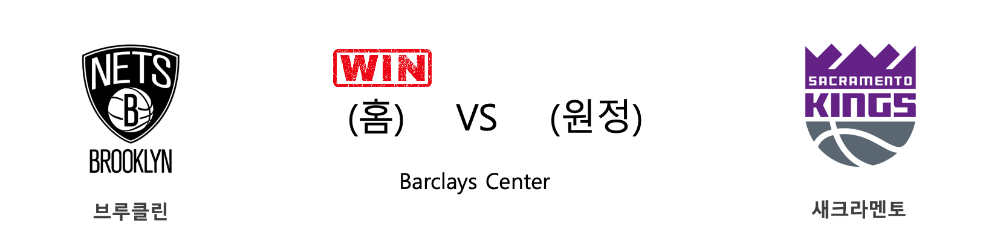

####  시카고(홈) VS 마이애미(원정) 

<table class="tg">
  <tr>
    <th class="tg-rr9t">CHI</th>
    <th class="tg-rr9t">팀</th>
    <th class="tg-rr9t">MIA</th>
  </tr>
  <tr>
    <td class="tg-dcpn">0승 1패</td>
    <td class="tg-rr9t">시즌 상대전적</td>
    <td class="tg-dcpn">1승 0패</td>
  </tr>
  <tr>
    <td class="tg-dcpn">108</td>
    <td class="tg-rr9t">점수</td>
    <td class="tg-dcpn">116</td>
  </tr>
  <tr>
    <td class="tg-dcpn">31/60(52%)</td>
    <td class="tg-rr9t">2점(%)</td>
    <td class="tg-dcpn">25/41(61%)</td>
  </tr>
  <tr>
    <td class="tg-dcpn">10/30(33%)</td>
    <td class="tg-rr9t">3점(%)</td>
    <td class="tg-dcpn">14/38(37%)</td>
  </tr>
  <tr>
    <td class="tg-dcpn">16/20(80%)</td>
    <td class="tg-rr9t">자유투(%)</td>
    <td class="tg-dcpn">24/28(86%)</td>
  </tr>
  <tr>
    <td class="tg-dcpn">41</td>
    <td class="tg-rr9t">리바운드</td>
    <td class="tg-dcpn">44</td>
  </tr>
  <tr>
    <td class="tg-dcpn">23</td>
    <td class="tg-rr9t">어시스트</td>
    <td class="tg-dcpn">33</td>
  </tr>
  <tr>
    <td class="tg-dcpn">11</td>
    <td class="tg-rr9t">스틸</td>
    <td class="tg-dcpn">10</td>
  </tr>
  <tr>
    <td class="tg-dcpn">3</td>
    <td class="tg-rr9t">블록</td>
    <td class="tg-dcpn">3</td>
  </tr>
  <tr>
    <td class="tg-dcpn">13</td>
    <td class="tg-rr9t">턴오버</td>
    <td class="tg-dcpn">19</td>
  </tr>
  <tr>
    <td class="tg-dcpn">ZachLaVineG(15)</td>
    <td class="tg-rr9t">주요 득점선수</td>
    <td class="tg-dcpn">KendrickNunnG(21) BamAdebayoF(16) GoranDragic(16) JimmyButlerF(27)</td>
  </tr>
</table>

#### 경기 관련 주요 기사         

[[오늘의 NBA] (11/23) 카와이 레너드, 승부를 결정짓는 사나이](http://sports.news.naver.com/basketball/news/read.nhn?oid=486&aid=0000001146)

[[오늘의 NBA] (11/13) LAL 카일 쿠즈마의 대반격](http://sports.news.naver.com/basketball/news/read.nhn?oid=486&aid=0000001136)

[[오늘의 NBA] (11/17) 샬럿, 설계된 플레이 연출의 달인](http://sports.news.naver.com/basketball/news/read.nhn?oid=486&aid=0000001140)

[[오늘의 NBA] (11/21) 클리퍼스, 안티 볼 핸들러 세계관을 구축하다](http://sports.news.naver.com/basketball/news/read.nhn?oid=486&aid=0000001144)

[[오늘의 NBA] (11/15) NOP 즈루 홀리데이, 뒤처리는 내가 맡는다!](http://sports.news.naver.com/basketball/news/read.nhn?oid=486&aid=0000001138)

        
        

####  필라델피아(홈) VS 샌안토니오(원정) 

<table class="tg">
  <tr>
    <th class="tg-rr9t">PHI</th>
    <th class="tg-rr9t">팀</th>
    <th class="tg-rr9t">SAS</th>
  </tr>
  <tr>
    <td class="tg-dcpn">1승 0패</td>
    <td class="tg-rr9t">시즌 상대전적</td>
    <td class="tg-dcpn">0승 1패</td>
  </tr>
  <tr>
    <td class="tg-dcpn">115</td>
    <td class="tg-rr9t">점수</td>
    <td class="tg-dcpn">104</td>
  </tr>
  <tr>
    <td class="tg-dcpn">36/63(57%)</td>
    <td class="tg-rr9t">2점(%)</td>
    <td class="tg-dcpn">37/67(55%)</td>
  </tr>
  <tr>
    <td class="tg-dcpn">10/26(38%)</td>
    <td class="tg-rr9t">3점(%)</td>
    <td class="tg-dcpn">6/18(33%)</td>
  </tr>
  <tr>
    <td class="tg-dcpn">13/19(68%)</td>
    <td class="tg-rr9t">자유투(%)</td>
    <td class="tg-dcpn">12/16(75%)</td>
  </tr>
  <tr>
    <td class="tg-dcpn">51</td>
    <td class="tg-rr9t">리바운드</td>
    <td class="tg-dcpn">32</td>
  </tr>
  <tr>
    <td class="tg-dcpn">32</td>
    <td class="tg-rr9t">어시스트</td>
    <td class="tg-dcpn">21</td>
  </tr>
  <tr>
    <td class="tg-dcpn">8</td>
    <td class="tg-rr9t">스틸</td>
    <td class="tg-dcpn">6</td>
  </tr>
  <tr>
    <td class="tg-dcpn">4</td>
    <td class="tg-rr9t">블록</td>
    <td class="tg-dcpn">3</td>
  </tr>
  <tr>
    <td class="tg-dcpn">15</td>
    <td class="tg-rr9t">턴오버</td>
    <td class="tg-dcpn">11</td>
  </tr>
  <tr>
    <td class="tg-dcpn">TobiasHarrisF(26) FurkanKorkmaz(17) JoelEmbiidC(21) AlHorfordF(18)</td>
    <td class="tg-rr9t">주요 득점선수</td>
    <td class="tg-dcpn">RudyGay(22) DeMarDeRozanF(29) LaMarcusAldri(17)</td>
  </tr>
</table>

#### 경기 관련 주요 기사         

[[오늘의 NBA] (11/21) 클리퍼스, 안티 볼 핸들러 세계관을 구축하다](http://sports.news.naver.com/basketball/news/read.nhn?oid=486&aid=0000001144)

[[오늘의 NBA] (11/9) 위긴스 vs 러셀, 타깃 센터의 명승부](http://sports.news.naver.com/basketball/news/read.nhn?oid=486&aid=0000001132)

[[오늘의 NBA] (11/23) 카와이 레너드, 승부를 결정짓는 사나이](http://sports.news.naver.com/basketball/news/read.nhn?oid=486&aid=0000001146)

[[오늘의 NBA] (11/17) 샬럿, 설계된 플레이 연출의 달인](http://sports.news.naver.com/basketball/news/read.nhn?oid=486&aid=0000001140)

[[오늘의 NBA] (11/19) 댈러스의 루카 복음 낭송](http://sports.news.naver.com/basketball/news/read.nhn?oid=486&aid=0000001142)

        
        

####  오클라호마씨티(홈) VS LA레이커스(원정) 

<table class="tg">
  <tr>
    <th class="tg-rr9t">OKC</th>
    <th class="tg-rr9t">팀</th>
    <th class="tg-rr9t">LAL</th>
  </tr>
  <tr>
    <td class="tg-dcpn">0승 2패</td>
    <td class="tg-rr9t">시즌 상대전적</td>
    <td class="tg-dcpn">2승 0패</td>
  </tr>
  <tr>
    <td class="tg-dcpn">127</td>
    <td class="tg-rr9t">점수</td>
    <td class="tg-dcpn">130</td>
  </tr>
  <tr>
    <td class="tg-dcpn">38/62(61%)</td>
    <td class="tg-rr9t">2점(%)</td>
    <td class="tg-dcpn">28/57(49%)</td>
  </tr>
  <tr>
    <td class="tg-dcpn">11/31(35%)</td>
    <td class="tg-rr9t">3점(%)</td>
    <td class="tg-dcpn">17/31(55%)</td>
  </tr>
  <tr>
    <td class="tg-dcpn">18/20(90%)</td>
    <td class="tg-rr9t">자유투(%)</td>
    <td class="tg-dcpn">23/29(79%)</td>
  </tr>
  <tr>
    <td class="tg-dcpn">37</td>
    <td class="tg-rr9t">리바운드</td>
    <td class="tg-dcpn">45</td>
  </tr>
  <tr>
    <td class="tg-dcpn">28</td>
    <td class="tg-rr9t">어시스트</td>
    <td class="tg-dcpn">32</td>
  </tr>
  <tr>
    <td class="tg-dcpn">8</td>
    <td class="tg-rr9t">스틸</td>
    <td class="tg-dcpn">7</td>
  </tr>
  <tr>
    <td class="tg-dcpn">3</td>
    <td class="tg-rr9t">블록</td>
    <td class="tg-dcpn">6</td>
  </tr>
  <tr>
    <td class="tg-dcpn">11</td>
    <td class="tg-rr9t">턴오버</td>
    <td class="tg-dcpn">15</td>
  </tr>
  <tr>
    <td class="tg-dcpn">ShaiGilgeous-(24) DaniloGallina(15) StevenAdamsC(22) ChrisPaulG(18)</td>
    <td class="tg-rr9t">주요 득점선수</td>
    <td class="tg-dcpn">KentaviousCal(17) LeBronJamesF(23) AnthonyDavisF(33)</td>
  </tr>
</table>

#### 경기 관련 주요 기사         

[[오늘의 NBA] (11/17) 샬럿, 설계된 플레이 연출의 달인](http://sports.news.naver.com/basketball/news/read.nhn?oid=486&aid=0000001140)

[[오늘의 NBA] (11/23) 카와이 레너드, 승부를 결정짓는 사나이](http://sports.news.naver.com/basketball/news/read.nhn?oid=486&aid=0000001146)

[[오늘의 NBA] (11/21) 클리퍼스, 안티 볼 핸들러 세계관을 구축하다](http://sports.news.naver.com/basketball/news/read.nhn?oid=486&aid=0000001144)

[[오늘의 NBA] (11/19) 댈러스의 루카 복음 낭송](http://sports.news.naver.com/basketball/news/read.nhn?oid=486&aid=0000001142)

[[오늘의 NBA] (11/20) 레이커스, 리그 선두 복귀](http://sports.news.naver.com/basketball/news/read.nhn?oid=486&aid=0000001143)

        
        

####  브루클린(홈) VS 새크라멘토(원정) 

<table class="tg">
  <tr>
    <th class="tg-rr9t">BKN</th>
    <th class="tg-rr9t">팀</th>
    <th class="tg-rr9t">SAC</th>
  </tr>
  <tr>
    <td class="tg-dcpn">1승 0패</td>
    <td class="tg-rr9t">시즌 상대전적</td>
    <td class="tg-dcpn">0승 1패</td>
  </tr>
  <tr>
    <td class="tg-dcpn">116</td>
    <td class="tg-rr9t">점수</td>
    <td class="tg-dcpn">97</td>
  </tr>
  <tr>
    <td class="tg-dcpn">29/47(62%)</td>
    <td class="tg-rr9t">2점(%)</td>
    <td class="tg-dcpn">35/60(58%)</td>
  </tr>
  <tr>
    <td class="tg-dcpn">12/34(35%)</td>
    <td class="tg-rr9t">3점(%)</td>
    <td class="tg-dcpn">4/26(15%)</td>
  </tr>
  <tr>
    <td class="tg-dcpn">22/31(71%)</td>
    <td class="tg-rr9t">자유투(%)</td>
    <td class="tg-dcpn">15/19(79%)</td>
  </tr>
  <tr>
    <td class="tg-dcpn">48</td>
    <td class="tg-rr9t">리바운드</td>
    <td class="tg-dcpn">33</td>
  </tr>
  <tr>
    <td class="tg-dcpn">22</td>
    <td class="tg-rr9t">어시스트</td>
    <td class="tg-dcpn">26</td>
  </tr>
  <tr>
    <td class="tg-dcpn">9</td>
    <td class="tg-rr9t">스틸</td>
    <td class="tg-dcpn">8</td>
  </tr>
  <tr>
    <td class="tg-dcpn">3</td>
    <td class="tg-rr9t">블록</td>
    <td class="tg-dcpn">2</td>
  </tr>
  <tr>
    <td class="tg-dcpn">18</td>
    <td class="tg-rr9t">턴오버</td>
    <td class="tg-dcpn">16</td>
  </tr>
  <tr>
    <td class="tg-dcpn">JoeHarrisF(22) GarrettTemple(18) SpencerDinwid(23)</td>
    <td class="tg-rr9t">주요 득점선수</td>
    <td class="tg-dcpn">HarrisonBarne(18) BuddyHieldG(16)</td>
  </tr>
</table>

#### 경기 관련 주요 기사         

[[오늘의 NBA] (11/21) 클리퍼스, 안티 볼 핸들러 세계관을 구축하다](http://sports.news.naver.com/basketball/news/read.nhn?oid=486&aid=0000001144)

[[오늘의 NBA] (11/9) 위긴스 vs 러셀, 타깃 센터의 명승부](http://sports.news.naver.com/basketball/news/read.nhn?oid=486&aid=0000001132)

[[오늘의 NBA] (11/23) 카와이 레너드, 승부를 결정짓는 사나이](http://sports.news.naver.com/basketball/news/read.nhn?oid=486&aid=0000001146)

[[오늘의 NBA] (11/18) 새크라멘토, 리그 선두 보스턴을 제압하다](http://sports.news.naver.com/basketball/news/read.nhn?oid=486&aid=0000001141)

[[오늘의 NBA] (11/19) 댈러스의 루카 복음 낭송](http://sports.news.naver.com/basketball/news/read.nhn?oid=486&aid=0000001142)

        
        

####  덴버(홈) VS 보스턴(원정) 

<table class="tg">
  <tr>
    <th class="tg-rr9t">DEN</th>
    <th class="tg-rr9t">팀</th>
    <th class="tg-rr9t">BOS</th>
  </tr>
  <tr>
    <td class="tg-dcpn">1승 0패</td>
    <td class="tg-rr9t">시즌 상대전적</td>
    <td class="tg-dcpn">0승 1패</td>
  </tr>
  <tr>
    <td class="tg-dcpn">96</td>
    <td class="tg-rr9t">점수</td>
    <td class="tg-dcpn">92</td>
  </tr>
  <tr>
    <td class="tg-dcpn">32/60(53%)</td>
    <td class="tg-rr9t">2점(%)</td>
    <td class="tg-dcpn">26/54(48%)</td>
  </tr>
  <tr>
    <td class="tg-dcpn">7/28(25%)</td>
    <td class="tg-rr9t">3점(%)</td>
    <td class="tg-dcpn">7/27(26%)</td>
  </tr>
  <tr>
    <td class="tg-dcpn">11/13(85%)</td>
    <td class="tg-rr9t">자유투(%)</td>
    <td class="tg-dcpn">19/23(83%)</td>
  </tr>
  <tr>
    <td class="tg-dcpn">48</td>
    <td class="tg-rr9t">리바운드</td>
    <td class="tg-dcpn">40</td>
  </tr>
  <tr>
    <td class="tg-dcpn">24</td>
    <td class="tg-rr9t">어시스트</td>
    <td class="tg-dcpn">21</td>
  </tr>
  <tr>
    <td class="tg-dcpn">7</td>
    <td class="tg-rr9t">스틸</td>
    <td class="tg-dcpn">12</td>
  </tr>
  <tr>
    <td class="tg-dcpn">5</td>
    <td class="tg-rr9t">블록</td>
    <td class="tg-dcpn">6</td>
  </tr>
  <tr>
    <td class="tg-dcpn">17</td>
    <td class="tg-rr9t">턴오버</td>
    <td class="tg-dcpn">11</td>
  </tr>
  <tr>
    <td class="tg-dcpn">JamalMurrayG(22) WillBartonF(15) NikolaJokicC(18)</td>
    <td class="tg-rr9t">주요 득점선수</td>
    <td class="tg-dcpn">JaylenBrownF(22) JaysonTatumF(16) MarcusSmartG(15)</td>
  </tr>
</table>

#### 경기 관련 주요 기사         

[[오늘의 NBA] (11/23) 카와이 레너드, 승부를 결정짓는 사나이](http://sports.news.naver.com/basketball/news/read.nhn?oid=486&aid=0000001146)

[[오늘의 NBA] (11/21) 클리퍼스, 안티 볼 핸들러 세계관을 구축하다](http://sports.news.naver.com/basketball/news/read.nhn?oid=486&aid=0000001144)

[[오늘의 NBA] (11/18) 새크라멘토, 리그 선두 보스턴을 제압하다](http://sports.news.naver.com/basketball/news/read.nhn?oid=486&aid=0000001141)

[[오늘의 NBA] (11/13) LAL 카일 쿠즈마의 대반격](http://sports.news.naver.com/basketball/news/read.nhn?oid=486&aid=0000001136)

[[오늘의 NBA] (11/16) 멤피스, Grit&Grind 시대와의 성공적인 단절](http://sports.news.naver.com/basketball/news/read.nhn?oid=486&aid=0000001139)

        
        

####  댈러스(홈) VS 클리블랜드(원정) 

<table class="tg">
  <tr>
    <th class="tg-rr9t">DAL</th>
    <th class="tg-rr9t">팀</th>
    <th class="tg-rr9t">CLE</th>
  </tr>
  <tr>
    <td class="tg-dcpn">2승 0패</td>
    <td class="tg-rr9t">시즌 상대전적</td>
    <td class="tg-dcpn">0승 2패</td>
  </tr>
  <tr>
    <td class="tg-dcpn">143</td>
    <td class="tg-rr9t">점수</td>
    <td class="tg-dcpn">101</td>
  </tr>
  <tr>
    <td class="tg-dcpn">38/63(60%)</td>
    <td class="tg-rr9t">2점(%)</td>
    <td class="tg-dcpn">25/57(44%)</td>
  </tr>
  <tr>
    <td class="tg-dcpn">20/37(54%)</td>
    <td class="tg-rr9t">3점(%)</td>
    <td class="tg-dcpn">12/29(41%)</td>
  </tr>
  <tr>
    <td class="tg-dcpn">7/9(78%)</td>
    <td class="tg-rr9t">자유투(%)</td>
    <td class="tg-dcpn">15/17(88%)</td>
  </tr>
  <tr>
    <td class="tg-dcpn">49</td>
    <td class="tg-rr9t">리바운드</td>
    <td class="tg-dcpn">34</td>
  </tr>
  <tr>
    <td class="tg-dcpn">31</td>
    <td class="tg-rr9t">어시스트</td>
    <td class="tg-dcpn">23</td>
  </tr>
  <tr>
    <td class="tg-dcpn">8</td>
    <td class="tg-rr9t">스틸</td>
    <td class="tg-dcpn">3</td>
  </tr>
  <tr>
    <td class="tg-dcpn">7</td>
    <td class="tg-rr9t">블록</td>
    <td class="tg-dcpn">3</td>
  </tr>
  <tr>
    <td class="tg-dcpn">5</td>
    <td class="tg-rr9t">턴오버</td>
    <td class="tg-dcpn">10</td>
  </tr>
  <tr>
    <td class="tg-dcpn">JustinJackson(19) TimHardawayJr(16) KristapsPorzi(17) LukaDoncicG(30)</td>
    <td class="tg-rr9t">주요 득점선수</td>
    <td class="tg-dcpn">DariusGarland(23) CediOsmanF(18)</td>
  </tr>
</table>

#### 경기 관련 주요 기사         

[[오늘의 NBA] (11/23) 카와이 레너드, 승부를 결정짓는 사나이](http://sports.news.naver.com/basketball/news/read.nhn?oid=486&aid=0000001146)

[[오늘의 NBA] (11/14) 제임스 하든, 농구의 미래를 제시하다](http://sports.news.naver.com/basketball/news/read.nhn?oid=486&aid=0000001137)

[[오늘의 NBA] (11/15) NOP 즈루 홀리데이, 뒤처리는 내가 맡는다!](http://sports.news.naver.com/basketball/news/read.nhn?oid=486&aid=0000001138)

['돈치치 2G 연속 트리플-더블' DAL, CLE 제압하며 분위기 반전](http://www.rookie.co.kr/news/articleView.html?idxno=34662)

[[오늘의 NBA] (11/21) 클리퍼스, 안티 볼 핸들러 세계관을 구축하다](http://sports.news.naver.com/basketball/news/read.nhn?oid=486&aid=0000001144)

        
        

####  유타(홈) VS 골든스테이트(원정) 

<table class="tg">
  <tr>
    <th class="tg-rr9t">UTA</th>
    <th class="tg-rr9t">팀</th>
    <th class="tg-rr9t">GSW</th>
  </tr>
  <tr>
    <td class="tg-dcpn">2승 0패</td>
    <td class="tg-rr9t">시즌 상대전적</td>
    <td class="tg-dcpn">0승 2패</td>
  </tr>
  <tr>
    <td class="tg-dcpn">113</td>
    <td class="tg-rr9t">점수</td>
    <td class="tg-dcpn">109</td>
  </tr>
  <tr>
    <td class="tg-dcpn">29/53(55%)</td>
    <td class="tg-rr9t">2점(%)</td>
    <td class="tg-dcpn">31/66(47%)</td>
  </tr>
  <tr>
    <td class="tg-dcpn">14/32(44%)</td>
    <td class="tg-rr9t">3점(%)</td>
    <td class="tg-dcpn">12/28(43%)</td>
  </tr>
  <tr>
    <td class="tg-dcpn">13/16(81%)</td>
    <td class="tg-rr9t">자유투(%)</td>
    <td class="tg-dcpn">11/12(92%)</td>
  </tr>
  <tr>
    <td class="tg-dcpn">48</td>
    <td class="tg-rr9t">리바운드</td>
    <td class="tg-dcpn">37</td>
  </tr>
  <tr>
    <td class="tg-dcpn">23</td>
    <td class="tg-rr9t">어시스트</td>
    <td class="tg-dcpn">28</td>
  </tr>
  <tr>
    <td class="tg-dcpn">4</td>
    <td class="tg-rr9t">스틸</td>
    <td class="tg-dcpn">11</td>
  </tr>
  <tr>
    <td class="tg-dcpn">10</td>
    <td class="tg-rr9t">블록</td>
    <td class="tg-dcpn">3</td>
  </tr>
  <tr>
    <td class="tg-dcpn">17</td>
    <td class="tg-rr9t">턴오버</td>
    <td class="tg-dcpn">8</td>
  </tr>
  <tr>
    <td class="tg-dcpn">BojanBogdanov(17) MikeConleyG(27) DonovanMitche(30)</td>
    <td class="tg-rr9t">주요 득점선수</td>
    <td class="tg-dcpn">KyBowmanG(17) AlecBurksG(20) OmariSpellman(18) GlennRobinson(17)</td>
  </tr>
</table>

#### 경기 관련 주요 기사         

[[오늘의 NBA] 시즌 프리뷰 : 유타, 마지막 조각을 획득하다](http://sports.news.naver.com/basketball/news/read.nhn?oid=486&aid=0000001107)

[[오늘의 NBA] (11/16) 멤피스, Grit&Grind 시대와의 성공적인 단절](http://sports.news.naver.com/basketball/news/read.nhn?oid=486&aid=0000001139)

[[오늘의 NBA] (11/17) 샬럿, 설계된 플레이 연출의 달인](http://sports.news.naver.com/basketball/news/read.nhn?oid=486&aid=0000001140)

[[오늘의 NBA] (11/21) 클리퍼스, 안티 볼 핸들러 세계관을 구축하다](http://sports.news.naver.com/basketball/news/read.nhn?oid=486&aid=0000001144)

[[오늘의 NBA] (11/9) 위긴스 vs 러셀, 타깃 센터의 명승부](http://sports.news.naver.com/basketball/news/read.nhn?oid=486&aid=0000001132)

        
        

####  LA클리퍼스(홈) VS 휴스턴(원정) 

<table class="tg">
  <tr>
    <th class="tg-rr9t">LAC</th>
    <th class="tg-rr9t">팀</th>
    <th class="tg-rr9t">HOU</th>
  </tr>
  <tr>
    <td class="tg-dcpn">1승 1패</td>
    <td class="tg-rr9t">시즌 상대전적</td>
    <td class="tg-dcpn">1승 1패</td>
  </tr>
  <tr>
    <td class="tg-dcpn">122</td>
    <td class="tg-rr9t">점수</td>
    <td class="tg-dcpn">119</td>
  </tr>
  <tr>
    <td class="tg-dcpn">32/54(59%)</td>
    <td class="tg-rr9t">2점(%)</td>
    <td class="tg-dcpn">24/41(59%)</td>
  </tr>
  <tr>
    <td class="tg-dcpn">13/33(39%)</td>
    <td class="tg-rr9t">3점(%)</td>
    <td class="tg-dcpn">15/43(35%)</td>
  </tr>
  <tr>
    <td class="tg-dcpn">19/24(79%)</td>
    <td class="tg-rr9t">자유투(%)</td>
    <td class="tg-dcpn">26/38(68%)</td>
  </tr>
  <tr>
    <td class="tg-dcpn">47</td>
    <td class="tg-rr9t">리바운드</td>
    <td class="tg-dcpn">43</td>
  </tr>
  <tr>
    <td class="tg-dcpn">27</td>
    <td class="tg-rr9t">어시스트</td>
    <td class="tg-dcpn">22</td>
  </tr>
  <tr>
    <td class="tg-dcpn">9</td>
    <td class="tg-rr9t">스틸</td>
    <td class="tg-dcpn">11</td>
  </tr>
  <tr>
    <td class="tg-dcpn">4</td>
    <td class="tg-rr9t">블록</td>
    <td class="tg-dcpn">2</td>
  </tr>
  <tr>
    <td class="tg-dcpn">19</td>
    <td class="tg-rr9t">턴오버</td>
    <td class="tg-dcpn">15</td>
  </tr>
  <tr>
    <td class="tg-dcpn">PaulGeorgeG(19) KawhiLeonardF(24) MontrezlHarre(18) LouWilliams(26)</td>
    <td class="tg-rr9t">주요 득점선수</td>
    <td class="tg-dcpn">ClintCapelaC(17) RussellWestbr(22) JamesHardenG(37)</td>
  </tr>
</table>

#### 경기 관련 주요 기사         

[[오늘의 NBA] (11/21) 클리퍼스, 안티 볼 핸들러 세계관을 구축하다](http://sports.news.naver.com/basketball/news/read.nhn?oid=486&aid=0000001144)

[[오늘의 NBA] (11/16) 멤피스, Grit&Grind 시대와의 성공적인 단절](http://sports.news.naver.com/basketball/news/read.nhn?oid=486&aid=0000001139)

[[오늘의 NBA] (11/19) 댈러스의 루카 복음 낭송](http://sports.news.naver.com/basketball/news/read.nhn?oid=486&aid=0000001142)

[[오늘의 NBA] (11/23) 카와이 레너드, 승부를 결정짓는 사나이](http://sports.news.naver.com/basketball/news/read.nhn?oid=486&aid=0000001146)

[[오늘의 NBA] (11/15) NOP 즈루 홀리데이, 뒤처리는 내가 맡는다!](http://sports.news.naver.com/basketball/news/read.nhn?oid=486&aid=0000001138)

        
        

####  워싱턴(홈) VS 샬럿(원정) 

<table class="tg">
  <tr>
    <th class="tg-rr9t">WAS</th>
    <th class="tg-rr9t">팀</th>
    <th class="tg-rr9t">CHA</th>
  </tr>
  <tr>
    <td class="tg-dcpn">1승 0패</td>
    <td class="tg-rr9t">시즌 상대전적</td>
    <td class="tg-dcpn">0승 1패</td>
  </tr>
  <tr>
    <td class="tg-dcpn">125</td>
    <td class="tg-rr9t">점수</td>
    <td class="tg-dcpn">118</td>
  </tr>
  <tr>
    <td class="tg-dcpn">34/57(60%)</td>
    <td class="tg-rr9t">2점(%)</td>
    <td class="tg-dcpn">34/59(58%)</td>
  </tr>
  <tr>
    <td class="tg-dcpn">14/34(41%)</td>
    <td class="tg-rr9t">3점(%)</td>
    <td class="tg-dcpn">14/34(41%)</td>
  </tr>
  <tr>
    <td class="tg-dcpn">15/20(75%)</td>
    <td class="tg-rr9t">자유투(%)</td>
    <td class="tg-dcpn">8/8(100%)</td>
  </tr>
  <tr>
    <td class="tg-dcpn">41</td>
    <td class="tg-rr9t">리바운드</td>
    <td class="tg-dcpn">44</td>
  </tr>
  <tr>
    <td class="tg-dcpn">34</td>
    <td class="tg-rr9t">어시스트</td>
    <td class="tg-dcpn">24</td>
  </tr>
  <tr>
    <td class="tg-dcpn">10</td>
    <td class="tg-rr9t">스틸</td>
    <td class="tg-dcpn">9</td>
  </tr>
  <tr>
    <td class="tg-dcpn">3</td>
    <td class="tg-rr9t">블록</td>
    <td class="tg-dcpn">5</td>
  </tr>
  <tr>
    <td class="tg-dcpn">11</td>
    <td class="tg-rr9t">턴오버</td>
    <td class="tg-dcpn">16</td>
  </tr>
  <tr>
    <td class="tg-dcpn">RuiHachimuraF(15) BradleyBealG(30) DavisBertans(20) ThomasBryantC(21)</td>
    <td class="tg-rr9t">주요 득점선수</td>
    <td class="tg-dcpn">Devonte'Graha(19) MalikMonk(19) TerryRozierG(19) MilesBridgesF(31)</td>
  </tr>
</table>

#### 경기 관련 주요 기사         

[[Weekender] Taiwan arrives on Korean cafe scene](http://www.koreaherald.com/view.php?ud=20191121000782)

[[오늘의 NBA] (11/23) 카와이 레너드, 승부를 결정짓는 사나이](http://sports.news.naver.com/basketball/news/read.nhn?oid=486&aid=0000001146)

[Football Legend Cha Bum-Kun Receives German Order Of Merit](http://www.tbs.seoul.kr/news/bunya.do?method=daum_html&typ_800=P&seq_800=10366964)

[(LEAD) football star-Germany](http://yna.kr/AEN20191122005551315?did=2106m)

        
        

####  디트로이트(홈) VS 애틀랜타(원정) 

<table class="tg">
  <tr>
    <th class="tg-rr9t">DET</th>
    <th class="tg-rr9t">팀</th>
    <th class="tg-rr9t">ATL</th>
  </tr>
  <tr>
    <td class="tg-dcpn">1승 1패</td>
    <td class="tg-rr9t">시즌 상대전적</td>
    <td class="tg-dcpn">1승 1패</td>
  </tr>
  <tr>
    <td class="tg-dcpn">128</td>
    <td class="tg-rr9t">점수</td>
    <td class="tg-dcpn">103</td>
  </tr>
  <tr>
    <td class="tg-dcpn">32/48(67%)</td>
    <td class="tg-rr9t">2점(%)</td>
    <td class="tg-dcpn">28/51(55%)</td>
  </tr>
  <tr>
    <td class="tg-dcpn">17/34(50%)</td>
    <td class="tg-rr9t">3점(%)</td>
    <td class="tg-dcpn">10/37(27%)</td>
  </tr>
  <tr>
    <td class="tg-dcpn">13/20(65%)</td>
    <td class="tg-rr9t">자유투(%)</td>
    <td class="tg-dcpn">17/17(100%)</td>
  </tr>
  <tr>
    <td class="tg-dcpn">42</td>
    <td class="tg-rr9t">리바운드</td>
    <td class="tg-dcpn">34</td>
  </tr>
  <tr>
    <td class="tg-dcpn">30</td>
    <td class="tg-rr9t">어시스트</td>
    <td class="tg-dcpn">26</td>
  </tr>
  <tr>
    <td class="tg-dcpn">13</td>
    <td class="tg-rr9t">스틸</td>
    <td class="tg-dcpn">12</td>
  </tr>
  <tr>
    <td class="tg-dcpn">10</td>
    <td class="tg-rr9t">블록</td>
    <td class="tg-dcpn">2</td>
  </tr>
  <tr>
    <td class="tg-dcpn">18</td>
    <td class="tg-rr9t">턴오버</td>
    <td class="tg-dcpn">19</td>
  </tr>
  <tr>
    <td class="tg-dcpn">BlakeGriffinF(24) AndreDrummond(23)</td>
    <td class="tg-rr9t">주요 득점선수</td>
    <td class="tg-dcpn">DeAndre'Bembr(22) De'AndreHunte(18)</td>
  </tr>
</table>

#### 경기 관련 주요 기사         

[[오늘의 NBA] (11/23) 카와이 레너드, 승부를 결정짓는 사나이](http://sports.news.naver.com/basketball/news/read.nhn?oid=486&aid=0000001146)

[[오늘의 NBA] (11/18) 새크라멘토, 리그 선두 보스턴을 제압하다](http://sports.news.naver.com/basketball/news/read.nhn?oid=486&aid=0000001141)

[[오늘의 NBA] (11/21) 클리퍼스, 안티 볼 핸들러 세계관을 구축하다](http://sports.news.naver.com/basketball/news/read.nhn?oid=486&aid=0000001144)

[[오늘의 NBA] (11/19) 댈러스의 루카 복음 낭송](http://sports.news.naver.com/basketball/news/read.nhn?oid=486&aid=0000001142)

[[오늘의 NBA] (11/17) 샬럿, 설계된 플레이 연출의 달인](http://sports.news.naver.com/basketball/news/read.nhn?oid=486&aid=0000001140)

        
        

#### 리그 (Eastern) 순위
    

<table class="tg">
  <tr>
    <th class="tg-d14o">순위</th>
    <th class="tg-d14o">팀명</th>
    <th class="tg-d14o">경기수</th>
    <th class="tg-d14o">승</th>
    <th class="tg-d14o">패</th>
    <th class="tg-d14o">승차</th>
    <th class="tg-d14o">승률</th>
  </tr>
  
<tr>
    <td class="tg-50j8">1</td>
    <td class="tg-50j8">MIL</td>
    <td class="tg-50j8">15</td>
    <td class="tg-50j8">12</td>
    <td class="tg-50j8">3</td>
    <td class="tg-50j8">1</td>
    <td class="tg-50j8">0.8</td>
</tr>

<tr>
    <td class="tg-50j8">2</td>
    <td class="tg-50j8">MIA</td>
    <td class="tg-50j8">14</td>
    <td class="tg-50j8">11</td>
    <td class="tg-50j8">3</td>
    <td class="tg-50j8">2</td>
    <td class="tg-50j8">0.786</td>
</tr>

<tr>
    <td class="tg-50j8">3</td>
    <td class="tg-50j8">BOS</td>
    <td class="tg-50j8">15</td>
    <td class="tg-50j8">11</td>
    <td class="tg-50j8">4</td>
    <td class="tg-50j8">2</td>
    <td class="tg-50j8">0.733</td>
</tr>

<tr>
    <td class="tg-50j8">4</td>
    <td class="tg-50j8">TOR</td>
    <td class="tg-50j8">14</td>
    <td class="tg-50j8">10</td>
    <td class="tg-50j8">4</td>
    <td class="tg-50j8">3</td>
    <td class="tg-50j8">0.714</td>
</tr>

<tr>
    <td class="tg-50j8">5</td>
    <td class="tg-50j8">PHI</td>
    <td class="tg-50j8">15</td>
    <td class="tg-50j8">10</td>
    <td class="tg-50j8">5</td>
    <td class="tg-50j8">3</td>
    <td class="tg-50j8">0.667</td>
</tr>

<tr>
    <td class="tg-50j8">6</td>
    <td class="tg-50j8">IND</td>
    <td class="tg-50j8">14</td>
    <td class="tg-50j8">8</td>
    <td class="tg-50j8">6</td>
    <td class="tg-50j8">5</td>
    <td class="tg-50j8">0.571</td>
</tr>

<tr>
    <td class="tg-50j8">7</td>
    <td class="tg-50j8">BKN</td>
    <td class="tg-50j8">15</td>
    <td class="tg-50j8">7</td>
    <td class="tg-50j8">8</td>
    <td class="tg-50j8">6</td>
    <td class="tg-50j8">0.467</td>
</tr>

<tr>
    <td class="tg-50j8">8</td>
    <td class="tg-50j8">ORL</td>
    <td class="tg-50j8">14</td>
    <td class="tg-50j8">6</td>
    <td class="tg-50j8">8</td>
    <td class="tg-50j8">7</td>
    <td class="tg-50j8">0.429</td>
</tr>

<tr>
    <td class="tg-50j8">9</td>
    <td class="tg-50j8">CHA</td>
    <td class="tg-50j8">16</td>
    <td class="tg-50j8">6</td>
    <td class="tg-50j8">10</td>
    <td class="tg-50j8">7</td>
    <td class="tg-50j8">0.375</td>
</tr>

<tr>
    <td class="tg-50j8">10</td>
    <td class="tg-50j8">WAS</td>
    <td class="tg-50j8">13</td>
    <td class="tg-50j8">5</td>
    <td class="tg-50j8">8</td>
    <td class="tg-50j8">8</td>
    <td class="tg-50j8">0.385</td>
</tr>

<tr>
    <td class="tg-50j8">11</td>
    <td class="tg-50j8">DET</td>
    <td class="tg-50j8">15</td>
    <td class="tg-50j8">5</td>
    <td class="tg-50j8">10</td>
    <td class="tg-50j8">8</td>
    <td class="tg-50j8">0.333</td>
</tr>

<tr>
    <td class="tg-50j8">12</td>
    <td class="tg-50j8">CHI</td>
    <td class="tg-50j8">16</td>
    <td class="tg-50j8">5</td>
    <td class="tg-50j8">11</td>
    <td class="tg-50j8">8</td>
    <td class="tg-50j8">0.312</td>
</tr>

<tr>
    <td class="tg-50j8">13</td>
    <td class="tg-50j8">CLE</td>
    <td class="tg-50j8">15</td>
    <td class="tg-50j8">4</td>
    <td class="tg-50j8">11</td>
    <td class="tg-50j8">9</td>
    <td class="tg-50j8">0.267</td>
</tr>

<tr>
    <td class="tg-50j8">13</td>
    <td class="tg-50j8">ATL</td>
    <td class="tg-50j8">15</td>
    <td class="tg-50j8">4</td>
    <td class="tg-50j8">11</td>
    <td class="tg-50j8">9</td>
    <td class="tg-50j8">0.267</td>
</tr>

<tr>
    <td class="tg-50j8">13</td>
    <td class="tg-50j8">NYK</td>
    <td class="tg-50j8">15</td>
    <td class="tg-50j8">4</td>
    <td class="tg-50j8">11</td>
    <td class="tg-50j8">9</td>
    <td class="tg-50j8">0.267</td>
</tr>
</table> 
#### 리그 (Western) 순위
    

<table class="tg">
  <tr>
    <th class="tg-d14o">순위</th>
    <th class="tg-d14o">팀명</th>
    <th class="tg-d14o">경기수</th>
    <th class="tg-d14o">승</th>
    <th class="tg-d14o">패</th>
    <th class="tg-d14o">승차</th>
    <th class="tg-d14o">승률</th>
  </tr>
  
<tr>
    <td class="tg-50j8">1</td>
    <td class="tg-50j8">LAL</td>
    <td class="tg-50j8">15</td>
    <td class="tg-50j8">13</td>
    <td class="tg-50j8">2</td>
    <td class="tg-50j8">0</td>
    <td class="tg-50j8">0.867</td>
</tr>

<tr>
    <td class="tg-50j8">2</td>
    <td class="tg-50j8">DEN</td>
    <td class="tg-50j8">14</td>
    <td class="tg-50j8">11</td>
    <td class="tg-50j8">3</td>
    <td class="tg-50j8">2</td>
    <td class="tg-50j8">0.786</td>
</tr>

<tr>
    <td class="tg-50j8">3</td>
    <td class="tg-50j8">HOU</td>
    <td class="tg-50j8">16</td>
    <td class="tg-50j8">11</td>
    <td class="tg-50j8">5</td>
    <td class="tg-50j8">2</td>
    <td class="tg-50j8">0.688</td>
</tr>

<tr>
    <td class="tg-50j8">3</td>
    <td class="tg-50j8">LAC</td>
    <td class="tg-50j8">16</td>
    <td class="tg-50j8">11</td>
    <td class="tg-50j8">5</td>
    <td class="tg-50j8">2</td>
    <td class="tg-50j8">0.688</td>
</tr>

<tr>
    <td class="tg-50j8">5</td>
    <td class="tg-50j8">UTA</td>
    <td class="tg-50j8">15</td>
    <td class="tg-50j8">10</td>
    <td class="tg-50j8">5</td>
    <td class="tg-50j8">3</td>
    <td class="tg-50j8">0.667</td>
</tr>

<tr>
    <td class="tg-50j8">5</td>
    <td class="tg-50j8">DAL</td>
    <td class="tg-50j8">15</td>
    <td class="tg-50j8">10</td>
    <td class="tg-50j8">5</td>
    <td class="tg-50j8">3</td>
    <td class="tg-50j8">0.667</td>
</tr>

<tr>
    <td class="tg-50j8">7</td>
    <td class="tg-50j8">MIN</td>
    <td class="tg-50j8">15</td>
    <td class="tg-50j8">8</td>
    <td class="tg-50j8">7</td>
    <td class="tg-50j8">5</td>
    <td class="tg-50j8">0.533</td>
</tr>

<tr>
    <td class="tg-50j8">8</td>
    <td class="tg-50j8">PHX</td>
    <td class="tg-50j8">14</td>
    <td class="tg-50j8">7</td>
    <td class="tg-50j8">7</td>
    <td class="tg-50j8">6</td>
    <td class="tg-50j8">0.5</td>
</tr>

<tr>
    <td class="tg-50j8">9</td>
    <td class="tg-50j8">SAC</td>
    <td class="tg-50j8">14</td>
    <td class="tg-50j8">6</td>
    <td class="tg-50j8">8</td>
    <td class="tg-50j8">7</td>
    <td class="tg-50j8">0.429</td>
</tr>

<tr>
    <td class="tg-50j8">10</td>
    <td class="tg-50j8">NOP</td>
    <td class="tg-50j8">15</td>
    <td class="tg-50j8">6</td>
    <td class="tg-50j8">9</td>
    <td class="tg-50j8">7</td>
    <td class="tg-50j8">0.4</td>
</tr>

<tr>
    <td class="tg-50j8">11</td>
    <td class="tg-50j8">MEM</td>
    <td class="tg-50j8">14</td>
    <td class="tg-50j8">5</td>
    <td class="tg-50j8">9</td>
    <td class="tg-50j8">8</td>
    <td class="tg-50j8">0.357</td>
</tr>

<tr>
    <td class="tg-50j8">12</td>
    <td class="tg-50j8">OKC</td>
    <td class="tg-50j8">15</td>
    <td class="tg-50j8">5</td>
    <td class="tg-50j8">10</td>
    <td class="tg-50j8">8</td>
    <td class="tg-50j8">0.333</td>
</tr>

<tr>
    <td class="tg-50j8">13</td>
    <td class="tg-50j8">POR</td>
    <td class="tg-50j8">16</td>
    <td class="tg-50j8">5</td>
    <td class="tg-50j8">11</td>
    <td class="tg-50j8">8</td>
    <td class="tg-50j8">0.312</td>
</tr>

<tr>
    <td class="tg-50j8">13</td>
    <td class="tg-50j8">SAS</td>
    <td class="tg-50j8">16</td>
    <td class="tg-50j8">5</td>
    <td class="tg-50j8">11</td>
    <td class="tg-50j8">8</td>
    <td class="tg-50j8">0.312</td>
</tr>

<tr>
    <td class="tg-50j8">15</td>
    <td class="tg-50j8">GSW</td>
    <td class="tg-50j8">17</td>
    <td class="tg-50j8">3</td>
    <td class="tg-50j8">14</td>
    <td class="tg-50j8">10</td>
    <td class="tg-50j8">0.176</td>
</tr>
</table> 

        
        
