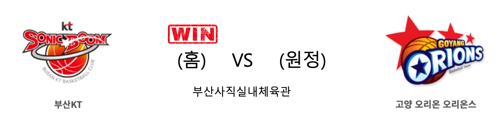

####  부산KT(홈) VS 고양오리온(원정) 

<table class="tg">
  <tr>
    <th class="tg-rr9t">부산KT</th>
    <th class="tg-rr9t">팀</th>
    <th class="tg-rr9t">고양오리온</th>
  </tr>
  <tr>
    <td class="tg-dcpn">2승 0패</td>
    <td class="tg-rr9t">시즌 상대전적</td>
    <td class="tg-dcpn">0승 2패</td>
  </tr>
  <tr>
    <td class="tg-dcpn">90</td>
    <td class="tg-rr9t">점수</td>
    <td class="tg-dcpn">87</td>
  </tr>
  <tr>
    <td class="tg-dcpn">18/37(49%)</td>
    <td class="tg-rr9t">2점(%)</td>
    <td class="tg-dcpn">31/49(63%)</td>
  </tr>
  <tr>
    <td class="tg-dcpn">14/41(34%)</td>
    <td class="tg-rr9t">3점(%)</td>
    <td class="tg-dcpn">5/15(33%)</td>
  </tr>
  <tr>
    <td class="tg-dcpn">12/19(63%)</td>
    <td class="tg-rr9t">자유투(%)</td>
    <td class="tg-dcpn">10/11(91%)</td>
  </tr>
  <tr>
    <td class="tg-dcpn">34</td>
    <td class="tg-rr9t">리바운드</td>
    <td class="tg-dcpn">40</td>
  </tr>
  <tr>
    <td class="tg-dcpn">2</td>
    <td class="tg-rr9t">어시스트</td>
    <td class="tg-dcpn">1</td>
  </tr>
  <tr>
    <td class="tg-dcpn">6</td>
    <td class="tg-rr9t">스틸</td>
    <td class="tg-dcpn">16</td>
  </tr>
  <tr>
    <td class="tg-dcpn">7</td>
    <td class="tg-rr9t">블록</td>
    <td class="tg-dcpn">3</td>
  </tr>
  <tr>
    <td class="tg-dcpn">17</td>
    <td class="tg-rr9t">턴오버</td>
    <td class="tg-dcpn">19</td>
  </tr>
  <tr>
    <td class="tg-dcpn">허훈(20) 알 쏜튼(30)</td>
    <td class="tg-rr9t">주요 득점선수</td>
    <td class="tg-dcpn">보리스 사보비치(18) 최진수(17) 장재석(16)</td>
  </tr>
</table>

#### 경기 관련 주요 기사         

[[내 맘대로 프리뷰] kt-오리온, 너를 이겨야 내가 산다](http://www.basketkorea.com/news/articleView.html?idxno=190322)

[쏜튼 30점·허훈 20점…kt, 오리온에 시즌 2연승](http://yna.kr/AKR20191124039500007?did=1195m)

[[라커룸에서] KT 서동철 감독, “수비와 뛰는 농구를 해야 한다.”](http://sports.news.naver.com/basketball/news/read.nhn?oid=065&aid=0000192853)

        
        

#### 리그 순위

<table class="tg">
  <tr>
    <th class="tg-d14o">순위</th>
    <th class="tg-d14o">팀명</th>
    <th class="tg-d14o">경기수</th>
    <th class="tg-d14o">승</th>
    <th class="tg-d14o">패</th>
    <th class="tg-d14o">승차</th>
    <th class="tg-d14o">승률</th>
  </tr>
  
<tr>
    <td class="tg-50j8">1</td>
    <td class="tg-50j8">서울SK</td>
    <td class="tg-50j8">16</td>
    <td class="tg-50j8">12</td>
    <td class="tg-50j8">4</td>
    <td class="tg-50j8">0</td>
    <td class="tg-50j8">0.75</td>
</tr>

<tr>
    <td class="tg-50j8">2</td>
    <td class="tg-50j8">원주DB</td>
    <td class="tg-50j8">17</td>
    <td class="tg-50j8">11</td>
    <td class="tg-50j8">6</td>
    <td class="tg-50j8">1</td>
    <td class="tg-50j8">0.647</td>
</tr>

<tr>
    <td class="tg-50j8">3</td>
    <td class="tg-50j8">인천전자랜드</td>
    <td class="tg-50j8">15</td>
    <td class="tg-50j8">9</td>
    <td class="tg-50j8">6</td>
    <td class="tg-50j8">3</td>
    <td class="tg-50j8">0.6</td>
</tr>

<tr>
    <td class="tg-50j8">4</td>
    <td class="tg-50j8">전주KCC</td>
    <td class="tg-50j8">17</td>
    <td class="tg-50j8">9</td>
    <td class="tg-50j8">8</td>
    <td class="tg-50j8">3</td>
    <td class="tg-50j8">0.529</td>
</tr>

<tr>
    <td class="tg-50j8">4</td>
    <td class="tg-50j8">안양KGC</td>
    <td class="tg-50j8">17</td>
    <td class="tg-50j8">9</td>
    <td class="tg-50j8">8</td>
    <td class="tg-50j8">3</td>
    <td class="tg-50j8">0.529</td>
</tr>

<tr>
    <td class="tg-50j8">6</td>
    <td class="tg-50j8">서울삼성</td>
    <td class="tg-50j8">17</td>
    <td class="tg-50j8">8</td>
    <td class="tg-50j8">9</td>
    <td class="tg-50j8">4</td>
    <td class="tg-50j8">0.471</td>
</tr>

<tr>
    <td class="tg-50j8">7</td>
    <td class="tg-50j8">울산현대모비스</td>
    <td class="tg-50j8">18</td>
    <td class="tg-50j8">8</td>
    <td class="tg-50j8">10</td>
    <td class="tg-50j8">4</td>
    <td class="tg-50j8">0.444</td>
</tr>

<tr>
    <td class="tg-50j8">8</td>
    <td class="tg-50j8">부산KT</td>
    <td class="tg-50j8">16</td>
    <td class="tg-50j8">7</td>
    <td class="tg-50j8">9</td>
    <td class="tg-50j8">5</td>
    <td class="tg-50j8">0.438</td>
</tr>

<tr>
    <td class="tg-50j8">9</td>
    <td class="tg-50j8">고양오리온</td>
    <td class="tg-50j8">16</td>
    <td class="tg-50j8">5</td>
    <td class="tg-50j8">11</td>
    <td class="tg-50j8">7</td>
    <td class="tg-50j8">0.312</td>
</tr>

<tr>
    <td class="tg-50j8">10</td>
    <td class="tg-50j8">창원LG</td>
    <td class="tg-50j8">17</td>
    <td class="tg-50j8">5</td>
    <td class="tg-50j8">12</td>
    <td class="tg-50j8">7</td>
    <td class="tg-50j8">0.294</td>
</tr>
</table> 

        
        
