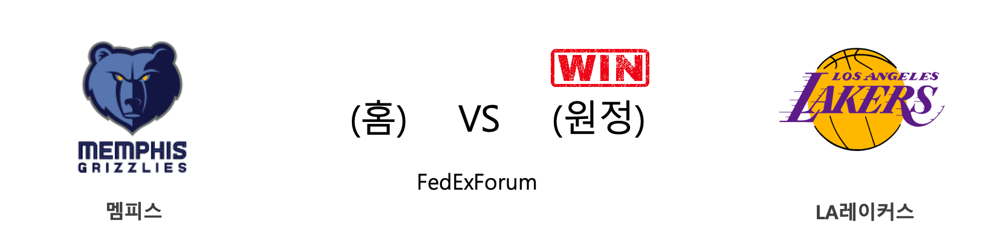

####  샬럿(홈) VS 시카고(원정) 

<table class="tg">
  <tr>
    <th class="tg-rr9t">CHA</th>
    <th class="tg-rr9t">팀</th>
    <th class="tg-rr9t">CHI</th>
  </tr>
  <tr>
    <td class="tg-dcpn">1승 1패</td>
    <td class="tg-rr9t">시즌 상대전적</td>
    <td class="tg-dcpn">1승 1패</td>
  </tr>
  <tr>
    <td class="tg-dcpn">115</td>
    <td class="tg-rr9t">점수</td>
    <td class="tg-dcpn">116</td>
  </tr>
  <tr>
    <td class="tg-dcpn">32/52(62%)</td>
    <td class="tg-rr9t">2점(%)</td>
    <td class="tg-dcpn">21/48(44%)</td>
  </tr>
  <tr>
    <td class="tg-dcpn">12/28(43%)</td>
    <td class="tg-rr9t">3점(%)</td>
    <td class="tg-dcpn">22/47(47%)</td>
  </tr>
  <tr>
    <td class="tg-dcpn">15/22(68%)</td>
    <td class="tg-rr9t">자유투(%)</td>
    <td class="tg-dcpn">8/12(67%)</td>
  </tr>
  <tr>
    <td class="tg-dcpn">43</td>
    <td class="tg-rr9t">리바운드</td>
    <td class="tg-dcpn">39</td>
  </tr>
  <tr>
    <td class="tg-dcpn">26</td>
    <td class="tg-rr9t">어시스트</td>
    <td class="tg-dcpn">27</td>
  </tr>
  <tr>
    <td class="tg-dcpn">5</td>
    <td class="tg-rr9t">스틸</td>
    <td class="tg-dcpn">12</td>
  </tr>
  <tr>
    <td class="tg-dcpn">7</td>
    <td class="tg-rr9t">블록</td>
    <td class="tg-dcpn">3</td>
  </tr>
  <tr>
    <td class="tg-dcpn">19</td>
    <td class="tg-rr9t">턴오버</td>
    <td class="tg-dcpn">13</td>
  </tr>
  <tr>
    <td class="tg-dcpn">Devonte'Graha(18) TerryRozierG(28) MarvinWilliam(21)</td>
    <td class="tg-rr9t">주요 득점선수</td>
    <td class="tg-dcpn">CobyWhite(28) ZachLaVineG(49) WendellCarter(17)</td>
  </tr>
</table>

#### 경기 관련 주요 기사         

        
        

####  밀워키(홈) VS 디트로이트(원정) 

<table class="tg">
  <tr>
    <th class="tg-rr9t">MIL</th>
    <th class="tg-rr9t">팀</th>
    <th class="tg-rr9t">DET</th>
  </tr>
  <tr>
    <td class="tg-dcpn">1승 0패</td>
    <td class="tg-rr9t">시즌 상대전적</td>
    <td class="tg-dcpn">0승 1패</td>
  </tr>
  <tr>
    <td class="tg-dcpn">104</td>
    <td class="tg-rr9t">점수</td>
    <td class="tg-dcpn">90</td>
  </tr>
  <tr>
    <td class="tg-dcpn">28/47(60%)</td>
    <td class="tg-rr9t">2점(%)</td>
    <td class="tg-dcpn">27/56(48%)</td>
  </tr>
  <tr>
    <td class="tg-dcpn">13/37(35%)</td>
    <td class="tg-rr9t">3점(%)</td>
    <td class="tg-dcpn">10/35(29%)</td>
  </tr>
  <tr>
    <td class="tg-dcpn">9/18(50%)</td>
    <td class="tg-rr9t">자유투(%)</td>
    <td class="tg-dcpn">6/10(60%)</td>
  </tr>
  <tr>
    <td class="tg-dcpn">49</td>
    <td class="tg-rr9t">리바운드</td>
    <td class="tg-dcpn">40</td>
  </tr>
  <tr>
    <td class="tg-dcpn">25</td>
    <td class="tg-rr9t">어시스트</td>
    <td class="tg-dcpn">22</td>
  </tr>
  <tr>
    <td class="tg-dcpn">10</td>
    <td class="tg-rr9t">스틸</td>
    <td class="tg-dcpn">7</td>
  </tr>
  <tr>
    <td class="tg-dcpn">8</td>
    <td class="tg-rr9t">블록</td>
    <td class="tg-dcpn">3</td>
  </tr>
  <tr>
    <td class="tg-dcpn">21</td>
    <td class="tg-rr9t">턴오버</td>
    <td class="tg-dcpn">15</td>
  </tr>
  <tr>
    <td class="tg-dcpn">GiannisAnteto(28)</td>
    <td class="tg-rr9t">주요 득점선수</td>
    <td class="tg-dcpn">DerrickRose(20)</td>
  </tr>
</table>

#### 경기 관련 주요 기사         

[[오늘의 NBA] (11/21) 클리퍼스, 안티 볼 핸들러 세계관을 구축하다](http://sports.news.naver.com/basketball/news/read.nhn?oid=486&aid=0000001144)

[[오늘의 NBA] (10/25) 밀워키의 털보 사냥](http://sports.news.naver.com/basketball/news/read.nhn?oid=486&aid=0000001117)

[[오늘의 NBA] (11/17) 샬럿, 설계된 플레이 연출의 달인](http://sports.news.naver.com/basketball/news/read.nhn?oid=486&aid=0000001140)

[[오늘의 NBA] (11/19) 댈러스의 루카 복음 낭송](http://sports.news.naver.com/basketball/news/read.nhn?oid=486&aid=0000001142)

[[오늘의 NBA] (11/11) 토론토, 디펜딩 챔피언의 저력](http://sports.news.naver.com/basketball/news/read.nhn?oid=486&aid=0000001134)

        
        

####  유타(홈) VS 뉴올리언스(원정) 

<table class="tg">
  <tr>
    <th class="tg-rr9t">UTA</th>
    <th class="tg-rr9t">팀</th>
    <th class="tg-rr9t">NOP</th>
  </tr>
  <tr>
    <td class="tg-dcpn">1승 0패</td>
    <td class="tg-rr9t">시즌 상대전적</td>
    <td class="tg-dcpn">0승 1패</td>
  </tr>
  <tr>
    <td class="tg-dcpn">128</td>
    <td class="tg-rr9t">점수</td>
    <td class="tg-dcpn">120</td>
  </tr>
  <tr>
    <td class="tg-dcpn">27/46(59%)</td>
    <td class="tg-rr9t">2점(%)</td>
    <td class="tg-dcpn">25/60(42%)</td>
  </tr>
  <tr>
    <td class="tg-dcpn">15/36(42%)</td>
    <td class="tg-rr9t">3점(%)</td>
    <td class="tg-dcpn">17/41(41%)</td>
  </tr>
  <tr>
    <td class="tg-dcpn">29/33(88%)</td>
    <td class="tg-rr9t">자유투(%)</td>
    <td class="tg-dcpn">19/20(95%)</td>
  </tr>
  <tr>
    <td class="tg-dcpn">49</td>
    <td class="tg-rr9t">리바운드</td>
    <td class="tg-dcpn">38</td>
  </tr>
  <tr>
    <td class="tg-dcpn">29</td>
    <td class="tg-rr9t">어시스트</td>
    <td class="tg-dcpn">21</td>
  </tr>
  <tr>
    <td class="tg-dcpn">2</td>
    <td class="tg-rr9t">스틸</td>
    <td class="tg-dcpn">7</td>
  </tr>
  <tr>
    <td class="tg-dcpn">4</td>
    <td class="tg-rr9t">블록</td>
    <td class="tg-dcpn">6</td>
  </tr>
  <tr>
    <td class="tg-dcpn">17</td>
    <td class="tg-rr9t">턴오버</td>
    <td class="tg-dcpn">10</td>
  </tr>
  <tr>
    <td class="tg-dcpn">DonovanMitche(37) JeffGreen(15) BojanBogdanov(28)</td>
    <td class="tg-rr9t">주요 득점선수</td>
    <td class="tg-dcpn">BrandonIngram(33) JJRedickG(20) JrueHolidayG(28)</td>
  </tr>
</table>

#### 경기 관련 주요 기사         

[[오늘의 NBA] (10/23) 카와이 레너드, 할리우드의 새로운 주인공](http://sports.news.naver.com/basketball/news/read.nhn?oid=486&aid=0000001115)

[[오늘의 NBA] (11/16) 멤피스, Grit&Grind 시대와의 성공적인 단절](http://sports.news.naver.com/basketball/news/read.nhn?oid=486&aid=0000001139)

[[오늘의 NBA] (11/19) 댈러스의 루카 복음 낭송](http://sports.news.naver.com/basketball/news/read.nhn?oid=486&aid=0000001142)

[[오늘의 NBA] (11/17) 샬럿, 설계된 플레이 연출의 달인](http://sports.news.naver.com/basketball/news/read.nhn?oid=486&aid=0000001140)

[[오늘의 NBA] (11/20) 레이커스, 리그 선두 복귀](http://sports.news.naver.com/basketball/news/read.nhn?oid=486&aid=0000001143)

        
        

####  미네소타(홈) VS 피닉스(원정) 

<table class="tg">
  <tr>
    <th class="tg-rr9t">MIN</th>
    <th class="tg-rr9t">팀</th>
    <th class="tg-rr9t">PHX</th>
  </tr>
  <tr>
    <td class="tg-dcpn">0승 1패</td>
    <td class="tg-rr9t">시즌 상대전적</td>
    <td class="tg-dcpn">1승 0패</td>
  </tr>
  <tr>
    <td class="tg-dcpn">98</td>
    <td class="tg-rr9t">점수</td>
    <td class="tg-dcpn">100</td>
  </tr>
  <tr>
    <td class="tg-dcpn">26/49(53%)</td>
    <td class="tg-rr9t">2점(%)</td>
    <td class="tg-dcpn">23/61(38%)</td>
  </tr>
  <tr>
    <td class="tg-dcpn">12/42(29%)</td>
    <td class="tg-rr9t">3점(%)</td>
    <td class="tg-dcpn">10/35(29%)</td>
  </tr>
  <tr>
    <td class="tg-dcpn">10/17(59%)</td>
    <td class="tg-rr9t">자유투(%)</td>
    <td class="tg-dcpn">24/26(92%)</td>
  </tr>
  <tr>
    <td class="tg-dcpn">57</td>
    <td class="tg-rr9t">리바운드</td>
    <td class="tg-dcpn">56</td>
  </tr>
  <tr>
    <td class="tg-dcpn">26</td>
    <td class="tg-rr9t">어시스트</td>
    <td class="tg-dcpn">22</td>
  </tr>
  <tr>
    <td class="tg-dcpn">2</td>
    <td class="tg-rr9t">스틸</td>
    <td class="tg-dcpn">9</td>
  </tr>
  <tr>
    <td class="tg-dcpn">10</td>
    <td class="tg-rr9t">블록</td>
    <td class="tg-dcpn">3</td>
  </tr>
  <tr>
    <td class="tg-dcpn">14</td>
    <td class="tg-rr9t">턴오버</td>
    <td class="tg-dcpn">7</td>
  </tr>
  <tr>
    <td class="tg-dcpn">Karl-AnthonyT(31) KeitaBates-Di(22) AndrewWiggins(21)</td>
    <td class="tg-rr9t">주요 득점선수</td>
    <td class="tg-dcpn">KellyOubreJr.(25) DevinBookerG(35)</td>
  </tr>
</table>

#### 경기 관련 주요 기사         

[[오늘의 NBA] (11/5) 데빈 부커, 강팀의 에이스](http://sports.news.naver.com/basketball/news/read.nhn?oid=486&aid=0000001128)

[[오늘의 NBA] (10/24) 앤드류 위긴스, 위기 상황에서 웃는 일류 승부사](http://sports.news.naver.com/basketball/news/read.nhn?oid=486&aid=0000001116)

[[오늘의 NBA] (11/9) 위긴스 vs 러셀, 타깃 센터의 명승부](http://sports.news.naver.com/basketball/news/read.nhn?oid=486&aid=0000001132)

[[오늘의 NBA] (11/21) 클리퍼스, 안티 볼 핸들러 세계관을 구축하다](http://sports.news.naver.com/basketball/news/read.nhn?oid=486&aid=0000001144)

[[오늘의 NBA] (11/11) 토론토, 디펜딩 챔피언의 저력](http://sports.news.naver.com/basketball/news/read.nhn?oid=486&aid=0000001134)

        
        

####  멤피스(홈) VS LA레이커스(원정) 

<table class="tg">
  <tr>
    <th class="tg-rr9t">MEM</th>
    <th class="tg-rr9t">팀</th>
    <th class="tg-rr9t">LAL</th>
  </tr>
  <tr>
    <td class="tg-dcpn">0승 2패</td>
    <td class="tg-rr9t">시즌 상대전적</td>
    <td class="tg-dcpn">2승 0패</td>
  </tr>
  <tr>
    <td class="tg-dcpn">108</td>
    <td class="tg-rr9t">점수</td>
    <td class="tg-dcpn">109</td>
  </tr>
  <tr>
    <td class="tg-dcpn">29/59(49%)</td>
    <td class="tg-rr9t">2점(%)</td>
    <td class="tg-dcpn">25/45(56%)</td>
  </tr>
  <tr>
    <td class="tg-dcpn">14/30(47%)</td>
    <td class="tg-rr9t">3점(%)</td>
    <td class="tg-dcpn">13/39(33%)</td>
  </tr>
  <tr>
    <td class="tg-dcpn">8/13(62%)</td>
    <td class="tg-rr9t">자유투(%)</td>
    <td class="tg-dcpn">20/29(69%)</td>
  </tr>
  <tr>
    <td class="tg-dcpn">47</td>
    <td class="tg-rr9t">리바운드</td>
    <td class="tg-dcpn">40</td>
  </tr>
  <tr>
    <td class="tg-dcpn">28</td>
    <td class="tg-rr9t">어시스트</td>
    <td class="tg-dcpn">19</td>
  </tr>
  <tr>
    <td class="tg-dcpn">12</td>
    <td class="tg-rr9t">스틸</td>
    <td class="tg-dcpn">12</td>
  </tr>
  <tr>
    <td class="tg-dcpn">3</td>
    <td class="tg-rr9t">블록</td>
    <td class="tg-dcpn">7</td>
  </tr>
  <tr>
    <td class="tg-dcpn">19</td>
    <td class="tg-rr9t">턴오버</td>
    <td class="tg-dcpn">16</td>
  </tr>
  <tr>
    <td class="tg-dcpn">JaMorantG(26) JarenJacksonJ(20) JaeCrowderF(21)</td>
    <td class="tg-rr9t">주요 득점선수</td>
    <td class="tg-dcpn">LeBronJamesF(30) AnthonyDavisF(22)</td>
  </tr>
</table>

#### 경기 관련 주요 기사         

[[오늘의 NBA] (11/18) 새크라멘토, 리그 선두 보스턴을 제압하다](http://sports.news.naver.com/basketball/news/read.nhn?oid=486&aid=0000001141)

[[오늘의 NBA] (11/23) 카와이 레너드, 승부를 결정짓는 사나이](http://sports.news.naver.com/basketball/news/read.nhn?oid=486&aid=0000001146)

[[오늘의 NBA] (11/13) LAL 카일 쿠즈마의 대반격](http://sports.news.naver.com/basketball/news/read.nhn?oid=486&aid=0000001136)

[[오늘의 NBA] (11/17) 샬럿, 설계된 플레이 연출의 달인](http://sports.news.naver.com/basketball/news/read.nhn?oid=486&aid=0000001140)

[[오늘의 NBA] (11/20) 레이커스, 리그 선두 복귀](http://sports.news.naver.com/basketball/news/read.nhn?oid=486&aid=0000001143)

        
        

####  인디애나(홈) VS 올랜도(원정) 

<table class="tg">
  <tr>
    <th class="tg-rr9t">IND</th>
    <th class="tg-rr9t">팀</th>
    <th class="tg-rr9t">ORL</th>
  </tr>
  <tr>
    <td class="tg-dcpn">2승 0패</td>
    <td class="tg-rr9t">시즌 상대전적</td>
    <td class="tg-dcpn">0승 2패</td>
  </tr>
  <tr>
    <td class="tg-dcpn">111</td>
    <td class="tg-rr9t">점수</td>
    <td class="tg-dcpn">106</td>
  </tr>
  <tr>
    <td class="tg-dcpn">33/55(60%)</td>
    <td class="tg-rr9t">2점(%)</td>
    <td class="tg-dcpn">30/61(49%)</td>
  </tr>
  <tr>
    <td class="tg-dcpn">10/24(42%)</td>
    <td class="tg-rr9t">3점(%)</td>
    <td class="tg-dcpn">13/31(42%)</td>
  </tr>
  <tr>
    <td class="tg-dcpn">15/16(94%)</td>
    <td class="tg-rr9t">자유투(%)</td>
    <td class="tg-dcpn">7/9(78%)</td>
  </tr>
  <tr>
    <td class="tg-dcpn">42</td>
    <td class="tg-rr9t">리바운드</td>
    <td class="tg-dcpn">33</td>
  </tr>
  <tr>
    <td class="tg-dcpn">26</td>
    <td class="tg-rr9t">어시스트</td>
    <td class="tg-dcpn">24</td>
  </tr>
  <tr>
    <td class="tg-dcpn">6</td>
    <td class="tg-rr9t">스틸</td>
    <td class="tg-dcpn">11</td>
  </tr>
  <tr>
    <td class="tg-dcpn">6</td>
    <td class="tg-rr9t">블록</td>
    <td class="tg-dcpn">5</td>
  </tr>
  <tr>
    <td class="tg-dcpn">19</td>
    <td class="tg-rr9t">턴오버</td>
    <td class="tg-dcpn">13</td>
  </tr>
  <tr>
    <td class="tg-dcpn">DomantasSabon(25)</td>
    <td class="tg-rr9t">주요 득점선수</td>
    <td class="tg-dcpn">JonathanIsaac(25) EvanFournierG(26)</td>
  </tr>
</table>

#### 경기 관련 주요 기사         

[[오늘의 NBA] (11/18) 새크라멘토, 리그 선두 보스턴을 제압하다](http://sports.news.naver.com/basketball/news/read.nhn?oid=486&aid=0000001141)

[[오늘의 NBA] (11/17) 샬럿, 설계된 플레이 연출의 달인](http://sports.news.naver.com/basketball/news/read.nhn?oid=486&aid=0000001140)

[[오늘의 NBA] (11/13) LAL 카일 쿠즈마의 대반격](http://sports.news.naver.com/basketball/news/read.nhn?oid=486&aid=0000001136)

[[오늘의 NBA] (11/16) 멤피스, Grit&Grind 시대와의 성공적인 단절](http://sports.news.naver.com/basketball/news/read.nhn?oid=486&aid=0000001139)

[[오늘의 NBA] (10/25) 밀워키의 털보 사냥](http://sports.news.naver.com/basketball/news/read.nhn?oid=486&aid=0000001117)

        
        

####  필라델피아(홈) VS 마이애미(원정) 

<table class="tg">
  <tr>
    <th class="tg-rr9t">PHI</th>
    <th class="tg-rr9t">팀</th>
    <th class="tg-rr9t">MIA</th>
  </tr>
  <tr>
    <td class="tg-dcpn">1승 0패</td>
    <td class="tg-rr9t">시즌 상대전적</td>
    <td class="tg-dcpn">0승 1패</td>
  </tr>
  <tr>
    <td class="tg-dcpn">113</td>
    <td class="tg-rr9t">점수</td>
    <td class="tg-dcpn">86</td>
  </tr>
  <tr>
    <td class="tg-dcpn">28/54(52%)</td>
    <td class="tg-rr9t">2점(%)</td>
    <td class="tg-dcpn">24/51(47%)</td>
  </tr>
  <tr>
    <td class="tg-dcpn">14/29(48%)</td>
    <td class="tg-rr9t">3점(%)</td>
    <td class="tg-dcpn">6/24(25%)</td>
  </tr>
  <tr>
    <td class="tg-dcpn">15/17(88%)</td>
    <td class="tg-rr9t">자유투(%)</td>
    <td class="tg-dcpn">20/27(74%)</td>
  </tr>
  <tr>
    <td class="tg-dcpn">44</td>
    <td class="tg-rr9t">리바운드</td>
    <td class="tg-dcpn">38</td>
  </tr>
  <tr>
    <td class="tg-dcpn">28</td>
    <td class="tg-rr9t">어시스트</td>
    <td class="tg-dcpn">12</td>
  </tr>
  <tr>
    <td class="tg-dcpn">11</td>
    <td class="tg-rr9t">스틸</td>
    <td class="tg-dcpn">6</td>
  </tr>
  <tr>
    <td class="tg-dcpn">2</td>
    <td class="tg-rr9t">블록</td>
    <td class="tg-dcpn">4</td>
  </tr>
  <tr>
    <td class="tg-dcpn">14</td>
    <td class="tg-rr9t">턴오버</td>
    <td class="tg-dcpn">17</td>
  </tr>
  <tr>
    <td class="tg-dcpn">JoshRichardso(32) JoelEmbiidC(23) TobiasHarrisF(19) AlHorfordF(16)</td>
    <td class="tg-rr9t">주요 득점선수</td>
    <td class="tg-dcpn">TylerHerro(20) GoranDragic(18)</td>
  </tr>
</table>

#### 경기 관련 주요 기사         

[[오늘의 NBA] (11/21) 클리퍼스, 안티 볼 핸들러 세계관을 구축하다](http://sports.news.naver.com/basketball/news/read.nhn?oid=486&aid=0000001144)

[[위클리 NBA] 시즌 초반, 동부 컨퍼런스의 향방을 가를 PHI vs MIA의 맞대결](http://sports.news.naver.com/basketball/news/read.nhn?oid=065&aid=0000192609)

[[오늘의 NBA] (11/19) 댈러스의 루카 복음 낭송](http://sports.news.naver.com/basketball/news/read.nhn?oid=486&aid=0000001142)

[[오늘의 NBA] (11/16) 멤피스, Grit&Grind 시대와의 성공적인 단절](http://sports.news.naver.com/basketball/news/read.nhn?oid=486&aid=0000001139)

[[오늘의 NBA] (11/17) 샬럿, 설계된 플레이 연출의 달인](http://sports.news.naver.com/basketball/news/read.nhn?oid=486&aid=0000001140)

        
        

####  애틀랜타(홈) VS 토론토(원정) 

<table class="tg">
  <tr>
    <th class="tg-rr9t">ATL</th>
    <th class="tg-rr9t">팀</th>
    <th class="tg-rr9t">TOR</th>
  </tr>
  <tr>
    <td class="tg-dcpn">0승 1패</td>
    <td class="tg-rr9t">시즌 상대전적</td>
    <td class="tg-dcpn">1승 0패</td>
  </tr>
  <tr>
    <td class="tg-dcpn">116</td>
    <td class="tg-rr9t">점수</td>
    <td class="tg-dcpn">119</td>
  </tr>
  <tr>
    <td class="tg-dcpn">33/56(59%)</td>
    <td class="tg-rr9t">2점(%)</td>
    <td class="tg-dcpn">27/51(53%)</td>
  </tr>
  <tr>
    <td class="tg-dcpn">14/34(41%)</td>
    <td class="tg-rr9t">3점(%)</td>
    <td class="tg-dcpn">13/37(35%)</td>
  </tr>
  <tr>
    <td class="tg-dcpn">8/11(73%)</td>
    <td class="tg-rr9t">자유투(%)</td>
    <td class="tg-dcpn">26/30(87%)</td>
  </tr>
  <tr>
    <td class="tg-dcpn">38</td>
    <td class="tg-rr9t">리바운드</td>
    <td class="tg-dcpn">42</td>
  </tr>
  <tr>
    <td class="tg-dcpn">32</td>
    <td class="tg-rr9t">어시스트</td>
    <td class="tg-dcpn">22</td>
  </tr>
  <tr>
    <td class="tg-dcpn">9</td>
    <td class="tg-rr9t">스틸</td>
    <td class="tg-dcpn">5</td>
  </tr>
  <tr>
    <td class="tg-dcpn">7</td>
    <td class="tg-rr9t">블록</td>
    <td class="tg-dcpn">5</td>
  </tr>
  <tr>
    <td class="tg-dcpn">15</td>
    <td class="tg-rr9t">턴오버</td>
    <td class="tg-dcpn">15</td>
  </tr>
  <tr>
    <td class="tg-dcpn">De'AndreHunte(26) TraeYoungG(30)</td>
    <td class="tg-rr9t">주요 득점선수</td>
    <td class="tg-dcpn">FredVanVleetG(25) PascalSiakamF(34) NormanPowellG(20)</td>
  </tr>
</table>

#### 경기 관련 주요 기사         

[[오늘의 NBA] (11/18) 새크라멘토, 리그 선두 보스턴을 제압하다](http://sports.news.naver.com/basketball/news/read.nhn?oid=486&aid=0000001141)

[[오늘의 NBA] (11/17) 샬럿, 설계된 플레이 연출의 달인](http://sports.news.naver.com/basketball/news/read.nhn?oid=486&aid=0000001140)

[[오늘의 NBA] (11/19) 댈러스의 루카 복음 낭송](http://sports.news.naver.com/basketball/news/read.nhn?oid=486&aid=0000001142)

[[오늘의 NBA] (11/21) 클리퍼스, 안티 볼 핸들러 세계관을 구축하다](http://sports.news.naver.com/basketball/news/read.nhn?oid=486&aid=0000001144)

[[오늘의 NBA] (11/11) 토론토, 디펜딩 챔피언의 저력](http://sports.news.naver.com/basketball/news/read.nhn?oid=486&aid=0000001134)

        
        

####  뉴욕(홈) VS 샌안토니오(원정) 

<table class="tg">
  <tr>
    <th class="tg-rr9t">NYK</th>
    <th class="tg-rr9t">팀</th>
    <th class="tg-rr9t">SAS</th>
  </tr>
  <tr>
    <td class="tg-dcpn">0승 2패</td>
    <td class="tg-rr9t">시즌 상대전적</td>
    <td class="tg-dcpn">2승 0패</td>
  </tr>
  <tr>
    <td class="tg-dcpn">104</td>
    <td class="tg-rr9t">점수</td>
    <td class="tg-dcpn">111</td>
  </tr>
  <tr>
    <td class="tg-dcpn">25/53(47%)</td>
    <td class="tg-rr9t">2점(%)</td>
    <td class="tg-dcpn">28/52(54%)</td>
  </tr>
  <tr>
    <td class="tg-dcpn">15/40(38%)</td>
    <td class="tg-rr9t">3점(%)</td>
    <td class="tg-dcpn">12/23(52%)</td>
  </tr>
  <tr>
    <td class="tg-dcpn">9/15(60%)</td>
    <td class="tg-rr9t">자유투(%)</td>
    <td class="tg-dcpn">19/28(68%)</td>
  </tr>
  <tr>
    <td class="tg-dcpn">37</td>
    <td class="tg-rr9t">리바운드</td>
    <td class="tg-dcpn">47</td>
  </tr>
  <tr>
    <td class="tg-dcpn">30</td>
    <td class="tg-rr9t">어시스트</td>
    <td class="tg-dcpn">26</td>
  </tr>
  <tr>
    <td class="tg-dcpn">12</td>
    <td class="tg-rr9t">스틸</td>
    <td class="tg-dcpn">7</td>
  </tr>
  <tr>
    <td class="tg-dcpn">3</td>
    <td class="tg-rr9t">블록</td>
    <td class="tg-dcpn">3</td>
  </tr>
  <tr>
    <td class="tg-dcpn">11</td>
    <td class="tg-rr9t">턴오버</td>
    <td class="tg-dcpn">22</td>
  </tr>
  <tr>
    <td class="tg-dcpn">BobbyPortis(16) MarcusMorrisS(20)</td>
    <td class="tg-rr9t">주요 득점선수</td>
    <td class="tg-dcpn">LaMarcusAldri(23) DeMarDeRozanF(21) PattyMills(17)</td>
  </tr>
</table>

#### 경기 관련 주요 기사         

[[오늘의 NBA] (11/21) 클리퍼스, 안티 볼 핸들러 세계관을 구축하다](http://sports.news.naver.com/basketball/news/read.nhn?oid=486&aid=0000001144)

[[오늘의 NBA] (11/17) 샬럿, 설계된 플레이 연출의 달인](http://sports.news.naver.com/basketball/news/read.nhn?oid=486&aid=0000001140)

[[오늘의 NBA] (11/9) 위긴스 vs 러셀, 타깃 센터의 명승부](http://sports.news.naver.com/basketball/news/read.nhn?oid=486&aid=0000001132)

[[오늘의 NBA] (11/23) 카와이 레너드, 승부를 결정짓는 사나이](http://sports.news.naver.com/basketball/news/read.nhn?oid=486&aid=0000001146)

[[오늘의 NBA] (11/19) 댈러스의 루카 복음 낭송](http://sports.news.naver.com/basketball/news/read.nhn?oid=486&aid=0000001142)

        
        

####  클리블랜드(홈) VS 포틀랜드(원정) 

<table class="tg">
  <tr>
    <th class="tg-rr9t">CLE</th>
    <th class="tg-rr9t">팀</th>
    <th class="tg-rr9t">POR</th>
  </tr>
  <tr>
    <td class="tg-dcpn">1승 0패</td>
    <td class="tg-rr9t">시즌 상대전적</td>
    <td class="tg-dcpn">0승 1패</td>
  </tr>
  <tr>
    <td class="tg-dcpn">110</td>
    <td class="tg-rr9t">점수</td>
    <td class="tg-dcpn">104</td>
  </tr>
  <tr>
    <td class="tg-dcpn">27/55(49%)</td>
    <td class="tg-rr9t">2점(%)</td>
    <td class="tg-dcpn">25/47(53%)</td>
  </tr>
  <tr>
    <td class="tg-dcpn">10/31(32%)</td>
    <td class="tg-rr9t">3점(%)</td>
    <td class="tg-dcpn">14/40(35%)</td>
  </tr>
  <tr>
    <td class="tg-dcpn">26/32(81%)</td>
    <td class="tg-rr9t">자유투(%)</td>
    <td class="tg-dcpn">12/16(75%)</td>
  </tr>
  <tr>
    <td class="tg-dcpn">51</td>
    <td class="tg-rr9t">리바운드</td>
    <td class="tg-dcpn">38</td>
  </tr>
  <tr>
    <td class="tg-dcpn">19</td>
    <td class="tg-rr9t">어시스트</td>
    <td class="tg-dcpn">21</td>
  </tr>
  <tr>
    <td class="tg-dcpn">9</td>
    <td class="tg-rr9t">스틸</td>
    <td class="tg-dcpn">6</td>
  </tr>
  <tr>
    <td class="tg-dcpn">2</td>
    <td class="tg-rr9t">블록</td>
    <td class="tg-dcpn">5</td>
  </tr>
  <tr>
    <td class="tg-dcpn">13</td>
    <td class="tg-rr9t">턴오버</td>
    <td class="tg-dcpn">10</td>
  </tr>
  <tr>
    <td class="tg-dcpn">CollinSextonG(19) JordanClarkso(28) TristanThomps(25)</td>
    <td class="tg-rr9t">주요 득점선수</td>
    <td class="tg-dcpn">CJMcCollumG(20) DamianLillard(23)</td>
  </tr>
</table>

#### 경기 관련 주요 기사         

[[오늘의 NBA] (11/17) 샬럿, 설계된 플레이 연출의 달인](http://sports.news.naver.com/basketball/news/read.nhn?oid=486&aid=0000001140)

[[오늘의 NBA] (11/13) LAL 카일 쿠즈마의 대반격](http://sports.news.naver.com/basketball/news/read.nhn?oid=486&aid=0000001136)

[[오늘의 NBA] (11/14) 제임스 하든, 농구의 미래를 제시하다](http://sports.news.naver.com/basketball/news/read.nhn?oid=486&aid=0000001137)

[[오늘의 NBA] (11/19) 댈러스의 루카 복음 낭송](http://sports.news.naver.com/basketball/news/read.nhn?oid=486&aid=0000001142)

[[오늘의 NBA] (11/21) 클리퍼스, 안티 볼 핸들러 세계관을 구축하다](http://sports.news.naver.com/basketball/news/read.nhn?oid=486&aid=0000001144)

        
        

#### 리그 (Eastern) 순위
    

<table class="tg">
  <tr>
    <th class="tg-d14o">순위</th>
    <th class="tg-d14o">팀명</th>
    <th class="tg-d14o">경기수</th>
    <th class="tg-d14o">승</th>
    <th class="tg-d14o">패</th>
    <th class="tg-d14o">승차</th>
    <th class="tg-d14o">승률</th>
  </tr>
  
<tr>
    <td class="tg-50j8">1</td>
    <td class="tg-50j8">MIL</td>
    <td class="tg-50j8">16</td>
    <td class="tg-50j8">13</td>
    <td class="tg-50j8">3</td>
    <td class="tg-50j8">1</td>
    <td class="tg-50j8">0.812</td>
</tr>

<tr>
    <td class="tg-50j8">2</td>
    <td class="tg-50j8">BOS</td>
    <td class="tg-50j8">15</td>
    <td class="tg-50j8">11</td>
    <td class="tg-50j8">4</td>
    <td class="tg-50j8">3</td>
    <td class="tg-50j8">0.733</td>
</tr>

<tr>
    <td class="tg-50j8">2</td>
    <td class="tg-50j8">MIA</td>
    <td class="tg-50j8">15</td>
    <td class="tg-50j8">11</td>
    <td class="tg-50j8">4</td>
    <td class="tg-50j8">3</td>
    <td class="tg-50j8">0.733</td>
</tr>

<tr>
    <td class="tg-50j8">2</td>
    <td class="tg-50j8">TOR</td>
    <td class="tg-50j8">15</td>
    <td class="tg-50j8">11</td>
    <td class="tg-50j8">4</td>
    <td class="tg-50j8">3</td>
    <td class="tg-50j8">0.733</td>
</tr>

<tr>
    <td class="tg-50j8">5</td>
    <td class="tg-50j8">PHI</td>
    <td class="tg-50j8">16</td>
    <td class="tg-50j8">11</td>
    <td class="tg-50j8">5</td>
    <td class="tg-50j8">3</td>
    <td class="tg-50j8">0.688</td>
</tr>

<tr>
    <td class="tg-50j8">6</td>
    <td class="tg-50j8">IND</td>
    <td class="tg-50j8">15</td>
    <td class="tg-50j8">9</td>
    <td class="tg-50j8">6</td>
    <td class="tg-50j8">5</td>
    <td class="tg-50j8">0.6</td>
</tr>

<tr>
    <td class="tg-50j8">7</td>
    <td class="tg-50j8">BKN</td>
    <td class="tg-50j8">15</td>
    <td class="tg-50j8">7</td>
    <td class="tg-50j8">8</td>
    <td class="tg-50j8">7</td>
    <td class="tg-50j8">0.467</td>
</tr>

<tr>
    <td class="tg-50j8">8</td>
    <td class="tg-50j8">ORL</td>
    <td class="tg-50j8">15</td>
    <td class="tg-50j8">6</td>
    <td class="tg-50j8">9</td>
    <td class="tg-50j8">8</td>
    <td class="tg-50j8">0.4</td>
</tr>

<tr>
    <td class="tg-50j8">9</td>
    <td class="tg-50j8">CHA</td>
    <td class="tg-50j8">17</td>
    <td class="tg-50j8">6</td>
    <td class="tg-50j8">11</td>
    <td class="tg-50j8">8</td>
    <td class="tg-50j8">0.353</td>
</tr>

<tr>
    <td class="tg-50j8">9</td>
    <td class="tg-50j8">CHI</td>
    <td class="tg-50j8">17</td>
    <td class="tg-50j8">6</td>
    <td class="tg-50j8">11</td>
    <td class="tg-50j8">8</td>
    <td class="tg-50j8">0.353</td>
</tr>

<tr>
    <td class="tg-50j8">11</td>
    <td class="tg-50j8">WAS</td>
    <td class="tg-50j8">13</td>
    <td class="tg-50j8">5</td>
    <td class="tg-50j8">8</td>
    <td class="tg-50j8">9</td>
    <td class="tg-50j8">0.385</td>
</tr>

<tr>
    <td class="tg-50j8">12</td>
    <td class="tg-50j8">DET</td>
    <td class="tg-50j8">16</td>
    <td class="tg-50j8">5</td>
    <td class="tg-50j8">11</td>
    <td class="tg-50j8">9</td>
    <td class="tg-50j8">0.312</td>
</tr>

<tr>
    <td class="tg-50j8">12</td>
    <td class="tg-50j8">CLE</td>
    <td class="tg-50j8">16</td>
    <td class="tg-50j8">5</td>
    <td class="tg-50j8">11</td>
    <td class="tg-50j8">9</td>
    <td class="tg-50j8">0.312</td>
</tr>

<tr>
    <td class="tg-50j8">14</td>
    <td class="tg-50j8">ATL</td>
    <td class="tg-50j8">16</td>
    <td class="tg-50j8">4</td>
    <td class="tg-50j8">12</td>
    <td class="tg-50j8">10</td>
    <td class="tg-50j8">0.25</td>
</tr>

<tr>
    <td class="tg-50j8">14</td>
    <td class="tg-50j8">NYK</td>
    <td class="tg-50j8">16</td>
    <td class="tg-50j8">4</td>
    <td class="tg-50j8">12</td>
    <td class="tg-50j8">10</td>
    <td class="tg-50j8">0.25</td>
</tr>
</table> 
#### 리그 (Western) 순위
    

<table class="tg">
  <tr>
    <th class="tg-d14o">순위</th>
    <th class="tg-d14o">팀명</th>
    <th class="tg-d14o">경기수</th>
    <th class="tg-d14o">승</th>
    <th class="tg-d14o">패</th>
    <th class="tg-d14o">승차</th>
    <th class="tg-d14o">승률</th>
  </tr>
  
<tr>
    <td class="tg-50j8">1</td>
    <td class="tg-50j8">LAL</td>
    <td class="tg-50j8">16</td>
    <td class="tg-50j8">14</td>
    <td class="tg-50j8">2</td>
    <td class="tg-50j8">0</td>
    <td class="tg-50j8">0.875</td>
</tr>

<tr>
    <td class="tg-50j8">2</td>
    <td class="tg-50j8">DEN</td>
    <td class="tg-50j8">14</td>
    <td class="tg-50j8">11</td>
    <td class="tg-50j8">3</td>
    <td class="tg-50j8">3</td>
    <td class="tg-50j8">0.786</td>
</tr>

<tr>
    <td class="tg-50j8">3</td>
    <td class="tg-50j8">HOU</td>
    <td class="tg-50j8">16</td>
    <td class="tg-50j8">11</td>
    <td class="tg-50j8">5</td>
    <td class="tg-50j8">3</td>
    <td class="tg-50j8">0.688</td>
</tr>

<tr>
    <td class="tg-50j8">3</td>
    <td class="tg-50j8">UTA</td>
    <td class="tg-50j8">16</td>
    <td class="tg-50j8">11</td>
    <td class="tg-50j8">5</td>
    <td class="tg-50j8">3</td>
    <td class="tg-50j8">0.688</td>
</tr>

<tr>
    <td class="tg-50j8">3</td>
    <td class="tg-50j8">LAC</td>
    <td class="tg-50j8">16</td>
    <td class="tg-50j8">11</td>
    <td class="tg-50j8">5</td>
    <td class="tg-50j8">3</td>
    <td class="tg-50j8">0.688</td>
</tr>

<tr>
    <td class="tg-50j8">6</td>
    <td class="tg-50j8">DAL</td>
    <td class="tg-50j8">15</td>
    <td class="tg-50j8">10</td>
    <td class="tg-50j8">5</td>
    <td class="tg-50j8">4</td>
    <td class="tg-50j8">0.667</td>
</tr>

<tr>
    <td class="tg-50j8">7</td>
    <td class="tg-50j8">PHX</td>
    <td class="tg-50j8">15</td>
    <td class="tg-50j8">8</td>
    <td class="tg-50j8">7</td>
    <td class="tg-50j8">6</td>
    <td class="tg-50j8">0.533</td>
</tr>

<tr>
    <td class="tg-50j8">8</td>
    <td class="tg-50j8">MIN</td>
    <td class="tg-50j8">16</td>
    <td class="tg-50j8">8</td>
    <td class="tg-50j8">8</td>
    <td class="tg-50j8">6</td>
    <td class="tg-50j8">0.5</td>
</tr>

<tr>
    <td class="tg-50j8">9</td>
    <td class="tg-50j8">SAC</td>
    <td class="tg-50j8">14</td>
    <td class="tg-50j8">6</td>
    <td class="tg-50j8">8</td>
    <td class="tg-50j8">8</td>
    <td class="tg-50j8">0.429</td>
</tr>

<tr>
    <td class="tg-50j8">10</td>
    <td class="tg-50j8">NOP</td>
    <td class="tg-50j8">16</td>
    <td class="tg-50j8">6</td>
    <td class="tg-50j8">10</td>
    <td class="tg-50j8">8</td>
    <td class="tg-50j8">0.375</td>
</tr>

<tr>
    <td class="tg-50j8">11</td>
    <td class="tg-50j8">SAS</td>
    <td class="tg-50j8">17</td>
    <td class="tg-50j8">6</td>
    <td class="tg-50j8">11</td>
    <td class="tg-50j8">8</td>
    <td class="tg-50j8">0.353</td>
</tr>

<tr>
    <td class="tg-50j8">12</td>
    <td class="tg-50j8">MEM</td>
    <td class="tg-50j8">15</td>
    <td class="tg-50j8">5</td>
    <td class="tg-50j8">10</td>
    <td class="tg-50j8">9</td>
    <td class="tg-50j8">0.333</td>
</tr>

<tr>
    <td class="tg-50j8">12</td>
    <td class="tg-50j8">OKC</td>
    <td class="tg-50j8">15</td>
    <td class="tg-50j8">5</td>
    <td class="tg-50j8">10</td>
    <td class="tg-50j8">9</td>
    <td class="tg-50j8">0.333</td>
</tr>

<tr>
    <td class="tg-50j8">14</td>
    <td class="tg-50j8">POR</td>
    <td class="tg-50j8">17</td>
    <td class="tg-50j8">5</td>
    <td class="tg-50j8">12</td>
    <td class="tg-50j8">9</td>
    <td class="tg-50j8">0.294</td>
</tr>

<tr>
    <td class="tg-50j8">15</td>
    <td class="tg-50j8">GSW</td>
    <td class="tg-50j8">17</td>
    <td class="tg-50j8">3</td>
    <td class="tg-50j8">14</td>
    <td class="tg-50j8">11</td>
    <td class="tg-50j8">0.176</td>
</tr>
</table> 

        
        
