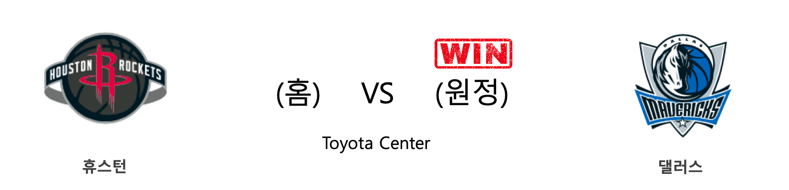
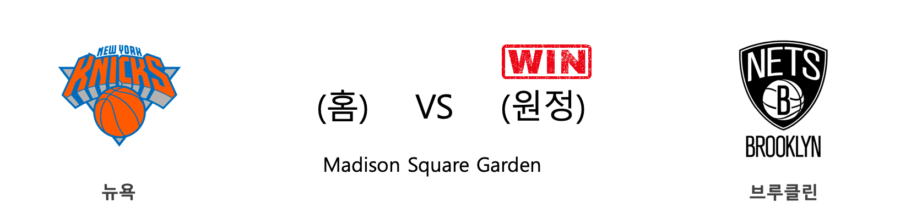

####  휴스턴(홈) VS 댈러스(원정) 

<table class="tg">
  <tr>
    <th class="tg-rr9t">HOU</th>
    <th class="tg-rr9t">팀</th>
    <th class="tg-rr9t">DAL</th>
  </tr>
  <tr>
    <td class="tg-dcpn">0승 1패</td>
    <td class="tg-rr9t">시즌 상대전적</td>
    <td class="tg-dcpn">1승 0패</td>
  </tr>
  <tr>
    <td class="tg-dcpn">123</td>
    <td class="tg-rr9t">점수</td>
    <td class="tg-dcpn">137</td>
  </tr>
  <tr>
    <td class="tg-dcpn">35/54(65%)</td>
    <td class="tg-rr9t">2점(%)</td>
    <td class="tg-dcpn">32/57(56%)</td>
  </tr>
  <tr>
    <td class="tg-dcpn">10/44(23%)</td>
    <td class="tg-rr9t">3점(%)</td>
    <td class="tg-dcpn">17/44(39%)</td>
  </tr>
  <tr>
    <td class="tg-dcpn">23/31(74%)</td>
    <td class="tg-rr9t">자유투(%)</td>
    <td class="tg-dcpn">22/28(79%)</td>
  </tr>
  <tr>
    <td class="tg-dcpn">52</td>
    <td class="tg-rr9t">리바운드</td>
    <td class="tg-dcpn">47</td>
  </tr>
  <tr>
    <td class="tg-dcpn">26</td>
    <td class="tg-rr9t">어시스트</td>
    <td class="tg-dcpn">28</td>
  </tr>
  <tr>
    <td class="tg-dcpn">7</td>
    <td class="tg-rr9t">스틸</td>
    <td class="tg-dcpn">9</td>
  </tr>
  <tr>
    <td class="tg-dcpn">2</td>
    <td class="tg-rr9t">블록</td>
    <td class="tg-dcpn">5</td>
  </tr>
  <tr>
    <td class="tg-dcpn">11</td>
    <td class="tg-rr9t">턴오버</td>
    <td class="tg-dcpn">14</td>
  </tr>
  <tr>
    <td class="tg-dcpn">P.J.TuckerF(16) DanuelHouseJr(16) ClintCapelaC(21) RussellWestbr(27) JamesHardenG(32)</td>
    <td class="tg-rr9t">주요 득점선수</td>
    <td class="tg-dcpn">KristapsPorzi(23) LukaDoncicG(41) TimHardawayJr(31)</td>
  </tr>
</table>

#### 경기 관련 주요 기사         

[[오늘의 NBA] (11/14) 제임스 하든, 농구의 미래를 제시하다](http://sports.news.naver.com/basketball/news/read.nhn?oid=486&aid=0000001137)

[[오늘의 NBA] (11/21) 클리퍼스, 안티 볼 핸들러 세계관을 구축하다](http://sports.news.naver.com/basketball/news/read.nhn?oid=486&aid=0000001144)

[[오늘의 NBA] (11/23) 카와이 레너드, 승부를 결정짓는 사나이](http://sports.news.naver.com/basketball/news/read.nhn?oid=486&aid=0000001146)

[[오늘의 NBA] (11/19) 댈러스의 루카 복음 낭송](http://sports.news.naver.com/basketball/news/read.nhn?oid=486&aid=0000001142)

[[오늘의 NBA] (11/16) 멤피스, Grit&Grind 시대와의 성공적인 단절](http://sports.news.naver.com/basketball/news/read.nhn?oid=486&aid=0000001139)

        
        

####  워싱턴(홈) VS 새크라멘토(원정) 

<table class="tg">
  <tr>
    <th class="tg-rr9t">WAS</th>
    <th class="tg-rr9t">팀</th>
    <th class="tg-rr9t">SAC</th>
  </tr>
  <tr>
    <td class="tg-dcpn">0승 1패</td>
    <td class="tg-rr9t">시즌 상대전적</td>
    <td class="tg-dcpn">1승 0패</td>
  </tr>
  <tr>
    <td class="tg-dcpn">106</td>
    <td class="tg-rr9t">점수</td>
    <td class="tg-dcpn">113</td>
  </tr>
  <tr>
    <td class="tg-dcpn">29/58(50%)</td>
    <td class="tg-rr9t">2점(%)</td>
    <td class="tg-dcpn">28/50(56%)</td>
  </tr>
  <tr>
    <td class="tg-dcpn">13/34(38%)</td>
    <td class="tg-rr9t">3점(%)</td>
    <td class="tg-dcpn">11/31(35%)</td>
  </tr>
  <tr>
    <td class="tg-dcpn">9/12(75%)</td>
    <td class="tg-rr9t">자유투(%)</td>
    <td class="tg-dcpn">24/28(86%)</td>
  </tr>
  <tr>
    <td class="tg-dcpn">45</td>
    <td class="tg-rr9t">리바운드</td>
    <td class="tg-dcpn">39</td>
  </tr>
  <tr>
    <td class="tg-dcpn">29</td>
    <td class="tg-rr9t">어시스트</td>
    <td class="tg-dcpn">22</td>
  </tr>
  <tr>
    <td class="tg-dcpn">5</td>
    <td class="tg-rr9t">스틸</td>
    <td class="tg-dcpn">9</td>
  </tr>
  <tr>
    <td class="tg-dcpn">2</td>
    <td class="tg-rr9t">블록</td>
    <td class="tg-dcpn">5</td>
  </tr>
  <tr>
    <td class="tg-dcpn">16</td>
    <td class="tg-rr9t">턴오버</td>
    <td class="tg-dcpn">13</td>
  </tr>
  <tr>
    <td class="tg-dcpn">BradleyBealG(20) IsaiahThomasG(17)</td>
    <td class="tg-rr9t">주요 득점선수</td>
    <td class="tg-dcpn">RichaunHolmes(16) BogdanBogdano(21) BuddyHieldG(18) HarrisonBarne(26)</td>
  </tr>
</table>

#### 경기 관련 주요 기사         

[(News Focus) NK-constitution revisions](http://yna.kr/AEN20190830002900325?did=2106m)

[[오늘의 NBA] (11/18) 새크라멘토, 리그 선두 보스턴을 제압하다](http://sports.news.naver.com/basketball/news/read.nhn?oid=486&aid=0000001141)

[[오늘의 NBA] (11/23) 카와이 레너드, 승부를 결정짓는 사나이](http://sports.news.naver.com/basketball/news/read.nhn?oid=486&aid=0000001146)

        
        

####  뉴욕(홈) VS 브루클린(원정) 

<table class="tg">
  <tr>
    <th class="tg-rr9t">NYK</th>
    <th class="tg-rr9t">팀</th>
    <th class="tg-rr9t">BKN</th>
  </tr>
  <tr>
    <td class="tg-dcpn">0승 2패</td>
    <td class="tg-rr9t">시즌 상대전적</td>
    <td class="tg-dcpn">2승 0패</td>
  </tr>
  <tr>
    <td class="tg-dcpn">101</td>
    <td class="tg-rr9t">점수</td>
    <td class="tg-dcpn">103</td>
  </tr>
  <tr>
    <td class="tg-dcpn">19/45(42%)</td>
    <td class="tg-rr9t">2점(%)</td>
    <td class="tg-dcpn">17/39(44%)</td>
  </tr>
  <tr>
    <td class="tg-dcpn">18/35(51%)</td>
    <td class="tg-rr9t">3점(%)</td>
    <td class="tg-dcpn">14/38(37%)</td>
  </tr>
  <tr>
    <td class="tg-dcpn">9/16(56%)</td>
    <td class="tg-rr9t">자유투(%)</td>
    <td class="tg-dcpn">27/34(79%)</td>
  </tr>
  <tr>
    <td class="tg-dcpn">43</td>
    <td class="tg-rr9t">리바운드</td>
    <td class="tg-dcpn">35</td>
  </tr>
  <tr>
    <td class="tg-dcpn">22</td>
    <td class="tg-rr9t">어시스트</td>
    <td class="tg-dcpn">18</td>
  </tr>
  <tr>
    <td class="tg-dcpn">6</td>
    <td class="tg-rr9t">스틸</td>
    <td class="tg-dcpn">6</td>
  </tr>
  <tr>
    <td class="tg-dcpn">4</td>
    <td class="tg-rr9t">블록</td>
    <td class="tg-dcpn">1</td>
  </tr>
  <tr>
    <td class="tg-dcpn">16</td>
    <td class="tg-rr9t">턴오버</td>
    <td class="tg-dcpn">11</td>
  </tr>
  <tr>
    <td class="tg-dcpn">MarcusMorrisS(26) JuliusRandleF(15)</td>
    <td class="tg-rr9t">주요 득점선수</td>
    <td class="tg-dcpn">JarrettAllenC(18) SpencerDinwid(30)</td>
  </tr>
</table>

#### 경기 관련 주요 기사         

[[오늘의 NBA] (11/25) 댈러스, 공격이 승리를 부른다!](http://sports.news.naver.com/basketball/news/read.nhn?oid=486&aid=0000001148)

[[오늘의 NBA] (11/23) 카와이 레너드, 승부를 결정짓는 사나이](http://sports.news.naver.com/basketball/news/read.nhn?oid=486&aid=0000001146)

[[오늘의 NBA] (11/19) 댈러스의 루카 복음 낭송](http://sports.news.naver.com/basketball/news/read.nhn?oid=486&aid=0000001142)

[[오늘의 NBA] (11/24) 잭 라빈, GSW 스플래쉬 브라더스를 소환하다](http://sports.news.naver.com/basketball/news/read.nhn?oid=486&aid=0000001147)

[[오늘의 NBA] (11/21) 클리퍼스, 안티 볼 핸들러 세계관을 구축하다](http://sports.news.naver.com/basketball/news/read.nhn?oid=486&aid=0000001144)

        
        

####  덴버(홈) VS 피닉스(원정) 

<table class="tg">
  <tr>
    <th class="tg-rr9t">DEN</th>
    <th class="tg-rr9t">팀</th>
    <th class="tg-rr9t">PHX</th>
  </tr>
  <tr>
    <td class="tg-dcpn">2승 0패</td>
    <td class="tg-rr9t">시즌 상대전적</td>
    <td class="tg-dcpn">0승 2패</td>
  </tr>
  <tr>
    <td class="tg-dcpn">116</td>
    <td class="tg-rr9t">점수</td>
    <td class="tg-dcpn">104</td>
  </tr>
  <tr>
    <td class="tg-dcpn">29/60(48%)</td>
    <td class="tg-rr9t">2점(%)</td>
    <td class="tg-dcpn">29/47(62%)</td>
  </tr>
  <tr>
    <td class="tg-dcpn">14/31(45%)</td>
    <td class="tg-rr9t">3점(%)</td>
    <td class="tg-dcpn">12/35(34%)</td>
  </tr>
  <tr>
    <td class="tg-dcpn">16/23(70%)</td>
    <td class="tg-rr9t">자유투(%)</td>
    <td class="tg-dcpn">10/12(83%)</td>
  </tr>
  <tr>
    <td class="tg-dcpn">52</td>
    <td class="tg-rr9t">리바운드</td>
    <td class="tg-dcpn">36</td>
  </tr>
  <tr>
    <td class="tg-dcpn">24</td>
    <td class="tg-rr9t">어시스트</td>
    <td class="tg-dcpn">25</td>
  </tr>
  <tr>
    <td class="tg-dcpn">4</td>
    <td class="tg-rr9t">스틸</td>
    <td class="tg-dcpn">4</td>
  </tr>
  <tr>
    <td class="tg-dcpn">2</td>
    <td class="tg-rr9t">블록</td>
    <td class="tg-dcpn">2</td>
  </tr>
  <tr>
    <td class="tg-dcpn">10</td>
    <td class="tg-rr9t">턴오버</td>
    <td class="tg-dcpn">12</td>
  </tr>
  <tr>
    <td class="tg-dcpn">WillBartonF(22) PaulMillsapF(23) JamalMurrayG(22)</td>
    <td class="tg-rr9t">주요 득점선수</td>
    <td class="tg-dcpn">CheickDiallo(22) ElieOkobo(16) DarioSaricF(18)</td>
  </tr>
</table>

#### 경기 관련 주요 기사         

[[오늘의 NBA] (11/23) 카와이 레너드, 승부를 결정짓는 사나이](http://sports.news.naver.com/basketball/news/read.nhn?oid=486&aid=0000001146)

[[오늘의 NBA] (11/25) 댈러스, 공격이 승리를 부른다!](http://sports.news.naver.com/basketball/news/read.nhn?oid=486&aid=0000001148)

[[오늘의 NBA] (11/21) 클리퍼스, 안티 볼 핸들러 세계관을 구축하다](http://sports.news.naver.com/basketball/news/read.nhn?oid=486&aid=0000001144)

[[오늘의 NBA] (11/24) 잭 라빈, GSW 스플래쉬 브라더스를 소환하다](http://sports.news.naver.com/basketball/news/read.nhn?oid=486&aid=0000001147)

[[오늘의 NBA] (11/16) 멤피스, Grit&Grind 시대와의 성공적인 단절](http://sports.news.naver.com/basketball/news/read.nhn?oid=486&aid=0000001139)

        
        

####  LA클리퍼스(홈) VS 뉴올리언스(원정) 

<table class="tg">
  <tr>
    <th class="tg-rr9t">LAC</th>
    <th class="tg-rr9t">팀</th>
    <th class="tg-rr9t">NOP</th>
  </tr>
  <tr>
    <td class="tg-dcpn">1승 1패</td>
    <td class="tg-rr9t">시즌 상대전적</td>
    <td class="tg-dcpn">1승 1패</td>
  </tr>
  <tr>
    <td class="tg-dcpn">134</td>
    <td class="tg-rr9t">점수</td>
    <td class="tg-dcpn">109</td>
  </tr>
  <tr>
    <td class="tg-dcpn">30/55(55%)</td>
    <td class="tg-rr9t">2점(%)</td>
    <td class="tg-dcpn">30/57(53%)</td>
  </tr>
  <tr>
    <td class="tg-dcpn">16/43(37%)</td>
    <td class="tg-rr9t">3점(%)</td>
    <td class="tg-dcpn">13/41(32%)</td>
  </tr>
  <tr>
    <td class="tg-dcpn">26/33(79%)</td>
    <td class="tg-rr9t">자유투(%)</td>
    <td class="tg-dcpn">10/18(56%)</td>
  </tr>
  <tr>
    <td class="tg-dcpn">56</td>
    <td class="tg-rr9t">리바운드</td>
    <td class="tg-dcpn">45</td>
  </tr>
  <tr>
    <td class="tg-dcpn">27</td>
    <td class="tg-rr9t">어시스트</td>
    <td class="tg-dcpn">26</td>
  </tr>
  <tr>
    <td class="tg-dcpn">4</td>
    <td class="tg-rr9t">스틸</td>
    <td class="tg-dcpn">1</td>
  </tr>
  <tr>
    <td class="tg-dcpn">5</td>
    <td class="tg-rr9t">블록</td>
    <td class="tg-dcpn">6</td>
  </tr>
  <tr>
    <td class="tg-dcpn">6</td>
    <td class="tg-rr9t">턴오버</td>
    <td class="tg-dcpn">9</td>
  </tr>
  <tr>
    <td class="tg-dcpn">LouWilliams(19) MontrezlHarre(34) PaulGeorgeG(18) KawhiLeonardF(26)</td>
    <td class="tg-rr9t">주요 득점선수</td>
    <td class="tg-dcpn">JrueHolidayG(18) E'TwaunMoore(17) BrandonIngram(24)</td>
  </tr>
</table>

#### 경기 관련 주요 기사         

[[오늘의 NBA] (11/25) 댈러스, 공격이 승리를 부른다!](http://sports.news.naver.com/basketball/news/read.nhn?oid=486&aid=0000001148)

[[오늘의 NBA] (11/24) 잭 라빈, GSW 스플래쉬 브라더스를 소환하다](http://sports.news.naver.com/basketball/news/read.nhn?oid=486&aid=0000001147)

['역대 4번째' 하든, 평균 43점 넣으면서 7연승 견인](http://www.spotvnews.co.kr/?mod=news&act=articleView&idxno=329662)

['홀리데이 36점' NOP, '폴 조지 복귀한' LAC 제압](http://www.spotvnews.co.kr/?mod=news&act=articleView&idxno=329159)

[[오늘의 NBA] (11/23) 카와이 레너드, 승부를 결정짓는 사나이](http://sports.news.naver.com/basketball/news/read.nhn?oid=486&aid=0000001146)

        
        

#### 리그 (Eastern) 순위
    

<table class="tg">
  <tr>
    <th class="tg-d14o">순위</th>
    <th class="tg-d14o">팀명</th>
    <th class="tg-d14o">경기수</th>
    <th class="tg-d14o">승</th>
    <th class="tg-d14o">패</th>
    <th class="tg-d14o">승차</th>
    <th class="tg-d14o">승률</th>
  </tr>
  
<tr>
    <td class="tg-50j8">1</td>
    <td class="tg-50j8">MIL</td>
    <td class="tg-50j8">16</td>
    <td class="tg-50j8">13</td>
    <td class="tg-50j8">3</td>
    <td class="tg-50j8">1</td>
    <td class="tg-50j8">0.812</td>
</tr>

<tr>
    <td class="tg-50j8">2</td>
    <td class="tg-50j8">TOR</td>
    <td class="tg-50j8">15</td>
    <td class="tg-50j8">11</td>
    <td class="tg-50j8">4</td>
    <td class="tg-50j8">3</td>
    <td class="tg-50j8">0.733</td>
</tr>

<tr>
    <td class="tg-50j8">2</td>
    <td class="tg-50j8">MIA</td>
    <td class="tg-50j8">15</td>
    <td class="tg-50j8">11</td>
    <td class="tg-50j8">4</td>
    <td class="tg-50j8">3</td>
    <td class="tg-50j8">0.733</td>
</tr>

<tr>
    <td class="tg-50j8">2</td>
    <td class="tg-50j8">BOS</td>
    <td class="tg-50j8">15</td>
    <td class="tg-50j8">11</td>
    <td class="tg-50j8">4</td>
    <td class="tg-50j8">3</td>
    <td class="tg-50j8">0.733</td>
</tr>

<tr>
    <td class="tg-50j8">5</td>
    <td class="tg-50j8">PHI</td>
    <td class="tg-50j8">16</td>
    <td class="tg-50j8">11</td>
    <td class="tg-50j8">5</td>
    <td class="tg-50j8">3</td>
    <td class="tg-50j8">0.688</td>
</tr>

<tr>
    <td class="tg-50j8">6</td>
    <td class="tg-50j8">IND</td>
    <td class="tg-50j8">15</td>
    <td class="tg-50j8">9</td>
    <td class="tg-50j8">6</td>
    <td class="tg-50j8">5</td>
    <td class="tg-50j8">0.6</td>
</tr>

<tr>
    <td class="tg-50j8">7</td>
    <td class="tg-50j8">BKN</td>
    <td class="tg-50j8">16</td>
    <td class="tg-50j8">8</td>
    <td class="tg-50j8">8</td>
    <td class="tg-50j8">6</td>
    <td class="tg-50j8">0.5</td>
</tr>

<tr>
    <td class="tg-50j8">8</td>
    <td class="tg-50j8">ORL</td>
    <td class="tg-50j8">15</td>
    <td class="tg-50j8">6</td>
    <td class="tg-50j8">9</td>
    <td class="tg-50j8">8</td>
    <td class="tg-50j8">0.4</td>
</tr>

<tr>
    <td class="tg-50j8">9</td>
    <td class="tg-50j8">CHA</td>
    <td class="tg-50j8">17</td>
    <td class="tg-50j8">6</td>
    <td class="tg-50j8">11</td>
    <td class="tg-50j8">8</td>
    <td class="tg-50j8">0.353</td>
</tr>

<tr>
    <td class="tg-50j8">9</td>
    <td class="tg-50j8">CHI</td>
    <td class="tg-50j8">17</td>
    <td class="tg-50j8">6</td>
    <td class="tg-50j8">11</td>
    <td class="tg-50j8">8</td>
    <td class="tg-50j8">0.353</td>
</tr>

<tr>
    <td class="tg-50j8">11</td>
    <td class="tg-50j8">WAS</td>
    <td class="tg-50j8">14</td>
    <td class="tg-50j8">5</td>
    <td class="tg-50j8">9</td>
    <td class="tg-50j8">9</td>
    <td class="tg-50j8">0.357</td>
</tr>

<tr>
    <td class="tg-50j8">12</td>
    <td class="tg-50j8">CLE</td>
    <td class="tg-50j8">16</td>
    <td class="tg-50j8">5</td>
    <td class="tg-50j8">11</td>
    <td class="tg-50j8">9</td>
    <td class="tg-50j8">0.312</td>
</tr>

<tr>
    <td class="tg-50j8">12</td>
    <td class="tg-50j8">DET</td>
    <td class="tg-50j8">16</td>
    <td class="tg-50j8">5</td>
    <td class="tg-50j8">11</td>
    <td class="tg-50j8">9</td>
    <td class="tg-50j8">0.312</td>
</tr>

<tr>
    <td class="tg-50j8">14</td>
    <td class="tg-50j8">ATL</td>
    <td class="tg-50j8">16</td>
    <td class="tg-50j8">4</td>
    <td class="tg-50j8">12</td>
    <td class="tg-50j8">10</td>
    <td class="tg-50j8">0.25</td>
</tr>

<tr>
    <td class="tg-50j8">15</td>
    <td class="tg-50j8">NYK</td>
    <td class="tg-50j8">17</td>
    <td class="tg-50j8">4</td>
    <td class="tg-50j8">13</td>
    <td class="tg-50j8">10</td>
    <td class="tg-50j8">0.235</td>
</tr>
</table> 
#### 리그 (Western) 순위
    

<table class="tg">
  <tr>
    <th class="tg-d14o">순위</th>
    <th class="tg-d14o">팀명</th>
    <th class="tg-d14o">경기수</th>
    <th class="tg-d14o">승</th>
    <th class="tg-d14o">패</th>
    <th class="tg-d14o">승차</th>
    <th class="tg-d14o">승률</th>
  </tr>
  
<tr>
    <td class="tg-50j8">1</td>
    <td class="tg-50j8">LAL</td>
    <td class="tg-50j8">16</td>
    <td class="tg-50j8">14</td>
    <td class="tg-50j8">2</td>
    <td class="tg-50j8">0</td>
    <td class="tg-50j8">0.875</td>
</tr>

<tr>
    <td class="tg-50j8">2</td>
    <td class="tg-50j8">DEN</td>
    <td class="tg-50j8">15</td>
    <td class="tg-50j8">12</td>
    <td class="tg-50j8">3</td>
    <td class="tg-50j8">2</td>
    <td class="tg-50j8">0.8</td>
</tr>

<tr>
    <td class="tg-50j8">3</td>
    <td class="tg-50j8">LAC</td>
    <td class="tg-50j8">17</td>
    <td class="tg-50j8">12</td>
    <td class="tg-50j8">5</td>
    <td class="tg-50j8">2</td>
    <td class="tg-50j8">0.706</td>
</tr>

<tr>
    <td class="tg-50j8">4</td>
    <td class="tg-50j8">UTA</td>
    <td class="tg-50j8">16</td>
    <td class="tg-50j8">11</td>
    <td class="tg-50j8">5</td>
    <td class="tg-50j8">3</td>
    <td class="tg-50j8">0.688</td>
</tr>

<tr>
    <td class="tg-50j8">4</td>
    <td class="tg-50j8">DAL</td>
    <td class="tg-50j8">16</td>
    <td class="tg-50j8">11</td>
    <td class="tg-50j8">5</td>
    <td class="tg-50j8">3</td>
    <td class="tg-50j8">0.688</td>
</tr>

<tr>
    <td class="tg-50j8">6</td>
    <td class="tg-50j8">HOU</td>
    <td class="tg-50j8">17</td>
    <td class="tg-50j8">11</td>
    <td class="tg-50j8">6</td>
    <td class="tg-50j8">3</td>
    <td class="tg-50j8">0.647</td>
</tr>

<tr>
    <td class="tg-50j8">7</td>
    <td class="tg-50j8">MIN</td>
    <td class="tg-50j8">16</td>
    <td class="tg-50j8">8</td>
    <td class="tg-50j8">8</td>
    <td class="tg-50j8">6</td>
    <td class="tg-50j8">0.5</td>
</tr>

<tr>
    <td class="tg-50j8">7</td>
    <td class="tg-50j8">PHX</td>
    <td class="tg-50j8">16</td>
    <td class="tg-50j8">8</td>
    <td class="tg-50j8">8</td>
    <td class="tg-50j8">6</td>
    <td class="tg-50j8">0.5</td>
</tr>

<tr>
    <td class="tg-50j8">9</td>
    <td class="tg-50j8">SAC</td>
    <td class="tg-50j8">15</td>
    <td class="tg-50j8">7</td>
    <td class="tg-50j8">8</td>
    <td class="tg-50j8">7</td>
    <td class="tg-50j8">0.467</td>
</tr>

<tr>
    <td class="tg-50j8">10</td>
    <td class="tg-50j8">NOP</td>
    <td class="tg-50j8">17</td>
    <td class="tg-50j8">6</td>
    <td class="tg-50j8">11</td>
    <td class="tg-50j8">8</td>
    <td class="tg-50j8">0.353</td>
</tr>

<tr>
    <td class="tg-50j8">10</td>
    <td class="tg-50j8">SAS</td>
    <td class="tg-50j8">17</td>
    <td class="tg-50j8">6</td>
    <td class="tg-50j8">11</td>
    <td class="tg-50j8">8</td>
    <td class="tg-50j8">0.353</td>
</tr>

<tr>
    <td class="tg-50j8">12</td>
    <td class="tg-50j8">OKC</td>
    <td class="tg-50j8">15</td>
    <td class="tg-50j8">5</td>
    <td class="tg-50j8">10</td>
    <td class="tg-50j8">9</td>
    <td class="tg-50j8">0.333</td>
</tr>

<tr>
    <td class="tg-50j8">12</td>
    <td class="tg-50j8">MEM</td>
    <td class="tg-50j8">15</td>
    <td class="tg-50j8">5</td>
    <td class="tg-50j8">10</td>
    <td class="tg-50j8">9</td>
    <td class="tg-50j8">0.333</td>
</tr>

<tr>
    <td class="tg-50j8">14</td>
    <td class="tg-50j8">POR</td>
    <td class="tg-50j8">17</td>
    <td class="tg-50j8">5</td>
    <td class="tg-50j8">12</td>
    <td class="tg-50j8">9</td>
    <td class="tg-50j8">0.294</td>
</tr>

<tr>
    <td class="tg-50j8">15</td>
    <td class="tg-50j8">GSW</td>
    <td class="tg-50j8">17</td>
    <td class="tg-50j8">3</td>
    <td class="tg-50j8">14</td>
    <td class="tg-50j8">11</td>
    <td class="tg-50j8">0.176</td>
</tr>
</table> 

        
        
#nba #미국농구 #엔비에이 #농구분석 #토토 #스포츠토토 #경기예측 #농구결과 #20191125 #휴스턴 #댈러스 #워싱턴 #새크라멘토 #뉴욕 #브루클린 #덴버 #피닉스 #LA클리퍼스 #뉴올리언스 #휴스턴댈러스 #워싱턴새크라멘토 #뉴욕브루클린 #덴버피닉스 #LA클리퍼스뉴올리언스 