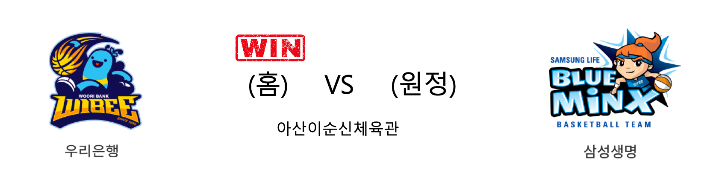

####  우리은행(홈) VS 삼성생명(원정) 

<table class="tg">
  <tr>
    <th class="tg-rr9t">우리은행</th>
    <th class="tg-rr9t">팀</th>
    <th class="tg-rr9t">삼성생명</th>
  </tr>
  <tr>
    <td class="tg-dcpn">1승 1패</td>
    <td class="tg-rr9t">시즌 상대전적</td>
    <td class="tg-dcpn">1승 1패</td>
  </tr>
  <tr>
    <td class="tg-dcpn">79</td>
    <td class="tg-rr9t">점수</td>
    <td class="tg-dcpn">53</td>
  </tr>
  <tr>
    <td class="tg-dcpn">20/35(57%)</td>
    <td class="tg-rr9t">2점(%)</td>
    <td class="tg-dcpn">13/45(29%)</td>
  </tr>
  <tr>
    <td class="tg-dcpn">8/25(32%)</td>
    <td class="tg-rr9t">3점(%)</td>
    <td class="tg-dcpn">6/25(24%)</td>
  </tr>
  <tr>
    <td class="tg-dcpn">15/18(83%)</td>
    <td class="tg-rr9t">자유투(%)</td>
    <td class="tg-dcpn">9/11(82%)</td>
  </tr>
  <tr>
    <td class="tg-dcpn">48</td>
    <td class="tg-rr9t">리바운드</td>
    <td class="tg-dcpn">29</td>
  </tr>
  <tr>
    <td class="tg-dcpn">19</td>
    <td class="tg-rr9t">어시스트</td>
    <td class="tg-dcpn">13</td>
  </tr>
  <tr>
    <td class="tg-dcpn">8</td>
    <td class="tg-rr9t">스틸</td>
    <td class="tg-dcpn">7</td>
  </tr>
  <tr>
    <td class="tg-dcpn">14</td>
    <td class="tg-rr9t">블록</td>
    <td class="tg-dcpn">11</td>
  </tr>
  <tr>
    <td class="tg-dcpn">18</td>
    <td class="tg-rr9t">턴오버</td>
    <td class="tg-dcpn">19</td>
  </tr>
  <tr>
    <td class="tg-dcpn">박혜진(19) 그레이(16)</td>
    <td class="tg-rr9t">주요 득점선수</td>
    <td class="tg-dcpn">카이저(18)</td>
  </tr>
</table>

#### 경기 관련 주요 기사         

[박혜진·박지현 활약 우리은행, 5연승 단독 선두](https://www.nocutnews.co.kr/news/5249305)

[그레이 '완벽 골밑 접수' 우리은행, 삼성생명 격파하며 5연승](http://www.rookie.co.kr/news/articleView.html?idxno=35302)

[우리은행, 삼성생명에 1R 패배 설욕하고 5연승 '단독 1위'](https://news.sbs.co.kr/news/endPage.do?news_id=N1005538007&plink=ORI&cooper=NAVER)

[우리은행, 삼성생명 격파](http://news1.kr/photos/view/?3935426)

        
        

#### 리그 순위

<table class="tg">
  <tr>
    <th class="tg-d14o">순위</th>
    <th class="tg-d14o">팀명</th>
    <th class="tg-d14o">경기수</th>
    <th class="tg-d14o">승</th>
    <th class="tg-d14o">패</th>
    <th class="tg-d14o">승차</th>
    <th class="tg-d14o">승률</th>
  </tr>
  
<tr>
    <td class="tg-50j8">1</td>
    <td class="tg-50j8">우리은행</td>
    <td class="tg-50j8">6</td>
    <td class="tg-50j8">5</td>
    <td class="tg-50j8">1</td>
    <td class="tg-50j8">0</td>
    <td class="tg-50j8">0.833</td>
</tr>

<tr>
    <td class="tg-50j8">2</td>
    <td class="tg-50j8">KB스타즈</td>
    <td class="tg-50j8">5</td>
    <td class="tg-50j8">4</td>
    <td class="tg-50j8">1</td>
    <td class="tg-50j8">1</td>
    <td class="tg-50j8">0.8</td>
</tr>

<tr>
    <td class="tg-50j8">3</td>
    <td class="tg-50j8">삼성생명</td>
    <td class="tg-50j8">6</td>
    <td class="tg-50j8">3</td>
    <td class="tg-50j8">3</td>
    <td class="tg-50j8">2</td>
    <td class="tg-50j8">0.5</td>
</tr>

<tr>
    <td class="tg-50j8">4</td>
    <td class="tg-50j8">KEB하나</td>
    <td class="tg-50j8">5</td>
    <td class="tg-50j8">2</td>
    <td class="tg-50j8">3</td>
    <td class="tg-50j8">3</td>
    <td class="tg-50j8">0.4</td>
</tr>

<tr>
    <td class="tg-50j8">4</td>
    <td class="tg-50j8">신한은행</td>
    <td class="tg-50j8">5</td>
    <td class="tg-50j8">2</td>
    <td class="tg-50j8">3</td>
    <td class="tg-50j8">3</td>
    <td class="tg-50j8">0.4</td>
</tr>

<tr>
    <td class="tg-50j8">6</td>
    <td class="tg-50j8">BNK썸</td>
    <td class="tg-50j8">5</td>
    <td class="tg-50j8">0</td>
    <td class="tg-50j8">5</td>
    <td class="tg-50j8">5</td>
    <td class="tg-50j8">0.0</td>
</tr>
</table> 

        
        
