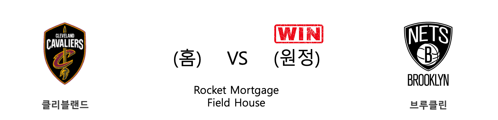
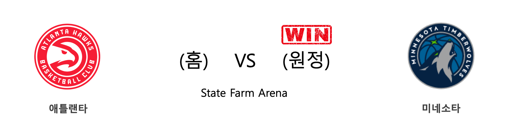
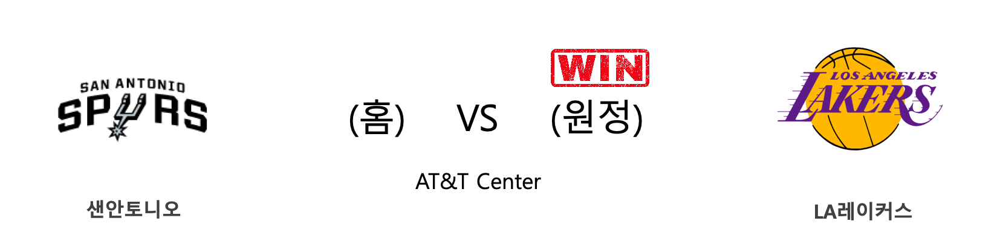
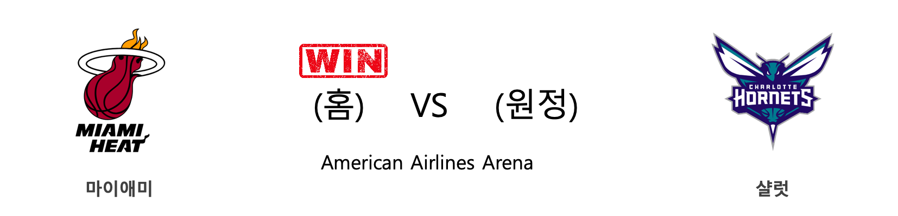
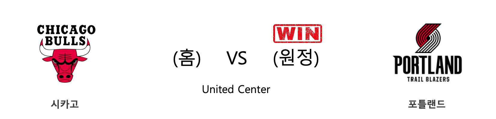
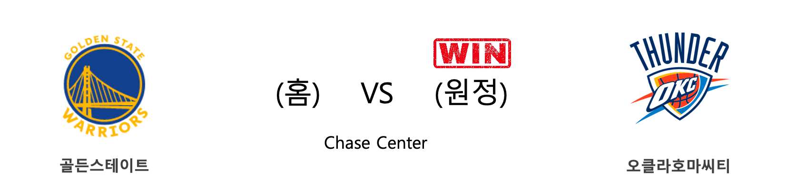
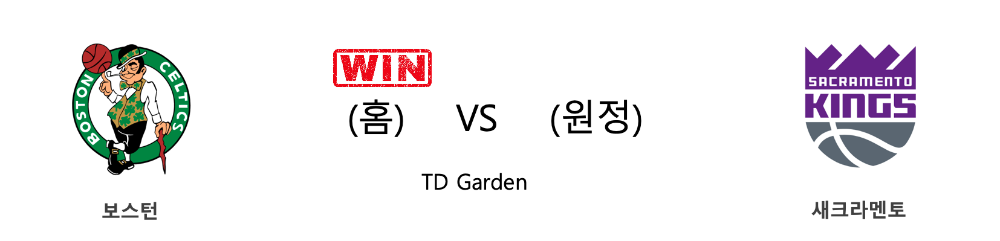
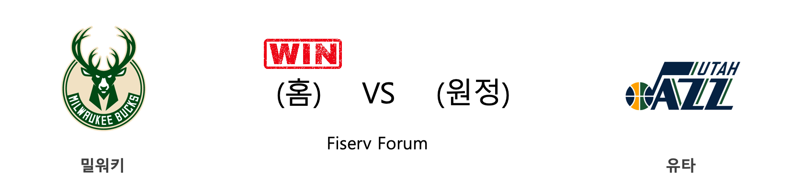

####  클리블랜드(홈) VS 브루클린(원정) 

<table class="tg">
  <tr>
    <th class="tg-rr9t">CLE</th>
    <th class="tg-rr9t">팀</th>
    <th class="tg-rr9t">BKN</th>
  </tr>
  <tr>
    <td class="tg-dcpn">0승 1패</td>
    <td class="tg-rr9t">시즌 상대전적</td>
    <td class="tg-dcpn">1승 0패</td>
  </tr>
  <tr>
    <td class="tg-dcpn">106</td>
    <td class="tg-rr9t">점수</td>
    <td class="tg-dcpn">108</td>
  </tr>
  <tr>
    <td class="tg-dcpn">27/62(44%)</td>
    <td class="tg-rr9t">2점(%)</td>
    <td class="tg-dcpn">33/60(55%)</td>
  </tr>
  <tr>
    <td class="tg-dcpn">13/32(41%)</td>
    <td class="tg-rr9t">3점(%)</td>
    <td class="tg-dcpn">11/34(32%)</td>
  </tr>
  <tr>
    <td class="tg-dcpn">13/20(65%)</td>
    <td class="tg-rr9t">자유투(%)</td>
    <td class="tg-dcpn">9/11(82%)</td>
  </tr>
  <tr>
    <td class="tg-dcpn">45</td>
    <td class="tg-rr9t">리바운드</td>
    <td class="tg-dcpn">48</td>
  </tr>
  <tr>
    <td class="tg-dcpn">24</td>
    <td class="tg-rr9t">어시스트</td>
    <td class="tg-dcpn">29</td>
  </tr>
  <tr>
    <td class="tg-dcpn">5</td>
    <td class="tg-rr9t">스틸</td>
    <td class="tg-dcpn">8</td>
  </tr>
  <tr>
    <td class="tg-dcpn">4</td>
    <td class="tg-rr9t">블록</td>
    <td class="tg-dcpn">10</td>
  </tr>
  <tr>
    <td class="tg-dcpn">10</td>
    <td class="tg-rr9t">턴오버</td>
    <td class="tg-dcpn">9</td>
  </tr>
  <tr>
    <td class="tg-dcpn">LarryNanceJr.(20) CollinSextonG(18) CediOsmanF(15) JordanClarkso(23)</td>
    <td class="tg-rr9t">주요 득점선수</td>
    <td class="tg-dcpn">JoeHarrisF(19) SpencerDinwid(23) TaureanPrince(18) JarrettAllenC(22)</td>
  </tr>
</table>

#### 경기 관련 주요 기사         

[[오늘의 NBA] (11/21) 클리퍼스, 안티 볼 핸들러 세계관을 구축하다](http://sports.news.naver.com/basketball/news/read.nhn?oid=486&aid=0000001144)

[[오늘의 NBA] (11/23) 카와이 레너드, 승부를 결정짓는 사나이](http://sports.news.naver.com/basketball/news/read.nhn?oid=486&aid=0000001146)

[[오늘의 NBA] (11/19) 댈러스의 루카 복음 낭송](http://sports.news.naver.com/basketball/news/read.nhn?oid=486&aid=0000001142)

[[오늘의 NBA] (11/25) 댈러스, 공격이 승리를 부른다!](http://sports.news.naver.com/basketball/news/read.nhn?oid=486&aid=0000001148)

[[오늘의 NBA] (11/24) 잭 라빈, GSW 스플래쉬 브라더스를 소환하다](http://sports.news.naver.com/basketball/news/read.nhn?oid=486&aid=0000001147)

        
        

####  애틀랜타(홈) VS 미네소타(원정) 

<table class="tg">
  <tr>
    <th class="tg-rr9t">ATL</th>
    <th class="tg-rr9t">팀</th>
    <th class="tg-rr9t">MIN</th>
  </tr>
  <tr>
    <td class="tg-dcpn">0승 1패</td>
    <td class="tg-rr9t">시즌 상대전적</td>
    <td class="tg-dcpn">1승 0패</td>
  </tr>
  <tr>
    <td class="tg-dcpn">113</td>
    <td class="tg-rr9t">점수</td>
    <td class="tg-dcpn">125</td>
  </tr>
  <tr>
    <td class="tg-dcpn">31/62(50%)</td>
    <td class="tg-rr9t">2점(%)</td>
    <td class="tg-dcpn">26/55(47%)</td>
  </tr>
  <tr>
    <td class="tg-dcpn">10/32(31%)</td>
    <td class="tg-rr9t">3점(%)</td>
    <td class="tg-dcpn">15/35(43%)</td>
  </tr>
  <tr>
    <td class="tg-dcpn">21/26(81%)</td>
    <td class="tg-rr9t">자유투(%)</td>
    <td class="tg-dcpn">28/36(78%)</td>
  </tr>
  <tr>
    <td class="tg-dcpn">42</td>
    <td class="tg-rr9t">리바운드</td>
    <td class="tg-dcpn">47</td>
  </tr>
  <tr>
    <td class="tg-dcpn">26</td>
    <td class="tg-rr9t">어시스트</td>
    <td class="tg-dcpn">27</td>
  </tr>
  <tr>
    <td class="tg-dcpn">6</td>
    <td class="tg-rr9t">스틸</td>
    <td class="tg-dcpn">10</td>
  </tr>
  <tr>
    <td class="tg-dcpn">4</td>
    <td class="tg-rr9t">블록</td>
    <td class="tg-dcpn">6</td>
  </tr>
  <tr>
    <td class="tg-dcpn">17</td>
    <td class="tg-rr9t">턴오버</td>
    <td class="tg-dcpn">13</td>
  </tr>
  <tr>
    <td class="tg-dcpn">TraeYoungG(37) JabariParkerF(22)</td>
    <td class="tg-rr9t">주요 득점선수</td>
    <td class="tg-dcpn">Karl-AnthonyT(28) AndrewWiggins(25)</td>
  </tr>
</table>

#### 경기 관련 주요 기사         

[[오늘의 NBA] (11/21) 클리퍼스, 안티 볼 핸들러 세계관을 구축하다](http://sports.news.naver.com/basketball/news/read.nhn?oid=486&aid=0000001144)

[[오늘의 NBA] (11/23) 카와이 레너드, 승부를 결정짓는 사나이](http://sports.news.naver.com/basketball/news/read.nhn?oid=486&aid=0000001146)

[美전망, 류현진 영입 가능한 구단 'MIN·TEX·ATL·SD·LAA'](http://www.mydaily.co.kr/new_yk/html/read.php?newsid=201911090115307518&ext=na)

[[오늘의 NBA] (11/24) 잭 라빈, GSW 스플래쉬 브라더스를 소환하다](http://sports.news.naver.com/basketball/news/read.nhn?oid=486&aid=0000001147)

[[오늘의 NBA] (11/17) 샬럿, 설계된 플레이 연출의 달인](http://sports.news.naver.com/basketball/news/read.nhn?oid=486&aid=0000001140)

        
        

####  샌안토니오(홈) VS LA레이커스(원정) 

<table class="tg">
  <tr>
    <th class="tg-rr9t">SAS</th>
    <th class="tg-rr9t">팀</th>
    <th class="tg-rr9t">LAL</th>
  </tr>
  <tr>
    <td class="tg-dcpn">0승 2패</td>
    <td class="tg-rr9t">시즌 상대전적</td>
    <td class="tg-dcpn">2승 0패</td>
  </tr>
  <tr>
    <td class="tg-dcpn">104</td>
    <td class="tg-rr9t">점수</td>
    <td class="tg-dcpn">114</td>
  </tr>
  <tr>
    <td class="tg-dcpn">31/63(49%)</td>
    <td class="tg-rr9t">2점(%)</td>
    <td class="tg-dcpn">30/56(54%)</td>
  </tr>
  <tr>
    <td class="tg-dcpn">10/25(40%)</td>
    <td class="tg-rr9t">3점(%)</td>
    <td class="tg-dcpn">14/33(42%)</td>
  </tr>
  <tr>
    <td class="tg-dcpn">12/15(80%)</td>
    <td class="tg-rr9t">자유투(%)</td>
    <td class="tg-dcpn">12/18(67%)</td>
  </tr>
  <tr>
    <td class="tg-dcpn">41</td>
    <td class="tg-rr9t">리바운드</td>
    <td class="tg-dcpn">40</td>
  </tr>
  <tr>
    <td class="tg-dcpn">23</td>
    <td class="tg-rr9t">어시스트</td>
    <td class="tg-dcpn">28</td>
  </tr>
  <tr>
    <td class="tg-dcpn">4</td>
    <td class="tg-rr9t">스틸</td>
    <td class="tg-dcpn">7</td>
  </tr>
  <tr>
    <td class="tg-dcpn">5</td>
    <td class="tg-rr9t">블록</td>
    <td class="tg-dcpn">6</td>
  </tr>
  <tr>
    <td class="tg-dcpn">13</td>
    <td class="tg-rr9t">턴오버</td>
    <td class="tg-dcpn">9</td>
  </tr>
  <tr>
    <td class="tg-dcpn">DeMarDeRozanF(24) LaMarcusAldri(30)</td>
    <td class="tg-rr9t">주요 득점선수</td>
    <td class="tg-dcpn">AnthonyDavisF(19) LeBronJamesF(33)</td>
  </tr>
</table>

#### 경기 관련 주요 기사         

[[오늘의 NBA] (11/23) 카와이 레너드, 승부를 결정짓는 사나이](http://sports.news.naver.com/basketball/news/read.nhn?oid=486&aid=0000001146)

[[오늘의 NBA] (11/24) 잭 라빈, GSW 스플래쉬 브라더스를 소환하다](http://sports.news.naver.com/basketball/news/read.nhn?oid=486&aid=0000001147)

[[오늘의 NBA] (11/21) 클리퍼스, 안티 볼 핸들러 세계관을 구축하다](http://sports.news.naver.com/basketball/news/read.nhn?oid=486&aid=0000001144)

[[오늘의 NBA] (11/26) 마크 가솔, 조엘 엠비드의 영원한 악몽](http://sports.news.naver.com/basketball/news/read.nhn?oid=486&aid=0000001149)

[[오늘의 NBA] (11/19) 댈러스의 루카 복음 낭송](http://sports.news.naver.com/basketball/news/read.nhn?oid=486&aid=0000001142)

        
        

####  디트로이트(홈) VS 올랜도(원정) 

<table class="tg">
  <tr>
    <th class="tg-rr9t">DET</th>
    <th class="tg-rr9t">팀</th>
    <th class="tg-rr9t">ORL</th>
  </tr>
  <tr>
    <td class="tg-dcpn">1승 0패</td>
    <td class="tg-rr9t">시즌 상대전적</td>
    <td class="tg-dcpn">0승 1패</td>
  </tr>
  <tr>
    <td class="tg-dcpn">103</td>
    <td class="tg-rr9t">점수</td>
    <td class="tg-dcpn">88</td>
  </tr>
  <tr>
    <td class="tg-dcpn">20/41(49%)</td>
    <td class="tg-rr9t">2점(%)</td>
    <td class="tg-dcpn">24/59(41%)</td>
  </tr>
  <tr>
    <td class="tg-dcpn">14/38(37%)</td>
    <td class="tg-rr9t">3점(%)</td>
    <td class="tg-dcpn">8/25(32%)</td>
  </tr>
  <tr>
    <td class="tg-dcpn">21/25(84%)</td>
    <td class="tg-rr9t">자유투(%)</td>
    <td class="tg-dcpn">16/22(73%)</td>
  </tr>
  <tr>
    <td class="tg-dcpn">49</td>
    <td class="tg-rr9t">리바운드</td>
    <td class="tg-dcpn">41</td>
  </tr>
  <tr>
    <td class="tg-dcpn">23</td>
    <td class="tg-rr9t">어시스트</td>
    <td class="tg-dcpn">15</td>
  </tr>
  <tr>
    <td class="tg-dcpn">6</td>
    <td class="tg-rr9t">스틸</td>
    <td class="tg-dcpn">8</td>
  </tr>
  <tr>
    <td class="tg-dcpn">5</td>
    <td class="tg-rr9t">블록</td>
    <td class="tg-dcpn">7</td>
  </tr>
  <tr>
    <td class="tg-dcpn">13</td>
    <td class="tg-rr9t">턴오버</td>
    <td class="tg-dcpn">9</td>
  </tr>
  <tr>
    <td class="tg-dcpn">LukeKennardG(20) BlakeGriffinF(17)</td>
    <td class="tg-rr9t">주요 득점선수</td>
    <td class="tg-dcpn">TerrenceRoss(19) EvanFournierG(17) MarkelleFultz(16)</td>
  </tr>
</table>

#### 경기 관련 주요 기사         

[[오늘의 NBA] (11/18) 새크라멘토, 리그 선두 보스턴을 제압하다](http://sports.news.naver.com/basketball/news/read.nhn?oid=486&aid=0000001141)

[[오늘의 NBA] (11/24) 잭 라빈, GSW 스플래쉬 브라더스를 소환하다](http://sports.news.naver.com/basketball/news/read.nhn?oid=486&aid=0000001147)

[[오늘의 NBA] (11/21) 클리퍼스, 안티 볼 핸들러 세계관을 구축하다](http://sports.news.naver.com/basketball/news/read.nhn?oid=486&aid=0000001144)

[[오늘의 NBA] (11/17) 샬럿, 설계된 플레이 연출의 달인](http://sports.news.naver.com/basketball/news/read.nhn?oid=486&aid=0000001140)

[[오늘의 NBA] (11/26) 마크 가솔, 조엘 엠비드의 영원한 악몽](http://sports.news.naver.com/basketball/news/read.nhn?oid=486&aid=0000001149)

        
        

####  마이애미(홈) VS 샬럿(원정) 

<table class="tg">
  <tr>
    <th class="tg-rr9t">MIA</th>
    <th class="tg-rr9t">팀</th>
    <th class="tg-rr9t">CHA</th>
  </tr>
  <tr>
    <td class="tg-dcpn">1승 0패</td>
    <td class="tg-rr9t">시즌 상대전적</td>
    <td class="tg-dcpn">0승 1패</td>
  </tr>
  <tr>
    <td class="tg-dcpn">117</td>
    <td class="tg-rr9t">점수</td>
    <td class="tg-dcpn">100</td>
  </tr>
  <tr>
    <td class="tg-dcpn">27/46(59%)</td>
    <td class="tg-rr9t">2점(%)</td>
    <td class="tg-dcpn">27/54(50%)</td>
  </tr>
  <tr>
    <td class="tg-dcpn">13/31(42%)</td>
    <td class="tg-rr9t">3점(%)</td>
    <td class="tg-dcpn">9/33(27%)</td>
  </tr>
  <tr>
    <td class="tg-dcpn">24/28(86%)</td>
    <td class="tg-rr9t">자유투(%)</td>
    <td class="tg-dcpn">19/25(76%)</td>
  </tr>
  <tr>
    <td class="tg-dcpn">49</td>
    <td class="tg-rr9t">리바운드</td>
    <td class="tg-dcpn">35</td>
  </tr>
  <tr>
    <td class="tg-dcpn">29</td>
    <td class="tg-rr9t">어시스트</td>
    <td class="tg-dcpn">25</td>
  </tr>
  <tr>
    <td class="tg-dcpn">9</td>
    <td class="tg-rr9t">스틸</td>
    <td class="tg-dcpn">11</td>
  </tr>
  <tr>
    <td class="tg-dcpn">3</td>
    <td class="tg-rr9t">블록</td>
    <td class="tg-dcpn">0</td>
  </tr>
  <tr>
    <td class="tg-dcpn">18</td>
    <td class="tg-rr9t">턴오버</td>
    <td class="tg-dcpn">13</td>
  </tr>
  <tr>
    <td class="tg-dcpn">KellyOlynyk(15) JimmyButlerF(21) TylerHerro(18) BamAdebayoF(21) KendrickNunnG(19)</td>
    <td class="tg-rr9t">주요 득점선수</td>
    <td class="tg-dcpn">Devonte'Graha(16) TerryRozierG(19)</td>
  </tr>
</table>

#### 경기 관련 주요 기사         

[[오늘의 NBA] (11/21) 클리퍼스, 안티 볼 핸들러 세계관을 구축하다](http://sports.news.naver.com/basketball/news/read.nhn?oid=486&aid=0000001144)

[[오늘의 NBA] (11/26) 마크 가솔, 조엘 엠비드의 영원한 악몽](http://sports.news.naver.com/basketball/news/read.nhn?oid=486&aid=0000001149)

[[오늘의 NBA] (11/17) 샬럿, 설계된 플레이 연출의 달인](http://sports.news.naver.com/basketball/news/read.nhn?oid=486&aid=0000001140)

[[오늘의 NBA] (11/23) 카와이 레너드, 승부를 결정짓는 사나이](http://sports.news.naver.com/basketball/news/read.nhn?oid=486&aid=0000001146)

[[오늘의 NBA] (11/24) 잭 라빈, GSW 스플래쉬 브라더스를 소환하다](http://sports.news.naver.com/basketball/news/read.nhn?oid=486&aid=0000001147)

        
        

####  시카고(홈) VS 포틀랜드(원정) 

<table class="tg">
  <tr>
    <th class="tg-rr9t">CHI</th>
    <th class="tg-rr9t">팀</th>
    <th class="tg-rr9t">POR</th>
  </tr>
  <tr>
    <td class="tg-dcpn">0승 1패</td>
    <td class="tg-rr9t">시즌 상대전적</td>
    <td class="tg-dcpn">1승 0패</td>
  </tr>
  <tr>
    <td class="tg-dcpn">94</td>
    <td class="tg-rr9t">점수</td>
    <td class="tg-dcpn">117</td>
  </tr>
  <tr>
    <td class="tg-dcpn">27/47(57%)</td>
    <td class="tg-rr9t">2점(%)</td>
    <td class="tg-dcpn">38/62(61%)</td>
  </tr>
  <tr>
    <td class="tg-dcpn">9/39(23%)</td>
    <td class="tg-rr9t">3점(%)</td>
    <td class="tg-dcpn">8/27(30%)</td>
  </tr>
  <tr>
    <td class="tg-dcpn">13/20(65%)</td>
    <td class="tg-rr9t">자유투(%)</td>
    <td class="tg-dcpn">17/22(77%)</td>
  </tr>
  <tr>
    <td class="tg-dcpn">37</td>
    <td class="tg-rr9t">리바운드</td>
    <td class="tg-dcpn">55</td>
  </tr>
  <tr>
    <td class="tg-dcpn">24</td>
    <td class="tg-rr9t">어시스트</td>
    <td class="tg-dcpn">23</td>
  </tr>
  <tr>
    <td class="tg-dcpn">8</td>
    <td class="tg-rr9t">스틸</td>
    <td class="tg-dcpn">8</td>
  </tr>
  <tr>
    <td class="tg-dcpn">4</td>
    <td class="tg-rr9t">블록</td>
    <td class="tg-dcpn">5</td>
  </tr>
  <tr>
    <td class="tg-dcpn">17</td>
    <td class="tg-rr9t">턴오버</td>
    <td class="tg-dcpn">15</td>
  </tr>
  <tr>
    <td class="tg-dcpn">ZachLaVineG(18)</td>
    <td class="tg-rr9t">주요 득점선수</td>
    <td class="tg-dcpn">CJMcCollumG(21) CarmeloAnthon(25) RodneyHoodF(16)</td>
  </tr>
</table>

#### 경기 관련 주요 기사         

[[오늘의 NBA] (11/24) 잭 라빈, GSW 스플래쉬 브라더스를 소환하다](http://sports.news.naver.com/basketball/news/read.nhn?oid=486&aid=0000001147)

[권순우 바젤오픈 예선 출전](http://www.tennispeople.kr/news/articleView.html?idxno=10618)

[[오늘의 NBA] (11/19) 댈러스의 루카 복음 낭송](http://sports.news.naver.com/basketball/news/read.nhn?oid=486&aid=0000001142)

[[오늘의 NBA] (11/17) 샬럿, 설계된 플레이 연출의 달인](http://sports.news.naver.com/basketball/news/read.nhn?oid=486&aid=0000001140)

[[오늘의 NBA] (11/21) 클리퍼스, 안티 볼 핸들러 세계관을 구축하다](http://sports.news.naver.com/basketball/news/read.nhn?oid=486&aid=0000001144)

        
        

####  골든스테이트(홈) VS 오클라호마씨티(원정) 

<table class="tg">
  <tr>
    <th class="tg-rr9t">GSW</th>
    <th class="tg-rr9t">팀</th>
    <th class="tg-rr9t">OKC</th>
  </tr>
  <tr>
    <td class="tg-dcpn">0승 3패</td>
    <td class="tg-rr9t">시즌 상대전적</td>
    <td class="tg-dcpn">3승 0패</td>
  </tr>
  <tr>
    <td class="tg-dcpn">97</td>
    <td class="tg-rr9t">점수</td>
    <td class="tg-dcpn">100</td>
  </tr>
  <tr>
    <td class="tg-dcpn">28/69(41%)</td>
    <td class="tg-rr9t">2점(%)</td>
    <td class="tg-dcpn">29/53(55%)</td>
  </tr>
  <tr>
    <td class="tg-dcpn">9/20(45%)</td>
    <td class="tg-rr9t">3점(%)</td>
    <td class="tg-dcpn">11/32(34%)</td>
  </tr>
  <tr>
    <td class="tg-dcpn">14/16(88%)</td>
    <td class="tg-rr9t">자유투(%)</td>
    <td class="tg-dcpn">9/11(82%)</td>
  </tr>
  <tr>
    <td class="tg-dcpn">41</td>
    <td class="tg-rr9t">리바운드</td>
    <td class="tg-dcpn">43</td>
  </tr>
  <tr>
    <td class="tg-dcpn">27</td>
    <td class="tg-rr9t">어시스트</td>
    <td class="tg-dcpn">26</td>
  </tr>
  <tr>
    <td class="tg-dcpn">10</td>
    <td class="tg-rr9t">스틸</td>
    <td class="tg-dcpn">5</td>
  </tr>
  <tr>
    <td class="tg-dcpn">7</td>
    <td class="tg-rr9t">블록</td>
    <td class="tg-dcpn">13</td>
  </tr>
  <tr>
    <td class="tg-dcpn">12</td>
    <td class="tg-rr9t">턴오버</td>
    <td class="tg-dcpn">15</td>
  </tr>
  <tr>
    <td class="tg-dcpn">KyBowmanG(24) GlennRobinson(25)</td>
    <td class="tg-rr9t">주요 득점선수</td>
    <td class="tg-dcpn">DaniloGallina(15) ChrisPaulG(20) DennisSchrode(22)</td>
  </tr>
</table>

#### 경기 관련 주요 기사         

[[오늘의 NBA] (11/17) 샬럿, 설계된 플레이 연출의 달인](http://sports.news.naver.com/basketball/news/read.nhn?oid=486&aid=0000001140)

[[오늘의 NBA] (11/21) 클리퍼스, 안티 볼 핸들러 세계관을 구축하다](http://sports.news.naver.com/basketball/news/read.nhn?oid=486&aid=0000001144)

[[오늘의 NBA] (11/26) 마크 가솔, 조엘 엠비드의 영원한 악몽](http://sports.news.naver.com/basketball/news/read.nhn?oid=486&aid=0000001149)

[[오늘의 NBA] (11/23) 카와이 레너드, 승부를 결정짓는 사나이](http://sports.news.naver.com/basketball/news/read.nhn?oid=486&aid=0000001146)

['CP3 결승 득점' OKC, GSW에 짜릿한 역전승](http://www.rookie.co.kr/news/articleView.html?idxno=35332)

        
        

####  보스턴(홈) VS 새크라멘토(원정) 

<table class="tg">
  <tr>
    <th class="tg-rr9t">BOS</th>
    <th class="tg-rr9t">팀</th>
    <th class="tg-rr9t">SAC</th>
  </tr>
  <tr>
    <td class="tg-dcpn">1승 1패</td>
    <td class="tg-rr9t">시즌 상대전적</td>
    <td class="tg-dcpn">1승 1패</td>
  </tr>
  <tr>
    <td class="tg-dcpn">103</td>
    <td class="tg-rr9t">점수</td>
    <td class="tg-dcpn">102</td>
  </tr>
  <tr>
    <td class="tg-dcpn">31/55(56%)</td>
    <td class="tg-rr9t">2점(%)</td>
    <td class="tg-dcpn">19/32(59%)</td>
  </tr>
  <tr>
    <td class="tg-dcpn">7/30(23%)</td>
    <td class="tg-rr9t">3점(%)</td>
    <td class="tg-dcpn">18/47(38%)</td>
  </tr>
  <tr>
    <td class="tg-dcpn">20/23(87%)</td>
    <td class="tg-rr9t">자유투(%)</td>
    <td class="tg-dcpn">10/15(67%)</td>
  </tr>
  <tr>
    <td class="tg-dcpn">38</td>
    <td class="tg-rr9t">리바운드</td>
    <td class="tg-dcpn">36</td>
  </tr>
  <tr>
    <td class="tg-dcpn">20</td>
    <td class="tg-rr9t">어시스트</td>
    <td class="tg-dcpn">28</td>
  </tr>
  <tr>
    <td class="tg-dcpn">10</td>
    <td class="tg-rr9t">스틸</td>
    <td class="tg-dcpn">3</td>
  </tr>
  <tr>
    <td class="tg-dcpn">4</td>
    <td class="tg-rr9t">블록</td>
    <td class="tg-dcpn">8</td>
  </tr>
  <tr>
    <td class="tg-dcpn">11</td>
    <td class="tg-rr9t">턴오버</td>
    <td class="tg-dcpn">14</td>
  </tr>
  <tr>
    <td class="tg-dcpn">MarcusSmartG(17) JaysonTatumF(20) JaylenBrownG(24)</td>
    <td class="tg-rr9t">주요 득점선수</td>
    <td class="tg-dcpn">HarrisonBarne(20) BuddyHieldG(41)</td>
  </tr>
</table>

#### 경기 관련 주요 기사         

[[오늘의 NBA] (11/19) 댈러스의 루카 복음 낭송](http://sports.news.naver.com/basketball/news/read.nhn?oid=486&aid=0000001142)

[[오늘의 NBA] (11/21) 클리퍼스, 안티 볼 핸들러 세계관을 구축하다](http://sports.news.naver.com/basketball/news/read.nhn?oid=486&aid=0000001144)

[[오늘의 NBA] (11/16) 멤피스, Grit&Grind 시대와의 성공적인 단절](http://sports.news.naver.com/basketball/news/read.nhn?oid=486&aid=0000001139)

[[오늘의 NBA] (11/23) 카와이 레너드, 승부를 결정짓는 사나이](http://sports.news.naver.com/basketball/news/read.nhn?oid=486&aid=0000001146)

[[오늘의 NBA] (11/18) 새크라멘토, 리그 선두 보스턴을 제압하다](http://sports.news.naver.com/basketball/news/read.nhn?oid=486&aid=0000001141)

        
        

####  토론토(홈) VS 필라델피아(원정) 

<table class="tg">
  <tr>
    <th class="tg-rr9t">TOR</th>
    <th class="tg-rr9t">팀</th>
    <th class="tg-rr9t">PHI</th>
  </tr>
  <tr>
    <td class="tg-dcpn">1승 0패</td>
    <td class="tg-rr9t">시즌 상대전적</td>
    <td class="tg-dcpn">0승 1패</td>
  </tr>
  <tr>
    <td class="tg-dcpn">101</td>
    <td class="tg-rr9t">점수</td>
    <td class="tg-dcpn">96</td>
  </tr>
  <tr>
    <td class="tg-dcpn">27/50(54%)</td>
    <td class="tg-rr9t">2점(%)</td>
    <td class="tg-dcpn">21/48(44%)</td>
  </tr>
  <tr>
    <td class="tg-dcpn">11/34(32%)</td>
    <td class="tg-rr9t">3점(%)</td>
    <td class="tg-dcpn">15/40(38%)</td>
  </tr>
  <tr>
    <td class="tg-dcpn">14/22(64%)</td>
    <td class="tg-rr9t">자유투(%)</td>
    <td class="tg-dcpn">9/16(56%)</td>
  </tr>
  <tr>
    <td class="tg-dcpn">40</td>
    <td class="tg-rr9t">리바운드</td>
    <td class="tg-dcpn">51</td>
  </tr>
  <tr>
    <td class="tg-dcpn">27</td>
    <td class="tg-rr9t">어시스트</td>
    <td class="tg-dcpn">25</td>
  </tr>
  <tr>
    <td class="tg-dcpn">5</td>
    <td class="tg-rr9t">스틸</td>
    <td class="tg-dcpn">7</td>
  </tr>
  <tr>
    <td class="tg-dcpn">5</td>
    <td class="tg-rr9t">블록</td>
    <td class="tg-dcpn">3</td>
  </tr>
  <tr>
    <td class="tg-dcpn">10</td>
    <td class="tg-rr9t">턴오버</td>
    <td class="tg-dcpn">16</td>
  </tr>
  <tr>
    <td class="tg-dcpn">FredVanVleetG(24) RondaeHollis-(16) PascalSiakamF(25)</td>
    <td class="tg-rr9t">주요 득점선수</td>
    <td class="tg-dcpn">TobiasHarrisF(18) JoshRichardso(25)</td>
  </tr>
</table>

#### 경기 관련 주요 기사         

[[오늘의 NBA] (11/24) 잭 라빈, GSW 스플래쉬 브라더스를 소환하다](http://sports.news.naver.com/basketball/news/read.nhn?oid=486&aid=0000001147)

[[오늘의 NBA] (11/18) 새크라멘토, 리그 선두 보스턴을 제압하다](http://sports.news.naver.com/basketball/news/read.nhn?oid=486&aid=0000001141)

[[오늘의 NBA] (11/26) 마크 가솔, 조엘 엠비드의 영원한 악몽](http://sports.news.naver.com/basketball/news/read.nhn?oid=486&aid=0000001149)

[[오늘의 NBA] (11/19) 댈러스의 루카 복음 낭송](http://sports.news.naver.com/basketball/news/read.nhn?oid=486&aid=0000001142)

[[오늘의 NBA] (11/21) 클리퍼스, 안티 볼 핸들러 세계관을 구축하다](http://sports.news.naver.com/basketball/news/read.nhn?oid=486&aid=0000001144)

        
        

####  인디애나(홈) VS 멤피스(원정) 

<table class="tg">
  <tr>
    <th class="tg-rr9t">IND</th>
    <th class="tg-rr9t">팀</th>
    <th class="tg-rr9t">MEM</th>
  </tr>
  <tr>
    <td class="tg-dcpn">1승 0패</td>
    <td class="tg-rr9t">시즌 상대전적</td>
    <td class="tg-dcpn">0승 1패</td>
  </tr>
  <tr>
    <td class="tg-dcpn">126</td>
    <td class="tg-rr9t">점수</td>
    <td class="tg-dcpn">114</td>
  </tr>
  <tr>
    <td class="tg-dcpn">33/61(54%)</td>
    <td class="tg-rr9t">2점(%)</td>
    <td class="tg-dcpn">33/68(49%)</td>
  </tr>
  <tr>
    <td class="tg-dcpn">18/33(55%)</td>
    <td class="tg-rr9t">3점(%)</td>
    <td class="tg-dcpn">13/29(45%)</td>
  </tr>
  <tr>
    <td class="tg-dcpn">6/10(60%)</td>
    <td class="tg-rr9t">자유투(%)</td>
    <td class="tg-dcpn">9/13(69%)</td>
  </tr>
  <tr>
    <td class="tg-dcpn">47</td>
    <td class="tg-rr9t">리바운드</td>
    <td class="tg-dcpn">41</td>
  </tr>
  <tr>
    <td class="tg-dcpn">29</td>
    <td class="tg-rr9t">어시스트</td>
    <td class="tg-dcpn">30</td>
  </tr>
  <tr>
    <td class="tg-dcpn">6</td>
    <td class="tg-rr9t">스틸</td>
    <td class="tg-dcpn">6</td>
  </tr>
  <tr>
    <td class="tg-dcpn">6</td>
    <td class="tg-rr9t">블록</td>
    <td class="tg-dcpn">5</td>
  </tr>
  <tr>
    <td class="tg-dcpn">13</td>
    <td class="tg-rr9t">턴오버</td>
    <td class="tg-dcpn">8</td>
  </tr>
  <tr>
    <td class="tg-dcpn">JeremyLambG(19) T.J.WarrenF(26) AaronHoliday(16)</td>
    <td class="tg-rr9t">주요 득점선수</td>
    <td class="tg-dcpn">BrandonClarke(17) JaMorantG(19) JarenJacksonJ(28)</td>
  </tr>
</table>

#### 경기 관련 주요 기사         

[[오늘의 NBA] (11/9) 위긴스 vs 러셀, 타깃 센터의 명승부](http://sports.news.naver.com/basketball/news/read.nhn?oid=486&aid=0000001132)

[[오늘의 NBA] (11/18) 새크라멘토, 리그 선두 보스턴을 제압하다](http://sports.news.naver.com/basketball/news/read.nhn?oid=486&aid=0000001141)

[[오늘의 NBA] (11/24) 잭 라빈, GSW 스플래쉬 브라더스를 소환하다](http://sports.news.naver.com/basketball/news/read.nhn?oid=486&aid=0000001147)

[[오늘의 NBA] (11/16) 멤피스, Grit&Grind 시대와의 성공적인 단절](http://sports.news.naver.com/basketball/news/read.nhn?oid=486&aid=0000001139)

[[오늘의 NBA] (11/17) 샬럿, 설계된 플레이 연출의 달인](http://sports.news.naver.com/basketball/news/read.nhn?oid=486&aid=0000001140)

        
        

####  밀워키(홈) VS 유타(원정) 

<table class="tg">
  <tr>
    <th class="tg-rr9t">MIL</th>
    <th class="tg-rr9t">팀</th>
    <th class="tg-rr9t">UTA</th>
  </tr>
  <tr>
    <td class="tg-dcpn">1승 1패</td>
    <td class="tg-rr9t">시즌 상대전적</td>
    <td class="tg-dcpn">1승 1패</td>
  </tr>
  <tr>
    <td class="tg-dcpn">122</td>
    <td class="tg-rr9t">점수</td>
    <td class="tg-dcpn">118</td>
  </tr>
  <tr>
    <td class="tg-dcpn">30/56(54%)</td>
    <td class="tg-rr9t">2점(%)</td>
    <td class="tg-dcpn">22/40(55%)</td>
  </tr>
  <tr>
    <td class="tg-dcpn">13/41(32%)</td>
    <td class="tg-rr9t">3점(%)</td>
    <td class="tg-dcpn">21/45(47%)</td>
  </tr>
  <tr>
    <td class="tg-dcpn">23/29(79%)</td>
    <td class="tg-rr9t">자유투(%)</td>
    <td class="tg-dcpn">11/12(92%)</td>
  </tr>
  <tr>
    <td class="tg-dcpn">49</td>
    <td class="tg-rr9t">리바운드</td>
    <td class="tg-dcpn">40</td>
  </tr>
  <tr>
    <td class="tg-dcpn">21</td>
    <td class="tg-rr9t">어시스트</td>
    <td class="tg-dcpn">29</td>
  </tr>
  <tr>
    <td class="tg-dcpn">6</td>
    <td class="tg-rr9t">스틸</td>
    <td class="tg-dcpn">4</td>
  </tr>
  <tr>
    <td class="tg-dcpn">6</td>
    <td class="tg-rr9t">블록</td>
    <td class="tg-dcpn">6</td>
  </tr>
  <tr>
    <td class="tg-dcpn">9</td>
    <td class="tg-rr9t">턴오버</td>
    <td class="tg-dcpn">16</td>
  </tr>
  <tr>
    <td class="tg-dcpn">WesleyMatthew(19) GiannisAnteto(50)</td>
    <td class="tg-rr9t">주요 득점선수</td>
    <td class="tg-dcpn">JoeIngles(15) DonovanMitche(20) BojanBogdanov(24)</td>
  </tr>
</table>

#### 경기 관련 주요 기사         

[[오늘의 NBA] (11/17) 샬럿, 설계된 플레이 연출의 달인](http://sports.news.naver.com/basketball/news/read.nhn?oid=486&aid=0000001140)

[[오늘의 NBA] (11/24) 잭 라빈, GSW 스플래쉬 브라더스를 소환하다](http://sports.news.naver.com/basketball/news/read.nhn?oid=486&aid=0000001147)

[[오늘의 NBA] (11/19) 댈러스의 루카 복음 낭송](http://sports.news.naver.com/basketball/news/read.nhn?oid=486&aid=0000001142)

[[오늘의 NBA] (11/21) 클리퍼스, 안티 볼 핸들러 세계관을 구축하다](http://sports.news.naver.com/basketball/news/read.nhn?oid=486&aid=0000001144)

[[오늘의 NBA] (11/26) 마크 가솔, 조엘 엠비드의 영원한 악몽](http://sports.news.naver.com/basketball/news/read.nhn?oid=486&aid=0000001149)

        
        

#### 리그 (Eastern) 순위
    

<table class="tg">
  <tr>
    <th class="tg-d14o">순위</th>
    <th class="tg-d14o">팀명</th>
    <th class="tg-d14o">경기수</th>
    <th class="tg-d14o">승</th>
    <th class="tg-d14o">패</th>
    <th class="tg-d14o">승차</th>
    <th class="tg-d14o">승률</th>
  </tr>
  
<tr>
    <td class="tg-50j8">1</td>
    <td class="tg-50j8">MIL</td>
    <td class="tg-50j8">17</td>
    <td class="tg-50j8">14</td>
    <td class="tg-50j8">3</td>
    <td class="tg-50j8">1</td>
    <td class="tg-50j8">0.824</td>
</tr>

<tr>
    <td class="tg-50j8">2</td>
    <td class="tg-50j8">MIA</td>
    <td class="tg-50j8">16</td>
    <td class="tg-50j8">12</td>
    <td class="tg-50j8">4</td>
    <td class="tg-50j8">3</td>
    <td class="tg-50j8">0.75</td>
</tr>

<tr>
    <td class="tg-50j8">2</td>
    <td class="tg-50j8">BOS</td>
    <td class="tg-50j8">16</td>
    <td class="tg-50j8">12</td>
    <td class="tg-50j8">4</td>
    <td class="tg-50j8">3</td>
    <td class="tg-50j8">0.75</td>
</tr>

<tr>
    <td class="tg-50j8">2</td>
    <td class="tg-50j8">TOR</td>
    <td class="tg-50j8">16</td>
    <td class="tg-50j8">12</td>
    <td class="tg-50j8">4</td>
    <td class="tg-50j8">3</td>
    <td class="tg-50j8">0.75</td>
</tr>

<tr>
    <td class="tg-50j8">5</td>
    <td class="tg-50j8">PHI</td>
    <td class="tg-50j8">17</td>
    <td class="tg-50j8">11</td>
    <td class="tg-50j8">6</td>
    <td class="tg-50j8">4</td>
    <td class="tg-50j8">0.647</td>
</tr>

<tr>
    <td class="tg-50j8">6</td>
    <td class="tg-50j8">IND</td>
    <td class="tg-50j8">16</td>
    <td class="tg-50j8">10</td>
    <td class="tg-50j8">6</td>
    <td class="tg-50j8">5</td>
    <td class="tg-50j8">0.625</td>
</tr>

<tr>
    <td class="tg-50j8">7</td>
    <td class="tg-50j8">BKN</td>
    <td class="tg-50j8">17</td>
    <td class="tg-50j8">9</td>
    <td class="tg-50j8">8</td>
    <td class="tg-50j8">6</td>
    <td class="tg-50j8">0.529</td>
</tr>

<tr>
    <td class="tg-50j8">8</td>
    <td class="tg-50j8">ORL</td>
    <td class="tg-50j8">16</td>
    <td class="tg-50j8">6</td>
    <td class="tg-50j8">10</td>
    <td class="tg-50j8">9</td>
    <td class="tg-50j8">0.375</td>
</tr>

<tr>
    <td class="tg-50j8">9</td>
    <td class="tg-50j8">DET</td>
    <td class="tg-50j8">17</td>
    <td class="tg-50j8">6</td>
    <td class="tg-50j8">11</td>
    <td class="tg-50j8">9</td>
    <td class="tg-50j8">0.353</td>
</tr>

<tr>
    <td class="tg-50j8">10</td>
    <td class="tg-50j8">CHI</td>
    <td class="tg-50j8">18</td>
    <td class="tg-50j8">6</td>
    <td class="tg-50j8">12</td>
    <td class="tg-50j8">9</td>
    <td class="tg-50j8">0.333</td>
</tr>

<tr>
    <td class="tg-50j8">10</td>
    <td class="tg-50j8">CHA</td>
    <td class="tg-50j8">18</td>
    <td class="tg-50j8">6</td>
    <td class="tg-50j8">12</td>
    <td class="tg-50j8">9</td>
    <td class="tg-50j8">0.333</td>
</tr>

<tr>
    <td class="tg-50j8">12</td>
    <td class="tg-50j8">WAS</td>
    <td class="tg-50j8">14</td>
    <td class="tg-50j8">5</td>
    <td class="tg-50j8">9</td>
    <td class="tg-50j8">10</td>
    <td class="tg-50j8">0.357</td>
</tr>

<tr>
    <td class="tg-50j8">13</td>
    <td class="tg-50j8">CLE</td>
    <td class="tg-50j8">17</td>
    <td class="tg-50j8">5</td>
    <td class="tg-50j8">12</td>
    <td class="tg-50j8">10</td>
    <td class="tg-50j8">0.294</td>
</tr>

<tr>
    <td class="tg-50j8">14</td>
    <td class="tg-50j8">ATL</td>
    <td class="tg-50j8">17</td>
    <td class="tg-50j8">4</td>
    <td class="tg-50j8">13</td>
    <td class="tg-50j8">11</td>
    <td class="tg-50j8">0.235</td>
</tr>

<tr>
    <td class="tg-50j8">14</td>
    <td class="tg-50j8">NYK</td>
    <td class="tg-50j8">17</td>
    <td class="tg-50j8">4</td>
    <td class="tg-50j8">13</td>
    <td class="tg-50j8">11</td>
    <td class="tg-50j8">0.235</td>
</tr>
</table> 
#### 리그 (Western) 순위
    

<table class="tg">
  <tr>
    <th class="tg-d14o">순위</th>
    <th class="tg-d14o">팀명</th>
    <th class="tg-d14o">경기수</th>
    <th class="tg-d14o">승</th>
    <th class="tg-d14o">패</th>
    <th class="tg-d14o">승차</th>
    <th class="tg-d14o">승률</th>
  </tr>
  
<tr>
    <td class="tg-50j8">1</td>
    <td class="tg-50j8">LAL</td>
    <td class="tg-50j8">17</td>
    <td class="tg-50j8">15</td>
    <td class="tg-50j8">2</td>
    <td class="tg-50j8">0</td>
    <td class="tg-50j8">0.882</td>
</tr>

<tr>
    <td class="tg-50j8">2</td>
    <td class="tg-50j8">DEN</td>
    <td class="tg-50j8">15</td>
    <td class="tg-50j8">12</td>
    <td class="tg-50j8">3</td>
    <td class="tg-50j8">3</td>
    <td class="tg-50j8">0.8</td>
</tr>

<tr>
    <td class="tg-50j8">3</td>
    <td class="tg-50j8">LAC</td>
    <td class="tg-50j8">17</td>
    <td class="tg-50j8">12</td>
    <td class="tg-50j8">5</td>
    <td class="tg-50j8">3</td>
    <td class="tg-50j8">0.706</td>
</tr>

<tr>
    <td class="tg-50j8">4</td>
    <td class="tg-50j8">DAL</td>
    <td class="tg-50j8">16</td>
    <td class="tg-50j8">11</td>
    <td class="tg-50j8">5</td>
    <td class="tg-50j8">4</td>
    <td class="tg-50j8">0.688</td>
</tr>

<tr>
    <td class="tg-50j8">5</td>
    <td class="tg-50j8">HOU</td>
    <td class="tg-50j8">17</td>
    <td class="tg-50j8">11</td>
    <td class="tg-50j8">6</td>
    <td class="tg-50j8">4</td>
    <td class="tg-50j8">0.647</td>
</tr>

<tr>
    <td class="tg-50j8">5</td>
    <td class="tg-50j8">UTA</td>
    <td class="tg-50j8">17</td>
    <td class="tg-50j8">11</td>
    <td class="tg-50j8">6</td>
    <td class="tg-50j8">4</td>
    <td class="tg-50j8">0.647</td>
</tr>

<tr>
    <td class="tg-50j8">7</td>
    <td class="tg-50j8">MIN</td>
    <td class="tg-50j8">17</td>
    <td class="tg-50j8">9</td>
    <td class="tg-50j8">8</td>
    <td class="tg-50j8">6</td>
    <td class="tg-50j8">0.529</td>
</tr>

<tr>
    <td class="tg-50j8">8</td>
    <td class="tg-50j8">PHX</td>
    <td class="tg-50j8">16</td>
    <td class="tg-50j8">8</td>
    <td class="tg-50j8">8</td>
    <td class="tg-50j8">7</td>
    <td class="tg-50j8">0.5</td>
</tr>

<tr>
    <td class="tg-50j8">9</td>
    <td class="tg-50j8">SAC</td>
    <td class="tg-50j8">16</td>
    <td class="tg-50j8">7</td>
    <td class="tg-50j8">9</td>
    <td class="tg-50j8">8</td>
    <td class="tg-50j8">0.438</td>
</tr>

<tr>
    <td class="tg-50j8">10</td>
    <td class="tg-50j8">OKC</td>
    <td class="tg-50j8">16</td>
    <td class="tg-50j8">6</td>
    <td class="tg-50j8">10</td>
    <td class="tg-50j8">9</td>
    <td class="tg-50j8">0.375</td>
</tr>

<tr>
    <td class="tg-50j8">11</td>
    <td class="tg-50j8">NOP</td>
    <td class="tg-50j8">17</td>
    <td class="tg-50j8">6</td>
    <td class="tg-50j8">11</td>
    <td class="tg-50j8">9</td>
    <td class="tg-50j8">0.353</td>
</tr>

<tr>
    <td class="tg-50j8">12</td>
    <td class="tg-50j8">POR</td>
    <td class="tg-50j8">18</td>
    <td class="tg-50j8">6</td>
    <td class="tg-50j8">12</td>
    <td class="tg-50j8">9</td>
    <td class="tg-50j8">0.333</td>
</tr>

<tr>
    <td class="tg-50j8">12</td>
    <td class="tg-50j8">SAS</td>
    <td class="tg-50j8">18</td>
    <td class="tg-50j8">6</td>
    <td class="tg-50j8">12</td>
    <td class="tg-50j8">9</td>
    <td class="tg-50j8">0.333</td>
</tr>

<tr>
    <td class="tg-50j8">14</td>
    <td class="tg-50j8">MEM</td>
    <td class="tg-50j8">16</td>
    <td class="tg-50j8">5</td>
    <td class="tg-50j8">11</td>
    <td class="tg-50j8">10</td>
    <td class="tg-50j8">0.312</td>
</tr>

<tr>
    <td class="tg-50j8">15</td>
    <td class="tg-50j8">GSW</td>
    <td class="tg-50j8">18</td>
    <td class="tg-50j8">3</td>
    <td class="tg-50j8">15</td>
    <td class="tg-50j8">12</td>
    <td class="tg-50j8">0.167</td>
</tr>
</table> 

        
        
#nba #미국농구 #엔비에이 #농구분석 #토토 #스포츠토토 #경기예측 #농구결과 #20191126 #클리블랜드 #브루클린 #애틀랜타 #미네소타 #샌안토니오 #LA레이커스 #디트로이트 #올랜도 #마이애미 #샬럿 #시카고 #포틀랜드 #골든스테이트 #오클라호마씨티 #보스턴 #새크라멘토 #토론토 #필라델피아 #인디애나 #멤피스 #밀워키 #유타 #클리블랜드브루클린 #애틀랜타미네소타 #샌안토니오LA레이커스 #디트로이트올랜도 #마이애미샬럿 #시카고포틀랜드 #골든스테이트오클라호마씨티 #보스턴새크라멘토 #토론토필라델피아 #인디애나멤피스 #밀워키유타 