####  샌안토니오(홈) VS 미네소타(원정) 
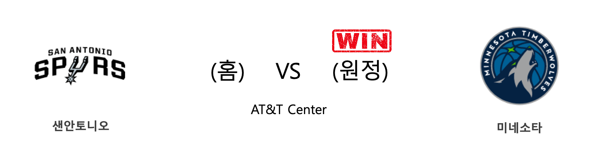

<table class="tg">
  <tr>
    <th class="tg-rr9t">SAS</th>
    <th class="tg-rr9t">팀</th>
    <th class="tg-rr9t">MIN</th>
  </tr>
  <tr>
    <td class="tg-dcpn">0승 2패</td>
    <td class="tg-rr9t">시즌 상대전적</td>
    <td class="tg-dcpn">2승 0패</td>
  </tr>
  <tr>
    <td class="tg-dcpn">101</td>
    <td class="tg-rr9t">점수</td>
    <td class="tg-dcpn">113</td>
  </tr>
  <tr>
    <td class="tg-dcpn">36/68(53%)</td>
    <td class="tg-rr9t">2점(%)</td>
    <td class="tg-dcpn">19/45(42%)</td>
  </tr>
  <tr>
    <td class="tg-dcpn">5/29(17%)</td>
    <td class="tg-rr9t">3점(%)</td>
    <td class="tg-dcpn">18/40(45%)</td>
  </tr>
  <tr>
    <td class="tg-dcpn">14/17(82%)</td>
    <td class="tg-rr9t">자유투(%)</td>
    <td class="tg-dcpn">21/27(78%)</td>
  </tr>
  <tr>
    <td class="tg-dcpn">46</td>
    <td class="tg-rr9t">리바운드</td>
    <td class="tg-dcpn">53</td>
  </tr>
  <tr>
    <td class="tg-dcpn">25</td>
    <td class="tg-rr9t">어시스트</td>
    <td class="tg-dcpn">28</td>
  </tr>
  <tr>
    <td class="tg-dcpn">4</td>
    <td class="tg-rr9t">스틸</td>
    <td class="tg-dcpn">4</td>
  </tr>
  <tr>
    <td class="tg-dcpn">9</td>
    <td class="tg-rr9t">블록</td>
    <td class="tg-dcpn">6</td>
  </tr>
  <tr>
    <td class="tg-dcpn">6</td>
    <td class="tg-rr9t">턴오버</td>
    <td class="tg-dcpn">11</td>
  </tr>
  <tr>
    <td class="tg-dcpn">DeMarDeRozanF(20) LaMarcusAldri(22)</td>
    <td class="tg-rr9t">주요 득점선수</td>
    <td class="tg-dcpn">KeitaBates-Di(16) AndrewWiggins(26) Karl-AnthonyT(23)</td>
  </tr>
</table>

#### 경기 관련 주요 기사         

[[오늘의 NBA] (11/24) 잭 라빈, GSW 스플래쉬 브라더스를 소환하다](http://sports.news.naver.com/basketball/news/read.nhn?oid=486&aid=0000001147)

[[오늘의 NBA] (11/21) 클리퍼스, 안티 볼 핸들러 세계관을 구축하다](http://sports.news.naver.com/basketball/news/read.nhn?oid=486&aid=0000001144)

[[오늘의 NBA] (11/23) 카와이 레너드, 승부를 결정짓는 사나이](http://sports.news.naver.com/basketball/news/read.nhn?oid=486&aid=0000001146)

[[오늘의 NBA] (11/17) 샬럿, 설계된 플레이 연출의 달인](http://sports.news.naver.com/basketball/news/read.nhn?oid=486&aid=0000001140)

[[오늘의 NBA] (11/26) 마크 가솔, 조엘 엠비드의 영원한 악몽](http://sports.news.naver.com/basketball/news/read.nhn?oid=486&aid=0000001149)

        
        

####  피닉스(홈) VS 워싱턴(원정) 
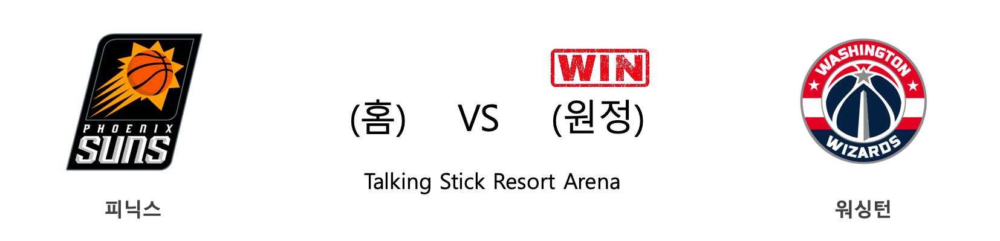

<table class="tg">
  <tr>
    <th class="tg-rr9t">PHX</th>
    <th class="tg-rr9t">팀</th>
    <th class="tg-rr9t">WAS</th>
  </tr>
  <tr>
    <td class="tg-dcpn">0승 1패</td>
    <td class="tg-rr9t">시즌 상대전적</td>
    <td class="tg-dcpn">1승 0패</td>
  </tr>
  <tr>
    <td class="tg-dcpn">132</td>
    <td class="tg-rr9t">점수</td>
    <td class="tg-dcpn">140</td>
  </tr>
  <tr>
    <td class="tg-dcpn">33/55(60%)</td>
    <td class="tg-rr9t">2점(%)</td>
    <td class="tg-dcpn">32/54(59%)</td>
  </tr>
  <tr>
    <td class="tg-dcpn">15/38(39%)</td>
    <td class="tg-rr9t">3점(%)</td>
    <td class="tg-dcpn">19/35(54%)</td>
  </tr>
  <tr>
    <td class="tg-dcpn">21/24(88%)</td>
    <td class="tg-rr9t">자유투(%)</td>
    <td class="tg-dcpn">19/20(95%)</td>
  </tr>
  <tr>
    <td class="tg-dcpn">40</td>
    <td class="tg-rr9t">리바운드</td>
    <td class="tg-dcpn">34</td>
  </tr>
  <tr>
    <td class="tg-dcpn">29</td>
    <td class="tg-rr9t">어시스트</td>
    <td class="tg-dcpn">32</td>
  </tr>
  <tr>
    <td class="tg-dcpn">7</td>
    <td class="tg-rr9t">스틸</td>
    <td class="tg-dcpn">9</td>
  </tr>
  <tr>
    <td class="tg-dcpn">6</td>
    <td class="tg-rr9t">블록</td>
    <td class="tg-dcpn">5</td>
  </tr>
  <tr>
    <td class="tg-dcpn">15</td>
    <td class="tg-rr9t">턴오버</td>
    <td class="tg-dcpn">14</td>
  </tr>
  <tr>
    <td class="tg-dcpn">DarioSaricF(17) CheickDiallo(17) CameronJohnso(17) DevinBookerG(27) RickyRubioG(18)</td>
    <td class="tg-rr9t">주요 득점선수</td>
    <td class="tg-dcpn">IshSmith(21) ThomasBryantC(23) BradleyBealG(35) DavisBertans(16)</td>
  </tr>
</table>

#### 경기 관련 주요 기사         

[[오늘의 NBA] (11/5) 데빈 부커, 강팀의 에이스](http://sports.news.naver.com/basketball/news/read.nhn?oid=486&aid=0000001128)

[[오늘의 NBA] (10/24) 앤드류 위긴스, 위기 상황에서 웃는 일류 승부사](http://sports.news.naver.com/basketball/news/read.nhn?oid=486&aid=0000001116)

[[오늘의 NBA] (11/27) 덴버, 서부컨퍼런스 우승 후보로 도약하다](http://sports.news.naver.com/basketball/news/read.nhn?oid=486&aid=0000001150)

[[오늘의 NBA] (10/26) 루카 돈치치, 댈러스의 해결사](http://sports.news.naver.com/basketball/news/read.nhn?oid=486&aid=0000001118)

[[오늘의 NBA] (11/9) 위긴스 vs 러셀, 타깃 센터의 명승부](http://sports.news.naver.com/basketball/news/read.nhn?oid=486&aid=0000001132)

        
        

####  골든스테이트(홈) VS 시카고(원정) 
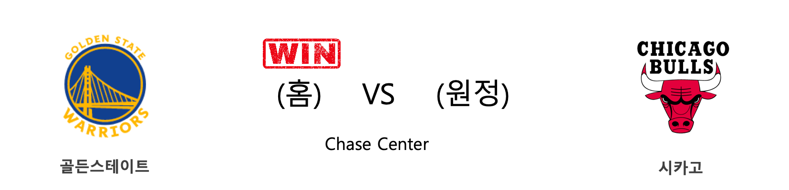

<table class="tg">
  <tr>
    <th class="tg-rr9t">GSW</th>
    <th class="tg-rr9t">팀</th>
    <th class="tg-rr9t">CHI</th>
  </tr>
  <tr>
    <td class="tg-dcpn">1승 0패</td>
    <td class="tg-rr9t">시즌 상대전적</td>
    <td class="tg-dcpn">0승 1패</td>
  </tr>
  <tr>
    <td class="tg-dcpn">104</td>
    <td class="tg-rr9t">점수</td>
    <td class="tg-dcpn">90</td>
  </tr>
  <tr>
    <td class="tg-dcpn">26/52(50%)</td>
    <td class="tg-rr9t">2점(%)</td>
    <td class="tg-dcpn">24/60(40%)</td>
  </tr>
  <tr>
    <td class="tg-dcpn">11/29(38%)</td>
    <td class="tg-rr9t">3점(%)</td>
    <td class="tg-dcpn">10/29(34%)</td>
  </tr>
  <tr>
    <td class="tg-dcpn">19/26(73%)</td>
    <td class="tg-rr9t">자유투(%)</td>
    <td class="tg-dcpn">12/18(67%)</td>
  </tr>
  <tr>
    <td class="tg-dcpn">54</td>
    <td class="tg-rr9t">리바운드</td>
    <td class="tg-dcpn">42</td>
  </tr>
  <tr>
    <td class="tg-dcpn">31</td>
    <td class="tg-rr9t">어시스트</td>
    <td class="tg-dcpn">20</td>
  </tr>
  <tr>
    <td class="tg-dcpn">12</td>
    <td class="tg-rr9t">스틸</td>
    <td class="tg-dcpn">14</td>
  </tr>
  <tr>
    <td class="tg-dcpn">9</td>
    <td class="tg-rr9t">블록</td>
    <td class="tg-dcpn">4</td>
  </tr>
  <tr>
    <td class="tg-dcpn">20</td>
    <td class="tg-rr9t">턴오버</td>
    <td class="tg-dcpn">17</td>
  </tr>
  <tr>
    <td class="tg-dcpn">AlecBurksG(23) EricPaschallF(25)</td>
    <td class="tg-rr9t">주요 득점선수</td>
    <td class="tg-dcpn">ZachLaVineG(36) TomasSatorans(19)</td>
  </tr>
</table>

#### 경기 관련 주요 기사         

[[오늘의 NBA] (11/21) 클리퍼스, 안티 볼 핸들러 세계관을 구축하다](http://sports.news.naver.com/basketball/news/read.nhn?oid=486&aid=0000001144)

[[오늘의 NBA] (11/23) 카와이 레너드, 승부를 결정짓는 사나이](http://sports.news.naver.com/basketball/news/read.nhn?oid=486&aid=0000001146)

[[오늘의 NBA] (11/28) 앤써니 데이비스, 노란 셔츠를 입은 사나이](http://sports.news.naver.com/basketball/news/read.nhn?oid=486&aid=0000001151)

[[오늘의 NBA] (11/24) 잭 라빈, GSW 스플래쉬 브라더스를 소환하다](http://sports.news.naver.com/basketball/news/read.nhn?oid=486&aid=0000001147)

[[오늘의 NBA] (11/17) 샬럿, 설계된 플레이 연출의 달인](http://sports.news.naver.com/basketball/news/read.nhn?oid=486&aid=0000001140)

        
        

####  멤피스(홈) VS LA클리퍼스(원정) 
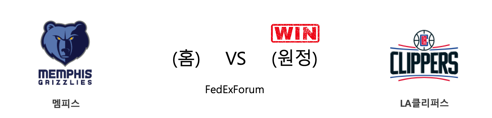

<table class="tg">
  <tr>
    <th class="tg-rr9t">MEM</th>
    <th class="tg-rr9t">팀</th>
    <th class="tg-rr9t">LAC</th>
  </tr>
  <tr>
    <td class="tg-dcpn">0승 1패</td>
    <td class="tg-rr9t">시즌 상대전적</td>
    <td class="tg-dcpn">1승 0패</td>
  </tr>
  <tr>
    <td class="tg-dcpn">119</td>
    <td class="tg-rr9t">점수</td>
    <td class="tg-dcpn">121</td>
  </tr>
  <tr>
    <td class="tg-dcpn">32/64(50%)</td>
    <td class="tg-rr9t">2점(%)</td>
    <td class="tg-dcpn">30/54(56%)</td>
  </tr>
  <tr>
    <td class="tg-dcpn">11/28(39%)</td>
    <td class="tg-rr9t">3점(%)</td>
    <td class="tg-dcpn">14/41(34%)</td>
  </tr>
  <tr>
    <td class="tg-dcpn">22/26(85%)</td>
    <td class="tg-rr9t">자유투(%)</td>
    <td class="tg-dcpn">19/25(76%)</td>
  </tr>
  <tr>
    <td class="tg-dcpn">48</td>
    <td class="tg-rr9t">리바운드</td>
    <td class="tg-dcpn">43</td>
  </tr>
  <tr>
    <td class="tg-dcpn">26</td>
    <td class="tg-rr9t">어시스트</td>
    <td class="tg-dcpn">30</td>
  </tr>
  <tr>
    <td class="tg-dcpn">9</td>
    <td class="tg-rr9t">스틸</td>
    <td class="tg-dcpn">11</td>
  </tr>
  <tr>
    <td class="tg-dcpn">3</td>
    <td class="tg-rr9t">블록</td>
    <td class="tg-dcpn">6</td>
  </tr>
  <tr>
    <td class="tg-dcpn">20</td>
    <td class="tg-rr9t">턴오버</td>
    <td class="tg-dcpn">15</td>
  </tr>
  <tr>
    <td class="tg-dcpn">JarenJacksonJ(17) JaeCrowderF(20) JonasValanciu(30) JaMorantG(20)</td>
    <td class="tg-rr9t">주요 득점선수</td>
    <td class="tg-dcpn">PaulGeorgeF(22) MontrezlHarre(24) LouWilliams(24)</td>
  </tr>
</table>

#### 경기 관련 주요 기사         

[[오늘의 NBA] (10/28) 모란트 vs 어빙, 페덱스 포럼의 결투](http://sports.news.naver.com/basketball/news/read.nhn?oid=486&aid=0000001120)

[[오늘의 NBA] (11/24) 잭 라빈, GSW 스플래쉬 브라더스를 소환하다](http://sports.news.naver.com/basketball/news/read.nhn?oid=486&aid=0000001147)

[[오늘의 NBA] (11/23) 카와이 레너드, 승부를 결정짓는 사나이](http://sports.news.naver.com/basketball/news/read.nhn?oid=486&aid=0000001146)

[[오늘의 NBA] (11/16) 멤피스, Grit&Grind 시대와의 성공적인 단절](http://sports.news.naver.com/basketball/news/read.nhn?oid=486&aid=0000001139)

[[오늘의 NBA] (11/14) 제임스 하든, 농구의 미래를 제시하다](http://sports.news.naver.com/basketball/news/read.nhn?oid=486&aid=0000001137)

        
        

####  인디애나(홈) VS 유타(원정) 
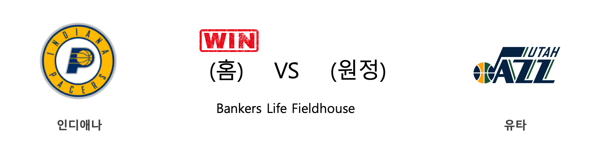

<table class="tg">
  <tr>
    <th class="tg-rr9t">IND</th>
    <th class="tg-rr9t">팀</th>
    <th class="tg-rr9t">UTA</th>
  </tr>
  <tr>
    <td class="tg-dcpn">1승 0패</td>
    <td class="tg-rr9t">시즌 상대전적</td>
    <td class="tg-dcpn">0승 1패</td>
  </tr>
  <tr>
    <td class="tg-dcpn">121</td>
    <td class="tg-rr9t">점수</td>
    <td class="tg-dcpn">102</td>
  </tr>
  <tr>
    <td class="tg-dcpn">42/74(57%)</td>
    <td class="tg-rr9t">2점(%)</td>
    <td class="tg-dcpn">26/51(51%)</td>
  </tr>
  <tr>
    <td class="tg-dcpn">8/22(36%)</td>
    <td class="tg-rr9t">3점(%)</td>
    <td class="tg-dcpn">10/32(31%)</td>
  </tr>
  <tr>
    <td class="tg-dcpn">13/16(81%)</td>
    <td class="tg-rr9t">자유투(%)</td>
    <td class="tg-dcpn">20/25(80%)</td>
  </tr>
  <tr>
    <td class="tg-dcpn">42</td>
    <td class="tg-rr9t">리바운드</td>
    <td class="tg-dcpn">40</td>
  </tr>
  <tr>
    <td class="tg-dcpn">23</td>
    <td class="tg-rr9t">어시스트</td>
    <td class="tg-dcpn">19</td>
  </tr>
  <tr>
    <td class="tg-dcpn">8</td>
    <td class="tg-rr9t">스틸</td>
    <td class="tg-dcpn">7</td>
  </tr>
  <tr>
    <td class="tg-dcpn">4</td>
    <td class="tg-rr9t">블록</td>
    <td class="tg-dcpn">2</td>
  </tr>
  <tr>
    <td class="tg-dcpn">12</td>
    <td class="tg-rr9t">턴오버</td>
    <td class="tg-dcpn">16</td>
  </tr>
  <tr>
    <td class="tg-dcpn">MalcolmBrogdo(22) T.J.WarrenF(23) DomantasSabon(23) JeremyLambG(18)</td>
    <td class="tg-rr9t">주요 득점선수</td>
    <td class="tg-dcpn">BojanBogdanov(30) DonovanMitche(26)</td>
  </tr>
</table>

#### 경기 관련 주요 기사         

[[오늘의 NBA] (11/26) 마크 가솔, 조엘 엠비드의 영원한 악몽](http://sports.news.naver.com/basketball/news/read.nhn?oid=486&aid=0000001149)

[[오늘의 NBA] (11/19) 댈러스의 루카 복음 낭송](http://sports.news.naver.com/basketball/news/read.nhn?oid=486&aid=0000001142)

[[오늘의 NBA] (11/17) 샬럿, 설계된 플레이 연출의 달인](http://sports.news.naver.com/basketball/news/read.nhn?oid=486&aid=0000001140)

[[오늘의 NBA] (11/24) 잭 라빈, GSW 스플래쉬 브라더스를 소환하다](http://sports.news.naver.com/basketball/news/read.nhn?oid=486&aid=0000001147)

[[오늘의 NBA] (11/28) 앤써니 데이비스, 노란 셔츠를 입은 사나이](http://sports.news.naver.com/basketball/news/read.nhn?oid=486&aid=0000001151)

        
        

####  필라델피아(홈) VS 새크라멘토(원정) 
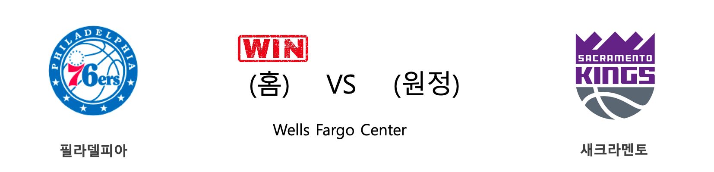

<table class="tg">
  <tr>
    <th class="tg-rr9t">PHI</th>
    <th class="tg-rr9t">팀</th>
    <th class="tg-rr9t">SAC</th>
  </tr>
  <tr>
    <td class="tg-dcpn">1승 0패</td>
    <td class="tg-rr9t">시즌 상대전적</td>
    <td class="tg-dcpn">0승 1패</td>
  </tr>
  <tr>
    <td class="tg-dcpn">97</td>
    <td class="tg-rr9t">점수</td>
    <td class="tg-dcpn">91</td>
  </tr>
  <tr>
    <td class="tg-dcpn">31/52(60%)</td>
    <td class="tg-rr9t">2점(%)</td>
    <td class="tg-dcpn">30/61(49%)</td>
  </tr>
  <tr>
    <td class="tg-dcpn">5/26(19%)</td>
    <td class="tg-rr9t">3점(%)</td>
    <td class="tg-dcpn">9/34(26%)</td>
  </tr>
  <tr>
    <td class="tg-dcpn">20/24(83%)</td>
    <td class="tg-rr9t">자유투(%)</td>
    <td class="tg-dcpn">4/9(44%)</td>
  </tr>
  <tr>
    <td class="tg-dcpn">50</td>
    <td class="tg-rr9t">리바운드</td>
    <td class="tg-dcpn">42</td>
  </tr>
  <tr>
    <td class="tg-dcpn">20</td>
    <td class="tg-rr9t">어시스트</td>
    <td class="tg-dcpn">22</td>
  </tr>
  <tr>
    <td class="tg-dcpn">8</td>
    <td class="tg-rr9t">스틸</td>
    <td class="tg-dcpn">9</td>
  </tr>
  <tr>
    <td class="tg-dcpn">10</td>
    <td class="tg-rr9t">블록</td>
    <td class="tg-dcpn">3</td>
  </tr>
  <tr>
    <td class="tg-dcpn">17</td>
    <td class="tg-rr9t">턴오버</td>
    <td class="tg-dcpn">11</td>
  </tr>
  <tr>
    <td class="tg-dcpn">JoelEmbiidC(33) MatisseThybul(15)</td>
    <td class="tg-rr9t">주요 득점선수</td>
    <td class="tg-dcpn">BogdanBogdano(17) BuddyHieldG(22) DewayneDedmon(18)</td>
  </tr>
</table>

#### 경기 관련 주요 기사         

[[오늘의 NBA] (11/23) 카와이 레너드, 승부를 결정짓는 사나이](http://sports.news.naver.com/basketball/news/read.nhn?oid=486&aid=0000001146)

[[오늘의 NBA] (11/19) 댈러스의 루카 복음 낭송](http://sports.news.naver.com/basketball/news/read.nhn?oid=486&aid=0000001142)

[[오늘의 NBA] (11/18) 새크라멘토, 리그 선두 보스턴을 제압하다](http://sports.news.naver.com/basketball/news/read.nhn?oid=486&aid=0000001141)

[[오늘의 NBA] (11/16) 멤피스, Grit&Grind 시대와의 성공적인 단절](http://sports.news.naver.com/basketball/news/read.nhn?oid=486&aid=0000001139)

[[오늘의 NBA] (11/21) 클리퍼스, 안티 볼 핸들러 세계관을 구축하다](http://sports.news.naver.com/basketball/news/read.nhn?oid=486&aid=0000001144)

        
        

####  보스턴(홈) VS 브루클린(원정) 
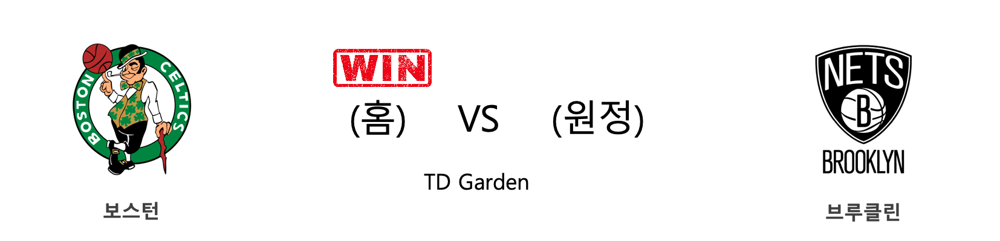

<table class="tg">
  <tr>
    <th class="tg-rr9t">BOS</th>
    <th class="tg-rr9t">팀</th>
    <th class="tg-rr9t">BKN</th>
  </tr>
  <tr>
    <td class="tg-dcpn">1승 0패</td>
    <td class="tg-rr9t">시즌 상대전적</td>
    <td class="tg-dcpn">0승 1패</td>
  </tr>
  <tr>
    <td class="tg-dcpn">121</td>
    <td class="tg-rr9t">점수</td>
    <td class="tg-dcpn">110</td>
  </tr>
  <tr>
    <td class="tg-dcpn">30/63(48%)</td>
    <td class="tg-rr9t">2점(%)</td>
    <td class="tg-dcpn">19/34(56%)</td>
  </tr>
  <tr>
    <td class="tg-dcpn">13/34(38%)</td>
    <td class="tg-rr9t">3점(%)</td>
    <td class="tg-dcpn">21/56(38%)</td>
  </tr>
  <tr>
    <td class="tg-dcpn">22/24(92%)</td>
    <td class="tg-rr9t">자유투(%)</td>
    <td class="tg-dcpn">9/19(47%)</td>
  </tr>
  <tr>
    <td class="tg-dcpn">55</td>
    <td class="tg-rr9t">리바운드</td>
    <td class="tg-dcpn">38</td>
  </tr>
  <tr>
    <td class="tg-dcpn">23</td>
    <td class="tg-rr9t">어시스트</td>
    <td class="tg-dcpn">32</td>
  </tr>
  <tr>
    <td class="tg-dcpn">10</td>
    <td class="tg-rr9t">스틸</td>
    <td class="tg-dcpn">5</td>
  </tr>
  <tr>
    <td class="tg-dcpn">5</td>
    <td class="tg-rr9t">블록</td>
    <td class="tg-dcpn">6</td>
  </tr>
  <tr>
    <td class="tg-dcpn">14</td>
    <td class="tg-rr9t">턴오버</td>
    <td class="tg-dcpn">15</td>
  </tr>
  <tr>
    <td class="tg-dcpn">JaylenBrownF(22) KembaWalkerG(39) JaysonTatumF(16)</td>
    <td class="tg-rr9t">주요 득점선수</td>
    <td class="tg-dcpn">SpencerDinwid(16) GarrettTemple(22) JarrettAllenC(17) JoeHarrisF(21)</td>
  </tr>
</table>

#### 경기 관련 주요 기사         

[[오늘의 NBA] (11/28) 앤써니 데이비스, 노란 셔츠를 입은 사나이](http://sports.news.naver.com/basketball/news/read.nhn?oid=486&aid=0000001151)

[[오늘의 NBA] (11/23) 카와이 레너드, 승부를 결정짓는 사나이](http://sports.news.naver.com/basketball/news/read.nhn?oid=486&aid=0000001146)

[[오늘의 NBA] (11/19) 댈러스의 루카 복음 낭송](http://sports.news.naver.com/basketball/news/read.nhn?oid=486&aid=0000001142)

[[오늘의 NBA] (11/24) 잭 라빈, GSW 스플래쉬 브라더스를 소환하다](http://sports.news.naver.com/basketball/news/read.nhn?oid=486&aid=0000001147)

[[오늘의 NBA] (11/21) 클리퍼스, 안티 볼 핸들러 세계관을 구축하다](http://sports.news.naver.com/basketball/news/read.nhn?oid=486&aid=0000001144)

        
        

####  토론토(홈) VS 뉴욕(원정) 
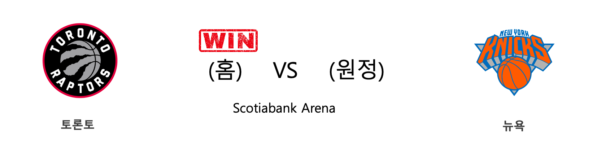

<table class="tg">
  <tr>
    <th class="tg-rr9t">TOR</th>
    <th class="tg-rr9t">팀</th>
    <th class="tg-rr9t">NYK</th>
  </tr>
  <tr>
    <td class="tg-dcpn">1승 0패</td>
    <td class="tg-rr9t">시즌 상대전적</td>
    <td class="tg-dcpn">0승 1패</td>
  </tr>
  <tr>
    <td class="tg-dcpn">126</td>
    <td class="tg-rr9t">점수</td>
    <td class="tg-dcpn">98</td>
  </tr>
  <tr>
    <td class="tg-dcpn">25/53(47%)</td>
    <td class="tg-rr9t">2점(%)</td>
    <td class="tg-dcpn">21/47(45%)</td>
  </tr>
  <tr>
    <td class="tg-dcpn">21/41(51%)</td>
    <td class="tg-rr9t">3점(%)</td>
    <td class="tg-dcpn">12/41(29%)</td>
  </tr>
  <tr>
    <td class="tg-dcpn">13/17(76%)</td>
    <td class="tg-rr9t">자유투(%)</td>
    <td class="tg-dcpn">20/24(83%)</td>
  </tr>
  <tr>
    <td class="tg-dcpn">52</td>
    <td class="tg-rr9t">리바운드</td>
    <td class="tg-dcpn">45</td>
  </tr>
  <tr>
    <td class="tg-dcpn">26</td>
    <td class="tg-rr9t">어시스트</td>
    <td class="tg-dcpn">19</td>
  </tr>
  <tr>
    <td class="tg-dcpn">6</td>
    <td class="tg-rr9t">스틸</td>
    <td class="tg-dcpn">6</td>
  </tr>
  <tr>
    <td class="tg-dcpn">4</td>
    <td class="tg-rr9t">블록</td>
    <td class="tg-dcpn">4</td>
  </tr>
  <tr>
    <td class="tg-dcpn">12</td>
    <td class="tg-rr9t">턴오버</td>
    <td class="tg-dcpn">18</td>
  </tr>
  <tr>
    <td class="tg-dcpn">TerenceDavis(15) PascalSiakamF(31) FredVanVleetG(15)</td>
    <td class="tg-rr9t">주요 득점선수</td>
    <td class="tg-dcpn">RJBarrettG(16) JuliusRandleF(19)</td>
  </tr>
</table>

#### 경기 관련 주요 기사         

[[오늘의 NBA] (11/21) 클리퍼스, 안티 볼 핸들러 세계관을 구축하다](http://sports.news.naver.com/basketball/news/read.nhn?oid=486&aid=0000001144)

[[오늘의 NBA] (11/19) 댈러스의 루카 복음 낭송](http://sports.news.naver.com/basketball/news/read.nhn?oid=486&aid=0000001142)

[[오늘의 NBA] (11/24) 잭 라빈, GSW 스플래쉬 브라더스를 소환하다](http://sports.news.naver.com/basketball/news/read.nhn?oid=486&aid=0000001147)

[[오늘의 NBA] (11/26) 마크 가솔, 조엘 엠비드의 영원한 악몽](http://sports.news.naver.com/basketball/news/read.nhn?oid=486&aid=0000001149)

[[오늘의 NBA] (11/28) 앤써니 데이비스, 노란 셔츠를 입은 사나이](http://sports.news.naver.com/basketball/news/read.nhn?oid=486&aid=0000001151)

        
        

####  밀워키(홈) VS 애틀랜타(원정) 
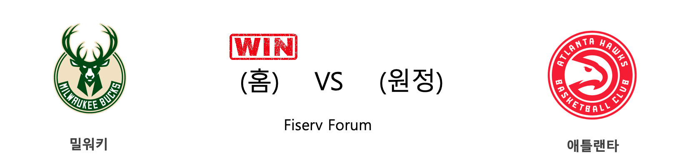

<table class="tg">
  <tr>
    <th class="tg-rr9t">MIL</th>
    <th class="tg-rr9t">팀</th>
    <th class="tg-rr9t">ATL</th>
  </tr>
  <tr>
    <td class="tg-dcpn">2승 0패</td>
    <td class="tg-rr9t">시즌 상대전적</td>
    <td class="tg-dcpn">0승 2패</td>
  </tr>
  <tr>
    <td class="tg-dcpn">111</td>
    <td class="tg-rr9t">점수</td>
    <td class="tg-dcpn">102</td>
  </tr>
  <tr>
    <td class="tg-dcpn">32/54(59%)</td>
    <td class="tg-rr9t">2점(%)</td>
    <td class="tg-dcpn">27/60(45%)</td>
  </tr>
  <tr>
    <td class="tg-dcpn">10/34(29%)</td>
    <td class="tg-rr9t">3점(%)</td>
    <td class="tg-dcpn">11/34(32%)</td>
  </tr>
  <tr>
    <td class="tg-dcpn">17/27(63%)</td>
    <td class="tg-rr9t">자유투(%)</td>
    <td class="tg-dcpn">15/22(68%)</td>
  </tr>
  <tr>
    <td class="tg-dcpn">47</td>
    <td class="tg-rr9t">리바운드</td>
    <td class="tg-dcpn">49</td>
  </tr>
  <tr>
    <td class="tg-dcpn">25</td>
    <td class="tg-rr9t">어시스트</td>
    <td class="tg-dcpn">22</td>
  </tr>
  <tr>
    <td class="tg-dcpn">6</td>
    <td class="tg-rr9t">스틸</td>
    <td class="tg-dcpn">4</td>
  </tr>
  <tr>
    <td class="tg-dcpn">11</td>
    <td class="tg-rr9t">블록</td>
    <td class="tg-dcpn">5</td>
  </tr>
  <tr>
    <td class="tg-dcpn">14</td>
    <td class="tg-rr9t">턴오버</td>
    <td class="tg-dcpn">17</td>
  </tr>
  <tr>
    <td class="tg-dcpn">GiannisAnteto(30) KhrisMiddleto(16)</td>
    <td class="tg-rr9t">주요 득점선수</td>
    <td class="tg-dcpn">JabariParkerF(33) TraeYoungG(29)</td>
  </tr>
</table>

#### 경기 관련 주요 기사         

[[오늘의 NBA] (11/24) 잭 라빈, GSW 스플래쉬 브라더스를 소환하다](http://sports.news.naver.com/basketball/news/read.nhn?oid=486&aid=0000001147)

[미들턴, 28일 ATL전에서 복귀...MIL에 호재](http://www.rookie.co.kr/news/articleView.html?idxno=35346)

[[오늘의 NBA] (11/19) 댈러스의 루카 복음 낭송](http://sports.news.naver.com/basketball/news/read.nhn?oid=486&aid=0000001142)

[[오늘의 NBA] (11/26) 마크 가솔, 조엘 엠비드의 영원한 악몽](http://sports.news.naver.com/basketball/news/read.nhn?oid=486&aid=0000001149)

[류현진, ESPN 선정 MLB '세컨드 팀'에 뽑혀](http://www.mbcsportsplus.com/news/?mode=view&cate=2&b_idx=99825044.000)

        
        

####  샬럿(홈) VS 디트로이트(원정) 

<table class="tg">
  <tr>
    <th class="tg-rr9t">CHA</th>
    <th class="tg-rr9t">팀</th>
    <th class="tg-rr9t">DET</th>
  </tr>
  <tr>
    <td class="tg-dcpn">2승 0패</td>
    <td class="tg-rr9t">시즌 상대전적</td>
    <td class="tg-dcpn">0승 2패</td>
  </tr>
  <tr>
    <td class="tg-dcpn">102</td>
    <td class="tg-rr9t">점수</td>
    <td class="tg-dcpn">101</td>
  </tr>
  <tr>
    <td class="tg-dcpn">32/58(55%)</td>
    <td class="tg-rr9t">2점(%)</td>
    <td class="tg-dcpn">31/56(55%)</td>
  </tr>
  <tr>
    <td class="tg-dcpn">7/30(23%)</td>
    <td class="tg-rr9t">3점(%)</td>
    <td class="tg-dcpn">10/32(31%)</td>
  </tr>
  <tr>
    <td class="tg-dcpn">17/20(85%)</td>
    <td class="tg-rr9t">자유투(%)</td>
    <td class="tg-dcpn">9/15(60%)</td>
  </tr>
  <tr>
    <td class="tg-dcpn">41</td>
    <td class="tg-rr9t">리바운드</td>
    <td class="tg-dcpn">46</td>
  </tr>
  <tr>
    <td class="tg-dcpn">27</td>
    <td class="tg-rr9t">어시스트</td>
    <td class="tg-dcpn">23</td>
  </tr>
  <tr>
    <td class="tg-dcpn">3</td>
    <td class="tg-rr9t">스틸</td>
    <td class="tg-dcpn">2</td>
  </tr>
  <tr>
    <td class="tg-dcpn">7</td>
    <td class="tg-rr9t">블록</td>
    <td class="tg-dcpn">2</td>
  </tr>
  <tr>
    <td class="tg-dcpn">3</td>
    <td class="tg-rr9t">턴오버</td>
    <td class="tg-dcpn">8</td>
  </tr>
  <tr>
    <td class="tg-dcpn">MilesBridgesF(15) Devonte'Graha(16) BismackBiyomb(19) P.J.Washingto(17)</td>
    <td class="tg-rr9t">주요 득점선수</td>
    <td class="tg-dcpn">BlakeGriffinF(26) LukeKennardG(16)</td>
  </tr>
</table>

#### 경기 관련 주요 기사         

[[오늘의 NBA] (11/24) 잭 라빈, GSW 스플래쉬 브라더스를 소환하다](http://sports.news.naver.com/basketball/news/read.nhn?oid=486&aid=0000001147)

[[오늘의 NBA] (11/21) 클리퍼스, 안티 볼 핸들러 세계관을 구축하다](http://sports.news.naver.com/basketball/news/read.nhn?oid=486&aid=0000001144)

[[오늘의 NBA] (11/28) 앤써니 데이비스, 노란 셔츠를 입은 사나이](http://sports.news.naver.com/basketball/news/read.nhn?oid=486&aid=0000001151)

[[오늘의 NBA] (11/23) 카와이 레너드, 승부를 결정짓는 사나이](http://sports.news.naver.com/basketball/news/read.nhn?oid=486&aid=0000001146)

[[오늘의 NBA] (11/26) 마크 가솔, 조엘 엠비드의 영원한 악몽](http://sports.news.naver.com/basketball/news/read.nhn?oid=486&aid=0000001149)

        
        

####  포틀랜드(홈) VS 오클라호마씨티(원정) 

<table class="tg">
  <tr>
    <th class="tg-rr9t">POR</th>
    <th class="tg-rr9t">팀</th>
    <th class="tg-rr9t">OKC</th>
  </tr>
  <tr>
    <td class="tg-dcpn">2승 0패</td>
    <td class="tg-rr9t">시즌 상대전적</td>
    <td class="tg-dcpn">0승 2패</td>
  </tr>
  <tr>
    <td class="tg-dcpn">136</td>
    <td class="tg-rr9t">점수</td>
    <td class="tg-dcpn">119</td>
  </tr>
  <tr>
    <td class="tg-dcpn">35/64(55%)</td>
    <td class="tg-rr9t">2점(%)</td>
    <td class="tg-dcpn">28/53(53%)</td>
  </tr>
  <tr>
    <td class="tg-dcpn">14/30(47%)</td>
    <td class="tg-rr9t">3점(%)</td>
    <td class="tg-dcpn">11/35(31%)</td>
  </tr>
  <tr>
    <td class="tg-dcpn">24/24(100%)</td>
    <td class="tg-rr9t">자유투(%)</td>
    <td class="tg-dcpn">30/38(79%)</td>
  </tr>
  <tr>
    <td class="tg-dcpn">54</td>
    <td class="tg-rr9t">리바운드</td>
    <td class="tg-dcpn">38</td>
  </tr>
  <tr>
    <td class="tg-dcpn">23</td>
    <td class="tg-rr9t">어시스트</td>
    <td class="tg-dcpn">19</td>
  </tr>
  <tr>
    <td class="tg-dcpn">3</td>
    <td class="tg-rr9t">스틸</td>
    <td class="tg-dcpn">4</td>
  </tr>
  <tr>
    <td class="tg-dcpn">1</td>
    <td class="tg-rr9t">블록</td>
    <td class="tg-dcpn">2</td>
  </tr>
  <tr>
    <td class="tg-dcpn">9</td>
    <td class="tg-rr9t">턴오버</td>
    <td class="tg-dcpn">6</td>
  </tr>
  <tr>
    <td class="tg-dcpn">DamianLillard(27) HassanWhitesi(21) CarmeloAnthon(19) CJMcCollumG(22)</td>
    <td class="tg-rr9t">주요 득점선수</td>
    <td class="tg-dcpn">AbdelNader(23) ChrisPaulG(16)</td>
  </tr>
</table>

#### 경기 관련 주요 기사         

[[오늘의 NBA] (11/17) 샬럿, 설계된 플레이 연출의 달인](http://sports.news.naver.com/basketball/news/read.nhn?oid=486&aid=0000001140)

[[오늘의 NBA] (11/26) 마크 가솔, 조엘 엠비드의 영원한 악몽](http://sports.news.naver.com/basketball/news/read.nhn?oid=486&aid=0000001149)

[[오늘의 NBA] (11/21) 클리퍼스, 안티 볼 핸들러 세계관을 구축하다](http://sports.news.naver.com/basketball/news/read.nhn?oid=486&aid=0000001144)

[[오늘의 NBA] (11/28) 앤써니 데이비스, 노란 셔츠를 입은 사나이](http://sports.news.naver.com/basketball/news/read.nhn?oid=486&aid=0000001151)

[[오늘의 NBA] (11/19) 댈러스의 루카 복음 낭송](http://sports.news.naver.com/basketball/news/read.nhn?oid=486&aid=0000001142)

        
        

####  뉴올리언스(홈) VS LA레이커스(원정) 
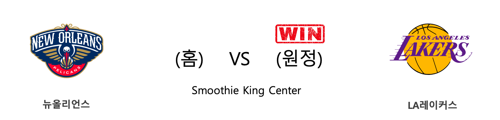

<table class="tg">
  <tr>
    <th class="tg-rr9t">NOP</th>
    <th class="tg-rr9t">팀</th>
    <th class="tg-rr9t">LAL</th>
  </tr>
  <tr>
    <td class="tg-dcpn">0승 1패</td>
    <td class="tg-rr9t">시즌 상대전적</td>
    <td class="tg-dcpn">1승 0패</td>
  </tr>
  <tr>
    <td class="tg-dcpn">110</td>
    <td class="tg-rr9t">점수</td>
    <td class="tg-dcpn">114</td>
  </tr>
  <tr>
    <td class="tg-dcpn">17/44(39%)</td>
    <td class="tg-rr9t">2점(%)</td>
    <td class="tg-dcpn">36/61(59%)</td>
  </tr>
  <tr>
    <td class="tg-dcpn">17/40(42%)</td>
    <td class="tg-rr9t">3점(%)</td>
    <td class="tg-dcpn">8/24(33%)</td>
  </tr>
  <tr>
    <td class="tg-dcpn">25/30(83%)</td>
    <td class="tg-rr9t">자유투(%)</td>
    <td class="tg-dcpn">18/25(72%)</td>
  </tr>
  <tr>
    <td class="tg-dcpn">42</td>
    <td class="tg-rr9t">리바운드</td>
    <td class="tg-dcpn">37</td>
  </tr>
  <tr>
    <td class="tg-dcpn">20</td>
    <td class="tg-rr9t">어시스트</td>
    <td class="tg-dcpn">25</td>
  </tr>
  <tr>
    <td class="tg-dcpn">7</td>
    <td class="tg-rr9t">스틸</td>
    <td class="tg-dcpn">9</td>
  </tr>
  <tr>
    <td class="tg-dcpn">4</td>
    <td class="tg-rr9t">블록</td>
    <td class="tg-dcpn">6</td>
  </tr>
  <tr>
    <td class="tg-dcpn">19</td>
    <td class="tg-rr9t">턴오버</td>
    <td class="tg-dcpn">15</td>
  </tr>
  <tr>
    <td class="tg-dcpn">JrueHolidayG(29) JJRedickG(18) BrandonIngram(23)</td>
    <td class="tg-rr9t">주요 득점선수</td>
    <td class="tg-dcpn">AnthonyDavisF(41) LeBronJamesF(29) KyleKuzma(16)</td>
  </tr>
</table>

#### 경기 관련 주요 기사         

[[오늘의 NBA] (11/25) 댈러스, 공격이 승리를 부른다!](http://sports.news.naver.com/basketball/news/read.nhn?oid=486&aid=0000001148)

[[오늘의 NBA] (11/20) 레이커스, 리그 선두 복귀](http://sports.news.naver.com/basketball/news/read.nhn?oid=486&aid=0000001143)

[[오늘의 NBA] (11/28) 앤써니 데이비스, 노란 셔츠를 입은 사나이](http://sports.news.naver.com/basketball/news/read.nhn?oid=486&aid=0000001151)

[[오늘의 NBA] (11/24) 잭 라빈, GSW 스플래쉬 브라더스를 소환하다](http://sports.news.naver.com/basketball/news/read.nhn?oid=486&aid=0000001147)

[[오늘의 NBA] (11/23) 카와이 레너드, 승부를 결정짓는 사나이](http://sports.news.naver.com/basketball/news/read.nhn?oid=486&aid=0000001146)

        
        

####  휴스턴(홈) VS 마이애미(원정) 
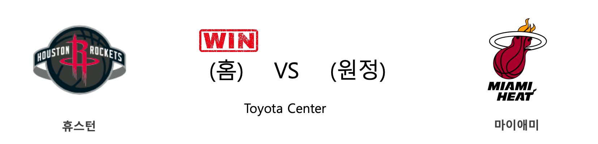

<table class="tg">
  <tr>
    <th class="tg-rr9t">HOU</th>
    <th class="tg-rr9t">팀</th>
    <th class="tg-rr9t">MIA</th>
  </tr>
  <tr>
    <td class="tg-dcpn">1승 1패</td>
    <td class="tg-rr9t">시즌 상대전적</td>
    <td class="tg-dcpn">1승 1패</td>
  </tr>
  <tr>
    <td class="tg-dcpn">117</td>
    <td class="tg-rr9t">점수</td>
    <td class="tg-dcpn">108</td>
  </tr>
  <tr>
    <td class="tg-dcpn">23/38(61%)</td>
    <td class="tg-rr9t">2점(%)</td>
    <td class="tg-dcpn">23/43(53%)</td>
  </tr>
  <tr>
    <td class="tg-dcpn">15/44(34%)</td>
    <td class="tg-rr9t">3점(%)</td>
    <td class="tg-dcpn">14/37(38%)</td>
  </tr>
  <tr>
    <td class="tg-dcpn">26/33(79%)</td>
    <td class="tg-rr9t">자유투(%)</td>
    <td class="tg-dcpn">20/27(74%)</td>
  </tr>
  <tr>
    <td class="tg-dcpn">43</td>
    <td class="tg-rr9t">리바운드</td>
    <td class="tg-dcpn">41</td>
  </tr>
  <tr>
    <td class="tg-dcpn">19</td>
    <td class="tg-rr9t">어시스트</td>
    <td class="tg-dcpn">22</td>
  </tr>
  <tr>
    <td class="tg-dcpn">11</td>
    <td class="tg-rr9t">스틸</td>
    <td class="tg-dcpn">8</td>
  </tr>
  <tr>
    <td class="tg-dcpn">2</td>
    <td class="tg-rr9t">블록</td>
    <td class="tg-dcpn">2</td>
  </tr>
  <tr>
    <td class="tg-dcpn">15</td>
    <td class="tg-rr9t">턴오버</td>
    <td class="tg-dcpn">18</td>
  </tr>
  <tr>
    <td class="tg-dcpn">RussellWestbr(27) DanuelHouseJr(23) JamesHardenG(34)</td>
    <td class="tg-rr9t">주요 득점선수</td>
    <td class="tg-dcpn">KellyOlynyk(19) TylerHerro(22) BamAdebayoF(17)</td>
  </tr>
</table>

#### 경기 관련 주요 기사         

[[오늘의 NBA] (11/28) 앤써니 데이비스, 노란 셔츠를 입은 사나이](http://sports.news.naver.com/basketball/news/read.nhn?oid=486&aid=0000001151)

[[오늘의 NBA] (11/21) 클리퍼스, 안티 볼 핸들러 세계관을 구축하다](http://sports.news.naver.com/basketball/news/read.nhn?oid=486&aid=0000001144)

[[오늘의 NBA] (11/24) 잭 라빈, GSW 스플래쉬 브라더스를 소환하다](http://sports.news.naver.com/basketball/news/read.nhn?oid=486&aid=0000001147)

[[오늘의 NBA] (11/23) 카와이 레너드, 승부를 결정짓는 사나이](http://sports.news.naver.com/basketball/news/read.nhn?oid=486&aid=0000001146)

[[오늘의 NBA] (11/26) 마크 가솔, 조엘 엠비드의 영원한 악몽](http://sports.news.naver.com/basketball/news/read.nhn?oid=486&aid=0000001149)

        
        

####  클리블랜드(홈) VS 올랜도(원정) 
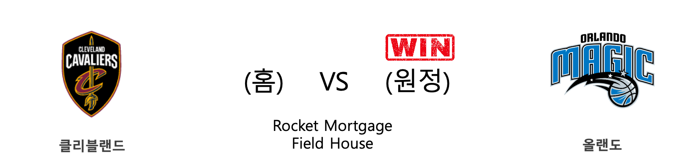

<table class="tg">
  <tr>
    <th class="tg-rr9t">CLE</th>
    <th class="tg-rr9t">팀</th>
    <th class="tg-rr9t">ORL</th>
  </tr>
  <tr>
    <td class="tg-dcpn">0승 2패</td>
    <td class="tg-rr9t">시즌 상대전적</td>
    <td class="tg-dcpn">2승 0패</td>
  </tr>
  <tr>
    <td class="tg-dcpn">104</td>
    <td class="tg-rr9t">점수</td>
    <td class="tg-dcpn">116</td>
  </tr>
  <tr>
    <td class="tg-dcpn">26/47(55%)</td>
    <td class="tg-rr9t">2점(%)</td>
    <td class="tg-dcpn">33/60(55%)</td>
  </tr>
  <tr>
    <td class="tg-dcpn">11/34(32%)</td>
    <td class="tg-rr9t">3점(%)</td>
    <td class="tg-dcpn">12/33(36%)</td>
  </tr>
  <tr>
    <td class="tg-dcpn">19/22(86%)</td>
    <td class="tg-rr9t">자유투(%)</td>
    <td class="tg-dcpn">14/17(82%)</td>
  </tr>
  <tr>
    <td class="tg-dcpn">49</td>
    <td class="tg-rr9t">리바운드</td>
    <td class="tg-dcpn">34</td>
  </tr>
  <tr>
    <td class="tg-dcpn">20</td>
    <td class="tg-rr9t">어시스트</td>
    <td class="tg-dcpn">23</td>
  </tr>
  <tr>
    <td class="tg-dcpn">5</td>
    <td class="tg-rr9t">스틸</td>
    <td class="tg-dcpn">13</td>
  </tr>
  <tr>
    <td class="tg-dcpn">0</td>
    <td class="tg-rr9t">블록</td>
    <td class="tg-dcpn">6</td>
  </tr>
  <tr>
    <td class="tg-dcpn">25</td>
    <td class="tg-rr9t">턴오버</td>
    <td class="tg-dcpn">11</td>
  </tr>
  <tr>
    <td class="tg-dcpn">DariusGarland(16) CollinSextonG(20)</td>
    <td class="tg-rr9t">주요 득점선수</td>
    <td class="tg-dcpn">MoBamba(15) EvanFournierG(30) TerrenceRoss(16) MarkelleFultz(15) JonathanIsaac(16)</td>
  </tr>
</table>

#### 경기 관련 주요 기사         

[[오늘의 NBA] (11/24) 잭 라빈, GSW 스플래쉬 브라더스를 소환하다](http://sports.news.naver.com/basketball/news/read.nhn?oid=486&aid=0000001147)

[[오늘의 NBA] (11/28) 앤써니 데이비스, 노란 셔츠를 입은 사나이](http://sports.news.naver.com/basketball/news/read.nhn?oid=486&aid=0000001151)

[[오늘의 NBA] (11/26) 마크 가솔, 조엘 엠비드의 영원한 악몽](http://sports.news.naver.com/basketball/news/read.nhn?oid=486&aid=0000001149)

[[오늘의 NBA] (11/21) 클리퍼스, 안티 볼 핸들러 세계관을 구축하다](http://sports.news.naver.com/basketball/news/read.nhn?oid=486&aid=0000001144)

[[오늘의 NBA] (11/25) 댈러스, 공격이 승리를 부른다!](http://sports.news.naver.com/basketball/news/read.nhn?oid=486&aid=0000001148)

        
        

#### 리그 (Eastern) 순위
    

<table class="tg">
  <tr>
    <th class="tg-d14o">순위</th>
    <th class="tg-d14o">팀명</th>
    <th class="tg-d14o">경기수</th>
    <th class="tg-d14o">승</th>
    <th class="tg-d14o">패</th>
    <th class="tg-d14o">승차</th>
    <th class="tg-d14o">승률</th>
  </tr>
  
<tr>
    <td class="tg-50j8">1</td>
    <td class="tg-50j8">MIL</td>
    <td class="tg-50j8">18</td>
    <td class="tg-50j8">15</td>
    <td class="tg-50j8">3</td>
    <td class="tg-50j8">1</td>
    <td class="tg-50j8">0.833</td>
</tr>

<tr>
    <td class="tg-50j8">2</td>
    <td class="tg-50j8">BOS</td>
    <td class="tg-50j8">17</td>
    <td class="tg-50j8">13</td>
    <td class="tg-50j8">4</td>
    <td class="tg-50j8">3</td>
    <td class="tg-50j8">0.765</td>
</tr>

<tr>
    <td class="tg-50j8">2</td>
    <td class="tg-50j8">TOR</td>
    <td class="tg-50j8">17</td>
    <td class="tg-50j8">13</td>
    <td class="tg-50j8">4</td>
    <td class="tg-50j8">3</td>
    <td class="tg-50j8">0.765</td>
</tr>

<tr>
    <td class="tg-50j8">4</td>
    <td class="tg-50j8">MIA</td>
    <td class="tg-50j8">17</td>
    <td class="tg-50j8">12</td>
    <td class="tg-50j8">5</td>
    <td class="tg-50j8">4</td>
    <td class="tg-50j8">0.706</td>
</tr>

<tr>
    <td class="tg-50j8">5</td>
    <td class="tg-50j8">PHI</td>
    <td class="tg-50j8">18</td>
    <td class="tg-50j8">12</td>
    <td class="tg-50j8">6</td>
    <td class="tg-50j8">4</td>
    <td class="tg-50j8">0.667</td>
</tr>

<tr>
    <td class="tg-50j8">6</td>
    <td class="tg-50j8">IND</td>
    <td class="tg-50j8">17</td>
    <td class="tg-50j8">11</td>
    <td class="tg-50j8">6</td>
    <td class="tg-50j8">5</td>
    <td class="tg-50j8">0.647</td>
</tr>

<tr>
    <td class="tg-50j8">7</td>
    <td class="tg-50j8">BKN</td>
    <td class="tg-50j8">18</td>
    <td class="tg-50j8">9</td>
    <td class="tg-50j8">9</td>
    <td class="tg-50j8">7</td>
    <td class="tg-50j8">0.5</td>
</tr>

<tr>
    <td class="tg-50j8">8</td>
    <td class="tg-50j8">ORL</td>
    <td class="tg-50j8">17</td>
    <td class="tg-50j8">7</td>
    <td class="tg-50j8">10</td>
    <td class="tg-50j8">9</td>
    <td class="tg-50j8">0.412</td>
</tr>

<tr>
    <td class="tg-50j8">9</td>
    <td class="tg-50j8">CHA</td>
    <td class="tg-50j8">19</td>
    <td class="tg-50j8">7</td>
    <td class="tg-50j8">12</td>
    <td class="tg-50j8">9</td>
    <td class="tg-50j8">0.368</td>
</tr>

<tr>
    <td class="tg-50j8">10</td>
    <td class="tg-50j8">WAS</td>
    <td class="tg-50j8">16</td>
    <td class="tg-50j8">6</td>
    <td class="tg-50j8">10</td>
    <td class="tg-50j8">10</td>
    <td class="tg-50j8">0.375</td>
</tr>

<tr>
    <td class="tg-50j8">11</td>
    <td class="tg-50j8">DET</td>
    <td class="tg-50j8">18</td>
    <td class="tg-50j8">6</td>
    <td class="tg-50j8">12</td>
    <td class="tg-50j8">10</td>
    <td class="tg-50j8">0.333</td>
</tr>

<tr>
    <td class="tg-50j8">12</td>
    <td class="tg-50j8">CHI</td>
    <td class="tg-50j8">19</td>
    <td class="tg-50j8">6</td>
    <td class="tg-50j8">13</td>
    <td class="tg-50j8">10</td>
    <td class="tg-50j8">0.316</td>
</tr>

<tr>
    <td class="tg-50j8">13</td>
    <td class="tg-50j8">CLE</td>
    <td class="tg-50j8">18</td>
    <td class="tg-50j8">5</td>
    <td class="tg-50j8">13</td>
    <td class="tg-50j8">11</td>
    <td class="tg-50j8">0.278</td>
</tr>

<tr>
    <td class="tg-50j8">14</td>
    <td class="tg-50j8">NYK</td>
    <td class="tg-50j8">18</td>
    <td class="tg-50j8">4</td>
    <td class="tg-50j8">14</td>
    <td class="tg-50j8">12</td>
    <td class="tg-50j8">0.222</td>
</tr>

<tr>
    <td class="tg-50j8">14</td>
    <td class="tg-50j8">ATL</td>
    <td class="tg-50j8">18</td>
    <td class="tg-50j8">4</td>
    <td class="tg-50j8">14</td>
    <td class="tg-50j8">12</td>
    <td class="tg-50j8">0.222</td>
</tr>
</table> 
#### 리그 (Western) 순위
    

<table class="tg">
  <tr>
    <th class="tg-d14o">순위</th>
    <th class="tg-d14o">팀명</th>
    <th class="tg-d14o">경기수</th>
    <th class="tg-d14o">승</th>
    <th class="tg-d14o">패</th>
    <th class="tg-d14o">승차</th>
    <th class="tg-d14o">승률</th>
  </tr>
  
<tr>
    <td class="tg-50j8">1</td>
    <td class="tg-50j8">LAL</td>
    <td class="tg-50j8">18</td>
    <td class="tg-50j8">16</td>
    <td class="tg-50j8">2</td>
    <td class="tg-50j8">0</td>
    <td class="tg-50j8">0.889</td>
</tr>

<tr>
    <td class="tg-50j8">2</td>
    <td class="tg-50j8">LAC</td>
    <td class="tg-50j8">19</td>
    <td class="tg-50j8">14</td>
    <td class="tg-50j8">5</td>
    <td class="tg-50j8">2</td>
    <td class="tg-50j8">0.737</td>
</tr>

<tr>
    <td class="tg-50j8">3</td>
    <td class="tg-50j8">DEN</td>
    <td class="tg-50j8">16</td>
    <td class="tg-50j8">13</td>
    <td class="tg-50j8">3</td>
    <td class="tg-50j8">3</td>
    <td class="tg-50j8">0.812</td>
</tr>

<tr>
    <td class="tg-50j8">4</td>
    <td class="tg-50j8">HOU</td>
    <td class="tg-50j8">18</td>
    <td class="tg-50j8">12</td>
    <td class="tg-50j8">6</td>
    <td class="tg-50j8">4</td>
    <td class="tg-50j8">0.667</td>
</tr>

<tr>
    <td class="tg-50j8">5</td>
    <td class="tg-50j8">DAL</td>
    <td class="tg-50j8">17</td>
    <td class="tg-50j8">11</td>
    <td class="tg-50j8">6</td>
    <td class="tg-50j8">5</td>
    <td class="tg-50j8">0.647</td>
</tr>

<tr>
    <td class="tg-50j8">6</td>
    <td class="tg-50j8">UTA</td>
    <td class="tg-50j8">18</td>
    <td class="tg-50j8">11</td>
    <td class="tg-50j8">7</td>
    <td class="tg-50j8">5</td>
    <td class="tg-50j8">0.611</td>
</tr>

<tr>
    <td class="tg-50j8">7</td>
    <td class="tg-50j8">MIN</td>
    <td class="tg-50j8">18</td>
    <td class="tg-50j8">10</td>
    <td class="tg-50j8">8</td>
    <td class="tg-50j8">6</td>
    <td class="tg-50j8">0.556</td>
</tr>

<tr>
    <td class="tg-50j8">8</td>
    <td class="tg-50j8">PHX</td>
    <td class="tg-50j8">17</td>
    <td class="tg-50j8">8</td>
    <td class="tg-50j8">9</td>
    <td class="tg-50j8">8</td>
    <td class="tg-50j8">0.471</td>
</tr>

<tr>
    <td class="tg-50j8">9</td>
    <td class="tg-50j8">SAC</td>
    <td class="tg-50j8">17</td>
    <td class="tg-50j8">7</td>
    <td class="tg-50j8">10</td>
    <td class="tg-50j8">9</td>
    <td class="tg-50j8">0.412</td>
</tr>

<tr>
    <td class="tg-50j8">10</td>
    <td class="tg-50j8">POR</td>
    <td class="tg-50j8">19</td>
    <td class="tg-50j8">7</td>
    <td class="tg-50j8">12</td>
    <td class="tg-50j8">9</td>
    <td class="tg-50j8">0.368</td>
</tr>

<tr>
    <td class="tg-50j8">11</td>
    <td class="tg-50j8">OKC</td>
    <td class="tg-50j8">17</td>
    <td class="tg-50j8">6</td>
    <td class="tg-50j8">11</td>
    <td class="tg-50j8">10</td>
    <td class="tg-50j8">0.353</td>
</tr>

<tr>
    <td class="tg-50j8">12</td>
    <td class="tg-50j8">NOP</td>
    <td class="tg-50j8">18</td>
    <td class="tg-50j8">6</td>
    <td class="tg-50j8">12</td>
    <td class="tg-50j8">10</td>
    <td class="tg-50j8">0.333</td>
</tr>

<tr>
    <td class="tg-50j8">13</td>
    <td class="tg-50j8">SAS</td>
    <td class="tg-50j8">19</td>
    <td class="tg-50j8">6</td>
    <td class="tg-50j8">13</td>
    <td class="tg-50j8">10</td>
    <td class="tg-50j8">0.316</td>
</tr>

<tr>
    <td class="tg-50j8">14</td>
    <td class="tg-50j8">MEM</td>
    <td class="tg-50j8">17</td>
    <td class="tg-50j8">5</td>
    <td class="tg-50j8">12</td>
    <td class="tg-50j8">11</td>
    <td class="tg-50j8">0.294</td>
</tr>

<tr>
    <td class="tg-50j8">15</td>
    <td class="tg-50j8">GSW</td>
    <td class="tg-50j8">19</td>
    <td class="tg-50j8">4</td>
    <td class="tg-50j8">15</td>
    <td class="tg-50j8">12</td>
    <td class="tg-50j8">0.211</td>
</tr>
</table> 

        
        
