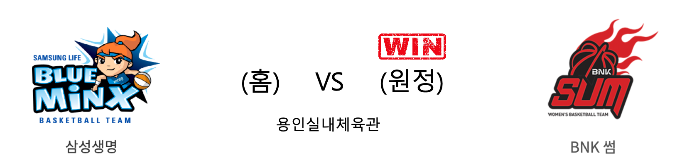

####  삼성생명(홈) VS BNK썸(원정) 

<table class="tg">
  <tr>
    <th class="tg-rr9t">삼성생명</th>
    <th class="tg-rr9t">팀</th>
    <th class="tg-rr9t">BNK썸</th>
  </tr>
  <tr>
    <td class="tg-dcpn">1승 1패</td>
    <td class="tg-rr9t">시즌 상대전적</td>
    <td class="tg-dcpn">1승 1패</td>
  </tr>
  <tr>
    <td class="tg-dcpn">72</td>
    <td class="tg-rr9t">점수</td>
    <td class="tg-dcpn">83</td>
  </tr>
  <tr>
    <td class="tg-dcpn">22/48(46%)</td>
    <td class="tg-rr9t">2점(%)</td>
    <td class="tg-dcpn">21/38(55%)</td>
  </tr>
  <tr>
    <td class="tg-dcpn">6/20(30%)</td>
    <td class="tg-rr9t">3점(%)</td>
    <td class="tg-dcpn">11/24(46%)</td>
  </tr>
  <tr>
    <td class="tg-dcpn">10/14(71%)</td>
    <td class="tg-rr9t">자유투(%)</td>
    <td class="tg-dcpn">8/8(100%)</td>
  </tr>
  <tr>
    <td class="tg-dcpn">35</td>
    <td class="tg-rr9t">리바운드</td>
    <td class="tg-dcpn">26</td>
  </tr>
  <tr>
    <td class="tg-dcpn">20</td>
    <td class="tg-rr9t">어시스트</td>
    <td class="tg-dcpn">24</td>
  </tr>
  <tr>
    <td class="tg-dcpn">10</td>
    <td class="tg-rr9t">스틸</td>
    <td class="tg-dcpn">8</td>
  </tr>
  <tr>
    <td class="tg-dcpn">13</td>
    <td class="tg-rr9t">블록</td>
    <td class="tg-dcpn">12</td>
  </tr>
  <tr>
    <td class="tg-dcpn">18</td>
    <td class="tg-rr9t">턴오버</td>
    <td class="tg-dcpn">17</td>
  </tr>
  <tr>
    <td class="tg-dcpn">윤예빈(15)</td>
    <td class="tg-rr9t">주요 득점선수</td>
    <td class="tg-dcpn">단타스(20)</td>
  </tr>
</table>

#### 경기 관련 주요 기사         

[[루키 프리뷰] '1라운드 22점 차 대승' 삼성생명 vs '리그 5연패' BNK 썸](http://www.rookie.co.kr/news/articleView.html?idxno=35441)

[[포토] BNK썸 '창단 첫 승!](http://www.rookie.co.kr/news/articleView.html?idxno=35466)

[[내 맘대로 프리뷰] '개막 후 첫 승 노리는' BNK vs '휴식기 이후 첫 승 노리는' 삼성생명](http://www.basketkorea.com/news/articleView.html?idxno=190414)

['안혜지 14득점 12어시스트' BNK썸, 삼성생명 잡고 감격의 창단 첫 승](http://news1.kr/articles/?3782030)

        
        

#### 리그 순위

<table class="tg">
  <tr>
    <th class="tg-d14o">순위</th>
    <th class="tg-d14o">팀명</th>
    <th class="tg-d14o">경기수</th>
    <th class="tg-d14o">승</th>
    <th class="tg-d14o">패</th>
    <th class="tg-d14o">승차</th>
    <th class="tg-d14o">승률</th>
  </tr>
  
<tr>
    <td class="tg-50j8">1</td>
    <td class="tg-50j8">우리은행</td>
    <td class="tg-50j8">7</td>
    <td class="tg-50j8">6</td>
    <td class="tg-50j8">1</td>
    <td class="tg-50j8">0</td>
    <td class="tg-50j8">0.857</td>
</tr>

<tr>
    <td class="tg-50j8">2</td>
    <td class="tg-50j8">KB스타즈</td>
    <td class="tg-50j8">6</td>
    <td class="tg-50j8">5</td>
    <td class="tg-50j8">1</td>
    <td class="tg-50j8">1</td>
    <td class="tg-50j8">0.833</td>
</tr>

<tr>
    <td class="tg-50j8">3</td>
    <td class="tg-50j8">삼성생명</td>
    <td class="tg-50j8">7</td>
    <td class="tg-50j8">3</td>
    <td class="tg-50j8">4</td>
    <td class="tg-50j8">3</td>
    <td class="tg-50j8">0.429</td>
</tr>

<tr>
    <td class="tg-50j8">4</td>
    <td class="tg-50j8">KEB하나</td>
    <td class="tg-50j8">6</td>
    <td class="tg-50j8">2</td>
    <td class="tg-50j8">4</td>
    <td class="tg-50j8">4</td>
    <td class="tg-50j8">0.333</td>
</tr>

<tr>
    <td class="tg-50j8">4</td>
    <td class="tg-50j8">신한은행</td>
    <td class="tg-50j8">6</td>
    <td class="tg-50j8">2</td>
    <td class="tg-50j8">4</td>
    <td class="tg-50j8">4</td>
    <td class="tg-50j8">0.333</td>
</tr>

<tr>
    <td class="tg-50j8">6</td>
    <td class="tg-50j8">BNK썸</td>
    <td class="tg-50j8">6</td>
    <td class="tg-50j8">1</td>
    <td class="tg-50j8">5</td>
    <td class="tg-50j8">5</td>
    <td class="tg-50j8">0.167</td>
</tr>
</table> 

        
        
