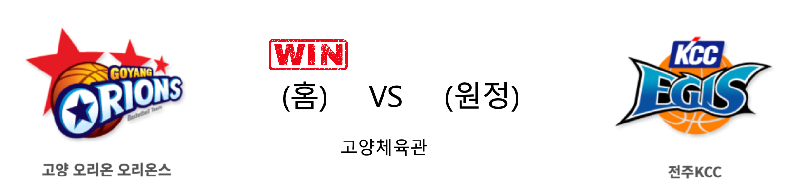

####  창원LG(홈) VS 인천전자랜드(원정) 

<table class="tg">
  <tr>
    <th class="tg-rr9t">창원LG</th>
    <th class="tg-rr9t">팀</th>
    <th class="tg-rr9t">인천전자랜드</th>
  </tr>
  <tr>
    <td class="tg-dcpn">1승 1패</td>
    <td class="tg-rr9t">시즌 상대전적</td>
    <td class="tg-dcpn">1승 1패</td>
  </tr>
  <tr>
    <td class="tg-dcpn">63</td>
    <td class="tg-rr9t">점수</td>
    <td class="tg-dcpn">61</td>
  </tr>
  <tr>
    <td class="tg-dcpn">11/42(26%)</td>
    <td class="tg-rr9t">2점(%)</td>
    <td class="tg-dcpn">14/42(33%)</td>
  </tr>
  <tr>
    <td class="tg-dcpn">10/31(32%)</td>
    <td class="tg-rr9t">3점(%)</td>
    <td class="tg-dcpn">8/23(35%)</td>
  </tr>
  <tr>
    <td class="tg-dcpn">11/14(79%)</td>
    <td class="tg-rr9t">자유투(%)</td>
    <td class="tg-dcpn">9/11(82%)</td>
  </tr>
  <tr>
    <td class="tg-dcpn">41</td>
    <td class="tg-rr9t">리바운드</td>
    <td class="tg-dcpn">41</td>
  </tr>
  <tr>
    <td class="tg-dcpn">1</td>
    <td class="tg-rr9t">어시스트</td>
    <td class="tg-dcpn">1</td>
  </tr>
  <tr>
    <td class="tg-dcpn">10</td>
    <td class="tg-rr9t">스틸</td>
    <td class="tg-dcpn">14</td>
  </tr>
  <tr>
    <td class="tg-dcpn">6</td>
    <td class="tg-rr9t">블록</td>
    <td class="tg-dcpn">10</td>
  </tr>
  <tr>
    <td class="tg-dcpn">14</td>
    <td class="tg-rr9t">턴오버</td>
    <td class="tg-dcpn">9</td>
  </tr>
  <tr>
    <td class="tg-dcpn">캐디 라렌(21)</td>
    <td class="tg-rr9t">주요 득점선수</td>
    <td class="tg-dcpn">섀넌 쇼터(17)</td>
  </tr>
</table>

#### 경기 관련 주요 기사         

['라렌 21점 12리바운드' LG, 전자랜드 꺾고 2연패 탈출…오리온은 KCC 제압](http://stoo.asiae.co.kr/article.php?aid=60089674325)

[창원 LG 라렌 21P-12R 연패 탈출 이끌었다](http://www.knnews.co.kr/news/articleView.php?idxno=1312432)

[[부상] LG 조성민 복귀 불발 ... 훈련은 소화하는 상황](http://sports.news.naver.com/basketball/news/read.nhn?oid=065&aid=0000193286)

        
        

####  고양오리온(홈) VS 전주KCC(원정) 

<table class="tg">
  <tr>
    <th class="tg-rr9t">고양오리온</th>
    <th class="tg-rr9t">팀</th>
    <th class="tg-rr9t">전주KCC</th>
  </tr>
  <tr>
    <td class="tg-dcpn">1승 1패</td>
    <td class="tg-rr9t">시즌 상대전적</td>
    <td class="tg-dcpn">1승 1패</td>
  </tr>
  <tr>
    <td class="tg-dcpn">87</td>
    <td class="tg-rr9t">점수</td>
    <td class="tg-dcpn">73</td>
  </tr>
  <tr>
    <td class="tg-dcpn">21/41(51%)</td>
    <td class="tg-rr9t">2점(%)</td>
    <td class="tg-dcpn">15/29(52%)</td>
  </tr>
  <tr>
    <td class="tg-dcpn">12/34(35%)</td>
    <td class="tg-rr9t">3점(%)</td>
    <td class="tg-dcpn">9/28(32%)</td>
  </tr>
  <tr>
    <td class="tg-dcpn">9/11(82%)</td>
    <td class="tg-rr9t">자유투(%)</td>
    <td class="tg-dcpn">16/21(76%)</td>
  </tr>
  <tr>
    <td class="tg-dcpn">41</td>
    <td class="tg-rr9t">리바운드</td>
    <td class="tg-dcpn">29</td>
  </tr>
  <tr>
    <td class="tg-dcpn">1</td>
    <td class="tg-rr9t">어시스트</td>
    <td class="tg-dcpn">1</td>
  </tr>
  <tr>
    <td class="tg-dcpn">8</td>
    <td class="tg-rr9t">스틸</td>
    <td class="tg-dcpn">12</td>
  </tr>
  <tr>
    <td class="tg-dcpn">5</td>
    <td class="tg-rr9t">블록</td>
    <td class="tg-dcpn">7</td>
  </tr>
  <tr>
    <td class="tg-dcpn">23</td>
    <td class="tg-rr9t">턴오버</td>
    <td class="tg-dcpn">19</td>
  </tr>
  <tr>
    <td class="tg-dcpn"></td>
    <td class="tg-rr9t">주요 득점선수</td>
    <td class="tg-dcpn">라건아(27) 이대성(24)</td>
  </tr>
</table>

#### 경기 관련 주요 기사         

['이승현 더블더블' 오리온, '이대성 24점' KCC 제압(종합)](http://yna.kr/AKR20191130036851007?did=1195m)

[[BK Review] '이현민 터졌다' 오리온, KCC 꺾고 2연패 탈출](http://www.basketkorea.com/news/articleView.html?idxno=190438)

['베테랑 활약' 오리온, KCC 잡고 연패 탈출… LG도 전자랜드에 승](http://isplus.live.joins.com/news/article/aid.asp?aid=23240281)

[[JB포토화보] 오리온, 접전끝에 KCC에 87대 73으로 승리](http://sports.news.naver.com/basketball/news/read.nhn?oid=065&aid=0000193303)

        
        

#### 리그 순위

<table class="tg">
  <tr>
    <th class="tg-d14o">순위</th>
    <th class="tg-d14o">팀명</th>
    <th class="tg-d14o">경기수</th>
    <th class="tg-d14o">승</th>
    <th class="tg-d14o">패</th>
    <th class="tg-d14o">승차</th>
    <th class="tg-d14o">승률</th>
  </tr>
  
<tr>
    <td class="tg-50j8">1</td>
    <td class="tg-50j8">서울SK</td>
    <td class="tg-50j8">16</td>
    <td class="tg-50j8">12</td>
    <td class="tg-50j8">4</td>
    <td class="tg-50j8">0</td>
    <td class="tg-50j8">0.75</td>
</tr>

<tr>
    <td class="tg-50j8">2</td>
    <td class="tg-50j8">원주DB</td>
    <td class="tg-50j8">17</td>
    <td class="tg-50j8">11</td>
    <td class="tg-50j8">6</td>
    <td class="tg-50j8">1</td>
    <td class="tg-50j8">0.647</td>
</tr>

<tr>
    <td class="tg-50j8">3</td>
    <td class="tg-50j8">인천전자랜드</td>
    <td class="tg-50j8">16</td>
    <td class="tg-50j8">9</td>
    <td class="tg-50j8">7</td>
    <td class="tg-50j8">3</td>
    <td class="tg-50j8">0.562</td>
</tr>

<tr>
    <td class="tg-50j8">4</td>
    <td class="tg-50j8">안양KGC</td>
    <td class="tg-50j8">17</td>
    <td class="tg-50j8">9</td>
    <td class="tg-50j8">8</td>
    <td class="tg-50j8">3</td>
    <td class="tg-50j8">0.529</td>
</tr>

<tr>
    <td class="tg-50j8">5</td>
    <td class="tg-50j8">전주KCC</td>
    <td class="tg-50j8">18</td>
    <td class="tg-50j8">9</td>
    <td class="tg-50j8">9</td>
    <td class="tg-50j8">3</td>
    <td class="tg-50j8">0.5</td>
</tr>

<tr>
    <td class="tg-50j8">6</td>
    <td class="tg-50j8">서울삼성</td>
    <td class="tg-50j8">17</td>
    <td class="tg-50j8">8</td>
    <td class="tg-50j8">9</td>
    <td class="tg-50j8">4</td>
    <td class="tg-50j8">0.471</td>
</tr>

<tr>
    <td class="tg-50j8">7</td>
    <td class="tg-50j8">울산현대모비스</td>
    <td class="tg-50j8">18</td>
    <td class="tg-50j8">8</td>
    <td class="tg-50j8">10</td>
    <td class="tg-50j8">4</td>
    <td class="tg-50j8">0.444</td>
</tr>

<tr>
    <td class="tg-50j8">8</td>
    <td class="tg-50j8">부산KT</td>
    <td class="tg-50j8">16</td>
    <td class="tg-50j8">7</td>
    <td class="tg-50j8">9</td>
    <td class="tg-50j8">5</td>
    <td class="tg-50j8">0.438</td>
</tr>

<tr>
    <td class="tg-50j8">9</td>
    <td class="tg-50j8">고양오리온</td>
    <td class="tg-50j8">17</td>
    <td class="tg-50j8">6</td>
    <td class="tg-50j8">11</td>
    <td class="tg-50j8">6</td>
    <td class="tg-50j8">0.353</td>
</tr>

<tr>
    <td class="tg-50j8">10</td>
    <td class="tg-50j8">창원LG</td>
    <td class="tg-50j8">18</td>
    <td class="tg-50j8">6</td>
    <td class="tg-50j8">12</td>
    <td class="tg-50j8">6</td>
    <td class="tg-50j8">0.333</td>
</tr>
</table> 

        
        
