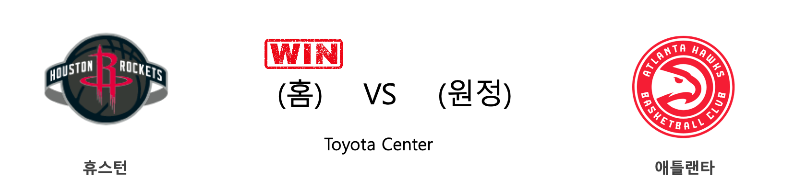
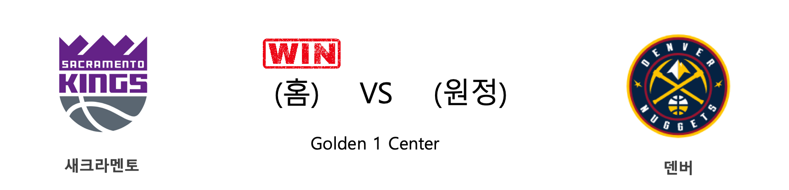
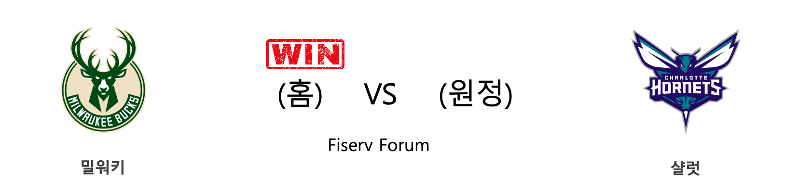

####  휴스턴(홈) VS 애틀랜타(원정) 

<table class="tg">
  <tr>
    <th class="tg-rr9t">HOU</th>
    <th class="tg-rr9t">팀</th>
    <th class="tg-rr9t">ATL</th>
  </tr>
  <tr>
    <td class="tg-dcpn">1승 0패</td>
    <td class="tg-rr9t">시즌 상대전적</td>
    <td class="tg-dcpn">0승 1패</td>
  </tr>
  <tr>
    <td class="tg-dcpn">158</td>
    <td class="tg-rr9t">점수</td>
    <td class="tg-dcpn">111</td>
  </tr>
  <tr>
    <td class="tg-dcpn">27/38(71%)</td>
    <td class="tg-rr9t">2점(%)</td>
    <td class="tg-dcpn">23/43(53%)</td>
  </tr>
  <tr>
    <td class="tg-dcpn">25/51(49%)</td>
    <td class="tg-rr9t">3점(%)</td>
    <td class="tg-dcpn">15/46(33%)</td>
  </tr>
  <tr>
    <td class="tg-dcpn">29/34(85%)</td>
    <td class="tg-rr9t">자유투(%)</td>
    <td class="tg-dcpn">20/25(80%)</td>
  </tr>
  <tr>
    <td class="tg-dcpn">52</td>
    <td class="tg-rr9t">리바운드</td>
    <td class="tg-dcpn">29</td>
  </tr>
  <tr>
    <td class="tg-dcpn">30</td>
    <td class="tg-rr9t">어시스트</td>
    <td class="tg-dcpn">26</td>
  </tr>
  <tr>
    <td class="tg-dcpn">9</td>
    <td class="tg-rr9t">스틸</td>
    <td class="tg-dcpn">5</td>
  </tr>
  <tr>
    <td class="tg-dcpn">2</td>
    <td class="tg-rr9t">블록</td>
    <td class="tg-dcpn">2</td>
  </tr>
  <tr>
    <td class="tg-dcpn">15</td>
    <td class="tg-rr9t">턴오버</td>
    <td class="tg-dcpn">13</td>
  </tr>
  <tr>
    <td class="tg-dcpn">BenMcLemoreF(24) JamesHardenG(60) ChrisClemons(16) RussellWestbr(15)</td>
    <td class="tg-rr9t">주요 득점선수</td>
    <td class="tg-dcpn">TraeYoungG(37)</td>
  </tr>
</table>

#### 경기 관련 주요 기사         

[하든, 30분 뛰고 60점 '폭발'... HOU, ATL 10연패 빠뜨려](http://star.mt.co.kr/stview.php?no=2019120113385450531)

[[오늘의 NBA] (11/30) 인디애나, 동부컨퍼런스의 복병](http://sports.news.naver.com/basketball/news/read.nhn?oid=486&aid=0000001152)

[[오늘의 NBA] (12/1) 새크라멘토의 IQ 농구](http://sports.news.naver.com/basketball/news/read.nhn?oid=486&aid=0000001153)

[[오늘의 NBA] (11/28) 앤써니 데이비스, 노란 셔츠를 입은 사나이](http://sports.news.naver.com/basketball/news/read.nhn?oid=486&aid=0000001151)

[류현진, ESPN 선정 MLB '세컨드 팀'에 뽑혀](http://www.mbcsportsplus.com/news/?mode=view&cate=2&b_idx=99825044.000)

        
        

####  새크라멘토(홈) VS 덴버(원정) 

<table class="tg">
  <tr>
    <th class="tg-rr9t">SAC</th>
    <th class="tg-rr9t">팀</th>
    <th class="tg-rr9t">DEN</th>
  </tr>
  <tr>
    <td class="tg-dcpn">1승 1패</td>
    <td class="tg-rr9t">시즌 상대전적</td>
    <td class="tg-dcpn">1승 1패</td>
  </tr>
  <tr>
    <td class="tg-dcpn">100</td>
    <td class="tg-rr9t">점수</td>
    <td class="tg-dcpn">97</td>
  </tr>
  <tr>
    <td class="tg-dcpn">29/63(46%)</td>
    <td class="tg-rr9t">2점(%)</td>
    <td class="tg-dcpn">25/55(45%)</td>
  </tr>
  <tr>
    <td class="tg-dcpn">8/33(24%)</td>
    <td class="tg-rr9t">3점(%)</td>
    <td class="tg-dcpn">11/32(34%)</td>
  </tr>
  <tr>
    <td class="tg-dcpn">18/21(86%)</td>
    <td class="tg-rr9t">자유투(%)</td>
    <td class="tg-dcpn">14/21(67%)</td>
  </tr>
  <tr>
    <td class="tg-dcpn">50</td>
    <td class="tg-rr9t">리바운드</td>
    <td class="tg-dcpn">48</td>
  </tr>
  <tr>
    <td class="tg-dcpn">22</td>
    <td class="tg-rr9t">어시스트</td>
    <td class="tg-dcpn">23</td>
  </tr>
  <tr>
    <td class="tg-dcpn">12</td>
    <td class="tg-rr9t">스틸</td>
    <td class="tg-dcpn">11</td>
  </tr>
  <tr>
    <td class="tg-dcpn">4</td>
    <td class="tg-rr9t">블록</td>
    <td class="tg-dcpn">5</td>
  </tr>
  <tr>
    <td class="tg-dcpn">14</td>
    <td class="tg-rr9t">턴오버</td>
    <td class="tg-dcpn">16</td>
  </tr>
  <tr>
    <td class="tg-dcpn">HarrisonBarne(30) BuddyHieldG(21)</td>
    <td class="tg-rr9t">주요 득점선수</td>
    <td class="tg-dcpn">JamalMurrayG(15) GaryHarrisG(25)</td>
  </tr>
</table>

#### 경기 관련 주요 기사         

[[오늘의 NBA] (11/18) 새크라멘토, 리그 선두 보스턴을 제압하다](http://sports.news.naver.com/basketball/news/read.nhn?oid=486&aid=0000001141)

[[오늘의 NBA] (11/21) 클리퍼스, 안티 볼 핸들러 세계관을 구축하다](http://sports.news.naver.com/basketball/news/read.nhn?oid=486&aid=0000001144)

[[오늘의 NBA] (12/1) 새크라멘토의 IQ 농구](http://sports.news.naver.com/basketball/news/read.nhn?oid=486&aid=0000001153)

[[오늘의 NBA] (11/30) 인디애나, 동부컨퍼런스의 복병](http://sports.news.naver.com/basketball/news/read.nhn?oid=486&aid=0000001152)

[[오늘의 NBA] (11/23) 카와이 레너드, 승부를 결정짓는 사나이](http://sports.news.naver.com/basketball/news/read.nhn?oid=486&aid=0000001146)

        
        

####  필라델피아(홈) VS 인디애나(원정) 

<table class="tg">
  <tr>
    <th class="tg-rr9t">PHI</th>
    <th class="tg-rr9t">팀</th>
    <th class="tg-rr9t">IND</th>
  </tr>
  <tr>
    <td class="tg-dcpn">1승 0패</td>
    <td class="tg-rr9t">시즌 상대전적</td>
    <td class="tg-dcpn">0승 1패</td>
  </tr>
  <tr>
    <td class="tg-dcpn">119</td>
    <td class="tg-rr9t">점수</td>
    <td class="tg-dcpn">116</td>
  </tr>
  <tr>
    <td class="tg-dcpn">27/54(50%)</td>
    <td class="tg-rr9t">2점(%)</td>
    <td class="tg-dcpn">31/54(57%)</td>
  </tr>
  <tr>
    <td class="tg-dcpn">11/23(48%)</td>
    <td class="tg-rr9t">3점(%)</td>
    <td class="tg-dcpn">11/22(50%)</td>
  </tr>
  <tr>
    <td class="tg-dcpn">32/36(89%)</td>
    <td class="tg-rr9t">자유투(%)</td>
    <td class="tg-dcpn">21/25(84%)</td>
  </tr>
  <tr>
    <td class="tg-dcpn">32</td>
    <td class="tg-rr9t">리바운드</td>
    <td class="tg-dcpn">31</td>
  </tr>
  <tr>
    <td class="tg-dcpn">27</td>
    <td class="tg-rr9t">어시스트</td>
    <td class="tg-dcpn">22</td>
  </tr>
  <tr>
    <td class="tg-dcpn">12</td>
    <td class="tg-rr9t">스틸</td>
    <td class="tg-dcpn">7</td>
  </tr>
  <tr>
    <td class="tg-dcpn">5</td>
    <td class="tg-rr9t">블록</td>
    <td class="tg-dcpn">3</td>
  </tr>
  <tr>
    <td class="tg-dcpn">12</td>
    <td class="tg-rr9t">턴오버</td>
    <td class="tg-dcpn">19</td>
  </tr>
  <tr>
    <td class="tg-dcpn">JoelEmbiidC(32) BenSimmonsG(15) TobiasHarrisF(22) AlHorfordF(15)</td>
    <td class="tg-rr9t">주요 득점선수</td>
    <td class="tg-dcpn">MalcolmBrogdo(28) T.J.WarrenF(29) JeremyLambG(15)</td>
  </tr>
</table>

#### 경기 관련 주요 기사         

[[오늘의 NBA] (12/1) 새크라멘토의 IQ 농구](http://sports.news.naver.com/basketball/news/read.nhn?oid=486&aid=0000001153)

[[오늘의 NBA] (11/28) 앤써니 데이비스, 노란 셔츠를 입은 사나이](http://sports.news.naver.com/basketball/news/read.nhn?oid=486&aid=0000001151)

[[오늘의 NBA] (11/26) 마크 가솔, 조엘 엠비드의 영원한 악몽](http://sports.news.naver.com/basketball/news/read.nhn?oid=486&aid=0000001149)

[[오늘의 NBA] (11/30) 인디애나, 동부컨퍼런스의 복병](http://sports.news.naver.com/basketball/news/read.nhn?oid=486&aid=0000001152)

[[오늘의 NBA] (11/24) 잭 라빈, GSW 스플래쉬 브라더스를 소환하다](http://sports.news.naver.com/basketball/news/read.nhn?oid=486&aid=0000001147)

        
        

####  밀워키(홈) VS 샬럿(원정) 

<table class="tg">
  <tr>
    <th class="tg-rr9t">MIL</th>
    <th class="tg-rr9t">팀</th>
    <th class="tg-rr9t">CHA</th>
  </tr>
  <tr>
    <td class="tg-dcpn">1승 0패</td>
    <td class="tg-rr9t">시즌 상대전적</td>
    <td class="tg-dcpn">0승 1패</td>
  </tr>
  <tr>
    <td class="tg-dcpn">137</td>
    <td class="tg-rr9t">점수</td>
    <td class="tg-dcpn">96</td>
  </tr>
  <tr>
    <td class="tg-dcpn">34/52(65%)</td>
    <td class="tg-rr9t">2점(%)</td>
    <td class="tg-dcpn">22/56(39%)</td>
  </tr>
  <tr>
    <td class="tg-dcpn">20/44(45%)</td>
    <td class="tg-rr9t">3점(%)</td>
    <td class="tg-dcpn">15/45(33%)</td>
  </tr>
  <tr>
    <td class="tg-dcpn">9/15(60%)</td>
    <td class="tg-rr9t">자유투(%)</td>
    <td class="tg-dcpn">7/8(88%)</td>
  </tr>
  <tr>
    <td class="tg-dcpn">53</td>
    <td class="tg-rr9t">리바운드</td>
    <td class="tg-dcpn">53</td>
  </tr>
  <tr>
    <td class="tg-dcpn">41</td>
    <td class="tg-rr9t">어시스트</td>
    <td class="tg-dcpn">21</td>
  </tr>
  <tr>
    <td class="tg-dcpn">7</td>
    <td class="tg-rr9t">스틸</td>
    <td class="tg-dcpn">4</td>
  </tr>
  <tr>
    <td class="tg-dcpn">3</td>
    <td class="tg-rr9t">블록</td>
    <td class="tg-dcpn">1</td>
  </tr>
  <tr>
    <td class="tg-dcpn">7</td>
    <td class="tg-rr9t">턴오버</td>
    <td class="tg-dcpn">12</td>
  </tr>
  <tr>
    <td class="tg-dcpn">KhrisMiddleto(15) GiannisAnteto(26)</td>
    <td class="tg-rr9t">주요 득점선수</td>
    <td class="tg-dcpn">TerryRozierG(19) MilesBridgesF(15) Devonte'Graha(24)</td>
  </tr>
</table>

#### 경기 관련 주요 기사         

[[오늘의 NBA] (11/24) 잭 라빈, GSW 스플래쉬 브라더스를 소환하다](http://sports.news.naver.com/basketball/news/read.nhn?oid=486&aid=0000001147)

[[오늘의 NBA] (11/17) 샬럿, 설계된 플레이 연출의 달인](http://sports.news.naver.com/basketball/news/read.nhn?oid=486&aid=0000001140)

[[오늘의 NBA] (11/28) 앤써니 데이비스, 노란 셔츠를 입은 사나이](http://sports.news.naver.com/basketball/news/read.nhn?oid=486&aid=0000001151)

[[오늘의 NBA] (11/21) 클리퍼스, 안티 볼 핸들러 세계관을 구축하다](http://sports.news.naver.com/basketball/news/read.nhn?oid=486&aid=0000001144)

[[오늘의 NBA] (11/26) 마크 가솔, 조엘 엠비드의 영원한 악몽](http://sports.news.naver.com/basketball/news/read.nhn?oid=486&aid=0000001149)

        
        

#### 리그 (Eastern) 순위
    

<table class="tg">
  <tr>
    <th class="tg-d14o">순위</th>
    <th class="tg-d14o">팀명</th>
    <th class="tg-d14o">경기수</th>
    <th class="tg-d14o">승</th>
    <th class="tg-d14o">패</th>
    <th class="tg-d14o">승차</th>
    <th class="tg-d14o">승률</th>
  </tr>
  
<tr>
    <td class="tg-50j8">1</td>
    <td class="tg-50j8">MIL</td>
    <td class="tg-50j8">20</td>
    <td class="tg-50j8">17</td>
    <td class="tg-50j8">3</td>
    <td class="tg-50j8">0</td>
    <td class="tg-50j8">0.85</td>
</tr>

<tr>
    <td class="tg-50j8">2</td>
    <td class="tg-50j8">TOR</td>
    <td class="tg-50j8">18</td>
    <td class="tg-50j8">14</td>
    <td class="tg-50j8">4</td>
    <td class="tg-50j8">3</td>
    <td class="tg-50j8">0.778</td>
</tr>

<tr>
    <td class="tg-50j8">3</td>
    <td class="tg-50j8">PHI</td>
    <td class="tg-50j8">20</td>
    <td class="tg-50j8">14</td>
    <td class="tg-50j8">6</td>
    <td class="tg-50j8">3</td>
    <td class="tg-50j8">0.7</td>
</tr>

<tr>
    <td class="tg-50j8">4</td>
    <td class="tg-50j8">BOS</td>
    <td class="tg-50j8">18</td>
    <td class="tg-50j8">13</td>
    <td class="tg-50j8">5</td>
    <td class="tg-50j8">4</td>
    <td class="tg-50j8">0.722</td>
</tr>

<tr>
    <td class="tg-50j8">4</td>
    <td class="tg-50j8">MIA</td>
    <td class="tg-50j8">18</td>
    <td class="tg-50j8">13</td>
    <td class="tg-50j8">5</td>
    <td class="tg-50j8">4</td>
    <td class="tg-50j8">0.722</td>
</tr>

<tr>
    <td class="tg-50j8">6</td>
    <td class="tg-50j8">IND</td>
    <td class="tg-50j8">19</td>
    <td class="tg-50j8">12</td>
    <td class="tg-50j8">7</td>
    <td class="tg-50j8">5</td>
    <td class="tg-50j8">0.632</td>
</tr>

<tr>
    <td class="tg-50j8">7</td>
    <td class="tg-50j8">BKN</td>
    <td class="tg-50j8">19</td>
    <td class="tg-50j8">10</td>
    <td class="tg-50j8">9</td>
    <td class="tg-50j8">7</td>
    <td class="tg-50j8">0.526</td>
</tr>

<tr>
    <td class="tg-50j8">8</td>
    <td class="tg-50j8">CHA</td>
    <td class="tg-50j8">21</td>
    <td class="tg-50j8">8</td>
    <td class="tg-50j8">13</td>
    <td class="tg-50j8">9</td>
    <td class="tg-50j8">0.381</td>
</tr>

<tr>
    <td class="tg-50j8">9</td>
    <td class="tg-50j8">ORL</td>
    <td class="tg-50j8">18</td>
    <td class="tg-50j8">7</td>
    <td class="tg-50j8">11</td>
    <td class="tg-50j8">10</td>
    <td class="tg-50j8">0.389</td>
</tr>

<tr>
    <td class="tg-50j8">10</td>
    <td class="tg-50j8">WAS</td>
    <td class="tg-50j8">17</td>
    <td class="tg-50j8">6</td>
    <td class="tg-50j8">11</td>
    <td class="tg-50j8">11</td>
    <td class="tg-50j8">0.353</td>
</tr>

<tr>
    <td class="tg-50j8">11</td>
    <td class="tg-50j8">DET</td>
    <td class="tg-50j8">19</td>
    <td class="tg-50j8">6</td>
    <td class="tg-50j8">13</td>
    <td class="tg-50j8">11</td>
    <td class="tg-50j8">0.316</td>
</tr>

<tr>
    <td class="tg-50j8">12</td>
    <td class="tg-50j8">CHI</td>
    <td class="tg-50j8">20</td>
    <td class="tg-50j8">6</td>
    <td class="tg-50j8">14</td>
    <td class="tg-50j8">11</td>
    <td class="tg-50j8">0.3</td>
</tr>

<tr>
    <td class="tg-50j8">13</td>
    <td class="tg-50j8">CLE</td>
    <td class="tg-50j8">19</td>
    <td class="tg-50j8">5</td>
    <td class="tg-50j8">14</td>
    <td class="tg-50j8">12</td>
    <td class="tg-50j8">0.263</td>
</tr>

<tr>
    <td class="tg-50j8">14</td>
    <td class="tg-50j8">NYK</td>
    <td class="tg-50j8">19</td>
    <td class="tg-50j8">4</td>
    <td class="tg-50j8">15</td>
    <td class="tg-50j8">13</td>
    <td class="tg-50j8">0.211</td>
</tr>

<tr>
    <td class="tg-50j8">15</td>
    <td class="tg-50j8">ATL</td>
    <td class="tg-50j8">20</td>
    <td class="tg-50j8">4</td>
    <td class="tg-50j8">16</td>
    <td class="tg-50j8">13</td>
    <td class="tg-50j8">0.2</td>
</tr>
</table> 
#### 리그 (Western) 순위
    

<table class="tg">
  <tr>
    <th class="tg-d14o">순위</th>
    <th class="tg-d14o">팀명</th>
    <th class="tg-d14o">경기수</th>
    <th class="tg-d14o">승</th>
    <th class="tg-d14o">패</th>
    <th class="tg-d14o">승차</th>
    <th class="tg-d14o">승률</th>
  </tr>
  
<tr>
    <td class="tg-50j8">1</td>
    <td class="tg-50j8">LAL</td>
    <td class="tg-50j8">19</td>
    <td class="tg-50j8">17</td>
    <td class="tg-50j8">2</td>
    <td class="tg-50j8">0</td>
    <td class="tg-50j8">0.895</td>
</tr>

<tr>
    <td class="tg-50j8">2</td>
    <td class="tg-50j8">LAC</td>
    <td class="tg-50j8">20</td>
    <td class="tg-50j8">14</td>
    <td class="tg-50j8">6</td>
    <td class="tg-50j8">3</td>
    <td class="tg-50j8">0.7</td>
</tr>

<tr>
    <td class="tg-50j8">3</td>
    <td class="tg-50j8">DEN</td>
    <td class="tg-50j8">17</td>
    <td class="tg-50j8">13</td>
    <td class="tg-50j8">4</td>
    <td class="tg-50j8">4</td>
    <td class="tg-50j8">0.765</td>
</tr>

<tr>
    <td class="tg-50j8">4</td>
    <td class="tg-50j8">HOU</td>
    <td class="tg-50j8">19</td>
    <td class="tg-50j8">13</td>
    <td class="tg-50j8">6</td>
    <td class="tg-50j8">4</td>
    <td class="tg-50j8">0.684</td>
</tr>

<tr>
    <td class="tg-50j8">5</td>
    <td class="tg-50j8">DAL</td>
    <td class="tg-50j8">18</td>
    <td class="tg-50j8">12</td>
    <td class="tg-50j8">6</td>
    <td class="tg-50j8">5</td>
    <td class="tg-50j8">0.667</td>
</tr>

<tr>
    <td class="tg-50j8">6</td>
    <td class="tg-50j8">UTA</td>
    <td class="tg-50j8">19</td>
    <td class="tg-50j8">12</td>
    <td class="tg-50j8">7</td>
    <td class="tg-50j8">5</td>
    <td class="tg-50j8">0.632</td>
</tr>

<tr>
    <td class="tg-50j8">7</td>
    <td class="tg-50j8">MIN</td>
    <td class="tg-50j8">18</td>
    <td class="tg-50j8">10</td>
    <td class="tg-50j8">8</td>
    <td class="tg-50j8">7</td>
    <td class="tg-50j8">0.556</td>
</tr>

<tr>
    <td class="tg-50j8">8</td>
    <td class="tg-50j8">SAC</td>
    <td class="tg-50j8">18</td>
    <td class="tg-50j8">8</td>
    <td class="tg-50j8">10</td>
    <td class="tg-50j8">9</td>
    <td class="tg-50j8">0.444</td>
</tr>

<tr>
    <td class="tg-50j8">8</td>
    <td class="tg-50j8">PHX</td>
    <td class="tg-50j8">18</td>
    <td class="tg-50j8">8</td>
    <td class="tg-50j8">10</td>
    <td class="tg-50j8">9</td>
    <td class="tg-50j8">0.444</td>
</tr>

<tr>
    <td class="tg-50j8">10</td>
    <td class="tg-50j8">POR</td>
    <td class="tg-50j8">20</td>
    <td class="tg-50j8">8</td>
    <td class="tg-50j8">12</td>
    <td class="tg-50j8">9</td>
    <td class="tg-50j8">0.4</td>
</tr>

<tr>
    <td class="tg-50j8">11</td>
    <td class="tg-50j8">OKC</td>
    <td class="tg-50j8">18</td>
    <td class="tg-50j8">7</td>
    <td class="tg-50j8">11</td>
    <td class="tg-50j8">10</td>
    <td class="tg-50j8">0.389</td>
</tr>

<tr>
    <td class="tg-50j8">12</td>
    <td class="tg-50j8">SAS</td>
    <td class="tg-50j8">20</td>
    <td class="tg-50j8">7</td>
    <td class="tg-50j8">13</td>
    <td class="tg-50j8">10</td>
    <td class="tg-50j8">0.35</td>
</tr>

<tr>
    <td class="tg-50j8">13</td>
    <td class="tg-50j8">NOP</td>
    <td class="tg-50j8">19</td>
    <td class="tg-50j8">6</td>
    <td class="tg-50j8">13</td>
    <td class="tg-50j8">11</td>
    <td class="tg-50j8">0.316</td>
</tr>

<tr>
    <td class="tg-50j8">14</td>
    <td class="tg-50j8">MEM</td>
    <td class="tg-50j8">18</td>
    <td class="tg-50j8">5</td>
    <td class="tg-50j8">13</td>
    <td class="tg-50j8">12</td>
    <td class="tg-50j8">0.278</td>
</tr>

<tr>
    <td class="tg-50j8">15</td>
    <td class="tg-50j8">GSW</td>
    <td class="tg-50j8">20</td>
    <td class="tg-50j8">4</td>
    <td class="tg-50j8">16</td>
    <td class="tg-50j8">13</td>
    <td class="tg-50j8">0.2</td>
</tr>
</table> 

        
        
#nba #미국농구 #엔비에이 #농구분석 #토토 #스포츠토토 #경기예측 #농구결과 #20191201 #휴스턴 #애틀랜타 #새크라멘토 #덴버 #필라델피아 #인디애나 #밀워키 #샬럿 #휴스턴애틀랜타 #새크라멘토덴버 #필라델피아인디애나 #밀워키샬럿 