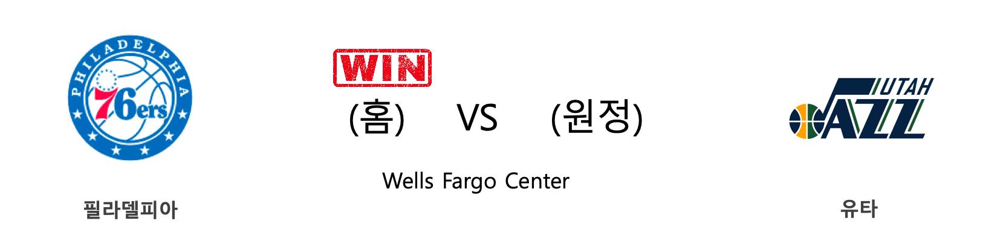
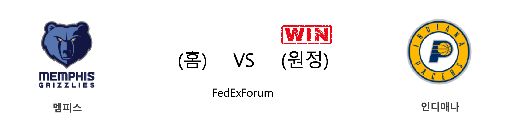
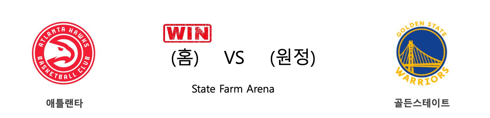
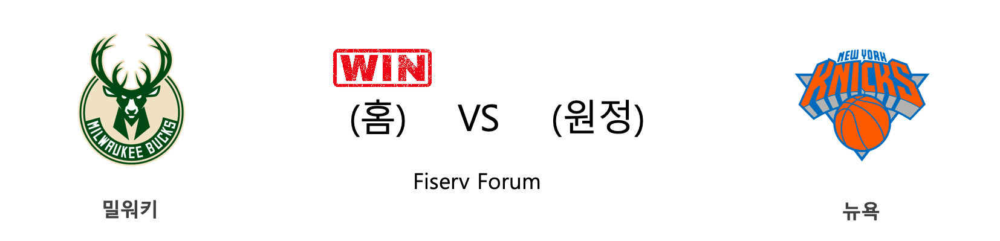
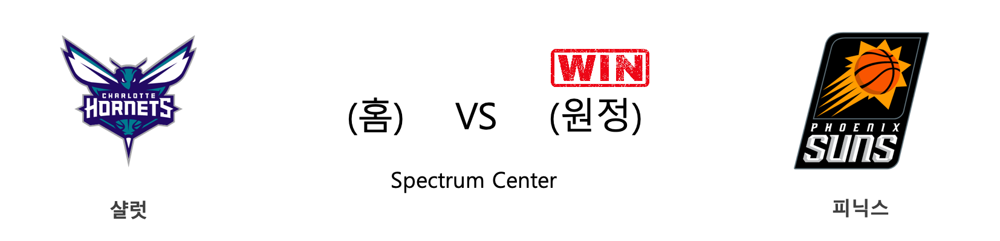
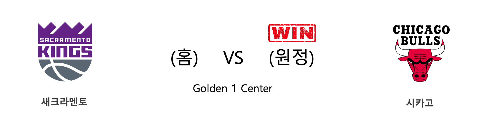

####  필라델피아(홈) VS 유타(원정) 

<table class="tg">
  <tr>
    <th class="tg-rr9t">PHI</th>
    <th class="tg-rr9t">팀</th>
    <th class="tg-rr9t">UTA</th>
  </tr>
  <tr>
    <td class="tg-dcpn">1승 1패</td>
    <td class="tg-rr9t">시즌 상대전적</td>
    <td class="tg-dcpn">1승 1패</td>
  </tr>
  <tr>
    <td class="tg-dcpn">103</td>
    <td class="tg-rr9t">점수</td>
    <td class="tg-dcpn">94</td>
  </tr>
  <tr>
    <td class="tg-dcpn">24/65(37%)</td>
    <td class="tg-rr9t">2점(%)</td>
    <td class="tg-dcpn">33/59(56%)</td>
  </tr>
  <tr>
    <td class="tg-dcpn">13/26(50%)</td>
    <td class="tg-rr9t">3점(%)</td>
    <td class="tg-dcpn">5/22(23%)</td>
  </tr>
  <tr>
    <td class="tg-dcpn">16/23(70%)</td>
    <td class="tg-rr9t">자유투(%)</td>
    <td class="tg-dcpn">13/20(65%)</td>
  </tr>
  <tr>
    <td class="tg-dcpn">47</td>
    <td class="tg-rr9t">리바운드</td>
    <td class="tg-dcpn">42</td>
  </tr>
  <tr>
    <td class="tg-dcpn">24</td>
    <td class="tg-rr9t">어시스트</td>
    <td class="tg-dcpn">23</td>
  </tr>
  <tr>
    <td class="tg-dcpn">12</td>
    <td class="tg-rr9t">스틸</td>
    <td class="tg-dcpn">6</td>
  </tr>
  <tr>
    <td class="tg-dcpn">3</td>
    <td class="tg-rr9t">블록</td>
    <td class="tg-dcpn">8</td>
  </tr>
  <tr>
    <td class="tg-dcpn">14</td>
    <td class="tg-rr9t">턴오버</td>
    <td class="tg-dcpn">19</td>
  </tr>
  <tr>
    <td class="tg-dcpn">JoelEmbiidC(16) TobiasHarrisF(26) AlHorfordF(17)</td>
    <td class="tg-rr9t">주요 득점선수</td>
    <td class="tg-dcpn">RudyGobertC(27) DonovanMitche(18)</td>
  </tr>
</table>

#### 경기 관련 주요 기사         

[[오늘의 NBA] (11/28) 앤써니 데이비스, 노란 셔츠를 입은 사나이](http://sports.news.naver.com/basketball/news/read.nhn?oid=486&aid=0000001151)

[[오늘의 NBA] (11/30) 인디애나, 동부컨퍼런스의 복병](http://sports.news.naver.com/basketball/news/read.nhn?oid=486&aid=0000001152)

[[오늘의 NBA] (11/21) 클리퍼스, 안티 볼 핸들러 세계관을 구축하다](http://sports.news.naver.com/basketball/news/read.nhn?oid=486&aid=0000001144)

[[오늘의 NBA] (11/26) 마크 가솔, 조엘 엠비드의 영원한 악몽](http://sports.news.naver.com/basketball/news/read.nhn?oid=486&aid=0000001149)

[[오늘의 NBA] (11/24) 잭 라빈, GSW 스플래쉬 브라더스를 소환하다](http://sports.news.naver.com/basketball/news/read.nhn?oid=486&aid=0000001147)

        
        

####  멤피스(홈) VS 인디애나(원정) 

<table class="tg">
  <tr>
    <th class="tg-rr9t">MEM</th>
    <th class="tg-rr9t">팀</th>
    <th class="tg-rr9t">IND</th>
  </tr>
  <tr>
    <td class="tg-dcpn">0승 2패</td>
    <td class="tg-rr9t">시즌 상대전적</td>
    <td class="tg-dcpn">2승 0패</td>
  </tr>
  <tr>
    <td class="tg-dcpn">104</td>
    <td class="tg-rr9t">점수</td>
    <td class="tg-dcpn">117</td>
  </tr>
  <tr>
    <td class="tg-dcpn">28/51(55%)</td>
    <td class="tg-rr9t">2점(%)</td>
    <td class="tg-dcpn">28/50(56%)</td>
  </tr>
  <tr>
    <td class="tg-dcpn">10/38(26%)</td>
    <td class="tg-rr9t">3점(%)</td>
    <td class="tg-dcpn">16/38(42%)</td>
  </tr>
  <tr>
    <td class="tg-dcpn">18/19(95%)</td>
    <td class="tg-rr9t">자유투(%)</td>
    <td class="tg-dcpn">13/15(87%)</td>
  </tr>
  <tr>
    <td class="tg-dcpn">38</td>
    <td class="tg-rr9t">리바운드</td>
    <td class="tg-dcpn">44</td>
  </tr>
  <tr>
    <td class="tg-dcpn">23</td>
    <td class="tg-rr9t">어시스트</td>
    <td class="tg-dcpn">31</td>
  </tr>
  <tr>
    <td class="tg-dcpn">5</td>
    <td class="tg-rr9t">스틸</td>
    <td class="tg-dcpn">4</td>
  </tr>
  <tr>
    <td class="tg-dcpn">6</td>
    <td class="tg-rr9t">블록</td>
    <td class="tg-dcpn">2</td>
  </tr>
  <tr>
    <td class="tg-dcpn">11</td>
    <td class="tg-rr9t">턴오버</td>
    <td class="tg-dcpn">15</td>
  </tr>
  <tr>
    <td class="tg-dcpn">SolomonHillF(22) DillonBrooksG(19) De'AnthonyMel(16) JarenJacksonJ(31)</td>
    <td class="tg-rr9t">주요 득점선수</td>
    <td class="tg-dcpn">JeremyLambG(15) DomantasSabon(18) JustinHoliday(15) MylesTurnerC(17) MalcolmBrogdo(19)</td>
  </tr>
</table>

#### 경기 관련 주요 기사         

[[오늘의 NBA] (11/18) 새크라멘토, 리그 선두 보스턴을 제압하다](http://sports.news.naver.com/basketball/news/read.nhn?oid=486&aid=0000001141)

[[오늘의 NBA] (11/24) 잭 라빈, GSW 스플래쉬 브라더스를 소환하다](http://sports.news.naver.com/basketball/news/read.nhn?oid=486&aid=0000001147)

[[오늘의 NBA] (11/30) 인디애나, 동부컨퍼런스의 복병](http://sports.news.naver.com/basketball/news/read.nhn?oid=486&aid=0000001152)

[[오늘의 NBA] (11/16) 멤피스, Grit&Grind 시대와의 성공적인 단절](http://sports.news.naver.com/basketball/news/read.nhn?oid=486&aid=0000001139)

[[오늘의 NBA] (11/17) 샬럿, 설계된 플레이 연출의 달인](http://sports.news.naver.com/basketball/news/read.nhn?oid=486&aid=0000001140)

        
        

####  애틀랜타(홈) VS 골든스테이트(원정) 

<table class="tg">
  <tr>
    <th class="tg-rr9t">ATL</th>
    <th class="tg-rr9t">팀</th>
    <th class="tg-rr9t">GSW</th>
  </tr>
  <tr>
    <td class="tg-dcpn">1승 0패</td>
    <td class="tg-rr9t">시즌 상대전적</td>
    <td class="tg-dcpn">0승 1패</td>
  </tr>
  <tr>
    <td class="tg-dcpn">104</td>
    <td class="tg-rr9t">점수</td>
    <td class="tg-dcpn">79</td>
  </tr>
  <tr>
    <td class="tg-dcpn">33/60(55%)</td>
    <td class="tg-rr9t">2점(%)</td>
    <td class="tg-dcpn">30/66(45%)</td>
  </tr>
  <tr>
    <td class="tg-dcpn">8/29(28%)</td>
    <td class="tg-rr9t">3점(%)</td>
    <td class="tg-dcpn">3/17(18%)</td>
  </tr>
  <tr>
    <td class="tg-dcpn">14/15(93%)</td>
    <td class="tg-rr9t">자유투(%)</td>
    <td class="tg-dcpn">10/12(83%)</td>
  </tr>
  <tr>
    <td class="tg-dcpn">38</td>
    <td class="tg-rr9t">리바운드</td>
    <td class="tg-dcpn">46</td>
  </tr>
  <tr>
    <td class="tg-dcpn">21</td>
    <td class="tg-rr9t">어시스트</td>
    <td class="tg-dcpn">17</td>
  </tr>
  <tr>
    <td class="tg-dcpn">13</td>
    <td class="tg-rr9t">스틸</td>
    <td class="tg-dcpn">11</td>
  </tr>
  <tr>
    <td class="tg-dcpn">4</td>
    <td class="tg-rr9t">블록</td>
    <td class="tg-dcpn">8</td>
  </tr>
  <tr>
    <td class="tg-dcpn">14</td>
    <td class="tg-rr9t">턴오버</td>
    <td class="tg-dcpn">23</td>
  </tr>
  <tr>
    <td class="tg-dcpn">TraeYoungG(24) De'AndreHunte(18) DamianJonesC(16)</td>
    <td class="tg-rr9t">주요 득점선수</td>
    <td class="tg-dcpn">AlecBurksG(15) EricPaschallF(24)</td>
  </tr>
</table>

#### 경기 관련 주요 기사         

[[오늘의 NBA] (11/30) 인디애나, 동부컨퍼런스의 복병](http://sports.news.naver.com/basketball/news/read.nhn?oid=486&aid=0000001152)

[[오늘의 NBA] (11/24) 잭 라빈, GSW 스플래쉬 브라더스를 소환하다](http://sports.news.naver.com/basketball/news/read.nhn?oid=486&aid=0000001147)

[[오늘의 NBA] (11/26) 마크 가솔, 조엘 엠비드의 영원한 악몽](http://sports.news.naver.com/basketball/news/read.nhn?oid=486&aid=0000001149)

[[오늘의 NBA] (11/28) 앤써니 데이비스, 노란 셔츠를 입은 사나이](http://sports.news.naver.com/basketball/news/read.nhn?oid=486&aid=0000001151)

[[오늘의 NBA] (12/2) 토론토, 두 마리 토끼를 노린다!](http://sports.news.naver.com/basketball/news/read.nhn?oid=486&aid=0000001154)

        
        

####  밀워키(홈) VS 뉴욕(원정) 

<table class="tg">
  <tr>
    <th class="tg-rr9t">MIL</th>
    <th class="tg-rr9t">팀</th>
    <th class="tg-rr9t">NYK</th>
  </tr>
  <tr>
    <td class="tg-dcpn">1승 0패</td>
    <td class="tg-rr9t">시즌 상대전적</td>
    <td class="tg-dcpn">0승 1패</td>
  </tr>
  <tr>
    <td class="tg-dcpn">132</td>
    <td class="tg-rr9t">점수</td>
    <td class="tg-dcpn">88</td>
  </tr>
  <tr>
    <td class="tg-dcpn">32/51(63%)</td>
    <td class="tg-rr9t">2점(%)</td>
    <td class="tg-dcpn">18/52(35%)</td>
  </tr>
  <tr>
    <td class="tg-dcpn">16/35(46%)</td>
    <td class="tg-rr9t">3점(%)</td>
    <td class="tg-dcpn">10/39(26%)</td>
  </tr>
  <tr>
    <td class="tg-dcpn">20/32(62%)</td>
    <td class="tg-rr9t">자유투(%)</td>
    <td class="tg-dcpn">22/33(67%)</td>
  </tr>
  <tr>
    <td class="tg-dcpn">58</td>
    <td class="tg-rr9t">리바운드</td>
    <td class="tg-dcpn">41</td>
  </tr>
  <tr>
    <td class="tg-dcpn">30</td>
    <td class="tg-rr9t">어시스트</td>
    <td class="tg-dcpn">13</td>
  </tr>
  <tr>
    <td class="tg-dcpn">6</td>
    <td class="tg-rr9t">스틸</td>
    <td class="tg-dcpn">4</td>
  </tr>
  <tr>
    <td class="tg-dcpn">4</td>
    <td class="tg-rr9t">블록</td>
    <td class="tg-dcpn">7</td>
  </tr>
  <tr>
    <td class="tg-dcpn">13</td>
    <td class="tg-rr9t">턴오버</td>
    <td class="tg-dcpn">9</td>
  </tr>
  <tr>
    <td class="tg-dcpn">KhrisMiddleto(16) GiannisAnteto(29) D.J.Wilson(19)</td>
    <td class="tg-rr9t">주요 득점선수</td>
    <td class="tg-dcpn">DamyeanDotson(15) JuliusRandleF(19)</td>
  </tr>
</table>

#### 경기 관련 주요 기사         

[[오늘의 NBA] (12/2) 토론토, 두 마리 토끼를 노린다!](http://sports.news.naver.com/basketball/news/read.nhn?oid=486&aid=0000001154)

[[오늘의 NBA] (11/28) 앤써니 데이비스, 노란 셔츠를 입은 사나이](http://sports.news.naver.com/basketball/news/read.nhn?oid=486&aid=0000001151)

[[오늘의 NBA] (11/24) 잭 라빈, GSW 스플래쉬 브라더스를 소환하다](http://sports.news.naver.com/basketball/news/read.nhn?oid=486&aid=0000001147)

[[오늘의 NBA] (11/26) 마크 가솔, 조엘 엠비드의 영원한 악몽](http://sports.news.naver.com/basketball/news/read.nhn?oid=486&aid=0000001149)

[[오늘의 NBA] (11/25) 댈러스, 공격이 승리를 부른다!](http://sports.news.naver.com/basketball/news/read.nhn?oid=486&aid=0000001148)

        
        

####  샬럿(홈) VS 피닉스(원정) 

<table class="tg">
  <tr>
    <th class="tg-rr9t">CHA</th>
    <th class="tg-rr9t">팀</th>
    <th class="tg-rr9t">PHX</th>
  </tr>
  <tr>
    <td class="tg-dcpn">0승 1패</td>
    <td class="tg-rr9t">시즌 상대전적</td>
    <td class="tg-dcpn">1승 0패</td>
  </tr>
  <tr>
    <td class="tg-dcpn">104</td>
    <td class="tg-rr9t">점수</td>
    <td class="tg-dcpn">109</td>
  </tr>
  <tr>
    <td class="tg-dcpn">31/59(53%)</td>
    <td class="tg-rr9t">2점(%)</td>
    <td class="tg-dcpn">30/46(65%)</td>
  </tr>
  <tr>
    <td class="tg-dcpn">7/26(27%)</td>
    <td class="tg-rr9t">3점(%)</td>
    <td class="tg-dcpn">9/42(21%)</td>
  </tr>
  <tr>
    <td class="tg-dcpn">21/26(81%)</td>
    <td class="tg-rr9t">자유투(%)</td>
    <td class="tg-dcpn">22/30(73%)</td>
  </tr>
  <tr>
    <td class="tg-dcpn">53</td>
    <td class="tg-rr9t">리바운드</td>
    <td class="tg-dcpn">37</td>
  </tr>
  <tr>
    <td class="tg-dcpn">27</td>
    <td class="tg-rr9t">어시스트</td>
    <td class="tg-dcpn">30</td>
  </tr>
  <tr>
    <td class="tg-dcpn">4</td>
    <td class="tg-rr9t">스틸</td>
    <td class="tg-dcpn">12</td>
  </tr>
  <tr>
    <td class="tg-dcpn">7</td>
    <td class="tg-rr9t">블록</td>
    <td class="tg-dcpn">7</td>
  </tr>
  <tr>
    <td class="tg-dcpn">19</td>
    <td class="tg-rr9t">턴오버</td>
    <td class="tg-dcpn">7</td>
  </tr>
  <tr>
    <td class="tg-dcpn">Devonte'Graha(15) MarvinWilliam(22)</td>
    <td class="tg-rr9t">주요 득점선수</td>
    <td class="tg-dcpn">DevinBookerG(23) DarioSaricF(16) KellyOubreJr.(23)</td>
  </tr>
</table>

#### 경기 관련 주요 기사         

[[오늘의 NBA] (11/21) 클리퍼스, 안티 볼 핸들러 세계관을 구축하다](http://sports.news.naver.com/basketball/news/read.nhn?oid=486&aid=0000001144)

[[오늘의 NBA] (11/24) 잭 라빈, GSW 스플래쉬 브라더스를 소환하다](http://sports.news.naver.com/basketball/news/read.nhn?oid=486&aid=0000001147)

[[오늘의 NBA] (11/28) 앤써니 데이비스, 노란 셔츠를 입은 사나이](http://sports.news.naver.com/basketball/news/read.nhn?oid=486&aid=0000001151)

[[오늘의 NBA] (11/23) 카와이 레너드, 승부를 결정짓는 사나이](http://sports.news.naver.com/basketball/news/read.nhn?oid=486&aid=0000001146)

[[오늘의 NBA] (11/30) 인디애나, 동부컨퍼런스의 복병](http://sports.news.naver.com/basketball/news/read.nhn?oid=486&aid=0000001152)

        
        

####  새크라멘토(홈) VS 시카고(원정) 

<table class="tg">
  <tr>
    <th class="tg-rr9t">SAC</th>
    <th class="tg-rr9t">팀</th>
    <th class="tg-rr9t">CHI</th>
  </tr>
  <tr>
    <td class="tg-dcpn">0승 1패</td>
    <td class="tg-rr9t">시즌 상대전적</td>
    <td class="tg-dcpn">1승 0패</td>
  </tr>
  <tr>
    <td class="tg-dcpn">106</td>
    <td class="tg-rr9t">점수</td>
    <td class="tg-dcpn">113</td>
  </tr>
  <tr>
    <td class="tg-dcpn">31/50(62%)</td>
    <td class="tg-rr9t">2점(%)</td>
    <td class="tg-dcpn">20/38(53%)</td>
  </tr>
  <tr>
    <td class="tg-dcpn">9/33(27%)</td>
    <td class="tg-rr9t">3점(%)</td>
    <td class="tg-dcpn">16/37(43%)</td>
  </tr>
  <tr>
    <td class="tg-dcpn">17/20(85%)</td>
    <td class="tg-rr9t">자유투(%)</td>
    <td class="tg-dcpn">25/29(86%)</td>
  </tr>
  <tr>
    <td class="tg-dcpn">41</td>
    <td class="tg-rr9t">리바운드</td>
    <td class="tg-dcpn">32</td>
  </tr>
  <tr>
    <td class="tg-dcpn">22</td>
    <td class="tg-rr9t">어시스트</td>
    <td class="tg-dcpn">20</td>
  </tr>
  <tr>
    <td class="tg-dcpn">7</td>
    <td class="tg-rr9t">스틸</td>
    <td class="tg-dcpn">9</td>
  </tr>
  <tr>
    <td class="tg-dcpn">5</td>
    <td class="tg-rr9t">블록</td>
    <td class="tg-dcpn">0</td>
  </tr>
  <tr>
    <td class="tg-dcpn">18</td>
    <td class="tg-rr9t">턴오버</td>
    <td class="tg-dcpn">18</td>
  </tr>
  <tr>
    <td class="tg-dcpn">HarrisonBarne(16) BuddyHieldG(26) NemanjaBjelic(18) RichaunHolmes(20)</td>
    <td class="tg-rr9t">주요 득점선수</td>
    <td class="tg-dcpn">ZachLaVineG(28) LauriMarkkane(20)</td>
  </tr>
</table>

#### 경기 관련 주요 기사         

[[오늘의 NBA] (11/21) 클리퍼스, 안티 볼 핸들러 세계관을 구축하다](http://sports.news.naver.com/basketball/news/read.nhn?oid=486&aid=0000001144)

[[오늘의 NBA] (11/30) 인디애나, 동부컨퍼런스의 복병](http://sports.news.naver.com/basketball/news/read.nhn?oid=486&aid=0000001152)

[[오늘의 NBA] (11/23) 카와이 레너드, 승부를 결정짓는 사나이](http://sports.news.naver.com/basketball/news/read.nhn?oid=486&aid=0000001146)

[[오늘의 NBA] (11/2) 르브론 제임스의 왕권신수설](http://sports.news.naver.com/basketball/news/read.nhn?oid=486&aid=0000001125)

        
        

#### 리그 (Eastern) 순위
    

<table class="tg">
  <tr>
    <th class="tg-d14o">순위</th>
    <th class="tg-d14o">팀명</th>
    <th class="tg-d14o">경기수</th>
    <th class="tg-d14o">승</th>
    <th class="tg-d14o">패</th>
    <th class="tg-d14o">승차</th>
    <th class="tg-d14o">승률</th>
  </tr>
  
<tr>
    <td class="tg-50j8">1</td>
    <td class="tg-50j8">MIL</td>
    <td class="tg-50j8">21</td>
    <td class="tg-50j8">18</td>
    <td class="tg-50j8">3</td>
    <td class="tg-50j8">0</td>
    <td class="tg-50j8">0.857</td>
</tr>

<tr>
    <td class="tg-50j8">2</td>
    <td class="tg-50j8">TOR</td>
    <td class="tg-50j8">19</td>
    <td class="tg-50j8">15</td>
    <td class="tg-50j8">4</td>
    <td class="tg-50j8">3</td>
    <td class="tg-50j8">0.789</td>
</tr>

<tr>
    <td class="tg-50j8">3</td>
    <td class="tg-50j8">PHI</td>
    <td class="tg-50j8">21</td>
    <td class="tg-50j8">15</td>
    <td class="tg-50j8">6</td>
    <td class="tg-50j8">3</td>
    <td class="tg-50j8">0.714</td>
</tr>

<tr>
    <td class="tg-50j8">4</td>
    <td class="tg-50j8">BOS</td>
    <td class="tg-50j8">19</td>
    <td class="tg-50j8">14</td>
    <td class="tg-50j8">5</td>
    <td class="tg-50j8">4</td>
    <td class="tg-50j8">0.737</td>
</tr>

<tr>
    <td class="tg-50j8">4</td>
    <td class="tg-50j8">MIA</td>
    <td class="tg-50j8">19</td>
    <td class="tg-50j8">14</td>
    <td class="tg-50j8">5</td>
    <td class="tg-50j8">4</td>
    <td class="tg-50j8">0.737</td>
</tr>

<tr>
    <td class="tg-50j8">6</td>
    <td class="tg-50j8">IND</td>
    <td class="tg-50j8">20</td>
    <td class="tg-50j8">13</td>
    <td class="tg-50j8">7</td>
    <td class="tg-50j8">5</td>
    <td class="tg-50j8">0.65</td>
</tr>

<tr>
    <td class="tg-50j8">7</td>
    <td class="tg-50j8">BKN</td>
    <td class="tg-50j8">20</td>
    <td class="tg-50j8">10</td>
    <td class="tg-50j8">10</td>
    <td class="tg-50j8">8</td>
    <td class="tg-50j8">0.5</td>
</tr>

<tr>
    <td class="tg-50j8">8</td>
    <td class="tg-50j8">ORL</td>
    <td class="tg-50j8">19</td>
    <td class="tg-50j8">8</td>
    <td class="tg-50j8">11</td>
    <td class="tg-50j8">10</td>
    <td class="tg-50j8">0.421</td>
</tr>

<tr>
    <td class="tg-50j8">9</td>
    <td class="tg-50j8">CHA</td>
    <td class="tg-50j8">22</td>
    <td class="tg-50j8">8</td>
    <td class="tg-50j8">14</td>
    <td class="tg-50j8">10</td>
    <td class="tg-50j8">0.364</td>
</tr>

<tr>
    <td class="tg-50j8">10</td>
    <td class="tg-50j8">DET</td>
    <td class="tg-50j8">20</td>
    <td class="tg-50j8">7</td>
    <td class="tg-50j8">13</td>
    <td class="tg-50j8">11</td>
    <td class="tg-50j8">0.35</td>
</tr>

<tr>
    <td class="tg-50j8">11</td>
    <td class="tg-50j8">CHI</td>
    <td class="tg-50j8">21</td>
    <td class="tg-50j8">7</td>
    <td class="tg-50j8">14</td>
    <td class="tg-50j8">11</td>
    <td class="tg-50j8">0.333</td>
</tr>

<tr>
    <td class="tg-50j8">12</td>
    <td class="tg-50j8">WAS</td>
    <td class="tg-50j8">18</td>
    <td class="tg-50j8">6</td>
    <td class="tg-50j8">12</td>
    <td class="tg-50j8">12</td>
    <td class="tg-50j8">0.333</td>
</tr>

<tr>
    <td class="tg-50j8">13</td>
    <td class="tg-50j8">CLE</td>
    <td class="tg-50j8">19</td>
    <td class="tg-50j8">5</td>
    <td class="tg-50j8">14</td>
    <td class="tg-50j8">13</td>
    <td class="tg-50j8">0.263</td>
</tr>

<tr>
    <td class="tg-50j8">14</td>
    <td class="tg-50j8">ATL</td>
    <td class="tg-50j8">21</td>
    <td class="tg-50j8">5</td>
    <td class="tg-50j8">16</td>
    <td class="tg-50j8">13</td>
    <td class="tg-50j8">0.238</td>
</tr>

<tr>
    <td class="tg-50j8">15</td>
    <td class="tg-50j8">NYK</td>
    <td class="tg-50j8">21</td>
    <td class="tg-50j8">4</td>
    <td class="tg-50j8">17</td>
    <td class="tg-50j8">14</td>
    <td class="tg-50j8">0.19</td>
</tr>
</table> 
#### 리그 (Western) 순위
    

<table class="tg">
  <tr>
    <th class="tg-d14o">순위</th>
    <th class="tg-d14o">팀명</th>
    <th class="tg-d14o">경기수</th>
    <th class="tg-d14o">승</th>
    <th class="tg-d14o">패</th>
    <th class="tg-d14o">승차</th>
    <th class="tg-d14o">승률</th>
  </tr>
  
<tr>
    <td class="tg-50j8">1</td>
    <td class="tg-50j8">LAL</td>
    <td class="tg-50j8">20</td>
    <td class="tg-50j8">17</td>
    <td class="tg-50j8">3</td>
    <td class="tg-50j8">1</td>
    <td class="tg-50j8">0.85</td>
</tr>

<tr>
    <td class="tg-50j8">2</td>
    <td class="tg-50j8">LAC</td>
    <td class="tg-50j8">21</td>
    <td class="tg-50j8">15</td>
    <td class="tg-50j8">6</td>
    <td class="tg-50j8">3</td>
    <td class="tg-50j8">0.714</td>
</tr>

<tr>
    <td class="tg-50j8">3</td>
    <td class="tg-50j8">DEN</td>
    <td class="tg-50j8">17</td>
    <td class="tg-50j8">13</td>
    <td class="tg-50j8">4</td>
    <td class="tg-50j8">5</td>
    <td class="tg-50j8">0.765</td>
</tr>

<tr>
    <td class="tg-50j8">4</td>
    <td class="tg-50j8">HOU</td>
    <td class="tg-50j8">19</td>
    <td class="tg-50j8">13</td>
    <td class="tg-50j8">6</td>
    <td class="tg-50j8">5</td>
    <td class="tg-50j8">0.684</td>
</tr>

<tr>
    <td class="tg-50j8">4</td>
    <td class="tg-50j8">DAL</td>
    <td class="tg-50j8">19</td>
    <td class="tg-50j8">13</td>
    <td class="tg-50j8">6</td>
    <td class="tg-50j8">5</td>
    <td class="tg-50j8">0.684</td>
</tr>

<tr>
    <td class="tg-50j8">6</td>
    <td class="tg-50j8">UTA</td>
    <td class="tg-50j8">21</td>
    <td class="tg-50j8">12</td>
    <td class="tg-50j8">9</td>
    <td class="tg-50j8">6</td>
    <td class="tg-50j8">0.571</td>
</tr>

<tr>
    <td class="tg-50j8">7</td>
    <td class="tg-50j8">MIN</td>
    <td class="tg-50j8">19</td>
    <td class="tg-50j8">10</td>
    <td class="tg-50j8">9</td>
    <td class="tg-50j8">8</td>
    <td class="tg-50j8">0.526</td>
</tr>

<tr>
    <td class="tg-50j8">8</td>
    <td class="tg-50j8">PHX</td>
    <td class="tg-50j8">19</td>
    <td class="tg-50j8">9</td>
    <td class="tg-50j8">10</td>
    <td class="tg-50j8">9</td>
    <td class="tg-50j8">0.474</td>
</tr>

<tr>
    <td class="tg-50j8">9</td>
    <td class="tg-50j8">OKC</td>
    <td class="tg-50j8">19</td>
    <td class="tg-50j8">8</td>
    <td class="tg-50j8">11</td>
    <td class="tg-50j8">10</td>
    <td class="tg-50j8">0.421</td>
</tr>

<tr>
    <td class="tg-50j8">9</td>
    <td class="tg-50j8">SAC</td>
    <td class="tg-50j8">19</td>
    <td class="tg-50j8">8</td>
    <td class="tg-50j8">11</td>
    <td class="tg-50j8">10</td>
    <td class="tg-50j8">0.421</td>
</tr>

<tr>
    <td class="tg-50j8">11</td>
    <td class="tg-50j8">POR</td>
    <td class="tg-50j8">20</td>
    <td class="tg-50j8">8</td>
    <td class="tg-50j8">12</td>
    <td class="tg-50j8">10</td>
    <td class="tg-50j8">0.4</td>
</tr>

<tr>
    <td class="tg-50j8">12</td>
    <td class="tg-50j8">SAS</td>
    <td class="tg-50j8">21</td>
    <td class="tg-50j8">7</td>
    <td class="tg-50j8">14</td>
    <td class="tg-50j8">11</td>
    <td class="tg-50j8">0.333</td>
</tr>

<tr>
    <td class="tg-50j8">13</td>
    <td class="tg-50j8">MEM</td>
    <td class="tg-50j8">20</td>
    <td class="tg-50j8">6</td>
    <td class="tg-50j8">14</td>
    <td class="tg-50j8">12</td>
    <td class="tg-50j8">0.3</td>
</tr>

<tr>
    <td class="tg-50j8">13</td>
    <td class="tg-50j8">NOP</td>
    <td class="tg-50j8">20</td>
    <td class="tg-50j8">6</td>
    <td class="tg-50j8">14</td>
    <td class="tg-50j8">12</td>
    <td class="tg-50j8">0.3</td>
</tr>

<tr>
    <td class="tg-50j8">15</td>
    <td class="tg-50j8">GSW</td>
    <td class="tg-50j8">22</td>
    <td class="tg-50j8">4</td>
    <td class="tg-50j8">18</td>
    <td class="tg-50j8">14</td>
    <td class="tg-50j8">0.182</td>
</tr>
</table> 

        
        
#nba #미국농구 #엔비에이 #농구분석 #토토 #스포츠토토 #경기예측 #농구결과 #20191203 #필라델피아 #유타 #멤피스 #인디애나 #애틀랜타 #골든스테이트 #밀워키 #뉴욕 #샬럿 #피닉스 #새크라멘토 #시카고 #필라델피아유타 #멤피스인디애나 #애틀랜타골든스테이트 #밀워키뉴욕 #샬럿피닉스 #새크라멘토시카고 