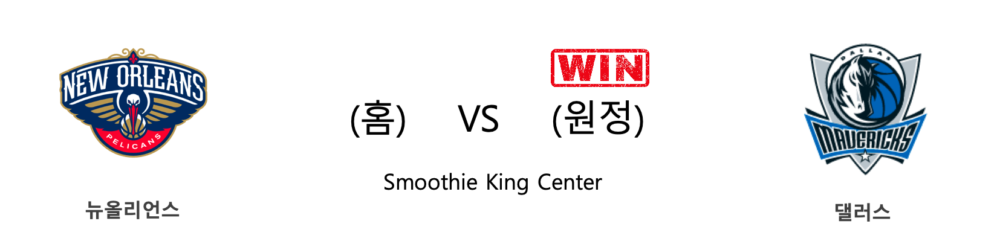
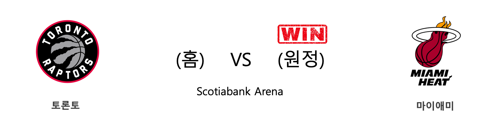
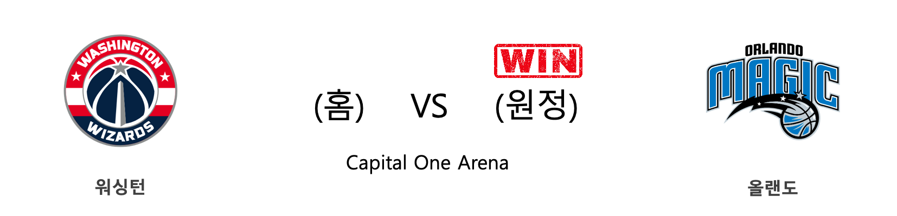
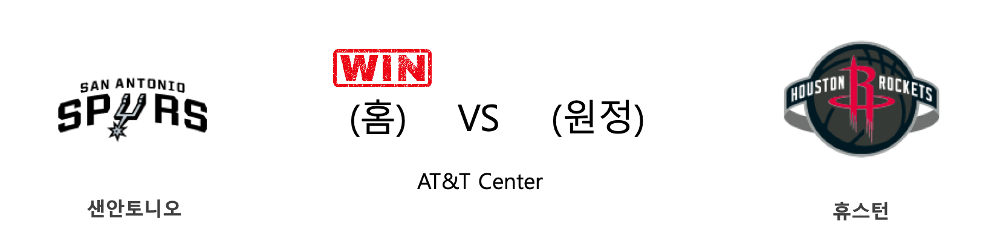

####  덴버(홈) VS LA레이커스(원정) 

<table class="tg">
  <tr>
    <th class="tg-rr9t">DEN</th>
    <th class="tg-rr9t">팀</th>
    <th class="tg-rr9t">LAL</th>
  </tr>
  <tr>
    <td class="tg-dcpn">0승 1패</td>
    <td class="tg-rr9t">시즌 상대전적</td>
    <td class="tg-dcpn">1승 0패</td>
  </tr>
  <tr>
    <td class="tg-dcpn">96</td>
    <td class="tg-rr9t">점수</td>
    <td class="tg-dcpn">105</td>
  </tr>
  <tr>
    <td class="tg-dcpn">31/62(50%)</td>
    <td class="tg-rr9t">2점(%)</td>
    <td class="tg-dcpn">32/60(53%)</td>
  </tr>
  <tr>
    <td class="tg-dcpn">6/29(21%)</td>
    <td class="tg-rr9t">3점(%)</td>
    <td class="tg-dcpn">7/24(29%)</td>
  </tr>
  <tr>
    <td class="tg-dcpn">16/17(94%)</td>
    <td class="tg-rr9t">자유투(%)</td>
    <td class="tg-dcpn">20/30(67%)</td>
  </tr>
  <tr>
    <td class="tg-dcpn">35</td>
    <td class="tg-rr9t">리바운드</td>
    <td class="tg-dcpn">56</td>
  </tr>
  <tr>
    <td class="tg-dcpn">26</td>
    <td class="tg-rr9t">어시스트</td>
    <td class="tg-dcpn">24</td>
  </tr>
  <tr>
    <td class="tg-dcpn">9</td>
    <td class="tg-rr9t">스틸</td>
    <td class="tg-dcpn">8</td>
  </tr>
  <tr>
    <td class="tg-dcpn">4</td>
    <td class="tg-rr9t">블록</td>
    <td class="tg-dcpn">5</td>
  </tr>
  <tr>
    <td class="tg-dcpn">11</td>
    <td class="tg-rr9t">턴오버</td>
    <td class="tg-dcpn">16</td>
  </tr>
  <tr>
    <td class="tg-dcpn">PaulMillsapF(21) JamalMurrayG(22)</td>
    <td class="tg-rr9t">주요 득점선수</td>
    <td class="tg-dcpn">AnthonyDavisF(25) LeBronJamesF(25)</td>
  </tr>
</table>

#### 경기 관련 주요 기사         

[[오늘의 NBA] (11/27) 덴버, 서부컨퍼런스 우승 후보로 도약하다](http://sports.news.naver.com/basketball/news/read.nhn?oid=486&aid=0000001150)

[[오늘의 NBA] (11/30) 인디애나, 동부컨퍼런스의 복병](http://sports.news.naver.com/basketball/news/read.nhn?oid=486&aid=0000001152)

[[오늘의 NBA] (11/23) 카와이 레너드, 승부를 결정짓는 사나이](http://sports.news.naver.com/basketball/news/read.nhn?oid=486&aid=0000001146)

[[오늘의 NBA] (12/2) 토론토, 두 마리 토끼를 노린다!](http://sports.news.naver.com/basketball/news/read.nhn?oid=486&aid=0000001154)

[[오늘의 NBA] (11/28) 앤써니 데이비스, 노란 셔츠를 입은 사나이](http://sports.news.naver.com/basketball/news/read.nhn?oid=486&aid=0000001151)

        
        

####  클리블랜드(홈) VS 디트로이트(원정) 

<table class="tg">
  <tr>
    <th class="tg-rr9t">CLE</th>
    <th class="tg-rr9t">팀</th>
    <th class="tg-rr9t">DET</th>
  </tr>
  <tr>
    <td class="tg-dcpn">0승 1패</td>
    <td class="tg-rr9t">시즌 상대전적</td>
    <td class="tg-dcpn">1승 0패</td>
  </tr>
  <tr>
    <td class="tg-dcpn">94</td>
    <td class="tg-rr9t">점수</td>
    <td class="tg-dcpn">127</td>
  </tr>
  <tr>
    <td class="tg-dcpn">30/62(48%)</td>
    <td class="tg-rr9t">2점(%)</td>
    <td class="tg-dcpn">33/59(56%)</td>
  </tr>
  <tr>
    <td class="tg-dcpn">8/27(30%)</td>
    <td class="tg-rr9t">3점(%)</td>
    <td class="tg-dcpn">18/35(51%)</td>
  </tr>
  <tr>
    <td class="tg-dcpn">10/14(71%)</td>
    <td class="tg-rr9t">자유투(%)</td>
    <td class="tg-dcpn">7/11(64%)</td>
  </tr>
  <tr>
    <td class="tg-dcpn">39</td>
    <td class="tg-rr9t">리바운드</td>
    <td class="tg-dcpn">46</td>
  </tr>
  <tr>
    <td class="tg-dcpn">16</td>
    <td class="tg-rr9t">어시스트</td>
    <td class="tg-dcpn">33</td>
  </tr>
  <tr>
    <td class="tg-dcpn">6</td>
    <td class="tg-rr9t">스틸</td>
    <td class="tg-dcpn">11</td>
  </tr>
  <tr>
    <td class="tg-dcpn">6</td>
    <td class="tg-rr9t">블록</td>
    <td class="tg-dcpn">6</td>
  </tr>
  <tr>
    <td class="tg-dcpn">13</td>
    <td class="tg-rr9t">턴오버</td>
    <td class="tg-dcpn">11</td>
  </tr>
  <tr>
    <td class="tg-dcpn">CollinSextonG(22)</td>
    <td class="tg-rr9t">주요 득점선수</td>
    <td class="tg-dcpn">SviMykhailiuk(15) BlakeGriffinF(24) AndreDrummond(17)</td>
  </tr>
</table>

#### 경기 관련 주요 기사         

[[오늘의 NBA] (11/26) 마크 가솔, 조엘 엠비드의 영원한 악몽](http://sports.news.naver.com/basketball/news/read.nhn?oid=486&aid=0000001149)

[[오늘의 NBA] (11/18) 새크라멘토, 리그 선두 보스턴을 제압하다](http://sports.news.naver.com/basketball/news/read.nhn?oid=486&aid=0000001141)

['드러먼드 더블-더블' DET, CLE에 33점차 완승](http://www.rookie.co.kr/news/articleView.html?idxno=35678)

[[오늘의 NBA] (11/24) 잭 라빈, GSW 스플래쉬 브라더스를 소환하다](http://sports.news.naver.com/basketball/news/read.nhn?oid=486&aid=0000001147)

[[오늘의 NBA] (11/28) 앤써니 데이비스, 노란 셔츠를 입은 사나이](http://sports.news.naver.com/basketball/news/read.nhn?oid=486&aid=0000001151)

        
        

####  뉴올리언스(홈) VS 댈러스(원정) 

<table class="tg">
  <tr>
    <th class="tg-rr9t">NOP</th>
    <th class="tg-rr9t">팀</th>
    <th class="tg-rr9t">DAL</th>
  </tr>
  <tr>
    <td class="tg-dcpn">0승 2패</td>
    <td class="tg-rr9t">시즌 상대전적</td>
    <td class="tg-dcpn">2승 0패</td>
  </tr>
  <tr>
    <td class="tg-dcpn">97</td>
    <td class="tg-rr9t">점수</td>
    <td class="tg-dcpn">118</td>
  </tr>
  <tr>
    <td class="tg-dcpn">27/53(51%)</td>
    <td class="tg-rr9t">2점(%)</td>
    <td class="tg-dcpn">19/43(44%)</td>
  </tr>
  <tr>
    <td class="tg-dcpn">11/41(27%)</td>
    <td class="tg-rr9t">3점(%)</td>
    <td class="tg-dcpn">19/45(42%)</td>
  </tr>
  <tr>
    <td class="tg-dcpn">10/15(67%)</td>
    <td class="tg-rr9t">자유투(%)</td>
    <td class="tg-dcpn">23/27(85%)</td>
  </tr>
  <tr>
    <td class="tg-dcpn">47</td>
    <td class="tg-rr9t">리바운드</td>
    <td class="tg-dcpn">51</td>
  </tr>
  <tr>
    <td class="tg-dcpn">20</td>
    <td class="tg-rr9t">어시스트</td>
    <td class="tg-dcpn">22</td>
  </tr>
  <tr>
    <td class="tg-dcpn">4</td>
    <td class="tg-rr9t">스틸</td>
    <td class="tg-dcpn">5</td>
  </tr>
  <tr>
    <td class="tg-dcpn">4</td>
    <td class="tg-rr9t">블록</td>
    <td class="tg-dcpn">8</td>
  </tr>
  <tr>
    <td class="tg-dcpn">11</td>
    <td class="tg-rr9t">턴오버</td>
    <td class="tg-dcpn">10</td>
  </tr>
  <tr>
    <td class="tg-dcpn">BrandonIngram(24) JrueHolidayF(18)</td>
    <td class="tg-rr9t">주요 득점선수</td>
    <td class="tg-dcpn">SethCurry(19) LukaDoncicG(33)</td>
  </tr>
</table>

#### 경기 관련 주요 기사         

[[오늘의 NBA] (12/3) 켈리 우브레 주니어, 피닉스의 터프가이](http://sports.news.naver.com/basketball/news/read.nhn?oid=486&aid=0000001155)

[[오늘의 NBA] (11/23) 카와이 레너드, 승부를 결정짓는 사나이](http://sports.news.naver.com/basketball/news/read.nhn?oid=486&aid=0000001146)

[[오늘의 NBA] (12/2) 토론토, 두 마리 토끼를 노린다!](http://sports.news.naver.com/basketball/news/read.nhn?oid=486&aid=0000001154)

[[오늘의 NBA] (11/24) 잭 라빈, GSW 스플래쉬 브라더스를 소환하다](http://sports.news.naver.com/basketball/news/read.nhn?oid=486&aid=0000001147)

[[오늘의 NBA] (11/15) NOP 즈루 홀리데이, 뒤처리는 내가 맡는다!](http://sports.news.naver.com/basketball/news/read.nhn?oid=486&aid=0000001138)

        
        

####  LA클리퍼스(홈) VS 포틀랜드(원정) 

<table class="tg">
  <tr>
    <th class="tg-rr9t">LAC</th>
    <th class="tg-rr9t">팀</th>
    <th class="tg-rr9t">POR</th>
  </tr>
  <tr>
    <td class="tg-dcpn">2승 0패</td>
    <td class="tg-rr9t">시즌 상대전적</td>
    <td class="tg-dcpn">0승 2패</td>
  </tr>
  <tr>
    <td class="tg-dcpn">117</td>
    <td class="tg-rr9t">점수</td>
    <td class="tg-dcpn">97</td>
  </tr>
  <tr>
    <td class="tg-dcpn">26/60(43%)</td>
    <td class="tg-rr9t">2점(%)</td>
    <td class="tg-dcpn">32/64(50%)</td>
  </tr>
  <tr>
    <td class="tg-dcpn">17/34(50%)</td>
    <td class="tg-rr9t">3점(%)</td>
    <td class="tg-dcpn">7/27(26%)</td>
  </tr>
  <tr>
    <td class="tg-dcpn">14/25(56%)</td>
    <td class="tg-rr9t">자유투(%)</td>
    <td class="tg-dcpn">12/15(80%)</td>
  </tr>
  <tr>
    <td class="tg-dcpn">49</td>
    <td class="tg-rr9t">리바운드</td>
    <td class="tg-dcpn">49</td>
  </tr>
  <tr>
    <td class="tg-dcpn">25</td>
    <td class="tg-rr9t">어시스트</td>
    <td class="tg-dcpn">20</td>
  </tr>
  <tr>
    <td class="tg-dcpn">7</td>
    <td class="tg-rr9t">스틸</td>
    <td class="tg-dcpn">5</td>
  </tr>
  <tr>
    <td class="tg-dcpn">3</td>
    <td class="tg-rr9t">블록</td>
    <td class="tg-dcpn">6</td>
  </tr>
  <tr>
    <td class="tg-dcpn">10</td>
    <td class="tg-rr9t">턴오버</td>
    <td class="tg-dcpn">13</td>
  </tr>
  <tr>
    <td class="tg-dcpn">PatrickPatter(19) MontrezlHarre(26) PaulGeorgeG(25)</td>
    <td class="tg-rr9t">주요 득점선수</td>
    <td class="tg-dcpn">CJMcCollumG(20) HassanWhitesi(18) DamianLillard(16)</td>
  </tr>
</table>

#### 경기 관련 주요 기사         

[카멜로 앤서니가 돌아온다…POR과 비보장계약 체결](http://www.spotvnews.co.kr/?mod=news&act=articleView&idxno=329148)

[[오늘의 NBA] (11/28) 앤써니 데이비스, 노란 셔츠를 입은 사나이](http://sports.news.naver.com/basketball/news/read.nhn?oid=486&aid=0000001151)

[[오늘의 NBA] (11/26) 마크 가솔, 조엘 엠비드의 영원한 악몽](http://sports.news.naver.com/basketball/news/read.nhn?oid=486&aid=0000001149)

[[오늘의 NBA] (12/2) 토론토, 두 마리 토끼를 노린다!](http://sports.news.naver.com/basketball/news/read.nhn?oid=486&aid=0000001154)

[[오늘의 NBA] (11/30) 인디애나, 동부컨퍼런스의 복병](http://sports.news.naver.com/basketball/news/read.nhn?oid=486&aid=0000001152)

        
        

####  토론토(홈) VS 마이애미(원정) 

<table class="tg">
  <tr>
    <th class="tg-rr9t">TOR</th>
    <th class="tg-rr9t">팀</th>
    <th class="tg-rr9t">MIA</th>
  </tr>
  <tr>
    <td class="tg-dcpn">0승 1패</td>
    <td class="tg-rr9t">시즌 상대전적</td>
    <td class="tg-dcpn">1승 0패</td>
  </tr>
  <tr>
    <td class="tg-dcpn">110</td>
    <td class="tg-rr9t">점수</td>
    <td class="tg-dcpn">121</td>
  </tr>
  <tr>
    <td class="tg-dcpn">24/48(50%)</td>
    <td class="tg-rr9t">2점(%)</td>
    <td class="tg-dcpn">30/61(49%)</td>
  </tr>
  <tr>
    <td class="tg-dcpn">11/43(26%)</td>
    <td class="tg-rr9t">3점(%)</td>
    <td class="tg-dcpn">15/38(39%)</td>
  </tr>
  <tr>
    <td class="tg-dcpn">29/36(81%)</td>
    <td class="tg-rr9t">자유투(%)</td>
    <td class="tg-dcpn">16/21(76%)</td>
  </tr>
  <tr>
    <td class="tg-dcpn">48</td>
    <td class="tg-rr9t">리바운드</td>
    <td class="tg-dcpn">55</td>
  </tr>
  <tr>
    <td class="tg-dcpn">25</td>
    <td class="tg-rr9t">어시스트</td>
    <td class="tg-dcpn">29</td>
  </tr>
  <tr>
    <td class="tg-dcpn">5</td>
    <td class="tg-rr9t">스틸</td>
    <td class="tg-dcpn">4</td>
  </tr>
  <tr>
    <td class="tg-dcpn">4</td>
    <td class="tg-rr9t">블록</td>
    <td class="tg-dcpn">7</td>
  </tr>
  <tr>
    <td class="tg-dcpn">11</td>
    <td class="tg-rr9t">턴오버</td>
    <td class="tg-dcpn">11</td>
  </tr>
  <tr>
    <td class="tg-dcpn">PascalSiakamF(15) NormanPowell(23) FredVanVleetG(19)</td>
    <td class="tg-rr9t">주요 득점선수</td>
    <td class="tg-dcpn">JimmyButlerF(22) BamAdebayoF(18) JustiseWinslo(17) DuncanRobinso(22) KellyOlynyk(16)</td>
  </tr>
</table>

#### 경기 관련 주요 기사         

[[오늘의 NBA] (11/26) 마크 가솔, 조엘 엠비드의 영원한 악몽](http://sports.news.naver.com/basketball/news/read.nhn?oid=486&aid=0000001149)

[[오늘의 NBA] (11/30) 인디애나, 동부컨퍼런스의 복병](http://sports.news.naver.com/basketball/news/read.nhn?oid=486&aid=0000001152)

[[오늘의 NBA] (11/24) 잭 라빈, GSW 스플래쉬 브라더스를 소환하다](http://sports.news.naver.com/basketball/news/read.nhn?oid=486&aid=0000001147)

[[오늘의 NBA] (11/15) NOP 즈루 홀리데이, 뒤처리는 내가 맡는다!](http://sports.news.naver.com/basketball/news/read.nhn?oid=486&aid=0000001138)

[[오늘의 NBA] (11/28) 앤써니 데이비스, 노란 셔츠를 입은 사나이](http://sports.news.naver.com/basketball/news/read.nhn?oid=486&aid=0000001151)

        
        

####  워싱턴(홈) VS 올랜도(원정) 

<table class="tg">
  <tr>
    <th class="tg-rr9t">WAS</th>
    <th class="tg-rr9t">팀</th>
    <th class="tg-rr9t">ORL</th>
  </tr>
  <tr>
    <td class="tg-dcpn">0승 2패</td>
    <td class="tg-rr9t">시즌 상대전적</td>
    <td class="tg-dcpn">2승 0패</td>
  </tr>
  <tr>
    <td class="tg-dcpn">120</td>
    <td class="tg-rr9t">점수</td>
    <td class="tg-dcpn">127</td>
  </tr>
  <tr>
    <td class="tg-dcpn">33/54(61%)</td>
    <td class="tg-rr9t">2점(%)</td>
    <td class="tg-dcpn">31/59(53%)</td>
  </tr>
  <tr>
    <td class="tg-dcpn">12/35(34%)</td>
    <td class="tg-rr9t">3점(%)</td>
    <td class="tg-dcpn">15/31(48%)</td>
  </tr>
  <tr>
    <td class="tg-dcpn">18/23(78%)</td>
    <td class="tg-rr9t">자유투(%)</td>
    <td class="tg-dcpn">20/27(74%)</td>
  </tr>
  <tr>
    <td class="tg-dcpn">38</td>
    <td class="tg-rr9t">리바운드</td>
    <td class="tg-dcpn">48</td>
  </tr>
  <tr>
    <td class="tg-dcpn">22</td>
    <td class="tg-rr9t">어시스트</td>
    <td class="tg-dcpn">26</td>
  </tr>
  <tr>
    <td class="tg-dcpn">9</td>
    <td class="tg-rr9t">스틸</td>
    <td class="tg-dcpn">3</td>
  </tr>
  <tr>
    <td class="tg-dcpn">3</td>
    <td class="tg-rr9t">블록</td>
    <td class="tg-dcpn">4</td>
  </tr>
  <tr>
    <td class="tg-dcpn">10</td>
    <td class="tg-rr9t">턴오버</td>
    <td class="tg-dcpn">13</td>
  </tr>
  <tr>
    <td class="tg-dcpn">RuiHachimuraC(15) IsaiahThomasG(20) DavisBertansF(21) BradleyBealG(42)</td>
    <td class="tg-rr9t">주요 득점선수</td>
    <td class="tg-dcpn">MarkelleFultz(20) D.J.Augustin(24) EvanFournierG(31) AaronGordonF(18)</td>
  </tr>
</table>

#### 경기 관련 주요 기사         

[[오늘의 NBA] (10/31) HOU vs WAS, NBA 득점 쟁탈전 역사를 새로 쓰다](http://sports.news.naver.com/basketball/news/read.nhn?oid=486&aid=0000001123)

[[오늘의 NBA] (11/14) 제임스 하든, 농구의 미래를 제시하다](http://sports.news.naver.com/basketball/news/read.nhn?oid=486&aid=0000001137)

[[오늘의 NBA] (10/24) 앤드류 위긴스, 위기 상황에서 웃는 일류 승부사](http://sports.news.naver.com/basketball/news/read.nhn?oid=486&aid=0000001116)

[[오늘의 NBA] (12/3) 켈리 우브레 주니어, 피닉스의 터프가이](http://sports.news.naver.com/basketball/news/read.nhn?oid=486&aid=0000001155)

[[오늘의 NBA] (11/30) 인디애나, 동부컨퍼런스의 복병](http://sports.news.naver.com/basketball/news/read.nhn?oid=486&aid=0000001152)

        
        

####  샌안토니오(홈) VS 휴스턴(원정) 

<table class="tg">
  <tr>
    <th class="tg-rr9t">SAS</th>
    <th class="tg-rr9t">팀</th>
    <th class="tg-rr9t">HOU</th>
  </tr>
  <tr>
    <td class="tg-dcpn">1승 0패</td>
    <td class="tg-rr9t">시즌 상대전적</td>
    <td class="tg-dcpn">0승 1패</td>
  </tr>
  <tr>
    <td class="tg-dcpn">135</td>
    <td class="tg-rr9t">점수</td>
    <td class="tg-dcpn">133</td>
  </tr>
  <tr>
    <td class="tg-dcpn">37/76(49%)</td>
    <td class="tg-rr9t">2점(%)</td>
    <td class="tg-dcpn">27/61(44%)</td>
  </tr>
  <tr>
    <td class="tg-dcpn">13/30(43%)</td>
    <td class="tg-rr9t">3점(%)</td>
    <td class="tg-dcpn">15/51(29%)</td>
  </tr>
  <tr>
    <td class="tg-dcpn">22/32(69%)</td>
    <td class="tg-rr9t">자유투(%)</td>
    <td class="tg-dcpn">34/36(94%)</td>
  </tr>
  <tr>
    <td class="tg-dcpn">56</td>
    <td class="tg-rr9t">리바운드</td>
    <td class="tg-dcpn">60</td>
  </tr>
  <tr>
    <td class="tg-dcpn">35</td>
    <td class="tg-rr9t">어시스트</td>
    <td class="tg-dcpn">22</td>
  </tr>
  <tr>
    <td class="tg-dcpn">10</td>
    <td class="tg-rr9t">스틸</td>
    <td class="tg-dcpn">11</td>
  </tr>
  <tr>
    <td class="tg-dcpn">8</td>
    <td class="tg-rr9t">블록</td>
    <td class="tg-dcpn">7</td>
  </tr>
  <tr>
    <td class="tg-dcpn">20</td>
    <td class="tg-rr9t">턴오버</td>
    <td class="tg-dcpn">16</td>
  </tr>
  <tr>
    <td class="tg-dcpn">BrynForbesG(25) DeMarDeRozanF(23) LonnieWalkerI(28)</td>
    <td class="tg-rr9t">주요 득점선수</td>
    <td class="tg-dcpn">AustinRivers(19) JamesHardenG(50) ClintCapelaC(22) RussellWestbr(19)</td>
  </tr>
</table>

#### 경기 관련 주요 기사         

[[오늘의 NBA] (11/23) 카와이 레너드, 승부를 결정짓는 사나이](http://sports.news.naver.com/basketball/news/read.nhn?oid=486&aid=0000001146)

[[오늘의 NBA] (11/30) 인디애나, 동부컨퍼런스의 복병](http://sports.news.naver.com/basketball/news/read.nhn?oid=486&aid=0000001152)

[[오늘의 NBA] (11/24) 잭 라빈, GSW 스플래쉬 브라더스를 소환하다](http://sports.news.naver.com/basketball/news/read.nhn?oid=486&aid=0000001147)

[[오늘의 NBA] (11/26) 마크 가솔, 조엘 엠비드의 영원한 악몽](http://sports.news.naver.com/basketball/news/read.nhn?oid=486&aid=0000001149)

[[오늘의 NBA] (11/17) 샬럿, 설계된 플레이 연출의 달인](http://sports.news.naver.com/basketball/news/read.nhn?oid=486&aid=0000001140)

        
        

#### 리그 (Eastern) 순위
    

<table class="tg">
  <tr>
    <th class="tg-d14o">순위</th>
    <th class="tg-d14o">팀명</th>
    <th class="tg-d14o">경기수</th>
    <th class="tg-d14o">승</th>
    <th class="tg-d14o">패</th>
    <th class="tg-d14o">승차</th>
    <th class="tg-d14o">승률</th>
  </tr>
  
<tr>
    <td class="tg-50j8">1</td>
    <td class="tg-50j8">MIL</td>
    <td class="tg-50j8">21</td>
    <td class="tg-50j8">18</td>
    <td class="tg-50j8">3</td>
    <td class="tg-50j8">0</td>
    <td class="tg-50j8">0.857</td>
</tr>

<tr>
    <td class="tg-50j8">2</td>
    <td class="tg-50j8">TOR</td>
    <td class="tg-50j8">20</td>
    <td class="tg-50j8">15</td>
    <td class="tg-50j8">5</td>
    <td class="tg-50j8">3</td>
    <td class="tg-50j8">0.75</td>
</tr>

<tr>
    <td class="tg-50j8">2</td>
    <td class="tg-50j8">MIA</td>
    <td class="tg-50j8">20</td>
    <td class="tg-50j8">15</td>
    <td class="tg-50j8">5</td>
    <td class="tg-50j8">3</td>
    <td class="tg-50j8">0.75</td>
</tr>

<tr>
    <td class="tg-50j8">4</td>
    <td class="tg-50j8">PHI</td>
    <td class="tg-50j8">21</td>
    <td class="tg-50j8">15</td>
    <td class="tg-50j8">6</td>
    <td class="tg-50j8">3</td>
    <td class="tg-50j8">0.714</td>
</tr>

<tr>
    <td class="tg-50j8">5</td>
    <td class="tg-50j8">BOS</td>
    <td class="tg-50j8">19</td>
    <td class="tg-50j8">14</td>
    <td class="tg-50j8">5</td>
    <td class="tg-50j8">4</td>
    <td class="tg-50j8">0.737</td>
</tr>

<tr>
    <td class="tg-50j8">6</td>
    <td class="tg-50j8">IND</td>
    <td class="tg-50j8">20</td>
    <td class="tg-50j8">13</td>
    <td class="tg-50j8">7</td>
    <td class="tg-50j8">5</td>
    <td class="tg-50j8">0.65</td>
</tr>

<tr>
    <td class="tg-50j8">7</td>
    <td class="tg-50j8">BKN</td>
    <td class="tg-50j8">20</td>
    <td class="tg-50j8">10</td>
    <td class="tg-50j8">10</td>
    <td class="tg-50j8">8</td>
    <td class="tg-50j8">0.5</td>
</tr>

<tr>
    <td class="tg-50j8">8</td>
    <td class="tg-50j8">ORL</td>
    <td class="tg-50j8">20</td>
    <td class="tg-50j8">9</td>
    <td class="tg-50j8">11</td>
    <td class="tg-50j8">9</td>
    <td class="tg-50j8">0.45</td>
</tr>

<tr>
    <td class="tg-50j8">9</td>
    <td class="tg-50j8">DET</td>
    <td class="tg-50j8">21</td>
    <td class="tg-50j8">8</td>
    <td class="tg-50j8">13</td>
    <td class="tg-50j8">10</td>
    <td class="tg-50j8">0.381</td>
</tr>

<tr>
    <td class="tg-50j8">10</td>
    <td class="tg-50j8">CHA</td>
    <td class="tg-50j8">22</td>
    <td class="tg-50j8">8</td>
    <td class="tg-50j8">14</td>
    <td class="tg-50j8">10</td>
    <td class="tg-50j8">0.364</td>
</tr>

<tr>
    <td class="tg-50j8">11</td>
    <td class="tg-50j8">CHI</td>
    <td class="tg-50j8">21</td>
    <td class="tg-50j8">7</td>
    <td class="tg-50j8">14</td>
    <td class="tg-50j8">11</td>
    <td class="tg-50j8">0.333</td>
</tr>

<tr>
    <td class="tg-50j8">12</td>
    <td class="tg-50j8">WAS</td>
    <td class="tg-50j8">19</td>
    <td class="tg-50j8">6</td>
    <td class="tg-50j8">13</td>
    <td class="tg-50j8">12</td>
    <td class="tg-50j8">0.316</td>
</tr>

<tr>
    <td class="tg-50j8">13</td>
    <td class="tg-50j8">CLE</td>
    <td class="tg-50j8">20</td>
    <td class="tg-50j8">5</td>
    <td class="tg-50j8">15</td>
    <td class="tg-50j8">13</td>
    <td class="tg-50j8">0.25</td>
</tr>

<tr>
    <td class="tg-50j8">14</td>
    <td class="tg-50j8">ATL</td>
    <td class="tg-50j8">21</td>
    <td class="tg-50j8">5</td>
    <td class="tg-50j8">16</td>
    <td class="tg-50j8">13</td>
    <td class="tg-50j8">0.238</td>
</tr>

<tr>
    <td class="tg-50j8">15</td>
    <td class="tg-50j8">NYK</td>
    <td class="tg-50j8">21</td>
    <td class="tg-50j8">4</td>
    <td class="tg-50j8">17</td>
    <td class="tg-50j8">14</td>
    <td class="tg-50j8">0.19</td>
</tr>
</table> 
#### 리그 (Western) 순위
    

<table class="tg">
  <tr>
    <th class="tg-d14o">순위</th>
    <th class="tg-d14o">팀명</th>
    <th class="tg-d14o">경기수</th>
    <th class="tg-d14o">승</th>
    <th class="tg-d14o">패</th>
    <th class="tg-d14o">승차</th>
    <th class="tg-d14o">승률</th>
  </tr>
  
<tr>
    <td class="tg-50j8">1</td>
    <td class="tg-50j8">LAL</td>
    <td class="tg-50j8">21</td>
    <td class="tg-50j8">18</td>
    <td class="tg-50j8">3</td>
    <td class="tg-50j8">0</td>
    <td class="tg-50j8">0.857</td>
</tr>

<tr>
    <td class="tg-50j8">2</td>
    <td class="tg-50j8">LAC</td>
    <td class="tg-50j8">22</td>
    <td class="tg-50j8">16</td>
    <td class="tg-50j8">6</td>
    <td class="tg-50j8">2</td>
    <td class="tg-50j8">0.727</td>
</tr>

<tr>
    <td class="tg-50j8">3</td>
    <td class="tg-50j8">DAL</td>
    <td class="tg-50j8">20</td>
    <td class="tg-50j8">14</td>
    <td class="tg-50j8">6</td>
    <td class="tg-50j8">4</td>
    <td class="tg-50j8">0.7</td>
</tr>

<tr>
    <td class="tg-50j8">4</td>
    <td class="tg-50j8">DEN</td>
    <td class="tg-50j8">18</td>
    <td class="tg-50j8">13</td>
    <td class="tg-50j8">5</td>
    <td class="tg-50j8">5</td>
    <td class="tg-50j8">0.722</td>
</tr>

<tr>
    <td class="tg-50j8">5</td>
    <td class="tg-50j8">HOU</td>
    <td class="tg-50j8">20</td>
    <td class="tg-50j8">13</td>
    <td class="tg-50j8">7</td>
    <td class="tg-50j8">5</td>
    <td class="tg-50j8">0.65</td>
</tr>

<tr>
    <td class="tg-50j8">6</td>
    <td class="tg-50j8">UTA</td>
    <td class="tg-50j8">21</td>
    <td class="tg-50j8">12</td>
    <td class="tg-50j8">9</td>
    <td class="tg-50j8">6</td>
    <td class="tg-50j8">0.571</td>
</tr>

<tr>
    <td class="tg-50j8">7</td>
    <td class="tg-50j8">MIN</td>
    <td class="tg-50j8">19</td>
    <td class="tg-50j8">10</td>
    <td class="tg-50j8">9</td>
    <td class="tg-50j8">8</td>
    <td class="tg-50j8">0.526</td>
</tr>

<tr>
    <td class="tg-50j8">8</td>
    <td class="tg-50j8">PHX</td>
    <td class="tg-50j8">19</td>
    <td class="tg-50j8">9</td>
    <td class="tg-50j8">10</td>
    <td class="tg-50j8">9</td>
    <td class="tg-50j8">0.474</td>
</tr>

<tr>
    <td class="tg-50j8">9</td>
    <td class="tg-50j8">SAC</td>
    <td class="tg-50j8">19</td>
    <td class="tg-50j8">8</td>
    <td class="tg-50j8">11</td>
    <td class="tg-50j8">10</td>
    <td class="tg-50j8">0.421</td>
</tr>

<tr>
    <td class="tg-50j8">9</td>
    <td class="tg-50j8">OKC</td>
    <td class="tg-50j8">19</td>
    <td class="tg-50j8">8</td>
    <td class="tg-50j8">11</td>
    <td class="tg-50j8">10</td>
    <td class="tg-50j8">0.421</td>
</tr>

<tr>
    <td class="tg-50j8">11</td>
    <td class="tg-50j8">POR</td>
    <td class="tg-50j8">21</td>
    <td class="tg-50j8">8</td>
    <td class="tg-50j8">13</td>
    <td class="tg-50j8">10</td>
    <td class="tg-50j8">0.381</td>
</tr>

<tr>
    <td class="tg-50j8">12</td>
    <td class="tg-50j8">SAS</td>
    <td class="tg-50j8">22</td>
    <td class="tg-50j8">8</td>
    <td class="tg-50j8">14</td>
    <td class="tg-50j8">10</td>
    <td class="tg-50j8">0.364</td>
</tr>

<tr>
    <td class="tg-50j8">13</td>
    <td class="tg-50j8">MEM</td>
    <td class="tg-50j8">20</td>
    <td class="tg-50j8">6</td>
    <td class="tg-50j8">14</td>
    <td class="tg-50j8">12</td>
    <td class="tg-50j8">0.3</td>
</tr>

<tr>
    <td class="tg-50j8">14</td>
    <td class="tg-50j8">NOP</td>
    <td class="tg-50j8">21</td>
    <td class="tg-50j8">6</td>
    <td class="tg-50j8">15</td>
    <td class="tg-50j8">12</td>
    <td class="tg-50j8">0.286</td>
</tr>

<tr>
    <td class="tg-50j8">15</td>
    <td class="tg-50j8">GSW</td>
    <td class="tg-50j8">22</td>
    <td class="tg-50j8">4</td>
    <td class="tg-50j8">18</td>
    <td class="tg-50j8">14</td>
    <td class="tg-50j8">0.182</td>
</tr>
</table> 

        
        
#nba #미국농구 #엔비에이 #농구분석 #토토 #스포츠토토 #경기예측 #농구결과 #20191204 #덴버 #LA레이커스 #클리블랜드 #디트로이트 #뉴올리언스 #댈러스 #LA클리퍼스 #포틀랜드 #토론토 #마이애미 #워싱턴 #올랜도 #샌안토니오 #휴스턴 #덴버LA레이커스 #클리블랜드디트로이트 #뉴올리언스댈러스 #LA클리퍼스포틀랜드 #토론토마이애미 #워싱턴올랜도 #샌안토니오휴스턴 