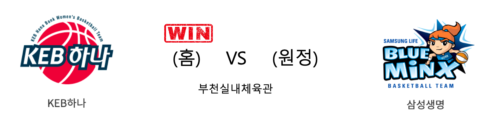

####  KEB하나(홈) VS 삼성생명(원정) 

<table class="tg">
  <tr>
    <th class="tg-rr9t">KEB하나</th>
    <th class="tg-rr9t">팀</th>
    <th class="tg-rr9t">삼성생명</th>
  </tr>
  <tr>
    <td class="tg-dcpn">2승 0패</td>
    <td class="tg-rr9t">시즌 상대전적</td>
    <td class="tg-dcpn">0승 2패</td>
  </tr>
  <tr>
    <td class="tg-dcpn">77</td>
    <td class="tg-rr9t">점수</td>
    <td class="tg-dcpn">72</td>
  </tr>
  <tr>
    <td class="tg-dcpn">23/45(51%)</td>
    <td class="tg-rr9t">2점(%)</td>
    <td class="tg-dcpn">26/57(46%)</td>
  </tr>
  <tr>
    <td class="tg-dcpn">6/25(24%)</td>
    <td class="tg-rr9t">3점(%)</td>
    <td class="tg-dcpn">4/19(21%)</td>
  </tr>
  <tr>
    <td class="tg-dcpn">13/14(93%)</td>
    <td class="tg-rr9t">자유투(%)</td>
    <td class="tg-dcpn">8/11(73%)</td>
  </tr>
  <tr>
    <td class="tg-dcpn">41</td>
    <td class="tg-rr9t">리바운드</td>
    <td class="tg-dcpn">38</td>
  </tr>
  <tr>
    <td class="tg-dcpn">20</td>
    <td class="tg-rr9t">어시스트</td>
    <td class="tg-dcpn">17</td>
  </tr>
  <tr>
    <td class="tg-dcpn">8</td>
    <td class="tg-rr9t">스틸</td>
    <td class="tg-dcpn">7</td>
  </tr>
  <tr>
    <td class="tg-dcpn">10</td>
    <td class="tg-rr9t">블록</td>
    <td class="tg-dcpn">13</td>
  </tr>
  <tr>
    <td class="tg-dcpn">12</td>
    <td class="tg-rr9t">턴오버</td>
    <td class="tg-dcpn">18</td>
  </tr>
  <tr>
    <td class="tg-dcpn">신지현(17) 마이샤(21) 강이슬(16)</td>
    <td class="tg-rr9t">주요 득점선수</td>
    <td class="tg-dcpn">배혜윤(30) 윤예빈(20)</td>
  </tr>
</table>

#### 경기 관련 주요 기사         

[4Q 배혜윤 공략 성공한 KEB하나은행, 삼성생명 꺾고 연패 탈출](http://www.sportsseoul.com/news/read/857460)

['마이샤 21P 18R' KEB하나은행, 삼성생명 꺾고 3연패 탈출](http://sports.news.naver.com/basketball/news/read.nhn?oid=065&aid=0000193460)

['마이샤 21득점' 하나은행, 삼성생명 꺾고 3연패 탈출](http://stoo.asiae.co.kr/article.php?aid=60208882277)

        
        

#### 리그 순위

<table class="tg">
  <tr>
    <th class="tg-d14o">순위</th>
    <th class="tg-d14o">팀명</th>
    <th class="tg-d14o">경기수</th>
    <th class="tg-d14o">승</th>
    <th class="tg-d14o">패</th>
    <th class="tg-d14o">승차</th>
    <th class="tg-d14o">승률</th>
  </tr>
  
<tr>
    <td class="tg-50j8">1</td>
    <td class="tg-50j8">우리은행</td>
    <td class="tg-50j8">8</td>
    <td class="tg-50j8">7</td>
    <td class="tg-50j8">1</td>
    <td class="tg-50j8">0</td>
    <td class="tg-50j8">0.875</td>
</tr>

<tr>
    <td class="tg-50j8">2</td>
    <td class="tg-50j8">KB스타즈</td>
    <td class="tg-50j8">8</td>
    <td class="tg-50j8">6</td>
    <td class="tg-50j8">2</td>
    <td class="tg-50j8">1</td>
    <td class="tg-50j8">0.75</td>
</tr>

<tr>
    <td class="tg-50j8">3</td>
    <td class="tg-50j8">신한은행</td>
    <td class="tg-50j8">7</td>
    <td class="tg-50j8">3</td>
    <td class="tg-50j8">4</td>
    <td class="tg-50j8">4</td>
    <td class="tg-50j8">0.429</td>
</tr>

<tr>
    <td class="tg-50j8">4</td>
    <td class="tg-50j8">삼성생명</td>
    <td class="tg-50j8">8</td>
    <td class="tg-50j8">3</td>
    <td class="tg-50j8">5</td>
    <td class="tg-50j8">4</td>
    <td class="tg-50j8">0.375</td>
</tr>

<tr>
    <td class="tg-50j8">4</td>
    <td class="tg-50j8">KEB하나</td>
    <td class="tg-50j8">8</td>
    <td class="tg-50j8">3</td>
    <td class="tg-50j8">5</td>
    <td class="tg-50j8">4</td>
    <td class="tg-50j8">0.375</td>
</tr>

<tr>
    <td class="tg-50j8">6</td>
    <td class="tg-50j8">BNK썸</td>
    <td class="tg-50j8">7</td>
    <td class="tg-50j8">1</td>
    <td class="tg-50j8">6</td>
    <td class="tg-50j8">6</td>
    <td class="tg-50j8">0.143</td>
</tr>
</table> 

        
        
#wkbl #국내농구 #여자농구 #농구분석 #토토 #스포츠토토 #경기예측 #농구결과 #20191204 #KEB하나 #삼성생명 #KEB하나삼성생명 