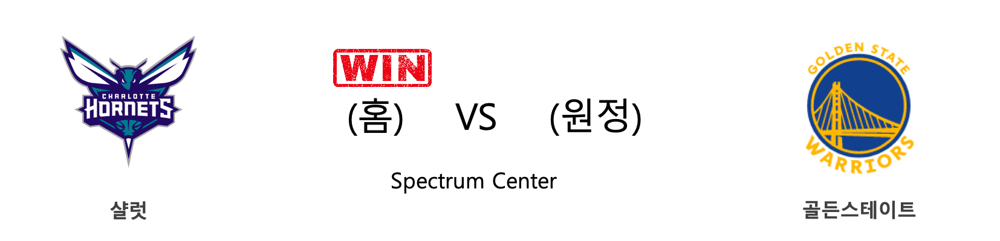
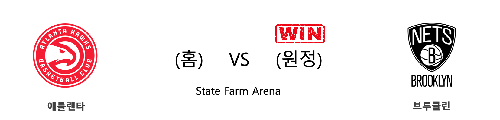
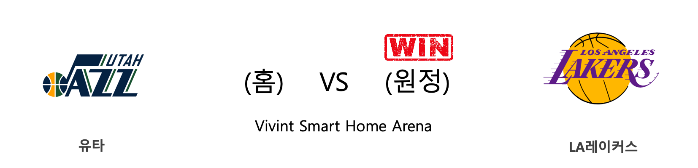
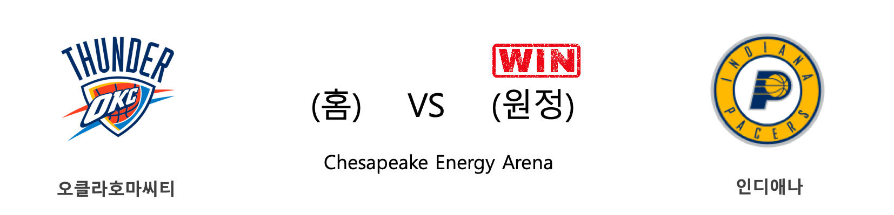
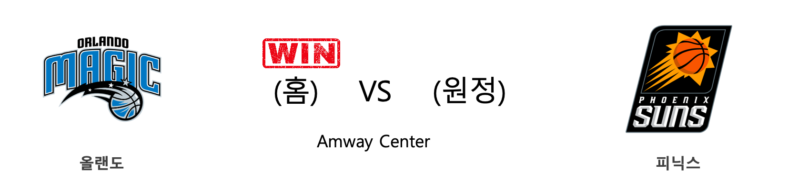
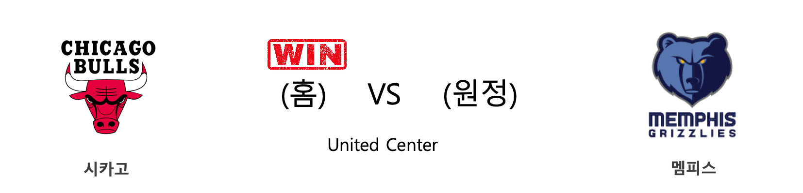
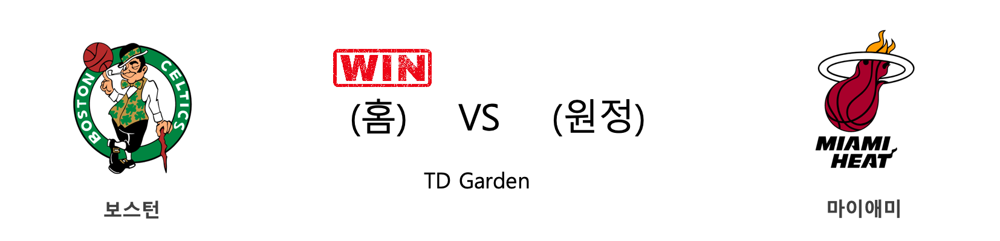

####  샬럿(홈) VS 골든스테이트(원정) 

<table class="tg">
  <tr>
    <th class="tg-rr9t">CHA</th>
    <th class="tg-rr9t">팀</th>
    <th class="tg-rr9t">GSW</th>
  </tr>
  <tr>
    <td class="tg-dcpn">2승 0패</td>
    <td class="tg-rr9t">시즌 상대전적</td>
    <td class="tg-dcpn">0승 2패</td>
  </tr>
  <tr>
    <td class="tg-dcpn">106</td>
    <td class="tg-rr9t">점수</td>
    <td class="tg-dcpn">91</td>
  </tr>
  <tr>
    <td class="tg-dcpn">19/39(49%)</td>
    <td class="tg-rr9t">2점(%)</td>
    <td class="tg-dcpn">27/55(49%)</td>
  </tr>
  <tr>
    <td class="tg-dcpn">21/48(44%)</td>
    <td class="tg-rr9t">3점(%)</td>
    <td class="tg-dcpn">9/23(39%)</td>
  </tr>
  <tr>
    <td class="tg-dcpn">5/8(62%)</td>
    <td class="tg-rr9t">자유투(%)</td>
    <td class="tg-dcpn">10/15(67%)</td>
  </tr>
  <tr>
    <td class="tg-dcpn">44</td>
    <td class="tg-rr9t">리바운드</td>
    <td class="tg-dcpn">37</td>
  </tr>
  <tr>
    <td class="tg-dcpn">30</td>
    <td class="tg-rr9t">어시스트</td>
    <td class="tg-dcpn">18</td>
  </tr>
  <tr>
    <td class="tg-dcpn">11</td>
    <td class="tg-rr9t">스틸</td>
    <td class="tg-dcpn">7</td>
  </tr>
  <tr>
    <td class="tg-dcpn">7</td>
    <td class="tg-rr9t">블록</td>
    <td class="tg-dcpn">3</td>
  </tr>
  <tr>
    <td class="tg-dcpn">13</td>
    <td class="tg-rr9t">턴오버</td>
    <td class="tg-dcpn">16</td>
  </tr>
  <tr>
    <td class="tg-dcpn">TerryRozierG(25) Devonte'Graha(33)</td>
    <td class="tg-rr9t">주요 득점선수</td>
    <td class="tg-dcpn">D'AngeloRusse(18) EricPaschallF(16) AlecBurks(15)</td>
  </tr>
</table>

#### 경기 관련 주요 기사         

[[오늘의 NBA] (12/2) 토론토, 두 마리 토끼를 노린다!](http://sports.news.naver.com/basketball/news/read.nhn?oid=486&aid=0000001154)

[[오늘의 NBA] (11/24) 잭 라빈, GSW 스플래쉬 브라더스를 소환하다](http://sports.news.naver.com/basketball/news/read.nhn?oid=486&aid=0000001147)

[[오늘의 NBA] (12/3) 켈리 우브레 주니어, 피닉스의 터프가이](http://sports.news.naver.com/basketball/news/read.nhn?oid=486&aid=0000001155)

[[오늘의 NBA] (11/28) 앤써니 데이비스, 노란 셔츠를 입은 사나이](http://sports.news.naver.com/basketball/news/read.nhn?oid=486&aid=0000001151)

[[오늘의 NBA] (11/30) 인디애나, 동부컨퍼런스의 복병](http://sports.news.naver.com/basketball/news/read.nhn?oid=486&aid=0000001152)

        
        

####  디트로이트(홈) VS 밀워키(원정) 

<table class="tg">
  <tr>
    <th class="tg-rr9t">DET</th>
    <th class="tg-rr9t">팀</th>
    <th class="tg-rr9t">MIL</th>
  </tr>
  <tr>
    <td class="tg-dcpn">0승 2패</td>
    <td class="tg-rr9t">시즌 상대전적</td>
    <td class="tg-dcpn">2승 0패</td>
  </tr>
  <tr>
    <td class="tg-dcpn">103</td>
    <td class="tg-rr9t">점수</td>
    <td class="tg-dcpn">127</td>
  </tr>
  <tr>
    <td class="tg-dcpn">28/57(49%)</td>
    <td class="tg-rr9t">2점(%)</td>
    <td class="tg-dcpn">30/55(55%)</td>
  </tr>
  <tr>
    <td class="tg-dcpn">11/36(31%)</td>
    <td class="tg-rr9t">3점(%)</td>
    <td class="tg-dcpn">14/35(40%)</td>
  </tr>
  <tr>
    <td class="tg-dcpn">14/22(64%)</td>
    <td class="tg-rr9t">자유투(%)</td>
    <td class="tg-dcpn">25/27(93%)</td>
  </tr>
  <tr>
    <td class="tg-dcpn">40</td>
    <td class="tg-rr9t">리바운드</td>
    <td class="tg-dcpn">55</td>
  </tr>
  <tr>
    <td class="tg-dcpn">25</td>
    <td class="tg-rr9t">어시스트</td>
    <td class="tg-dcpn">25</td>
  </tr>
  <tr>
    <td class="tg-dcpn">5</td>
    <td class="tg-rr9t">스틸</td>
    <td class="tg-dcpn">7</td>
  </tr>
  <tr>
    <td class="tg-dcpn">3</td>
    <td class="tg-rr9t">블록</td>
    <td class="tg-dcpn">8</td>
  </tr>
  <tr>
    <td class="tg-dcpn">11</td>
    <td class="tg-rr9t">턴오버</td>
    <td class="tg-dcpn">14</td>
  </tr>
  <tr>
    <td class="tg-dcpn">AndreDrummond(23) BlakeGriffinF(16) LangstonGallo(20)</td>
    <td class="tg-rr9t">주요 득점선수</td>
    <td class="tg-dcpn">KhrisMiddleto(17) GiannisAnteto(35)</td>
  </tr>
</table>

#### 경기 관련 주요 기사         

[[오늘의 NBA] (11/24) 잭 라빈, GSW 스플래쉬 브라더스를 소환하다](http://sports.news.naver.com/basketball/news/read.nhn?oid=486&aid=0000001147)

[[오늘의 NBA] (11/28) 앤써니 데이비스, 노란 셔츠를 입은 사나이](http://sports.news.naver.com/basketball/news/read.nhn?oid=486&aid=0000001151)

[[오늘의 NBA] (11/26) 마크 가솔, 조엘 엠비드의 영원한 악몽](http://sports.news.naver.com/basketball/news/read.nhn?oid=486&aid=0000001149)

[[오늘의 NBA] (12/5) 밀워키, 시스템 농구 정점에 도달하다](http://sports.news.naver.com/basketball/news/read.nhn?oid=486&aid=0000001157)

[[오늘의 NBA] (12/2) 토론토, 두 마리 토끼를 노린다!](http://sports.news.naver.com/basketball/news/read.nhn?oid=486&aid=0000001154)

        
        

####  포틀랜드(홈) VS 새크라멘토(원정) 

<table class="tg">
  <tr>
    <th class="tg-rr9t">POR</th>
    <th class="tg-rr9t">팀</th>
    <th class="tg-rr9t">SAC</th>
  </tr>
  <tr>
    <td class="tg-dcpn">2승 1패</td>
    <td class="tg-rr9t">시즌 상대전적</td>
    <td class="tg-dcpn">1승 2패</td>
  </tr>
  <tr>
    <td class="tg-dcpn">127</td>
    <td class="tg-rr9t">점수</td>
    <td class="tg-dcpn">116</td>
  </tr>
  <tr>
    <td class="tg-dcpn">31/52(60%)</td>
    <td class="tg-rr9t">2점(%)</td>
    <td class="tg-dcpn">33/61(54%)</td>
  </tr>
  <tr>
    <td class="tg-dcpn">16/32(50%)</td>
    <td class="tg-rr9t">3점(%)</td>
    <td class="tg-dcpn">11/34(32%)</td>
  </tr>
  <tr>
    <td class="tg-dcpn">17/21(81%)</td>
    <td class="tg-rr9t">자유투(%)</td>
    <td class="tg-dcpn">17/23(74%)</td>
  </tr>
  <tr>
    <td class="tg-dcpn">43</td>
    <td class="tg-rr9t">리바운드</td>
    <td class="tg-dcpn">44</td>
  </tr>
  <tr>
    <td class="tg-dcpn">28</td>
    <td class="tg-rr9t">어시스트</td>
    <td class="tg-dcpn">26</td>
  </tr>
  <tr>
    <td class="tg-dcpn">6</td>
    <td class="tg-rr9t">스틸</td>
    <td class="tg-dcpn">7</td>
  </tr>
  <tr>
    <td class="tg-dcpn">10</td>
    <td class="tg-rr9t">블록</td>
    <td class="tg-dcpn">7</td>
  </tr>
  <tr>
    <td class="tg-dcpn">12</td>
    <td class="tg-rr9t">턴오버</td>
    <td class="tg-dcpn">10</td>
  </tr>
  <tr>
    <td class="tg-dcpn">KentBazemore(15) CarmeloAnthon(20) CJMcCollumG(33) DamianLillard(24) HassanWhitesi(22)</td>
    <td class="tg-rr9t">주요 득점선수</td>
    <td class="tg-dcpn">BuddyHieldG(23) NemanjaBjelic(17) RichaunHolmes(28)</td>
  </tr>
</table>

#### 경기 관련 주요 기사         

[[오늘의 NBA] (11/30) 인디애나, 동부컨퍼런스의 복병](http://sports.news.naver.com/basketball/news/read.nhn?oid=486&aid=0000001152)

[[오늘의 NBA] 시즌 프리뷰 : 새크라멘토, 13년을 소모한 기다림](http://sports.news.naver.com/basketball/news/read.nhn?oid=486&aid=0000001095)

[[오늘의 NBA] (11/22) 밀워키, 동부컨퍼런스 단독 선두 등극](http://sports.news.naver.com/basketball/news/read.nhn?oid=486&aid=0000001145)

[오늘의 NBA] (11/3) 안드레 드러먼드, 모터 시티의 세계수](http://sports.news.naver.com/basketball/news/read.nhn?oid=486&aid=0000001126)

[[오늘의 NBA] (11/5) 데빈 부커, 강팀의 에이스](http://sports.news.naver.com/basketball/news/read.nhn?oid=486&aid=0000001128)

        
        

####  애틀랜타(홈) VS 브루클린(원정) 

<table class="tg">
  <tr>
    <th class="tg-rr9t">ATL</th>
    <th class="tg-rr9t">팀</th>
    <th class="tg-rr9t">BKN</th>
  </tr>
  <tr>
    <td class="tg-dcpn">0승 1패</td>
    <td class="tg-rr9t">시즌 상대전적</td>
    <td class="tg-dcpn">1승 0패</td>
  </tr>
  <tr>
    <td class="tg-dcpn">118</td>
    <td class="tg-rr9t">점수</td>
    <td class="tg-dcpn">130</td>
  </tr>
  <tr>
    <td class="tg-dcpn">39/64(61%)</td>
    <td class="tg-rr9t">2점(%)</td>
    <td class="tg-dcpn">36/69(52%)</td>
  </tr>
  <tr>
    <td class="tg-dcpn">9/26(35%)</td>
    <td class="tg-rr9t">3점(%)</td>
    <td class="tg-dcpn">14/31(45%)</td>
  </tr>
  <tr>
    <td class="tg-dcpn">13/21(62%)</td>
    <td class="tg-rr9t">자유투(%)</td>
    <td class="tg-dcpn">16/18(89%)</td>
  </tr>
  <tr>
    <td class="tg-dcpn">35</td>
    <td class="tg-rr9t">리바운드</td>
    <td class="tg-dcpn">53</td>
  </tr>
  <tr>
    <td class="tg-dcpn">24</td>
    <td class="tg-rr9t">어시스트</td>
    <td class="tg-dcpn">26</td>
  </tr>
  <tr>
    <td class="tg-dcpn">8</td>
    <td class="tg-rr9t">스틸</td>
    <td class="tg-dcpn">8</td>
  </tr>
  <tr>
    <td class="tg-dcpn">9</td>
    <td class="tg-rr9t">블록</td>
    <td class="tg-dcpn">6</td>
  </tr>
  <tr>
    <td class="tg-dcpn">16</td>
    <td class="tg-rr9t">턴오버</td>
    <td class="tg-dcpn">16</td>
  </tr>
  <tr>
    <td class="tg-dcpn">AlexLen(18) TraeYoungG(39) DamianJonesC(20) CamReddishF(25)</td>
    <td class="tg-rr9t">주요 득점선수</td>
    <td class="tg-dcpn">SpencerDinwid(24) JarrettAllenC(20) TaureanPrince(23) GarrettTemple(27)</td>
  </tr>
</table>

#### 경기 관련 주요 기사         

[[오늘의 NBA] (11/28) 앤써니 데이비스, 노란 셔츠를 입은 사나이](http://sports.news.naver.com/basketball/news/read.nhn?oid=486&aid=0000001151)

[[오늘의 NBA] (11/30) 인디애나, 동부컨퍼런스의 복병](http://sports.news.naver.com/basketball/news/read.nhn?oid=486&aid=0000001152)

[[오늘의 NBA] (12/5) 밀워키, 시스템 농구 정점에 도달하다](http://sports.news.naver.com/basketball/news/read.nhn?oid=486&aid=0000001157)

[[오늘의 NBA] (12/3) 켈리 우브레 주니어, 피닉스의 터프가이](http://sports.news.naver.com/basketball/news/read.nhn?oid=486&aid=0000001155)

[[오늘의 NBA] (12/2) 토론토, 두 마리 토끼를 노린다!](http://sports.news.naver.com/basketball/news/read.nhn?oid=486&aid=0000001154)

        
        

####  댈러스(홈) VS 미네소타(원정) 

<table class="tg">
  <tr>
    <th class="tg-rr9t">DAL</th>
    <th class="tg-rr9t">팀</th>
    <th class="tg-rr9t">MIN</th>
  </tr>
  <tr>
    <td class="tg-dcpn">1승 0패</td>
    <td class="tg-rr9t">시즌 상대전적</td>
    <td class="tg-dcpn">0승 1패</td>
  </tr>
  <tr>
    <td class="tg-dcpn">121</td>
    <td class="tg-rr9t">점수</td>
    <td class="tg-dcpn">114</td>
  </tr>
  <tr>
    <td class="tg-dcpn">35/55(64%)</td>
    <td class="tg-rr9t">2점(%)</td>
    <td class="tg-dcpn">20/51(39%)</td>
  </tr>
  <tr>
    <td class="tg-dcpn">11/37(30%)</td>
    <td class="tg-rr9t">3점(%)</td>
    <td class="tg-dcpn">17/38(45%)</td>
  </tr>
  <tr>
    <td class="tg-dcpn">18/23(78%)</td>
    <td class="tg-rr9t">자유투(%)</td>
    <td class="tg-dcpn">23/26(88%)</td>
  </tr>
  <tr>
    <td class="tg-dcpn">45</td>
    <td class="tg-rr9t">리바운드</td>
    <td class="tg-dcpn">44</td>
  </tr>
  <tr>
    <td class="tg-dcpn">24</td>
    <td class="tg-rr9t">어시스트</td>
    <td class="tg-dcpn">23</td>
  </tr>
  <tr>
    <td class="tg-dcpn">5</td>
    <td class="tg-rr9t">스틸</td>
    <td class="tg-dcpn">5</td>
  </tr>
  <tr>
    <td class="tg-dcpn">5</td>
    <td class="tg-rr9t">블록</td>
    <td class="tg-dcpn">7</td>
  </tr>
  <tr>
    <td class="tg-dcpn">8</td>
    <td class="tg-rr9t">턴오버</td>
    <td class="tg-dcpn">12</td>
  </tr>
  <tr>
    <td class="tg-dcpn">LukaDoncicG(22) DwightPowellC(24) JalenBrunson(16) KristapsPorzi(19)</td>
    <td class="tg-rr9t">주요 득점선수</td>
    <td class="tg-dcpn">AndrewWiggins(26) RobertCovingt(22) Karl-AnthonyT(26)</td>
  </tr>
</table>

#### 경기 관련 주요 기사         

[[오늘의 NBA] (12/2) 토론토, 두 마리 토끼를 노린다!](http://sports.news.naver.com/basketball/news/read.nhn?oid=486&aid=0000001154)

[[오늘의 NBA] (12/4) 샌안토니오, 괄육취골 승리를 거두다](http://sports.news.naver.com/basketball/news/read.nhn?oid=486&aid=0000001156)

[[오늘의 NBA] (12/5) 밀워키, 시스템 농구 정점에 도달하다](http://sports.news.naver.com/basketball/news/read.nhn?oid=486&aid=0000001157)

[[오늘의 NBA] (11/21) 클리퍼스, 안티 볼 핸들러 세계관을 구축하다](http://sports.news.naver.com/basketball/news/read.nhn?oid=486&aid=0000001144)

[[오늘의 NBA] (10/24) 앤드류 위긴스, 위기 상황에서 웃는 일류 승부사](http://sports.news.naver.com/basketball/news/read.nhn?oid=486&aid=0000001116)

        
        

####  유타(홈) VS LA레이커스(원정) 

<table class="tg">
  <tr>
    <th class="tg-rr9t">UTA</th>
    <th class="tg-rr9t">팀</th>
    <th class="tg-rr9t">LAL</th>
  </tr>
  <tr>
    <td class="tg-dcpn">0승 2패</td>
    <td class="tg-rr9t">시즌 상대전적</td>
    <td class="tg-dcpn">2승 0패</td>
  </tr>
  <tr>
    <td class="tg-dcpn">96</td>
    <td class="tg-rr9t">점수</td>
    <td class="tg-dcpn">121</td>
  </tr>
  <tr>
    <td class="tg-dcpn">20/52(38%)</td>
    <td class="tg-rr9t">2점(%)</td>
    <td class="tg-dcpn">32/61(52%)</td>
  </tr>
  <tr>
    <td class="tg-dcpn">14/31(45%)</td>
    <td class="tg-rr9t">3점(%)</td>
    <td class="tg-dcpn">14/29(48%)</td>
  </tr>
  <tr>
    <td class="tg-dcpn">14/19(74%)</td>
    <td class="tg-rr9t">자유투(%)</td>
    <td class="tg-dcpn">15/25(60%)</td>
  </tr>
  <tr>
    <td class="tg-dcpn">40</td>
    <td class="tg-rr9t">리바운드</td>
    <td class="tg-dcpn">46</td>
  </tr>
  <tr>
    <td class="tg-dcpn">20</td>
    <td class="tg-rr9t">어시스트</td>
    <td class="tg-dcpn">27</td>
  </tr>
  <tr>
    <td class="tg-dcpn">3</td>
    <td class="tg-rr9t">스틸</td>
    <td class="tg-dcpn">13</td>
  </tr>
  <tr>
    <td class="tg-dcpn">3</td>
    <td class="tg-rr9t">블록</td>
    <td class="tg-dcpn">12</td>
  </tr>
  <tr>
    <td class="tg-dcpn">18</td>
    <td class="tg-rr9t">턴오버</td>
    <td class="tg-dcpn">7</td>
  </tr>
  <tr>
    <td class="tg-dcpn">DonovanMitche(29) BojanBogdanov(23)</td>
    <td class="tg-rr9t">주요 득점선수</td>
    <td class="tg-dcpn">AnthonyDavisF(26) LeBronJamesF(20)</td>
  </tr>
</table>

#### 경기 관련 주요 기사         

[[오늘의 NBA] (11/26) 마크 가솔, 조엘 엠비드의 영원한 악몽](http://sports.news.naver.com/basketball/news/read.nhn?oid=486&aid=0000001149)

[[오늘의 NBA] (12/2) 토론토, 두 마리 토끼를 노린다!](http://sports.news.naver.com/basketball/news/read.nhn?oid=486&aid=0000001154)

[[오늘의 NBA] (11/28) 앤써니 데이비스, 노란 셔츠를 입은 사나이](http://sports.news.naver.com/basketball/news/read.nhn?oid=486&aid=0000001151)

[[오늘의 NBA] (11/30) 인디애나, 동부컨퍼런스의 복병](http://sports.news.naver.com/basketball/news/read.nhn?oid=486&aid=0000001152)

[[오늘의 NBA] (12/5) 밀워키, 시스템 농구 정점에 도달하다](http://sports.news.naver.com/basketball/news/read.nhn?oid=486&aid=0000001157)

        
        

####  오클라호마씨티(홈) VS 인디애나(원정) 

<table class="tg">
  <tr>
    <th class="tg-rr9t">OKC</th>
    <th class="tg-rr9t">팀</th>
    <th class="tg-rr9t">IND</th>
  </tr>
  <tr>
    <td class="tg-dcpn">0승 2패</td>
    <td class="tg-rr9t">시즌 상대전적</td>
    <td class="tg-dcpn">2승 0패</td>
  </tr>
  <tr>
    <td class="tg-dcpn">100</td>
    <td class="tg-rr9t">점수</td>
    <td class="tg-dcpn">107</td>
  </tr>
  <tr>
    <td class="tg-dcpn">32/58(55%)</td>
    <td class="tg-rr9t">2점(%)</td>
    <td class="tg-dcpn">33/63(52%)</td>
  </tr>
  <tr>
    <td class="tg-dcpn">9/26(35%)</td>
    <td class="tg-rr9t">3점(%)</td>
    <td class="tg-dcpn">9/24(38%)</td>
  </tr>
  <tr>
    <td class="tg-dcpn">9/10(90%)</td>
    <td class="tg-rr9t">자유투(%)</td>
    <td class="tg-dcpn">14/17(82%)</td>
  </tr>
  <tr>
    <td class="tg-dcpn">37</td>
    <td class="tg-rr9t">리바운드</td>
    <td class="tg-dcpn">39</td>
  </tr>
  <tr>
    <td class="tg-dcpn">25</td>
    <td class="tg-rr9t">어시스트</td>
    <td class="tg-dcpn">19</td>
  </tr>
  <tr>
    <td class="tg-dcpn">3</td>
    <td class="tg-rr9t">스틸</td>
    <td class="tg-dcpn">5</td>
  </tr>
  <tr>
    <td class="tg-dcpn">5</td>
    <td class="tg-rr9t">블록</td>
    <td class="tg-dcpn">1</td>
  </tr>
  <tr>
    <td class="tg-dcpn">11</td>
    <td class="tg-rr9t">턴오버</td>
    <td class="tg-dcpn">8</td>
  </tr>
  <tr>
    <td class="tg-dcpn">DaniloGallina(18) StevenAdamsC(20) ShaiGilgeous-(16) DennisSchrode(18)</td>
    <td class="tg-rr9t">주요 득점선수</td>
    <td class="tg-dcpn">T.J.WarrenF(24) DomantasSabon(17)</td>
  </tr>
</table>

#### 경기 관련 주요 기사         

[[오늘의 NBA] (11/26) 마크 가솔, 조엘 엠비드의 영원한 악몽](http://sports.news.naver.com/basketball/news/read.nhn?oid=486&aid=0000001149)

[[오늘의 NBA] (12/5) 밀워키, 시스템 농구 정점에 도달하다](http://sports.news.naver.com/basketball/news/read.nhn?oid=486&aid=0000001157)

['워렌 24P' IND, 원정에서 OKC 격파](http://www.rookie.co.kr/news/articleView.html?idxno=35750)

[[오늘의 NBA] (11/28) 앤써니 데이비스, 노란 셔츠를 입은 사나이](http://sports.news.naver.com/basketball/news/read.nhn?oid=486&aid=0000001151)

[[오늘의 NBA] (11/30) 인디애나, 동부컨퍼런스의 복병](http://sports.news.naver.com/basketball/news/read.nhn?oid=486&aid=0000001152)

        
        

####  올랜도(홈) VS 피닉스(원정) 

<table class="tg">
  <tr>
    <th class="tg-rr9t">ORL</th>
    <th class="tg-rr9t">팀</th>
    <th class="tg-rr9t">PHX</th>
  </tr>
  <tr>
    <td class="tg-dcpn">1승 0패</td>
    <td class="tg-rr9t">시즌 상대전적</td>
    <td class="tg-dcpn">0승 1패</td>
  </tr>
  <tr>
    <td class="tg-dcpn">128</td>
    <td class="tg-rr9t">점수</td>
    <td class="tg-dcpn">114</td>
  </tr>
  <tr>
    <td class="tg-dcpn">35/60(58%)</td>
    <td class="tg-rr9t">2점(%)</td>
    <td class="tg-dcpn">28/55(51%)</td>
  </tr>
  <tr>
    <td class="tg-dcpn">14/25(56%)</td>
    <td class="tg-rr9t">3점(%)</td>
    <td class="tg-dcpn">15/33(45%)</td>
  </tr>
  <tr>
    <td class="tg-dcpn">16/20(80%)</td>
    <td class="tg-rr9t">자유투(%)</td>
    <td class="tg-dcpn">13/20(65%)</td>
  </tr>
  <tr>
    <td class="tg-dcpn">45</td>
    <td class="tg-rr9t">리바운드</td>
    <td class="tg-dcpn">29</td>
  </tr>
  <tr>
    <td class="tg-dcpn">27</td>
    <td class="tg-rr9t">어시스트</td>
    <td class="tg-dcpn">36</td>
  </tr>
  <tr>
    <td class="tg-dcpn">9</td>
    <td class="tg-rr9t">스틸</td>
    <td class="tg-dcpn">10</td>
  </tr>
  <tr>
    <td class="tg-dcpn">7</td>
    <td class="tg-rr9t">블록</td>
    <td class="tg-dcpn">0</td>
  </tr>
  <tr>
    <td class="tg-dcpn">19</td>
    <td class="tg-rr9t">턴오버</td>
    <td class="tg-dcpn">13</td>
  </tr>
  <tr>
    <td class="tg-dcpn">TerrenceRoss(22) EvanFournierG(21) AaronGordonF(32)</td>
    <td class="tg-rr9t">주요 득점선수</td>
    <td class="tg-dcpn">CheickDiallo(16) MikalBridges(15) DevinBookerG(17) FrankKaminsky(23)</td>
  </tr>
</table>

#### 경기 관련 주요 기사         

[[오늘의 NBA] (11/25) 댈러스, 공격이 승리를 부른다!](http://sports.news.naver.com/basketball/news/read.nhn?oid=486&aid=0000001148)

[[오늘의 NBA] (12/3) 켈리 우브레 주니어, 피닉스의 터프가이](http://sports.news.naver.com/basketball/news/read.nhn?oid=486&aid=0000001155)

[[오늘의 NBA] (11/30) 인디애나, 동부컨퍼런스의 복병](http://sports.news.naver.com/basketball/news/read.nhn?oid=486&aid=0000001152)

[[오늘의 NBA] (12/4) 샌안토니오, 괄육취골 승리를 거두다](http://sports.news.naver.com/basketball/news/read.nhn?oid=486&aid=0000001156)

[[오늘의 NBA] (11/28) 앤써니 데이비스, 노란 셔츠를 입은 사나이](http://sports.news.naver.com/basketball/news/read.nhn?oid=486&aid=0000001151)

        
        

####  시카고(홈) VS 멤피스(원정) 

<table class="tg">
  <tr>
    <th class="tg-rr9t">CHI</th>
    <th class="tg-rr9t">팀</th>
    <th class="tg-rr9t">MEM</th>
  </tr>
  <tr>
    <td class="tg-dcpn">2승 0패</td>
    <td class="tg-rr9t">시즌 상대전적</td>
    <td class="tg-dcpn">0승 2패</td>
  </tr>
  <tr>
    <td class="tg-dcpn">106</td>
    <td class="tg-rr9t">점수</td>
    <td class="tg-dcpn">99</td>
  </tr>
  <tr>
    <td class="tg-dcpn">20/44(45%)</td>
    <td class="tg-rr9t">2점(%)</td>
    <td class="tg-dcpn">30/66(45%)</td>
  </tr>
  <tr>
    <td class="tg-dcpn">13/33(39%)</td>
    <td class="tg-rr9t">3점(%)</td>
    <td class="tg-dcpn">7/30(23%)</td>
  </tr>
  <tr>
    <td class="tg-dcpn">27/37(73%)</td>
    <td class="tg-rr9t">자유투(%)</td>
    <td class="tg-dcpn">18/21(86%)</td>
  </tr>
  <tr>
    <td class="tg-dcpn">50</td>
    <td class="tg-rr9t">리바운드</td>
    <td class="tg-dcpn">46</td>
  </tr>
  <tr>
    <td class="tg-dcpn">22</td>
    <td class="tg-rr9t">어시스트</td>
    <td class="tg-dcpn">24</td>
  </tr>
  <tr>
    <td class="tg-dcpn">5</td>
    <td class="tg-rr9t">스틸</td>
    <td class="tg-dcpn">14</td>
  </tr>
  <tr>
    <td class="tg-dcpn">13</td>
    <td class="tg-rr9t">블록</td>
    <td class="tg-dcpn">6</td>
  </tr>
  <tr>
    <td class="tg-dcpn">20</td>
    <td class="tg-rr9t">턴오버</td>
    <td class="tg-dcpn">12</td>
  </tr>
  <tr>
    <td class="tg-dcpn">LauriMarkkane(15) ZachLaVineG(25) WendellCarter(16)</td>
    <td class="tg-rr9t">주요 득점선수</td>
    <td class="tg-dcpn">JonasValanciu(32) JarenJacksonJ(15) JaeCrowderF(15)</td>
  </tr>
</table>

#### 경기 관련 주요 기사         

[[오늘의 NBA] (12/5) 밀워키, 시스템 농구 정점에 도달하다](http://sports.news.naver.com/basketball/news/read.nhn?oid=486&aid=0000001157)

[[오늘의 NBA] (11/30) 인디애나, 동부컨퍼런스의 복병](http://sports.news.naver.com/basketball/news/read.nhn?oid=486&aid=0000001152)

[[오늘의 NBA] (11/23) 카와이 레너드, 승부를 결정짓는 사나이](http://sports.news.naver.com/basketball/news/read.nhn?oid=486&aid=0000001146)

[[오늘의 NBA] (10/30) 앤써니 데이비스, 골드&퍼플 군단의 새로운 태양](http://sports.news.naver.com/basketball/news/read.nhn?oid=486&aid=0000001122)

[[오늘의 NBA] (11/24) 잭 라빈, GSW 스플래쉬 브라더스를 소환하다](http://sports.news.naver.com/basketball/news/read.nhn?oid=486&aid=0000001147)

        
        

####  보스턴(홈) VS 마이애미(원정) 

<table class="tg">
  <tr>
    <th class="tg-rr9t">BOS</th>
    <th class="tg-rr9t">팀</th>
    <th class="tg-rr9t">MIA</th>
  </tr>
  <tr>
    <td class="tg-dcpn">1승 0패</td>
    <td class="tg-rr9t">시즌 상대전적</td>
    <td class="tg-dcpn">0승 1패</td>
  </tr>
  <tr>
    <td class="tg-dcpn">112</td>
    <td class="tg-rr9t">점수</td>
    <td class="tg-dcpn">93</td>
  </tr>
  <tr>
    <td class="tg-dcpn">19/39(49%)</td>
    <td class="tg-rr9t">2점(%)</td>
    <td class="tg-dcpn">20/40(50%)</td>
  </tr>
  <tr>
    <td class="tg-dcpn">16/41(39%)</td>
    <td class="tg-rr9t">3점(%)</td>
    <td class="tg-dcpn">14/38(37%)</td>
  </tr>
  <tr>
    <td class="tg-dcpn">26/32(81%)</td>
    <td class="tg-rr9t">자유투(%)</td>
    <td class="tg-dcpn">11/17(65%)</td>
  </tr>
  <tr>
    <td class="tg-dcpn">45</td>
    <td class="tg-rr9t">리바운드</td>
    <td class="tg-dcpn">40</td>
  </tr>
  <tr>
    <td class="tg-dcpn">21</td>
    <td class="tg-rr9t">어시스트</td>
    <td class="tg-dcpn">20</td>
  </tr>
  <tr>
    <td class="tg-dcpn">9</td>
    <td class="tg-rr9t">스틸</td>
    <td class="tg-dcpn">7</td>
  </tr>
  <tr>
    <td class="tg-dcpn">8</td>
    <td class="tg-rr9t">블록</td>
    <td class="tg-dcpn">3</td>
  </tr>
  <tr>
    <td class="tg-dcpn">9</td>
    <td class="tg-rr9t">턴오버</td>
    <td class="tg-dcpn">18</td>
  </tr>
  <tr>
    <td class="tg-dcpn">JaylenBrownG(31) JaysonTatumF(19) KembaWalkerG(28)</td>
    <td class="tg-rr9t">주요 득점선수</td>
    <td class="tg-dcpn">JimmyButlerF(37)</td>
  </tr>
</table>

#### 경기 관련 주요 기사         

[[오늘의 NBA] (11/19) 댈러스의 루카 복음 낭송](http://sports.news.naver.com/basketball/news/read.nhn?oid=486&aid=0000001142)

[[오늘의 NBA] (11/28) 앤써니 데이비스, 노란 셔츠를 입은 사나이](http://sports.news.naver.com/basketball/news/read.nhn?oid=486&aid=0000001151)

[[오늘의 NBA] (11/24) 잭 라빈, GSW 스플래쉬 브라더스를 소환하다](http://sports.news.naver.com/basketball/news/read.nhn?oid=486&aid=0000001147)

[[오늘의 NBA] (11/26) 마크 가솔, 조엘 엠비드의 영원한 악몽](http://sports.news.naver.com/basketball/news/read.nhn?oid=486&aid=0000001149)

[[오늘의 NBA] (11/21) 클리퍼스, 안티 볼 핸들러 세계관을 구축하다](http://sports.news.naver.com/basketball/news/read.nhn?oid=486&aid=0000001144)

        
        

#### 리그 (Eastern) 순위
    

<table class="tg">
  <tr>
    <th class="tg-d14o">순위</th>
    <th class="tg-d14o">팀명</th>
    <th class="tg-d14o">경기수</th>
    <th class="tg-d14o">승</th>
    <th class="tg-d14o">패</th>
    <th class="tg-d14o">승차</th>
    <th class="tg-d14o">승률</th>
  </tr>
  
<tr>
    <td class="tg-50j8">1</td>
    <td class="tg-50j8">MIL</td>
    <td class="tg-50j8">22</td>
    <td class="tg-50j8">19</td>
    <td class="tg-50j8">3</td>
    <td class="tg-50j8">0</td>
    <td class="tg-50j8">0.864</td>
</tr>

<tr>
    <td class="tg-50j8">2</td>
    <td class="tg-50j8">BOS</td>
    <td class="tg-50j8">20</td>
    <td class="tg-50j8">15</td>
    <td class="tg-50j8">5</td>
    <td class="tg-50j8">4</td>
    <td class="tg-50j8">0.75</td>
</tr>

<tr>
    <td class="tg-50j8">2</td>
    <td class="tg-50j8">TOR</td>
    <td class="tg-50j8">20</td>
    <td class="tg-50j8">15</td>
    <td class="tg-50j8">5</td>
    <td class="tg-50j8">4</td>
    <td class="tg-50j8">0.75</td>
</tr>

<tr>
    <td class="tg-50j8">4</td>
    <td class="tg-50j8">MIA</td>
    <td class="tg-50j8">21</td>
    <td class="tg-50j8">15</td>
    <td class="tg-50j8">6</td>
    <td class="tg-50j8">4</td>
    <td class="tg-50j8">0.714</td>
</tr>

<tr>
    <td class="tg-50j8">4</td>
    <td class="tg-50j8">PHI</td>
    <td class="tg-50j8">21</td>
    <td class="tg-50j8">15</td>
    <td class="tg-50j8">6</td>
    <td class="tg-50j8">4</td>
    <td class="tg-50j8">0.714</td>
</tr>

<tr>
    <td class="tg-50j8">6</td>
    <td class="tg-50j8">IND</td>
    <td class="tg-50j8">21</td>
    <td class="tg-50j8">14</td>
    <td class="tg-50j8">7</td>
    <td class="tg-50j8">5</td>
    <td class="tg-50j8">0.667</td>
</tr>

<tr>
    <td class="tg-50j8">7</td>
    <td class="tg-50j8">BKN</td>
    <td class="tg-50j8">21</td>
    <td class="tg-50j8">11</td>
    <td class="tg-50j8">10</td>
    <td class="tg-50j8">8</td>
    <td class="tg-50j8">0.524</td>
</tr>

<tr>
    <td class="tg-50j8">8</td>
    <td class="tg-50j8">ORL</td>
    <td class="tg-50j8">21</td>
    <td class="tg-50j8">10</td>
    <td class="tg-50j8">11</td>
    <td class="tg-50j8">9</td>
    <td class="tg-50j8">0.476</td>
</tr>

<tr>
    <td class="tg-50j8">9</td>
    <td class="tg-50j8">CHA</td>
    <td class="tg-50j8">23</td>
    <td class="tg-50j8">9</td>
    <td class="tg-50j8">14</td>
    <td class="tg-50j8">10</td>
    <td class="tg-50j8">0.391</td>
</tr>

<tr>
    <td class="tg-50j8">10</td>
    <td class="tg-50j8">DET</td>
    <td class="tg-50j8">22</td>
    <td class="tg-50j8">8</td>
    <td class="tg-50j8">14</td>
    <td class="tg-50j8">11</td>
    <td class="tg-50j8">0.364</td>
</tr>

<tr>
    <td class="tg-50j8">10</td>
    <td class="tg-50j8">CHI</td>
    <td class="tg-50j8">22</td>
    <td class="tg-50j8">8</td>
    <td class="tg-50j8">14</td>
    <td class="tg-50j8">11</td>
    <td class="tg-50j8">0.364</td>
</tr>

<tr>
    <td class="tg-50j8">12</td>
    <td class="tg-50j8">WAS</td>
    <td class="tg-50j8">19</td>
    <td class="tg-50j8">6</td>
    <td class="tg-50j8">13</td>
    <td class="tg-50j8">13</td>
    <td class="tg-50j8">0.316</td>
</tr>

<tr>
    <td class="tg-50j8">13</td>
    <td class="tg-50j8">CLE</td>
    <td class="tg-50j8">20</td>
    <td class="tg-50j8">5</td>
    <td class="tg-50j8">15</td>
    <td class="tg-50j8">14</td>
    <td class="tg-50j8">0.25</td>
</tr>

<tr>
    <td class="tg-50j8">14</td>
    <td class="tg-50j8">ATL</td>
    <td class="tg-50j8">22</td>
    <td class="tg-50j8">5</td>
    <td class="tg-50j8">17</td>
    <td class="tg-50j8">14</td>
    <td class="tg-50j8">0.227</td>
</tr>

<tr>
    <td class="tg-50j8">15</td>
    <td class="tg-50j8">NYK</td>
    <td class="tg-50j8">21</td>
    <td class="tg-50j8">4</td>
    <td class="tg-50j8">17</td>
    <td class="tg-50j8">15</td>
    <td class="tg-50j8">0.19</td>
</tr>
</table> 
#### 리그 (Western) 순위
    

<table class="tg">
  <tr>
    <th class="tg-d14o">순위</th>
    <th class="tg-d14o">팀명</th>
    <th class="tg-d14o">경기수</th>
    <th class="tg-d14o">승</th>
    <th class="tg-d14o">패</th>
    <th class="tg-d14o">승차</th>
    <th class="tg-d14o">승률</th>
  </tr>
  
<tr>
    <td class="tg-50j8">1</td>
    <td class="tg-50j8">LAL</td>
    <td class="tg-50j8">22</td>
    <td class="tg-50j8">19</td>
    <td class="tg-50j8">3</td>
    <td class="tg-50j8">0</td>
    <td class="tg-50j8">0.864</td>
</tr>

<tr>
    <td class="tg-50j8">2</td>
    <td class="tg-50j8">LAC</td>
    <td class="tg-50j8">22</td>
    <td class="tg-50j8">16</td>
    <td class="tg-50j8">6</td>
    <td class="tg-50j8">3</td>
    <td class="tg-50j8">0.727</td>
</tr>

<tr>
    <td class="tg-50j8">3</td>
    <td class="tg-50j8">DAL</td>
    <td class="tg-50j8">21</td>
    <td class="tg-50j8">15</td>
    <td class="tg-50j8">6</td>
    <td class="tg-50j8">4</td>
    <td class="tg-50j8">0.714</td>
</tr>

<tr>
    <td class="tg-50j8">4</td>
    <td class="tg-50j8">DEN</td>
    <td class="tg-50j8">18</td>
    <td class="tg-50j8">13</td>
    <td class="tg-50j8">5</td>
    <td class="tg-50j8">6</td>
    <td class="tg-50j8">0.722</td>
</tr>

<tr>
    <td class="tg-50j8">5</td>
    <td class="tg-50j8">HOU</td>
    <td class="tg-50j8">20</td>
    <td class="tg-50j8">13</td>
    <td class="tg-50j8">7</td>
    <td class="tg-50j8">6</td>
    <td class="tg-50j8">0.65</td>
</tr>

<tr>
    <td class="tg-50j8">6</td>
    <td class="tg-50j8">UTA</td>
    <td class="tg-50j8">22</td>
    <td class="tg-50j8">12</td>
    <td class="tg-50j8">10</td>
    <td class="tg-50j8">7</td>
    <td class="tg-50j8">0.545</td>
</tr>

<tr>
    <td class="tg-50j8">7</td>
    <td class="tg-50j8">MIN</td>
    <td class="tg-50j8">20</td>
    <td class="tg-50j8">10</td>
    <td class="tg-50j8">10</td>
    <td class="tg-50j8">9</td>
    <td class="tg-50j8">0.5</td>
</tr>

<tr>
    <td class="tg-50j8">8</td>
    <td class="tg-50j8">PHX</td>
    <td class="tg-50j8">20</td>
    <td class="tg-50j8">9</td>
    <td class="tg-50j8">11</td>
    <td class="tg-50j8">10</td>
    <td class="tg-50j8">0.45</td>
</tr>

<tr>
    <td class="tg-50j8">9</td>
    <td class="tg-50j8">POR</td>
    <td class="tg-50j8">22</td>
    <td class="tg-50j8">9</td>
    <td class="tg-50j8">13</td>
    <td class="tg-50j8">10</td>
    <td class="tg-50j8">0.409</td>
</tr>

<tr>
    <td class="tg-50j8">10</td>
    <td class="tg-50j8">OKC</td>
    <td class="tg-50j8">20</td>
    <td class="tg-50j8">8</td>
    <td class="tg-50j8">12</td>
    <td class="tg-50j8">11</td>
    <td class="tg-50j8">0.4</td>
</tr>

<tr>
    <td class="tg-50j8">10</td>
    <td class="tg-50j8">SAC</td>
    <td class="tg-50j8">20</td>
    <td class="tg-50j8">8</td>
    <td class="tg-50j8">12</td>
    <td class="tg-50j8">11</td>
    <td class="tg-50j8">0.4</td>
</tr>

<tr>
    <td class="tg-50j8">12</td>
    <td class="tg-50j8">SAS</td>
    <td class="tg-50j8">22</td>
    <td class="tg-50j8">8</td>
    <td class="tg-50j8">14</td>
    <td class="tg-50j8">11</td>
    <td class="tg-50j8">0.364</td>
</tr>

<tr>
    <td class="tg-50j8">13</td>
    <td class="tg-50j8">MEM</td>
    <td class="tg-50j8">21</td>
    <td class="tg-50j8">6</td>
    <td class="tg-50j8">15</td>
    <td class="tg-50j8">13</td>
    <td class="tg-50j8">0.286</td>
</tr>

<tr>
    <td class="tg-50j8">13</td>
    <td class="tg-50j8">NOP</td>
    <td class="tg-50j8">21</td>
    <td class="tg-50j8">6</td>
    <td class="tg-50j8">15</td>
    <td class="tg-50j8">13</td>
    <td class="tg-50j8">0.286</td>
</tr>

<tr>
    <td class="tg-50j8">15</td>
    <td class="tg-50j8">GSW</td>
    <td class="tg-50j8">23</td>
    <td class="tg-50j8">4</td>
    <td class="tg-50j8">19</td>
    <td class="tg-50j8">15</td>
    <td class="tg-50j8">0.174</td>
</tr>
</table> 

        
        
#nba #미국농구 #엔비에이 #농구분석 #토토 #스포츠토토 #경기예측 #농구결과 #20191205 #샬럿 #골든스테이트 #디트로이트 #밀워키 #포틀랜드 #새크라멘토 #애틀랜타 #브루클린 #댈러스 #미네소타 #유타 #LA레이커스 #오클라호마씨티 #인디애나 #올랜도 #피닉스 #시카고 #멤피스 #보스턴 #마이애미 #샬럿골든스테이트 #디트로이트밀워키 #포틀랜드새크라멘토 #애틀랜타브루클린 #댈러스미네소타 #유타LA레이커스 #오클라호마씨티인디애나 #올랜도피닉스 #시카고멤피스 #보스턴마이애미 