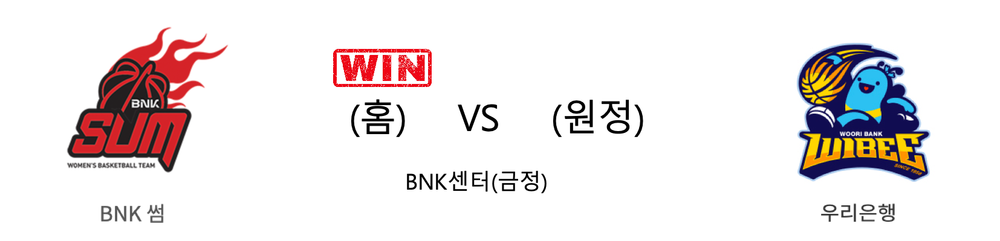

####  BNK썸(홈) VS 우리은행(원정) 

<table class="tg">
  <tr>
    <th class="tg-rr9t">BNK썸</th>
    <th class="tg-rr9t">팀</th>
    <th class="tg-rr9t">우리은행</th>
  </tr>
  <tr>
    <td class="tg-dcpn">1승 1패</td>
    <td class="tg-rr9t">시즌 상대전적</td>
    <td class="tg-dcpn">1승 1패</td>
  </tr>
  <tr>
    <td class="tg-dcpn">75</td>
    <td class="tg-rr9t">점수</td>
    <td class="tg-dcpn">70</td>
  </tr>
  <tr>
    <td class="tg-dcpn">19/48(40%)</td>
    <td class="tg-rr9t">2점(%)</td>
    <td class="tg-dcpn">17/40(42%)</td>
  </tr>
  <tr>
    <td class="tg-dcpn">10/19(53%)</td>
    <td class="tg-rr9t">3점(%)</td>
    <td class="tg-dcpn">7/22(32%)</td>
  </tr>
  <tr>
    <td class="tg-dcpn">7/10(70%)</td>
    <td class="tg-rr9t">자유투(%)</td>
    <td class="tg-dcpn">15/17(88%)</td>
  </tr>
  <tr>
    <td class="tg-dcpn">32</td>
    <td class="tg-rr9t">리바운드</td>
    <td class="tg-dcpn">35</td>
  </tr>
  <tr>
    <td class="tg-dcpn">18</td>
    <td class="tg-rr9t">어시스트</td>
    <td class="tg-dcpn">15</td>
  </tr>
  <tr>
    <td class="tg-dcpn">6</td>
    <td class="tg-rr9t">스틸</td>
    <td class="tg-dcpn">6</td>
  </tr>
  <tr>
    <td class="tg-dcpn">10</td>
    <td class="tg-rr9t">블록</td>
    <td class="tg-dcpn">11</td>
  </tr>
  <tr>
    <td class="tg-dcpn">20</td>
    <td class="tg-rr9t">턴오버</td>
    <td class="tg-dcpn">16</td>
  </tr>
  <tr>
    <td class="tg-dcpn">안혜지(16) 노현지(17)</td>
    <td class="tg-rr9t">주요 득점선수</td>
    <td class="tg-dcpn">그레이(20)</td>
  </tr>
</table>

#### 경기 관련 주요 기사         

[최하위 BNK썸, 홈에서 선두 우리은행 제압 '파란'](http://www.sportsseoul.com/news/read/858043)

[‘5명 10+득점’ BNK, 우리은행 8연승 저지 이변](http://www.mydaily.co.kr/new_yk/html/read.php?newsid=201912052108828603&ext=na)

[[내 맘대로 프리뷰] BNK vs 우리은행, 창단 첫 홈 승리는 이뤄질 수 있을까](http://www.basketkorea.com/news/articleView.html?idxno=190523)

[[포토] BNK썸 홈 첫승의 재물은 1위 우리은행!](http://www.rookie.co.kr/news/articleView.html?idxno=35791)

        
        

#### 리그 순위

<table class="tg">
  <tr>
    <th class="tg-d14o">순위</th>
    <th class="tg-d14o">팀명</th>
    <th class="tg-d14o">경기수</th>
    <th class="tg-d14o">승</th>
    <th class="tg-d14o">패</th>
    <th class="tg-d14o">승차</th>
    <th class="tg-d14o">승률</th>
  </tr>
  
<tr>
    <td class="tg-50j8">1</td>
    <td class="tg-50j8">우리은행</td>
    <td class="tg-50j8">9</td>
    <td class="tg-50j8">7</td>
    <td class="tg-50j8">2</td>
    <td class="tg-50j8">0</td>
    <td class="tg-50j8">0.778</td>
</tr>

<tr>
    <td class="tg-50j8">2</td>
    <td class="tg-50j8">KB스타즈</td>
    <td class="tg-50j8">8</td>
    <td class="tg-50j8">6</td>
    <td class="tg-50j8">2</td>
    <td class="tg-50j8">1</td>
    <td class="tg-50j8">0.75</td>
</tr>

<tr>
    <td class="tg-50j8">3</td>
    <td class="tg-50j8">신한은행</td>
    <td class="tg-50j8">7</td>
    <td class="tg-50j8">3</td>
    <td class="tg-50j8">4</td>
    <td class="tg-50j8">4</td>
    <td class="tg-50j8">0.429</td>
</tr>

<tr>
    <td class="tg-50j8">4</td>
    <td class="tg-50j8">삼성생명</td>
    <td class="tg-50j8">8</td>
    <td class="tg-50j8">3</td>
    <td class="tg-50j8">5</td>
    <td class="tg-50j8">4</td>
    <td class="tg-50j8">0.375</td>
</tr>

<tr>
    <td class="tg-50j8">4</td>
    <td class="tg-50j8">KEB하나</td>
    <td class="tg-50j8">8</td>
    <td class="tg-50j8">3</td>
    <td class="tg-50j8">5</td>
    <td class="tg-50j8">4</td>
    <td class="tg-50j8">0.375</td>
</tr>

<tr>
    <td class="tg-50j8">6</td>
    <td class="tg-50j8">BNK썸</td>
    <td class="tg-50j8">8</td>
    <td class="tg-50j8">2</td>
    <td class="tg-50j8">6</td>
    <td class="tg-50j8">5</td>
    <td class="tg-50j8">0.25</td>
</tr>
</table> 

        
        
#wkbl #국내농구 #여자농구 #농구분석 #토토 #스포츠토토 #경기예측 #농구결과 #20191205 #BNK썸 #우리은행 #BNK썸우리은행 