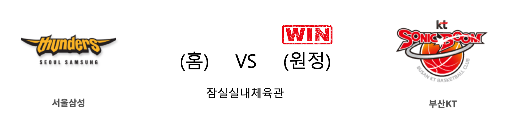

####  안양KGC(홈) VS 울산현대모비스(원정) 

<table class="tg">
  <tr>
    <th class="tg-rr9t">안양KGC</th>
    <th class="tg-rr9t">팀</th>
    <th class="tg-rr9t">울산현대모비스</th>
  </tr>
  <tr>
    <td class="tg-dcpn">2승 1패</td>
    <td class="tg-rr9t">시즌 상대전적</td>
    <td class="tg-dcpn">1승 2패</td>
  </tr>
  <tr>
    <td class="tg-dcpn">65</td>
    <td class="tg-rr9t">점수</td>
    <td class="tg-dcpn">60</td>
  </tr>
  <tr>
    <td class="tg-dcpn">17/37(46%)</td>
    <td class="tg-rr9t">2점(%)</td>
    <td class="tg-dcpn">20/45(44%)</td>
  </tr>
  <tr>
    <td class="tg-dcpn">8/30(27%)</td>
    <td class="tg-rr9t">3점(%)</td>
    <td class="tg-dcpn">3/22(14%)</td>
  </tr>
  <tr>
    <td class="tg-dcpn">7/12(58%)</td>
    <td class="tg-rr9t">자유투(%)</td>
    <td class="tg-dcpn">11/18(61%)</td>
  </tr>
  <tr>
    <td class="tg-dcpn">42</td>
    <td class="tg-rr9t">리바운드</td>
    <td class="tg-dcpn">42</td>
  </tr>
  <tr>
    <td class="tg-dcpn">2</td>
    <td class="tg-rr9t">어시스트</td>
    <td class="tg-dcpn">2</td>
  </tr>
  <tr>
    <td class="tg-dcpn">15</td>
    <td class="tg-rr9t">스틸</td>
    <td class="tg-dcpn">11</td>
  </tr>
  <tr>
    <td class="tg-dcpn">8</td>
    <td class="tg-rr9t">블록</td>
    <td class="tg-dcpn">11</td>
  </tr>
  <tr>
    <td class="tg-dcpn">18</td>
    <td class="tg-rr9t">턴오버</td>
    <td class="tg-dcpn">17</td>
  </tr>
  <tr>
    <td class="tg-dcpn">변준형(15) 김철욱(15)</td>
    <td class="tg-rr9t">주요 득점선수</td>
    <td class="tg-dcpn">리온 윌리엄스(15)</td>
  </tr>
</table>

#### 경기 관련 주요 기사         

[[MD포토] 승리 거둔 안양 KGC '울산 현대모비스 선수들과 인사'](http://www.mydaily.co.kr/new_yk/html/read.php?newsid=201912062048863927&ext=na)

[[BK Review] '맥컬러 더블더블' KGC, 현대모비스 꺾고 4연승+단독 3위](http://www.basketkorea.com/news/articleView.html?idxno=190549)

[‘철욱+준형 30점 합작’ KGC 인삼공사, 현대모비스 누르고 4연승 달려](http://sports.news.naver.com/basketball/news/read.nhn?oid=065&aid=0000193547)

        
        

####  서울삼성(홈) VS 부산KT(원정) 

<table class="tg">
  <tr>
    <th class="tg-rr9t">서울삼성</th>
    <th class="tg-rr9t">팀</th>
    <th class="tg-rr9t">부산KT</th>
  </tr>
  <tr>
    <td class="tg-dcpn">0승 3패</td>
    <td class="tg-rr9t">시즌 상대전적</td>
    <td class="tg-dcpn">3승 0패</td>
  </tr>
  <tr>
    <td class="tg-dcpn">87</td>
    <td class="tg-rr9t">점수</td>
    <td class="tg-dcpn">100</td>
  </tr>
  <tr>
    <td class="tg-dcpn">21/39(54%)</td>
    <td class="tg-rr9t">2점(%)</td>
    <td class="tg-dcpn">26/46(57%)</td>
  </tr>
  <tr>
    <td class="tg-dcpn">9/22(41%)</td>
    <td class="tg-rr9t">3점(%)</td>
    <td class="tg-dcpn">13/31(42%)</td>
  </tr>
  <tr>
    <td class="tg-dcpn">18/23(78%)</td>
    <td class="tg-rr9t">자유투(%)</td>
    <td class="tg-dcpn">9/10(90%)</td>
  </tr>
  <tr>
    <td class="tg-dcpn">27</td>
    <td class="tg-rr9t">리바운드</td>
    <td class="tg-dcpn">40</td>
  </tr>
  <tr>
    <td class="tg-dcpn">1</td>
    <td class="tg-rr9t">어시스트</td>
    <td class="tg-dcpn">1</td>
  </tr>
  <tr>
    <td class="tg-dcpn">13</td>
    <td class="tg-rr9t">스틸</td>
    <td class="tg-dcpn">12</td>
  </tr>
  <tr>
    <td class="tg-dcpn">8</td>
    <td class="tg-rr9t">블록</td>
    <td class="tg-dcpn">6</td>
  </tr>
  <tr>
    <td class="tg-dcpn">24</td>
    <td class="tg-rr9t">턴오버</td>
    <td class="tg-dcpn">23</td>
  </tr>
  <tr>
    <td class="tg-dcpn">닉 미네라스(23) 김준일(18) 이관희(16) 장민국(15)</td>
    <td class="tg-rr9t">주요 득점선수</td>
    <td class="tg-dcpn">허훈(24) 알 쏜튼(18)</td>
  </tr>
</table>

#### 경기 관련 주요 기사         

[[BK Review] '허훈 후반 맹활약' kt, 3일 만에 삼성 또 격파](http://www.basketkorea.com/news/articleView.html?idxno=190552)

[[포토] 부산 KT '삼성 격파! 짜릿한 승리'](http://sports.chosun.com/news/ntype.htm?id=201912060100050450003159&servicedate=20191206)

[오늘도 양궁 신공 KT, 삼성 꺾고 4연승](https://www.seoul.co.kr/news/newsView.php?id=20191206500198&wlog_tag3=naver)

[[★현장리뷰] '허훈 24점 폭발' KT, 삼성 100-87 잡고 4연승](http://star.mt.co.kr/stview.php?no=2019120620152442171)

        
        

#### 리그 순위

<table class="tg">
  <tr>
    <th class="tg-d14o">순위</th>
    <th class="tg-d14o">팀명</th>
    <th class="tg-d14o">경기수</th>
    <th class="tg-d14o">승</th>
    <th class="tg-d14o">패</th>
    <th class="tg-d14o">승차</th>
    <th class="tg-d14o">승률</th>
  </tr>
  
<tr>
    <td class="tg-50j8">1</td>
    <td class="tg-50j8">서울SK</td>
    <td class="tg-50j8">18</td>
    <td class="tg-50j8">13</td>
    <td class="tg-50j8">5</td>
    <td class="tg-50j8">0</td>
    <td class="tg-50j8">0.722</td>
</tr>

<tr>
    <td class="tg-50j8">2</td>
    <td class="tg-50j8">원주DB</td>
    <td class="tg-50j8">18</td>
    <td class="tg-50j8">11</td>
    <td class="tg-50j8">7</td>
    <td class="tg-50j8">2</td>
    <td class="tg-50j8">0.611</td>
</tr>

<tr>
    <td class="tg-50j8">3</td>
    <td class="tg-50j8">안양KGC</td>
    <td class="tg-50j8">19</td>
    <td class="tg-50j8">11</td>
    <td class="tg-50j8">8</td>
    <td class="tg-50j8">2</td>
    <td class="tg-50j8">0.579</td>
</tr>

<tr>
    <td class="tg-50j8">4</td>
    <td class="tg-50j8">인천전자랜드</td>
    <td class="tg-50j8">18</td>
    <td class="tg-50j8">10</td>
    <td class="tg-50j8">8</td>
    <td class="tg-50j8">3</td>
    <td class="tg-50j8">0.556</td>
</tr>

<tr>
    <td class="tg-50j8">5</td>
    <td class="tg-50j8">부산KT</td>
    <td class="tg-50j8">19</td>
    <td class="tg-50j8">10</td>
    <td class="tg-50j8">9</td>
    <td class="tg-50j8">3</td>
    <td class="tg-50j8">0.526</td>
</tr>

<tr>
    <td class="tg-50j8">6</td>
    <td class="tg-50j8">전주KCC</td>
    <td class="tg-50j8">18</td>
    <td class="tg-50j8">9</td>
    <td class="tg-50j8">9</td>
    <td class="tg-50j8">4</td>
    <td class="tg-50j8">0.5</td>
</tr>

<tr>
    <td class="tg-50j8">7</td>
    <td class="tg-50j8">울산현대모비스</td>
    <td class="tg-50j8">19</td>
    <td class="tg-50j8">8</td>
    <td class="tg-50j8">11</td>
    <td class="tg-50j8">5</td>
    <td class="tg-50j8">0.421</td>
</tr>

<tr>
    <td class="tg-50j8">7</td>
    <td class="tg-50j8">서울삼성</td>
    <td class="tg-50j8">19</td>
    <td class="tg-50j8">8</td>
    <td class="tg-50j8">11</td>
    <td class="tg-50j8">5</td>
    <td class="tg-50j8">0.421</td>
</tr>

<tr>
    <td class="tg-50j8">9</td>
    <td class="tg-50j8">고양오리온</td>
    <td class="tg-50j8">18</td>
    <td class="tg-50j8">6</td>
    <td class="tg-50j8">12</td>
    <td class="tg-50j8">7</td>
    <td class="tg-50j8">0.333</td>
</tr>

<tr>
    <td class="tg-50j8">9</td>
    <td class="tg-50j8">창원LG</td>
    <td class="tg-50j8">18</td>
    <td class="tg-50j8">6</td>
    <td class="tg-50j8">12</td>
    <td class="tg-50j8">7</td>
    <td class="tg-50j8">0.333</td>
</tr>
</table> 

        
        
#kbl #국내농구 #농구분석 #토토 #스포츠토토 #경기예측 #농구결과 #20191206 #안양KGC #울산현대모비스 #서울삼성 #부산KT #안양KGC울산현대모비스 #서울삼성부산KT 