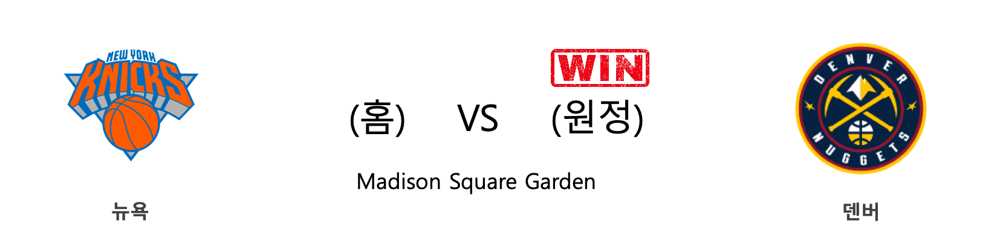
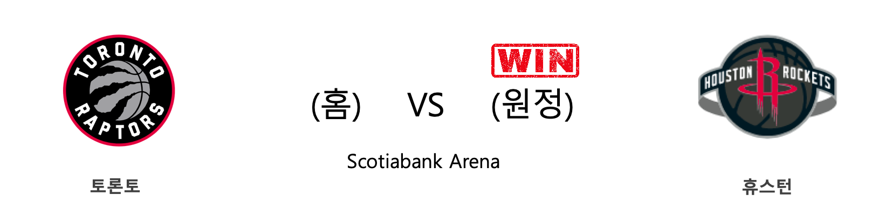

####  워싱턴(홈) VS 필라델피아(원정) 

<table class="tg">
  <tr>
    <th class="tg-rr9t">WAS</th>
    <th class="tg-rr9t">팀</th>
    <th class="tg-rr9t">PHI</th>
  </tr>
  <tr>
    <td class="tg-dcpn">1승 0패</td>
    <td class="tg-rr9t">시즌 상대전적</td>
    <td class="tg-dcpn">0승 1패</td>
  </tr>
  <tr>
    <td class="tg-dcpn">119</td>
    <td class="tg-rr9t">점수</td>
    <td class="tg-dcpn">113</td>
  </tr>
  <tr>
    <td class="tg-dcpn">30/63(48%)</td>
    <td class="tg-rr9t">2점(%)</td>
    <td class="tg-dcpn">28/49(57%)</td>
  </tr>
  <tr>
    <td class="tg-dcpn">11/27(41%)</td>
    <td class="tg-rr9t">3점(%)</td>
    <td class="tg-dcpn">13/28(46%)</td>
  </tr>
  <tr>
    <td class="tg-dcpn">26/32(81%)</td>
    <td class="tg-rr9t">자유투(%)</td>
    <td class="tg-dcpn">18/24(75%)</td>
  </tr>
  <tr>
    <td class="tg-dcpn">41</td>
    <td class="tg-rr9t">리바운드</td>
    <td class="tg-dcpn">44</td>
  </tr>
  <tr>
    <td class="tg-dcpn">25</td>
    <td class="tg-rr9t">어시스트</td>
    <td class="tg-dcpn">25</td>
  </tr>
  <tr>
    <td class="tg-dcpn">9</td>
    <td class="tg-rr9t">스틸</td>
    <td class="tg-dcpn">7</td>
  </tr>
  <tr>
    <td class="tg-dcpn">1</td>
    <td class="tg-rr9t">블록</td>
    <td class="tg-dcpn">6</td>
  </tr>
  <tr>
    <td class="tg-dcpn">11</td>
    <td class="tg-rr9t">턴오버</td>
    <td class="tg-dcpn">21</td>
  </tr>
  <tr>
    <td class="tg-dcpn">IshSmithG(19) DavisBertans(25) BradleyBealG(26) RuiHachimuraF(27)</td>
    <td class="tg-rr9t">주요 득점선수</td>
    <td class="tg-dcpn">BenSimmonsG(17) TobiasHarrisF(33) JoelEmbiidC(26)</td>
  </tr>
</table>

#### 경기 관련 주요 기사         

[[오늘의 NBA] (11/19) 댈러스의 루카 복음 낭송](http://sports.news.naver.com/basketball/news/read.nhn?oid=486&aid=0000001142)

[[오늘의 NBA] (12/6) 마이크 댄토니, 토론토 수비를 농락하다](http://sports.news.naver.com/basketball/news/read.nhn?oid=486&aid=0000001158)

[[오늘의 NBA] (12/1) 새크라멘토의 IQ 농구](http://sports.news.naver.com/basketball/news/read.nhn?oid=486&aid=0000001153)

[A Viewer’s Guide to ‘RuPaul’s Drag Race’](https://www.nytimes.com/2019/10/03/arts/rupauls-drag-race-uk.html?partner=naver)

[[오늘의 NBA] (11/5) 데빈 부커, 강팀의 에이스](http://sports.news.naver.com/basketball/news/read.nhn?oid=486&aid=0000001128)

        
        

####  뉴욕(홈) VS 덴버(원정) 

<table class="tg">
  <tr>
    <th class="tg-rr9t">NYK</th>
    <th class="tg-rr9t">팀</th>
    <th class="tg-rr9t">DEN</th>
  </tr>
  <tr>
    <td class="tg-dcpn">0승 1패</td>
    <td class="tg-rr9t">시즌 상대전적</td>
    <td class="tg-dcpn">1승 0패</td>
  </tr>
  <tr>
    <td class="tg-dcpn">92</td>
    <td class="tg-rr9t">점수</td>
    <td class="tg-dcpn">129</td>
  </tr>
  <tr>
    <td class="tg-dcpn">25/49(51%)</td>
    <td class="tg-rr9t">2점(%)</td>
    <td class="tg-dcpn">28/48(58%)</td>
  </tr>
  <tr>
    <td class="tg-dcpn">9/34(26%)</td>
    <td class="tg-rr9t">3점(%)</td>
    <td class="tg-dcpn">21/39(54%)</td>
  </tr>
  <tr>
    <td class="tg-dcpn">15/23(65%)</td>
    <td class="tg-rr9t">자유투(%)</td>
    <td class="tg-dcpn">10/18(56%)</td>
  </tr>
  <tr>
    <td class="tg-dcpn">33</td>
    <td class="tg-rr9t">리바운드</td>
    <td class="tg-dcpn">48</td>
  </tr>
  <tr>
    <td class="tg-dcpn">23</td>
    <td class="tg-rr9t">어시스트</td>
    <td class="tg-dcpn">38</td>
  </tr>
  <tr>
    <td class="tg-dcpn">9</td>
    <td class="tg-rr9t">스틸</td>
    <td class="tg-dcpn">8</td>
  </tr>
  <tr>
    <td class="tg-dcpn">7</td>
    <td class="tg-rr9t">블록</td>
    <td class="tg-dcpn">5</td>
  </tr>
  <tr>
    <td class="tg-dcpn">14</td>
    <td class="tg-rr9t">턴오버</td>
    <td class="tg-dcpn">13</td>
  </tr>
  <tr>
    <td class="tg-dcpn">MitchellRobin(17)</td>
    <td class="tg-rr9t">주요 득점선수</td>
    <td class="tg-dcpn">MonteMorris(15) JeramiGrant(16) WillBartonF(17)</td>
  </tr>
</table>

#### 경기 관련 주요 기사         

[[오늘의 NBA] (11/28) 앤써니 데이비스, 노란 셔츠를 입은 사나이](http://sports.news.naver.com/basketball/news/read.nhn?oid=486&aid=0000001151)

[[오늘의 NBA] (12/6) 마이크 댄토니, 토론토 수비를 농락하다](http://sports.news.naver.com/basketball/news/read.nhn?oid=486&aid=0000001158)

[[오늘의 NBA] (11/30) 인디애나, 동부컨퍼런스의 복병](http://sports.news.naver.com/basketball/news/read.nhn?oid=486&aid=0000001152)

[[오늘의 NBA] (11/25) 댈러스, 공격이 승리를 부른다!](http://sports.news.naver.com/basketball/news/read.nhn?oid=486&aid=0000001148)

[[오늘의 NBA] (12/2) 토론토, 두 마리 토끼를 노린다!](http://sports.news.naver.com/basketball/news/read.nhn?oid=486&aid=0000001154)

        
        

####  토론토(홈) VS 휴스턴(원정) 

<table class="tg">
  <tr>
    <th class="tg-rr9t">TOR</th>
    <th class="tg-rr9t">팀</th>
    <th class="tg-rr9t">HOU</th>
  </tr>
  <tr>
    <td class="tg-dcpn">0승 1패</td>
    <td class="tg-rr9t">시즌 상대전적</td>
    <td class="tg-dcpn">1승 0패</td>
  </tr>
  <tr>
    <td class="tg-dcpn">109</td>
    <td class="tg-rr9t">점수</td>
    <td class="tg-dcpn">119</td>
  </tr>
  <tr>
    <td class="tg-dcpn">26/49(53%)</td>
    <td class="tg-rr9t">2점(%)</td>
    <td class="tg-dcpn">18/43(42%)</td>
  </tr>
  <tr>
    <td class="tg-dcpn">12/39(31%)</td>
    <td class="tg-rr9t">3점(%)</td>
    <td class="tg-dcpn">22/55(40%)</td>
  </tr>
  <tr>
    <td class="tg-dcpn">21/24(88%)</td>
    <td class="tg-rr9t">자유투(%)</td>
    <td class="tg-dcpn">17/19(89%)</td>
  </tr>
  <tr>
    <td class="tg-dcpn">45</td>
    <td class="tg-rr9t">리바운드</td>
    <td class="tg-dcpn">54</td>
  </tr>
  <tr>
    <td class="tg-dcpn">27</td>
    <td class="tg-rr9t">어시스트</td>
    <td class="tg-dcpn">29</td>
  </tr>
  <tr>
    <td class="tg-dcpn">14</td>
    <td class="tg-rr9t">스틸</td>
    <td class="tg-dcpn">11</td>
  </tr>
  <tr>
    <td class="tg-dcpn">5</td>
    <td class="tg-rr9t">블록</td>
    <td class="tg-dcpn">2</td>
  </tr>
  <tr>
    <td class="tg-dcpn">17</td>
    <td class="tg-rr9t">턴오버</td>
    <td class="tg-dcpn">22</td>
  </tr>
  <tr>
    <td class="tg-dcpn">PascalSiakamF(24) KyleLowryG(19) FredVanVleetG(20)</td>
    <td class="tg-rr9t">주요 득점선수</td>
    <td class="tg-dcpn">P.J.TuckerF(18) BenMcLemoreF(28) DanuelHouseJr(16) RussellWestbr(19) JamesHardenG(23)</td>
  </tr>
</table>

#### 경기 관련 주요 기사         

[[오늘의 NBA] (11/30) 인디애나, 동부컨퍼런스의 복병](http://sports.news.naver.com/basketball/news/read.nhn?oid=486&aid=0000001152)

[[오늘의 NBA] (12/4) 샌안토니오, 괄육취골 승리를 거두다](http://sports.news.naver.com/basketball/news/read.nhn?oid=486&aid=0000001156)

[[오늘의 NBA] (11/26) 마크 가솔, 조엘 엠비드의 영원한 악몽](http://sports.news.naver.com/basketball/news/read.nhn?oid=486&aid=0000001149)

[[오늘의 NBA] (12/1) 새크라멘토의 IQ 농구](http://sports.news.naver.com/basketball/news/read.nhn?oid=486&aid=0000001153)

[[오늘의 NBA] (11/28) 앤써니 데이비스, 노란 셔츠를 입은 사나이](http://sports.news.naver.com/basketball/news/read.nhn?oid=486&aid=0000001151)

        
        

####  뉴올리언스(홈) VS 피닉스(원정) 

<table class="tg">
  <tr>
    <th class="tg-rr9t">NOP</th>
    <th class="tg-rr9t">팀</th>
    <th class="tg-rr9t">PHX</th>
  </tr>
  <tr>
    <td class="tg-dcpn">1승 1패</td>
    <td class="tg-rr9t">시즌 상대전적</td>
    <td class="tg-dcpn">1승 1패</td>
  </tr>
  <tr>
    <td class="tg-dcpn">132</td>
    <td class="tg-rr9t">점수</td>
    <td class="tg-dcpn">139</td>
  </tr>
  <tr>
    <td class="tg-dcpn">27/46(59%)</td>
    <td class="tg-rr9t">2점(%)</td>
    <td class="tg-dcpn">36/71(51%)</td>
  </tr>
  <tr>
    <td class="tg-dcpn">17/41(41%)</td>
    <td class="tg-rr9t">3점(%)</td>
    <td class="tg-dcpn">14/36(39%)</td>
  </tr>
  <tr>
    <td class="tg-dcpn">27/35(77%)</td>
    <td class="tg-rr9t">자유투(%)</td>
    <td class="tg-dcpn">25/27(93%)</td>
  </tr>
  <tr>
    <td class="tg-dcpn">40</td>
    <td class="tg-rr9t">리바운드</td>
    <td class="tg-dcpn">51</td>
  </tr>
  <tr>
    <td class="tg-dcpn">27</td>
    <td class="tg-rr9t">어시스트</td>
    <td class="tg-dcpn">30</td>
  </tr>
  <tr>
    <td class="tg-dcpn">13</td>
    <td class="tg-rr9t">스틸</td>
    <td class="tg-dcpn">16</td>
  </tr>
  <tr>
    <td class="tg-dcpn">10</td>
    <td class="tg-rr9t">블록</td>
    <td class="tg-dcpn">6</td>
  </tr>
  <tr>
    <td class="tg-dcpn">23</td>
    <td class="tg-rr9t">턴오버</td>
    <td class="tg-dcpn">18</td>
  </tr>
  <tr>
    <td class="tg-dcpn">JrueHolidayF(23) BrandonIngram(21) LonzoBallG(20) JaxsonHayesC(17) JJRedickG(26)</td>
    <td class="tg-rr9t">주요 득점선수</td>
    <td class="tg-dcpn">DevinBookerG(44) CameronJohnso(18) FrankKaminsky(20)</td>
  </tr>
</table>

#### 경기 관련 주요 기사         

[[오늘의 NBA] (11/30) 인디애나, 동부컨퍼런스의 복병](http://sports.news.naver.com/basketball/news/read.nhn?oid=486&aid=0000001152)

[[오늘의 NBA] (12/6) 마이크 댄토니, 토론토 수비를 농락하다](http://sports.news.naver.com/basketball/news/read.nhn?oid=486&aid=0000001158)

[[오늘의 NBA] (12/3) 켈리 우브레 주니어, 피닉스의 터프가이](http://sports.news.naver.com/basketball/news/read.nhn?oid=486&aid=0000001155)

[[오늘의 NBA] (12/2) 토론토, 두 마리 토끼를 노린다!](http://sports.news.naver.com/basketball/news/read.nhn?oid=486&aid=0000001154)

[[오늘의 NBA] (12/5) 밀워키, 시스템 농구 정점에 도달하다](http://sports.news.naver.com/basketball/news/read.nhn?oid=486&aid=0000001157)

        
        

#### 리그 (Eastern) 순위
    

<table class="tg">
  <tr>
    <th class="tg-d14o">순위</th>
    <th class="tg-d14o">팀명</th>
    <th class="tg-d14o">경기수</th>
    <th class="tg-d14o">승</th>
    <th class="tg-d14o">패</th>
    <th class="tg-d14o">승차</th>
    <th class="tg-d14o">승률</th>
  </tr>
  
<tr>
    <td class="tg-50j8">1</td>
    <td class="tg-50j8">MIL</td>
    <td class="tg-50j8">22</td>
    <td class="tg-50j8">19</td>
    <td class="tg-50j8">3</td>
    <td class="tg-50j8">0</td>
    <td class="tg-50j8">0.864</td>
</tr>

<tr>
    <td class="tg-50j8">2</td>
    <td class="tg-50j8">BOS</td>
    <td class="tg-50j8">20</td>
    <td class="tg-50j8">15</td>
    <td class="tg-50j8">5</td>
    <td class="tg-50j8">4</td>
    <td class="tg-50j8">0.75</td>
</tr>

<tr>
    <td class="tg-50j8">3</td>
    <td class="tg-50j8">TOR</td>
    <td class="tg-50j8">21</td>
    <td class="tg-50j8">15</td>
    <td class="tg-50j8">6</td>
    <td class="tg-50j8">4</td>
    <td class="tg-50j8">0.714</td>
</tr>

<tr>
    <td class="tg-50j8">3</td>
    <td class="tg-50j8">MIA</td>
    <td class="tg-50j8">21</td>
    <td class="tg-50j8">15</td>
    <td class="tg-50j8">6</td>
    <td class="tg-50j8">4</td>
    <td class="tg-50j8">0.714</td>
</tr>

<tr>
    <td class="tg-50j8">5</td>
    <td class="tg-50j8">PHI</td>
    <td class="tg-50j8">22</td>
    <td class="tg-50j8">15</td>
    <td class="tg-50j8">7</td>
    <td class="tg-50j8">4</td>
    <td class="tg-50j8">0.682</td>
</tr>

<tr>
    <td class="tg-50j8">6</td>
    <td class="tg-50j8">IND</td>
    <td class="tg-50j8">21</td>
    <td class="tg-50j8">14</td>
    <td class="tg-50j8">7</td>
    <td class="tg-50j8">5</td>
    <td class="tg-50j8">0.667</td>
</tr>

<tr>
    <td class="tg-50j8">7</td>
    <td class="tg-50j8">BKN</td>
    <td class="tg-50j8">21</td>
    <td class="tg-50j8">11</td>
    <td class="tg-50j8">10</td>
    <td class="tg-50j8">8</td>
    <td class="tg-50j8">0.524</td>
</tr>

<tr>
    <td class="tg-50j8">8</td>
    <td class="tg-50j8">ORL</td>
    <td class="tg-50j8">21</td>
    <td class="tg-50j8">10</td>
    <td class="tg-50j8">11</td>
    <td class="tg-50j8">9</td>
    <td class="tg-50j8">0.476</td>
</tr>

<tr>
    <td class="tg-50j8">9</td>
    <td class="tg-50j8">CHA</td>
    <td class="tg-50j8">23</td>
    <td class="tg-50j8">9</td>
    <td class="tg-50j8">14</td>
    <td class="tg-50j8">10</td>
    <td class="tg-50j8">0.391</td>
</tr>

<tr>
    <td class="tg-50j8">10</td>
    <td class="tg-50j8">DET</td>
    <td class="tg-50j8">22</td>
    <td class="tg-50j8">8</td>
    <td class="tg-50j8">14</td>
    <td class="tg-50j8">11</td>
    <td class="tg-50j8">0.364</td>
</tr>

<tr>
    <td class="tg-50j8">10</td>
    <td class="tg-50j8">CHI</td>
    <td class="tg-50j8">22</td>
    <td class="tg-50j8">8</td>
    <td class="tg-50j8">14</td>
    <td class="tg-50j8">11</td>
    <td class="tg-50j8">0.364</td>
</tr>

<tr>
    <td class="tg-50j8">12</td>
    <td class="tg-50j8">WAS</td>
    <td class="tg-50j8">20</td>
    <td class="tg-50j8">7</td>
    <td class="tg-50j8">13</td>
    <td class="tg-50j8">12</td>
    <td class="tg-50j8">0.35</td>
</tr>

<tr>
    <td class="tg-50j8">13</td>
    <td class="tg-50j8">CLE</td>
    <td class="tg-50j8">20</td>
    <td class="tg-50j8">5</td>
    <td class="tg-50j8">15</td>
    <td class="tg-50j8">14</td>
    <td class="tg-50j8">0.25</td>
</tr>

<tr>
    <td class="tg-50j8">14</td>
    <td class="tg-50j8">ATL</td>
    <td class="tg-50j8">22</td>
    <td class="tg-50j8">5</td>
    <td class="tg-50j8">17</td>
    <td class="tg-50j8">14</td>
    <td class="tg-50j8">0.227</td>
</tr>

<tr>
    <td class="tg-50j8">15</td>
    <td class="tg-50j8">NYK</td>
    <td class="tg-50j8">22</td>
    <td class="tg-50j8">4</td>
    <td class="tg-50j8">18</td>
    <td class="tg-50j8">15</td>
    <td class="tg-50j8">0.182</td>
</tr>
</table> 
#### 리그 (Western) 순위
    

<table class="tg">
  <tr>
    <th class="tg-d14o">순위</th>
    <th class="tg-d14o">팀명</th>
    <th class="tg-d14o">경기수</th>
    <th class="tg-d14o">승</th>
    <th class="tg-d14o">패</th>
    <th class="tg-d14o">승차</th>
    <th class="tg-d14o">승률</th>
  </tr>
  
<tr>
    <td class="tg-50j8">1</td>
    <td class="tg-50j8">LAL</td>
    <td class="tg-50j8">22</td>
    <td class="tg-50j8">19</td>
    <td class="tg-50j8">3</td>
    <td class="tg-50j8">0</td>
    <td class="tg-50j8">0.864</td>
</tr>

<tr>
    <td class="tg-50j8">2</td>
    <td class="tg-50j8">LAC</td>
    <td class="tg-50j8">22</td>
    <td class="tg-50j8">16</td>
    <td class="tg-50j8">6</td>
    <td class="tg-50j8">3</td>
    <td class="tg-50j8">0.727</td>
</tr>

<tr>
    <td class="tg-50j8">3</td>
    <td class="tg-50j8">DAL</td>
    <td class="tg-50j8">21</td>
    <td class="tg-50j8">15</td>
    <td class="tg-50j8">6</td>
    <td class="tg-50j8">4</td>
    <td class="tg-50j8">0.714</td>
</tr>

<tr>
    <td class="tg-50j8">4</td>
    <td class="tg-50j8">DEN</td>
    <td class="tg-50j8">19</td>
    <td class="tg-50j8">14</td>
    <td class="tg-50j8">5</td>
    <td class="tg-50j8">5</td>
    <td class="tg-50j8">0.737</td>
</tr>

<tr>
    <td class="tg-50j8">5</td>
    <td class="tg-50j8">HOU</td>
    <td class="tg-50j8">21</td>
    <td class="tg-50j8">14</td>
    <td class="tg-50j8">7</td>
    <td class="tg-50j8">5</td>
    <td class="tg-50j8">0.667</td>
</tr>

<tr>
    <td class="tg-50j8">6</td>
    <td class="tg-50j8">UTA</td>
    <td class="tg-50j8">22</td>
    <td class="tg-50j8">12</td>
    <td class="tg-50j8">10</td>
    <td class="tg-50j8">7</td>
    <td class="tg-50j8">0.545</td>
</tr>

<tr>
    <td class="tg-50j8">7</td>
    <td class="tg-50j8">MIN</td>
    <td class="tg-50j8">20</td>
    <td class="tg-50j8">10</td>
    <td class="tg-50j8">10</td>
    <td class="tg-50j8">9</td>
    <td class="tg-50j8">0.5</td>
</tr>

<tr>
    <td class="tg-50j8">8</td>
    <td class="tg-50j8">PHX</td>
    <td class="tg-50j8">21</td>
    <td class="tg-50j8">10</td>
    <td class="tg-50j8">11</td>
    <td class="tg-50j8">9</td>
    <td class="tg-50j8">0.476</td>
</tr>

<tr>
    <td class="tg-50j8">9</td>
    <td class="tg-50j8">POR</td>
    <td class="tg-50j8">22</td>
    <td class="tg-50j8">9</td>
    <td class="tg-50j8">13</td>
    <td class="tg-50j8">10</td>
    <td class="tg-50j8">0.409</td>
</tr>

<tr>
    <td class="tg-50j8">10</td>
    <td class="tg-50j8">SAC</td>
    <td class="tg-50j8">20</td>
    <td class="tg-50j8">8</td>
    <td class="tg-50j8">12</td>
    <td class="tg-50j8">11</td>
    <td class="tg-50j8">0.4</td>
</tr>

<tr>
    <td class="tg-50j8">10</td>
    <td class="tg-50j8">OKC</td>
    <td class="tg-50j8">20</td>
    <td class="tg-50j8">8</td>
    <td class="tg-50j8">12</td>
    <td class="tg-50j8">11</td>
    <td class="tg-50j8">0.4</td>
</tr>

<tr>
    <td class="tg-50j8">12</td>
    <td class="tg-50j8">SAS</td>
    <td class="tg-50j8">22</td>
    <td class="tg-50j8">8</td>
    <td class="tg-50j8">14</td>
    <td class="tg-50j8">11</td>
    <td class="tg-50j8">0.364</td>
</tr>

<tr>
    <td class="tg-50j8">13</td>
    <td class="tg-50j8">MEM</td>
    <td class="tg-50j8">21</td>
    <td class="tg-50j8">6</td>
    <td class="tg-50j8">15</td>
    <td class="tg-50j8">13</td>
    <td class="tg-50j8">0.286</td>
</tr>

<tr>
    <td class="tg-50j8">14</td>
    <td class="tg-50j8">NOP</td>
    <td class="tg-50j8">22</td>
    <td class="tg-50j8">6</td>
    <td class="tg-50j8">16</td>
    <td class="tg-50j8">13</td>
    <td class="tg-50j8">0.273</td>
</tr>

<tr>
    <td class="tg-50j8">15</td>
    <td class="tg-50j8">GSW</td>
    <td class="tg-50j8">23</td>
    <td class="tg-50j8">4</td>
    <td class="tg-50j8">19</td>
    <td class="tg-50j8">15</td>
    <td class="tg-50j8">0.174</td>
</tr>
</table> 

        
        
#nba #미국농구 #엔비에이 #농구분석 #토토 #스포츠토토 #경기예측 #농구결과 #20191206 #워싱턴 #필라델피아 #뉴욕 #덴버 #토론토 #휴스턴 #뉴올리언스 #피닉스 #워싱턴필라델피아 #뉴욕덴버 #토론토휴스턴 #뉴올리언스피닉스 