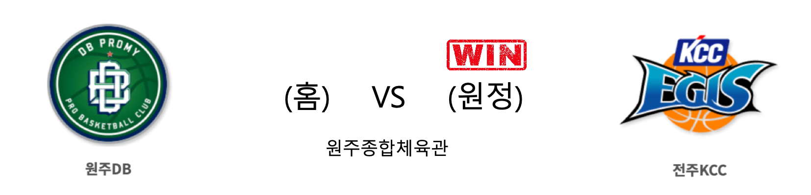

####  인천전자랜드(홈) VS 서울SK(원정) 

<table class="tg">
  <tr>
    <th class="tg-rr9t">인천전자랜드</th>
    <th class="tg-rr9t">팀</th>
    <th class="tg-rr9t">서울SK</th>
  </tr>
  <tr>
    <td class="tg-dcpn">0승 3패</td>
    <td class="tg-rr9t">시즌 상대전적</td>
    <td class="tg-dcpn">3승 0패</td>
  </tr>
  <tr>
    <td class="tg-dcpn">73</td>
    <td class="tg-rr9t">점수</td>
    <td class="tg-dcpn">80</td>
  </tr>
  <tr>
    <td class="tg-dcpn">21/39(54%)</td>
    <td class="tg-rr9t">2점(%)</td>
    <td class="tg-dcpn">27/47(57%)</td>
  </tr>
  <tr>
    <td class="tg-dcpn">9/30(30%)</td>
    <td class="tg-rr9t">3점(%)</td>
    <td class="tg-dcpn">6/20(30%)</td>
  </tr>
  <tr>
    <td class="tg-dcpn">4/5(80%)</td>
    <td class="tg-rr9t">자유투(%)</td>
    <td class="tg-dcpn">8/11(73%)</td>
  </tr>
  <tr>
    <td class="tg-dcpn">32</td>
    <td class="tg-rr9t">리바운드</td>
    <td class="tg-dcpn">37</td>
  </tr>
  <tr>
    <td class="tg-dcpn">5</td>
    <td class="tg-rr9t">어시스트</td>
    <td class="tg-dcpn">3</td>
  </tr>
  <tr>
    <td class="tg-dcpn">12</td>
    <td class="tg-rr9t">스틸</td>
    <td class="tg-dcpn">12</td>
  </tr>
  <tr>
    <td class="tg-dcpn">8</td>
    <td class="tg-rr9t">블록</td>
    <td class="tg-dcpn">8</td>
  </tr>
  <tr>
    <td class="tg-dcpn">12</td>
    <td class="tg-rr9t">턴오버</td>
    <td class="tg-dcpn">16</td>
  </tr>
  <tr>
    <td class="tg-dcpn">트로이 길렌워터(16) 머피 할로웨이(19) 김낙현(16)</td>
    <td class="tg-rr9t">주요 득점선수</td>
    <td class="tg-dcpn">안영준(15) 자밀 워니(28)</td>
  </tr>
</table>

#### 경기 관련 주요 기사         

[[포토] 전자랜드, SK에게 아쉬운 패배](http://sports.chosun.com/news/ntype.htm?id=201912070100052370003316&servicedate=20191207)

[[JB포토화보] 서울 SK, 전자랜드를 80-73으로 승리!](http://sports.news.naver.com/basketball/news/read.nhn?oid=065&aid=0000193597)

[선두 SK, 전자랜드 꺾고 2연승…돌아온 길렌워터는 16점(종합)](http://yna.kr/AKR20191207042951007?did=1195m)

['워니·안영준 활약쇼' SK, 전자랜드 꺾고 2연승](http://www.dailysportshankook.co.kr/news/articleView.html?idxno=217110)

        
        

####  원주DB(홈) VS 전주KCC(원정) 

<table class="tg">
  <tr>
    <th class="tg-rr9t">원주DB</th>
    <th class="tg-rr9t">팀</th>
    <th class="tg-rr9t">전주KCC</th>
  </tr>
  <tr>
    <td class="tg-dcpn">2승 1패</td>
    <td class="tg-rr9t">시즌 상대전적</td>
    <td class="tg-dcpn">1승 2패</td>
  </tr>
  <tr>
    <td class="tg-dcpn">63</td>
    <td class="tg-rr9t">점수</td>
    <td class="tg-dcpn">66</td>
  </tr>
  <tr>
    <td class="tg-dcpn">16/48(33%)</td>
    <td class="tg-rr9t">2점(%)</td>
    <td class="tg-dcpn">20/43(47%)</td>
  </tr>
  <tr>
    <td class="tg-dcpn">7/21(33%)</td>
    <td class="tg-rr9t">3점(%)</td>
    <td class="tg-dcpn">6/28(21%)</td>
  </tr>
  <tr>
    <td class="tg-dcpn">10/18(56%)</td>
    <td class="tg-rr9t">자유투(%)</td>
    <td class="tg-dcpn">8/10(80%)</td>
  </tr>
  <tr>
    <td class="tg-dcpn">47</td>
    <td class="tg-rr9t">리바운드</td>
    <td class="tg-dcpn">36</td>
  </tr>
  <tr>
    <td class="tg-dcpn">4</td>
    <td class="tg-rr9t">어시스트</td>
    <td class="tg-dcpn">3</td>
  </tr>
  <tr>
    <td class="tg-dcpn">19</td>
    <td class="tg-rr9t">스틸</td>
    <td class="tg-dcpn">14</td>
  </tr>
  <tr>
    <td class="tg-dcpn">9</td>
    <td class="tg-rr9t">블록</td>
    <td class="tg-dcpn">12</td>
  </tr>
  <tr>
    <td class="tg-dcpn">15</td>
    <td class="tg-rr9t">턴오버</td>
    <td class="tg-dcpn">17</td>
  </tr>
  <tr>
    <td class="tg-dcpn">치나누 오누아쿠(16)</td>
    <td class="tg-rr9t">주요 득점선수</td>
    <td class="tg-dcpn">이정현(19)</td>
  </tr>
</table>

#### 경기 관련 주요 기사         

[[프로농구 화보] 전주KCC, 66-63으로 원주DB 꺾어](http://news1.kr/articles/?3787740)

['워니 28P 12R' SK, 전자랜드에 80-73 승리…KCC는 DB 꺾고 3연패 탈출](http://stoo.asiae.co.kr/article.php?aid=60275515240)

[KCC, DB 꺾고 3연패 탈출…시즌 첫 전 구단 상대 승리(종합)](http://www.newsis.com/view/?id=NISX20191207_0000853392&cID=10505&pID=10500)

['Ace of Ace' 이정현 앞세운 KCC, DB 꺾고 3연패 탈출…첫 전 구단 상대 승리](http://sports.news.naver.com/basketball/news/read.nhn?oid=065&aid=0000193591)

        
        

####  고양오리온(홈) VS 창원LG(원정) 

<table class="tg">
  <tr>
    <th class="tg-rr9t">고양오리온</th>
    <th class="tg-rr9t">팀</th>
    <th class="tg-rr9t">창원LG</th>
  </tr>
  <tr>
    <td class="tg-dcpn">2승 1패</td>
    <td class="tg-rr9t">시즌 상대전적</td>
    <td class="tg-dcpn">1승 2패</td>
  </tr>
  <tr>
    <td class="tg-dcpn">72</td>
    <td class="tg-rr9t">점수</td>
    <td class="tg-dcpn">64</td>
  </tr>
  <tr>
    <td class="tg-dcpn">22/38(58%)</td>
    <td class="tg-rr9t">2점(%)</td>
    <td class="tg-dcpn">21/37(57%)</td>
  </tr>
  <tr>
    <td class="tg-dcpn">5/17(29%)</td>
    <td class="tg-rr9t">3점(%)</td>
    <td class="tg-dcpn">6/25(24%)</td>
  </tr>
  <tr>
    <td class="tg-dcpn">13/19(68%)</td>
    <td class="tg-rr9t">자유투(%)</td>
    <td class="tg-dcpn">4/8(50%)</td>
  </tr>
  <tr>
    <td class="tg-dcpn">28</td>
    <td class="tg-rr9t">리바운드</td>
    <td class="tg-dcpn">24</td>
  </tr>
  <tr>
    <td class="tg-dcpn">1</td>
    <td class="tg-rr9t">어시스트</td>
    <td class="tg-dcpn">1</td>
  </tr>
  <tr>
    <td class="tg-dcpn">11</td>
    <td class="tg-rr9t">스틸</td>
    <td class="tg-dcpn">10</td>
  </tr>
  <tr>
    <td class="tg-dcpn">3</td>
    <td class="tg-rr9t">블록</td>
    <td class="tg-dcpn">7</td>
  </tr>
  <tr>
    <td class="tg-dcpn">19</td>
    <td class="tg-rr9t">턴오버</td>
    <td class="tg-dcpn">13</td>
  </tr>
  <tr>
    <td class="tg-dcpn">이승현(17)</td>
    <td class="tg-rr9t">주요 득점선수</td>
    <td class="tg-dcpn"></td>
  </tr>
</table>

#### 경기 관련 주요 기사         

['이승현 17득점' 오리온, 단두대 매치서 LG 꺾고 단독 9위](http://isplus.live.joins.com/news/article/aid.asp?aid=23245911)

[[JB포토화보] 고양 오리온, 홈에서 창원 LG에 72대 64로 승리](http://sports.news.naver.com/basketball/news/read.nhn?oid=065&aid=0000193589)

[오리온 `LG 꺾고 단독 9위` [MK포토]](http://mksports.co.kr/view/2019/1024259/)

[[BK Review] '10+득점 5명' 오리온, LG 격파하고 시즌 7승째 신고](http://www.basketkorea.com/news/articleView.html?idxno=190573)

        
        

#### 리그 순위

<table class="tg">
  <tr>
    <th class="tg-d14o">순위</th>
    <th class="tg-d14o">팀명</th>
    <th class="tg-d14o">경기수</th>
    <th class="tg-d14o">승</th>
    <th class="tg-d14o">패</th>
    <th class="tg-d14o">승차</th>
    <th class="tg-d14o">승률</th>
  </tr>
  
<tr>
    <td class="tg-50j8">1</td>
    <td class="tg-50j8">서울SK</td>
    <td class="tg-50j8">19</td>
    <td class="tg-50j8">14</td>
    <td class="tg-50j8">5</td>
    <td class="tg-50j8">0</td>
    <td class="tg-50j8">0.737</td>
</tr>

<tr>
    <td class="tg-50j8">2</td>
    <td class="tg-50j8">원주DB</td>
    <td class="tg-50j8">19</td>
    <td class="tg-50j8">11</td>
    <td class="tg-50j8">8</td>
    <td class="tg-50j8">3</td>
    <td class="tg-50j8">0.579</td>
</tr>

<tr>
    <td class="tg-50j8">2</td>
    <td class="tg-50j8">안양KGC</td>
    <td class="tg-50j8">19</td>
    <td class="tg-50j8">11</td>
    <td class="tg-50j8">8</td>
    <td class="tg-50j8">3</td>
    <td class="tg-50j8">0.579</td>
</tr>

<tr>
    <td class="tg-50j8">4</td>
    <td class="tg-50j8">전주KCC</td>
    <td class="tg-50j8">19</td>
    <td class="tg-50j8">10</td>
    <td class="tg-50j8">9</td>
    <td class="tg-50j8">4</td>
    <td class="tg-50j8">0.526</td>
</tr>

<tr>
    <td class="tg-50j8">4</td>
    <td class="tg-50j8">부산KT</td>
    <td class="tg-50j8">19</td>
    <td class="tg-50j8">10</td>
    <td class="tg-50j8">9</td>
    <td class="tg-50j8">4</td>
    <td class="tg-50j8">0.526</td>
</tr>

<tr>
    <td class="tg-50j8">4</td>
    <td class="tg-50j8">인천전자랜드</td>
    <td class="tg-50j8">19</td>
    <td class="tg-50j8">10</td>
    <td class="tg-50j8">9</td>
    <td class="tg-50j8">4</td>
    <td class="tg-50j8">0.526</td>
</tr>

<tr>
    <td class="tg-50j8">7</td>
    <td class="tg-50j8">울산현대모비스</td>
    <td class="tg-50j8">19</td>
    <td class="tg-50j8">8</td>
    <td class="tg-50j8">11</td>
    <td class="tg-50j8">6</td>
    <td class="tg-50j8">0.421</td>
</tr>

<tr>
    <td class="tg-50j8">7</td>
    <td class="tg-50j8">서울삼성</td>
    <td class="tg-50j8">19</td>
    <td class="tg-50j8">8</td>
    <td class="tg-50j8">11</td>
    <td class="tg-50j8">6</td>
    <td class="tg-50j8">0.421</td>
</tr>

<tr>
    <td class="tg-50j8">9</td>
    <td class="tg-50j8">고양오리온</td>
    <td class="tg-50j8">19</td>
    <td class="tg-50j8">7</td>
    <td class="tg-50j8">12</td>
    <td class="tg-50j8">7</td>
    <td class="tg-50j8">0.368</td>
</tr>

<tr>
    <td class="tg-50j8">10</td>
    <td class="tg-50j8">창원LG</td>
    <td class="tg-50j8">19</td>
    <td class="tg-50j8">6</td>
    <td class="tg-50j8">13</td>
    <td class="tg-50j8">8</td>
    <td class="tg-50j8">0.316</td>
</tr>
</table> 

        
        
#kbl #국내농구 #농구분석 #토토 #스포츠토토 #경기예측 #농구결과 #20191207 #인천전자랜드 #서울SK #원주DB #전주KCC #고양오리온 #창원LG #인천전자랜드서울SK #원주DB전주KCC #고양오리온창원LG 