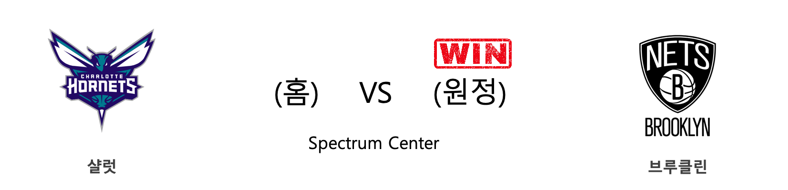
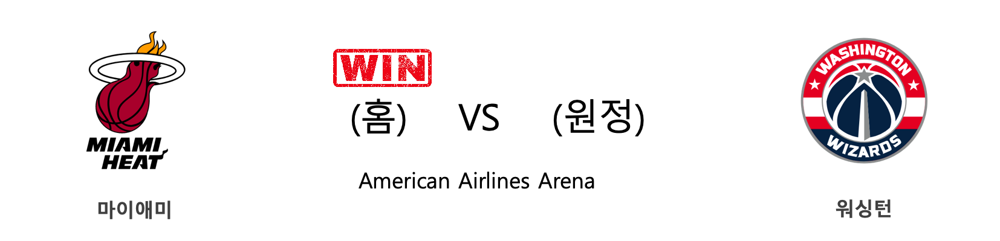

####  오클라호마씨티(홈) VS 미네소타(원정) 

<table class="tg">
  <tr>
    <th class="tg-rr9t">OKC</th>
    <th class="tg-rr9t">팀</th>
    <th class="tg-rr9t">MIN</th>
  </tr>
  <tr>
    <td class="tg-dcpn">1승 0패</td>
    <td class="tg-rr9t">시즌 상대전적</td>
    <td class="tg-dcpn">0승 1패</td>
  </tr>
  <tr>
    <td class="tg-dcpn">139</td>
    <td class="tg-rr9t">점수</td>
    <td class="tg-dcpn">127</td>
  </tr>
  <tr>
    <td class="tg-dcpn">44/70(63%)</td>
    <td class="tg-rr9t">2점(%)</td>
    <td class="tg-dcpn">37/58(64%)</td>
  </tr>
  <tr>
    <td class="tg-dcpn">5/18(28%)</td>
    <td class="tg-rr9t">3점(%)</td>
    <td class="tg-dcpn">13/38(34%)</td>
  </tr>
  <tr>
    <td class="tg-dcpn">36/40(90%)</td>
    <td class="tg-rr9t">자유투(%)</td>
    <td class="tg-dcpn">14/20(70%)</td>
  </tr>
  <tr>
    <td class="tg-dcpn">39</td>
    <td class="tg-rr9t">리바운드</td>
    <td class="tg-dcpn">36</td>
  </tr>
  <tr>
    <td class="tg-dcpn">19</td>
    <td class="tg-rr9t">어시스트</td>
    <td class="tg-dcpn">25</td>
  </tr>
  <tr>
    <td class="tg-dcpn">8</td>
    <td class="tg-rr9t">스틸</td>
    <td class="tg-dcpn">8</td>
  </tr>
  <tr>
    <td class="tg-dcpn">9</td>
    <td class="tg-rr9t">블록</td>
    <td class="tg-dcpn">2</td>
  </tr>
  <tr>
    <td class="tg-dcpn">10</td>
    <td class="tg-rr9t">턴오버</td>
    <td class="tg-dcpn">13</td>
  </tr>
  <tr>
    <td class="tg-dcpn">ChrisPaulG(30) DaniloGallina(21) ShaiGilgeous-(29) DennisSchrode(25) StevenAdamsC(22)</td>
    <td class="tg-rr9t">주요 득점선수</td>
    <td class="tg-dcpn">RobertCovingt(15) Karl-AnthonyT(30) JeffTeagueG(32)</td>
  </tr>
</table>

#### 경기 관련 주요 기사         

[[오늘의 NBA] (12/5) 밀워키, 시스템 농구 정점에 도달하다](http://sports.news.naver.com/basketball/news/read.nhn?oid=486&aid=0000001157)

[[오늘의 NBA] (12/7) 르브론 제임스, 멜로(carmelo) 드라마의 주인공](http://sports.news.naver.com/basketball/news/read.nhn?oid=486&aid=0000001159)

[[오늘의 NBA] (11/26) 마크 가솔, 조엘 엠비드의 영원한 악몽](http://sports.news.naver.com/basketball/news/read.nhn?oid=486&aid=0000001149)

[[오늘의 NBA] (12/2) 토론토, 두 마리 토끼를 노린다!](http://sports.news.naver.com/basketball/news/read.nhn?oid=486&aid=0000001154)

[[오늘의 NBA] (11/28) 앤써니 데이비스, 노란 셔츠를 입은 사나이](http://sports.news.naver.com/basketball/news/read.nhn?oid=486&aid=0000001151)

        
        

####  클리블랜드(홈) VS 올랜도(원정) 

<table class="tg">
  <tr>
    <th class="tg-rr9t">CLE</th>
    <th class="tg-rr9t">팀</th>
    <th class="tg-rr9t">ORL</th>
  </tr>
  <tr>
    <td class="tg-dcpn">0승 3패</td>
    <td class="tg-rr9t">시즌 상대전적</td>
    <td class="tg-dcpn">3승 0패</td>
  </tr>
  <tr>
    <td class="tg-dcpn">87</td>
    <td class="tg-rr9t">점수</td>
    <td class="tg-dcpn">93</td>
  </tr>
  <tr>
    <td class="tg-dcpn">25/49(51%)</td>
    <td class="tg-rr9t">2점(%)</td>
    <td class="tg-dcpn">23/56(41%)</td>
  </tr>
  <tr>
    <td class="tg-dcpn">10/34(29%)</td>
    <td class="tg-rr9t">3점(%)</td>
    <td class="tg-dcpn">9/26(35%)</td>
  </tr>
  <tr>
    <td class="tg-dcpn">7/10(70%)</td>
    <td class="tg-rr9t">자유투(%)</td>
    <td class="tg-dcpn">20/23(87%)</td>
  </tr>
  <tr>
    <td class="tg-dcpn">45</td>
    <td class="tg-rr9t">리바운드</td>
    <td class="tg-dcpn">43</td>
  </tr>
  <tr>
    <td class="tg-dcpn">22</td>
    <td class="tg-rr9t">어시스트</td>
    <td class="tg-dcpn">19</td>
  </tr>
  <tr>
    <td class="tg-dcpn">9</td>
    <td class="tg-rr9t">스틸</td>
    <td class="tg-dcpn">10</td>
  </tr>
  <tr>
    <td class="tg-dcpn">7</td>
    <td class="tg-rr9t">블록</td>
    <td class="tg-dcpn">9</td>
  </tr>
  <tr>
    <td class="tg-dcpn">16</td>
    <td class="tg-rr9t">턴오버</td>
    <td class="tg-dcpn">17</td>
  </tr>
  <tr>
    <td class="tg-dcpn">CollinSextonG(19)</td>
    <td class="tg-rr9t">주요 득점선수</td>
    <td class="tg-dcpn">TerrenceRoss(21) EvanFournierG(18)</td>
  </tr>
</table>

#### 경기 관련 주요 기사         

[[오늘의 NBA] (11/28) 앤써니 데이비스, 노란 셔츠를 입은 사나이](http://sports.news.naver.com/basketball/news/read.nhn?oid=486&aid=0000001151)

[[오늘의 NBA] (11/25) 댈러스, 공격이 승리를 부른다!](http://sports.news.naver.com/basketball/news/read.nhn?oid=486&aid=0000001148)

[[오늘의 NBA] (12/4) 샌안토니오, 괄육취골 승리를 거두다](http://sports.news.naver.com/basketball/news/read.nhn?oid=486&aid=0000001156)

[[오늘의 NBA] (11/6) 트레이 영, 애틀랜타의 특급 유망주](http://sports.news.naver.com/basketball/news/read.nhn?oid=486&aid=0000001129)

[[오늘의 NBA] (11/26) 마크 가솔, 조엘 엠비드의 영원한 악몽](http://sports.news.naver.com/basketball/news/read.nhn?oid=486&aid=0000001149)

        
        

####  시카고(홈) VS 골든스테이트(원정) 

<table class="tg">
  <tr>
    <th class="tg-rr9t">CHI</th>
    <th class="tg-rr9t">팀</th>
    <th class="tg-rr9t">GSW</th>
  </tr>
  <tr>
    <td class="tg-dcpn">0승 2패</td>
    <td class="tg-rr9t">시즌 상대전적</td>
    <td class="tg-dcpn">2승 0패</td>
  </tr>
  <tr>
    <td class="tg-dcpn">98</td>
    <td class="tg-rr9t">점수</td>
    <td class="tg-dcpn">100</td>
  </tr>
  <tr>
    <td class="tg-dcpn">22/47(47%)</td>
    <td class="tg-rr9t">2점(%)</td>
    <td class="tg-dcpn">29/47(62%)</td>
  </tr>
  <tr>
    <td class="tg-dcpn">17/41(41%)</td>
    <td class="tg-rr9t">3점(%)</td>
    <td class="tg-dcpn">9/24(38%)</td>
  </tr>
  <tr>
    <td class="tg-dcpn">3/5(60%)</td>
    <td class="tg-rr9t">자유투(%)</td>
    <td class="tg-dcpn">15/22(68%)</td>
  </tr>
  <tr>
    <td class="tg-dcpn">37</td>
    <td class="tg-rr9t">리바운드</td>
    <td class="tg-dcpn">39</td>
  </tr>
  <tr>
    <td class="tg-dcpn">21</td>
    <td class="tg-rr9t">어시스트</td>
    <td class="tg-dcpn">24</td>
  </tr>
  <tr>
    <td class="tg-dcpn">11</td>
    <td class="tg-rr9t">스틸</td>
    <td class="tg-dcpn">9</td>
  </tr>
  <tr>
    <td class="tg-dcpn">2</td>
    <td class="tg-rr9t">블록</td>
    <td class="tg-dcpn">4</td>
  </tr>
  <tr>
    <td class="tg-dcpn">14</td>
    <td class="tg-rr9t">턴오버</td>
    <td class="tg-dcpn">19</td>
  </tr>
  <tr>
    <td class="tg-dcpn">ZachLaVineG(22) LauriMarkkane(20)</td>
    <td class="tg-rr9t">주요 득점선수</td>
    <td class="tg-dcpn">GlennRobinson(20)</td>
  </tr>
</table>

#### 경기 관련 주요 기사         

[[오늘의 NBA] (12/7) 르브론 제임스, 멜로(carmelo) 드라마의 주인공](http://sports.news.naver.com/basketball/news/read.nhn?oid=486&aid=0000001159)

[[오늘의 NBA] (11/30) 인디애나, 동부컨퍼런스의 복병](http://sports.news.naver.com/basketball/news/read.nhn?oid=486&aid=0000001152)

[[오늘의 NBA] (11/24) 잭 라빈, GSW 스플래쉬 브라더스를 소환하다](http://sports.news.naver.com/basketball/news/read.nhn?oid=486&aid=0000001147)

[[오늘의 NBA] (11/28) 앤써니 데이비스, 노란 셔츠를 입은 사나이](http://sports.news.naver.com/basketball/news/read.nhn?oid=486&aid=0000001151)

[[오늘의 NBA] (12/5) 밀워키, 시스템 농구 정점에 도달하다](http://sports.news.naver.com/basketball/news/read.nhn?oid=486&aid=0000001157)

        
        

####  샬럿(홈) VS 브루클린(원정) 

<table class="tg">
  <tr>
    <th class="tg-rr9t">CHA</th>
    <th class="tg-rr9t">팀</th>
    <th class="tg-rr9t">BKN</th>
  </tr>
  <tr>
    <td class="tg-dcpn">0승 2패</td>
    <td class="tg-rr9t">시즌 상대전적</td>
    <td class="tg-dcpn">2승 0패</td>
  </tr>
  <tr>
    <td class="tg-dcpn">104</td>
    <td class="tg-rr9t">점수</td>
    <td class="tg-dcpn">111</td>
  </tr>
  <tr>
    <td class="tg-dcpn">19/43(44%)</td>
    <td class="tg-rr9t">2점(%)</td>
    <td class="tg-dcpn">27/50(54%)</td>
  </tr>
  <tr>
    <td class="tg-dcpn">17/40(42%)</td>
    <td class="tg-rr9t">3점(%)</td>
    <td class="tg-dcpn">15/38(39%)</td>
  </tr>
  <tr>
    <td class="tg-dcpn">15/17(88%)</td>
    <td class="tg-rr9t">자유투(%)</td>
    <td class="tg-dcpn">12/15(80%)</td>
  </tr>
  <tr>
    <td class="tg-dcpn">34</td>
    <td class="tg-rr9t">리바운드</td>
    <td class="tg-dcpn">49</td>
  </tr>
  <tr>
    <td class="tg-dcpn">23</td>
    <td class="tg-rr9t">어시스트</td>
    <td class="tg-dcpn">35</td>
  </tr>
  <tr>
    <td class="tg-dcpn">6</td>
    <td class="tg-rr9t">스틸</td>
    <td class="tg-dcpn">12</td>
  </tr>
  <tr>
    <td class="tg-dcpn">6</td>
    <td class="tg-rr9t">블록</td>
    <td class="tg-dcpn">5</td>
  </tr>
  <tr>
    <td class="tg-dcpn">19</td>
    <td class="tg-rr9t">턴오버</td>
    <td class="tg-dcpn">16</td>
  </tr>
  <tr>
    <td class="tg-dcpn">Devonte'Graha(29) TerryRozierG(24) CodyZeller(17)</td>
    <td class="tg-rr9t">주요 득점선수</td>
    <td class="tg-dcpn">JoeHarrisF(22) TaureanPrince(16) DeAndreJordan(16)</td>
  </tr>
</table>

#### 경기 관련 주요 기사         

[[오늘의 NBA] (11/30) 인디애나, 동부컨퍼런스의 복병](http://sports.news.naver.com/basketball/news/read.nhn?oid=486&aid=0000001152)

[[오늘의 NBA] (11/28) 앤써니 데이비스, 노란 셔츠를 입은 사나이](http://sports.news.naver.com/basketball/news/read.nhn?oid=486&aid=0000001151)

[[오늘의 NBA] (12/2) 토론토, 두 마리 토끼를 노린다!](http://sports.news.naver.com/basketball/news/read.nhn?oid=486&aid=0000001154)

[[오늘의 NBA] (12/7) 르브론 제임스, 멜로(carmelo) 드라마의 주인공](http://sports.news.naver.com/basketball/news/read.nhn?oid=486&aid=0000001159)

[[오늘의 NBA] (12/3) 켈리 우브레 주니어, 피닉스의 터프가이](http://sports.news.naver.com/basketball/news/read.nhn?oid=486&aid=0000001155)

        
        

####  샌안토니오(홈) VS 새크라멘토(원정) 

<table class="tg">
  <tr>
    <th class="tg-rr9t">SAS</th>
    <th class="tg-rr9t">팀</th>
    <th class="tg-rr9t">SAC</th>
  </tr>
  <tr>
    <td class="tg-dcpn">1승 0패</td>
    <td class="tg-rr9t">시즌 상대전적</td>
    <td class="tg-dcpn">0승 1패</td>
  </tr>
  <tr>
    <td class="tg-dcpn">105</td>
    <td class="tg-rr9t">점수</td>
    <td class="tg-dcpn">104</td>
  </tr>
  <tr>
    <td class="tg-dcpn">30/64(47%)</td>
    <td class="tg-rr9t">2점(%)</td>
    <td class="tg-dcpn">31/68(46%)</td>
  </tr>
  <tr>
    <td class="tg-dcpn">11/32(34%)</td>
    <td class="tg-rr9t">3점(%)</td>
    <td class="tg-dcpn">9/34(26%)</td>
  </tr>
  <tr>
    <td class="tg-dcpn">12/17(71%)</td>
    <td class="tg-rr9t">자유투(%)</td>
    <td class="tg-dcpn">15/18(83%)</td>
  </tr>
  <tr>
    <td class="tg-dcpn">52</td>
    <td class="tg-rr9t">리바운드</td>
    <td class="tg-dcpn">52</td>
  </tr>
  <tr>
    <td class="tg-dcpn">25</td>
    <td class="tg-rr9t">어시스트</td>
    <td class="tg-dcpn">19</td>
  </tr>
  <tr>
    <td class="tg-dcpn">10</td>
    <td class="tg-rr9t">스틸</td>
    <td class="tg-dcpn">10</td>
  </tr>
  <tr>
    <td class="tg-dcpn">5</td>
    <td class="tg-rr9t">블록</td>
    <td class="tg-dcpn">3</td>
  </tr>
  <tr>
    <td class="tg-dcpn">17</td>
    <td class="tg-rr9t">턴오버</td>
    <td class="tg-dcpn">14</td>
  </tr>
  <tr>
    <td class="tg-dcpn">DeMarDeRozanF(15) LaMarcusAldri(19)</td>
    <td class="tg-rr9t">주요 득점선수</td>
    <td class="tg-dcpn">YogiFerrell(17) HarrisonBarne(21) BuddyHieldG(23)</td>
  </tr>
</table>

#### 경기 관련 주요 기사         

[[오늘의 NBA] (12/4) 샌안토니오, 괄육취골 승리를 거두다](http://sports.news.naver.com/basketball/news/read.nhn?oid=486&aid=0000001156)

[[오늘의 NBA] (11/4) 마이애미의 대권 도전 행보](http://sports.news.naver.com/basketball/news/read.nhn?oid=486&aid=0000001127)

[[오늘의 NBA] (12/7) 르브론 제임스, 멜로(carmelo) 드라마의 주인공](http://sports.news.naver.com/basketball/news/read.nhn?oid=486&aid=0000001159)

[[오늘의 NBA] (11/23) 카와이 레너드, 승부를 결정짓는 사나이](http://sports.news.naver.com/basketball/news/read.nhn?oid=486&aid=0000001146)

[[오늘의 NBA] (11/30) 인디애나, 동부컨퍼런스의 복병](http://sports.news.naver.com/basketball/news/read.nhn?oid=486&aid=0000001152)

        
        

####  보스턴(홈) VS 덴버(원정) 

<table class="tg">
  <tr>
    <th class="tg-rr9t">BOS</th>
    <th class="tg-rr9t">팀</th>
    <th class="tg-rr9t">DEN</th>
  </tr>
  <tr>
    <td class="tg-dcpn">1승 1패</td>
    <td class="tg-rr9t">시즌 상대전적</td>
    <td class="tg-dcpn">1승 1패</td>
  </tr>
  <tr>
    <td class="tg-dcpn">108</td>
    <td class="tg-rr9t">점수</td>
    <td class="tg-dcpn">95</td>
  </tr>
  <tr>
    <td class="tg-dcpn">31/47(66%)</td>
    <td class="tg-rr9t">2점(%)</td>
    <td class="tg-dcpn">34/64(53%)</td>
  </tr>
  <tr>
    <td class="tg-dcpn">13/35(37%)</td>
    <td class="tg-rr9t">3점(%)</td>
    <td class="tg-dcpn">5/30(17%)</td>
  </tr>
  <tr>
    <td class="tg-dcpn">7/8(88%)</td>
    <td class="tg-rr9t">자유투(%)</td>
    <td class="tg-dcpn">12/15(80%)</td>
  </tr>
  <tr>
    <td class="tg-dcpn">37</td>
    <td class="tg-rr9t">리바운드</td>
    <td class="tg-dcpn">41</td>
  </tr>
  <tr>
    <td class="tg-dcpn">21</td>
    <td class="tg-rr9t">어시스트</td>
    <td class="tg-dcpn">18</td>
  </tr>
  <tr>
    <td class="tg-dcpn">5</td>
    <td class="tg-rr9t">스틸</td>
    <td class="tg-dcpn">5</td>
  </tr>
  <tr>
    <td class="tg-dcpn">5</td>
    <td class="tg-rr9t">블록</td>
    <td class="tg-dcpn">4</td>
  </tr>
  <tr>
    <td class="tg-dcpn">15</td>
    <td class="tg-rr9t">턴오버</td>
    <td class="tg-dcpn">12</td>
  </tr>
  <tr>
    <td class="tg-dcpn">KembaWalkerG(19) JaysonTatumF(26) JaylenBrownF(21)</td>
    <td class="tg-rr9t">주요 득점선수</td>
    <td class="tg-dcpn">NikolaJokicC(30)</td>
  </tr>
</table>

#### 경기 관련 주요 기사         

[[오늘의 NBA] (11/26) 마크 가솔, 조엘 엠비드의 영원한 악몽](http://sports.news.naver.com/basketball/news/read.nhn?oid=486&aid=0000001149)

[[오늘의 NBA] (12/6) 마이크 댄토니, 토론토 수비를 농락하다](http://sports.news.naver.com/basketball/news/read.nhn?oid=486&aid=0000001158)

[[오늘의 NBA] (11/28) 앤써니 데이비스, 노란 셔츠를 입은 사나이](http://sports.news.naver.com/basketball/news/read.nhn?oid=486&aid=0000001151)

[[오늘의 NBA] (12/2) 토론토, 두 마리 토끼를 노린다!](http://sports.news.naver.com/basketball/news/read.nhn?oid=486&aid=0000001154)

[[오늘의 NBA] (12/7) 르브론 제임스, 멜로(carmelo) 드라마의 주인공](http://sports.news.naver.com/basketball/news/read.nhn?oid=486&aid=0000001159)

        
        

####  디트로이트(홈) VS 인디애나(원정) 

<table class="tg">
  <tr>
    <th class="tg-rr9t">DET</th>
    <th class="tg-rr9t">팀</th>
    <th class="tg-rr9t">IND</th>
  </tr>
  <tr>
    <td class="tg-dcpn">3승 1패</td>
    <td class="tg-rr9t">시즌 상대전적</td>
    <td class="tg-dcpn">1승 3패</td>
  </tr>
  <tr>
    <td class="tg-dcpn">108</td>
    <td class="tg-rr9t">점수</td>
    <td class="tg-dcpn">101</td>
  </tr>
  <tr>
    <td class="tg-dcpn">28/62(45%)</td>
    <td class="tg-rr9t">2점(%)</td>
    <td class="tg-dcpn">29/59(49%)</td>
  </tr>
  <tr>
    <td class="tg-dcpn">11/25(44%)</td>
    <td class="tg-rr9t">3점(%)</td>
    <td class="tg-dcpn">9/24(38%)</td>
  </tr>
  <tr>
    <td class="tg-dcpn">19/26(73%)</td>
    <td class="tg-rr9t">자유투(%)</td>
    <td class="tg-dcpn">16/20(80%)</td>
  </tr>
  <tr>
    <td class="tg-dcpn">51</td>
    <td class="tg-rr9t">리바운드</td>
    <td class="tg-dcpn">33</td>
  </tr>
  <tr>
    <td class="tg-dcpn">21</td>
    <td class="tg-rr9t">어시스트</td>
    <td class="tg-dcpn">24</td>
  </tr>
  <tr>
    <td class="tg-dcpn">7</td>
    <td class="tg-rr9t">스틸</td>
    <td class="tg-dcpn">8</td>
  </tr>
  <tr>
    <td class="tg-dcpn">5</td>
    <td class="tg-rr9t">블록</td>
    <td class="tg-dcpn">9</td>
  </tr>
  <tr>
    <td class="tg-dcpn">17</td>
    <td class="tg-rr9t">턴오버</td>
    <td class="tg-dcpn">11</td>
  </tr>
  <tr>
    <td class="tg-dcpn">LukeKennardG(15) BlakeGriffinF(25) AndreDrummond(25)</td>
    <td class="tg-rr9t">주요 득점선수</td>
    <td class="tg-dcpn">T.J.WarrenF(26) DomantasSabon(18) MalcolmBrogdo(21)</td>
  </tr>
</table>

#### 경기 관련 주요 기사         

[[오늘의 NBA] (12/5) 밀워키, 시스템 농구 정점에 도달하다](http://sports.news.naver.com/basketball/news/read.nhn?oid=486&aid=0000001157)

[[오늘의 NBA] (11/30) 인디애나, 동부컨퍼런스의 복병](http://sports.news.naver.com/basketball/news/read.nhn?oid=486&aid=0000001152)

[[오늘의 NBA] (11/28) 앤써니 데이비스, 노란 셔츠를 입은 사나이](http://sports.news.naver.com/basketball/news/read.nhn?oid=486&aid=0000001151)

[[오늘의 NBA] (10/25) 밀워키의 털보 사냥](http://sports.news.naver.com/basketball/news/read.nhn?oid=486&aid=0000001117)

[[오늘의 NBA] (12/7) 르브론 제임스, 멜로(carmelo) 드라마의 주인공](http://sports.news.naver.com/basketball/news/read.nhn?oid=486&aid=0000001159)

        
        

####  포틀랜드(홈) VS LA레이커스(원정) 

<table class="tg">
  <tr>
    <th class="tg-rr9t">POR</th>
    <th class="tg-rr9t">팀</th>
    <th class="tg-rr9t">LAL</th>
  </tr>
  <tr>
    <td class="tg-dcpn">0승 1패</td>
    <td class="tg-rr9t">시즌 상대전적</td>
    <td class="tg-dcpn">1승 0패</td>
  </tr>
  <tr>
    <td class="tg-dcpn">113</td>
    <td class="tg-rr9t">점수</td>
    <td class="tg-dcpn">136</td>
  </tr>
  <tr>
    <td class="tg-dcpn">29/52(56%)</td>
    <td class="tg-rr9t">2점(%)</td>
    <td class="tg-dcpn">29/49(59%)</td>
  </tr>
  <tr>
    <td class="tg-dcpn">10/34(29%)</td>
    <td class="tg-rr9t">3점(%)</td>
    <td class="tg-dcpn">17/36(47%)</td>
  </tr>
  <tr>
    <td class="tg-dcpn">25/29(86%)</td>
    <td class="tg-rr9t">자유투(%)</td>
    <td class="tg-dcpn">27/33(82%)</td>
  </tr>
  <tr>
    <td class="tg-dcpn">34</td>
    <td class="tg-rr9t">리바운드</td>
    <td class="tg-dcpn">45</td>
  </tr>
  <tr>
    <td class="tg-dcpn">20</td>
    <td class="tg-rr9t">어시스트</td>
    <td class="tg-dcpn">26</td>
  </tr>
  <tr>
    <td class="tg-dcpn">9</td>
    <td class="tg-rr9t">스틸</td>
    <td class="tg-dcpn">10</td>
  </tr>
  <tr>
    <td class="tg-dcpn">4</td>
    <td class="tg-rr9t">블록</td>
    <td class="tg-dcpn">8</td>
  </tr>
  <tr>
    <td class="tg-dcpn">15</td>
    <td class="tg-rr9t">턴오버</td>
    <td class="tg-dcpn">16</td>
  </tr>
  <tr>
    <td class="tg-dcpn">HassanWhitesi(17) DamianLillard(29) CarmeloAnthon(15) AnferneeSimon(15) CJMcCollumG(15)</td>
    <td class="tg-rr9t">주요 득점선수</td>
    <td class="tg-dcpn">AnthonyDavisF(39) KyleKuzma(15) LeBronJamesF(31)</td>
  </tr>
</table>

#### 경기 관련 주요 기사         

[[오늘의 NBA] (11/7) 야니스 아테토쿤보의 MVP 수성 의지](http://sports.news.naver.com/basketball/news/read.nhn?oid=486&aid=0000001130)

[[오늘의 NBA] (11/26) 마크 가솔, 조엘 엠비드의 영원한 악몽](http://sports.news.naver.com/basketball/news/read.nhn?oid=486&aid=0000001149)

[[오늘의 NBA] (12/2) 토론토, 두 마리 토끼를 노린다!](http://sports.news.naver.com/basketball/news/read.nhn?oid=486&aid=0000001154)

[[오늘의 NBA] (11/28) 앤써니 데이비스, 노란 셔츠를 입은 사나이](http://sports.news.naver.com/basketball/news/read.nhn?oid=486&aid=0000001151)

[[오늘의 NBA] (11/30) 인디애나, 동부컨퍼런스의 복병](http://sports.news.naver.com/basketball/news/read.nhn?oid=486&aid=0000001152)

        
        

####  밀워키(홈) VS LA클리퍼스(원정) 

<table class="tg">
  <tr>
    <th class="tg-rr9t">MIL</th>
    <th class="tg-rr9t">팀</th>
    <th class="tg-rr9t">LAC</th>
  </tr>
  <tr>
    <td class="tg-dcpn">2승 0패</td>
    <td class="tg-rr9t">시즌 상대전적</td>
    <td class="tg-dcpn">0승 2패</td>
  </tr>
  <tr>
    <td class="tg-dcpn">119</td>
    <td class="tg-rr9t">점수</td>
    <td class="tg-dcpn">91</td>
  </tr>
  <tr>
    <td class="tg-dcpn">30/58(52%)</td>
    <td class="tg-rr9t">2점(%)</td>
    <td class="tg-dcpn">25/62(40%)</td>
  </tr>
  <tr>
    <td class="tg-dcpn">14/36(39%)</td>
    <td class="tg-rr9t">3점(%)</td>
    <td class="tg-dcpn">8/32(25%)</td>
  </tr>
  <tr>
    <td class="tg-dcpn">17/21(81%)</td>
    <td class="tg-rr9t">자유투(%)</td>
    <td class="tg-dcpn">17/19(89%)</td>
  </tr>
  <tr>
    <td class="tg-dcpn">53</td>
    <td class="tg-rr9t">리바운드</td>
    <td class="tg-dcpn">48</td>
  </tr>
  <tr>
    <td class="tg-dcpn">29</td>
    <td class="tg-rr9t">어시스트</td>
    <td class="tg-dcpn">18</td>
  </tr>
  <tr>
    <td class="tg-dcpn">11</td>
    <td class="tg-rr9t">스틸</td>
    <td class="tg-dcpn">9</td>
  </tr>
  <tr>
    <td class="tg-dcpn">6</td>
    <td class="tg-rr9t">블록</td>
    <td class="tg-dcpn">4</td>
  </tr>
  <tr>
    <td class="tg-dcpn">15</td>
    <td class="tg-rr9t">턴오버</td>
    <td class="tg-dcpn">21</td>
  </tr>
  <tr>
    <td class="tg-dcpn">KhrisMiddleto(17) GiannisAnteto(27)</td>
    <td class="tg-rr9t">주요 득점선수</td>
    <td class="tg-dcpn">KawhiLeonardF(17)</td>
  </tr>
</table>

#### 경기 관련 주요 기사         

[[오늘의 NBA] (11/25) 댈러스, 공격이 승리를 부른다!](http://sports.news.naver.com/basketball/news/read.nhn?oid=486&aid=0000001148)

[[오늘의 NBA] (12/5) 밀워키, 시스템 농구 정점에 도달하다](http://sports.news.naver.com/basketball/news/read.nhn?oid=486&aid=0000001157)

[[오늘의 NBA] (11/28) 앤써니 데이비스, 노란 셔츠를 입은 사나이](http://sports.news.naver.com/basketball/news/read.nhn?oid=486&aid=0000001151)

[[오늘의 NBA] (12/7) 르브론 제임스, 멜로(carmelo) 드라마의 주인공](http://sports.news.naver.com/basketball/news/read.nhn?oid=486&aid=0000001159)

[[오늘의 NBA] (11/26) 마크 가솔, 조엘 엠비드의 영원한 악몽](http://sports.news.naver.com/basketball/news/read.nhn?oid=486&aid=0000001149)

        
        

####  마이애미(홈) VS 워싱턴(원정) 

<table class="tg">
  <tr>
    <th class="tg-rr9t">MIA</th>
    <th class="tg-rr9t">팀</th>
    <th class="tg-rr9t">WAS</th>
  </tr>
  <tr>
    <td class="tg-dcpn">1승 0패</td>
    <td class="tg-rr9t">시즌 상대전적</td>
    <td class="tg-dcpn">0승 1패</td>
  </tr>
  <tr>
    <td class="tg-dcpn">112</td>
    <td class="tg-rr9t">점수</td>
    <td class="tg-dcpn">103</td>
  </tr>
  <tr>
    <td class="tg-dcpn">32/58(55%)</td>
    <td class="tg-rr9t">2점(%)</td>
    <td class="tg-dcpn">27/52(52%)</td>
  </tr>
  <tr>
    <td class="tg-dcpn">10/28(36%)</td>
    <td class="tg-rr9t">3점(%)</td>
    <td class="tg-dcpn">12/39(31%)</td>
  </tr>
  <tr>
    <td class="tg-dcpn">18/24(75%)</td>
    <td class="tg-rr9t">자유투(%)</td>
    <td class="tg-dcpn">13/14(93%)</td>
  </tr>
  <tr>
    <td class="tg-dcpn">50</td>
    <td class="tg-rr9t">리바운드</td>
    <td class="tg-dcpn">39</td>
  </tr>
  <tr>
    <td class="tg-dcpn">28</td>
    <td class="tg-rr9t">어시스트</td>
    <td class="tg-dcpn">29</td>
  </tr>
  <tr>
    <td class="tg-dcpn">6</td>
    <td class="tg-rr9t">스틸</td>
    <td class="tg-dcpn">6</td>
  </tr>
  <tr>
    <td class="tg-dcpn">7</td>
    <td class="tg-rr9t">블록</td>
    <td class="tg-dcpn">4</td>
  </tr>
  <tr>
    <td class="tg-dcpn">12</td>
    <td class="tg-rr9t">턴오버</td>
    <td class="tg-dcpn">11</td>
  </tr>
  <tr>
    <td class="tg-dcpn">TylerHerro(22) JimmyButlerF(28) BamAdebayoF(24)</td>
    <td class="tg-rr9t">주요 득점선수</td>
    <td class="tg-dcpn">IshSmithG(15) DavisBertans(19) BradleyBealG(23) MoritzWagnerC(19)</td>
  </tr>
</table>

#### 경기 관련 주요 기사         

[[오늘의 NBA] (12/4) 샌안토니오, 괄육취골 승리를 거두다](http://sports.news.naver.com/basketball/news/read.nhn?oid=486&aid=0000001156)

[[오늘의 NBA] (11/30) 인디애나, 동부컨퍼런스의 복병](http://sports.news.naver.com/basketball/news/read.nhn?oid=486&aid=0000001152)

[How an Abandoned Hotel Became a Witches’ Lair for ‘Suspiria’](https://www.nytimes.com/2018/10/23/t-magazine/suspiria-set-grand-hotel-campo-dei-fiori.html?partner=naver)

[Anna Sui, Fashion’s Favorite Daughter, Gets Her Day in the Sun](https://www.nytimes.com/2019/10/03/arts/design/anna-sui-museum-of-arts-and-design.html?partner=naver)

[Mia Love, Sole Black Republican Woman in Congress, Fights for Her Seat](https://www.nytimes.com/2018/10/04/us/mia-love-utah-republican-woman-congress-ben-mcadams.html?partner=naver)

        
        

#### 리그 (Eastern) 순위
    

<table class="tg">
  <tr>
    <th class="tg-d14o">순위</th>
    <th class="tg-d14o">팀명</th>
    <th class="tg-d14o">경기수</th>
    <th class="tg-d14o">승</th>
    <th class="tg-d14o">패</th>
    <th class="tg-d14o">승차</th>
    <th class="tg-d14o">승률</th>
  </tr>
  
<tr>
    <td class="tg-50j8">1</td>
    <td class="tg-50j8">MIL</td>
    <td class="tg-50j8">23</td>
    <td class="tg-50j8">20</td>
    <td class="tg-50j8">3</td>
    <td class="tg-50j8">0</td>
    <td class="tg-50j8">0.87</td>
</tr>

<tr>
    <td class="tg-50j8">2</td>
    <td class="tg-50j8">BOS</td>
    <td class="tg-50j8">21</td>
    <td class="tg-50j8">16</td>
    <td class="tg-50j8">5</td>
    <td class="tg-50j8">4</td>
    <td class="tg-50j8">0.762</td>
</tr>

<tr>
    <td class="tg-50j8">3</td>
    <td class="tg-50j8">MIA</td>
    <td class="tg-50j8">22</td>
    <td class="tg-50j8">16</td>
    <td class="tg-50j8">6</td>
    <td class="tg-50j8">4</td>
    <td class="tg-50j8">0.727</td>
</tr>

<tr>
    <td class="tg-50j8">4</td>
    <td class="tg-50j8">TOR</td>
    <td class="tg-50j8">21</td>
    <td class="tg-50j8">15</td>
    <td class="tg-50j8">6</td>
    <td class="tg-50j8">5</td>
    <td class="tg-50j8">0.714</td>
</tr>

<tr>
    <td class="tg-50j8">5</td>
    <td class="tg-50j8">PHI</td>
    <td class="tg-50j8">22</td>
    <td class="tg-50j8">15</td>
    <td class="tg-50j8">7</td>
    <td class="tg-50j8">5</td>
    <td class="tg-50j8">0.682</td>
</tr>

<tr>
    <td class="tg-50j8">6</td>
    <td class="tg-50j8">IND</td>
    <td class="tg-50j8">22</td>
    <td class="tg-50j8">14</td>
    <td class="tg-50j8">8</td>
    <td class="tg-50j8">6</td>
    <td class="tg-50j8">0.636</td>
</tr>

<tr>
    <td class="tg-50j8">7</td>
    <td class="tg-50j8">BKN</td>
    <td class="tg-50j8">22</td>
    <td class="tg-50j8">12</td>
    <td class="tg-50j8">10</td>
    <td class="tg-50j8">8</td>
    <td class="tg-50j8">0.545</td>
</tr>

<tr>
    <td class="tg-50j8">8</td>
    <td class="tg-50j8">ORL</td>
    <td class="tg-50j8">22</td>
    <td class="tg-50j8">11</td>
    <td class="tg-50j8">11</td>
    <td class="tg-50j8">9</td>
    <td class="tg-50j8">0.5</td>
</tr>

<tr>
    <td class="tg-50j8">9</td>
    <td class="tg-50j8">DET</td>
    <td class="tg-50j8">23</td>
    <td class="tg-50j8">9</td>
    <td class="tg-50j8">14</td>
    <td class="tg-50j8">11</td>
    <td class="tg-50j8">0.391</td>
</tr>

<tr>
    <td class="tg-50j8">10</td>
    <td class="tg-50j8">CHA</td>
    <td class="tg-50j8">24</td>
    <td class="tg-50j8">9</td>
    <td class="tg-50j8">15</td>
    <td class="tg-50j8">11</td>
    <td class="tg-50j8">0.375</td>
</tr>

<tr>
    <td class="tg-50j8">11</td>
    <td class="tg-50j8">CHI</td>
    <td class="tg-50j8">23</td>
    <td class="tg-50j8">8</td>
    <td class="tg-50j8">15</td>
    <td class="tg-50j8">12</td>
    <td class="tg-50j8">0.348</td>
</tr>

<tr>
    <td class="tg-50j8">12</td>
    <td class="tg-50j8">WAS</td>
    <td class="tg-50j8">21</td>
    <td class="tg-50j8">7</td>
    <td class="tg-50j8">14</td>
    <td class="tg-50j8">13</td>
    <td class="tg-50j8">0.333</td>
</tr>

<tr>
    <td class="tg-50j8">13</td>
    <td class="tg-50j8">CLE</td>
    <td class="tg-50j8">21</td>
    <td class="tg-50j8">5</td>
    <td class="tg-50j8">16</td>
    <td class="tg-50j8">15</td>
    <td class="tg-50j8">0.238</td>
</tr>

<tr>
    <td class="tg-50j8">14</td>
    <td class="tg-50j8">ATL</td>
    <td class="tg-50j8">22</td>
    <td class="tg-50j8">5</td>
    <td class="tg-50j8">17</td>
    <td class="tg-50j8">15</td>
    <td class="tg-50j8">0.227</td>
</tr>

<tr>
    <td class="tg-50j8">15</td>
    <td class="tg-50j8">NYK</td>
    <td class="tg-50j8">22</td>
    <td class="tg-50j8">4</td>
    <td class="tg-50j8">18</td>
    <td class="tg-50j8">16</td>
    <td class="tg-50j8">0.182</td>
</tr>
</table> 
#### 리그 (Western) 순위
    

<table class="tg">
  <tr>
    <th class="tg-d14o">순위</th>
    <th class="tg-d14o">팀명</th>
    <th class="tg-d14o">경기수</th>
    <th class="tg-d14o">승</th>
    <th class="tg-d14o">패</th>
    <th class="tg-d14o">승차</th>
    <th class="tg-d14o">승률</th>
  </tr>
  
<tr>
    <td class="tg-50j8">1</td>
    <td class="tg-50j8">LAL</td>
    <td class="tg-50j8">23</td>
    <td class="tg-50j8">20</td>
    <td class="tg-50j8">3</td>
    <td class="tg-50j8">0</td>
    <td class="tg-50j8">0.87</td>
</tr>

<tr>
    <td class="tg-50j8">2</td>
    <td class="tg-50j8">LAC</td>
    <td class="tg-50j8">23</td>
    <td class="tg-50j8">16</td>
    <td class="tg-50j8">7</td>
    <td class="tg-50j8">4</td>
    <td class="tg-50j8">0.696</td>
</tr>

<tr>
    <td class="tg-50j8">3</td>
    <td class="tg-50j8">DAL</td>
    <td class="tg-50j8">21</td>
    <td class="tg-50j8">15</td>
    <td class="tg-50j8">6</td>
    <td class="tg-50j8">5</td>
    <td class="tg-50j8">0.714</td>
</tr>

<tr>
    <td class="tg-50j8">4</td>
    <td class="tg-50j8">DEN</td>
    <td class="tg-50j8">20</td>
    <td class="tg-50j8">14</td>
    <td class="tg-50j8">6</td>
    <td class="tg-50j8">6</td>
    <td class="tg-50j8">0.7</td>
</tr>

<tr>
    <td class="tg-50j8">5</td>
    <td class="tg-50j8">HOU</td>
    <td class="tg-50j8">21</td>
    <td class="tg-50j8">14</td>
    <td class="tg-50j8">7</td>
    <td class="tg-50j8">6</td>
    <td class="tg-50j8">0.667</td>
</tr>

<tr>
    <td class="tg-50j8">6</td>
    <td class="tg-50j8">UTA</td>
    <td class="tg-50j8">22</td>
    <td class="tg-50j8">12</td>
    <td class="tg-50j8">10</td>
    <td class="tg-50j8">8</td>
    <td class="tg-50j8">0.545</td>
</tr>

<tr>
    <td class="tg-50j8">7</td>
    <td class="tg-50j8">MIN</td>
    <td class="tg-50j8">21</td>
    <td class="tg-50j8">10</td>
    <td class="tg-50j8">11</td>
    <td class="tg-50j8">10</td>
    <td class="tg-50j8">0.476</td>
</tr>

<tr>
    <td class="tg-50j8">7</td>
    <td class="tg-50j8">PHX</td>
    <td class="tg-50j8">21</td>
    <td class="tg-50j8">10</td>
    <td class="tg-50j8">11</td>
    <td class="tg-50j8">10</td>
    <td class="tg-50j8">0.476</td>
</tr>

<tr>
    <td class="tg-50j8">9</td>
    <td class="tg-50j8">OKC</td>
    <td class="tg-50j8">21</td>
    <td class="tg-50j8">9</td>
    <td class="tg-50j8">12</td>
    <td class="tg-50j8">11</td>
    <td class="tg-50j8">0.429</td>
</tr>

<tr>
    <td class="tg-50j8">10</td>
    <td class="tg-50j8">POR</td>
    <td class="tg-50j8">23</td>
    <td class="tg-50j8">9</td>
    <td class="tg-50j8">14</td>
    <td class="tg-50j8">11</td>
    <td class="tg-50j8">0.391</td>
</tr>

<tr>
    <td class="tg-50j8">10</td>
    <td class="tg-50j8">SAS</td>
    <td class="tg-50j8">23</td>
    <td class="tg-50j8">9</td>
    <td class="tg-50j8">14</td>
    <td class="tg-50j8">11</td>
    <td class="tg-50j8">0.391</td>
</tr>

<tr>
    <td class="tg-50j8">12</td>
    <td class="tg-50j8">SAC</td>
    <td class="tg-50j8">21</td>
    <td class="tg-50j8">8</td>
    <td class="tg-50j8">13</td>
    <td class="tg-50j8">12</td>
    <td class="tg-50j8">0.381</td>
</tr>

<tr>
    <td class="tg-50j8">13</td>
    <td class="tg-50j8">MEM</td>
    <td class="tg-50j8">21</td>
    <td class="tg-50j8">6</td>
    <td class="tg-50j8">15</td>
    <td class="tg-50j8">14</td>
    <td class="tg-50j8">0.286</td>
</tr>

<tr>
    <td class="tg-50j8">14</td>
    <td class="tg-50j8">NOP</td>
    <td class="tg-50j8">22</td>
    <td class="tg-50j8">6</td>
    <td class="tg-50j8">16</td>
    <td class="tg-50j8">14</td>
    <td class="tg-50j8">0.273</td>
</tr>

<tr>
    <td class="tg-50j8">15</td>
    <td class="tg-50j8">GSW</td>
    <td class="tg-50j8">24</td>
    <td class="tg-50j8">5</td>
    <td class="tg-50j8">19</td>
    <td class="tg-50j8">15</td>
    <td class="tg-50j8">0.208</td>
</tr>
</table> 

        
        
#nba #미국농구 #엔비에이 #농구분석 #토토 #스포츠토토 #경기예측 #농구결과 #20191207 #오클라호마씨티 #미네소타 #클리블랜드 #올랜도 #시카고 #골든스테이트 #샬럿 #브루클린 #샌안토니오 #새크라멘토 #보스턴 #덴버 #디트로이트 #인디애나 #포틀랜드 #LA레이커스 #밀워키 #LA클리퍼스 #마이애미 #워싱턴 #오클라호마씨티미네소타 #클리블랜드올랜도 #시카고골든스테이트 #샬럿브루클린 #샌안토니오새크라멘토 #보스턴덴버 #디트로이트인디애나 #포틀랜드LA레이커스 #밀워키LA클리퍼스 #마이애미워싱턴 