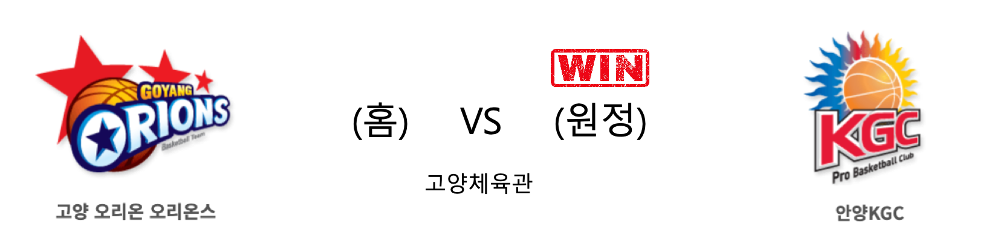
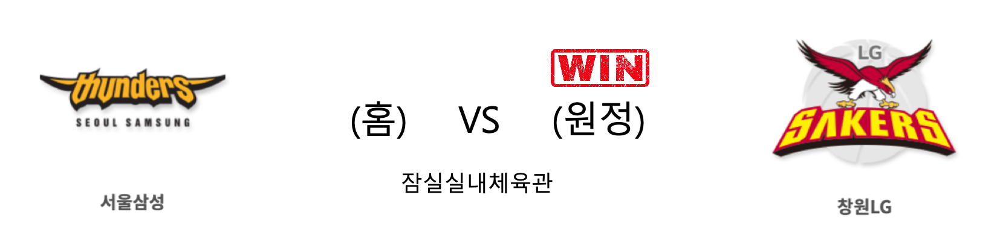

####  부산KT(홈) VS 울산현대모비스(원정) 

<table class="tg">
  <tr>
    <th class="tg-rr9t">부산KT</th>
    <th class="tg-rr9t">팀</th>
    <th class="tg-rr9t">울산현대모비스</th>
  </tr>
  <tr>
    <td class="tg-dcpn">2승 1패</td>
    <td class="tg-rr9t">시즌 상대전적</td>
    <td class="tg-dcpn">1승 2패</td>
  </tr>
  <tr>
    <td class="tg-dcpn">83</td>
    <td class="tg-rr9t">점수</td>
    <td class="tg-dcpn">72</td>
  </tr>
  <tr>
    <td class="tg-dcpn">22/43(51%)</td>
    <td class="tg-rr9t">2점(%)</td>
    <td class="tg-dcpn">22/43(51%)</td>
  </tr>
  <tr>
    <td class="tg-dcpn">12/28(43%)</td>
    <td class="tg-rr9t">3점(%)</td>
    <td class="tg-dcpn">8/22(36%)</td>
  </tr>
  <tr>
    <td class="tg-dcpn">3/7(43%)</td>
    <td class="tg-rr9t">자유투(%)</td>
    <td class="tg-dcpn">4/7(57%)</td>
  </tr>
  <tr>
    <td class="tg-dcpn">36</td>
    <td class="tg-rr9t">리바운드</td>
    <td class="tg-dcpn">26</td>
  </tr>
  <tr>
    <td class="tg-dcpn">1</td>
    <td class="tg-rr9t">어시스트</td>
    <td class="tg-dcpn">0</td>
  </tr>
  <tr>
    <td class="tg-dcpn">11</td>
    <td class="tg-rr9t">스틸</td>
    <td class="tg-dcpn">8</td>
  </tr>
  <tr>
    <td class="tg-dcpn">4</td>
    <td class="tg-rr9t">블록</td>
    <td class="tg-dcpn">6</td>
  </tr>
  <tr>
    <td class="tg-dcpn">16</td>
    <td class="tg-rr9t">턴오버</td>
    <td class="tg-dcpn">16</td>
  </tr>
  <tr>
    <td class="tg-dcpn">양홍석(16) 허훈(27)</td>
    <td class="tg-rr9t">주요 득점선수</td>
    <td class="tg-dcpn"></td>
  </tr>
</table>

#### 경기 관련 주요 기사         

['허훈 27P-8A' KT, 현대모비스 꺾고 5연승 신바람](http://www.rookie.co.kr/news/articleView.html?idxno=35929)

['허훈 맹활약' KT, 현대모비스 격파…KGC인삼공사, 오리온 제압](http://stoo.asiae.co.kr/article.php?aid=60282595206)

[[라커룸에서] 5연승 노리는 KT 서동철 감독 “현대모비스는 항상 까다롭다”](http://sports.news.naver.com/basketball/news/read.nhn?oid=065&aid=0000193628)

[KCC, 전자랜드에 대역전승…KT·인삼공사 5연승(종합)](http://www.newsis.com/view/?id=NISX20191208_0000853722&cID=10505&pID=10500)

        
        

####  전주KCC(홈) VS 인천전자랜드(원정) 

<table class="tg">
  <tr>
    <th class="tg-rr9t">전주KCC</th>
    <th class="tg-rr9t">팀</th>
    <th class="tg-rr9t">인천전자랜드</th>
  </tr>
  <tr>
    <td class="tg-dcpn">2승 1패</td>
    <td class="tg-rr9t">시즌 상대전적</td>
    <td class="tg-dcpn">1승 2패</td>
  </tr>
  <tr>
    <td class="tg-dcpn">89</td>
    <td class="tg-rr9t">점수</td>
    <td class="tg-dcpn">81</td>
  </tr>
  <tr>
    <td class="tg-dcpn">27/38(71%)</td>
    <td class="tg-rr9t">2점(%)</td>
    <td class="tg-dcpn">19/44(43%)</td>
  </tr>
  <tr>
    <td class="tg-dcpn">7/19(37%)</td>
    <td class="tg-rr9t">3점(%)</td>
    <td class="tg-dcpn">12/31(39%)</td>
  </tr>
  <tr>
    <td class="tg-dcpn">14/21(67%)</td>
    <td class="tg-rr9t">자유투(%)</td>
    <td class="tg-dcpn">7/8(88%)</td>
  </tr>
  <tr>
    <td class="tg-dcpn">35</td>
    <td class="tg-rr9t">리바운드</td>
    <td class="tg-dcpn">30</td>
  </tr>
  <tr>
    <td class="tg-dcpn">3</td>
    <td class="tg-rr9t">어시스트</td>
    <td class="tg-dcpn">3</td>
  </tr>
  <tr>
    <td class="tg-dcpn">14</td>
    <td class="tg-rr9t">스틸</td>
    <td class="tg-dcpn">7</td>
  </tr>
  <tr>
    <td class="tg-dcpn">5</td>
    <td class="tg-rr9t">블록</td>
    <td class="tg-dcpn">8</td>
  </tr>
  <tr>
    <td class="tg-dcpn">15</td>
    <td class="tg-rr9t">턴오버</td>
    <td class="tg-dcpn">21</td>
  </tr>
  <tr>
    <td class="tg-dcpn">라건아(18) 이대성(19) 송교창(17)</td>
    <td class="tg-rr9t">주요 득점선수</td>
    <td class="tg-dcpn">트로이 길렌워터(18) 김낙현(23) 머피 할로웨이(18)</td>
  </tr>
</table>

#### 경기 관련 주요 기사         

[KCC 이대성](http://yna.kr/PYH20191208089700055?did=1196m)

[KCC, 전자랜드에 대역전승…KT·인삼공사 5연승(종합)](http://www.newsis.com/view/?id=NISX20191208_0000853722&cID=10505&pID=10500)

[프로농구 KCC, 21점 차 뒤집고 트레이드 후 첫 연승(종합)](http://yna.kr/AKR20191208042751007?did=1195m)

[[BK Review] '이것이 슈퍼팀이다!' KCC, 전자랜드에 21점차 역전승...36일 만에 홈 승리](http://www.basketkorea.com/news/articleView.html?idxno=190609)

        
        

####  고양오리온(홈) VS 안양KGC(원정) 

<table class="tg">
  <tr>
    <th class="tg-rr9t">고양오리온</th>
    <th class="tg-rr9t">팀</th>
    <th class="tg-rr9t">안양KGC</th>
  </tr>
  <tr>
    <td class="tg-dcpn">0승 3패</td>
    <td class="tg-rr9t">시즌 상대전적</td>
    <td class="tg-dcpn">3승 0패</td>
  </tr>
  <tr>
    <td class="tg-dcpn">69</td>
    <td class="tg-rr9t">점수</td>
    <td class="tg-dcpn">85</td>
  </tr>
  <tr>
    <td class="tg-dcpn">21/42(50%)</td>
    <td class="tg-rr9t">2점(%)</td>
    <td class="tg-dcpn">17/34(50%)</td>
  </tr>
  <tr>
    <td class="tg-dcpn">6/23(26%)</td>
    <td class="tg-rr9t">3점(%)</td>
    <td class="tg-dcpn">14/34(41%)</td>
  </tr>
  <tr>
    <td class="tg-dcpn">9/11(82%)</td>
    <td class="tg-rr9t">자유투(%)</td>
    <td class="tg-dcpn">9/12(75%)</td>
  </tr>
  <tr>
    <td class="tg-dcpn">34</td>
    <td class="tg-rr9t">리바운드</td>
    <td class="tg-dcpn">34</td>
  </tr>
  <tr>
    <td class="tg-dcpn">0</td>
    <td class="tg-rr9t">어시스트</td>
    <td class="tg-dcpn">3</td>
  </tr>
  <tr>
    <td class="tg-dcpn">14</td>
    <td class="tg-rr9t">스틸</td>
    <td class="tg-dcpn">8</td>
  </tr>
  <tr>
    <td class="tg-dcpn">4</td>
    <td class="tg-rr9t">블록</td>
    <td class="tg-dcpn">9</td>
  </tr>
  <tr>
    <td class="tg-dcpn">14</td>
    <td class="tg-rr9t">턴오버</td>
    <td class="tg-dcpn">27</td>
  </tr>
  <tr>
    <td class="tg-dcpn">이승현(17)</td>
    <td class="tg-rr9t">주요 득점선수</td>
    <td class="tg-dcpn">기승호(27)</td>
  </tr>
</table>

#### 경기 관련 주요 기사         

[[기록] ‘베테랑의 품격’ KGC 기승호, 2,497일 만에 25+득점 폭발](http://sports.news.naver.com/basketball/news/read.nhn?oid=065&aid=0000193643)

[[JB포토화보] KGC인삼공사, 85-69로 오리온에 원정 승리](http://sports.news.naver.com/basketball/news/read.nhn?oid=065&aid=0000193645)

[[BK Review] '기승호 3점 폭발' KGC인삼공사, 오리온 꺾고 5연승 질주](http://www.basketkorea.com/news/articleView.html?idxno=190597)

['기승호 27점' KGC, 오리온 압도…단독 2위 등극](http://www.spotvnews.co.kr/?mod=news&act=articleView&idxno=332951)

        
        

####  서울삼성(홈) VS 창원LG(원정) 

<table class="tg">
  <tr>
    <th class="tg-rr9t">서울삼성</th>
    <th class="tg-rr9t">팀</th>
    <th class="tg-rr9t">창원LG</th>
  </tr>
  <tr>
    <td class="tg-dcpn">2승 1패</td>
    <td class="tg-rr9t">시즌 상대전적</td>
    <td class="tg-dcpn">1승 2패</td>
  </tr>
  <tr>
    <td class="tg-dcpn">72</td>
    <td class="tg-rr9t">점수</td>
    <td class="tg-dcpn">75</td>
  </tr>
  <tr>
    <td class="tg-dcpn">23/43(53%)</td>
    <td class="tg-rr9t">2점(%)</td>
    <td class="tg-dcpn">20/47(43%)</td>
  </tr>
  <tr>
    <td class="tg-dcpn">6/24(25%)</td>
    <td class="tg-rr9t">3점(%)</td>
    <td class="tg-dcpn">8/23(35%)</td>
  </tr>
  <tr>
    <td class="tg-dcpn">8/10(80%)</td>
    <td class="tg-rr9t">자유투(%)</td>
    <td class="tg-dcpn">11/17(65%)</td>
  </tr>
  <tr>
    <td class="tg-dcpn">29</td>
    <td class="tg-rr9t">리바운드</td>
    <td class="tg-dcpn">43</td>
  </tr>
  <tr>
    <td class="tg-dcpn">1</td>
    <td class="tg-rr9t">어시스트</td>
    <td class="tg-dcpn">2</td>
  </tr>
  <tr>
    <td class="tg-dcpn">7</td>
    <td class="tg-rr9t">스틸</td>
    <td class="tg-dcpn">12</td>
  </tr>
  <tr>
    <td class="tg-dcpn">9</td>
    <td class="tg-rr9t">블록</td>
    <td class="tg-dcpn">6</td>
  </tr>
  <tr>
    <td class="tg-dcpn">15</td>
    <td class="tg-rr9t">턴오버</td>
    <td class="tg-dcpn">19</td>
  </tr>
  <tr>
    <td class="tg-dcpn"></td>
    <td class="tg-rr9t">주요 득점선수</td>
    <td class="tg-dcpn">김시래(19) 캐디 라렌(16)</td>
  </tr>
</table>

#### 경기 관련 주요 기사         

[[사진]LG, 연패 탈출](http://www.osen.co.kr/article/G1111274343)

[[MD포토] 창원 LG '서울 삼성 상대로 75-72 승리'](http://www.mydaily.co.kr/new_yk/html/read.php?newsid=201912081858985161&ext=na)

[[포토] 삼성, LG에 패하며 5연패](http://www.sportsseoul.com/news/read/858847)

[[BK Review] '시래-라렌 맹활약' LG, 원정에서 삼성 격파...삼성은 5연패 수렁](http://www.basketkorea.com/news/articleView.html?idxno=190608)

        
        

#### 리그 순위

<table class="tg">
  <tr>
    <th class="tg-d14o">순위</th>
    <th class="tg-d14o">팀명</th>
    <th class="tg-d14o">경기수</th>
    <th class="tg-d14o">승</th>
    <th class="tg-d14o">패</th>
    <th class="tg-d14o">승차</th>
    <th class="tg-d14o">승률</th>
  </tr>
  
<tr>
    <td class="tg-50j8">1</td>
    <td class="tg-50j8">서울SK</td>
    <td class="tg-50j8">19</td>
    <td class="tg-50j8">14</td>
    <td class="tg-50j8">5</td>
    <td class="tg-50j8">0</td>
    <td class="tg-50j8">0.737</td>
</tr>

<tr>
    <td class="tg-50j8">2</td>
    <td class="tg-50j8">안양KGC</td>
    <td class="tg-50j8">20</td>
    <td class="tg-50j8">12</td>
    <td class="tg-50j8">8</td>
    <td class="tg-50j8">2</td>
    <td class="tg-50j8">0.6</td>
</tr>

<tr>
    <td class="tg-50j8">3</td>
    <td class="tg-50j8">원주DB</td>
    <td class="tg-50j8">19</td>
    <td class="tg-50j8">11</td>
    <td class="tg-50j8">8</td>
    <td class="tg-50j8">3</td>
    <td class="tg-50j8">0.579</td>
</tr>

<tr>
    <td class="tg-50j8">4</td>
    <td class="tg-50j8">전주KCC</td>
    <td class="tg-50j8">20</td>
    <td class="tg-50j8">11</td>
    <td class="tg-50j8">9</td>
    <td class="tg-50j8">3</td>
    <td class="tg-50j8">0.55</td>
</tr>

<tr>
    <td class="tg-50j8">4</td>
    <td class="tg-50j8">부산KT</td>
    <td class="tg-50j8">20</td>
    <td class="tg-50j8">11</td>
    <td class="tg-50j8">9</td>
    <td class="tg-50j8">3</td>
    <td class="tg-50j8">0.55</td>
</tr>

<tr>
    <td class="tg-50j8">6</td>
    <td class="tg-50j8">인천전자랜드</td>
    <td class="tg-50j8">20</td>
    <td class="tg-50j8">10</td>
    <td class="tg-50j8">10</td>
    <td class="tg-50j8">4</td>
    <td class="tg-50j8">0.5</td>
</tr>

<tr>
    <td class="tg-50j8">7</td>
    <td class="tg-50j8">울산현대모비스</td>
    <td class="tg-50j8">20</td>
    <td class="tg-50j8">8</td>
    <td class="tg-50j8">12</td>
    <td class="tg-50j8">6</td>
    <td class="tg-50j8">0.4</td>
</tr>

<tr>
    <td class="tg-50j8">7</td>
    <td class="tg-50j8">서울삼성</td>
    <td class="tg-50j8">20</td>
    <td class="tg-50j8">8</td>
    <td class="tg-50j8">12</td>
    <td class="tg-50j8">6</td>
    <td class="tg-50j8">0.4</td>
</tr>

<tr>
    <td class="tg-50j8">9</td>
    <td class="tg-50j8">창원LG</td>
    <td class="tg-50j8">20</td>
    <td class="tg-50j8">7</td>
    <td class="tg-50j8">13</td>
    <td class="tg-50j8">7</td>
    <td class="tg-50j8">0.35</td>
</tr>

<tr>
    <td class="tg-50j8">9</td>
    <td class="tg-50j8">고양오리온</td>
    <td class="tg-50j8">20</td>
    <td class="tg-50j8">7</td>
    <td class="tg-50j8">13</td>
    <td class="tg-50j8">7</td>
    <td class="tg-50j8">0.35</td>
</tr>
</table> 

        
        
#kbl #국내농구 #농구분석 #토토 #스포츠토토 #경기예측 #농구결과 #20191208 #부산KT #울산현대모비스 #전주KCC #인천전자랜드 #고양오리온 #안양KGC #서울삼성 #창원LG #부산KT울산현대모비스 #전주KCC인천전자랜드 #고양오리온안양KGC #서울삼성창원LG 