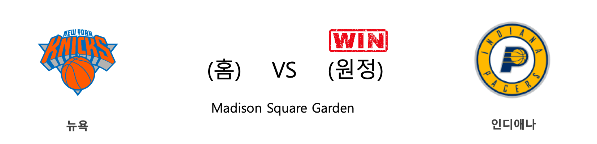
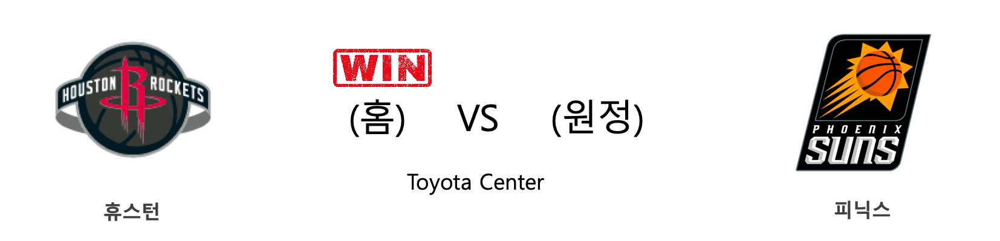
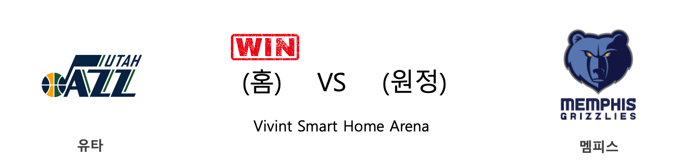
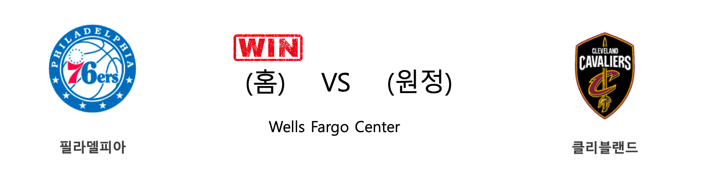

####  뉴욕(홈) VS 인디애나(원정) 

<table class="tg">
  <tr>
    <th class="tg-rr9t">NYK</th>
    <th class="tg-rr9t">팀</th>
    <th class="tg-rr9t">IND</th>
  </tr>
  <tr>
    <td class="tg-dcpn">0승 1패</td>
    <td class="tg-rr9t">시즌 상대전적</td>
    <td class="tg-dcpn">1승 0패</td>
  </tr>
  <tr>
    <td class="tg-dcpn">103</td>
    <td class="tg-rr9t">점수</td>
    <td class="tg-dcpn">104</td>
  </tr>
  <tr>
    <td class="tg-dcpn">29/65(45%)</td>
    <td class="tg-rr9t">2점(%)</td>
    <td class="tg-dcpn">29/57(51%)</td>
  </tr>
  <tr>
    <td class="tg-dcpn">10/31(32%)</td>
    <td class="tg-rr9t">3점(%)</td>
    <td class="tg-dcpn">12/28(43%)</td>
  </tr>
  <tr>
    <td class="tg-dcpn">15/21(71%)</td>
    <td class="tg-rr9t">자유투(%)</td>
    <td class="tg-dcpn">10/13(77%)</td>
  </tr>
  <tr>
    <td class="tg-dcpn">52</td>
    <td class="tg-rr9t">리바운드</td>
    <td class="tg-dcpn">42</td>
  </tr>
  <tr>
    <td class="tg-dcpn">24</td>
    <td class="tg-rr9t">어시스트</td>
    <td class="tg-dcpn">26</td>
  </tr>
  <tr>
    <td class="tg-dcpn">11</td>
    <td class="tg-rr9t">스틸</td>
    <td class="tg-dcpn">7</td>
  </tr>
  <tr>
    <td class="tg-dcpn">6</td>
    <td class="tg-rr9t">블록</td>
    <td class="tg-dcpn">9</td>
  </tr>
  <tr>
    <td class="tg-dcpn">11</td>
    <td class="tg-rr9t">턴오버</td>
    <td class="tg-dcpn">16</td>
  </tr>
  <tr>
    <td class="tg-dcpn">JuliusRandleF(16) MarcusMorrisS(25)</td>
    <td class="tg-rr9t">주요 득점선수</td>
    <td class="tg-dcpn">T.J.WarrenF(25) DougMcDermott(16) DomantasSabon(19)</td>
  </tr>
</table>

#### 경기 관련 주요 기사         

[[오늘의 NBA] (11/30) 인디애나, 동부컨퍼런스의 복병](http://sports.news.naver.com/basketball/news/read.nhn?oid=486&aid=0000001152)

[[오늘의 NBA] (12/3) 켈리 우브레 주니어, 피닉스의 터프가이](http://sports.news.naver.com/basketball/news/read.nhn?oid=486&aid=0000001155)

[[오늘의 NBA] (12/7) 르브론 제임스, 멜로(carmelo) 드라마의 주인공](http://sports.news.naver.com/basketball/news/read.nhn?oid=486&aid=0000001159)

[[오늘의 NBA] (11/26) 마크 가솔, 조엘 엠비드의 영원한 악몽](http://sports.news.naver.com/basketball/news/read.nhn?oid=486&aid=0000001149)

[[오늘의 NBA] (11/28) 앤써니 데이비스, 노란 셔츠를 입은 사나이](http://sports.news.naver.com/basketball/news/read.nhn?oid=486&aid=0000001151)

        
        

####  휴스턴(홈) VS 피닉스(원정) 

<table class="tg">
  <tr>
    <th class="tg-rr9t">HOU</th>
    <th class="tg-rr9t">팀</th>
    <th class="tg-rr9t">PHX</th>
  </tr>
  <tr>
    <td class="tg-dcpn">1승 0패</td>
    <td class="tg-rr9t">시즌 상대전적</td>
    <td class="tg-dcpn">0승 1패</td>
  </tr>
  <tr>
    <td class="tg-dcpn">115</td>
    <td class="tg-rr9t">점수</td>
    <td class="tg-dcpn">109</td>
  </tr>
  <tr>
    <td class="tg-dcpn">30/51(59%)</td>
    <td class="tg-rr9t">2점(%)</td>
    <td class="tg-dcpn">29/61(48%)</td>
  </tr>
  <tr>
    <td class="tg-dcpn">11/40(28%)</td>
    <td class="tg-rr9t">3점(%)</td>
    <td class="tg-dcpn">11/35(31%)</td>
  </tr>
  <tr>
    <td class="tg-dcpn">22/30(73%)</td>
    <td class="tg-rr9t">자유투(%)</td>
    <td class="tg-dcpn">18/28(64%)</td>
  </tr>
  <tr>
    <td class="tg-dcpn">51</td>
    <td class="tg-rr9t">리바운드</td>
    <td class="tg-dcpn">51</td>
  </tr>
  <tr>
    <td class="tg-dcpn">21</td>
    <td class="tg-rr9t">어시스트</td>
    <td class="tg-dcpn">29</td>
  </tr>
  <tr>
    <td class="tg-dcpn">10</td>
    <td class="tg-rr9t">스틸</td>
    <td class="tg-dcpn">4</td>
  </tr>
  <tr>
    <td class="tg-dcpn">7</td>
    <td class="tg-rr9t">블록</td>
    <td class="tg-dcpn">3</td>
  </tr>
  <tr>
    <td class="tg-dcpn">15</td>
    <td class="tg-rr9t">턴오버</td>
    <td class="tg-dcpn">15</td>
  </tr>
  <tr>
    <td class="tg-dcpn">BenMcLemore(27) RussellWestbr(24) JamesHardenG(34)</td>
    <td class="tg-rr9t">주요 득점선수</td>
    <td class="tg-dcpn">DevinBookerG(35) KellyOubreJr.(19)</td>
  </tr>
</table>

#### 경기 관련 주요 기사         

[[오늘의 NBA] (11/30) 인디애나, 동부컨퍼런스의 복병](http://sports.news.naver.com/basketball/news/read.nhn?oid=486&aid=0000001152)

[[오늘의 NBA] (12/3) 켈리 우브레 주니어, 피닉스의 터프가이](http://sports.news.naver.com/basketball/news/read.nhn?oid=486&aid=0000001155)

[[오늘의 NBA] (11/27) 덴버, 서부컨퍼런스 우승 후보로 도약하다](http://sports.news.naver.com/basketball/news/read.nhn?oid=486&aid=0000001150)

[[오늘의 NBA] (12/4) 샌안토니오, 괄육취골 승리를 거두다](http://sports.news.naver.com/basketball/news/read.nhn?oid=486&aid=0000001156)

[[오늘의 NBA] (11/28) 앤써니 데이비스, 노란 셔츠를 입은 사나이](http://sports.news.naver.com/basketball/news/read.nhn?oid=486&aid=0000001151)

        
        

####  유타(홈) VS 멤피스(원정) 

<table class="tg">
  <tr>
    <th class="tg-rr9t">UTA</th>
    <th class="tg-rr9t">팀</th>
    <th class="tg-rr9t">MEM</th>
  </tr>
  <tr>
    <td class="tg-dcpn">2승 1패</td>
    <td class="tg-rr9t">시즌 상대전적</td>
    <td class="tg-dcpn">1승 2패</td>
  </tr>
  <tr>
    <td class="tg-dcpn">126</td>
    <td class="tg-rr9t">점수</td>
    <td class="tg-dcpn">112</td>
  </tr>
  <tr>
    <td class="tg-dcpn">26/46(57%)</td>
    <td class="tg-rr9t">2점(%)</td>
    <td class="tg-dcpn">33/46(72%)</td>
  </tr>
  <tr>
    <td class="tg-dcpn">19/34(56%)</td>
    <td class="tg-rr9t">3점(%)</td>
    <td class="tg-dcpn">10/35(29%)</td>
  </tr>
  <tr>
    <td class="tg-dcpn">17/18(94%)</td>
    <td class="tg-rr9t">자유투(%)</td>
    <td class="tg-dcpn">16/25(64%)</td>
  </tr>
  <tr>
    <td class="tg-dcpn">41</td>
    <td class="tg-rr9t">리바운드</td>
    <td class="tg-dcpn">28</td>
  </tr>
  <tr>
    <td class="tg-dcpn">32</td>
    <td class="tg-rr9t">어시스트</td>
    <td class="tg-dcpn">23</td>
  </tr>
  <tr>
    <td class="tg-dcpn">8</td>
    <td class="tg-rr9t">스틸</td>
    <td class="tg-dcpn">15</td>
  </tr>
  <tr>
    <td class="tg-dcpn">0</td>
    <td class="tg-rr9t">블록</td>
    <td class="tg-dcpn">3</td>
  </tr>
  <tr>
    <td class="tg-dcpn">22</td>
    <td class="tg-rr9t">턴오버</td>
    <td class="tg-dcpn">14</td>
  </tr>
  <tr>
    <td class="tg-dcpn">DonovanMitche(22) RudyGobertC(19) BojanBogdanov(19) JeffGreen(19)</td>
    <td class="tg-rr9t">주요 득점선수</td>
    <td class="tg-dcpn">JarenJacksonJ(26)</td>
  </tr>
</table>

#### 경기 관련 주요 기사         

[[오늘의 NBA] (11/24) 잭 라빈, GSW 스플래쉬 브라더스를 소환하다](http://sports.news.naver.com/basketball/news/read.nhn?oid=486&aid=0000001147)

[[오늘의 NBA] (12/3) 켈리 우브레 주니어, 피닉스의 터프가이](http://sports.news.naver.com/basketball/news/read.nhn?oid=486&aid=0000001155)

[[오늘의 NBA] (12/5) 밀워키, 시스템 농구 정점에 도달하다](http://sports.news.naver.com/basketball/news/read.nhn?oid=486&aid=0000001157)

[[오늘의 NBA] (12/2) 토론토, 두 마리 토끼를 노린다!](http://sports.news.naver.com/basketball/news/read.nhn?oid=486&aid=0000001154)

[[오늘의 NBA] (11/30) 인디애나, 동부컨퍼런스의 복병](http://sports.news.naver.com/basketball/news/read.nhn?oid=486&aid=0000001152)

        
        

####  필라델피아(홈) VS 클리블랜드(원정) 

<table class="tg">
  <tr>
    <th class="tg-rr9t">PHI</th>
    <th class="tg-rr9t">팀</th>
    <th class="tg-rr9t">CLE</th>
  </tr>
  <tr>
    <td class="tg-dcpn">3승 0패</td>
    <td class="tg-rr9t">시즌 상대전적</td>
    <td class="tg-dcpn">0승 3패</td>
  </tr>
  <tr>
    <td class="tg-dcpn">141</td>
    <td class="tg-rr9t">점수</td>
    <td class="tg-dcpn">94</td>
  </tr>
  <tr>
    <td class="tg-dcpn">46/64(72%)</td>
    <td class="tg-rr9t">2점(%)</td>
    <td class="tg-dcpn">27/61(44%)</td>
  </tr>
  <tr>
    <td class="tg-dcpn">11/26(42%)</td>
    <td class="tg-rr9t">3점(%)</td>
    <td class="tg-dcpn">9/35(26%)</td>
  </tr>
  <tr>
    <td class="tg-dcpn">16/23(70%)</td>
    <td class="tg-rr9t">자유투(%)</td>
    <td class="tg-dcpn">13/17(76%)</td>
  </tr>
  <tr>
    <td class="tg-dcpn">51</td>
    <td class="tg-rr9t">리바운드</td>
    <td class="tg-dcpn">35</td>
  </tr>
  <tr>
    <td class="tg-dcpn">43</td>
    <td class="tg-rr9t">어시스트</td>
    <td class="tg-dcpn">20</td>
  </tr>
  <tr>
    <td class="tg-dcpn">13</td>
    <td class="tg-rr9t">스틸</td>
    <td class="tg-dcpn">4</td>
  </tr>
  <tr>
    <td class="tg-dcpn">8</td>
    <td class="tg-rr9t">블록</td>
    <td class="tg-dcpn">0</td>
  </tr>
  <tr>
    <td class="tg-dcpn">8</td>
    <td class="tg-rr9t">턴오버</td>
    <td class="tg-dcpn">17</td>
  </tr>
  <tr>
    <td class="tg-dcpn">TreyBurke(21) BenSimmonsG(34) TobiasHarrisF(15) MikeScottF(21)</td>
    <td class="tg-rr9t">주요 득점선수</td>
    <td class="tg-dcpn">DariusGarland(17)</td>
  </tr>
</table>

#### 경기 관련 주요 기사         

[[오늘의 NBA] (11/25) 댈러스, 공격이 승리를 부른다!](http://sports.news.naver.com/basketball/news/read.nhn?oid=486&aid=0000001148)

[[오늘의 NBA] (12/4) 샌안토니오, 괄육취골 승리를 거두다](http://sports.news.naver.com/basketball/news/read.nhn?oid=486&aid=0000001156)

[ML, 2019 골드글러브 수상자 발표…아레나도 7년 연속 수상](http://www.mbcsportsplus.com/news/?mode=view&cate=2&b_idx=99826267.000)

['시몬스 커리어-하이 34점' 엠비드 결장한 PHI, CLE에 47점 차 대승](http://www.rookie.co.kr/news/articleView.html?idxno=35918)

[[오늘의 NBA] (11/28) 앤써니 데이비스, 노란 셔츠를 입은 사나이](http://sports.news.naver.com/basketball/news/read.nhn?oid=486&aid=0000001151)

        
        

####  댈러스(홈) VS 뉴올리언스(원정) 

<table class="tg">
  <tr>
    <th class="tg-rr9t">DAL</th>
    <th class="tg-rr9t">팀</th>
    <th class="tg-rr9t">NOP</th>
  </tr>
  <tr>
    <td class="tg-dcpn">3승 0패</td>
    <td class="tg-rr9t">시즌 상대전적</td>
    <td class="tg-dcpn">0승 3패</td>
  </tr>
  <tr>
    <td class="tg-dcpn">130</td>
    <td class="tg-rr9t">점수</td>
    <td class="tg-dcpn">84</td>
  </tr>
  <tr>
    <td class="tg-dcpn">33/48(69%)</td>
    <td class="tg-rr9t">2점(%)</td>
    <td class="tg-dcpn">29/57(51%)</td>
  </tr>
  <tr>
    <td class="tg-dcpn">13/38(34%)</td>
    <td class="tg-rr9t">3점(%)</td>
    <td class="tg-dcpn">3/32(9%)</td>
  </tr>
  <tr>
    <td class="tg-dcpn">25/31(81%)</td>
    <td class="tg-rr9t">자유투(%)</td>
    <td class="tg-dcpn">17/21(81%)</td>
  </tr>
  <tr>
    <td class="tg-dcpn">55</td>
    <td class="tg-rr9t">리바운드</td>
    <td class="tg-dcpn">34</td>
  </tr>
  <tr>
    <td class="tg-dcpn">25</td>
    <td class="tg-rr9t">어시스트</td>
    <td class="tg-dcpn">17</td>
  </tr>
  <tr>
    <td class="tg-dcpn">8</td>
    <td class="tg-rr9t">스틸</td>
    <td class="tg-dcpn">4</td>
  </tr>
  <tr>
    <td class="tg-dcpn">4</td>
    <td class="tg-rr9t">블록</td>
    <td class="tg-dcpn">2</td>
  </tr>
  <tr>
    <td class="tg-dcpn">12</td>
    <td class="tg-rr9t">턴오버</td>
    <td class="tg-dcpn">14</td>
  </tr>
  <tr>
    <td class="tg-dcpn">BobanMarjanov(15) LukaDoncicG(26)</td>
    <td class="tg-rr9t">주요 득점선수</td>
    <td class="tg-dcpn">JJRedickF(15)</td>
  </tr>
</table>

#### 경기 관련 주요 기사         

[[오늘의 NBA] (11/15) NOP 즈루 홀리데이, 뒤처리는 내가 맡는다!](http://sports.news.naver.com/basketball/news/read.nhn?oid=486&aid=0000001138)

[[오늘의 NBA] (11/23) 카와이 레너드, 승부를 결정짓는 사나이](http://sports.news.naver.com/basketball/news/read.nhn?oid=486&aid=0000001146)

[[오늘의 NBA] (12/5) 밀워키, 시스템 농구 정점에 도달하다](http://sports.news.naver.com/basketball/news/read.nhn?oid=486&aid=0000001157)

[[오늘의 NBA] (12/2) 토론토, 두 마리 토끼를 노린다!](http://sports.news.naver.com/basketball/news/read.nhn?oid=486&aid=0000001154)

[[오늘의 NBA] (11/24) 잭 라빈, GSW 스플래쉬 브라더스를 소환하다](http://sports.news.naver.com/basketball/news/read.nhn?oid=486&aid=0000001147)

        
        

#### 리그 (Eastern) 순위
    

<table class="tg">
  <tr>
    <th class="tg-d14o">순위</th>
    <th class="tg-d14o">팀명</th>
    <th class="tg-d14o">경기수</th>
    <th class="tg-d14o">승</th>
    <th class="tg-d14o">패</th>
    <th class="tg-d14o">승차</th>
    <th class="tg-d14o">승률</th>
  </tr>
  
<tr>
    <td class="tg-50j8">1</td>
    <td class="tg-50j8">MIL</td>
    <td class="tg-50j8">23</td>
    <td class="tg-50j8">20</td>
    <td class="tg-50j8">3</td>
    <td class="tg-50j8">0</td>
    <td class="tg-50j8">0.87</td>
</tr>

<tr>
    <td class="tg-50j8">2</td>
    <td class="tg-50j8">BOS</td>
    <td class="tg-50j8">21</td>
    <td class="tg-50j8">16</td>
    <td class="tg-50j8">5</td>
    <td class="tg-50j8">4</td>
    <td class="tg-50j8">0.762</td>
</tr>

<tr>
    <td class="tg-50j8">3</td>
    <td class="tg-50j8">MIA</td>
    <td class="tg-50j8">22</td>
    <td class="tg-50j8">16</td>
    <td class="tg-50j8">6</td>
    <td class="tg-50j8">4</td>
    <td class="tg-50j8">0.727</td>
</tr>

<tr>
    <td class="tg-50j8">4</td>
    <td class="tg-50j8">PHI</td>
    <td class="tg-50j8">23</td>
    <td class="tg-50j8">16</td>
    <td class="tg-50j8">7</td>
    <td class="tg-50j8">4</td>
    <td class="tg-50j8">0.696</td>
</tr>

<tr>
    <td class="tg-50j8">5</td>
    <td class="tg-50j8">TOR</td>
    <td class="tg-50j8">21</td>
    <td class="tg-50j8">15</td>
    <td class="tg-50j8">6</td>
    <td class="tg-50j8">5</td>
    <td class="tg-50j8">0.714</td>
</tr>

<tr>
    <td class="tg-50j8">6</td>
    <td class="tg-50j8">IND</td>
    <td class="tg-50j8">23</td>
    <td class="tg-50j8">15</td>
    <td class="tg-50j8">8</td>
    <td class="tg-50j8">5</td>
    <td class="tg-50j8">0.652</td>
</tr>

<tr>
    <td class="tg-50j8">7</td>
    <td class="tg-50j8">BKN</td>
    <td class="tg-50j8">22</td>
    <td class="tg-50j8">12</td>
    <td class="tg-50j8">10</td>
    <td class="tg-50j8">8</td>
    <td class="tg-50j8">0.545</td>
</tr>

<tr>
    <td class="tg-50j8">8</td>
    <td class="tg-50j8">ORL</td>
    <td class="tg-50j8">22</td>
    <td class="tg-50j8">11</td>
    <td class="tg-50j8">11</td>
    <td class="tg-50j8">9</td>
    <td class="tg-50j8">0.5</td>
</tr>

<tr>
    <td class="tg-50j8">9</td>
    <td class="tg-50j8">DET</td>
    <td class="tg-50j8">23</td>
    <td class="tg-50j8">9</td>
    <td class="tg-50j8">14</td>
    <td class="tg-50j8">11</td>
    <td class="tg-50j8">0.391</td>
</tr>

<tr>
    <td class="tg-50j8">10</td>
    <td class="tg-50j8">CHA</td>
    <td class="tg-50j8">24</td>
    <td class="tg-50j8">9</td>
    <td class="tg-50j8">15</td>
    <td class="tg-50j8">11</td>
    <td class="tg-50j8">0.375</td>
</tr>

<tr>
    <td class="tg-50j8">11</td>
    <td class="tg-50j8">CHI</td>
    <td class="tg-50j8">23</td>
    <td class="tg-50j8">8</td>
    <td class="tg-50j8">15</td>
    <td class="tg-50j8">12</td>
    <td class="tg-50j8">0.348</td>
</tr>

<tr>
    <td class="tg-50j8">12</td>
    <td class="tg-50j8">WAS</td>
    <td class="tg-50j8">21</td>
    <td class="tg-50j8">7</td>
    <td class="tg-50j8">14</td>
    <td class="tg-50j8">13</td>
    <td class="tg-50j8">0.333</td>
</tr>

<tr>
    <td class="tg-50j8">13</td>
    <td class="tg-50j8">ATL</td>
    <td class="tg-50j8">22</td>
    <td class="tg-50j8">5</td>
    <td class="tg-50j8">17</td>
    <td class="tg-50j8">15</td>
    <td class="tg-50j8">0.227</td>
</tr>

<tr>
    <td class="tg-50j8">13</td>
    <td class="tg-50j8">CLE</td>
    <td class="tg-50j8">22</td>
    <td class="tg-50j8">5</td>
    <td class="tg-50j8">17</td>
    <td class="tg-50j8">15</td>
    <td class="tg-50j8">0.227</td>
</tr>

<tr>
    <td class="tg-50j8">15</td>
    <td class="tg-50j8">NYK</td>
    <td class="tg-50j8">23</td>
    <td class="tg-50j8">4</td>
    <td class="tg-50j8">19</td>
    <td class="tg-50j8">16</td>
    <td class="tg-50j8">0.174</td>
</tr>
</table> 
#### 리그 (Western) 순위
    

<table class="tg">
  <tr>
    <th class="tg-d14o">순위</th>
    <th class="tg-d14o">팀명</th>
    <th class="tg-d14o">경기수</th>
    <th class="tg-d14o">승</th>
    <th class="tg-d14o">패</th>
    <th class="tg-d14o">승차</th>
    <th class="tg-d14o">승률</th>
  </tr>
  
<tr>
    <td class="tg-50j8">1</td>
    <td class="tg-50j8">LAL</td>
    <td class="tg-50j8">23</td>
    <td class="tg-50j8">20</td>
    <td class="tg-50j8">3</td>
    <td class="tg-50j8">0</td>
    <td class="tg-50j8">0.87</td>
</tr>

<tr>
    <td class="tg-50j8">2</td>
    <td class="tg-50j8">DAL</td>
    <td class="tg-50j8">22</td>
    <td class="tg-50j8">16</td>
    <td class="tg-50j8">6</td>
    <td class="tg-50j8">4</td>
    <td class="tg-50j8">0.727</td>
</tr>

<tr>
    <td class="tg-50j8">3</td>
    <td class="tg-50j8">LAC</td>
    <td class="tg-50j8">23</td>
    <td class="tg-50j8">16</td>
    <td class="tg-50j8">7</td>
    <td class="tg-50j8">4</td>
    <td class="tg-50j8">0.696</td>
</tr>

<tr>
    <td class="tg-50j8">4</td>
    <td class="tg-50j8">HOU</td>
    <td class="tg-50j8">22</td>
    <td class="tg-50j8">15</td>
    <td class="tg-50j8">7</td>
    <td class="tg-50j8">5</td>
    <td class="tg-50j8">0.682</td>
</tr>

<tr>
    <td class="tg-50j8">5</td>
    <td class="tg-50j8">DEN</td>
    <td class="tg-50j8">20</td>
    <td class="tg-50j8">14</td>
    <td class="tg-50j8">6</td>
    <td class="tg-50j8">6</td>
    <td class="tg-50j8">0.7</td>
</tr>

<tr>
    <td class="tg-50j8">6</td>
    <td class="tg-50j8">UTA</td>
    <td class="tg-50j8">23</td>
    <td class="tg-50j8">13</td>
    <td class="tg-50j8">10</td>
    <td class="tg-50j8">7</td>
    <td class="tg-50j8">0.565</td>
</tr>

<tr>
    <td class="tg-50j8">7</td>
    <td class="tg-50j8">MIN</td>
    <td class="tg-50j8">21</td>
    <td class="tg-50j8">10</td>
    <td class="tg-50j8">11</td>
    <td class="tg-50j8">10</td>
    <td class="tg-50j8">0.476</td>
</tr>

<tr>
    <td class="tg-50j8">8</td>
    <td class="tg-50j8">PHX</td>
    <td class="tg-50j8">22</td>
    <td class="tg-50j8">10</td>
    <td class="tg-50j8">12</td>
    <td class="tg-50j8">10</td>
    <td class="tg-50j8">0.455</td>
</tr>

<tr>
    <td class="tg-50j8">9</td>
    <td class="tg-50j8">OKC</td>
    <td class="tg-50j8">21</td>
    <td class="tg-50j8">9</td>
    <td class="tg-50j8">12</td>
    <td class="tg-50j8">11</td>
    <td class="tg-50j8">0.429</td>
</tr>

<tr>
    <td class="tg-50j8">10</td>
    <td class="tg-50j8">SAS</td>
    <td class="tg-50j8">23</td>
    <td class="tg-50j8">9</td>
    <td class="tg-50j8">14</td>
    <td class="tg-50j8">11</td>
    <td class="tg-50j8">0.391</td>
</tr>

<tr>
    <td class="tg-50j8">10</td>
    <td class="tg-50j8">POR</td>
    <td class="tg-50j8">23</td>
    <td class="tg-50j8">9</td>
    <td class="tg-50j8">14</td>
    <td class="tg-50j8">11</td>
    <td class="tg-50j8">0.391</td>
</tr>

<tr>
    <td class="tg-50j8">12</td>
    <td class="tg-50j8">SAC</td>
    <td class="tg-50j8">21</td>
    <td class="tg-50j8">8</td>
    <td class="tg-50j8">13</td>
    <td class="tg-50j8">12</td>
    <td class="tg-50j8">0.381</td>
</tr>

<tr>
    <td class="tg-50j8">13</td>
    <td class="tg-50j8">MEM</td>
    <td class="tg-50j8">22</td>
    <td class="tg-50j8">6</td>
    <td class="tg-50j8">16</td>
    <td class="tg-50j8">14</td>
    <td class="tg-50j8">0.273</td>
</tr>

<tr>
    <td class="tg-50j8">14</td>
    <td class="tg-50j8">NOP</td>
    <td class="tg-50j8">23</td>
    <td class="tg-50j8">6</td>
    <td class="tg-50j8">17</td>
    <td class="tg-50j8">14</td>
    <td class="tg-50j8">0.261</td>
</tr>

<tr>
    <td class="tg-50j8">15</td>
    <td class="tg-50j8">GSW</td>
    <td class="tg-50j8">24</td>
    <td class="tg-50j8">5</td>
    <td class="tg-50j8">19</td>
    <td class="tg-50j8">15</td>
    <td class="tg-50j8">0.208</td>
</tr>
</table> 

        
        
#nba #미국농구 #엔비에이 #농구분석 #토토 #스포츠토토 #경기예측 #농구결과 #20191208 #뉴욕 #인디애나 #휴스턴 #피닉스 #유타 #멤피스 #필라델피아 #클리블랜드 #댈러스 #뉴올리언스 #뉴욕인디애나 #휴스턴피닉스 #유타멤피스 #필라델피아클리블랜드 #댈러스뉴올리언스 