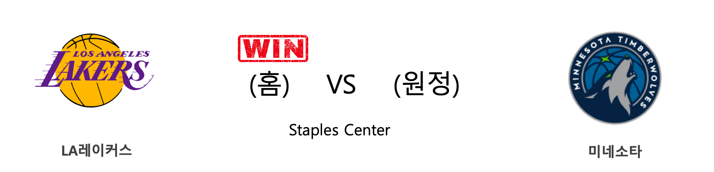

####  마이애미(홈) VS 시카고(원정) 

<table class="tg">
  <tr>
    <th class="tg-rr9t">MIA</th>
    <th class="tg-rr9t">팀</th>
    <th class="tg-rr9t">CHI</th>
  </tr>
  <tr>
    <td class="tg-dcpn">2승 0패</td>
    <td class="tg-rr9t">시즌 상대전적</td>
    <td class="tg-dcpn">0승 2패</td>
  </tr>
  <tr>
    <td class="tg-dcpn">110</td>
    <td class="tg-rr9t">점수</td>
    <td class="tg-dcpn">105</td>
  </tr>
  <tr>
    <td class="tg-dcpn">21/42(50%)</td>
    <td class="tg-rr9t">2점(%)</td>
    <td class="tg-dcpn">22/44(50%)</td>
  </tr>
  <tr>
    <td class="tg-dcpn">11/35(31%)</td>
    <td class="tg-rr9t">3점(%)</td>
    <td class="tg-dcpn">13/36(36%)</td>
  </tr>
  <tr>
    <td class="tg-dcpn">35/44(80%)</td>
    <td class="tg-rr9t">자유투(%)</td>
    <td class="tg-dcpn">22/27(81%)</td>
  </tr>
  <tr>
    <td class="tg-dcpn">43</td>
    <td class="tg-rr9t">리바운드</td>
    <td class="tg-dcpn">39</td>
  </tr>
  <tr>
    <td class="tg-dcpn">20</td>
    <td class="tg-rr9t">어시스트</td>
    <td class="tg-dcpn">20</td>
  </tr>
  <tr>
    <td class="tg-dcpn">9</td>
    <td class="tg-rr9t">스틸</td>
    <td class="tg-dcpn">8</td>
  </tr>
  <tr>
    <td class="tg-dcpn">2</td>
    <td class="tg-rr9t">블록</td>
    <td class="tg-dcpn">1</td>
  </tr>
  <tr>
    <td class="tg-dcpn">17</td>
    <td class="tg-rr9t">턴오버</td>
    <td class="tg-dcpn">14</td>
  </tr>
  <tr>
    <td class="tg-dcpn">JimmyButlerF(23) TylerHerro(27) KendrickNunnG(18) BamAdebayoF(21)</td>
    <td class="tg-rr9t">주요 득점선수</td>
    <td class="tg-dcpn">KrisDunnF(16) LauriMarkkane(22) ZachLaVineG(18)</td>
  </tr>
</table>

#### 경기 관련 주요 기사         

[[오늘의 NBA] (12/9) 앤써니 데이비스, 구단 역사에 이름을 남기다](http://sports.news.naver.com/basketball/news/read.nhn?oid=486&aid=0000001161)

[[오늘의 NBA] (11/30) 인디애나, 동부컨퍼런스의 복병](http://sports.news.naver.com/basketball/news/read.nhn?oid=486&aid=0000001152)

[[오늘의 NBA] (12/7) 르브론 제임스, 멜로(carmelo) 드라마의 주인공](http://sports.news.naver.com/basketball/news/read.nhn?oid=486&aid=0000001159)

[[오늘의 NBA] (12/4) 샌안토니오, 괄육취골 승리를 거두다](http://sports.news.naver.com/basketball/news/read.nhn?oid=486&aid=0000001156)

[[오늘의 NBA] (12/5) 밀워키, 시스템 농구 정점에 도달하다](http://sports.news.naver.com/basketball/news/read.nhn?oid=486&aid=0000001157)

        
        

####  워싱턴(홈) VS LA클리퍼스(원정) 

<table class="tg">
  <tr>
    <th class="tg-rr9t">WAS</th>
    <th class="tg-rr9t">팀</th>
    <th class="tg-rr9t">LAC</th>
  </tr>
  <tr>
    <td class="tg-dcpn">0승 2패</td>
    <td class="tg-rr9t">시즌 상대전적</td>
    <td class="tg-dcpn">2승 0패</td>
  </tr>
  <tr>
    <td class="tg-dcpn">119</td>
    <td class="tg-rr9t">점수</td>
    <td class="tg-dcpn">135</td>
  </tr>
  <tr>
    <td class="tg-dcpn">26/55(47%)</td>
    <td class="tg-rr9t">2점(%)</td>
    <td class="tg-dcpn">35/56(62%)</td>
  </tr>
  <tr>
    <td class="tg-dcpn">14/33(42%)</td>
    <td class="tg-rr9t">3점(%)</td>
    <td class="tg-dcpn">15/40(38%)</td>
  </tr>
  <tr>
    <td class="tg-dcpn">25/30(83%)</td>
    <td class="tg-rr9t">자유투(%)</td>
    <td class="tg-dcpn">20/27(74%)</td>
  </tr>
  <tr>
    <td class="tg-dcpn">38</td>
    <td class="tg-rr9t">리바운드</td>
    <td class="tg-dcpn">45</td>
  </tr>
  <tr>
    <td class="tg-dcpn">28</td>
    <td class="tg-rr9t">어시스트</td>
    <td class="tg-dcpn">27</td>
  </tr>
  <tr>
    <td class="tg-dcpn">5</td>
    <td class="tg-rr9t">스틸</td>
    <td class="tg-dcpn">8</td>
  </tr>
  <tr>
    <td class="tg-dcpn">3</td>
    <td class="tg-rr9t">블록</td>
    <td class="tg-dcpn">4</td>
  </tr>
  <tr>
    <td class="tg-dcpn">13</td>
    <td class="tg-rr9t">턴오버</td>
    <td class="tg-dcpn">10</td>
  </tr>
  <tr>
    <td class="tg-dcpn">BradleyBealG(20) TroyBrownJr.(22) RuiHachimuraF(17) DavisBertans(25)</td>
    <td class="tg-rr9t">주요 득점선수</td>
    <td class="tg-dcpn">KawhiLeonardF(34) LouWilliams(18) PaulGeorgeG(27) MontrezlHarre(20)</td>
  </tr>
</table>

#### 경기 관련 주요 기사         

[Paris Might Be the Best City for Italian Food (Outside Italy)](https://www.nytimes.com/2019/12/04/travel/Italian-food-in-Paris.html?partner=naver)

[[오늘의 NBA] (12/7) 르브론 제임스, 멜로(carmelo) 드라마의 주인공](http://sports.news.naver.com/basketball/news/read.nhn?oid=486&aid=0000001159)

[[오늘의 NBA] (12/4) 샌안토니오, 괄육취골 승리를 거두다](http://sports.news.naver.com/basketball/news/read.nhn?oid=486&aid=0000001156)

[[오늘의 NBA] (12/5) 밀워키, 시스템 농구 정점에 도달하다](http://sports.news.naver.com/basketball/news/read.nhn?oid=486&aid=0000001157)

[[오늘의 NBA] (11/30) 인디애나, 동부컨퍼런스의 복병](http://sports.news.naver.com/basketball/news/read.nhn?oid=486&aid=0000001152)

        
        

####  필라델피아(홈) VS 토론토(원정) 

<table class="tg">
  <tr>
    <th class="tg-rr9t">PHI</th>
    <th class="tg-rr9t">팀</th>
    <th class="tg-rr9t">TOR</th>
  </tr>
  <tr>
    <td class="tg-dcpn">1승 1패</td>
    <td class="tg-rr9t">시즌 상대전적</td>
    <td class="tg-dcpn">1승 1패</td>
  </tr>
  <tr>
    <td class="tg-dcpn">110</td>
    <td class="tg-rr9t">점수</td>
    <td class="tg-dcpn">104</td>
  </tr>
  <tr>
    <td class="tg-dcpn">26/47(55%)</td>
    <td class="tg-rr9t">2점(%)</td>
    <td class="tg-dcpn">27/55(49%)</td>
  </tr>
  <tr>
    <td class="tg-dcpn">14/32(44%)</td>
    <td class="tg-rr9t">3점(%)</td>
    <td class="tg-dcpn">11/33(33%)</td>
  </tr>
  <tr>
    <td class="tg-dcpn">16/21(76%)</td>
    <td class="tg-rr9t">자유투(%)</td>
    <td class="tg-dcpn">17/20(85%)</td>
  </tr>
  <tr>
    <td class="tg-dcpn">40</td>
    <td class="tg-rr9t">리바운드</td>
    <td class="tg-dcpn">42</td>
  </tr>
  <tr>
    <td class="tg-dcpn">31</td>
    <td class="tg-rr9t">어시스트</td>
    <td class="tg-dcpn">21</td>
  </tr>
  <tr>
    <td class="tg-dcpn">7</td>
    <td class="tg-rr9t">스틸</td>
    <td class="tg-dcpn">12</td>
  </tr>
  <tr>
    <td class="tg-dcpn">5</td>
    <td class="tg-rr9t">블록</td>
    <td class="tg-dcpn">4</td>
  </tr>
  <tr>
    <td class="tg-dcpn">17</td>
    <td class="tg-rr9t">턴오버</td>
    <td class="tg-dcpn">17</td>
  </tr>
  <tr>
    <td class="tg-dcpn">MatisseThybul(20) TobiasHarrisF(26) BenSimmonsG(16)</td>
    <td class="tg-rr9t">주요 득점선수</td>
    <td class="tg-dcpn">OGAnunobyF(19) KyleLowryG(26) PascalSiakamF(16)</td>
  </tr>
</table>

#### 경기 관련 주요 기사         

[[오늘의 NBA] (12/4) 샌안토니오, 괄육취골 승리를 거두다](http://sports.news.naver.com/basketball/news/read.nhn?oid=486&aid=0000001156)

[[오늘의 NBA] (12/1) 새크라멘토의 IQ 농구](http://sports.news.naver.com/basketball/news/read.nhn?oid=486&aid=0000001153)

[[오늘의 NBA] (12/8) 뉴욕, NBA의 방랑자](http://sports.news.naver.com/basketball/news/read.nhn?oid=486&aid=0000001160)

[[오늘의 NBA] (12/6) 마이크 댄토니, 토론토 수비를 농락하다](http://sports.news.naver.com/basketball/news/read.nhn?oid=486&aid=0000001158)

[[오늘의 NBA] (12/9) 앤써니 데이비스, 구단 역사에 이름을 남기다](http://sports.news.naver.com/basketball/news/read.nhn?oid=486&aid=0000001161)

        
        

####  LA레이커스(홈) VS 미네소타(원정) 

<table class="tg">
  <tr>
    <th class="tg-rr9t">LAL</th>
    <th class="tg-rr9t">팀</th>
    <th class="tg-rr9t">MIN</th>
  </tr>
  <tr>
    <td class="tg-dcpn">1승 0패</td>
    <td class="tg-rr9t">시즌 상대전적</td>
    <td class="tg-dcpn">0승 1패</td>
  </tr>
  <tr>
    <td class="tg-dcpn">142</td>
    <td class="tg-rr9t">점수</td>
    <td class="tg-dcpn">125</td>
  </tr>
  <tr>
    <td class="tg-dcpn">41/63(65%)</td>
    <td class="tg-rr9t">2점(%)</td>
    <td class="tg-dcpn">29/48(60%)</td>
  </tr>
  <tr>
    <td class="tg-dcpn">14/31(45%)</td>
    <td class="tg-rr9t">3점(%)</td>
    <td class="tg-dcpn">15/37(41%)</td>
  </tr>
  <tr>
    <td class="tg-dcpn">18/20(90%)</td>
    <td class="tg-rr9t">자유투(%)</td>
    <td class="tg-dcpn">22/26(85%)</td>
  </tr>
  <tr>
    <td class="tg-dcpn">41</td>
    <td class="tg-rr9t">리바운드</td>
    <td class="tg-dcpn">33</td>
  </tr>
  <tr>
    <td class="tg-dcpn">32</td>
    <td class="tg-rr9t">어시스트</td>
    <td class="tg-dcpn">27</td>
  </tr>
  <tr>
    <td class="tg-dcpn">9</td>
    <td class="tg-rr9t">스틸</td>
    <td class="tg-dcpn">5</td>
  </tr>
  <tr>
    <td class="tg-dcpn">1</td>
    <td class="tg-rr9t">블록</td>
    <td class="tg-dcpn">6</td>
  </tr>
  <tr>
    <td class="tg-dcpn">10</td>
    <td class="tg-rr9t">턴오버</td>
    <td class="tg-dcpn">15</td>
  </tr>
  <tr>
    <td class="tg-dcpn">AlexCaruso(16) AnthonyDavisF(50) LeBronJamesF(32)</td>
    <td class="tg-rr9t">주요 득점선수</td>
    <td class="tg-dcpn">JoshOkogieF(18) RobertCovingt(16) AndrewWiggins(19) Karl-AnthonyT(19)</td>
  </tr>
</table>

#### 경기 관련 주요 기사         

[[오늘의 NBA] (12/7) 르브론 제임스, 멜로(carmelo) 드라마의 주인공](http://sports.news.naver.com/basketball/news/read.nhn?oid=486&aid=0000001159)

[[오늘의 NBA] (12/9) 앤써니 데이비스, 구단 역사에 이름을 남기다](http://sports.news.naver.com/basketball/news/read.nhn?oid=486&aid=0000001161)

[[오늘의 NBA] (12/2) 토론토, 두 마리 토끼를 노린다!](http://sports.news.naver.com/basketball/news/read.nhn?oid=486&aid=0000001154)

[[오늘의 NBA] (12/4) 샌안토니오, 괄육취골 승리를 거두다](http://sports.news.naver.com/basketball/news/read.nhn?oid=486&aid=0000001156)

[[오늘의 NBA] (12/5) 밀워키, 시스템 농구 정점에 도달하다](http://sports.news.naver.com/basketball/news/read.nhn?oid=486&aid=0000001157)

        
        

####  샬럿(홈) VS 애틀랜타(원정) 

<table class="tg">
  <tr>
    <th class="tg-rr9t">CHA</th>
    <th class="tg-rr9t">팀</th>
    <th class="tg-rr9t">ATL</th>
  </tr>
  <tr>
    <td class="tg-dcpn">0승 1패</td>
    <td class="tg-rr9t">시즌 상대전적</td>
    <td class="tg-dcpn">1승 0패</td>
  </tr>
  <tr>
    <td class="tg-dcpn">107</td>
    <td class="tg-rr9t">점수</td>
    <td class="tg-dcpn">122</td>
  </tr>
  <tr>
    <td class="tg-dcpn">25/59(42%)</td>
    <td class="tg-rr9t">2점(%)</td>
    <td class="tg-dcpn">26/46(57%)</td>
  </tr>
  <tr>
    <td class="tg-dcpn">11/31(35%)</td>
    <td class="tg-rr9t">3점(%)</td>
    <td class="tg-dcpn">18/45(40%)</td>
  </tr>
  <tr>
    <td class="tg-dcpn">24/29(83%)</td>
    <td class="tg-rr9t">자유투(%)</td>
    <td class="tg-dcpn">16/17(94%)</td>
  </tr>
  <tr>
    <td class="tg-dcpn">44</td>
    <td class="tg-rr9t">리바운드</td>
    <td class="tg-dcpn">48</td>
  </tr>
  <tr>
    <td class="tg-dcpn">22</td>
    <td class="tg-rr9t">어시스트</td>
    <td class="tg-dcpn">28</td>
  </tr>
  <tr>
    <td class="tg-dcpn">8</td>
    <td class="tg-rr9t">스틸</td>
    <td class="tg-dcpn">8</td>
  </tr>
  <tr>
    <td class="tg-dcpn">3</td>
    <td class="tg-rr9t">블록</td>
    <td class="tg-dcpn">8</td>
  </tr>
  <tr>
    <td class="tg-dcpn">11</td>
    <td class="tg-rr9t">턴오버</td>
    <td class="tg-dcpn">13</td>
  </tr>
  <tr>
    <td class="tg-dcpn">P.J.Washingto(20) MilesBridgesF(20)</td>
    <td class="tg-rr9t">주요 득점선수</td>
    <td class="tg-dcpn">TraeYoungG(30) JabariParkerF(19) VinceCarter(17)</td>
  </tr>
</table>

#### 경기 관련 주요 기사         

[[오늘의 NBA] (11/17) 샬럿, 설계된 플레이 연출의 달인](http://sports.news.naver.com/basketball/news/read.nhn?oid=486&aid=0000001140)

[[오늘의 NBA] (11/28) 앤써니 데이비스, 노란 셔츠를 입은 사나이](http://sports.news.naver.com/basketball/news/read.nhn?oid=486&aid=0000001151)

[[오늘의 NBA] (12/3) 켈리 우브레 주니어, 피닉스의 터프가이](http://sports.news.naver.com/basketball/news/read.nhn?oid=486&aid=0000001155)

[[오늘의 NBA] (11/30) 인디애나, 동부컨퍼런스의 복병](http://sports.news.naver.com/basketball/news/read.nhn?oid=486&aid=0000001152)

[[오늘의 NBA] (12/9) 앤써니 데이비스, 구단 역사에 이름을 남기다](http://sports.news.naver.com/basketball/news/read.nhn?oid=486&aid=0000001161)

        
        

####  포틀랜드(홈) VS 오클라호마씨티(원정) 

<table class="tg">
  <tr>
    <th class="tg-rr9t">POR</th>
    <th class="tg-rr9t">팀</th>
    <th class="tg-rr9t">OKC</th>
  </tr>
  <tr>
    <td class="tg-dcpn">2승 1패</td>
    <td class="tg-rr9t">시즌 상대전적</td>
    <td class="tg-dcpn">1승 2패</td>
  </tr>
  <tr>
    <td class="tg-dcpn">96</td>
    <td class="tg-rr9t">점수</td>
    <td class="tg-dcpn">108</td>
  </tr>
  <tr>
    <td class="tg-dcpn">27/67(40%)</td>
    <td class="tg-rr9t">2점(%)</td>
    <td class="tg-dcpn">24/53(45%)</td>
  </tr>
  <tr>
    <td class="tg-dcpn">9/33(27%)</td>
    <td class="tg-rr9t">3점(%)</td>
    <td class="tg-dcpn">11/32(34%)</td>
  </tr>
  <tr>
    <td class="tg-dcpn">15/18(83%)</td>
    <td class="tg-rr9t">자유투(%)</td>
    <td class="tg-dcpn">27/34(79%)</td>
  </tr>
  <tr>
    <td class="tg-dcpn">51</td>
    <td class="tg-rr9t">리바운드</td>
    <td class="tg-dcpn">54</td>
  </tr>
  <tr>
    <td class="tg-dcpn">16</td>
    <td class="tg-rr9t">어시스트</td>
    <td class="tg-dcpn">12</td>
  </tr>
  <tr>
    <td class="tg-dcpn">7</td>
    <td class="tg-rr9t">스틸</td>
    <td class="tg-dcpn">7</td>
  </tr>
  <tr>
    <td class="tg-dcpn">8</td>
    <td class="tg-rr9t">블록</td>
    <td class="tg-dcpn">2</td>
  </tr>
  <tr>
    <td class="tg-dcpn">8</td>
    <td class="tg-rr9t">턴오버</td>
    <td class="tg-dcpn">10</td>
  </tr>
  <tr>
    <td class="tg-dcpn">DamianLillard(26) CJMcCollumG(20)</td>
    <td class="tg-rr9t">주요 득점선수</td>
    <td class="tg-dcpn">ShaiGilgeous-(21) DennisSchrode(21) ChrisPaulG(20)</td>
  </tr>
</table>

#### 경기 관련 주요 기사         

[[오늘의 NBA] (11/30) 인디애나, 동부컨퍼런스의 복병](http://sports.news.naver.com/basketball/news/read.nhn?oid=486&aid=0000001152)

[[오늘의 NBA] (12/9) 앤써니 데이비스, 구단 역사에 이름을 남기다](http://sports.news.naver.com/basketball/news/read.nhn?oid=486&aid=0000001161)

[[오늘의 NBA] (12/2) 토론토, 두 마리 토끼를 노린다!](http://sports.news.naver.com/basketball/news/read.nhn?oid=486&aid=0000001154)

[[오늘의 NBA] (11/26) 마크 가솔, 조엘 엠비드의 영원한 악몽](http://sports.news.naver.com/basketball/news/read.nhn?oid=486&aid=0000001149)

[[오늘의 NBA] (11/28) 앤써니 데이비스, 노란 셔츠를 입은 사나이](http://sports.news.naver.com/basketball/news/read.nhn?oid=486&aid=0000001151)

        
        

####  브루클린(홈) VS 덴버(원정) 

<table class="tg">
  <tr>
    <th class="tg-rr9t">BKN</th>
    <th class="tg-rr9t">팀</th>
    <th class="tg-rr9t">DEN</th>
  </tr>
  <tr>
    <td class="tg-dcpn">1승 1패</td>
    <td class="tg-rr9t">시즌 상대전적</td>
    <td class="tg-dcpn">1승 1패</td>
  </tr>
  <tr>
    <td class="tg-dcpn">105</td>
    <td class="tg-rr9t">점수</td>
    <td class="tg-dcpn">102</td>
  </tr>
  <tr>
    <td class="tg-dcpn">33/59(56%)</td>
    <td class="tg-rr9t">2점(%)</td>
    <td class="tg-dcpn">18/47(38%)</td>
  </tr>
  <tr>
    <td class="tg-dcpn">7/28(25%)</td>
    <td class="tg-rr9t">3점(%)</td>
    <td class="tg-dcpn">18/42(43%)</td>
  </tr>
  <tr>
    <td class="tg-dcpn">18/23(78%)</td>
    <td class="tg-rr9t">자유투(%)</td>
    <td class="tg-dcpn">12/14(86%)</td>
  </tr>
  <tr>
    <td class="tg-dcpn">48</td>
    <td class="tg-rr9t">리바운드</td>
    <td class="tg-dcpn">37</td>
  </tr>
  <tr>
    <td class="tg-dcpn">25</td>
    <td class="tg-rr9t">어시스트</td>
    <td class="tg-dcpn">25</td>
  </tr>
  <tr>
    <td class="tg-dcpn">5</td>
    <td class="tg-rr9t">스틸</td>
    <td class="tg-dcpn">4</td>
  </tr>
  <tr>
    <td class="tg-dcpn">1</td>
    <td class="tg-rr9t">블록</td>
    <td class="tg-dcpn">5</td>
  </tr>
  <tr>
    <td class="tg-dcpn">11</td>
    <td class="tg-rr9t">턴오버</td>
    <td class="tg-dcpn">12</td>
  </tr>
  <tr>
    <td class="tg-dcpn">JarrettAllenC(19) GarrettTemple(15) SpencerDinwid(24)</td>
    <td class="tg-rr9t">주요 득점선수</td>
    <td class="tg-dcpn">JeramiGrant(15) JamalMurrayG(21) NikolaJokicC(24)</td>
  </tr>
</table>

#### 경기 관련 주요 기사         

[[오늘의 NBA] (12/5) 밀워키, 시스템 농구 정점에 도달하다](http://sports.news.naver.com/basketball/news/read.nhn?oid=486&aid=0000001157)

[[오늘의 NBA] (12/7) 르브론 제임스, 멜로(carmelo) 드라마의 주인공](http://sports.news.naver.com/basketball/news/read.nhn?oid=486&aid=0000001159)

[[오늘의 NBA] (12/6) 마이크 댄토니, 토론토 수비를 농락하다](http://sports.news.naver.com/basketball/news/read.nhn?oid=486&aid=0000001158)

[[오늘의 NBA] (12/9) 앤써니 데이비스, 구단 역사에 이름을 남기다](http://sports.news.naver.com/basketball/news/read.nhn?oid=486&aid=0000001161)

[[오늘의 NBA] (12/2) 토론토, 두 마리 토끼를 노린다!](http://sports.news.naver.com/basketball/news/read.nhn?oid=486&aid=0000001154)

        
        

####  댈러스(홈) VS 새크라멘토(원정) 

<table class="tg">
  <tr>
    <th class="tg-rr9t">DAL</th>
    <th class="tg-rr9t">팀</th>
    <th class="tg-rr9t">SAC</th>
  </tr>
  <tr>
    <td class="tg-dcpn">0승 1패</td>
    <td class="tg-rr9t">시즌 상대전적</td>
    <td class="tg-dcpn">1승 0패</td>
  </tr>
  <tr>
    <td class="tg-dcpn">106</td>
    <td class="tg-rr9t">점수</td>
    <td class="tg-dcpn">110</td>
  </tr>
  <tr>
    <td class="tg-dcpn">24/42(57%)</td>
    <td class="tg-rr9t">2점(%)</td>
    <td class="tg-dcpn">31/51(61%)</td>
  </tr>
  <tr>
    <td class="tg-dcpn">17/44(39%)</td>
    <td class="tg-rr9t">3점(%)</td>
    <td class="tg-dcpn">13/34(38%)</td>
  </tr>
  <tr>
    <td class="tg-dcpn">7/8(88%)</td>
    <td class="tg-rr9t">자유투(%)</td>
    <td class="tg-dcpn">9/11(82%)</td>
  </tr>
  <tr>
    <td class="tg-dcpn">40</td>
    <td class="tg-rr9t">리바운드</td>
    <td class="tg-dcpn">35</td>
  </tr>
  <tr>
    <td class="tg-dcpn">24</td>
    <td class="tg-rr9t">어시스트</td>
    <td class="tg-dcpn">24</td>
  </tr>
  <tr>
    <td class="tg-dcpn">3</td>
    <td class="tg-rr9t">스틸</td>
    <td class="tg-dcpn">7</td>
  </tr>
  <tr>
    <td class="tg-dcpn">1</td>
    <td class="tg-rr9t">블록</td>
    <td class="tg-dcpn">1</td>
  </tr>
  <tr>
    <td class="tg-dcpn">12</td>
    <td class="tg-rr9t">턴오버</td>
    <td class="tg-dcpn">8</td>
  </tr>
  <tr>
    <td class="tg-dcpn">LukaDoncicG(27) TimHardawayJr(29)</td>
    <td class="tg-rr9t">주요 득점선수</td>
    <td class="tg-dcpn">NemanjaBjelic(30) BuddyHieldG(26)</td>
  </tr>
</table>

#### 경기 관련 주요 기사         

[[오늘의 NBA] (11/30) 인디애나, 동부컨퍼런스의 복병](http://sports.news.naver.com/basketball/news/read.nhn?oid=486&aid=0000001152)

[[오늘의 NBA] (12/8) 뉴욕, NBA의 방랑자](http://sports.news.naver.com/basketball/news/read.nhn?oid=486&aid=0000001160)

[[오늘의 NBA] (12/4) 샌안토니오, 괄육취골 승리를 거두다](http://sports.news.naver.com/basketball/news/read.nhn?oid=486&aid=0000001156)

[[오늘의 NBA] (12/5) 밀워키, 시스템 농구 정점에 도달하다](http://sports.news.naver.com/basketball/news/read.nhn?oid=486&aid=0000001157)

[[오늘의 NBA] (12/9) 앤써니 데이비스, 구단 역사에 이름을 남기다](http://sports.news.naver.com/basketball/news/read.nhn?oid=486&aid=0000001161)

        
        

#### 리그 (Eastern) 순위
    

<table class="tg">
  <tr>
    <th class="tg-d14o">순위</th>
    <th class="tg-d14o">팀명</th>
    <th class="tg-d14o">경기수</th>
    <th class="tg-d14o">승</th>
    <th class="tg-d14o">패</th>
    <th class="tg-d14o">승차</th>
    <th class="tg-d14o">승률</th>
  </tr>
  
<tr>
    <td class="tg-50j8">1</td>
    <td class="tg-50j8">MIL</td>
    <td class="tg-50j8">23</td>
    <td class="tg-50j8">20</td>
    <td class="tg-50j8">3</td>
    <td class="tg-50j8">1</td>
    <td class="tg-50j8">0.87</td>
</tr>

<tr>
    <td class="tg-50j8">2</td>
    <td class="tg-50j8">MIA</td>
    <td class="tg-50j8">23</td>
    <td class="tg-50j8">17</td>
    <td class="tg-50j8">6</td>
    <td class="tg-50j8">4</td>
    <td class="tg-50j8">0.739</td>
</tr>

<tr>
    <td class="tg-50j8">3</td>
    <td class="tg-50j8">PHI</td>
    <td class="tg-50j8">24</td>
    <td class="tg-50j8">17</td>
    <td class="tg-50j8">7</td>
    <td class="tg-50j8">4</td>
    <td class="tg-50j8">0.708</td>
</tr>

<tr>
    <td class="tg-50j8">4</td>
    <td class="tg-50j8">BOS</td>
    <td class="tg-50j8">21</td>
    <td class="tg-50j8">16</td>
    <td class="tg-50j8">5</td>
    <td class="tg-50j8">5</td>
    <td class="tg-50j8">0.762</td>
</tr>

<tr>
    <td class="tg-50j8">5</td>
    <td class="tg-50j8">TOR</td>
    <td class="tg-50j8">22</td>
    <td class="tg-50j8">15</td>
    <td class="tg-50j8">7</td>
    <td class="tg-50j8">6</td>
    <td class="tg-50j8">0.682</td>
</tr>

<tr>
    <td class="tg-50j8">6</td>
    <td class="tg-50j8">IND</td>
    <td class="tg-50j8">23</td>
    <td class="tg-50j8">15</td>
    <td class="tg-50j8">8</td>
    <td class="tg-50j8">6</td>
    <td class="tg-50j8">0.652</td>
</tr>

<tr>
    <td class="tg-50j8">7</td>
    <td class="tg-50j8">BKN</td>
    <td class="tg-50j8">23</td>
    <td class="tg-50j8">13</td>
    <td class="tg-50j8">10</td>
    <td class="tg-50j8">8</td>
    <td class="tg-50j8">0.565</td>
</tr>

<tr>
    <td class="tg-50j8">8</td>
    <td class="tg-50j8">ORL</td>
    <td class="tg-50j8">22</td>
    <td class="tg-50j8">11</td>
    <td class="tg-50j8">11</td>
    <td class="tg-50j8">10</td>
    <td class="tg-50j8">0.5</td>
</tr>

<tr>
    <td class="tg-50j8">9</td>
    <td class="tg-50j8">DET</td>
    <td class="tg-50j8">23</td>
    <td class="tg-50j8">9</td>
    <td class="tg-50j8">14</td>
    <td class="tg-50j8">12</td>
    <td class="tg-50j8">0.391</td>
</tr>

<tr>
    <td class="tg-50j8">10</td>
    <td class="tg-50j8">CHA</td>
    <td class="tg-50j8">25</td>
    <td class="tg-50j8">9</td>
    <td class="tg-50j8">16</td>
    <td class="tg-50j8">12</td>
    <td class="tg-50j8">0.36</td>
</tr>

<tr>
    <td class="tg-50j8">11</td>
    <td class="tg-50j8">CHI</td>
    <td class="tg-50j8">24</td>
    <td class="tg-50j8">8</td>
    <td class="tg-50j8">16</td>
    <td class="tg-50j8">13</td>
    <td class="tg-50j8">0.333</td>
</tr>

<tr>
    <td class="tg-50j8">12</td>
    <td class="tg-50j8">WAS</td>
    <td class="tg-50j8">22</td>
    <td class="tg-50j8">7</td>
    <td class="tg-50j8">15</td>
    <td class="tg-50j8">14</td>
    <td class="tg-50j8">0.318</td>
</tr>

<tr>
    <td class="tg-50j8">13</td>
    <td class="tg-50j8">ATL</td>
    <td class="tg-50j8">23</td>
    <td class="tg-50j8">6</td>
    <td class="tg-50j8">17</td>
    <td class="tg-50j8">15</td>
    <td class="tg-50j8">0.261</td>
</tr>

<tr>
    <td class="tg-50j8">14</td>
    <td class="tg-50j8">CLE</td>
    <td class="tg-50j8">22</td>
    <td class="tg-50j8">5</td>
    <td class="tg-50j8">17</td>
    <td class="tg-50j8">16</td>
    <td class="tg-50j8">0.227</td>
</tr>

<tr>
    <td class="tg-50j8">15</td>
    <td class="tg-50j8">NYK</td>
    <td class="tg-50j8">23</td>
    <td class="tg-50j8">4</td>
    <td class="tg-50j8">19</td>
    <td class="tg-50j8">17</td>
    <td class="tg-50j8">0.174</td>
</tr>
</table> 
#### 리그 (Western) 순위
    

<table class="tg">
  <tr>
    <th class="tg-d14o">순위</th>
    <th class="tg-d14o">팀명</th>
    <th class="tg-d14o">경기수</th>
    <th class="tg-d14o">승</th>
    <th class="tg-d14o">패</th>
    <th class="tg-d14o">승차</th>
    <th class="tg-d14o">승률</th>
  </tr>
  
<tr>
    <td class="tg-50j8">1</td>
    <td class="tg-50j8">LAL</td>
    <td class="tg-50j8">24</td>
    <td class="tg-50j8">21</td>
    <td class="tg-50j8">3</td>
    <td class="tg-50j8">0</td>
    <td class="tg-50j8">0.875</td>
</tr>

<tr>
    <td class="tg-50j8">2</td>
    <td class="tg-50j8">LAC</td>
    <td class="tg-50j8">24</td>
    <td class="tg-50j8">17</td>
    <td class="tg-50j8">7</td>
    <td class="tg-50j8">4</td>
    <td class="tg-50j8">0.708</td>
</tr>

<tr>
    <td class="tg-50j8">3</td>
    <td class="tg-50j8">DAL</td>
    <td class="tg-50j8">23</td>
    <td class="tg-50j8">16</td>
    <td class="tg-50j8">7</td>
    <td class="tg-50j8">5</td>
    <td class="tg-50j8">0.696</td>
</tr>

<tr>
    <td class="tg-50j8">4</td>
    <td class="tg-50j8">HOU</td>
    <td class="tg-50j8">22</td>
    <td class="tg-50j8">15</td>
    <td class="tg-50j8">7</td>
    <td class="tg-50j8">6</td>
    <td class="tg-50j8">0.682</td>
</tr>

<tr>
    <td class="tg-50j8">5</td>
    <td class="tg-50j8">DEN</td>
    <td class="tg-50j8">21</td>
    <td class="tg-50j8">14</td>
    <td class="tg-50j8">7</td>
    <td class="tg-50j8">7</td>
    <td class="tg-50j8">0.667</td>
</tr>

<tr>
    <td class="tg-50j8">6</td>
    <td class="tg-50j8">UTA</td>
    <td class="tg-50j8">23</td>
    <td class="tg-50j8">13</td>
    <td class="tg-50j8">10</td>
    <td class="tg-50j8">8</td>
    <td class="tg-50j8">0.565</td>
</tr>

<tr>
    <td class="tg-50j8">7</td>
    <td class="tg-50j8">MIN</td>
    <td class="tg-50j8">22</td>
    <td class="tg-50j8">10</td>
    <td class="tg-50j8">12</td>
    <td class="tg-50j8">11</td>
    <td class="tg-50j8">0.455</td>
</tr>

<tr>
    <td class="tg-50j8">7</td>
    <td class="tg-50j8">PHX</td>
    <td class="tg-50j8">22</td>
    <td class="tg-50j8">10</td>
    <td class="tg-50j8">12</td>
    <td class="tg-50j8">11</td>
    <td class="tg-50j8">0.455</td>
</tr>

<tr>
    <td class="tg-50j8">7</td>
    <td class="tg-50j8">OKC</td>
    <td class="tg-50j8">22</td>
    <td class="tg-50j8">10</td>
    <td class="tg-50j8">12</td>
    <td class="tg-50j8">11</td>
    <td class="tg-50j8">0.455</td>
</tr>

<tr>
    <td class="tg-50j8">10</td>
    <td class="tg-50j8">SAC</td>
    <td class="tg-50j8">22</td>
    <td class="tg-50j8">9</td>
    <td class="tg-50j8">13</td>
    <td class="tg-50j8">12</td>
    <td class="tg-50j8">0.409</td>
</tr>

<tr>
    <td class="tg-50j8">11</td>
    <td class="tg-50j8">SAS</td>
    <td class="tg-50j8">23</td>
    <td class="tg-50j8">9</td>
    <td class="tg-50j8">14</td>
    <td class="tg-50j8">12</td>
    <td class="tg-50j8">0.391</td>
</tr>

<tr>
    <td class="tg-50j8">12</td>
    <td class="tg-50j8">POR</td>
    <td class="tg-50j8">24</td>
    <td class="tg-50j8">9</td>
    <td class="tg-50j8">15</td>
    <td class="tg-50j8">12</td>
    <td class="tg-50j8">0.375</td>
</tr>

<tr>
    <td class="tg-50j8">13</td>
    <td class="tg-50j8">MEM</td>
    <td class="tg-50j8">22</td>
    <td class="tg-50j8">6</td>
    <td class="tg-50j8">16</td>
    <td class="tg-50j8">15</td>
    <td class="tg-50j8">0.273</td>
</tr>

<tr>
    <td class="tg-50j8">14</td>
    <td class="tg-50j8">NOP</td>
    <td class="tg-50j8">23</td>
    <td class="tg-50j8">6</td>
    <td class="tg-50j8">17</td>
    <td class="tg-50j8">15</td>
    <td class="tg-50j8">0.261</td>
</tr>

<tr>
    <td class="tg-50j8">15</td>
    <td class="tg-50j8">GSW</td>
    <td class="tg-50j8">24</td>
    <td class="tg-50j8">5</td>
    <td class="tg-50j8">19</td>
    <td class="tg-50j8">16</td>
    <td class="tg-50j8">0.208</td>
</tr>
</table> 

        
        
#nba #미국농구 #엔비에이 #농구분석 #토토 #스포츠토토 #경기예측 #농구결과 #20191209 #마이애미 #시카고 #워싱턴 #LA클리퍼스 #필라델피아 #토론토 #LA레이커스 #미네소타 #샬럿 #애틀랜타 #포틀랜드 #오클라호마씨티 #브루클린 #덴버 #댈러스 #새크라멘토 #마이애미시카고 #워싱턴LA클리퍼스 #필라델피아토론토 #LA레이커스미네소타 #샬럿애틀랜타 #포틀랜드오클라호마씨티 #브루클린덴버 #댈러스새크라멘토 