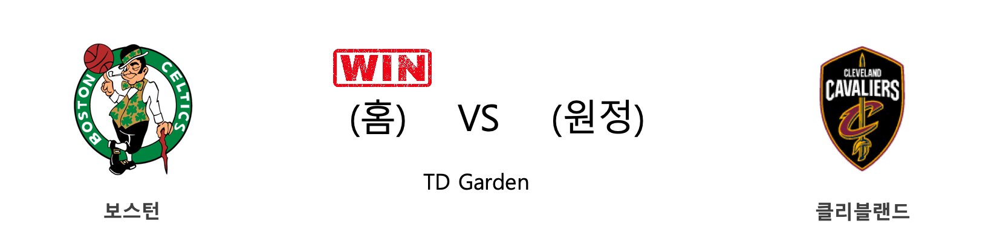

####  유타(홈) VS 오클라호마씨티(원정) 

<table class="tg">
  <tr>
    <th class="tg-rr9t">UTA</th>
    <th class="tg-rr9t">팀</th>
    <th class="tg-rr9t">OKC</th>
  </tr>
  <tr>
    <td class="tg-dcpn">1승 1패</td>
    <td class="tg-rr9t">시즌 상대전적</td>
    <td class="tg-dcpn">1승 1패</td>
  </tr>
  <tr>
    <td class="tg-dcpn">90</td>
    <td class="tg-rr9t">점수</td>
    <td class="tg-dcpn">104</td>
  </tr>
  <tr>
    <td class="tg-dcpn">28/58(48%)</td>
    <td class="tg-rr9t">2점(%)</td>
    <td class="tg-dcpn">32/57(56%)</td>
  </tr>
  <tr>
    <td class="tg-dcpn">8/31(26%)</td>
    <td class="tg-rr9t">3점(%)</td>
    <td class="tg-dcpn">8/28(29%)</td>
  </tr>
  <tr>
    <td class="tg-dcpn">10/12(83%)</td>
    <td class="tg-rr9t">자유투(%)</td>
    <td class="tg-dcpn">16/19(84%)</td>
  </tr>
  <tr>
    <td class="tg-dcpn">48</td>
    <td class="tg-rr9t">리바운드</td>
    <td class="tg-dcpn">46</td>
  </tr>
  <tr>
    <td class="tg-dcpn">19</td>
    <td class="tg-rr9t">어시스트</td>
    <td class="tg-dcpn">21</td>
  </tr>
  <tr>
    <td class="tg-dcpn">7</td>
    <td class="tg-rr9t">스틸</td>
    <td class="tg-dcpn">9</td>
  </tr>
  <tr>
    <td class="tg-dcpn">0</td>
    <td class="tg-rr9t">블록</td>
    <td class="tg-dcpn">7</td>
  </tr>
  <tr>
    <td class="tg-dcpn">14</td>
    <td class="tg-rr9t">턴오버</td>
    <td class="tg-dcpn">10</td>
  </tr>
  <tr>
    <td class="tg-dcpn">RudyGobertC(19) DonovanMitche(26)</td>
    <td class="tg-rr9t">주요 득점선수</td>
    <td class="tg-dcpn">ShaiGilgeous-(20) ChrisPaulG(16) DennisSchrode(27)</td>
  </tr>
</table>

#### 경기 관련 주요 기사         

[[오늘의 NBA] (11/30) 인디애나, 동부컨퍼런스의 복병](http://sports.news.naver.com/basketball/news/read.nhn?oid=486&aid=0000001152)

[[오늘의 NBA] (12/10) 데릭 로즈, 모터 시티의 해결사](http://sports.news.naver.com/basketball/news/read.nhn?oid=486&aid=0000001162)

[[오늘의 NBA] (12/5) 밀워키, 시스템 농구 정점에 도달하다](http://sports.news.naver.com/basketball/news/read.nhn?oid=486&aid=0000001157)

[[오늘의 NBA] (12/2) 토론토, 두 마리 토끼를 노린다!](http://sports.news.naver.com/basketball/news/read.nhn?oid=486&aid=0000001154)

[[오늘의 NBA] (12/9) 앤써니 데이비스, 구단 역사에 이름을 남기다](http://sports.news.naver.com/basketball/news/read.nhn?oid=486&aid=0000001161)

        
        

####  골든스테이트(홈) VS 멤피스(원정) 

<table class="tg">
  <tr>
    <th class="tg-rr9t">GSW</th>
    <th class="tg-rr9t">팀</th>
    <th class="tg-rr9t">MEM</th>
  </tr>
  <tr>
    <td class="tg-dcpn">1승 1패</td>
    <td class="tg-rr9t">시즌 상대전적</td>
    <td class="tg-dcpn">1승 1패</td>
  </tr>
  <tr>
    <td class="tg-dcpn">102</td>
    <td class="tg-rr9t">점수</td>
    <td class="tg-dcpn">110</td>
  </tr>
  <tr>
    <td class="tg-dcpn">24/66(36%)</td>
    <td class="tg-rr9t">2점(%)</td>
    <td class="tg-dcpn">26/42(62%)</td>
  </tr>
  <tr>
    <td class="tg-dcpn">11/27(41%)</td>
    <td class="tg-rr9t">3점(%)</td>
    <td class="tg-dcpn">15/40(38%)</td>
  </tr>
  <tr>
    <td class="tg-dcpn">21/25(84%)</td>
    <td class="tg-rr9t">자유투(%)</td>
    <td class="tg-dcpn">13/17(76%)</td>
  </tr>
  <tr>
    <td class="tg-dcpn">46</td>
    <td class="tg-rr9t">리바운드</td>
    <td class="tg-dcpn">42</td>
  </tr>
  <tr>
    <td class="tg-dcpn">23</td>
    <td class="tg-rr9t">어시스트</td>
    <td class="tg-dcpn">29</td>
  </tr>
  <tr>
    <td class="tg-dcpn">10</td>
    <td class="tg-rr9t">스틸</td>
    <td class="tg-dcpn">13</td>
  </tr>
  <tr>
    <td class="tg-dcpn">6</td>
    <td class="tg-rr9t">블록</td>
    <td class="tg-dcpn">6</td>
  </tr>
  <tr>
    <td class="tg-dcpn">15</td>
    <td class="tg-rr9t">턴오버</td>
    <td class="tg-dcpn">18</td>
  </tr>
  <tr>
    <td class="tg-dcpn">AlecBurks(18) D'AngeloRusse(18) WillieCauley-(17) DraymondGreen(16)</td>
    <td class="tg-rr9t">주요 득점선수</td>
    <td class="tg-dcpn">JaMorantG(26) DillonBrooksG(17) GraysonAllen(15) JarenJacksonJ(16)</td>
  </tr>
</table>

#### 경기 관련 주요 기사         

[[오늘의 NBA] (12/2) 토론토, 두 마리 토끼를 노린다!](http://sports.news.naver.com/basketball/news/read.nhn?oid=486&aid=0000001154)

[[오늘의 NBA] (12/5) 밀워키, 시스템 농구 정점에 도달하다](http://sports.news.naver.com/basketball/news/read.nhn?oid=486&aid=0000001157)

[[오늘의 NBA] (12/8) 뉴욕, NBA의 방랑자](http://sports.news.naver.com/basketball/news/read.nhn?oid=486&aid=0000001160)

[[오늘의 NBA] (12/9) 앤써니 데이비스, 구단 역사에 이름을 남기다](http://sports.news.naver.com/basketball/news/read.nhn?oid=486&aid=0000001161)

[[오늘의 NBA] (12/3) 켈리 우브레 주니어, 피닉스의 터프가이](http://sports.news.naver.com/basketball/news/read.nhn?oid=486&aid=0000001155)

        
        

####  휴스턴(홈) VS 새크라멘토(원정) 

<table class="tg">
  <tr>
    <th class="tg-rr9t">HOU</th>
    <th class="tg-rr9t">팀</th>
    <th class="tg-rr9t">SAC</th>
  </tr>
  <tr>
    <td class="tg-dcpn">0승 1패</td>
    <td class="tg-rr9t">시즌 상대전적</td>
    <td class="tg-dcpn">1승 0패</td>
  </tr>
  <tr>
    <td class="tg-dcpn">118</td>
    <td class="tg-rr9t">점수</td>
    <td class="tg-dcpn">119</td>
  </tr>
  <tr>
    <td class="tg-dcpn">24/34(71%)</td>
    <td class="tg-rr9t">2점(%)</td>
    <td class="tg-dcpn">20/43(47%)</td>
  </tr>
  <tr>
    <td class="tg-dcpn">17/50(34%)</td>
    <td class="tg-rr9t">3점(%)</td>
    <td class="tg-dcpn">20/45(44%)</td>
  </tr>
  <tr>
    <td class="tg-dcpn">19/23(83%)</td>
    <td class="tg-rr9t">자유투(%)</td>
    <td class="tg-dcpn">19/22(86%)</td>
  </tr>
  <tr>
    <td class="tg-dcpn">51</td>
    <td class="tg-rr9t">리바운드</td>
    <td class="tg-dcpn">37</td>
  </tr>
  <tr>
    <td class="tg-dcpn">25</td>
    <td class="tg-rr9t">어시스트</td>
    <td class="tg-dcpn">24</td>
  </tr>
  <tr>
    <td class="tg-dcpn">4</td>
    <td class="tg-rr9t">스틸</td>
    <td class="tg-dcpn">14</td>
  </tr>
  <tr>
    <td class="tg-dcpn">6</td>
    <td class="tg-rr9t">블록</td>
    <td class="tg-dcpn">5</td>
  </tr>
  <tr>
    <td class="tg-dcpn">19</td>
    <td class="tg-rr9t">턴오버</td>
    <td class="tg-dcpn">9</td>
  </tr>
  <tr>
    <td class="tg-dcpn">JamesHardenG(27) RussellWestbr(34)</td>
    <td class="tg-rr9t">주요 득점선수</td>
    <td class="tg-dcpn">BuddyHieldG(26) NemanjaBjelic(17) RichaunHolmes(16) HarrisonBarne(19)</td>
  </tr>
</table>

#### 경기 관련 주요 기사         

[[오늘의 NBA] (12/1) 새크라멘토의 IQ 농구](http://sports.news.naver.com/basketball/news/read.nhn?oid=486&aid=0000001153)

[[오늘의 NBA] (12/10) 데릭 로즈, 모터 시티의 해결사](http://sports.news.naver.com/basketball/news/read.nhn?oid=486&aid=0000001162)

[[오늘의 NBA] (12/4) 샌안토니오, 괄육취골 승리를 거두다](http://sports.news.naver.com/basketball/news/read.nhn?oid=486&aid=0000001156)

[[오늘의 NBA] (12/7) 르브론 제임스, 멜로(carmelo) 드라마의 주인공](http://sports.news.naver.com/basketball/news/read.nhn?oid=486&aid=0000001159)

[[오늘의 NBA] (12/8) 뉴욕, NBA의 방랑자](http://sports.news.naver.com/basketball/news/read.nhn?oid=486&aid=0000001160)

        
        

####  시카고(홈) VS 토론토(원정) 

<table class="tg">
  <tr>
    <th class="tg-rr9t">CHI</th>
    <th class="tg-rr9t">팀</th>
    <th class="tg-rr9t">TOR</th>
  </tr>
  <tr>
    <td class="tg-dcpn">0승 2패</td>
    <td class="tg-rr9t">시즌 상대전적</td>
    <td class="tg-dcpn">2승 0패</td>
  </tr>
  <tr>
    <td class="tg-dcpn">92</td>
    <td class="tg-rr9t">점수</td>
    <td class="tg-dcpn">93</td>
  </tr>
  <tr>
    <td class="tg-dcpn">23/43(53%)</td>
    <td class="tg-rr9t">2점(%)</td>
    <td class="tg-dcpn">27/61(44%)</td>
  </tr>
  <tr>
    <td class="tg-dcpn">12/46(26%)</td>
    <td class="tg-rr9t">3점(%)</td>
    <td class="tg-dcpn">7/29(24%)</td>
  </tr>
  <tr>
    <td class="tg-dcpn">10/14(71%)</td>
    <td class="tg-rr9t">자유투(%)</td>
    <td class="tg-dcpn">18/26(69%)</td>
  </tr>
  <tr>
    <td class="tg-dcpn">45</td>
    <td class="tg-rr9t">리바운드</td>
    <td class="tg-dcpn">54</td>
  </tr>
  <tr>
    <td class="tg-dcpn">30</td>
    <td class="tg-rr9t">어시스트</td>
    <td class="tg-dcpn">19</td>
  </tr>
  <tr>
    <td class="tg-dcpn">6</td>
    <td class="tg-rr9t">스틸</td>
    <td class="tg-dcpn">8</td>
  </tr>
  <tr>
    <td class="tg-dcpn">4</td>
    <td class="tg-rr9t">블록</td>
    <td class="tg-dcpn">9</td>
  </tr>
  <tr>
    <td class="tg-dcpn">14</td>
    <td class="tg-rr9t">턴오버</td>
    <td class="tg-dcpn">15</td>
  </tr>
  <tr>
    <td class="tg-dcpn">ZachLaVineG(20)</td>
    <td class="tg-rr9t">주요 득점선수</td>
    <td class="tg-dcpn">NormanPowellG(17) PascalSiakamF(22)</td>
  </tr>
</table>

#### 경기 관련 주요 기사         

[[오늘의 NBA] (12/10) 데릭 로즈, 모터 시티의 해결사](http://sports.news.naver.com/basketball/news/read.nhn?oid=486&aid=0000001162)

[[오늘의 NBA] (12/4) 샌안토니오, 괄육취골 승리를 거두다](http://sports.news.naver.com/basketball/news/read.nhn?oid=486&aid=0000001156)

[[오늘의 NBA] (11/30) 인디애나, 동부컨퍼런스의 복병](http://sports.news.naver.com/basketball/news/read.nhn?oid=486&aid=0000001152)

[[오늘의 NBA] (12/9) 앤써니 데이비스, 구단 역사에 이름을 남기다](http://sports.news.naver.com/basketball/news/read.nhn?oid=486&aid=0000001161)

[[오늘의 NBA] (12/7) 르브론 제임스, 멜로(carmelo) 드라마의 주인공](http://sports.news.naver.com/basketball/news/read.nhn?oid=486&aid=0000001159)

        
        

####  피닉스(홈) VS 미네소타(원정) 

<table class="tg">
  <tr>
    <th class="tg-rr9t">PHX</th>
    <th class="tg-rr9t">팀</th>
    <th class="tg-rr9t">MIN</th>
  </tr>
  <tr>
    <td class="tg-dcpn">2승 0패</td>
    <td class="tg-rr9t">시즌 상대전적</td>
    <td class="tg-dcpn">0승 2패</td>
  </tr>
  <tr>
    <td class="tg-dcpn">125</td>
    <td class="tg-rr9t">점수</td>
    <td class="tg-dcpn">109</td>
  </tr>
  <tr>
    <td class="tg-dcpn">31/55(56%)</td>
    <td class="tg-rr9t">2점(%)</td>
    <td class="tg-dcpn">34/63(54%)</td>
  </tr>
  <tr>
    <td class="tg-dcpn">16/40(40%)</td>
    <td class="tg-rr9t">3점(%)</td>
    <td class="tg-dcpn">6/22(27%)</td>
  </tr>
  <tr>
    <td class="tg-dcpn">15/19(79%)</td>
    <td class="tg-rr9t">자유투(%)</td>
    <td class="tg-dcpn">23/29(79%)</td>
  </tr>
  <tr>
    <td class="tg-dcpn">42</td>
    <td class="tg-rr9t">리바운드</td>
    <td class="tg-dcpn">45</td>
  </tr>
  <tr>
    <td class="tg-dcpn">31</td>
    <td class="tg-rr9t">어시스트</td>
    <td class="tg-dcpn">14</td>
  </tr>
  <tr>
    <td class="tg-dcpn">5</td>
    <td class="tg-rr9t">스틸</td>
    <td class="tg-dcpn">6</td>
  </tr>
  <tr>
    <td class="tg-dcpn">5</td>
    <td class="tg-rr9t">블록</td>
    <td class="tg-dcpn">7</td>
  </tr>
  <tr>
    <td class="tg-dcpn">9</td>
    <td class="tg-rr9t">턴오버</td>
    <td class="tg-dcpn">16</td>
  </tr>
  <tr>
    <td class="tg-dcpn">KellyOubreJr.(24) RickyRubioG(16) DevinBookerG(26) DarioSaricF(20)</td>
    <td class="tg-rr9t">주요 득점선수</td>
    <td class="tg-dcpn">Karl-AnthonyT(33) AndrewWiggins(23) JeffTeague(16)</td>
  </tr>
</table>

#### 경기 관련 주요 기사         

[[오늘의 NBA] (12/10) 데릭 로즈, 모터 시티의 해결사](http://sports.news.naver.com/basketball/news/read.nhn?oid=486&aid=0000001162)

[[오늘의 NBA] (11/5) 데빈 부커, 강팀의 에이스](http://sports.news.naver.com/basketball/news/read.nhn?oid=486&aid=0000001128)

[[오늘의 NBA] (12/8) 뉴욕, NBA의 방랑자](http://sports.news.naver.com/basketball/news/read.nhn?oid=486&aid=0000001160)

[[오늘의 NBA] (11/28) 앤써니 데이비스, 노란 셔츠를 입은 사나이](http://sports.news.naver.com/basketball/news/read.nhn?oid=486&aid=0000001151)

[[오늘의 NBA] (12/2) 토론토, 두 마리 토끼를 노린다!](http://sports.news.naver.com/basketball/news/read.nhn?oid=486&aid=0000001154)

        
        

####  밀워키(홈) VS 올랜도(원정) 

<table class="tg">
  <tr>
    <th class="tg-rr9t">MIL</th>
    <th class="tg-rr9t">팀</th>
    <th class="tg-rr9t">ORL</th>
  </tr>
  <tr>
    <td class="tg-dcpn">2승 0패</td>
    <td class="tg-rr9t">시즌 상대전적</td>
    <td class="tg-dcpn">0승 2패</td>
  </tr>
  <tr>
    <td class="tg-dcpn">110</td>
    <td class="tg-rr9t">점수</td>
    <td class="tg-dcpn">101</td>
  </tr>
  <tr>
    <td class="tg-dcpn">27/51(53%)</td>
    <td class="tg-rr9t">2점(%)</td>
    <td class="tg-dcpn">25/61(41%)</td>
  </tr>
  <tr>
    <td class="tg-dcpn">16/41(39%)</td>
    <td class="tg-rr9t">3점(%)</td>
    <td class="tg-dcpn">10/31(32%)</td>
  </tr>
  <tr>
    <td class="tg-dcpn">8/15(53%)</td>
    <td class="tg-rr9t">자유투(%)</td>
    <td class="tg-dcpn">21/26(81%)</td>
  </tr>
  <tr>
    <td class="tg-dcpn">54</td>
    <td class="tg-rr9t">리바운드</td>
    <td class="tg-dcpn">44</td>
  </tr>
  <tr>
    <td class="tg-dcpn">30</td>
    <td class="tg-rr9t">어시스트</td>
    <td class="tg-dcpn">24</td>
  </tr>
  <tr>
    <td class="tg-dcpn">7</td>
    <td class="tg-rr9t">스틸</td>
    <td class="tg-dcpn">8</td>
  </tr>
  <tr>
    <td class="tg-dcpn">4</td>
    <td class="tg-rr9t">블록</td>
    <td class="tg-dcpn">10</td>
  </tr>
  <tr>
    <td class="tg-dcpn">14</td>
    <td class="tg-rr9t">턴오버</td>
    <td class="tg-dcpn">12</td>
  </tr>
  <tr>
    <td class="tg-dcpn">KhrisMiddleto(20) GiannisAnteto(32)</td>
    <td class="tg-rr9t">주요 득점선수</td>
    <td class="tg-dcpn">EvanFournierG(26) TerrenceRoss(23)</td>
  </tr>
</table>

#### 경기 관련 주요 기사         

[[오늘의 NBA] (11/24) 잭 라빈, GSW 스플래쉬 브라더스를 소환하다](http://sports.news.naver.com/basketball/news/read.nhn?oid=486&aid=0000001147)

[[오늘의 NBA] (12/10) 데릭 로즈, 모터 시티의 해결사](http://sports.news.naver.com/basketball/news/read.nhn?oid=486&aid=0000001162)

[[오늘의 NBA] (12/3) 켈리 우브레 주니어, 피닉스의 터프가이](http://sports.news.naver.com/basketball/news/read.nhn?oid=486&aid=0000001155)

[[오늘의 NBA] (12/8) 뉴욕, NBA의 방랑자](http://sports.news.naver.com/basketball/news/read.nhn?oid=486&aid=0000001160)

[[오늘의 NBA] (12/7) 르브론 제임스, 멜로(carmelo) 드라마의 주인공](http://sports.news.naver.com/basketball/news/read.nhn?oid=486&aid=0000001159)

        
        

####  인디애나(홈) VS LA클리퍼스(원정) 

<table class="tg">
  <tr>
    <th class="tg-rr9t">IND</th>
    <th class="tg-rr9t">팀</th>
    <th class="tg-rr9t">LAC</th>
  </tr>
  <tr>
    <td class="tg-dcpn">0승 1패</td>
    <td class="tg-rr9t">시즌 상대전적</td>
    <td class="tg-dcpn">1승 0패</td>
  </tr>
  <tr>
    <td class="tg-dcpn">99</td>
    <td class="tg-rr9t">점수</td>
    <td class="tg-dcpn">110</td>
  </tr>
  <tr>
    <td class="tg-dcpn">24/61(39%)</td>
    <td class="tg-rr9t">2점(%)</td>
    <td class="tg-dcpn">30/66(45%)</td>
  </tr>
  <tr>
    <td class="tg-dcpn">10/35(29%)</td>
    <td class="tg-rr9t">3점(%)</td>
    <td class="tg-dcpn">10/32(31%)</td>
  </tr>
  <tr>
    <td class="tg-dcpn">21/28(75%)</td>
    <td class="tg-rr9t">자유투(%)</td>
    <td class="tg-dcpn">20/27(74%)</td>
  </tr>
  <tr>
    <td class="tg-dcpn">55</td>
    <td class="tg-rr9t">리바운드</td>
    <td class="tg-dcpn">57</td>
  </tr>
  <tr>
    <td class="tg-dcpn">16</td>
    <td class="tg-rr9t">어시스트</td>
    <td class="tg-dcpn">19</td>
  </tr>
  <tr>
    <td class="tg-dcpn">7</td>
    <td class="tg-rr9t">스틸</td>
    <td class="tg-dcpn">7</td>
  </tr>
  <tr>
    <td class="tg-dcpn">3</td>
    <td class="tg-rr9t">블록</td>
    <td class="tg-dcpn">5</td>
  </tr>
  <tr>
    <td class="tg-dcpn">13</td>
    <td class="tg-rr9t">턴오버</td>
    <td class="tg-dcpn">10</td>
  </tr>
  <tr>
    <td class="tg-dcpn">DougMcDermott(17) MalcolmBrogdo(20) DomantasSabon(18)</td>
    <td class="tg-rr9t">주요 득점선수</td>
    <td class="tg-dcpn">MontrezlHarre(26) PaulGeorgeG(36)</td>
  </tr>
</table>

#### 경기 관련 주요 기사         

[[오늘의 NBA] (11/30) 인디애나, 동부컨퍼런스의 복병](http://sports.news.naver.com/basketball/news/read.nhn?oid=486&aid=0000001152)

[[오늘의 NBA] (12/7) 르브론 제임스, 멜로(carmelo) 드라마의 주인공](http://sports.news.naver.com/basketball/news/read.nhn?oid=486&aid=0000001159)

[[오늘의 NBA] (12/10) 데릭 로즈, 모터 시티의 해결사](http://sports.news.naver.com/basketball/news/read.nhn?oid=486&aid=0000001162)

[[오늘의 NBA] (12/5) 밀워키, 시스템 농구 정점에 도달하다](http://sports.news.naver.com/basketball/news/read.nhn?oid=486&aid=0000001157)

[[오늘의 NBA] (12/1) 새크라멘토의 IQ 농구](http://sports.news.naver.com/basketball/news/read.nhn?oid=486&aid=0000001153)

        
        

####  보스턴(홈) VS 클리블랜드(원정) 

<table class="tg">
  <tr>
    <th class="tg-rr9t">BOS</th>
    <th class="tg-rr9t">팀</th>
    <th class="tg-rr9t">CLE</th>
  </tr>
  <tr>
    <td class="tg-dcpn">2승 0패</td>
    <td class="tg-rr9t">시즌 상대전적</td>
    <td class="tg-dcpn">0승 2패</td>
  </tr>
  <tr>
    <td class="tg-dcpn">110</td>
    <td class="tg-rr9t">점수</td>
    <td class="tg-dcpn">88</td>
  </tr>
  <tr>
    <td class="tg-dcpn">30/51(59%)</td>
    <td class="tg-rr9t">2점(%)</td>
    <td class="tg-dcpn">29/60(48%)</td>
  </tr>
  <tr>
    <td class="tg-dcpn">15/27(56%)</td>
    <td class="tg-rr9t">3점(%)</td>
    <td class="tg-dcpn">7/31(23%)</td>
  </tr>
  <tr>
    <td class="tg-dcpn">5/8(62%)</td>
    <td class="tg-rr9t">자유투(%)</td>
    <td class="tg-dcpn">9/19(47%)</td>
  </tr>
  <tr>
    <td class="tg-dcpn">39</td>
    <td class="tg-rr9t">리바운드</td>
    <td class="tg-dcpn">45</td>
  </tr>
  <tr>
    <td class="tg-dcpn">22</td>
    <td class="tg-rr9t">어시스트</td>
    <td class="tg-dcpn">18</td>
  </tr>
  <tr>
    <td class="tg-dcpn">8</td>
    <td class="tg-rr9t">스틸</td>
    <td class="tg-dcpn">8</td>
  </tr>
  <tr>
    <td class="tg-dcpn">9</td>
    <td class="tg-rr9t">블록</td>
    <td class="tg-dcpn">2</td>
  </tr>
  <tr>
    <td class="tg-dcpn">18</td>
    <td class="tg-rr9t">턴오버</td>
    <td class="tg-dcpn">18</td>
  </tr>
  <tr>
    <td class="tg-dcpn">JaysonTatumF(19) KembaWalkerG(22) JaylenBrownG(20)</td>
    <td class="tg-rr9t">주요 득점선수</td>
    <td class="tg-dcpn">JordanClarkso(19) TristanThomps(17)</td>
  </tr>
</table>

#### 경기 관련 주요 기사         

[[메이저리그 투나잇] '디그롬·알론소↑' 메츠, 사이영상·홈런왕 동시 배출하나](http://www.mbcsportsplus.com/news/?mode=view&cate=2&b_idx=99832542.000)

[[오늘의 NBA] (11/6) 트레이 영, 애틀랜타의 특급 유망주](http://sports.news.naver.com/basketball/news/read.nhn?oid=486&aid=0000001129)

[[오늘의 NBA] (11/8) 켐바 워커의 홈 커밍 데이](http://sports.news.naver.com/basketball/news/read.nhn?oid=486&aid=0000001131)

[[오늘의 NBA] (11/28) 앤써니 데이비스, 노란 셔츠를 입은 사나이](http://sports.news.naver.com/basketball/news/read.nhn?oid=486&aid=0000001151)

[ML, 2019 골드글러브 수상자 발표…아레나도 7년 연속 수상](http://www.mbcsportsplus.com/news/?mode=view&cate=2&b_idx=99826267.000)

        
        

####  뉴올리언스(홈) VS 디트로이트(원정) 

<table class="tg">
  <tr>
    <th class="tg-rr9t">NOP</th>
    <th class="tg-rr9t">팀</th>
    <th class="tg-rr9t">DET</th>
  </tr>
  <tr>
    <td class="tg-dcpn">0승 1패</td>
    <td class="tg-rr9t">시즌 상대전적</td>
    <td class="tg-dcpn">1승 0패</td>
  </tr>
  <tr>
    <td class="tg-dcpn">103</td>
    <td class="tg-rr9t">점수</td>
    <td class="tg-dcpn">105</td>
  </tr>
  <tr>
    <td class="tg-dcpn">32/53(60%)</td>
    <td class="tg-rr9t">2점(%)</td>
    <td class="tg-dcpn">25/50(50%)</td>
  </tr>
  <tr>
    <td class="tg-dcpn">8/38(21%)</td>
    <td class="tg-rr9t">3점(%)</td>
    <td class="tg-dcpn">11/35(31%)</td>
  </tr>
  <tr>
    <td class="tg-dcpn">15/22(68%)</td>
    <td class="tg-rr9t">자유투(%)</td>
    <td class="tg-dcpn">22/27(81%)</td>
  </tr>
  <tr>
    <td class="tg-dcpn">46</td>
    <td class="tg-rr9t">리바운드</td>
    <td class="tg-dcpn">46</td>
  </tr>
  <tr>
    <td class="tg-dcpn">24</td>
    <td class="tg-rr9t">어시스트</td>
    <td class="tg-dcpn">15</td>
  </tr>
  <tr>
    <td class="tg-dcpn">6</td>
    <td class="tg-rr9t">스틸</td>
    <td class="tg-dcpn">6</td>
  </tr>
  <tr>
    <td class="tg-dcpn">2</td>
    <td class="tg-rr9t">블록</td>
    <td class="tg-dcpn">3</td>
  </tr>
  <tr>
    <td class="tg-dcpn">12</td>
    <td class="tg-rr9t">턴오버</td>
    <td class="tg-dcpn">18</td>
  </tr>
  <tr>
    <td class="tg-dcpn">BrandonIngram(31) JrueHolidayG(20)</td>
    <td class="tg-rr9t">주요 득점선수</td>
    <td class="tg-dcpn">LangstonGallo(16) DerrickRose(21)</td>
  </tr>
</table>

#### 경기 관련 주요 기사         

[[오늘의 NBA] (11/28) 앤써니 데이비스, 노란 셔츠를 입은 사나이](http://sports.news.naver.com/basketball/news/read.nhn?oid=486&aid=0000001151)

[[오늘의 NBA] (12/8) 뉴욕, NBA의 방랑자](http://sports.news.naver.com/basketball/news/read.nhn?oid=486&aid=0000001160)

[[오늘의 NBA] (12/5) 밀워키, 시스템 농구 정점에 도달하다](http://sports.news.naver.com/basketball/news/read.nhn?oid=486&aid=0000001157)

[[오늘의 NBA] (11/30) 인디애나, 동부컨퍼런스의 복병](http://sports.news.naver.com/basketball/news/read.nhn?oid=486&aid=0000001152)

[[오늘의 NBA] (12/2) 토론토, 두 마리 토끼를 노린다!](http://sports.news.naver.com/basketball/news/read.nhn?oid=486&aid=0000001154)

        
        

#### 리그 (Eastern) 순위
    

<table class="tg">
  <tr>
    <th class="tg-d14o">순위</th>
    <th class="tg-d14o">팀명</th>
    <th class="tg-d14o">경기수</th>
    <th class="tg-d14o">승</th>
    <th class="tg-d14o">패</th>
    <th class="tg-d14o">승차</th>
    <th class="tg-d14o">승률</th>
  </tr>
  
<tr>
    <td class="tg-50j8">1</td>
    <td class="tg-50j8">MIL</td>
    <td class="tg-50j8">24</td>
    <td class="tg-50j8">21</td>
    <td class="tg-50j8">3</td>
    <td class="tg-50j8">0</td>
    <td class="tg-50j8">0.875</td>
</tr>

<tr>
    <td class="tg-50j8">2</td>
    <td class="tg-50j8">BOS</td>
    <td class="tg-50j8">22</td>
    <td class="tg-50j8">17</td>
    <td class="tg-50j8">5</td>
    <td class="tg-50j8">4</td>
    <td class="tg-50j8">0.773</td>
</tr>

<tr>
    <td class="tg-50j8">3</td>
    <td class="tg-50j8">MIA</td>
    <td class="tg-50j8">23</td>
    <td class="tg-50j8">17</td>
    <td class="tg-50j8">6</td>
    <td class="tg-50j8">4</td>
    <td class="tg-50j8">0.739</td>
</tr>

<tr>
    <td class="tg-50j8">4</td>
    <td class="tg-50j8">PHI</td>
    <td class="tg-50j8">24</td>
    <td class="tg-50j8">17</td>
    <td class="tg-50j8">7</td>
    <td class="tg-50j8">4</td>
    <td class="tg-50j8">0.708</td>
</tr>

<tr>
    <td class="tg-50j8">5</td>
    <td class="tg-50j8">TOR</td>
    <td class="tg-50j8">23</td>
    <td class="tg-50j8">16</td>
    <td class="tg-50j8">7</td>
    <td class="tg-50j8">5</td>
    <td class="tg-50j8">0.696</td>
</tr>

<tr>
    <td class="tg-50j8">6</td>
    <td class="tg-50j8">IND</td>
    <td class="tg-50j8">24</td>
    <td class="tg-50j8">15</td>
    <td class="tg-50j8">9</td>
    <td class="tg-50j8">6</td>
    <td class="tg-50j8">0.625</td>
</tr>

<tr>
    <td class="tg-50j8">7</td>
    <td class="tg-50j8">BKN</td>
    <td class="tg-50j8">23</td>
    <td class="tg-50j8">13</td>
    <td class="tg-50j8">10</td>
    <td class="tg-50j8">8</td>
    <td class="tg-50j8">0.565</td>
</tr>

<tr>
    <td class="tg-50j8">8</td>
    <td class="tg-50j8">ORL</td>
    <td class="tg-50j8">23</td>
    <td class="tg-50j8">11</td>
    <td class="tg-50j8">12</td>
    <td class="tg-50j8">10</td>
    <td class="tg-50j8">0.478</td>
</tr>

<tr>
    <td class="tg-50j8">9</td>
    <td class="tg-50j8">DET</td>
    <td class="tg-50j8">24</td>
    <td class="tg-50j8">10</td>
    <td class="tg-50j8">14</td>
    <td class="tg-50j8">11</td>
    <td class="tg-50j8">0.417</td>
</tr>

<tr>
    <td class="tg-50j8">10</td>
    <td class="tg-50j8">CHA</td>
    <td class="tg-50j8">25</td>
    <td class="tg-50j8">9</td>
    <td class="tg-50j8">16</td>
    <td class="tg-50j8">12</td>
    <td class="tg-50j8">0.36</td>
</tr>

<tr>
    <td class="tg-50j8">11</td>
    <td class="tg-50j8">CHI</td>
    <td class="tg-50j8">25</td>
    <td class="tg-50j8">8</td>
    <td class="tg-50j8">17</td>
    <td class="tg-50j8">13</td>
    <td class="tg-50j8">0.32</td>
</tr>

<tr>
    <td class="tg-50j8">12</td>
    <td class="tg-50j8">WAS</td>
    <td class="tg-50j8">22</td>
    <td class="tg-50j8">7</td>
    <td class="tg-50j8">15</td>
    <td class="tg-50j8">14</td>
    <td class="tg-50j8">0.318</td>
</tr>

<tr>
    <td class="tg-50j8">13</td>
    <td class="tg-50j8">ATL</td>
    <td class="tg-50j8">23</td>
    <td class="tg-50j8">6</td>
    <td class="tg-50j8">17</td>
    <td class="tg-50j8">15</td>
    <td class="tg-50j8">0.261</td>
</tr>

<tr>
    <td class="tg-50j8">14</td>
    <td class="tg-50j8">CLE</td>
    <td class="tg-50j8">23</td>
    <td class="tg-50j8">5</td>
    <td class="tg-50j8">18</td>
    <td class="tg-50j8">16</td>
    <td class="tg-50j8">0.217</td>
</tr>

<tr>
    <td class="tg-50j8">15</td>
    <td class="tg-50j8">NYK</td>
    <td class="tg-50j8">23</td>
    <td class="tg-50j8">4</td>
    <td class="tg-50j8">19</td>
    <td class="tg-50j8">17</td>
    <td class="tg-50j8">0.174</td>
</tr>
</table> 
#### 리그 (Western) 순위
    

<table class="tg">
  <tr>
    <th class="tg-d14o">순위</th>
    <th class="tg-d14o">팀명</th>
    <th class="tg-d14o">경기수</th>
    <th class="tg-d14o">승</th>
    <th class="tg-d14o">패</th>
    <th class="tg-d14o">승차</th>
    <th class="tg-d14o">승률</th>
  </tr>
  
<tr>
    <td class="tg-50j8">1</td>
    <td class="tg-50j8">LAL</td>
    <td class="tg-50j8">24</td>
    <td class="tg-50j8">21</td>
    <td class="tg-50j8">3</td>
    <td class="tg-50j8">0</td>
    <td class="tg-50j8">0.875</td>
</tr>

<tr>
    <td class="tg-50j8">2</td>
    <td class="tg-50j8">LAC</td>
    <td class="tg-50j8">25</td>
    <td class="tg-50j8">18</td>
    <td class="tg-50j8">7</td>
    <td class="tg-50j8">3</td>
    <td class="tg-50j8">0.72</td>
</tr>

<tr>
    <td class="tg-50j8">3</td>
    <td class="tg-50j8">DAL</td>
    <td class="tg-50j8">23</td>
    <td class="tg-50j8">16</td>
    <td class="tg-50j8">7</td>
    <td class="tg-50j8">5</td>
    <td class="tg-50j8">0.696</td>
</tr>

<tr>
    <td class="tg-50j8">4</td>
    <td class="tg-50j8">HOU</td>
    <td class="tg-50j8">23</td>
    <td class="tg-50j8">15</td>
    <td class="tg-50j8">8</td>
    <td class="tg-50j8">6</td>
    <td class="tg-50j8">0.652</td>
</tr>

<tr>
    <td class="tg-50j8">5</td>
    <td class="tg-50j8">DEN</td>
    <td class="tg-50j8">21</td>
    <td class="tg-50j8">14</td>
    <td class="tg-50j8">7</td>
    <td class="tg-50j8">7</td>
    <td class="tg-50j8">0.667</td>
</tr>

<tr>
    <td class="tg-50j8">6</td>
    <td class="tg-50j8">UTA</td>
    <td class="tg-50j8">24</td>
    <td class="tg-50j8">13</td>
    <td class="tg-50j8">11</td>
    <td class="tg-50j8">8</td>
    <td class="tg-50j8">0.542</td>
</tr>

<tr>
    <td class="tg-50j8">7</td>
    <td class="tg-50j8">PHX</td>
    <td class="tg-50j8">23</td>
    <td class="tg-50j8">11</td>
    <td class="tg-50j8">12</td>
    <td class="tg-50j8">10</td>
    <td class="tg-50j8">0.478</td>
</tr>

<tr>
    <td class="tg-50j8">7</td>
    <td class="tg-50j8">OKC</td>
    <td class="tg-50j8">23</td>
    <td class="tg-50j8">11</td>
    <td class="tg-50j8">12</td>
    <td class="tg-50j8">10</td>
    <td class="tg-50j8">0.478</td>
</tr>

<tr>
    <td class="tg-50j8">9</td>
    <td class="tg-50j8">MIN</td>
    <td class="tg-50j8">23</td>
    <td class="tg-50j8">10</td>
    <td class="tg-50j8">13</td>
    <td class="tg-50j8">11</td>
    <td class="tg-50j8">0.435</td>
</tr>

<tr>
    <td class="tg-50j8">9</td>
    <td class="tg-50j8">SAC</td>
    <td class="tg-50j8">23</td>
    <td class="tg-50j8">10</td>
    <td class="tg-50j8">13</td>
    <td class="tg-50j8">11</td>
    <td class="tg-50j8">0.435</td>
</tr>

<tr>
    <td class="tg-50j8">11</td>
    <td class="tg-50j8">SAS</td>
    <td class="tg-50j8">23</td>
    <td class="tg-50j8">9</td>
    <td class="tg-50j8">14</td>
    <td class="tg-50j8">12</td>
    <td class="tg-50j8">0.391</td>
</tr>

<tr>
    <td class="tg-50j8">12</td>
    <td class="tg-50j8">POR</td>
    <td class="tg-50j8">24</td>
    <td class="tg-50j8">9</td>
    <td class="tg-50j8">15</td>
    <td class="tg-50j8">12</td>
    <td class="tg-50j8">0.375</td>
</tr>

<tr>
    <td class="tg-50j8">13</td>
    <td class="tg-50j8">MEM</td>
    <td class="tg-50j8">23</td>
    <td class="tg-50j8">7</td>
    <td class="tg-50j8">16</td>
    <td class="tg-50j8">14</td>
    <td class="tg-50j8">0.304</td>
</tr>

<tr>
    <td class="tg-50j8">14</td>
    <td class="tg-50j8">NOP</td>
    <td class="tg-50j8">24</td>
    <td class="tg-50j8">6</td>
    <td class="tg-50j8">18</td>
    <td class="tg-50j8">15</td>
    <td class="tg-50j8">0.25</td>
</tr>

<tr>
    <td class="tg-50j8">15</td>
    <td class="tg-50j8">GSW</td>
    <td class="tg-50j8">25</td>
    <td class="tg-50j8">5</td>
    <td class="tg-50j8">20</td>
    <td class="tg-50j8">16</td>
    <td class="tg-50j8">0.2</td>
</tr>
</table> 

        
        
#nba #미국농구 #엔비에이 #농구분석 #토토 #스포츠토토 #경기예측 #농구결과 #20191210 #유타 #오클라호마씨티 #골든스테이트 #멤피스 #휴스턴 #새크라멘토 #시카고 #토론토 #피닉스 #미네소타 #밀워키 #올랜도 #인디애나 #LA클리퍼스 #보스턴 #클리블랜드 #뉴올리언스 #디트로이트 #유타오클라호마씨티 #골든스테이트멤피스 #휴스턴새크라멘토 #시카고토론토 #피닉스미네소타 #밀워키올랜도 #인디애나LA클리퍼스 #보스턴클리블랜드 #뉴올리언스디트로이트 