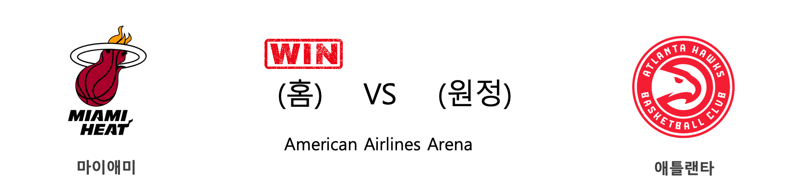

####  포틀랜드(홈) VS 뉴욕(원정) 

<table class="tg">
  <tr>
    <th class="tg-rr9t">POR</th>
    <th class="tg-rr9t">팀</th>
    <th class="tg-rr9t">NYK</th>
  </tr>
  <tr>
    <td class="tg-dcpn">1승 0패</td>
    <td class="tg-rr9t">시즌 상대전적</td>
    <td class="tg-dcpn">0승 1패</td>
  </tr>
  <tr>
    <td class="tg-dcpn">115</td>
    <td class="tg-rr9t">점수</td>
    <td class="tg-dcpn">87</td>
  </tr>
  <tr>
    <td class="tg-dcpn">22/49(45%)</td>
    <td class="tg-rr9t">2점(%)</td>
    <td class="tg-dcpn">25/53(47%)</td>
  </tr>
  <tr>
    <td class="tg-dcpn">17/41(41%)</td>
    <td class="tg-rr9t">3점(%)</td>
    <td class="tg-dcpn">7/38(18%)</td>
  </tr>
  <tr>
    <td class="tg-dcpn">20/24(83%)</td>
    <td class="tg-rr9t">자유투(%)</td>
    <td class="tg-dcpn">16/26(62%)</td>
  </tr>
  <tr>
    <td class="tg-dcpn">58</td>
    <td class="tg-rr9t">리바운드</td>
    <td class="tg-dcpn">47</td>
  </tr>
  <tr>
    <td class="tg-dcpn">20</td>
    <td class="tg-rr9t">어시스트</td>
    <td class="tg-dcpn">16</td>
  </tr>
  <tr>
    <td class="tg-dcpn">6</td>
    <td class="tg-rr9t">스틸</td>
    <td class="tg-dcpn">5</td>
  </tr>
  <tr>
    <td class="tg-dcpn">7</td>
    <td class="tg-rr9t">블록</td>
    <td class="tg-dcpn">3</td>
  </tr>
  <tr>
    <td class="tg-dcpn">12</td>
    <td class="tg-rr9t">턴오버</td>
    <td class="tg-dcpn">11</td>
  </tr>
  <tr>
    <td class="tg-dcpn">AnferneeSimon(16) CarmeloAnthon(16) HassanWhitesi(17) DamianLillard(31)</td>
    <td class="tg-rr9t">주요 득점선수</td>
    <td class="tg-dcpn">JuliusRandleF(15)</td>
  </tr>
</table>

#### 경기 관련 주요 기사         

[[오늘의 NBA] (11/30) 인디애나, 동부컨퍼런스의 복병](http://sports.news.naver.com/basketball/news/read.nhn?oid=486&aid=0000001152)

[[오늘의 NBA] (12/11) 마이애미의 커리어 나이트 파티](http://sports.news.naver.com/basketball/news/read.nhn?oid=486&aid=0000001163)

[[오늘의 NBA] (12/2) 토론토, 두 마리 토끼를 노린다!](http://sports.news.naver.com/basketball/news/read.nhn?oid=486&aid=0000001154)

[[오늘의 NBA] (12/10) 데릭 로즈, 모터 시티의 해결사](http://sports.news.naver.com/basketball/news/read.nhn?oid=486&aid=0000001162)

[[오늘의 NBA] (12/8) 뉴욕, NBA의 방랑자](http://sports.news.naver.com/basketball/news/read.nhn?oid=486&aid=0000001160)

        
        

####  필라델피아(홈) VS 덴버(원정) 

<table class="tg">
  <tr>
    <th class="tg-rr9t">PHI</th>
    <th class="tg-rr9t">팀</th>
    <th class="tg-rr9t">DEN</th>
  </tr>
  <tr>
    <td class="tg-dcpn">1승 1패</td>
    <td class="tg-rr9t">시즌 상대전적</td>
    <td class="tg-dcpn">1승 1패</td>
  </tr>
  <tr>
    <td class="tg-dcpn">97</td>
    <td class="tg-rr9t">점수</td>
    <td class="tg-dcpn">92</td>
  </tr>
  <tr>
    <td class="tg-dcpn">25/53(47%)</td>
    <td class="tg-rr9t">2점(%)</td>
    <td class="tg-dcpn">30/58(52%)</td>
  </tr>
  <tr>
    <td class="tg-dcpn">12/36(33%)</td>
    <td class="tg-rr9t">3점(%)</td>
    <td class="tg-dcpn">7/27(26%)</td>
  </tr>
  <tr>
    <td class="tg-dcpn">11/16(69%)</td>
    <td class="tg-rr9t">자유투(%)</td>
    <td class="tg-dcpn">11/12(92%)</td>
  </tr>
  <tr>
    <td class="tg-dcpn">49</td>
    <td class="tg-rr9t">리바운드</td>
    <td class="tg-dcpn">38</td>
  </tr>
  <tr>
    <td class="tg-dcpn">24</td>
    <td class="tg-rr9t">어시스트</td>
    <td class="tg-dcpn">29</td>
  </tr>
  <tr>
    <td class="tg-dcpn">9</td>
    <td class="tg-rr9t">스틸</td>
    <td class="tg-dcpn">12</td>
  </tr>
  <tr>
    <td class="tg-dcpn">3</td>
    <td class="tg-rr9t">블록</td>
    <td class="tg-dcpn">9</td>
  </tr>
  <tr>
    <td class="tg-dcpn">15</td>
    <td class="tg-rr9t">턴오버</td>
    <td class="tg-dcpn">13</td>
  </tr>
  <tr>
    <td class="tg-dcpn">TobiasHarrisF(20) JoelEmbiidC(22)</td>
    <td class="tg-rr9t">주요 득점선수</td>
    <td class="tg-dcpn">NikolaJokicC(15) WillBartonF(26)</td>
  </tr>
</table>

#### 경기 관련 주요 기사         

[[오늘의 NBA] (12/8) 뉴욕, NBA의 방랑자](http://sports.news.naver.com/basketball/news/read.nhn?oid=486&aid=0000001160)

[[오늘의 NBA] (12/4) 샌안토니오, 괄육취골 승리를 거두다](http://sports.news.naver.com/basketball/news/read.nhn?oid=486&aid=0000001156)

[[오늘의 NBA] (12/6) 마이크 댄토니, 토론토 수비를 농락하다](http://sports.news.naver.com/basketball/news/read.nhn?oid=486&aid=0000001158)

[[오늘의 NBA] (12/9) 앤써니 데이비스, 구단 역사에 이름을 남기다](http://sports.news.naver.com/basketball/news/read.nhn?oid=486&aid=0000001161)

[[오늘의 NBA] (12/1) 새크라멘토의 IQ 농구](http://sports.news.naver.com/basketball/news/read.nhn?oid=486&aid=0000001153)

        
        

####  마이애미(홈) VS 애틀랜타(원정) 

<table class="tg">
  <tr>
    <th class="tg-rr9t">MIA</th>
    <th class="tg-rr9t">팀</th>
    <th class="tg-rr9t">ATL</th>
  </tr>
  <tr>
    <td class="tg-dcpn">3승 0패</td>
    <td class="tg-rr9t">시즌 상대전적</td>
    <td class="tg-dcpn">0승 3패</td>
  </tr>
  <tr>
    <td class="tg-dcpn">135</td>
    <td class="tg-rr9t">점수</td>
    <td class="tg-dcpn">121</td>
  </tr>
  <tr>
    <td class="tg-dcpn">39/63(62%)</td>
    <td class="tg-rr9t">2점(%)</td>
    <td class="tg-dcpn">25/41(61%)</td>
  </tr>
  <tr>
    <td class="tg-dcpn">14/41(34%)</td>
    <td class="tg-rr9t">3점(%)</td>
    <td class="tg-dcpn">20/54(37%)</td>
  </tr>
  <tr>
    <td class="tg-dcpn">15/22(68%)</td>
    <td class="tg-rr9t">자유투(%)</td>
    <td class="tg-dcpn">11/18(61%)</td>
  </tr>
  <tr>
    <td class="tg-dcpn">53</td>
    <td class="tg-rr9t">리바운드</td>
    <td class="tg-dcpn">37</td>
  </tr>
  <tr>
    <td class="tg-dcpn">35</td>
    <td class="tg-rr9t">어시스트</td>
    <td class="tg-dcpn">30</td>
  </tr>
  <tr>
    <td class="tg-dcpn">5</td>
    <td class="tg-rr9t">스틸</td>
    <td class="tg-dcpn">4</td>
  </tr>
  <tr>
    <td class="tg-dcpn">3</td>
    <td class="tg-rr9t">블록</td>
    <td class="tg-dcpn">6</td>
  </tr>
  <tr>
    <td class="tg-dcpn">11</td>
    <td class="tg-rr9t">턴오버</td>
    <td class="tg-dcpn">11</td>
  </tr>
  <tr>
    <td class="tg-dcpn">KendrickNunnG(36) BamAdebayoF(30) DuncanRobinso(34) JimmyButlerF(20)</td>
    <td class="tg-rr9t">주요 득점선수</td>
    <td class="tg-dcpn">TraeYoungG(21) JabariParkerF(16) De'AndreHunte(28)</td>
  </tr>
</table>

#### 경기 관련 주요 기사         

[[오늘의 NBA] (12/9) 앤써니 데이비스, 구단 역사에 이름을 남기다](http://sports.news.naver.com/basketball/news/read.nhn?oid=486&aid=0000001161)

[[오늘의 NBA] (12/11) 마이애미의 커리어 나이트 파티](http://sports.news.naver.com/basketball/news/read.nhn?oid=486&aid=0000001163)

[[오늘의 NBA] (11/1) MIA 에릭 스포엘스트라 감독의 승리 설계](http://sports.news.naver.com/basketball/news/read.nhn?oid=486&aid=0000001124)

['MIA 13순위 루키' 타일러 히로, ATL 전서 3점 5개 폭발](http://www.rookie.co.kr/news/articleView.html?idxno=33736)

[[오늘의 NBA] (11/30) 인디애나, 동부컨퍼런스의 복병](http://sports.news.naver.com/basketball/news/read.nhn?oid=486&aid=0000001152)

        
        

####  샬럿(홈) VS 워싱턴(원정) 

<table class="tg">
  <tr>
    <th class="tg-rr9t">CHA</th>
    <th class="tg-rr9t">팀</th>
    <th class="tg-rr9t">WAS</th>
  </tr>
  <tr>
    <td class="tg-dcpn">1승 1패</td>
    <td class="tg-rr9t">시즌 상대전적</td>
    <td class="tg-dcpn">1승 1패</td>
  </tr>
  <tr>
    <td class="tg-dcpn">114</td>
    <td class="tg-rr9t">점수</td>
    <td class="tg-dcpn">107</td>
  </tr>
  <tr>
    <td class="tg-dcpn">22/44(50%)</td>
    <td class="tg-rr9t">2점(%)</td>
    <td class="tg-dcpn">27/55(49%)</td>
  </tr>
  <tr>
    <td class="tg-dcpn">16/41(39%)</td>
    <td class="tg-rr9t">3점(%)</td>
    <td class="tg-dcpn">11/35(31%)</td>
  </tr>
  <tr>
    <td class="tg-dcpn">22/28(79%)</td>
    <td class="tg-rr9t">자유투(%)</td>
    <td class="tg-dcpn">20/25(80%)</td>
  </tr>
  <tr>
    <td class="tg-dcpn">48</td>
    <td class="tg-rr9t">리바운드</td>
    <td class="tg-dcpn">45</td>
  </tr>
  <tr>
    <td class="tg-dcpn">22</td>
    <td class="tg-rr9t">어시스트</td>
    <td class="tg-dcpn">27</td>
  </tr>
  <tr>
    <td class="tg-dcpn">4</td>
    <td class="tg-rr9t">스틸</td>
    <td class="tg-dcpn">7</td>
  </tr>
  <tr>
    <td class="tg-dcpn">4</td>
    <td class="tg-rr9t">블록</td>
    <td class="tg-dcpn">7</td>
  </tr>
  <tr>
    <td class="tg-dcpn">13</td>
    <td class="tg-rr9t">턴오버</td>
    <td class="tg-dcpn">10</td>
  </tr>
  <tr>
    <td class="tg-dcpn">Devonte'Graha(29) MilesBridgesF(16) TerryRozierG(17) P.J.Washingto(15)</td>
    <td class="tg-rr9t">주요 득점선수</td>
    <td class="tg-dcpn">DavisBertans(32) BradleyBealG(16) RuiHachimuraF(18)</td>
  </tr>
</table>

#### 경기 관련 주요 기사         

[CHA Hospital develops new EUS-elastography technique that detects submucosal tumors](http://www.koreabiomed.com/news/articleView.html?idxno=6973)

[Review: Counting on Compassion in ‘one in two’](https://www.nytimes.com/2019/12/10/theater/one-in-two-review-donja-r-love.html?partner=naver)

[Rookie actor Cha In-ha's suicide raises concern of 'Werther effect'](http://www.koreatimes.co.kr/www/nation/2019/12/688_279768.html)

        
        

#### 리그 (Eastern) 순위
    

<table class="tg">
  <tr>
    <th class="tg-d14o">순위</th>
    <th class="tg-d14o">팀명</th>
    <th class="tg-d14o">경기수</th>
    <th class="tg-d14o">승</th>
    <th class="tg-d14o">패</th>
    <th class="tg-d14o">승차</th>
    <th class="tg-d14o">승률</th>
  </tr>
  
<tr>
    <td class="tg-50j8">1</td>
    <td class="tg-50j8">MIL</td>
    <td class="tg-50j8">24</td>
    <td class="tg-50j8">21</td>
    <td class="tg-50j8">3</td>
    <td class="tg-50j8">0</td>
    <td class="tg-50j8">0.875</td>
</tr>

<tr>
    <td class="tg-50j8">2</td>
    <td class="tg-50j8">MIA</td>
    <td class="tg-50j8">24</td>
    <td class="tg-50j8">18</td>
    <td class="tg-50j8">6</td>
    <td class="tg-50j8">3</td>
    <td class="tg-50j8">0.75</td>
</tr>

<tr>
    <td class="tg-50j8">3</td>
    <td class="tg-50j8">PHI</td>
    <td class="tg-50j8">25</td>
    <td class="tg-50j8">18</td>
    <td class="tg-50j8">7</td>
    <td class="tg-50j8">3</td>
    <td class="tg-50j8">0.72</td>
</tr>

<tr>
    <td class="tg-50j8">4</td>
    <td class="tg-50j8">BOS</td>
    <td class="tg-50j8">22</td>
    <td class="tg-50j8">17</td>
    <td class="tg-50j8">5</td>
    <td class="tg-50j8">4</td>
    <td class="tg-50j8">0.773</td>
</tr>

<tr>
    <td class="tg-50j8">5</td>
    <td class="tg-50j8">TOR</td>
    <td class="tg-50j8">23</td>
    <td class="tg-50j8">16</td>
    <td class="tg-50j8">7</td>
    <td class="tg-50j8">5</td>
    <td class="tg-50j8">0.696</td>
</tr>

<tr>
    <td class="tg-50j8">6</td>
    <td class="tg-50j8">IND</td>
    <td class="tg-50j8">24</td>
    <td class="tg-50j8">15</td>
    <td class="tg-50j8">9</td>
    <td class="tg-50j8">6</td>
    <td class="tg-50j8">0.625</td>
</tr>

<tr>
    <td class="tg-50j8">7</td>
    <td class="tg-50j8">BKN</td>
    <td class="tg-50j8">23</td>
    <td class="tg-50j8">13</td>
    <td class="tg-50j8">10</td>
    <td class="tg-50j8">8</td>
    <td class="tg-50j8">0.565</td>
</tr>

<tr>
    <td class="tg-50j8">8</td>
    <td class="tg-50j8">ORL</td>
    <td class="tg-50j8">23</td>
    <td class="tg-50j8">11</td>
    <td class="tg-50j8">12</td>
    <td class="tg-50j8">10</td>
    <td class="tg-50j8">0.478</td>
</tr>

<tr>
    <td class="tg-50j8">9</td>
    <td class="tg-50j8">DET</td>
    <td class="tg-50j8">24</td>
    <td class="tg-50j8">10</td>
    <td class="tg-50j8">14</td>
    <td class="tg-50j8">11</td>
    <td class="tg-50j8">0.417</td>
</tr>

<tr>
    <td class="tg-50j8">10</td>
    <td class="tg-50j8">CHA</td>
    <td class="tg-50j8">26</td>
    <td class="tg-50j8">10</td>
    <td class="tg-50j8">16</td>
    <td class="tg-50j8">11</td>
    <td class="tg-50j8">0.385</td>
</tr>

<tr>
    <td class="tg-50j8">11</td>
    <td class="tg-50j8">CHI</td>
    <td class="tg-50j8">25</td>
    <td class="tg-50j8">8</td>
    <td class="tg-50j8">17</td>
    <td class="tg-50j8">13</td>
    <td class="tg-50j8">0.32</td>
</tr>

<tr>
    <td class="tg-50j8">12</td>
    <td class="tg-50j8">WAS</td>
    <td class="tg-50j8">23</td>
    <td class="tg-50j8">7</td>
    <td class="tg-50j8">16</td>
    <td class="tg-50j8">14</td>
    <td class="tg-50j8">0.304</td>
</tr>

<tr>
    <td class="tg-50j8">13</td>
    <td class="tg-50j8">ATL</td>
    <td class="tg-50j8">24</td>
    <td class="tg-50j8">6</td>
    <td class="tg-50j8">18</td>
    <td class="tg-50j8">15</td>
    <td class="tg-50j8">0.25</td>
</tr>

<tr>
    <td class="tg-50j8">14</td>
    <td class="tg-50j8">CLE</td>
    <td class="tg-50j8">23</td>
    <td class="tg-50j8">5</td>
    <td class="tg-50j8">18</td>
    <td class="tg-50j8">16</td>
    <td class="tg-50j8">0.217</td>
</tr>

<tr>
    <td class="tg-50j8">15</td>
    <td class="tg-50j8">NYK</td>
    <td class="tg-50j8">24</td>
    <td class="tg-50j8">4</td>
    <td class="tg-50j8">20</td>
    <td class="tg-50j8">17</td>
    <td class="tg-50j8">0.167</td>
</tr>
</table> 
#### 리그 (Western) 순위
    

<table class="tg">
  <tr>
    <th class="tg-d14o">순위</th>
    <th class="tg-d14o">팀명</th>
    <th class="tg-d14o">경기수</th>
    <th class="tg-d14o">승</th>
    <th class="tg-d14o">패</th>
    <th class="tg-d14o">승차</th>
    <th class="tg-d14o">승률</th>
  </tr>
  
<tr>
    <td class="tg-50j8">1</td>
    <td class="tg-50j8">LAL</td>
    <td class="tg-50j8">24</td>
    <td class="tg-50j8">21</td>
    <td class="tg-50j8">3</td>
    <td class="tg-50j8">0</td>
    <td class="tg-50j8">0.875</td>
</tr>

<tr>
    <td class="tg-50j8">2</td>
    <td class="tg-50j8">LAC</td>
    <td class="tg-50j8">25</td>
    <td class="tg-50j8">18</td>
    <td class="tg-50j8">7</td>
    <td class="tg-50j8">3</td>
    <td class="tg-50j8">0.72</td>
</tr>

<tr>
    <td class="tg-50j8">3</td>
    <td class="tg-50j8">DAL</td>
    <td class="tg-50j8">23</td>
    <td class="tg-50j8">16</td>
    <td class="tg-50j8">7</td>
    <td class="tg-50j8">5</td>
    <td class="tg-50j8">0.696</td>
</tr>

<tr>
    <td class="tg-50j8">4</td>
    <td class="tg-50j8">HOU</td>
    <td class="tg-50j8">23</td>
    <td class="tg-50j8">15</td>
    <td class="tg-50j8">8</td>
    <td class="tg-50j8">6</td>
    <td class="tg-50j8">0.652</td>
</tr>

<tr>
    <td class="tg-50j8">5</td>
    <td class="tg-50j8">DEN</td>
    <td class="tg-50j8">22</td>
    <td class="tg-50j8">14</td>
    <td class="tg-50j8">8</td>
    <td class="tg-50j8">7</td>
    <td class="tg-50j8">0.636</td>
</tr>

<tr>
    <td class="tg-50j8">6</td>
    <td class="tg-50j8">UTA</td>
    <td class="tg-50j8">24</td>
    <td class="tg-50j8">13</td>
    <td class="tg-50j8">11</td>
    <td class="tg-50j8">8</td>
    <td class="tg-50j8">0.542</td>
</tr>

<tr>
    <td class="tg-50j8">7</td>
    <td class="tg-50j8">PHX</td>
    <td class="tg-50j8">23</td>
    <td class="tg-50j8">11</td>
    <td class="tg-50j8">12</td>
    <td class="tg-50j8">10</td>
    <td class="tg-50j8">0.478</td>
</tr>

<tr>
    <td class="tg-50j8">7</td>
    <td class="tg-50j8">OKC</td>
    <td class="tg-50j8">23</td>
    <td class="tg-50j8">11</td>
    <td class="tg-50j8">12</td>
    <td class="tg-50j8">10</td>
    <td class="tg-50j8">0.478</td>
</tr>

<tr>
    <td class="tg-50j8">9</td>
    <td class="tg-50j8">MIN</td>
    <td class="tg-50j8">23</td>
    <td class="tg-50j8">10</td>
    <td class="tg-50j8">13</td>
    <td class="tg-50j8">11</td>
    <td class="tg-50j8">0.435</td>
</tr>

<tr>
    <td class="tg-50j8">9</td>
    <td class="tg-50j8">SAC</td>
    <td class="tg-50j8">23</td>
    <td class="tg-50j8">10</td>
    <td class="tg-50j8">13</td>
    <td class="tg-50j8">11</td>
    <td class="tg-50j8">0.435</td>
</tr>

<tr>
    <td class="tg-50j8">11</td>
    <td class="tg-50j8">POR</td>
    <td class="tg-50j8">25</td>
    <td class="tg-50j8">10</td>
    <td class="tg-50j8">15</td>
    <td class="tg-50j8">11</td>
    <td class="tg-50j8">0.4</td>
</tr>

<tr>
    <td class="tg-50j8">12</td>
    <td class="tg-50j8">SAS</td>
    <td class="tg-50j8">23</td>
    <td class="tg-50j8">9</td>
    <td class="tg-50j8">14</td>
    <td class="tg-50j8">12</td>
    <td class="tg-50j8">0.391</td>
</tr>

<tr>
    <td class="tg-50j8">13</td>
    <td class="tg-50j8">MEM</td>
    <td class="tg-50j8">23</td>
    <td class="tg-50j8">7</td>
    <td class="tg-50j8">16</td>
    <td class="tg-50j8">14</td>
    <td class="tg-50j8">0.304</td>
</tr>

<tr>
    <td class="tg-50j8">14</td>
    <td class="tg-50j8">NOP</td>
    <td class="tg-50j8">24</td>
    <td class="tg-50j8">6</td>
    <td class="tg-50j8">18</td>
    <td class="tg-50j8">15</td>
    <td class="tg-50j8">0.25</td>
</tr>

<tr>
    <td class="tg-50j8">15</td>
    <td class="tg-50j8">GSW</td>
    <td class="tg-50j8">25</td>
    <td class="tg-50j8">5</td>
    <td class="tg-50j8">20</td>
    <td class="tg-50j8">16</td>
    <td class="tg-50j8">0.2</td>
</tr>
</table> 

        
        
#nba #미국농구 #엔비에이 #농구분석 #토토 #스포츠토토 #경기예측 #농구결과 #20191211 #포틀랜드 #뉴욕 #필라델피아 #덴버 #마이애미 #애틀랜타 #샬럿 #워싱턴 #포틀랜드뉴욕 #필라델피아덴버 #마이애미애틀랜타 #샬럿워싱턴 