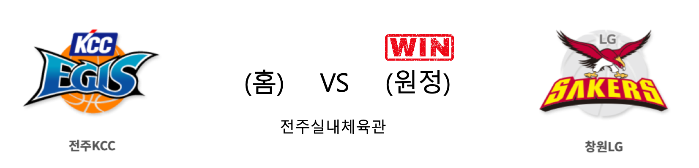

####  전주KCC(홈) VS 창원LG(원정) 

<table class="tg">
  <tr>
    <th class="tg-rr9t">전주KCC</th>
    <th class="tg-rr9t">팀</th>
    <th class="tg-rr9t">창원LG</th>
  </tr>
  <tr>
    <td class="tg-dcpn">2승 1패</td>
    <td class="tg-rr9t">시즌 상대전적</td>
    <td class="tg-dcpn">1승 2패</td>
  </tr>
  <tr>
    <td class="tg-dcpn">72</td>
    <td class="tg-rr9t">점수</td>
    <td class="tg-dcpn">79</td>
  </tr>
  <tr>
    <td class="tg-dcpn">14/36(39%)</td>
    <td class="tg-rr9t">2점(%)</td>
    <td class="tg-dcpn">18/40(45%)</td>
  </tr>
  <tr>
    <td class="tg-dcpn">9/26(35%)</td>
    <td class="tg-rr9t">3점(%)</td>
    <td class="tg-dcpn">8/29(28%)</td>
  </tr>
  <tr>
    <td class="tg-dcpn">17/19(89%)</td>
    <td class="tg-rr9t">자유투(%)</td>
    <td class="tg-dcpn">19/26(73%)</td>
  </tr>
  <tr>
    <td class="tg-dcpn">35</td>
    <td class="tg-rr9t">리바운드</td>
    <td class="tg-dcpn">43</td>
  </tr>
  <tr>
    <td class="tg-dcpn">2</td>
    <td class="tg-rr9t">어시스트</td>
    <td class="tg-dcpn">1</td>
  </tr>
  <tr>
    <td class="tg-dcpn">15</td>
    <td class="tg-rr9t">스틸</td>
    <td class="tg-dcpn">6</td>
  </tr>
  <tr>
    <td class="tg-dcpn">3</td>
    <td class="tg-rr9t">블록</td>
    <td class="tg-dcpn">10</td>
  </tr>
  <tr>
    <td class="tg-dcpn">16</td>
    <td class="tg-rr9t">턴오버</td>
    <td class="tg-dcpn">13</td>
  </tr>
  <tr>
    <td class="tg-dcpn">송교창(16) 라건아(17)</td>
    <td class="tg-rr9t">주요 득점선수</td>
    <td class="tg-dcpn">김시래(17) 캐디 라렌(25)</td>
  </tr>
</table>

#### 경기 관련 주요 기사         

[4쿼터서 빛났다… 창원LG ‘2연승 포옹’](http://www.knnews.co.kr/news/articleView.php?idxno=1314104)

[전주KCC에게 승리한 '창원LG'](http://news1.kr/photos/view/?3962848)

[[BK Review] '라렌 25점+김시래 쐐기 3점포' LG, KCC에 진땀승 거두고 최하위 탈출](http://www.basketkorea.com/news/articleView.html?idxno=190694)

[김시래 17점…프로농구 LG, KCC 꺾고 2달 만에 2연승](http://yna.kr/AKR20191212179600007?did=1195m)

        
        

#### 리그 순위

<table class="tg">
  <tr>
    <th class="tg-d14o">순위</th>
    <th class="tg-d14o">팀명</th>
    <th class="tg-d14o">경기수</th>
    <th class="tg-d14o">승</th>
    <th class="tg-d14o">패</th>
    <th class="tg-d14o">승차</th>
    <th class="tg-d14o">승률</th>
  </tr>
  
<tr>
    <td class="tg-50j8">1</td>
    <td class="tg-50j8">서울SK</td>
    <td class="tg-50j8">20</td>
    <td class="tg-50j8">14</td>
    <td class="tg-50j8">6</td>
    <td class="tg-50j8">0</td>
    <td class="tg-50j8">0.7</td>
</tr>

<tr>
    <td class="tg-50j8">2</td>
    <td class="tg-50j8">안양KGC</td>
    <td class="tg-50j8">20</td>
    <td class="tg-50j8">12</td>
    <td class="tg-50j8">8</td>
    <td class="tg-50j8">2</td>
    <td class="tg-50j8">0.6</td>
</tr>

<tr>
    <td class="tg-50j8">3</td>
    <td class="tg-50j8">부산KT</td>
    <td class="tg-50j8">21</td>
    <td class="tg-50j8">12</td>
    <td class="tg-50j8">9</td>
    <td class="tg-50j8">2</td>
    <td class="tg-50j8">0.571</td>
</tr>

<tr>
    <td class="tg-50j8">4</td>
    <td class="tg-50j8">원주DB</td>
    <td class="tg-50j8">20</td>
    <td class="tg-50j8">11</td>
    <td class="tg-50j8">9</td>
    <td class="tg-50j8">3</td>
    <td class="tg-50j8">0.55</td>
</tr>

<tr>
    <td class="tg-50j8">5</td>
    <td class="tg-50j8">전주KCC</td>
    <td class="tg-50j8">21</td>
    <td class="tg-50j8">11</td>
    <td class="tg-50j8">10</td>
    <td class="tg-50j8">3</td>
    <td class="tg-50j8">0.524</td>
</tr>

<tr>
    <td class="tg-50j8">6</td>
    <td class="tg-50j8">인천전자랜드</td>
    <td class="tg-50j8">20</td>
    <td class="tg-50j8">10</td>
    <td class="tg-50j8">10</td>
    <td class="tg-50j8">4</td>
    <td class="tg-50j8">0.5</td>
</tr>

<tr>
    <td class="tg-50j8">7</td>
    <td class="tg-50j8">서울삼성</td>
    <td class="tg-50j8">21</td>
    <td class="tg-50j8">9</td>
    <td class="tg-50j8">12</td>
    <td class="tg-50j8">5</td>
    <td class="tg-50j8">0.429</td>
</tr>

<tr>
    <td class="tg-50j8">8</td>
    <td class="tg-50j8">울산현대모비스</td>
    <td class="tg-50j8">20</td>
    <td class="tg-50j8">8</td>
    <td class="tg-50j8">12</td>
    <td class="tg-50j8">6</td>
    <td class="tg-50j8">0.4</td>
</tr>

<tr>
    <td class="tg-50j8">9</td>
    <td class="tg-50j8">창원LG</td>
    <td class="tg-50j8">21</td>
    <td class="tg-50j8">8</td>
    <td class="tg-50j8">13</td>
    <td class="tg-50j8">6</td>
    <td class="tg-50j8">0.381</td>
</tr>

<tr>
    <td class="tg-50j8">10</td>
    <td class="tg-50j8">고양오리온</td>
    <td class="tg-50j8">20</td>
    <td class="tg-50j8">7</td>
    <td class="tg-50j8">13</td>
    <td class="tg-50j8">7</td>
    <td class="tg-50j8">0.35</td>
</tr>
</table> 

        
        
#kbl #국내농구 #농구분석 #토토 #스포츠토토 #경기예측 #농구결과 #20191212 #전주KCC #창원LG #전주KCC창원LG 