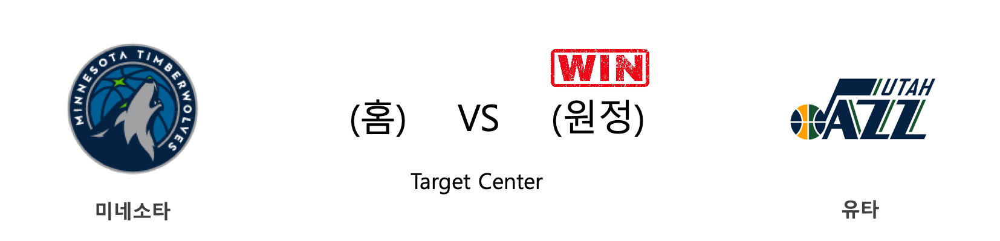

####  시카고(홈) VS 애틀랜타(원정) 

<table class="tg">
  <tr>
    <th class="tg-rr9t">CHI</th>
    <th class="tg-rr9t">팀</th>
    <th class="tg-rr9t">ATL</th>
  </tr>
  <tr>
    <td class="tg-dcpn">2승 0패</td>
    <td class="tg-rr9t">시즌 상대전적</td>
    <td class="tg-dcpn">0승 2패</td>
  </tr>
  <tr>
    <td class="tg-dcpn">136</td>
    <td class="tg-rr9t">점수</td>
    <td class="tg-dcpn">102</td>
  </tr>
  <tr>
    <td class="tg-dcpn">43/70(61%)</td>
    <td class="tg-rr9t">2점(%)</td>
    <td class="tg-dcpn">22/45(49%)</td>
  </tr>
  <tr>
    <td class="tg-dcpn">11/24(46%)</td>
    <td class="tg-rr9t">3점(%)</td>
    <td class="tg-dcpn">13/38(34%)</td>
  </tr>
  <tr>
    <td class="tg-dcpn">17/19(89%)</td>
    <td class="tg-rr9t">자유투(%)</td>
    <td class="tg-dcpn">19/26(73%)</td>
  </tr>
  <tr>
    <td class="tg-dcpn">42</td>
    <td class="tg-rr9t">리바운드</td>
    <td class="tg-dcpn">41</td>
  </tr>
  <tr>
    <td class="tg-dcpn">32</td>
    <td class="tg-rr9t">어시스트</td>
    <td class="tg-dcpn">26</td>
  </tr>
  <tr>
    <td class="tg-dcpn">15</td>
    <td class="tg-rr9t">스틸</td>
    <td class="tg-dcpn">7</td>
  </tr>
  <tr>
    <td class="tg-dcpn">7</td>
    <td class="tg-rr9t">블록</td>
    <td class="tg-dcpn">5</td>
  </tr>
  <tr>
    <td class="tg-dcpn">13</td>
    <td class="tg-rr9t">턴오버</td>
    <td class="tg-dcpn">23</td>
  </tr>
  <tr>
    <td class="tg-dcpn">ZachLaVineG(35) ThaddeusYoung(15) CobyWhite(19) LauriMarkkane(22)</td>
    <td class="tg-rr9t">주요 득점선수</td>
    <td class="tg-dcpn">CamReddish(16) TraeYoungG(15) AlexLen(17)</td>
  </tr>
</table>

#### 경기 관련 주요 기사         

[[오늘의 NBA] (12/9) 앤써니 데이비스, 구단 역사에 이름을 남기다](http://sports.news.naver.com/basketball/news/read.nhn?oid=486&aid=0000001161)

[[오늘의 NBA] (12/12) 제임스 하든 선생님의 심폐소생술](http://sports.news.naver.com/basketball/news/read.nhn?oid=486&aid=0000001164)

[[오늘의 NBA] (12/10) 데릭 로즈, 모터 시티의 해결사](http://sports.news.naver.com/basketball/news/read.nhn?oid=486&aid=0000001162)

[[오늘의 NBA] (12/8) 뉴욕, NBA의 방랑자](http://sports.news.naver.com/basketball/news/read.nhn?oid=486&aid=0000001160)

[[오늘의 NBA] (12/11) 마이애미의 커리어 나이트 파티](http://sports.news.naver.com/basketball/news/read.nhn?oid=486&aid=0000001163)

        
        

####  미네소타(홈) VS 유타(원정) 

<table class="tg">
  <tr>
    <th class="tg-rr9t">MIN</th>
    <th class="tg-rr9t">팀</th>
    <th class="tg-rr9t">UTA</th>
  </tr>
  <tr>
    <td class="tg-dcpn">1승 2패</td>
    <td class="tg-rr9t">시즌 상대전적</td>
    <td class="tg-dcpn">2승 1패</td>
  </tr>
  <tr>
    <td class="tg-dcpn">116</td>
    <td class="tg-rr9t">점수</td>
    <td class="tg-dcpn">127</td>
  </tr>
  <tr>
    <td class="tg-dcpn">25/50(50%)</td>
    <td class="tg-rr9t">2점(%)</td>
    <td class="tg-dcpn">31/48(65%)</td>
  </tr>
  <tr>
    <td class="tg-dcpn">15/41(37%)</td>
    <td class="tg-rr9t">3점(%)</td>
    <td class="tg-dcpn">16/35(46%)</td>
  </tr>
  <tr>
    <td class="tg-dcpn">21/26(81%)</td>
    <td class="tg-rr9t">자유투(%)</td>
    <td class="tg-dcpn">17/22(77%)</td>
  </tr>
  <tr>
    <td class="tg-dcpn">42</td>
    <td class="tg-rr9t">리바운드</td>
    <td class="tg-dcpn">45</td>
  </tr>
  <tr>
    <td class="tg-dcpn">18</td>
    <td class="tg-rr9t">어시스트</td>
    <td class="tg-dcpn">23</td>
  </tr>
  <tr>
    <td class="tg-dcpn">9</td>
    <td class="tg-rr9t">스틸</td>
    <td class="tg-dcpn">4</td>
  </tr>
  <tr>
    <td class="tg-dcpn">3</td>
    <td class="tg-rr9t">블록</td>
    <td class="tg-dcpn">7</td>
  </tr>
  <tr>
    <td class="tg-dcpn">11</td>
    <td class="tg-rr9t">턴오버</td>
    <td class="tg-dcpn">15</td>
  </tr>
  <tr>
    <td class="tg-dcpn">Karl-AnthonyT(21) JeffTeague(32) AndrewWiggins(26)</td>
    <td class="tg-rr9t">주요 득점선수</td>
    <td class="tg-dcpn">DonovanMitche(30) JoeInglesG(23) RudyGobertC(20)</td>
  </tr>
</table>

#### 경기 관련 주요 기사         

[[오늘의 NBA] (12/5) 밀워키, 시스템 농구 정점에 도달하다](http://sports.news.naver.com/basketball/news/read.nhn?oid=486&aid=0000001157)

[[오늘의 NBA] (12/2) 토론토, 두 마리 토끼를 노린다!](http://sports.news.naver.com/basketball/news/read.nhn?oid=486&aid=0000001154)

[[오늘의 NBA] (11/4) 마이애미의 대권 도전 행보](http://sports.news.naver.com/basketball/news/read.nhn?oid=486&aid=0000001127)

[[오늘의 NBA] (12/10) 데릭 로즈, 모터 시티의 해결사](http://sports.news.naver.com/basketball/news/read.nhn?oid=486&aid=0000001162)

[[오늘의 NBA] (12/8) 뉴욕, NBA의 방랑자](http://sports.news.naver.com/basketball/news/read.nhn?oid=486&aid=0000001160)

        
        

####  올랜도(홈) VS LA레이커스(원정) 

<table class="tg">
  <tr>
    <th class="tg-rr9t">ORL</th>
    <th class="tg-rr9t">팀</th>
    <th class="tg-rr9t">LAL</th>
  </tr>
  <tr>
    <td class="tg-dcpn">0승 1패</td>
    <td class="tg-rr9t">시즌 상대전적</td>
    <td class="tg-dcpn">1승 0패</td>
  </tr>
  <tr>
    <td class="tg-dcpn">87</td>
    <td class="tg-rr9t">점수</td>
    <td class="tg-dcpn">96</td>
  </tr>
  <tr>
    <td class="tg-dcpn">26/55(47%)</td>
    <td class="tg-rr9t">2점(%)</td>
    <td class="tg-dcpn">25/56(45%)</td>
  </tr>
  <tr>
    <td class="tg-dcpn">8/26(31%)</td>
    <td class="tg-rr9t">3점(%)</td>
    <td class="tg-dcpn">12/31(39%)</td>
  </tr>
  <tr>
    <td class="tg-dcpn">11/17(65%)</td>
    <td class="tg-rr9t">자유투(%)</td>
    <td class="tg-dcpn">10/19(53%)</td>
  </tr>
  <tr>
    <td class="tg-dcpn">41</td>
    <td class="tg-rr9t">리바운드</td>
    <td class="tg-dcpn">49</td>
  </tr>
  <tr>
    <td class="tg-dcpn">20</td>
    <td class="tg-rr9t">어시스트</td>
    <td class="tg-dcpn">20</td>
  </tr>
  <tr>
    <td class="tg-dcpn">10</td>
    <td class="tg-rr9t">스틸</td>
    <td class="tg-dcpn">10</td>
  </tr>
  <tr>
    <td class="tg-dcpn">5</td>
    <td class="tg-rr9t">블록</td>
    <td class="tg-dcpn">4</td>
  </tr>
  <tr>
    <td class="tg-dcpn">14</td>
    <td class="tg-rr9t">턴오버</td>
    <td class="tg-dcpn">13</td>
  </tr>
  <tr>
    <td class="tg-dcpn">EvanFournierG(18) JonathanIsaac(19)</td>
    <td class="tg-rr9t">주요 득점선수</td>
    <td class="tg-dcpn">LeBronJamesF(25) KentaviousCal(15) AnthonyDavisF(16)</td>
  </tr>
</table>

#### 경기 관련 주요 기사         

[[오늘의 NBA] (12/4) 샌안토니오, 괄육취골 승리를 거두다](http://sports.news.naver.com/basketball/news/read.nhn?oid=486&aid=0000001156)

[[오늘의 NBA] (12/10) 데릭 로즈, 모터 시티의 해결사](http://sports.news.naver.com/basketball/news/read.nhn?oid=486&aid=0000001162)

[[오늘의 NBA] (12/11) 마이애미의 커리어 나이트 파티](http://sports.news.naver.com/basketball/news/read.nhn?oid=486&aid=0000001163)

[[오늘의 NBA] (12/7) 르브론 제임스, 멜로(carmelo) 드라마의 주인공](http://sports.news.naver.com/basketball/news/read.nhn?oid=486&aid=0000001159)

[[오늘의 NBA] (10/23) 카와이 레너드, 할리우드의 새로운 주인공](http://sports.news.naver.com/basketball/news/read.nhn?oid=486&aid=0000001115)

        
        

####  골든스테이트(홈) VS 뉴욕(원정) 

<table class="tg">
  <tr>
    <th class="tg-rr9t">GSW</th>
    <th class="tg-rr9t">팀</th>
    <th class="tg-rr9t">NYK</th>
  </tr>
  <tr>
    <td class="tg-dcpn">0승 1패</td>
    <td class="tg-rr9t">시즌 상대전적</td>
    <td class="tg-dcpn">1승 0패</td>
  </tr>
  <tr>
    <td class="tg-dcpn">122</td>
    <td class="tg-rr9t">점수</td>
    <td class="tg-dcpn">124</td>
  </tr>
  <tr>
    <td class="tg-dcpn">35/67(52%)</td>
    <td class="tg-rr9t">2점(%)</td>
    <td class="tg-dcpn">31/61(51%)</td>
  </tr>
  <tr>
    <td class="tg-dcpn">10/37(27%)</td>
    <td class="tg-rr9t">3점(%)</td>
    <td class="tg-dcpn">12/29(41%)</td>
  </tr>
  <tr>
    <td class="tg-dcpn">22/30(73%)</td>
    <td class="tg-rr9t">자유투(%)</td>
    <td class="tg-dcpn">26/34(76%)</td>
  </tr>
  <tr>
    <td class="tg-dcpn">46</td>
    <td class="tg-rr9t">리바운드</td>
    <td class="tg-dcpn">58</td>
  </tr>
  <tr>
    <td class="tg-dcpn">27</td>
    <td class="tg-rr9t">어시스트</td>
    <td class="tg-dcpn">25</td>
  </tr>
  <tr>
    <td class="tg-dcpn">10</td>
    <td class="tg-rr9t">스틸</td>
    <td class="tg-dcpn">5</td>
  </tr>
  <tr>
    <td class="tg-dcpn">6</td>
    <td class="tg-rr9t">블록</td>
    <td class="tg-dcpn">7</td>
  </tr>
  <tr>
    <td class="tg-dcpn">8</td>
    <td class="tg-rr9t">턴오버</td>
    <td class="tg-dcpn">18</td>
  </tr>
  <tr>
    <td class="tg-dcpn">D'AngeloRusse(32) AlecBurks(18) GlennRobinson(17)</td>
    <td class="tg-rr9t">주요 득점선수</td>
    <td class="tg-dcpn">BobbyPortis(15) RJBarrettG(22) JuliusRandleF(24) MarcusMorrisS(36)</td>
  </tr>
</table>

#### 경기 관련 주요 기사         

[[오늘의 NBA] (12/2) 토론토, 두 마리 토끼를 노린다!](http://sports.news.naver.com/basketball/news/read.nhn?oid=486&aid=0000001154)

[[오늘의 NBA] (12/7) 르브론 제임스, 멜로(carmelo) 드라마의 주인공](http://sports.news.naver.com/basketball/news/read.nhn?oid=486&aid=0000001159)

[[오늘의 NBA] (12/12) 제임스 하든 선생님의 심폐소생술](http://sports.news.naver.com/basketball/news/read.nhn?oid=486&aid=0000001164)

[[오늘의 NBA] (12/8) 뉴욕, NBA의 방랑자](http://sports.news.naver.com/basketball/news/read.nhn?oid=486&aid=0000001160)

[[오늘의 NBA] (12/3) 켈리 우브레 주니어, 피닉스의 터프가이](http://sports.news.naver.com/basketball/news/read.nhn?oid=486&aid=0000001155)

        
        

####  토론토(홈) VS LA클리퍼스(원정) 

<table class="tg">
  <tr>
    <th class="tg-rr9t">TOR</th>
    <th class="tg-rr9t">팀</th>
    <th class="tg-rr9t">LAC</th>
  </tr>
  <tr>
    <td class="tg-dcpn">0승 2패</td>
    <td class="tg-rr9t">시즌 상대전적</td>
    <td class="tg-dcpn">2승 0패</td>
  </tr>
  <tr>
    <td class="tg-dcpn">92</td>
    <td class="tg-rr9t">점수</td>
    <td class="tg-dcpn">112</td>
  </tr>
  <tr>
    <td class="tg-dcpn">23/52(44%)</td>
    <td class="tg-rr9t">2점(%)</td>
    <td class="tg-dcpn">26/46(57%)</td>
  </tr>
  <tr>
    <td class="tg-dcpn">8/36(22%)</td>
    <td class="tg-rr9t">3점(%)</td>
    <td class="tg-dcpn">12/40(30%)</td>
  </tr>
  <tr>
    <td class="tg-dcpn">22/25(88%)</td>
    <td class="tg-rr9t">자유투(%)</td>
    <td class="tg-dcpn">24/27(89%)</td>
  </tr>
  <tr>
    <td class="tg-dcpn">47</td>
    <td class="tg-rr9t">리바운드</td>
    <td class="tg-dcpn">50</td>
  </tr>
  <tr>
    <td class="tg-dcpn">21</td>
    <td class="tg-rr9t">어시스트</td>
    <td class="tg-dcpn">29</td>
  </tr>
  <tr>
    <td class="tg-dcpn">10</td>
    <td class="tg-rr9t">스틸</td>
    <td class="tg-dcpn">8</td>
  </tr>
  <tr>
    <td class="tg-dcpn">8</td>
    <td class="tg-rr9t">블록</td>
    <td class="tg-dcpn">5</td>
  </tr>
  <tr>
    <td class="tg-dcpn">18</td>
    <td class="tg-rr9t">턴오버</td>
    <td class="tg-dcpn">18</td>
  </tr>
  <tr>
    <td class="tg-dcpn">NormanPowellG(22) PascalSiakamF(24)</td>
    <td class="tg-rr9t">주요 득점선수</td>
    <td class="tg-dcpn">KawhiLeonardF(23) LouWilliams(18)</td>
  </tr>
</table>

#### 경기 관련 주요 기사         

[[오늘의 NBA] (12/8) 뉴욕, NBA의 방랑자](http://sports.news.naver.com/basketball/news/read.nhn?oid=486&aid=0000001160)

[시아캄, 레너드 모두 웃었다… TOR-LAC 나란히 개막전 승리(종합)](http://www.rookie.co.kr/news/articleView.html?idxno=33970)

[[오늘의 NBA] (12/10) 데릭 로즈, 모터 시티의 해결사](http://sports.news.naver.com/basketball/news/read.nhn?oid=486&aid=0000001162)

[[오늘의 NBA] (12/9) 앤써니 데이비스, 구단 역사에 이름을 남기다](http://sports.news.naver.com/basketball/news/read.nhn?oid=486&aid=0000001161)

[[오늘의 NBA] (12/12) 제임스 하든 선생님의 심폐소생술](http://sports.news.naver.com/basketball/news/read.nhn?oid=486&aid=0000001164)

        
        

####  브루클린(홈) VS 샬럿(원정) 

<table class="tg">
  <tr>
    <th class="tg-rr9t">BKN</th>
    <th class="tg-rr9t">팀</th>
    <th class="tg-rr9t">CHA</th>
  </tr>
  <tr>
    <td class="tg-dcpn">2승 1패</td>
    <td class="tg-rr9t">시즌 상대전적</td>
    <td class="tg-dcpn">1승 2패</td>
  </tr>
  <tr>
    <td class="tg-dcpn">108</td>
    <td class="tg-rr9t">점수</td>
    <td class="tg-dcpn">113</td>
  </tr>
  <tr>
    <td class="tg-dcpn">28/50(56%)</td>
    <td class="tg-rr9t">2점(%)</td>
    <td class="tg-dcpn">21/53(40%)</td>
  </tr>
  <tr>
    <td class="tg-dcpn">10/38(26%)</td>
    <td class="tg-rr9t">3점(%)</td>
    <td class="tg-dcpn">15/35(43%)</td>
  </tr>
  <tr>
    <td class="tg-dcpn">22/33(67%)</td>
    <td class="tg-rr9t">자유투(%)</td>
    <td class="tg-dcpn">26/32(81%)</td>
  </tr>
  <tr>
    <td class="tg-dcpn">52</td>
    <td class="tg-rr9t">리바운드</td>
    <td class="tg-dcpn">47</td>
  </tr>
  <tr>
    <td class="tg-dcpn">20</td>
    <td class="tg-rr9t">어시스트</td>
    <td class="tg-dcpn">20</td>
  </tr>
  <tr>
    <td class="tg-dcpn">5</td>
    <td class="tg-rr9t">스틸</td>
    <td class="tg-dcpn">2</td>
  </tr>
  <tr>
    <td class="tg-dcpn">3</td>
    <td class="tg-rr9t">블록</td>
    <td class="tg-dcpn">6</td>
  </tr>
  <tr>
    <td class="tg-dcpn">12</td>
    <td class="tg-rr9t">턴오버</td>
    <td class="tg-dcpn">8</td>
  </tr>
  <tr>
    <td class="tg-dcpn">JarrettAllenC(21) SpencerDinwid(24)</td>
    <td class="tg-rr9t">주요 득점선수</td>
    <td class="tg-dcpn">Devonte'Graha(40)</td>
  </tr>
</table>

#### 경기 관련 주요 기사         

[[오늘의 NBA] (12/2) 토론토, 두 마리 토끼를 노린다!](http://sports.news.naver.com/basketball/news/read.nhn?oid=486&aid=0000001154)

[[오늘의 NBA] (12/12) 제임스 하든 선생님의 심폐소생술](http://sports.news.naver.com/basketball/news/read.nhn?oid=486&aid=0000001164)

[[오늘의 NBA] (12/7) 르브론 제임스, 멜로(carmelo) 드라마의 주인공](http://sports.news.naver.com/basketball/news/read.nhn?oid=486&aid=0000001159)

[[오늘의 NBA] (12/3) 켈리 우브레 주니어, 피닉스의 터프가이](http://sports.news.naver.com/basketball/news/read.nhn?oid=486&aid=0000001155)

[[오늘의 NBA] (12/9) 앤써니 데이비스, 구단 역사에 이름을 남기다](http://sports.news.naver.com/basketball/news/read.nhn?oid=486&aid=0000001161)

        
        

####  피닉스(홈) VS 멤피스(원정) 

<table class="tg">
  <tr>
    <th class="tg-rr9t">PHX</th>
    <th class="tg-rr9t">팀</th>
    <th class="tg-rr9t">MEM</th>
  </tr>
  <tr>
    <td class="tg-dcpn">1승 1패</td>
    <td class="tg-rr9t">시즌 상대전적</td>
    <td class="tg-dcpn">1승 1패</td>
  </tr>
  <tr>
    <td class="tg-dcpn">108</td>
    <td class="tg-rr9t">점수</td>
    <td class="tg-dcpn">115</td>
  </tr>
  <tr>
    <td class="tg-dcpn">28/59(47%)</td>
    <td class="tg-rr9t">2점(%)</td>
    <td class="tg-dcpn">32/62(52%)</td>
  </tr>
  <tr>
    <td class="tg-dcpn">9/34(26%)</td>
    <td class="tg-rr9t">3점(%)</td>
    <td class="tg-dcpn">10/24(42%)</td>
  </tr>
  <tr>
    <td class="tg-dcpn">25/30(83%)</td>
    <td class="tg-rr9t">자유투(%)</td>
    <td class="tg-dcpn">21/26(81%)</td>
  </tr>
  <tr>
    <td class="tg-dcpn">44</td>
    <td class="tg-rr9t">리바운드</td>
    <td class="tg-dcpn">55</td>
  </tr>
  <tr>
    <td class="tg-dcpn">29</td>
    <td class="tg-rr9t">어시스트</td>
    <td class="tg-dcpn">23</td>
  </tr>
  <tr>
    <td class="tg-dcpn">6</td>
    <td class="tg-rr9t">스틸</td>
    <td class="tg-dcpn">8</td>
  </tr>
  <tr>
    <td class="tg-dcpn">4</td>
    <td class="tg-rr9t">블록</td>
    <td class="tg-dcpn">4</td>
  </tr>
  <tr>
    <td class="tg-dcpn">12</td>
    <td class="tg-rr9t">턴오버</td>
    <td class="tg-dcpn">18</td>
  </tr>
  <tr>
    <td class="tg-dcpn">DevinBookerG(15) RickyRubioG(22) FrankKaminsky(24)</td>
    <td class="tg-rr9t">주요 득점선수</td>
    <td class="tg-dcpn">JarenJacksonJ(24) BrandonClarke(15) DillonBrooksG(27)</td>
  </tr>
</table>

#### 경기 관련 주요 기사         

[[오늘의 NBA] (12/10) 데릭 로즈, 모터 시티의 해결사](http://sports.news.naver.com/basketball/news/read.nhn?oid=486&aid=0000001162)

[[오늘의 NBA] (12/5) 밀워키, 시스템 농구 정점에 도달하다](http://sports.news.naver.com/basketball/news/read.nhn?oid=486&aid=0000001157)

[[오늘의 NBA] (12/12) 제임스 하든 선생님의 심폐소생술](http://sports.news.naver.com/basketball/news/read.nhn?oid=486&aid=0000001164)

[[오늘의 NBA] (12/3) 켈리 우브레 주니어, 피닉스의 터프가이](http://sports.news.naver.com/basketball/news/read.nhn?oid=486&aid=0000001155)

[[오늘의 NBA] (12/8) 뉴욕, NBA의 방랑자](http://sports.news.naver.com/basketball/news/read.nhn?oid=486&aid=0000001160)

        
        

####  클리블랜드(홈) VS 휴스턴(원정) 

<table class="tg">
  <tr>
    <th class="tg-rr9t">CLE</th>
    <th class="tg-rr9t">팀</th>
    <th class="tg-rr9t">HOU</th>
  </tr>
  <tr>
    <td class="tg-dcpn">0승 1패</td>
    <td class="tg-rr9t">시즌 상대전적</td>
    <td class="tg-dcpn">1승 0패</td>
  </tr>
  <tr>
    <td class="tg-dcpn">110</td>
    <td class="tg-rr9t">점수</td>
    <td class="tg-dcpn">116</td>
  </tr>
  <tr>
    <td class="tg-dcpn">33/57(58%)</td>
    <td class="tg-rr9t">2점(%)</td>
    <td class="tg-dcpn">26/45(58%)</td>
  </tr>
  <tr>
    <td class="tg-dcpn">13/32(41%)</td>
    <td class="tg-rr9t">3점(%)</td>
    <td class="tg-dcpn">17/42(40%)</td>
  </tr>
  <tr>
    <td class="tg-dcpn">5/8(62%)</td>
    <td class="tg-rr9t">자유투(%)</td>
    <td class="tg-dcpn">13/13(100%)</td>
  </tr>
  <tr>
    <td class="tg-dcpn">36</td>
    <td class="tg-rr9t">리바운드</td>
    <td class="tg-dcpn">36</td>
  </tr>
  <tr>
    <td class="tg-dcpn">29</td>
    <td class="tg-rr9t">어시스트</td>
    <td class="tg-dcpn">18</td>
  </tr>
  <tr>
    <td class="tg-dcpn">8</td>
    <td class="tg-rr9t">스틸</td>
    <td class="tg-dcpn">10</td>
  </tr>
  <tr>
    <td class="tg-dcpn">4</td>
    <td class="tg-rr9t">블록</td>
    <td class="tg-dcpn">6</td>
  </tr>
  <tr>
    <td class="tg-dcpn">15</td>
    <td class="tg-rr9t">턴오버</td>
    <td class="tg-dcpn">13</td>
  </tr>
  <tr>
    <td class="tg-dcpn">JordanClarkso(17) KevinPorterJr(24) KevinLoveF(17) CollinSextonG(18)</td>
    <td class="tg-rr9t">주요 득점선수</td>
    <td class="tg-dcpn">RussellWestbr(23) JamesHardenG(55)</td>
  </tr>
</table>

#### 경기 관련 주요 기사         

[[오늘의 NBA] (10/31) HOU vs WAS, NBA 득점 쟁탈전 역사를 새로 쓰다](http://sports.news.naver.com/basketball/news/read.nhn?oid=486&aid=0000001123)

[[오늘의 NBA] (12/4) 샌안토니오, 괄육취골 승리를 거두다](http://sports.news.naver.com/basketball/news/read.nhn?oid=486&aid=0000001156)

[[오늘의 NBA] (12/12) 제임스 하든 선생님의 심폐소생술](http://sports.news.naver.com/basketball/news/read.nhn?oid=486&aid=0000001164)

[[오늘의 NBA] (12/8) 뉴욕, NBA의 방랑자](http://sports.news.naver.com/basketball/news/read.nhn?oid=486&aid=0000001160)

[[오늘의 NBA] (11/10) 제임스 하든의 3점 라인 영점 사격](http://sports.news.naver.com/basketball/news/read.nhn?oid=486&aid=0000001133)

        
        

####  인디애나(홈) VS 보스턴(원정) 

<table class="tg">
  <tr>
    <th class="tg-rr9t">IND</th>
    <th class="tg-rr9t">팀</th>
    <th class="tg-rr9t">BOS</th>
  </tr>
  <tr>
    <td class="tg-dcpn">1승 0패</td>
    <td class="tg-rr9t">시즌 상대전적</td>
    <td class="tg-dcpn">0승 1패</td>
  </tr>
  <tr>
    <td class="tg-dcpn">122</td>
    <td class="tg-rr9t">점수</td>
    <td class="tg-dcpn">117</td>
  </tr>
  <tr>
    <td class="tg-dcpn">31/60(52%)</td>
    <td class="tg-rr9t">2점(%)</td>
    <td class="tg-dcpn">29/51(57%)</td>
  </tr>
  <tr>
    <td class="tg-dcpn">10/25(40%)</td>
    <td class="tg-rr9t">3점(%)</td>
    <td class="tg-dcpn">14/36(39%)</td>
  </tr>
  <tr>
    <td class="tg-dcpn">30/36(83%)</td>
    <td class="tg-rr9t">자유투(%)</td>
    <td class="tg-dcpn">17/22(77%)</td>
  </tr>
  <tr>
    <td class="tg-dcpn">36</td>
    <td class="tg-rr9t">리바운드</td>
    <td class="tg-dcpn">44</td>
  </tr>
  <tr>
    <td class="tg-dcpn">27</td>
    <td class="tg-rr9t">어시스트</td>
    <td class="tg-dcpn">25</td>
  </tr>
  <tr>
    <td class="tg-dcpn">11</td>
    <td class="tg-rr9t">스틸</td>
    <td class="tg-dcpn">6</td>
  </tr>
  <tr>
    <td class="tg-dcpn">4</td>
    <td class="tg-rr9t">블록</td>
    <td class="tg-dcpn">4</td>
  </tr>
  <tr>
    <td class="tg-dcpn">10</td>
    <td class="tg-rr9t">턴오버</td>
    <td class="tg-dcpn">15</td>
  </tr>
  <tr>
    <td class="tg-dcpn">MalcolmBrogdo(29) JustinHoliday(17) DomantasSabon(15) AaronHoliday(18)</td>
    <td class="tg-rr9t">주요 득점선수</td>
    <td class="tg-dcpn">KembaWalkerG(44) JaysonTatumF(16) JaylenBrownG(18)</td>
  </tr>
</table>

#### 경기 관련 주요 기사         

[[오늘의 NBA] (12/5) 밀워키, 시스템 농구 정점에 도달하다](http://sports.news.naver.com/basketball/news/read.nhn?oid=486&aid=0000001157)

[[오늘의 NBA] (12/7) 르브론 제임스, 멜로(carmelo) 드라마의 주인공](http://sports.news.naver.com/basketball/news/read.nhn?oid=486&aid=0000001159)

[[오늘의 NBA] (12/12) 제임스 하든 선생님의 심폐소생술](http://sports.news.naver.com/basketball/news/read.nhn?oid=486&aid=0000001164)

[[오늘의 NBA] (11/28) 앤써니 데이비스, 노란 셔츠를 입은 사나이](http://sports.news.naver.com/basketball/news/read.nhn?oid=486&aid=0000001151)

[[오늘의 NBA] (11/6) 트레이 영, 애틀랜타의 특급 유망주](http://sports.news.naver.com/basketball/news/read.nhn?oid=486&aid=0000001129)

        
        

####  밀워키(홈) VS 뉴올리언스(원정) 

<table class="tg">
  <tr>
    <th class="tg-rr9t">MIL</th>
    <th class="tg-rr9t">팀</th>
    <th class="tg-rr9t">NOP</th>
  </tr>
  <tr>
    <td class="tg-dcpn">1승 0패</td>
    <td class="tg-rr9t">시즌 상대전적</td>
    <td class="tg-dcpn">0승 1패</td>
  </tr>
  <tr>
    <td class="tg-dcpn">127</td>
    <td class="tg-rr9t">점수</td>
    <td class="tg-dcpn">112</td>
  </tr>
  <tr>
    <td class="tg-dcpn">31/54(57%)</td>
    <td class="tg-rr9t">2점(%)</td>
    <td class="tg-dcpn">23/43(53%)</td>
  </tr>
  <tr>
    <td class="tg-dcpn">19/39(49%)</td>
    <td class="tg-rr9t">3점(%)</td>
    <td class="tg-dcpn">16/45(36%)</td>
  </tr>
  <tr>
    <td class="tg-dcpn">8/9(89%)</td>
    <td class="tg-rr9t">자유투(%)</td>
    <td class="tg-dcpn">18/22(82%)</td>
  </tr>
  <tr>
    <td class="tg-dcpn">43</td>
    <td class="tg-rr9t">리바운드</td>
    <td class="tg-dcpn">42</td>
  </tr>
  <tr>
    <td class="tg-dcpn">27</td>
    <td class="tg-rr9t">어시스트</td>
    <td class="tg-dcpn">29</td>
  </tr>
  <tr>
    <td class="tg-dcpn">13</td>
    <td class="tg-rr9t">스틸</td>
    <td class="tg-dcpn">8</td>
  </tr>
  <tr>
    <td class="tg-dcpn">2</td>
    <td class="tg-rr9t">블록</td>
    <td class="tg-dcpn">5</td>
  </tr>
  <tr>
    <td class="tg-dcpn">14</td>
    <td class="tg-rr9t">턴오버</td>
    <td class="tg-dcpn">21</td>
  </tr>
  <tr>
    <td class="tg-dcpn">EricBledsoeG(29) KhrisMiddleto(24) ErsanIlyasova(18)</td>
    <td class="tg-rr9t">주요 득점선수</td>
    <td class="tg-dcpn">JrueHolidayG(21) BrandonIngram(25) JJRedickG(31)</td>
  </tr>
</table>

#### 경기 관련 주요 기사         

[[오늘의 NBA] (12/2) 토론토, 두 마리 토끼를 노린다!](http://sports.news.naver.com/basketball/news/read.nhn?oid=486&aid=0000001154)

[[오늘의 NBA] (12/12) 제임스 하든 선생님의 심폐소생술](http://sports.news.naver.com/basketball/news/read.nhn?oid=486&aid=0000001164)

[[오늘의 NBA] (11/12) 샌안토니오와 토니 파커의 마지막 동반 여행](http://sports.news.naver.com/basketball/news/read.nhn?oid=486&aid=0000001135)

[[오늘의 NBA] (12/3) 켈리 우브레 주니어, 피닉스의 터프가이](http://sports.news.naver.com/basketball/news/read.nhn?oid=486&aid=0000001155)

[[오늘의 NBA] (12/5) 밀워키, 시스템 농구 정점에 도달하다](http://sports.news.naver.com/basketball/news/read.nhn?oid=486&aid=0000001157)

        
        

####  새크라멘토(홈) VS 오클라호마씨티(원정) 

<table class="tg">
  <tr>
    <th class="tg-rr9t">SAC</th>
    <th class="tg-rr9t">팀</th>
    <th class="tg-rr9t">OKC</th>
  </tr>
  <tr>
    <td class="tg-dcpn">1승 0패</td>
    <td class="tg-rr9t">시즌 상대전적</td>
    <td class="tg-dcpn">0승 1패</td>
  </tr>
  <tr>
    <td class="tg-dcpn">94</td>
    <td class="tg-rr9t">점수</td>
    <td class="tg-dcpn">93</td>
  </tr>
  <tr>
    <td class="tg-dcpn">29/57(51%)</td>
    <td class="tg-rr9t">2점(%)</td>
    <td class="tg-dcpn">21/46(46%)</td>
  </tr>
  <tr>
    <td class="tg-dcpn">10/31(32%)</td>
    <td class="tg-rr9t">3점(%)</td>
    <td class="tg-dcpn">13/33(39%)</td>
  </tr>
  <tr>
    <td class="tg-dcpn">6/10(60%)</td>
    <td class="tg-rr9t">자유투(%)</td>
    <td class="tg-dcpn">12/18(67%)</td>
  </tr>
  <tr>
    <td class="tg-dcpn">40</td>
    <td class="tg-rr9t">리바운드</td>
    <td class="tg-dcpn">44</td>
  </tr>
  <tr>
    <td class="tg-dcpn">12</td>
    <td class="tg-rr9t">어시스트</td>
    <td class="tg-dcpn">24</td>
  </tr>
  <tr>
    <td class="tg-dcpn">9</td>
    <td class="tg-rr9t">스틸</td>
    <td class="tg-dcpn">8</td>
  </tr>
  <tr>
    <td class="tg-dcpn">3</td>
    <td class="tg-rr9t">블록</td>
    <td class="tg-dcpn">8</td>
  </tr>
  <tr>
    <td class="tg-dcpn">15</td>
    <td class="tg-rr9t">턴오버</td>
    <td class="tg-dcpn">16</td>
  </tr>
  <tr>
    <td class="tg-dcpn">BogdanBogdano(17) BuddyHieldG(23)</td>
    <td class="tg-rr9t">주요 득점선수</td>
    <td class="tg-dcpn">AbdelNaderF(15) DennisSchrode(17)</td>
  </tr>
</table>

#### 경기 관련 주요 기사         

[[오늘의 NBA] (12/11) 마이애미의 커리어 나이트 파티](http://sports.news.naver.com/basketball/news/read.nhn?oid=486&aid=0000001163)

[[오늘의 NBA] (12/9) 앤써니 데이비스, 구단 역사에 이름을 남기다](http://sports.news.naver.com/basketball/news/read.nhn?oid=486&aid=0000001161)

[[오늘의 NBA] (12/10) 데릭 로즈, 모터 시티의 해결사](http://sports.news.naver.com/basketball/news/read.nhn?oid=486&aid=0000001162)

[[오늘의 NBA] (12/12) 제임스 하든 선생님의 심폐소생술](http://sports.news.naver.com/basketball/news/read.nhn?oid=486&aid=0000001164)

[[오늘의 NBA] (12/7) 르브론 제임스, 멜로(carmelo) 드라마의 주인공](http://sports.news.naver.com/basketball/news/read.nhn?oid=486&aid=0000001159)

        
        

#### 리그 (Eastern) 순위
    

<table class="tg">
  <tr>
    <th class="tg-d14o">순위</th>
    <th class="tg-d14o">팀명</th>
    <th class="tg-d14o">경기수</th>
    <th class="tg-d14o">승</th>
    <th class="tg-d14o">패</th>
    <th class="tg-d14o">승차</th>
    <th class="tg-d14o">승률</th>
  </tr>
  
<tr>
    <td class="tg-50j8">1</td>
    <td class="tg-50j8">MIL</td>
    <td class="tg-50j8">25</td>
    <td class="tg-50j8">22</td>
    <td class="tg-50j8">3</td>
    <td class="tg-50j8">0</td>
    <td class="tg-50j8">0.88</td>
</tr>

<tr>
    <td class="tg-50j8">2</td>
    <td class="tg-50j8">MIA</td>
    <td class="tg-50j8">24</td>
    <td class="tg-50j8">18</td>
    <td class="tg-50j8">6</td>
    <td class="tg-50j8">4</td>
    <td class="tg-50j8">0.75</td>
</tr>

<tr>
    <td class="tg-50j8">3</td>
    <td class="tg-50j8">PHI</td>
    <td class="tg-50j8">25</td>
    <td class="tg-50j8">18</td>
    <td class="tg-50j8">7</td>
    <td class="tg-50j8">4</td>
    <td class="tg-50j8">0.72</td>
</tr>

<tr>
    <td class="tg-50j8">4</td>
    <td class="tg-50j8">BOS</td>
    <td class="tg-50j8">23</td>
    <td class="tg-50j8">17</td>
    <td class="tg-50j8">6</td>
    <td class="tg-50j8">5</td>
    <td class="tg-50j8">0.739</td>
</tr>

<tr>
    <td class="tg-50j8">5</td>
    <td class="tg-50j8">TOR</td>
    <td class="tg-50j8">24</td>
    <td class="tg-50j8">16</td>
    <td class="tg-50j8">8</td>
    <td class="tg-50j8">6</td>
    <td class="tg-50j8">0.667</td>
</tr>

<tr>
    <td class="tg-50j8">6</td>
    <td class="tg-50j8">IND</td>
    <td class="tg-50j8">25</td>
    <td class="tg-50j8">16</td>
    <td class="tg-50j8">9</td>
    <td class="tg-50j8">6</td>
    <td class="tg-50j8">0.64</td>
</tr>

<tr>
    <td class="tg-50j8">7</td>
    <td class="tg-50j8">BKN</td>
    <td class="tg-50j8">24</td>
    <td class="tg-50j8">13</td>
    <td class="tg-50j8">11</td>
    <td class="tg-50j8">9</td>
    <td class="tg-50j8">0.542</td>
</tr>

<tr>
    <td class="tg-50j8">8</td>
    <td class="tg-50j8">ORL</td>
    <td class="tg-50j8">24</td>
    <td class="tg-50j8">11</td>
    <td class="tg-50j8">13</td>
    <td class="tg-50j8">11</td>
    <td class="tg-50j8">0.458</td>
</tr>

<tr>
    <td class="tg-50j8">9</td>
    <td class="tg-50j8">CHA</td>
    <td class="tg-50j8">27</td>
    <td class="tg-50j8">11</td>
    <td class="tg-50j8">16</td>
    <td class="tg-50j8">11</td>
    <td class="tg-50j8">0.407</td>
</tr>

<tr>
    <td class="tg-50j8">10</td>
    <td class="tg-50j8">DET</td>
    <td class="tg-50j8">24</td>
    <td class="tg-50j8">10</td>
    <td class="tg-50j8">14</td>
    <td class="tg-50j8">12</td>
    <td class="tg-50j8">0.417</td>
</tr>

<tr>
    <td class="tg-50j8">11</td>
    <td class="tg-50j8">CHI</td>
    <td class="tg-50j8">26</td>
    <td class="tg-50j8">9</td>
    <td class="tg-50j8">17</td>
    <td class="tg-50j8">13</td>
    <td class="tg-50j8">0.346</td>
</tr>

<tr>
    <td class="tg-50j8">12</td>
    <td class="tg-50j8">WAS</td>
    <td class="tg-50j8">23</td>
    <td class="tg-50j8">7</td>
    <td class="tg-50j8">16</td>
    <td class="tg-50j8">15</td>
    <td class="tg-50j8">0.304</td>
</tr>

<tr>
    <td class="tg-50j8">13</td>
    <td class="tg-50j8">ATL</td>
    <td class="tg-50j8">25</td>
    <td class="tg-50j8">6</td>
    <td class="tg-50j8">19</td>
    <td class="tg-50j8">16</td>
    <td class="tg-50j8">0.24</td>
</tr>

<tr>
    <td class="tg-50j8">14</td>
    <td class="tg-50j8">CLE</td>
    <td class="tg-50j8">24</td>
    <td class="tg-50j8">5</td>
    <td class="tg-50j8">19</td>
    <td class="tg-50j8">17</td>
    <td class="tg-50j8">0.208</td>
</tr>

<tr>
    <td class="tg-50j8">15</td>
    <td class="tg-50j8">NYK</td>
    <td class="tg-50j8">25</td>
    <td class="tg-50j8">5</td>
    <td class="tg-50j8">20</td>
    <td class="tg-50j8">17</td>
    <td class="tg-50j8">0.2</td>
</tr>
</table> 
#### 리그 (Western) 순위
    

<table class="tg">
  <tr>
    <th class="tg-d14o">순위</th>
    <th class="tg-d14o">팀명</th>
    <th class="tg-d14o">경기수</th>
    <th class="tg-d14o">승</th>
    <th class="tg-d14o">패</th>
    <th class="tg-d14o">승차</th>
    <th class="tg-d14o">승률</th>
  </tr>
  
<tr>
    <td class="tg-50j8">1</td>
    <td class="tg-50j8">LAL</td>
    <td class="tg-50j8">25</td>
    <td class="tg-50j8">22</td>
    <td class="tg-50j8">3</td>
    <td class="tg-50j8">0</td>
    <td class="tg-50j8">0.88</td>
</tr>

<tr>
    <td class="tg-50j8">2</td>
    <td class="tg-50j8">LAC</td>
    <td class="tg-50j8">26</td>
    <td class="tg-50j8">19</td>
    <td class="tg-50j8">7</td>
    <td class="tg-50j8">3</td>
    <td class="tg-50j8">0.731</td>
</tr>

<tr>
    <td class="tg-50j8">3</td>
    <td class="tg-50j8">DAL</td>
    <td class="tg-50j8">23</td>
    <td class="tg-50j8">16</td>
    <td class="tg-50j8">7</td>
    <td class="tg-50j8">6</td>
    <td class="tg-50j8">0.696</td>
</tr>

<tr>
    <td class="tg-50j8">4</td>
    <td class="tg-50j8">HOU</td>
    <td class="tg-50j8">24</td>
    <td class="tg-50j8">16</td>
    <td class="tg-50j8">8</td>
    <td class="tg-50j8">6</td>
    <td class="tg-50j8">0.667</td>
</tr>

<tr>
    <td class="tg-50j8">5</td>
    <td class="tg-50j8">DEN</td>
    <td class="tg-50j8">22</td>
    <td class="tg-50j8">14</td>
    <td class="tg-50j8">8</td>
    <td class="tg-50j8">8</td>
    <td class="tg-50j8">0.636</td>
</tr>

<tr>
    <td class="tg-50j8">6</td>
    <td class="tg-50j8">UTA</td>
    <td class="tg-50j8">25</td>
    <td class="tg-50j8">14</td>
    <td class="tg-50j8">11</td>
    <td class="tg-50j8">8</td>
    <td class="tg-50j8">0.56</td>
</tr>

<tr>
    <td class="tg-50j8">7</td>
    <td class="tg-50j8">OKC</td>
    <td class="tg-50j8">24</td>
    <td class="tg-50j8">11</td>
    <td class="tg-50j8">13</td>
    <td class="tg-50j8">11</td>
    <td class="tg-50j8">0.458</td>
</tr>

<tr>
    <td class="tg-50j8">7</td>
    <td class="tg-50j8">PHX</td>
    <td class="tg-50j8">24</td>
    <td class="tg-50j8">11</td>
    <td class="tg-50j8">13</td>
    <td class="tg-50j8">11</td>
    <td class="tg-50j8">0.458</td>
</tr>

<tr>
    <td class="tg-50j8">7</td>
    <td class="tg-50j8">SAC</td>
    <td class="tg-50j8">24</td>
    <td class="tg-50j8">11</td>
    <td class="tg-50j8">13</td>
    <td class="tg-50j8">11</td>
    <td class="tg-50j8">0.458</td>
</tr>

<tr>
    <td class="tg-50j8">10</td>
    <td class="tg-50j8">MIN</td>
    <td class="tg-50j8">24</td>
    <td class="tg-50j8">10</td>
    <td class="tg-50j8">14</td>
    <td class="tg-50j8">12</td>
    <td class="tg-50j8">0.417</td>
</tr>

<tr>
    <td class="tg-50j8">11</td>
    <td class="tg-50j8">POR</td>
    <td class="tg-50j8">25</td>
    <td class="tg-50j8">10</td>
    <td class="tg-50j8">15</td>
    <td class="tg-50j8">12</td>
    <td class="tg-50j8">0.4</td>
</tr>

<tr>
    <td class="tg-50j8">12</td>
    <td class="tg-50j8">SAS</td>
    <td class="tg-50j8">23</td>
    <td class="tg-50j8">9</td>
    <td class="tg-50j8">14</td>
    <td class="tg-50j8">13</td>
    <td class="tg-50j8">0.391</td>
</tr>

<tr>
    <td class="tg-50j8">13</td>
    <td class="tg-50j8">MEM</td>
    <td class="tg-50j8">24</td>
    <td class="tg-50j8">8</td>
    <td class="tg-50j8">16</td>
    <td class="tg-50j8">14</td>
    <td class="tg-50j8">0.333</td>
</tr>

<tr>
    <td class="tg-50j8">14</td>
    <td class="tg-50j8">NOP</td>
    <td class="tg-50j8">25</td>
    <td class="tg-50j8">6</td>
    <td class="tg-50j8">19</td>
    <td class="tg-50j8">16</td>
    <td class="tg-50j8">0.24</td>
</tr>

<tr>
    <td class="tg-50j8">15</td>
    <td class="tg-50j8">GSW</td>
    <td class="tg-50j8">26</td>
    <td class="tg-50j8">5</td>
    <td class="tg-50j8">21</td>
    <td class="tg-50j8">17</td>
    <td class="tg-50j8">0.192</td>
</tr>
</table> 

        
        
#nba #미국농구 #엔비에이 #농구분석 #토토 #스포츠토토 #경기예측 #농구결과 #20191212 #시카고 #애틀랜타 #미네소타 #유타 #올랜도 #LA레이커스 #골든스테이트 #뉴욕 #토론토 #LA클리퍼스 #브루클린 #샬럿 #피닉스 #멤피스 #클리블랜드 #휴스턴 #인디애나 #보스턴 #밀워키 #뉴올리언스 #새크라멘토 #오클라호마씨티 #시카고애틀랜타 #미네소타유타 #올랜도LA레이커스 #골든스테이트뉴욕 #토론토LA클리퍼스 #브루클린샬럿 #피닉스멤피스 #클리블랜드휴스턴 #인디애나보스턴 #밀워키뉴올리언스 #새크라멘토오클라호마씨티 