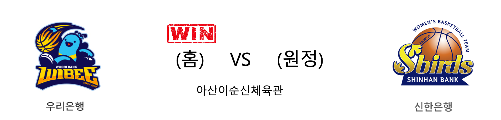

####  우리은행(홈) VS 신한은행(원정) 

<table class="tg">
  <tr>
    <th class="tg-rr9t">우리은행</th>
    <th class="tg-rr9t">팀</th>
    <th class="tg-rr9t">신한은행</th>
  </tr>
  <tr>
    <td class="tg-dcpn">2승 0패</td>
    <td class="tg-rr9t">시즌 상대전적</td>
    <td class="tg-dcpn">0승 2패</td>
  </tr>
  <tr>
    <td class="tg-dcpn">81</td>
    <td class="tg-rr9t">점수</td>
    <td class="tg-dcpn">53</td>
  </tr>
  <tr>
    <td class="tg-dcpn">25/42(60%)</td>
    <td class="tg-rr9t">2점(%)</td>
    <td class="tg-dcpn">18/50(36%)</td>
  </tr>
  <tr>
    <td class="tg-dcpn">7/25(28%)</td>
    <td class="tg-rr9t">3점(%)</td>
    <td class="tg-dcpn">3/14(21%)</td>
  </tr>
  <tr>
    <td class="tg-dcpn">10/11(91%)</td>
    <td class="tg-rr9t">자유투(%)</td>
    <td class="tg-dcpn">8/15(53%)</td>
  </tr>
  <tr>
    <td class="tg-dcpn">40</td>
    <td class="tg-rr9t">리바운드</td>
    <td class="tg-dcpn">30</td>
  </tr>
  <tr>
    <td class="tg-dcpn">18</td>
    <td class="tg-rr9t">어시스트</td>
    <td class="tg-dcpn">14</td>
  </tr>
  <tr>
    <td class="tg-dcpn">7</td>
    <td class="tg-rr9t">스틸</td>
    <td class="tg-dcpn">5</td>
  </tr>
  <tr>
    <td class="tg-dcpn">7</td>
    <td class="tg-rr9t">블록</td>
    <td class="tg-dcpn">11</td>
  </tr>
  <tr>
    <td class="tg-dcpn">20</td>
    <td class="tg-rr9t">턴오버</td>
    <td class="tg-dcpn">14</td>
  </tr>
  <tr>
    <td class="tg-dcpn">그레이(22)</td>
    <td class="tg-rr9t">주요 득점선수</td>
    <td class="tg-dcpn">김연희(21)</td>
  </tr>
</table>

#### 경기 관련 주요 기사         

[여자농구 우리은행, 신한은행 꺾고 다시 공동 선두](https://news.sbs.co.kr/news/endPage.do?news_id=N1005561728&plink=ORI&cooper=NAVER)

[6일 쉬고 온 우리은행, 신한은행 28점 대파…다시 공동 선두](http://www.rookie.co.kr/news/articleView.html?idxno=36155)

[여자농구 우리은행, 신한은행 꺾고 다시 공동 선두](http://yna.kr/AKR20191212178400007?did=1195m)

['3연승' 신한은행, 부상으로 김수연 결장](http://www.basketkorea.com/news/articleView.html?idxno=190688)

        
        

#### 리그 순위

<table class="tg">
  <tr>
    <th class="tg-d14o">순위</th>
    <th class="tg-d14o">팀명</th>
    <th class="tg-d14o">경기수</th>
    <th class="tg-d14o">승</th>
    <th class="tg-d14o">패</th>
    <th class="tg-d14o">승차</th>
    <th class="tg-d14o">승률</th>
  </tr>
  
<tr>
    <td class="tg-50j8">1</td>
    <td class="tg-50j8">KB스타즈</td>
    <td class="tg-50j8">10</td>
    <td class="tg-50j8">8</td>
    <td class="tg-50j8">2</td>
    <td class="tg-50j8">0</td>
    <td class="tg-50j8">0.8</td>
</tr>

<tr>
    <td class="tg-50j8">1</td>
    <td class="tg-50j8">우리은행</td>
    <td class="tg-50j8">10</td>
    <td class="tg-50j8">8</td>
    <td class="tg-50j8">2</td>
    <td class="tg-50j8">0</td>
    <td class="tg-50j8">0.8</td>
</tr>

<tr>
    <td class="tg-50j8">3</td>
    <td class="tg-50j8">신한은행</td>
    <td class="tg-50j8">10</td>
    <td class="tg-50j8">5</td>
    <td class="tg-50j8">5</td>
    <td class="tg-50j8">3</td>
    <td class="tg-50j8">0.5</td>
</tr>

<tr>
    <td class="tg-50j8">4</td>
    <td class="tg-50j8">KEB하나</td>
    <td class="tg-50j8">10</td>
    <td class="tg-50j8">4</td>
    <td class="tg-50j8">6</td>
    <td class="tg-50j8">4</td>
    <td class="tg-50j8">0.4</td>
</tr>

<tr>
    <td class="tg-50j8">5</td>
    <td class="tg-50j8">삼성생명</td>
    <td class="tg-50j8">10</td>
    <td class="tg-50j8">3</td>
    <td class="tg-50j8">7</td>
    <td class="tg-50j8">5</td>
    <td class="tg-50j8">0.3</td>
</tr>

<tr>
    <td class="tg-50j8">6</td>
    <td class="tg-50j8">BNK썸</td>
    <td class="tg-50j8">10</td>
    <td class="tg-50j8">2</td>
    <td class="tg-50j8">8</td>
    <td class="tg-50j8">6</td>
    <td class="tg-50j8">0.2</td>
</tr>
</table> 

        
        
#wkbl #국내농구 #여자농구 #농구분석 #토토 #스포츠토토 #경기예측 #농구결과 #20191212 #우리은행 #신한은행 #우리은행신한은행 