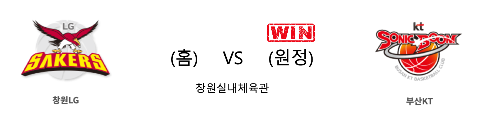
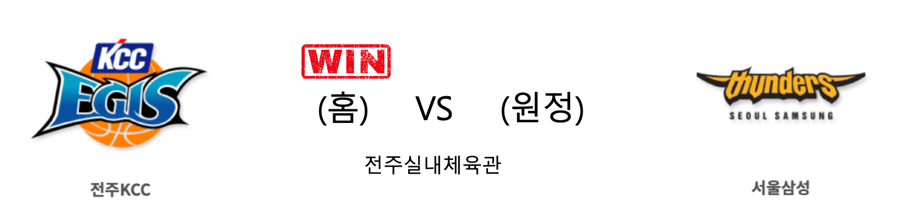
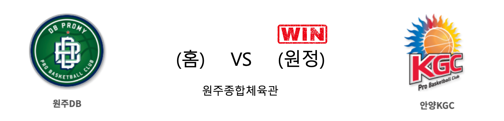

####  창원LG(홈) VS 부산KT(원정) 

<table class="tg">
  <tr>
    <th class="tg-rr9t">창원LG</th>
    <th class="tg-rr9t">팀</th>
    <th class="tg-rr9t">부산KT</th>
  </tr>
  <tr>
    <td class="tg-dcpn">2승 1패</td>
    <td class="tg-rr9t">시즌 상대전적</td>
    <td class="tg-dcpn">1승 2패</td>
  </tr>
  <tr>
    <td class="tg-dcpn">73</td>
    <td class="tg-rr9t">점수</td>
    <td class="tg-dcpn">74</td>
  </tr>
  <tr>
    <td class="tg-dcpn">23/51(45%)</td>
    <td class="tg-rr9t">2점(%)</td>
    <td class="tg-dcpn">18/36(50%)</td>
  </tr>
  <tr>
    <td class="tg-dcpn">7/25(28%)</td>
    <td class="tg-rr9t">3점(%)</td>
    <td class="tg-dcpn">8/26(31%)</td>
  </tr>
  <tr>
    <td class="tg-dcpn">6/10(60%)</td>
    <td class="tg-rr9t">자유투(%)</td>
    <td class="tg-dcpn">14/15(93%)</td>
  </tr>
  <tr>
    <td class="tg-dcpn">38</td>
    <td class="tg-rr9t">리바운드</td>
    <td class="tg-dcpn">35</td>
  </tr>
  <tr>
    <td class="tg-dcpn">4</td>
    <td class="tg-rr9t">어시스트</td>
    <td class="tg-dcpn">3</td>
  </tr>
  <tr>
    <td class="tg-dcpn">7</td>
    <td class="tg-rr9t">스틸</td>
    <td class="tg-dcpn">10</td>
  </tr>
  <tr>
    <td class="tg-dcpn">3</td>
    <td class="tg-rr9t">블록</td>
    <td class="tg-dcpn">7</td>
  </tr>
  <tr>
    <td class="tg-dcpn">17</td>
    <td class="tg-rr9t">턴오버</td>
    <td class="tg-dcpn">15</td>
  </tr>
  <tr>
    <td class="tg-dcpn">캐디 라렌(27)</td>
    <td class="tg-rr9t">주요 득점선수</td>
    <td class="tg-dcpn">바이런 멀린스(15) 허훈(18)</td>
  </tr>
</table>

#### 경기 관련 주요 기사         

[[BK Review] '훈+멀린스=33점' KT, 막판 접전 끝 LG 꺾고 7연승 질주](http://www.basketkorea.com/news/articleView.html?idxno=190757)

[부산 KT, 농구영신 매치 특별 유니폼 입는다](http://www.mydaily.co.kr/new_yk/html/read.php?newsid=201912131700136902&ext=na)

[창원 LG, 14일 부산 KT전에서 어린이 사생대회 개최](http://www.sportsseoul.com/news/read/860579)

[[라커룸에서] KT 서동철 감독, “LG는 인기 구단, 보기 좋다”](http://sports.news.naver.com/basketball/news/read.nhn?oid=065&aid=0000193901)

        
        

####  전주KCC(홈) VS 서울삼성(원정) 

<table class="tg">
  <tr>
    <th class="tg-rr9t">전주KCC</th>
    <th class="tg-rr9t">팀</th>
    <th class="tg-rr9t">서울삼성</th>
  </tr>
  <tr>
    <td class="tg-dcpn">2승 1패</td>
    <td class="tg-rr9t">시즌 상대전적</td>
    <td class="tg-dcpn">1승 2패</td>
  </tr>
  <tr>
    <td class="tg-dcpn">83</td>
    <td class="tg-rr9t">점수</td>
    <td class="tg-dcpn">75</td>
  </tr>
  <tr>
    <td class="tg-dcpn">24/48(50%)</td>
    <td class="tg-rr9t">2점(%)</td>
    <td class="tg-dcpn">28/44(64%)</td>
  </tr>
  <tr>
    <td class="tg-dcpn">10/29(34%)</td>
    <td class="tg-rr9t">3점(%)</td>
    <td class="tg-dcpn">4/23(17%)</td>
  </tr>
  <tr>
    <td class="tg-dcpn">5/9(56%)</td>
    <td class="tg-rr9t">자유투(%)</td>
    <td class="tg-dcpn">7/9(78%)</td>
  </tr>
  <tr>
    <td class="tg-dcpn">42</td>
    <td class="tg-rr9t">리바운드</td>
    <td class="tg-dcpn">33</td>
  </tr>
  <tr>
    <td class="tg-dcpn">1</td>
    <td class="tg-rr9t">어시스트</td>
    <td class="tg-dcpn">1</td>
  </tr>
  <tr>
    <td class="tg-dcpn">9</td>
    <td class="tg-rr9t">스틸</td>
    <td class="tg-dcpn">11</td>
  </tr>
  <tr>
    <td class="tg-dcpn">5</td>
    <td class="tg-rr9t">블록</td>
    <td class="tg-dcpn">8</td>
  </tr>
  <tr>
    <td class="tg-dcpn">21</td>
    <td class="tg-rr9t">턴오버</td>
    <td class="tg-dcpn">15</td>
  </tr>
  <tr>
    <td class="tg-dcpn">이대성(19) 라건아(16)</td>
    <td class="tg-rr9t">주요 득점선수</td>
    <td class="tg-dcpn">김준일(20)</td>
  </tr>
</table>

#### 경기 관련 주요 기사         

['이대성·라건아 35점 합작' KCC, 삼성 제압](http://www.newsis.com/view/?id=NISX20191214_0000860434&cID=10505&pID=10500)

[투맨 게임과 트랩 수비로 나설 것 삼성 vs 리바운드 강조, 이정현은 벤치에서 스타트 KCC](http://www.rookie.co.kr/news/articleView.html?idxno=36294)

[[JB포토화보] KCC, 83-75로 삼성에 홈승리](http://sports.news.naver.com/basketball/news/read.nhn?oid=065&aid=0000193905)

[삼성, 14일 KCC전 이관희 결장… 이정현은 일단 출격 대기](http://www.basketkorea.com/news/articleView.html?idxno=190745)

        
        

####  원주DB(홈) VS 안양KGC(원정) 

<table class="tg">
  <tr>
    <th class="tg-rr9t">원주DB</th>
    <th class="tg-rr9t">팀</th>
    <th class="tg-rr9t">안양KGC</th>
  </tr>
  <tr>
    <td class="tg-dcpn">1승 2패</td>
    <td class="tg-rr9t">시즌 상대전적</td>
    <td class="tg-dcpn">2승 1패</td>
  </tr>
  <tr>
    <td class="tg-dcpn">86</td>
    <td class="tg-rr9t">점수</td>
    <td class="tg-dcpn">94</td>
  </tr>
  <tr>
    <td class="tg-dcpn">16/33(48%)</td>
    <td class="tg-rr9t">2점(%)</td>
    <td class="tg-dcpn">25/43(58%)</td>
  </tr>
  <tr>
    <td class="tg-dcpn">12/37(32%)</td>
    <td class="tg-rr9t">3점(%)</td>
    <td class="tg-dcpn">12/42(29%)</td>
  </tr>
  <tr>
    <td class="tg-dcpn">18/30(60%)</td>
    <td class="tg-rr9t">자유투(%)</td>
    <td class="tg-dcpn">8/10(80%)</td>
  </tr>
  <tr>
    <td class="tg-dcpn">42</td>
    <td class="tg-rr9t">리바운드</td>
    <td class="tg-dcpn">43</td>
  </tr>
  <tr>
    <td class="tg-dcpn">1</td>
    <td class="tg-rr9t">어시스트</td>
    <td class="tg-dcpn">6</td>
  </tr>
  <tr>
    <td class="tg-dcpn">22</td>
    <td class="tg-rr9t">스틸</td>
    <td class="tg-dcpn">17</td>
  </tr>
  <tr>
    <td class="tg-dcpn">12</td>
    <td class="tg-rr9t">블록</td>
    <td class="tg-dcpn">16</td>
  </tr>
  <tr>
    <td class="tg-dcpn">18</td>
    <td class="tg-rr9t">턴오버</td>
    <td class="tg-dcpn">18</td>
  </tr>
  <tr>
    <td class="tg-dcpn">허웅(21) 김종규(17) 칼렙 그린(18)</td>
    <td class="tg-rr9t">주요 득점선수</td>
    <td class="tg-dcpn">크리스 맥컬러(35)</td>
  </tr>
</table>

#### 경기 관련 주요 기사         

[돌파하는 안양KGC 변준형](http://news1.kr/photos/view/?3964726)

[[내 맘대로 프리뷰] '미리 보는 농구영신' LG-KT, '확연히 다른 분위기' DB-KGC](http://www.basketkorea.com/news/articleView.html?idxno=190735)

['어느새 2위' KGC 김승기 감독 "욕심부리지 않겠다"](http://www.basketkorea.com/news/articleView.html?idxno=190752)

['부상 회복' 김민구, 14일 KGC전 복귀 확정...DB 분위기 반전 노린다](http://www.rookie.co.kr/news/articleView.html?idxno=36298)

["분위기만 처지지 말자" 이상범 감독의 주문...KGC는 헬프 디펜스로 6연승 도전](http://www.rookie.co.kr/news/articleView.html?idxno=36310)

        
        

#### 리그 순위

<table class="tg">
  <tr>
    <th class="tg-d14o">순위</th>
    <th class="tg-d14o">팀명</th>
    <th class="tg-d14o">경기수</th>
    <th class="tg-d14o">승</th>
    <th class="tg-d14o">패</th>
    <th class="tg-d14o">승차</th>
    <th class="tg-d14o">승률</th>
  </tr>
  
<tr>
    <td class="tg-50j8">1</td>
    <td class="tg-50j8">서울SK</td>
    <td class="tg-50j8">21</td>
    <td class="tg-50j8">15</td>
    <td class="tg-50j8">6</td>
    <td class="tg-50j8">0</td>
    <td class="tg-50j8">0.714</td>
</tr>

<tr>
    <td class="tg-50j8">2</td>
    <td class="tg-50j8">안양KGC</td>
    <td class="tg-50j8">21</td>
    <td class="tg-50j8">13</td>
    <td class="tg-50j8">8</td>
    <td class="tg-50j8">2</td>
    <td class="tg-50j8">0.619</td>
</tr>

<tr>
    <td class="tg-50j8">3</td>
    <td class="tg-50j8">부산KT</td>
    <td class="tg-50j8">22</td>
    <td class="tg-50j8">13</td>
    <td class="tg-50j8">9</td>
    <td class="tg-50j8">2</td>
    <td class="tg-50j8">0.591</td>
</tr>

<tr>
    <td class="tg-50j8">4</td>
    <td class="tg-50j8">전주KCC</td>
    <td class="tg-50j8">22</td>
    <td class="tg-50j8">12</td>
    <td class="tg-50j8">10</td>
    <td class="tg-50j8">3</td>
    <td class="tg-50j8">0.545</td>
</tr>

<tr>
    <td class="tg-50j8">5</td>
    <td class="tg-50j8">원주DB</td>
    <td class="tg-50j8">21</td>
    <td class="tg-50j8">11</td>
    <td class="tg-50j8">10</td>
    <td class="tg-50j8">4</td>
    <td class="tg-50j8">0.524</td>
</tr>

<tr>
    <td class="tg-50j8">5</td>
    <td class="tg-50j8">인천전자랜드</td>
    <td class="tg-50j8">21</td>
    <td class="tg-50j8">11</td>
    <td class="tg-50j8">10</td>
    <td class="tg-50j8">4</td>
    <td class="tg-50j8">0.524</td>
</tr>

<tr>
    <td class="tg-50j8">7</td>
    <td class="tg-50j8">서울삼성</td>
    <td class="tg-50j8">22</td>
    <td class="tg-50j8">9</td>
    <td class="tg-50j8">13</td>
    <td class="tg-50j8">6</td>
    <td class="tg-50j8">0.409</td>
</tr>

<tr>
    <td class="tg-50j8">8</td>
    <td class="tg-50j8">울산현대모비스</td>
    <td class="tg-50j8">21</td>
    <td class="tg-50j8">8</td>
    <td class="tg-50j8">13</td>
    <td class="tg-50j8">7</td>
    <td class="tg-50j8">0.381</td>
</tr>

<tr>
    <td class="tg-50j8">9</td>
    <td class="tg-50j8">창원LG</td>
    <td class="tg-50j8">22</td>
    <td class="tg-50j8">8</td>
    <td class="tg-50j8">14</td>
    <td class="tg-50j8">7</td>
    <td class="tg-50j8">0.364</td>
</tr>

<tr>
    <td class="tg-50j8">10</td>
    <td class="tg-50j8">고양오리온</td>
    <td class="tg-50j8">21</td>
    <td class="tg-50j8">7</td>
    <td class="tg-50j8">14</td>
    <td class="tg-50j8">8</td>
    <td class="tg-50j8">0.333</td>
</tr>
</table> 

        
        
#kbl #국내농구 #농구분석 #토토 #스포츠토토 #경기예측 #농구결과 #20191214 #창원LG #부산KT #전주KCC #서울삼성 #원주DB #안양KGC #창원LG부산KT #전주KCC서울삼성 #원주DB안양KGC 