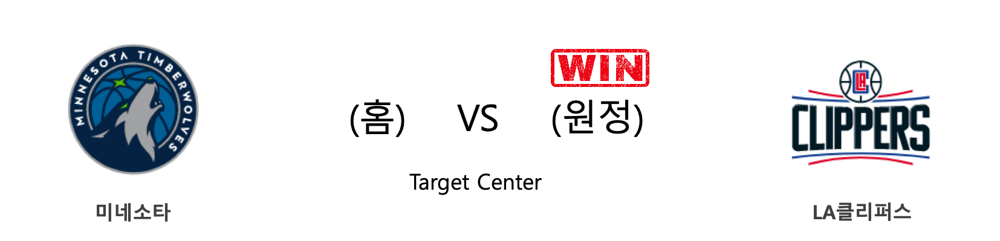
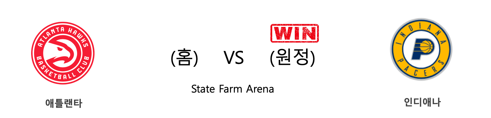
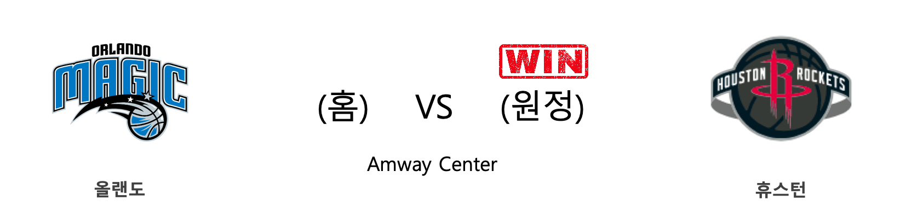
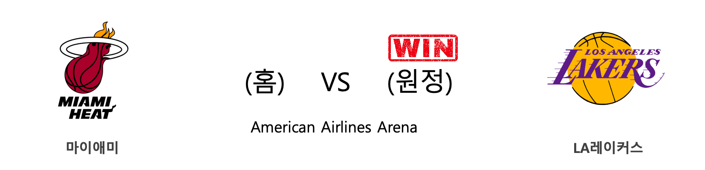
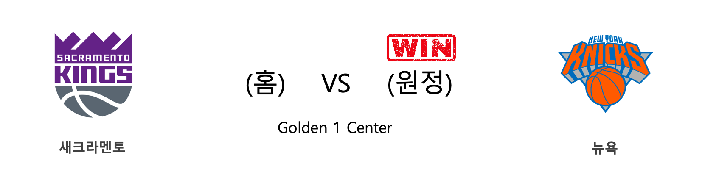
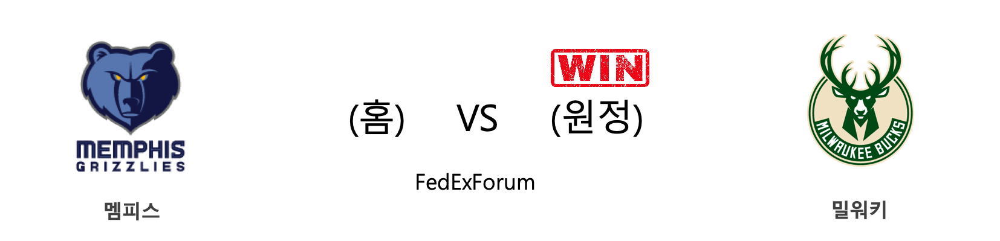
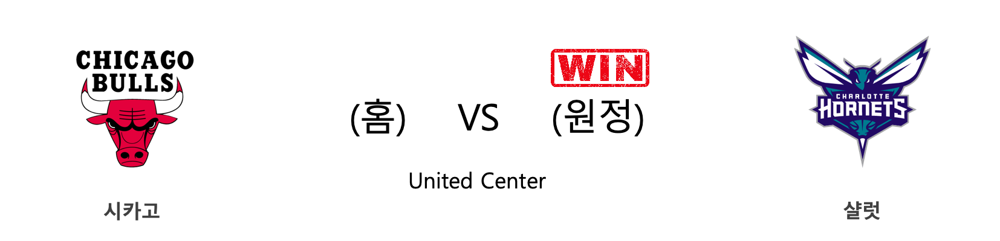

####  미네소타(홈) VS LA클리퍼스(원정) 

<table class="tg">
  <tr>
    <th class="tg-rr9t">MIN</th>
    <th class="tg-rr9t">팀</th>
    <th class="tg-rr9t">LAC</th>
  </tr>
  <tr>
    <td class="tg-dcpn">0승 1패</td>
    <td class="tg-rr9t">시즌 상대전적</td>
    <td class="tg-dcpn">1승 0패</td>
  </tr>
  <tr>
    <td class="tg-dcpn">117</td>
    <td class="tg-rr9t">점수</td>
    <td class="tg-dcpn">124</td>
  </tr>
  <tr>
    <td class="tg-dcpn">28/44(64%)</td>
    <td class="tg-rr9t">2점(%)</td>
    <td class="tg-dcpn">28/54(52%)</td>
  </tr>
  <tr>
    <td class="tg-dcpn">10/41(24%)</td>
    <td class="tg-rr9t">3점(%)</td>
    <td class="tg-dcpn">11/25(44%)</td>
  </tr>
  <tr>
    <td class="tg-dcpn">31/37(84%)</td>
    <td class="tg-rr9t">자유투(%)</td>
    <td class="tg-dcpn">35/39(90%)</td>
  </tr>
  <tr>
    <td class="tg-dcpn">39</td>
    <td class="tg-rr9t">리바운드</td>
    <td class="tg-dcpn">45</td>
  </tr>
  <tr>
    <td class="tg-dcpn">17</td>
    <td class="tg-rr9t">어시스트</td>
    <td class="tg-dcpn">16</td>
  </tr>
  <tr>
    <td class="tg-dcpn">9</td>
    <td class="tg-rr9t">스틸</td>
    <td class="tg-dcpn">5</td>
  </tr>
  <tr>
    <td class="tg-dcpn">3</td>
    <td class="tg-rr9t">블록</td>
    <td class="tg-dcpn">2</td>
  </tr>
  <tr>
    <td class="tg-dcpn">18</td>
    <td class="tg-rr9t">턴오버</td>
    <td class="tg-dcpn">19</td>
  </tr>
  <tr>
    <td class="tg-dcpn">JeffTeague(22) Karl-AnthonyT(39) AndrewWiggins(34)</td>
    <td class="tg-rr9t">주요 득점선수</td>
    <td class="tg-dcpn">KawhiLeonardF(42) MontrezlHarre(18) PaulGeorgeG(46)</td>
  </tr>
</table>

#### 경기 관련 주요 기사         

[[오늘의 NBA] (12/7) 르브론 제임스, 멜로(carmelo) 드라마의 주인공](http://sports.news.naver.com/basketball/news/read.nhn?oid=486&aid=0000001159)

[[오늘의 NBA] (12/4) 샌안토니오, 괄육취골 승리를 거두다](http://sports.news.naver.com/basketball/news/read.nhn?oid=486&aid=0000001156)

[[오늘의 NBA] (12/10) 데릭 로즈, 모터 시티의 해결사](http://sports.news.naver.com/basketball/news/read.nhn?oid=486&aid=0000001162)

[[오늘의 NBA] (12/5) 밀워키, 시스템 농구 정점에 도달하다](http://sports.news.naver.com/basketball/news/read.nhn?oid=486&aid=0000001157)

[[오늘의 NBA] (12/12) 제임스 하든 선생님의 심폐소생술](http://sports.news.naver.com/basketball/news/read.nhn?oid=486&aid=0000001164)

        
        

####  애틀랜타(홈) VS 인디애나(원정) 

<table class="tg">
  <tr>
    <th class="tg-rr9t">ATL</th>
    <th class="tg-rr9t">팀</th>
    <th class="tg-rr9t">IND</th>
  </tr>
  <tr>
    <td class="tg-dcpn">0승 2패</td>
    <td class="tg-rr9t">시즌 상대전적</td>
    <td class="tg-dcpn">2승 0패</td>
  </tr>
  <tr>
    <td class="tg-dcpn">100</td>
    <td class="tg-rr9t">점수</td>
    <td class="tg-dcpn">110</td>
  </tr>
  <tr>
    <td class="tg-dcpn">33/66(50%)</td>
    <td class="tg-rr9t">2점(%)</td>
    <td class="tg-dcpn">39/70(56%)</td>
  </tr>
  <tr>
    <td class="tg-dcpn">6/28(21%)</td>
    <td class="tg-rr9t">3점(%)</td>
    <td class="tg-dcpn">7/22(32%)</td>
  </tr>
  <tr>
    <td class="tg-dcpn">16/23(70%)</td>
    <td class="tg-rr9t">자유투(%)</td>
    <td class="tg-dcpn">11/15(73%)</td>
  </tr>
  <tr>
    <td class="tg-dcpn">50</td>
    <td class="tg-rr9t">리바운드</td>
    <td class="tg-dcpn">46</td>
  </tr>
  <tr>
    <td class="tg-dcpn">24</td>
    <td class="tg-rr9t">어시스트</td>
    <td class="tg-dcpn">28</td>
  </tr>
  <tr>
    <td class="tg-dcpn">6</td>
    <td class="tg-rr9t">스틸</td>
    <td class="tg-dcpn">7</td>
  </tr>
  <tr>
    <td class="tg-dcpn">4</td>
    <td class="tg-rr9t">블록</td>
    <td class="tg-dcpn">0</td>
  </tr>
  <tr>
    <td class="tg-dcpn">15</td>
    <td class="tg-rr9t">턴오버</td>
    <td class="tg-dcpn">14</td>
  </tr>
  <tr>
    <td class="tg-dcpn">De'AndreHunte(21) TraeYoungG(23) JabariParkerF(20)</td>
    <td class="tg-rr9t">주요 득점선수</td>
    <td class="tg-dcpn">DougMcDermott(16) T.J.WarrenF(18) MalcolmBrogdo(19)</td>
  </tr>
</table>

#### 경기 관련 주요 기사         

[[오늘의 NBA] (12/1) 새크라멘토의 IQ 농구](http://sports.news.naver.com/basketball/news/read.nhn?oid=486&aid=0000001153)

[[오늘의 NBA] (12/8) 뉴욕, NBA의 방랑자](http://sports.news.naver.com/basketball/news/read.nhn?oid=486&aid=0000001160)

[[오늘의 NBA] (12/10) 데릭 로즈, 모터 시티의 해결사](http://sports.news.naver.com/basketball/news/read.nhn?oid=486&aid=0000001162)

[[오늘의 NBA] (12/12) 제임스 하든 선생님의 심폐소생술](http://sports.news.naver.com/basketball/news/read.nhn?oid=486&aid=0000001164)

[[오늘의 NBA] (12/5) 밀워키, 시스템 농구 정점에 도달하다](http://sports.news.naver.com/basketball/news/read.nhn?oid=486&aid=0000001157)

        
        

####  올랜도(홈) VS 휴스턴(원정) 

<table class="tg">
  <tr>
    <th class="tg-rr9t">ORL</th>
    <th class="tg-rr9t">팀</th>
    <th class="tg-rr9t">HOU</th>
  </tr>
  <tr>
    <td class="tg-dcpn">0승 1패</td>
    <td class="tg-rr9t">시즌 상대전적</td>
    <td class="tg-dcpn">1승 0패</td>
  </tr>
  <tr>
    <td class="tg-dcpn">107</td>
    <td class="tg-rr9t">점수</td>
    <td class="tg-dcpn">130</td>
  </tr>
  <tr>
    <td class="tg-dcpn">25/54(46%)</td>
    <td class="tg-rr9t">2점(%)</td>
    <td class="tg-dcpn">26/47(55%)</td>
  </tr>
  <tr>
    <td class="tg-dcpn">15/37(41%)</td>
    <td class="tg-rr9t">3점(%)</td>
    <td class="tg-dcpn">22/39(56%)</td>
  </tr>
  <tr>
    <td class="tg-dcpn">12/16(75%)</td>
    <td class="tg-rr9t">자유투(%)</td>
    <td class="tg-dcpn">12/13(92%)</td>
  </tr>
  <tr>
    <td class="tg-dcpn">37</td>
    <td class="tg-rr9t">리바운드</td>
    <td class="tg-dcpn">42</td>
  </tr>
  <tr>
    <td class="tg-dcpn">24</td>
    <td class="tg-rr9t">어시스트</td>
    <td class="tg-dcpn">21</td>
  </tr>
  <tr>
    <td class="tg-dcpn">3</td>
    <td class="tg-rr9t">스틸</td>
    <td class="tg-dcpn">5</td>
  </tr>
  <tr>
    <td class="tg-dcpn">6</td>
    <td class="tg-rr9t">블록</td>
    <td class="tg-dcpn">7</td>
  </tr>
  <tr>
    <td class="tg-dcpn">6</td>
    <td class="tg-rr9t">턴오버</td>
    <td class="tg-dcpn">9</td>
  </tr>
  <tr>
    <td class="tg-dcpn">AaronGordonF(21) EvanFournierG(27)</td>
    <td class="tg-rr9t">주요 득점선수</td>
    <td class="tg-dcpn">JamesHardenG(54) BenMcLemore(18) RussellWestbr(23)</td>
  </tr>
</table>

#### 경기 관련 주요 기사         

[[오늘의 NBA] (12/10) 데릭 로즈, 모터 시티의 해결사](http://sports.news.naver.com/basketball/news/read.nhn?oid=486&aid=0000001162)

[[오늘의 NBA] (12/3) 켈리 우브레 주니어, 피닉스의 터프가이](http://sports.news.naver.com/basketball/news/read.nhn?oid=486&aid=0000001155)

[[오늘의 NBA] (12/8) 뉴욕, NBA의 방랑자](http://sports.news.naver.com/basketball/news/read.nhn?oid=486&aid=0000001160)

[[오늘의 NBA] (12/7) 르브론 제임스, 멜로(carmelo) 드라마의 주인공](http://sports.news.naver.com/basketball/news/read.nhn?oid=486&aid=0000001159)

[[오늘의 NBA] (12/4) 샌안토니오, 괄육취골 승리를 거두다](http://sports.news.naver.com/basketball/news/read.nhn?oid=486&aid=0000001156)

        
        

####  필라델피아(홈) VS 뉴올리언스(원정) 

<table class="tg">
  <tr>
    <th class="tg-rr9t">PHI</th>
    <th class="tg-rr9t">팀</th>
    <th class="tg-rr9t">NOP</th>
  </tr>
  <tr>
    <td class="tg-dcpn">1승 0패</td>
    <td class="tg-rr9t">시즌 상대전적</td>
    <td class="tg-dcpn">0승 1패</td>
  </tr>
  <tr>
    <td class="tg-dcpn">116</td>
    <td class="tg-rr9t">점수</td>
    <td class="tg-dcpn">109</td>
  </tr>
  <tr>
    <td class="tg-dcpn">36/67(54%)</td>
    <td class="tg-rr9t">2점(%)</td>
    <td class="tg-dcpn">29/64(45%)</td>
  </tr>
  <tr>
    <td class="tg-dcpn">7/20(35%)</td>
    <td class="tg-rr9t">3점(%)</td>
    <td class="tg-dcpn">9/24(38%)</td>
  </tr>
  <tr>
    <td class="tg-dcpn">23/34(68%)</td>
    <td class="tg-rr9t">자유투(%)</td>
    <td class="tg-dcpn">24/35(69%)</td>
  </tr>
  <tr>
    <td class="tg-dcpn">47</td>
    <td class="tg-rr9t">리바운드</td>
    <td class="tg-dcpn">45</td>
  </tr>
  <tr>
    <td class="tg-dcpn">24</td>
    <td class="tg-rr9t">어시스트</td>
    <td class="tg-dcpn">24</td>
  </tr>
  <tr>
    <td class="tg-dcpn">7</td>
    <td class="tg-rr9t">스틸</td>
    <td class="tg-dcpn">5</td>
  </tr>
  <tr>
    <td class="tg-dcpn">8</td>
    <td class="tg-rr9t">블록</td>
    <td class="tg-dcpn">2</td>
  </tr>
  <tr>
    <td class="tg-dcpn">9</td>
    <td class="tg-rr9t">턴오버</td>
    <td class="tg-dcpn">9</td>
  </tr>
  <tr>
    <td class="tg-dcpn">TobiasHarrisF(31) JoelEmbiidC(24) BenSimmonsG(24)</td>
    <td class="tg-rr9t">주요 득점선수</td>
    <td class="tg-dcpn">JJRedickG(19) BrandonIngram(32)</td>
  </tr>
</table>

#### 경기 관련 주요 기사         

[[NBA UP&DOWN] ‘드디어 우승?’ PHI 'UP', '여전히 리빌딩?‘ NOP ’DOWN'](http://sports.news.naver.com/basketball/news/read.nhn?oid=065&aid=0000191278)

[[오늘의 NBA] (12/6) 마이크 댄토니, 토론토 수비를 농락하다](http://sports.news.naver.com/basketball/news/read.nhn?oid=486&aid=0000001158)

[[오늘의 NBA] (11/11) 토론토, 디펜딩 챔피언의 저력](http://sports.news.naver.com/basketball/news/read.nhn?oid=486&aid=0000001134)

[[오늘의 NBA] (12/12) 제임스 하든 선생님의 심폐소생술](http://sports.news.naver.com/basketball/news/read.nhn?oid=486&aid=0000001164)

[[오늘의 NBA] (12/8) 뉴욕, NBA의 방랑자](http://sports.news.naver.com/basketball/news/read.nhn?oid=486&aid=0000001160)

        
        

####  마이애미(홈) VS LA레이커스(원정) 

<table class="tg">
  <tr>
    <th class="tg-rr9t">MIA</th>
    <th class="tg-rr9t">팀</th>
    <th class="tg-rr9t">LAL</th>
  </tr>
  <tr>
    <td class="tg-dcpn">0승 2패</td>
    <td class="tg-rr9t">시즌 상대전적</td>
    <td class="tg-dcpn">2승 0패</td>
  </tr>
  <tr>
    <td class="tg-dcpn">110</td>
    <td class="tg-rr9t">점수</td>
    <td class="tg-dcpn">113</td>
  </tr>
  <tr>
    <td class="tg-dcpn">29/52(56%)</td>
    <td class="tg-rr9t">2점(%)</td>
    <td class="tg-dcpn">31/50(62%)</td>
  </tr>
  <tr>
    <td class="tg-dcpn">10/33(30%)</td>
    <td class="tg-rr9t">3점(%)</td>
    <td class="tg-dcpn">12/37(32%)</td>
  </tr>
  <tr>
    <td class="tg-dcpn">22/28(79%)</td>
    <td class="tg-rr9t">자유투(%)</td>
    <td class="tg-dcpn">15/23(65%)</td>
  </tr>
  <tr>
    <td class="tg-dcpn">34</td>
    <td class="tg-rr9t">리바운드</td>
    <td class="tg-dcpn">50</td>
  </tr>
  <tr>
    <td class="tg-dcpn">24</td>
    <td class="tg-rr9t">어시스트</td>
    <td class="tg-dcpn">26</td>
  </tr>
  <tr>
    <td class="tg-dcpn">8</td>
    <td class="tg-rr9t">스틸</td>
    <td class="tg-dcpn">5</td>
  </tr>
  <tr>
    <td class="tg-dcpn">2</td>
    <td class="tg-rr9t">블록</td>
    <td class="tg-dcpn">9</td>
  </tr>
  <tr>
    <td class="tg-dcpn">8</td>
    <td class="tg-rr9t">턴오버</td>
    <td class="tg-dcpn">19</td>
  </tr>
  <tr>
    <td class="tg-dcpn">JimmyButlerF(23) KellyOlynyk(15) DerrickJonesJ(17) KendrickNunnG(16)</td>
    <td class="tg-rr9t">주요 득점선수</td>
    <td class="tg-dcpn">LeBronJamesF(28) AnthonyDavisF(33) KentaviousCal(15)</td>
  </tr>
</table>

#### 경기 관련 주요 기사         

[[오늘의 NBA] (12/10) 데릭 로즈, 모터 시티의 해결사](http://sports.news.naver.com/basketball/news/read.nhn?oid=486&aid=0000001162)

[[오늘의 NBA] (12/12) 제임스 하든 선생님의 심폐소생술](http://sports.news.naver.com/basketball/news/read.nhn?oid=486&aid=0000001164)

[[오늘의 NBA] (12/9) 앤써니 데이비스, 구단 역사에 이름을 남기다](http://sports.news.naver.com/basketball/news/read.nhn?oid=486&aid=0000001161)

[[오늘의 NBA] (12/7) 르브론 제임스, 멜로(carmelo) 드라마의 주인공](http://sports.news.naver.com/basketball/news/read.nhn?oid=486&aid=0000001159)

[[부상] 데일리 NBA 부상자 업데이트 (12월 14일) : 원정 전승 LAL, 홈 무패 MIA](http://sports.news.naver.com/basketball/news/read.nhn?oid=065&aid=0000193875)

        
        

####  유타(홈) VS 골든스테이트(원정) 

<table class="tg">
  <tr>
    <th class="tg-rr9t">UTA</th>
    <th class="tg-rr9t">팀</th>
    <th class="tg-rr9t">GSW</th>
  </tr>
  <tr>
    <td class="tg-dcpn">3승 0패</td>
    <td class="tg-rr9t">시즌 상대전적</td>
    <td class="tg-dcpn">0승 3패</td>
  </tr>
  <tr>
    <td class="tg-dcpn">114</td>
    <td class="tg-rr9t">점수</td>
    <td class="tg-dcpn">106</td>
  </tr>
  <tr>
    <td class="tg-dcpn">21/41(51%)</td>
    <td class="tg-rr9t">2점(%)</td>
    <td class="tg-dcpn">32/62(52%)</td>
  </tr>
  <tr>
    <td class="tg-dcpn">16/38(42%)</td>
    <td class="tg-rr9t">3점(%)</td>
    <td class="tg-dcpn">9/29(31%)</td>
  </tr>
  <tr>
    <td class="tg-dcpn">24/31(77%)</td>
    <td class="tg-rr9t">자유투(%)</td>
    <td class="tg-dcpn">15/22(68%)</td>
  </tr>
  <tr>
    <td class="tg-dcpn">43</td>
    <td class="tg-rr9t">리바운드</td>
    <td class="tg-dcpn">48</td>
  </tr>
  <tr>
    <td class="tg-dcpn">22</td>
    <td class="tg-rr9t">어시스트</td>
    <td class="tg-dcpn">19</td>
  </tr>
  <tr>
    <td class="tg-dcpn">5</td>
    <td class="tg-rr9t">스틸</td>
    <td class="tg-dcpn">9</td>
  </tr>
  <tr>
    <td class="tg-dcpn">3</td>
    <td class="tg-rr9t">블록</td>
    <td class="tg-dcpn">7</td>
  </tr>
  <tr>
    <td class="tg-dcpn">13</td>
    <td class="tg-rr9t">턴오버</td>
    <td class="tg-dcpn">12</td>
  </tr>
  <tr>
    <td class="tg-dcpn">RudyGobertC(15) DonovanMitche(28) BojanBogdanov(32)</td>
    <td class="tg-rr9t">주요 득점선수</td>
    <td class="tg-dcpn">DamionLee(21) AlecBurksG(24) D'AngeloRusse(18)</td>
  </tr>
</table>

#### 경기 관련 주요 기사         

[[오늘의 NBA] (12/8) 뉴욕, NBA의 방랑자](http://sports.news.naver.com/basketball/news/read.nhn?oid=486&aid=0000001160)

[[오늘의 NBA] (12/5) 밀워키, 시스템 농구 정점에 도달하다](http://sports.news.naver.com/basketball/news/read.nhn?oid=486&aid=0000001157)

[[오늘의 NBA] (12/9) 앤써니 데이비스, 구단 역사에 이름을 남기다](http://sports.news.naver.com/basketball/news/read.nhn?oid=486&aid=0000001161)

[[오늘의 NBA] (12/12) 제임스 하든 선생님의 심폐소생술](http://sports.news.naver.com/basketball/news/read.nhn?oid=486&aid=0000001164)

[[오늘의 NBA] (12/3) 켈리 우브레 주니어, 피닉스의 터프가이](http://sports.news.naver.com/basketball/news/read.nhn?oid=486&aid=0000001155)

        
        

####  새크라멘토(홈) VS 뉴욕(원정) 

<table class="tg">
  <tr>
    <th class="tg-rr9t">SAC</th>
    <th class="tg-rr9t">팀</th>
    <th class="tg-rr9t">NYK</th>
  </tr>
  <tr>
    <td class="tg-dcpn">1승 1패</td>
    <td class="tg-rr9t">시즌 상대전적</td>
    <td class="tg-dcpn">1승 1패</td>
  </tr>
  <tr>
    <td class="tg-dcpn">101</td>
    <td class="tg-rr9t">점수</td>
    <td class="tg-dcpn">103</td>
  </tr>
  <tr>
    <td class="tg-dcpn">22/44(50%)</td>
    <td class="tg-rr9t">2점(%)</td>
    <td class="tg-dcpn">35/65(54%)</td>
  </tr>
  <tr>
    <td class="tg-dcpn">17/39(44%)</td>
    <td class="tg-rr9t">3점(%)</td>
    <td class="tg-dcpn">9/30(30%)</td>
  </tr>
  <tr>
    <td class="tg-dcpn">6/8(75%)</td>
    <td class="tg-rr9t">자유투(%)</td>
    <td class="tg-dcpn">6/10(60%)</td>
  </tr>
  <tr>
    <td class="tg-dcpn">41</td>
    <td class="tg-rr9t">리바운드</td>
    <td class="tg-dcpn">48</td>
  </tr>
  <tr>
    <td class="tg-dcpn">19</td>
    <td class="tg-rr9t">어시스트</td>
    <td class="tg-dcpn">24</td>
  </tr>
  <tr>
    <td class="tg-dcpn">0</td>
    <td class="tg-rr9t">스틸</td>
    <td class="tg-dcpn">7</td>
  </tr>
  <tr>
    <td class="tg-dcpn">3</td>
    <td class="tg-rr9t">블록</td>
    <td class="tg-dcpn">3</td>
  </tr>
  <tr>
    <td class="tg-dcpn">13</td>
    <td class="tg-rr9t">턴오버</td>
    <td class="tg-dcpn">8</td>
  </tr>
  <tr>
    <td class="tg-dcpn">HarrisonBarne(18) BuddyHieldG(34)</td>
    <td class="tg-rr9t">주요 득점선수</td>
    <td class="tg-dcpn">ElfridPayton(16) JuliusRandleF(26)</td>
  </tr>
</table>

#### 경기 관련 주요 기사         

[[오늘의 NBA] (12/10) 데릭 로즈, 모터 시티의 해결사](http://sports.news.naver.com/basketball/news/read.nhn?oid=486&aid=0000001162)

[[오늘의 NBA] (12/11) 마이애미의 커리어 나이트 파티](http://sports.news.naver.com/basketball/news/read.nhn?oid=486&aid=0000001163)

[[오늘의 NBA] (12/8) 뉴욕, NBA의 방랑자](http://sports.news.naver.com/basketball/news/read.nhn?oid=486&aid=0000001160)

[[오늘의 NBA] (12/6) 마이크 댄토니, 토론토 수비를 농락하다](http://sports.news.naver.com/basketball/news/read.nhn?oid=486&aid=0000001158)

[[오늘의 NBA] (12/12) 제임스 하든 선생님의 심폐소생술](http://sports.news.naver.com/basketball/news/read.nhn?oid=486&aid=0000001164)

        
        

####  멤피스(홈) VS 밀워키(원정) 

<table class="tg">
  <tr>
    <th class="tg-rr9t">MEM</th>
    <th class="tg-rr9t">팀</th>
    <th class="tg-rr9t">MIL</th>
  </tr>
  <tr>
    <td class="tg-dcpn">0승 1패</td>
    <td class="tg-rr9t">시즌 상대전적</td>
    <td class="tg-dcpn">1승 0패</td>
  </tr>
  <tr>
    <td class="tg-dcpn">114</td>
    <td class="tg-rr9t">점수</td>
    <td class="tg-dcpn">127</td>
  </tr>
  <tr>
    <td class="tg-dcpn">18/49(37%)</td>
    <td class="tg-rr9t">2점(%)</td>
    <td class="tg-dcpn">33/57(58%)</td>
  </tr>
  <tr>
    <td class="tg-dcpn">20/49(41%)</td>
    <td class="tg-rr9t">3점(%)</td>
    <td class="tg-dcpn">11/30(37%)</td>
  </tr>
  <tr>
    <td class="tg-dcpn">18/23(78%)</td>
    <td class="tg-rr9t">자유투(%)</td>
    <td class="tg-dcpn">28/33(85%)</td>
  </tr>
  <tr>
    <td class="tg-dcpn">45</td>
    <td class="tg-rr9t">리바운드</td>
    <td class="tg-dcpn">55</td>
  </tr>
  <tr>
    <td class="tg-dcpn">27</td>
    <td class="tg-rr9t">어시스트</td>
    <td class="tg-dcpn">22</td>
  </tr>
  <tr>
    <td class="tg-dcpn">9</td>
    <td class="tg-rr9t">스틸</td>
    <td class="tg-dcpn">4</td>
  </tr>
  <tr>
    <td class="tg-dcpn">5</td>
    <td class="tg-rr9t">블록</td>
    <td class="tg-dcpn">3</td>
  </tr>
  <tr>
    <td class="tg-dcpn">13</td>
    <td class="tg-rr9t">턴오버</td>
    <td class="tg-dcpn">17</td>
  </tr>
  <tr>
    <td class="tg-dcpn">JarenJacksonJ(43) DillonBrooksG(19) JaeCrowderF(15)</td>
    <td class="tg-rr9t">주요 득점선수</td>
    <td class="tg-dcpn">KhrisMiddleto(26) GiannisAnteto(37)</td>
  </tr>
</table>

#### 경기 관련 주요 기사         

[[오늘의 NBA] (12/12) 제임스 하든 선생님의 심폐소생술](http://sports.news.naver.com/basketball/news/read.nhn?oid=486&aid=0000001164)

[[오늘의 NBA] (12/2) 토론토, 두 마리 토끼를 노린다!](http://sports.news.naver.com/basketball/news/read.nhn?oid=486&aid=0000001154)

[[오늘의 NBA] (12/10) 데릭 로즈, 모터 시티의 해결사](http://sports.news.naver.com/basketball/news/read.nhn?oid=486&aid=0000001162)

[[오늘의 NBA] (12/3) 켈리 우브레 주니어, 피닉스의 터프가이](http://sports.news.naver.com/basketball/news/read.nhn?oid=486&aid=0000001155)

[[오늘의 NBA] (12/5) 밀워키, 시스템 농구 정점에 도달하다](http://sports.news.naver.com/basketball/news/read.nhn?oid=486&aid=0000001157)

        
        

####  시카고(홈) VS 샬럿(원정) 

<table class="tg">
  <tr>
    <th class="tg-rr9t">CHI</th>
    <th class="tg-rr9t">팀</th>
    <th class="tg-rr9t">CHA</th>
  </tr>
  <tr>
    <td class="tg-dcpn">1승 2패</td>
    <td class="tg-rr9t">시즌 상대전적</td>
    <td class="tg-dcpn">2승 1패</td>
  </tr>
  <tr>
    <td class="tg-dcpn">73</td>
    <td class="tg-rr9t">점수</td>
    <td class="tg-dcpn">83</td>
  </tr>
  <tr>
    <td class="tg-dcpn">20/56(36%)</td>
    <td class="tg-rr9t">2점(%)</td>
    <td class="tg-dcpn">24/48(50%)</td>
  </tr>
  <tr>
    <td class="tg-dcpn">7/34(21%)</td>
    <td class="tg-rr9t">3점(%)</td>
    <td class="tg-dcpn">6/31(19%)</td>
  </tr>
  <tr>
    <td class="tg-dcpn">12/14(86%)</td>
    <td class="tg-rr9t">자유투(%)</td>
    <td class="tg-dcpn">17/21(81%)</td>
  </tr>
  <tr>
    <td class="tg-dcpn">45</td>
    <td class="tg-rr9t">리바운드</td>
    <td class="tg-dcpn">60</td>
  </tr>
  <tr>
    <td class="tg-dcpn">20</td>
    <td class="tg-rr9t">어시스트</td>
    <td class="tg-dcpn">21</td>
  </tr>
  <tr>
    <td class="tg-dcpn">11</td>
    <td class="tg-rr9t">스틸</td>
    <td class="tg-dcpn">9</td>
  </tr>
  <tr>
    <td class="tg-dcpn">7</td>
    <td class="tg-rr9t">블록</td>
    <td class="tg-dcpn">5</td>
  </tr>
  <tr>
    <td class="tg-dcpn">12</td>
    <td class="tg-rr9t">턴오버</td>
    <td class="tg-dcpn">20</td>
  </tr>
  <tr>
    <td class="tg-dcpn"></td>
    <td class="tg-rr9t">주요 득점선수</td>
    <td class="tg-dcpn">Devonte'Graha(16)</td>
  </tr>
</table>

#### 경기 관련 주요 기사         

[[오늘의 NBA] (12/10) 데릭 로즈, 모터 시티의 해결사](http://sports.news.naver.com/basketball/news/read.nhn?oid=486&aid=0000001162)

[[오늘의 NBA] (12/7) 르브론 제임스, 멜로(carmelo) 드라마의 주인공](http://sports.news.naver.com/basketball/news/read.nhn?oid=486&aid=0000001159)

[[오늘의 NBA] (12/9) 앤써니 데이비스, 구단 역사에 이름을 남기다](http://sports.news.naver.com/basketball/news/read.nhn?oid=486&aid=0000001161)

[Eating My Way Through Vietnam’s Most Livable City](https://www.nytimes.com/2019/12/03/travel/eating-my-way-through-vietnams-most-livable-city.html?partner=naver)

[[오늘의 NBA] (12/12) 제임스 하든 선생님의 심폐소생술](http://sports.news.naver.com/basketball/news/read.nhn?oid=486&aid=0000001164)

        
        

#### 리그 (Eastern) 순위
    

<table class="tg">
  <tr>
    <th class="tg-d14o">순위</th>
    <th class="tg-d14o">팀명</th>
    <th class="tg-d14o">경기수</th>
    <th class="tg-d14o">승</th>
    <th class="tg-d14o">패</th>
    <th class="tg-d14o">승차</th>
    <th class="tg-d14o">승률</th>
  </tr>
  
<tr>
    <td class="tg-50j8">1</td>
    <td class="tg-50j8">MIL</td>
    <td class="tg-50j8">26</td>
    <td class="tg-50j8">23</td>
    <td class="tg-50j8">3</td>
    <td class="tg-50j8">0</td>
    <td class="tg-50j8">0.885</td>
</tr>

<tr>
    <td class="tg-50j8">2</td>
    <td class="tg-50j8">PHI</td>
    <td class="tg-50j8">26</td>
    <td class="tg-50j8">19</td>
    <td class="tg-50j8">7</td>
    <td class="tg-50j8">4</td>
    <td class="tg-50j8">0.731</td>
</tr>

<tr>
    <td class="tg-50j8">3</td>
    <td class="tg-50j8">MIA</td>
    <td class="tg-50j8">25</td>
    <td class="tg-50j8">18</td>
    <td class="tg-50j8">7</td>
    <td class="tg-50j8">5</td>
    <td class="tg-50j8">0.72</td>
</tr>

<tr>
    <td class="tg-50j8">4</td>
    <td class="tg-50j8">BOS</td>
    <td class="tg-50j8">23</td>
    <td class="tg-50j8">17</td>
    <td class="tg-50j8">6</td>
    <td class="tg-50j8">6</td>
    <td class="tg-50j8">0.739</td>
</tr>

<tr>
    <td class="tg-50j8">5</td>
    <td class="tg-50j8">IND</td>
    <td class="tg-50j8">26</td>
    <td class="tg-50j8">17</td>
    <td class="tg-50j8">9</td>
    <td class="tg-50j8">6</td>
    <td class="tg-50j8">0.654</td>
</tr>

<tr>
    <td class="tg-50j8">6</td>
    <td class="tg-50j8">TOR</td>
    <td class="tg-50j8">24</td>
    <td class="tg-50j8">16</td>
    <td class="tg-50j8">8</td>
    <td class="tg-50j8">7</td>
    <td class="tg-50j8">0.667</td>
</tr>

<tr>
    <td class="tg-50j8">7</td>
    <td class="tg-50j8">BKN</td>
    <td class="tg-50j8">24</td>
    <td class="tg-50j8">13</td>
    <td class="tg-50j8">11</td>
    <td class="tg-50j8">10</td>
    <td class="tg-50j8">0.542</td>
</tr>

<tr>
    <td class="tg-50j8">8</td>
    <td class="tg-50j8">CHA</td>
    <td class="tg-50j8">28</td>
    <td class="tg-50j8">12</td>
    <td class="tg-50j8">16</td>
    <td class="tg-50j8">11</td>
    <td class="tg-50j8">0.429</td>
</tr>

<tr>
    <td class="tg-50j8">9</td>
    <td class="tg-50j8">ORL</td>
    <td class="tg-50j8">25</td>
    <td class="tg-50j8">11</td>
    <td class="tg-50j8">14</td>
    <td class="tg-50j8">12</td>
    <td class="tg-50j8">0.44</td>
</tr>

<tr>
    <td class="tg-50j8">10</td>
    <td class="tg-50j8">DET</td>
    <td class="tg-50j8">24</td>
    <td class="tg-50j8">10</td>
    <td class="tg-50j8">14</td>
    <td class="tg-50j8">13</td>
    <td class="tg-50j8">0.417</td>
</tr>

<tr>
    <td class="tg-50j8">11</td>
    <td class="tg-50j8">CHI</td>
    <td class="tg-50j8">27</td>
    <td class="tg-50j8">9</td>
    <td class="tg-50j8">18</td>
    <td class="tg-50j8">14</td>
    <td class="tg-50j8">0.333</td>
</tr>

<tr>
    <td class="tg-50j8">12</td>
    <td class="tg-50j8">WAS</td>
    <td class="tg-50j8">23</td>
    <td class="tg-50j8">7</td>
    <td class="tg-50j8">16</td>
    <td class="tg-50j8">16</td>
    <td class="tg-50j8">0.304</td>
</tr>

<tr>
    <td class="tg-50j8">13</td>
    <td class="tg-50j8">NYK</td>
    <td class="tg-50j8">26</td>
    <td class="tg-50j8">6</td>
    <td class="tg-50j8">20</td>
    <td class="tg-50j8">17</td>
    <td class="tg-50j8">0.231</td>
</tr>

<tr>
    <td class="tg-50j8">13</td>
    <td class="tg-50j8">ATL</td>
    <td class="tg-50j8">26</td>
    <td class="tg-50j8">6</td>
    <td class="tg-50j8">20</td>
    <td class="tg-50j8">17</td>
    <td class="tg-50j8">0.231</td>
</tr>

<tr>
    <td class="tg-50j8">15</td>
    <td class="tg-50j8">CLE</td>
    <td class="tg-50j8">24</td>
    <td class="tg-50j8">5</td>
    <td class="tg-50j8">19</td>
    <td class="tg-50j8">18</td>
    <td class="tg-50j8">0.208</td>
</tr>
</table> 
#### 리그 (Western) 순위
    

<table class="tg">
  <tr>
    <th class="tg-d14o">순위</th>
    <th class="tg-d14o">팀명</th>
    <th class="tg-d14o">경기수</th>
    <th class="tg-d14o">승</th>
    <th class="tg-d14o">패</th>
    <th class="tg-d14o">승차</th>
    <th class="tg-d14o">승률</th>
  </tr>
  
<tr>
    <td class="tg-50j8">1</td>
    <td class="tg-50j8">LAL</td>
    <td class="tg-50j8">26</td>
    <td class="tg-50j8">23</td>
    <td class="tg-50j8">3</td>
    <td class="tg-50j8">0</td>
    <td class="tg-50j8">0.885</td>
</tr>

<tr>
    <td class="tg-50j8">2</td>
    <td class="tg-50j8">LAC</td>
    <td class="tg-50j8">27</td>
    <td class="tg-50j8">20</td>
    <td class="tg-50j8">7</td>
    <td class="tg-50j8">3</td>
    <td class="tg-50j8">0.741</td>
</tr>

<tr>
    <td class="tg-50j8">3</td>
    <td class="tg-50j8">HOU</td>
    <td class="tg-50j8">25</td>
    <td class="tg-50j8">17</td>
    <td class="tg-50j8">8</td>
    <td class="tg-50j8">6</td>
    <td class="tg-50j8">0.68</td>
</tr>

<tr>
    <td class="tg-50j8">4</td>
    <td class="tg-50j8">DAL</td>
    <td class="tg-50j8">23</td>
    <td class="tg-50j8">16</td>
    <td class="tg-50j8">7</td>
    <td class="tg-50j8">7</td>
    <td class="tg-50j8">0.696</td>
</tr>

<tr>
    <td class="tg-50j8">5</td>
    <td class="tg-50j8">UTA</td>
    <td class="tg-50j8">26</td>
    <td class="tg-50j8">15</td>
    <td class="tg-50j8">11</td>
    <td class="tg-50j8">8</td>
    <td class="tg-50j8">0.577</td>
</tr>

<tr>
    <td class="tg-50j8">6</td>
    <td class="tg-50j8">DEN</td>
    <td class="tg-50j8">22</td>
    <td class="tg-50j8">14</td>
    <td class="tg-50j8">8</td>
    <td class="tg-50j8">9</td>
    <td class="tg-50j8">0.636</td>
</tr>

<tr>
    <td class="tg-50j8">7</td>
    <td class="tg-50j8">OKC</td>
    <td class="tg-50j8">24</td>
    <td class="tg-50j8">11</td>
    <td class="tg-50j8">13</td>
    <td class="tg-50j8">12</td>
    <td class="tg-50j8">0.458</td>
</tr>

<tr>
    <td class="tg-50j8">7</td>
    <td class="tg-50j8">PHX</td>
    <td class="tg-50j8">24</td>
    <td class="tg-50j8">11</td>
    <td class="tg-50j8">13</td>
    <td class="tg-50j8">12</td>
    <td class="tg-50j8">0.458</td>
</tr>

<tr>
    <td class="tg-50j8">9</td>
    <td class="tg-50j8">SAC</td>
    <td class="tg-50j8">25</td>
    <td class="tg-50j8">11</td>
    <td class="tg-50j8">14</td>
    <td class="tg-50j8">12</td>
    <td class="tg-50j8">0.44</td>
</tr>

<tr>
    <td class="tg-50j8">10</td>
    <td class="tg-50j8">POR</td>
    <td class="tg-50j8">25</td>
    <td class="tg-50j8">10</td>
    <td class="tg-50j8">15</td>
    <td class="tg-50j8">13</td>
    <td class="tg-50j8">0.4</td>
</tr>

<tr>
    <td class="tg-50j8">10</td>
    <td class="tg-50j8">MIN</td>
    <td class="tg-50j8">25</td>
    <td class="tg-50j8">10</td>
    <td class="tg-50j8">15</td>
    <td class="tg-50j8">13</td>
    <td class="tg-50j8">0.4</td>
</tr>

<tr>
    <td class="tg-50j8">12</td>
    <td class="tg-50j8">SAS</td>
    <td class="tg-50j8">23</td>
    <td class="tg-50j8">9</td>
    <td class="tg-50j8">14</td>
    <td class="tg-50j8">14</td>
    <td class="tg-50j8">0.391</td>
</tr>

<tr>
    <td class="tg-50j8">13</td>
    <td class="tg-50j8">MEM</td>
    <td class="tg-50j8">25</td>
    <td class="tg-50j8">8</td>
    <td class="tg-50j8">17</td>
    <td class="tg-50j8">15</td>
    <td class="tg-50j8">0.32</td>
</tr>

<tr>
    <td class="tg-50j8">14</td>
    <td class="tg-50j8">NOP</td>
    <td class="tg-50j8">26</td>
    <td class="tg-50j8">6</td>
    <td class="tg-50j8">20</td>
    <td class="tg-50j8">17</td>
    <td class="tg-50j8">0.231</td>
</tr>

<tr>
    <td class="tg-50j8">15</td>
    <td class="tg-50j8">GSW</td>
    <td class="tg-50j8">27</td>
    <td class="tg-50j8">5</td>
    <td class="tg-50j8">22</td>
    <td class="tg-50j8">18</td>
    <td class="tg-50j8">0.185</td>
</tr>
</table> 

        
        
#nba #미국농구 #엔비에이 #농구분석 #토토 #스포츠토토 #경기예측 #농구결과 #20191214 #미네소타 #LA클리퍼스 #애틀랜타 #인디애나 #올랜도 #휴스턴 #필라델피아 #뉴올리언스 #마이애미 #LA레이커스 #유타 #골든스테이트 #새크라멘토 #뉴욕 #멤피스 #밀워키 #시카고 #샬럿 #미네소타LA클리퍼스 #애틀랜타인디애나 #올랜도휴스턴 #필라델피아뉴올리언스 #마이애미LA레이커스 #유타골든스테이트 #새크라멘토뉴욕 #멤피스밀워키 #시카고샬럿 