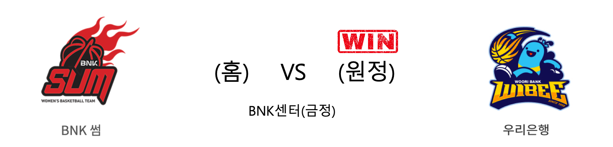

####  BNK썸(홈) VS 우리은행(원정) 

<table class="tg">
  <tr>
    <th class="tg-rr9t">BNK썸</th>
    <th class="tg-rr9t">팀</th>
    <th class="tg-rr9t">우리은행</th>
  </tr>
  <tr>
    <td class="tg-dcpn">1승 2패</td>
    <td class="tg-rr9t">시즌 상대전적</td>
    <td class="tg-dcpn">2승 1패</td>
  </tr>
  <tr>
    <td class="tg-dcpn">60</td>
    <td class="tg-rr9t">점수</td>
    <td class="tg-dcpn">73</td>
  </tr>
  <tr>
    <td class="tg-dcpn">14/46(30%)</td>
    <td class="tg-rr9t">2점(%)</td>
    <td class="tg-dcpn">23/39(59%)</td>
  </tr>
  <tr>
    <td class="tg-dcpn">8/16(50%)</td>
    <td class="tg-rr9t">3점(%)</td>
    <td class="tg-dcpn">5/19(26%)</td>
  </tr>
  <tr>
    <td class="tg-dcpn">8/10(80%)</td>
    <td class="tg-rr9t">자유투(%)</td>
    <td class="tg-dcpn">12/16(75%)</td>
  </tr>
  <tr>
    <td class="tg-dcpn">28</td>
    <td class="tg-rr9t">리바운드</td>
    <td class="tg-dcpn">31</td>
  </tr>
  <tr>
    <td class="tg-dcpn">13</td>
    <td class="tg-rr9t">어시스트</td>
    <td class="tg-dcpn">14</td>
  </tr>
  <tr>
    <td class="tg-dcpn">3</td>
    <td class="tg-rr9t">스틸</td>
    <td class="tg-dcpn">7</td>
  </tr>
  <tr>
    <td class="tg-dcpn">11</td>
    <td class="tg-rr9t">블록</td>
    <td class="tg-dcpn">6</td>
  </tr>
  <tr>
    <td class="tg-dcpn">20</td>
    <td class="tg-rr9t">턴오버</td>
    <td class="tg-dcpn">13</td>
  </tr>
  <tr>
    <td class="tg-dcpn">단타스(29)</td>
    <td class="tg-rr9t">주요 득점선수</td>
    <td class="tg-dcpn">그레이(23)</td>
  </tr>
</table>

#### 경기 관련 주요 기사         

[[내 맘대로 프리뷰] BNK vs 우리은행, '좋은 기억 유지-나쁜 기억 깨기'](http://www.basketkorea.com/news/articleView.html?idxno=190732)

[[BK Review] '그레이 4Q 골밑 장악' 우리은행, BNK전 설욕 성공](http://www.basketkorea.com/news/articleView.html?idxno=190746)

[[사진]BNK썸 홈구장 스포원파크 BNK센터](http://www.osen.co.kr/article/G1111277554)

[우리은행 위성우 감독, 통산 199승 달성…역대 감독 최다승 타이](http://www.rookie.co.kr/news/articleView.html?idxno=36297)

        
        

#### 리그 순위

<table class="tg">
  <tr>
    <th class="tg-d14o">순위</th>
    <th class="tg-d14o">팀명</th>
    <th class="tg-d14o">경기수</th>
    <th class="tg-d14o">승</th>
    <th class="tg-d14o">패</th>
    <th class="tg-d14o">승차</th>
    <th class="tg-d14o">승률</th>
  </tr>
  
<tr>
    <td class="tg-50j8">1</td>
    <td class="tg-50j8">우리은행</td>
    <td class="tg-50j8">11</td>
    <td class="tg-50j8">9</td>
    <td class="tg-50j8">2</td>
    <td class="tg-50j8">0</td>
    <td class="tg-50j8">0.818</td>
</tr>

<tr>
    <td class="tg-50j8">1</td>
    <td class="tg-50j8">KB스타즈</td>
    <td class="tg-50j8">11</td>
    <td class="tg-50j8">9</td>
    <td class="tg-50j8">2</td>
    <td class="tg-50j8">0</td>
    <td class="tg-50j8">0.818</td>
</tr>

<tr>
    <td class="tg-50j8">3</td>
    <td class="tg-50j8">신한은행</td>
    <td class="tg-50j8">10</td>
    <td class="tg-50j8">5</td>
    <td class="tg-50j8">5</td>
    <td class="tg-50j8">4</td>
    <td class="tg-50j8">0.5</td>
</tr>

<tr>
    <td class="tg-50j8">4</td>
    <td class="tg-50j8">KEB하나</td>
    <td class="tg-50j8">10</td>
    <td class="tg-50j8">4</td>
    <td class="tg-50j8">6</td>
    <td class="tg-50j8">5</td>
    <td class="tg-50j8">0.4</td>
</tr>

<tr>
    <td class="tg-50j8">5</td>
    <td class="tg-50j8">삼성생명</td>
    <td class="tg-50j8">11</td>
    <td class="tg-50j8">3</td>
    <td class="tg-50j8">8</td>
    <td class="tg-50j8">6</td>
    <td class="tg-50j8">0.273</td>
</tr>

<tr>
    <td class="tg-50j8">6</td>
    <td class="tg-50j8">BNK썸</td>
    <td class="tg-50j8">11</td>
    <td class="tg-50j8">2</td>
    <td class="tg-50j8">9</td>
    <td class="tg-50j8">7</td>
    <td class="tg-50j8">0.182</td>
</tr>
</table> 

        
        
#wkbl #국내농구 #여자농구 #농구분석 #토토 #스포츠토토 #경기예측 #농구결과 #20191214 #BNK썸 #우리은행 #BNK썸우리은행 