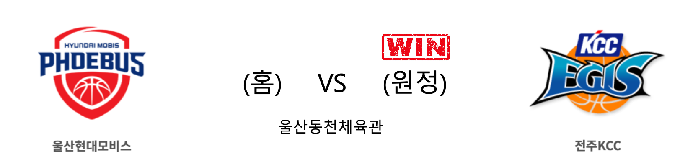
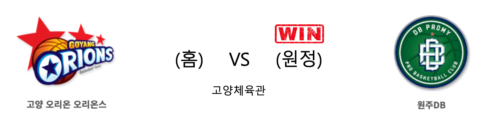

####  울산현대모비스(홈) VS 전주KCC(원정) 

<table class="tg">
  <tr>
    <th class="tg-rr9t">울산현대모비스</th>
    <th class="tg-rr9t">팀</th>
    <th class="tg-rr9t">전주KCC</th>
  </tr>
  <tr>
    <td class="tg-dcpn">1승 2패</td>
    <td class="tg-rr9t">시즌 상대전적</td>
    <td class="tg-dcpn">2승 1패</td>
  </tr>
  <tr>
    <td class="tg-dcpn">69</td>
    <td class="tg-rr9t">점수</td>
    <td class="tg-dcpn">71</td>
  </tr>
  <tr>
    <td class="tg-dcpn">19/39(49%)</td>
    <td class="tg-rr9t">2점(%)</td>
    <td class="tg-dcpn">23/52(44%)</td>
  </tr>
  <tr>
    <td class="tg-dcpn">7/24(29%)</td>
    <td class="tg-rr9t">3점(%)</td>
    <td class="tg-dcpn">4/13(31%)</td>
  </tr>
  <tr>
    <td class="tg-dcpn">10/14(71%)</td>
    <td class="tg-rr9t">자유투(%)</td>
    <td class="tg-dcpn">13/13(100%)</td>
  </tr>
  <tr>
    <td class="tg-dcpn">35</td>
    <td class="tg-rr9t">리바운드</td>
    <td class="tg-dcpn">32</td>
  </tr>
  <tr>
    <td class="tg-dcpn">0</td>
    <td class="tg-rr9t">어시스트</td>
    <td class="tg-dcpn">0</td>
  </tr>
  <tr>
    <td class="tg-dcpn">15</td>
    <td class="tg-rr9t">스틸</td>
    <td class="tg-dcpn">13</td>
  </tr>
  <tr>
    <td class="tg-dcpn">8</td>
    <td class="tg-rr9t">블록</td>
    <td class="tg-dcpn">11</td>
  </tr>
  <tr>
    <td class="tg-dcpn">20</td>
    <td class="tg-rr9t">턴오버</td>
    <td class="tg-dcpn">15</td>
  </tr>
  <tr>
    <td class="tg-dcpn">에메카 오카포(17)</td>
    <td class="tg-rr9t">주요 득점선수</td>
    <td class="tg-dcpn">이정현(21) 라건아(19)</td>
  </tr>
</table>

#### 경기 관련 주요 기사         

[[BK Review] '송교창 결승 자유투' KCC, 현대모비스에 5연패 안겨](http://www.basketkorea.com/news/articleView.html?idxno=190774)

[KCC, 빅딜 후 두 번째 대결에서도 현대모비스에 승리(종합)](http://yna.kr/AKR20191215041251007?did=1195m)

['이정현 - 라건아 맹활약' KCC, 모비스 71-69 제압](http://www.osen.co.kr/article/G1111278021)

[빅딜 후 두 번째 맞대결도 KCC 승리…모비스 5연패 수렁](http://news.khan.co.kr/kh_news/khan_art_view.html?artid=201912152050015&code=980300)

        
        

####  인천전자랜드(홈) VS 서울삼성(원정) 

<table class="tg">
  <tr>
    <th class="tg-rr9t">인천전자랜드</th>
    <th class="tg-rr9t">팀</th>
    <th class="tg-rr9t">서울삼성</th>
  </tr>
  <tr>
    <td class="tg-dcpn">2승 1패</td>
    <td class="tg-rr9t">시즌 상대전적</td>
    <td class="tg-dcpn">1승 2패</td>
  </tr>
  <tr>
    <td class="tg-dcpn">86</td>
    <td class="tg-rr9t">점수</td>
    <td class="tg-dcpn">78</td>
  </tr>
  <tr>
    <td class="tg-dcpn">20/39(51%)</td>
    <td class="tg-rr9t">2점(%)</td>
    <td class="tg-dcpn">21/32(66%)</td>
  </tr>
  <tr>
    <td class="tg-dcpn">12/23(52%)</td>
    <td class="tg-rr9t">3점(%)</td>
    <td class="tg-dcpn">8/21(38%)</td>
  </tr>
  <tr>
    <td class="tg-dcpn">10/14(71%)</td>
    <td class="tg-rr9t">자유투(%)</td>
    <td class="tg-dcpn">12/18(67%)</td>
  </tr>
  <tr>
    <td class="tg-dcpn">36</td>
    <td class="tg-rr9t">리바운드</td>
    <td class="tg-dcpn">18</td>
  </tr>
  <tr>
    <td class="tg-dcpn">0</td>
    <td class="tg-rr9t">어시스트</td>
    <td class="tg-dcpn">1</td>
  </tr>
  <tr>
    <td class="tg-dcpn">17</td>
    <td class="tg-rr9t">스틸</td>
    <td class="tg-dcpn">13</td>
  </tr>
  <tr>
    <td class="tg-dcpn">6</td>
    <td class="tg-rr9t">블록</td>
    <td class="tg-dcpn">11</td>
  </tr>
  <tr>
    <td class="tg-dcpn">27</td>
    <td class="tg-rr9t">턴오버</td>
    <td class="tg-dcpn">14</td>
  </tr>
  <tr>
    <td class="tg-dcpn">트로이 길렌워터(18) 머피 할로웨이(21)</td>
    <td class="tg-rr9t">주요 득점선수</td>
    <td class="tg-dcpn">닉 미네라스(20)</td>
  </tr>
</table>

#### 경기 관련 주요 기사         

[인천 전자랜드, 15일 홈 경기서 '코리아렌탈시스템즈 데이' 개최](http://www.basketkorea.com/news/articleView.html?idxno=190768)

[[JB포토화보] 전자랜드가 서울삼성을 86-78로 승리](http://sports.news.naver.com/basketball/news/read.nhn?oid=065&aid=0000194011)

['3점슛 12개 폭발' 전자랜드, 삼성 꺾고 2연승](http://www.rookie.co.kr/news/articleView.html?idxno=36358)

[전자랜드 3점-리바운드-도움 모두 압도, 삼성전 홈 7연승 휘파람](http://www.sportsseoul.com/news/read/861257)

        
        

####  고양오리온(홈) VS 원주DB(원정) 

<table class="tg">
  <tr>
    <th class="tg-rr9t">고양오리온</th>
    <th class="tg-rr9t">팀</th>
    <th class="tg-rr9t">원주DB</th>
  </tr>
  <tr>
    <td class="tg-dcpn">2승 1패</td>
    <td class="tg-rr9t">시즌 상대전적</td>
    <td class="tg-dcpn">1승 2패</td>
  </tr>
  <tr>
    <td class="tg-dcpn">73</td>
    <td class="tg-rr9t">점수</td>
    <td class="tg-dcpn">82</td>
  </tr>
  <tr>
    <td class="tg-dcpn">19/40(48%)</td>
    <td class="tg-rr9t">2점(%)</td>
    <td class="tg-dcpn">23/43(53%)</td>
  </tr>
  <tr>
    <td class="tg-dcpn">9/26(35%)</td>
    <td class="tg-rr9t">3점(%)</td>
    <td class="tg-dcpn">8/31(26%)</td>
  </tr>
  <tr>
    <td class="tg-dcpn">8/12(67%)</td>
    <td class="tg-rr9t">자유투(%)</td>
    <td class="tg-dcpn">12/14(86%)</td>
  </tr>
  <tr>
    <td class="tg-dcpn">36</td>
    <td class="tg-rr9t">리바운드</td>
    <td class="tg-dcpn">38</td>
  </tr>
  <tr>
    <td class="tg-dcpn">1</td>
    <td class="tg-rr9t">어시스트</td>
    <td class="tg-dcpn">2</td>
  </tr>
  <tr>
    <td class="tg-dcpn">12</td>
    <td class="tg-rr9t">스틸</td>
    <td class="tg-dcpn">6</td>
  </tr>
  <tr>
    <td class="tg-dcpn">4</td>
    <td class="tg-rr9t">블록</td>
    <td class="tg-dcpn">8</td>
  </tr>
  <tr>
    <td class="tg-dcpn">19</td>
    <td class="tg-rr9t">턴오버</td>
    <td class="tg-dcpn">15</td>
  </tr>
  <tr>
    <td class="tg-dcpn">김강선(19)</td>
    <td class="tg-rr9t">주요 득점선수</td>
    <td class="tg-dcpn">김종규(24) 칼렙 그린(23)</td>
  </tr>
</table>

#### 경기 관련 주요 기사         

[[MD포토] DB '최하위 오리온 상대로 82-73으로 승리'](http://www.mydaily.co.kr/new_yk/html/read.php?newsid=201912151853508265&ext=na)

[[BK Review] '종규-그린 날았다' DB, 오리온 격파하고 연패 탈출](http://www.basketkorea.com/news/articleView.html?idxno=190783)

[[사진오리온 상대로 승리거둔 DB](http://www.osen.co.kr/article/G1111278119)

[DB에 막힌 오리온](http://yna.kr/PYH20191215104100060?did=1196m)

        
        

####  서울SK(홈) VS 안양KGC(원정) 

<table class="tg">
  <tr>
    <th class="tg-rr9t">서울SK</th>
    <th class="tg-rr9t">팀</th>
    <th class="tg-rr9t">안양KGC</th>
  </tr>
  <tr>
    <td class="tg-dcpn">2승 1패</td>
    <td class="tg-rr9t">시즌 상대전적</td>
    <td class="tg-dcpn">1승 2패</td>
  </tr>
  <tr>
    <td class="tg-dcpn">76</td>
    <td class="tg-rr9t">점수</td>
    <td class="tg-dcpn">71</td>
  </tr>
  <tr>
    <td class="tg-dcpn">21/36(58%)</td>
    <td class="tg-rr9t">2점(%)</td>
    <td class="tg-dcpn">21/33(64%)</td>
  </tr>
  <tr>
    <td class="tg-dcpn">7/19(37%)</td>
    <td class="tg-rr9t">3점(%)</td>
    <td class="tg-dcpn">8/32(25%)</td>
  </tr>
  <tr>
    <td class="tg-dcpn">13/23(57%)</td>
    <td class="tg-rr9t">자유투(%)</td>
    <td class="tg-dcpn">5/10(50%)</td>
  </tr>
  <tr>
    <td class="tg-dcpn">38</td>
    <td class="tg-rr9t">리바운드</td>
    <td class="tg-dcpn">27</td>
  </tr>
  <tr>
    <td class="tg-dcpn">2</td>
    <td class="tg-rr9t">어시스트</td>
    <td class="tg-dcpn">4</td>
  </tr>
  <tr>
    <td class="tg-dcpn">14</td>
    <td class="tg-rr9t">스틸</td>
    <td class="tg-dcpn">8</td>
  </tr>
  <tr>
    <td class="tg-dcpn">5</td>
    <td class="tg-rr9t">블록</td>
    <td class="tg-dcpn">12</td>
  </tr>
  <tr>
    <td class="tg-dcpn">14</td>
    <td class="tg-rr9t">턴오버</td>
    <td class="tg-dcpn">16</td>
  </tr>
  <tr>
    <td class="tg-dcpn">자밀 워니(27)</td>
    <td class="tg-rr9t">주요 득점선수</td>
    <td class="tg-dcpn">크리스 맥컬러(30)</td>
  </tr>
</table>

#### 경기 관련 주요 기사         

[KCC, 두 번째 '트레이드 매치'도 웃었다…SK, 인삼공사 제압(종합)](http://www.newsis.com/view/?id=NISX20191215_0000860835&cID=10505&pID=10500)

['KGC 파죽지세 저지' SK, 단독 1위 질주](https://www.nocutnews.co.kr/news/5259093)

[SK, KGC에 76 대 71 승리](http://yna.kr/PYH20191215101300013?did=1196m)

[서울 SK, 1,2위 맞대결에서 안양 KGC 잡고 독주 체제 완성](http://sports.donga.com/3/all/20191215/98811692/1)

        
        

#### 리그 순위

<table class="tg">
  <tr>
    <th class="tg-d14o">순위</th>
    <th class="tg-d14o">팀명</th>
    <th class="tg-d14o">경기수</th>
    <th class="tg-d14o">승</th>
    <th class="tg-d14o">패</th>
    <th class="tg-d14o">승차</th>
    <th class="tg-d14o">승률</th>
  </tr>
  
<tr>
    <td class="tg-50j8">1</td>
    <td class="tg-50j8">서울SK</td>
    <td class="tg-50j8">22</td>
    <td class="tg-50j8">16</td>
    <td class="tg-50j8">6</td>
    <td class="tg-50j8">0</td>
    <td class="tg-50j8">0.727</td>
</tr>

<tr>
    <td class="tg-50j8">2</td>
    <td class="tg-50j8">부산KT</td>
    <td class="tg-50j8">22</td>
    <td class="tg-50j8">13</td>
    <td class="tg-50j8">9</td>
    <td class="tg-50j8">3</td>
    <td class="tg-50j8">0.591</td>
</tr>

<tr>
    <td class="tg-50j8">2</td>
    <td class="tg-50j8">안양KGC</td>
    <td class="tg-50j8">22</td>
    <td class="tg-50j8">13</td>
    <td class="tg-50j8">9</td>
    <td class="tg-50j8">3</td>
    <td class="tg-50j8">0.591</td>
</tr>

<tr>
    <td class="tg-50j8">4</td>
    <td class="tg-50j8">전주KCC</td>
    <td class="tg-50j8">23</td>
    <td class="tg-50j8">13</td>
    <td class="tg-50j8">10</td>
    <td class="tg-50j8">3</td>
    <td class="tg-50j8">0.565</td>
</tr>

<tr>
    <td class="tg-50j8">5</td>
    <td class="tg-50j8">원주DB</td>
    <td class="tg-50j8">22</td>
    <td class="tg-50j8">12</td>
    <td class="tg-50j8">10</td>
    <td class="tg-50j8">4</td>
    <td class="tg-50j8">0.545</td>
</tr>

<tr>
    <td class="tg-50j8">5</td>
    <td class="tg-50j8">인천전자랜드</td>
    <td class="tg-50j8">22</td>
    <td class="tg-50j8">12</td>
    <td class="tg-50j8">10</td>
    <td class="tg-50j8">4</td>
    <td class="tg-50j8">0.545</td>
</tr>

<tr>
    <td class="tg-50j8">7</td>
    <td class="tg-50j8">서울삼성</td>
    <td class="tg-50j8">23</td>
    <td class="tg-50j8">9</td>
    <td class="tg-50j8">14</td>
    <td class="tg-50j8">7</td>
    <td class="tg-50j8">0.391</td>
</tr>

<tr>
    <td class="tg-50j8">8</td>
    <td class="tg-50j8">울산현대모비스</td>
    <td class="tg-50j8">22</td>
    <td class="tg-50j8">8</td>
    <td class="tg-50j8">14</td>
    <td class="tg-50j8">8</td>
    <td class="tg-50j8">0.364</td>
</tr>

<tr>
    <td class="tg-50j8">8</td>
    <td class="tg-50j8">창원LG</td>
    <td class="tg-50j8">22</td>
    <td class="tg-50j8">8</td>
    <td class="tg-50j8">14</td>
    <td class="tg-50j8">8</td>
    <td class="tg-50j8">0.364</td>
</tr>

<tr>
    <td class="tg-50j8">10</td>
    <td class="tg-50j8">고양오리온</td>
    <td class="tg-50j8">22</td>
    <td class="tg-50j8">7</td>
    <td class="tg-50j8">15</td>
    <td class="tg-50j8">9</td>
    <td class="tg-50j8">0.318</td>
</tr>
</table> 

        
        
#kbl #국내농구 #농구분석 #토토 #스포츠토토 #경기예측 #농구결과 #20191215 #울산현대모비스 #전주KCC #인천전자랜드 #서울삼성 #고양오리온 #원주DB #서울SK #안양KGC #울산현대모비스전주KCC #인천전자랜드서울삼성 #고양오리온원주DB #서울SK안양KGC 