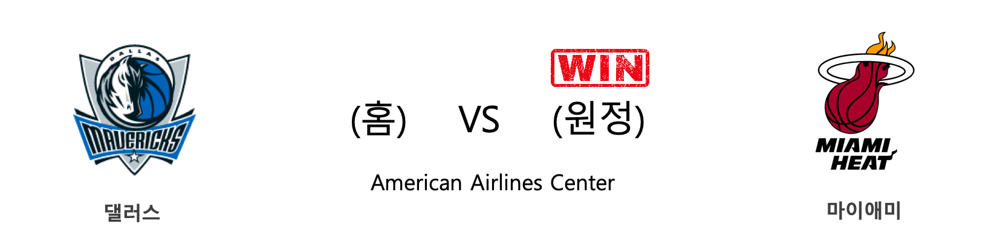

####  휴스턴(홈) VS 디트로이트(원정) 

<table class="tg">
  <tr>
    <th class="tg-rr9t">HOU</th>
    <th class="tg-rr9t">팀</th>
    <th class="tg-rr9t">DET</th>
  </tr>
  <tr>
    <td class="tg-dcpn">0승 1패</td>
    <td class="tg-rr9t">시즌 상대전적</td>
    <td class="tg-dcpn">1승 0패</td>
  </tr>
  <tr>
    <td class="tg-dcpn">107</td>
    <td class="tg-rr9t">점수</td>
    <td class="tg-dcpn">115</td>
  </tr>
  <tr>
    <td class="tg-dcpn">28/57(49%)</td>
    <td class="tg-rr9t">2점(%)</td>
    <td class="tg-dcpn">29/55(53%)</td>
  </tr>
  <tr>
    <td class="tg-dcpn">13/45(29%)</td>
    <td class="tg-rr9t">3점(%)</td>
    <td class="tg-dcpn">12/37(32%)</td>
  </tr>
  <tr>
    <td class="tg-dcpn">12/18(67%)</td>
    <td class="tg-rr9t">자유투(%)</td>
    <td class="tg-dcpn">21/25(84%)</td>
  </tr>
  <tr>
    <td class="tg-dcpn">46</td>
    <td class="tg-rr9t">리바운드</td>
    <td class="tg-dcpn">55</td>
  </tr>
  <tr>
    <td class="tg-dcpn">18</td>
    <td class="tg-rr9t">어시스트</td>
    <td class="tg-dcpn">27</td>
  </tr>
  <tr>
    <td class="tg-dcpn">9</td>
    <td class="tg-rr9t">스틸</td>
    <td class="tg-dcpn">6</td>
  </tr>
  <tr>
    <td class="tg-dcpn">8</td>
    <td class="tg-rr9t">블록</td>
    <td class="tg-dcpn">6</td>
  </tr>
  <tr>
    <td class="tg-dcpn">11</td>
    <td class="tg-rr9t">턴오버</td>
    <td class="tg-dcpn">14</td>
  </tr>
  <tr>
    <td class="tg-dcpn">ChrisClemons(17) JamesHardenG(39)</td>
    <td class="tg-rr9t">주요 득점선수</td>
    <td class="tg-dcpn">DerrickRose(20) TonySnellF(15) BruceBrownG(16) LukeKennardG(22) MarkieffMorri(15)</td>
  </tr>
</table>

#### 경기 관련 주요 기사         

[[오늘의 NBA] (12/7) 르브론 제임스, 멜로(carmelo) 드라마의 주인공](http://sports.news.naver.com/basketball/news/read.nhn?oid=486&aid=0000001159)

[[오늘의 NBA] (12/4) 샌안토니오, 괄육취골 승리를 거두다](http://sports.news.naver.com/basketball/news/read.nhn?oid=486&aid=0000001156)

[[오늘의 NBA] (12/13) 조엘 엠비드, 천적 없는 보스턴 평원의 지배자](http://sports.news.naver.com/basketball/news/read.nhn?oid=486&aid=0000001165)

[[오늘의 NBA] (12/8) 뉴욕, NBA의 방랑자](http://sports.news.naver.com/basketball/news/read.nhn?oid=486&aid=0000001160)

['로즈 더블-더블' 드러먼드 결장한 DET, HOU 격파](http://www.rookie.co.kr/news/articleView.html?idxno=36333)

        
        

####  토론토(홈) VS 브루클린(원정) 

<table class="tg">
  <tr>
    <th class="tg-rr9t">TOR</th>
    <th class="tg-rr9t">팀</th>
    <th class="tg-rr9t">BKN</th>
  </tr>
  <tr>
    <td class="tg-dcpn">1승 0패</td>
    <td class="tg-rr9t">시즌 상대전적</td>
    <td class="tg-dcpn">0승 1패</td>
  </tr>
  <tr>
    <td class="tg-dcpn">110</td>
    <td class="tg-rr9t">점수</td>
    <td class="tg-dcpn">102</td>
  </tr>
  <tr>
    <td class="tg-dcpn">24/58(41%)</td>
    <td class="tg-rr9t">2점(%)</td>
    <td class="tg-dcpn">27/55(49%)</td>
  </tr>
  <tr>
    <td class="tg-dcpn">14/40(35%)</td>
    <td class="tg-rr9t">3점(%)</td>
    <td class="tg-dcpn">12/46(26%)</td>
  </tr>
  <tr>
    <td class="tg-dcpn">20/25(80%)</td>
    <td class="tg-rr9t">자유투(%)</td>
    <td class="tg-dcpn">12/17(71%)</td>
  </tr>
  <tr>
    <td class="tg-dcpn">51</td>
    <td class="tg-rr9t">리바운드</td>
    <td class="tg-dcpn">59</td>
  </tr>
  <tr>
    <td class="tg-dcpn">21</td>
    <td class="tg-rr9t">어시스트</td>
    <td class="tg-dcpn">24</td>
  </tr>
  <tr>
    <td class="tg-dcpn">10</td>
    <td class="tg-rr9t">스틸</td>
    <td class="tg-dcpn">4</td>
  </tr>
  <tr>
    <td class="tg-dcpn">10</td>
    <td class="tg-rr9t">블록</td>
    <td class="tg-dcpn">7</td>
  </tr>
  <tr>
    <td class="tg-dcpn">11</td>
    <td class="tg-rr9t">턴오버</td>
    <td class="tg-dcpn">20</td>
  </tr>
  <tr>
    <td class="tg-dcpn">MarcGasolC(17) NormanPowellG(25) KyleLowryG(17) PascalSiakamF(30)</td>
    <td class="tg-rr9t">주요 득점선수</td>
    <td class="tg-dcpn">GarrettTemple(16) SpencerDinwid(24)</td>
  </tr>
</table>

#### 경기 관련 주요 기사         

[[오늘의 NBA] (12/6) 마이크 댄토니, 토론토 수비를 농락하다](http://sports.news.naver.com/basketball/news/read.nhn?oid=486&aid=0000001158)

[[오늘의 NBA] (12/12) 제임스 하든 선생님의 심폐소생술](http://sports.news.naver.com/basketball/news/read.nhn?oid=486&aid=0000001164)

[[오늘의 NBA] (12/10) 데릭 로즈, 모터 시티의 해결사](http://sports.news.naver.com/basketball/news/read.nhn?oid=486&aid=0000001162)

[[오늘의 NBA] (12/9) 앤써니 데이비스, 구단 역사에 이름을 남기다](http://sports.news.naver.com/basketball/news/read.nhn?oid=486&aid=0000001161)

[[오늘의 NBA] (12/14) 레이커스, 마이애미 홈 코트를 점령하다](http://sports.news.naver.com/basketball/news/read.nhn?oid=486&aid=0000001166)

        
        

####  멤피스(홈) VS 워싱턴(원정) 

<table class="tg">
  <tr>
    <th class="tg-rr9t">MEM</th>
    <th class="tg-rr9t">팀</th>
    <th class="tg-rr9t">WAS</th>
  </tr>
  <tr>
    <td class="tg-dcpn">1승 0패</td>
    <td class="tg-rr9t">시즌 상대전적</td>
    <td class="tg-dcpn">0승 1패</td>
  </tr>
  <tr>
    <td class="tg-dcpn">128</td>
    <td class="tg-rr9t">점수</td>
    <td class="tg-dcpn">111</td>
  </tr>
  <tr>
    <td class="tg-dcpn">37/57(65%)</td>
    <td class="tg-rr9t">2점(%)</td>
    <td class="tg-dcpn">22/47(47%)</td>
  </tr>
  <tr>
    <td class="tg-dcpn">11/27(41%)</td>
    <td class="tg-rr9t">3점(%)</td>
    <td class="tg-dcpn">14/38(37%)</td>
  </tr>
  <tr>
    <td class="tg-dcpn">21/24(88%)</td>
    <td class="tg-rr9t">자유투(%)</td>
    <td class="tg-dcpn">25/32(78%)</td>
  </tr>
  <tr>
    <td class="tg-dcpn">46</td>
    <td class="tg-rr9t">리바운드</td>
    <td class="tg-dcpn">34</td>
  </tr>
  <tr>
    <td class="tg-dcpn">32</td>
    <td class="tg-rr9t">어시스트</td>
    <td class="tg-dcpn">22</td>
  </tr>
  <tr>
    <td class="tg-dcpn">11</td>
    <td class="tg-rr9t">스틸</td>
    <td class="tg-dcpn">12</td>
  </tr>
  <tr>
    <td class="tg-dcpn">7</td>
    <td class="tg-rr9t">블록</td>
    <td class="tg-dcpn">4</td>
  </tr>
  <tr>
    <td class="tg-dcpn">23</td>
    <td class="tg-rr9t">턴오버</td>
    <td class="tg-dcpn">18</td>
  </tr>
  <tr>
    <td class="tg-dcpn">JarenJacksonJ(16) BrandonClarke(25) JaMorantG(18) DillonBrooksG(27)</td>
    <td class="tg-rr9t">주요 득점선수</td>
    <td class="tg-dcpn">BradleyBealG(29) TroyBrownJr.(16)</td>
  </tr>
</table>

#### 경기 관련 주요 기사         

[[오늘의 NBA] (11/14) 제임스 하든, 농구의 미래를 제시하다](http://sports.news.naver.com/basketball/news/read.nhn?oid=486&aid=0000001137)

[[오늘의 NBA] (12/5) 밀워키, 시스템 농구 정점에 도달하다](http://sports.news.naver.com/basketball/news/read.nhn?oid=486&aid=0000001157)

[[오늘의 NBA] (11/9) 위긴스 vs 러셀, 타깃 센터의 명승부](http://sports.news.naver.com/basketball/news/read.nhn?oid=486&aid=0000001132)

[[오늘의 NBA] (11/30) 인디애나, 동부컨퍼런스의 복병](http://sports.news.naver.com/basketball/news/read.nhn?oid=486&aid=0000001152)

[[오늘의 NBA] (12/2) 토론토, 두 마리 토끼를 노린다!](http://sports.news.naver.com/basketball/news/read.nhn?oid=486&aid=0000001154)

        
        

####  덴버(홈) VS 오클라호마씨티(원정) 

<table class="tg">
  <tr>
    <th class="tg-rr9t">DEN</th>
    <th class="tg-rr9t">팀</th>
    <th class="tg-rr9t">OKC</th>
  </tr>
  <tr>
    <td class="tg-dcpn">1승 0패</td>
    <td class="tg-rr9t">시즌 상대전적</td>
    <td class="tg-dcpn">0승 1패</td>
  </tr>
  <tr>
    <td class="tg-dcpn">110</td>
    <td class="tg-rr9t">점수</td>
    <td class="tg-dcpn">102</td>
  </tr>
  <tr>
    <td class="tg-dcpn">36/58(62%)</td>
    <td class="tg-rr9t">2점(%)</td>
    <td class="tg-dcpn">32/58(55%)</td>
  </tr>
  <tr>
    <td class="tg-dcpn">7/27(26%)</td>
    <td class="tg-rr9t">3점(%)</td>
    <td class="tg-dcpn">6/23(26%)</td>
  </tr>
  <tr>
    <td class="tg-dcpn">17/23(74%)</td>
    <td class="tg-rr9t">자유투(%)</td>
    <td class="tg-dcpn">20/23(87%)</td>
  </tr>
  <tr>
    <td class="tg-dcpn">44</td>
    <td class="tg-rr9t">리바운드</td>
    <td class="tg-dcpn">37</td>
  </tr>
  <tr>
    <td class="tg-dcpn">30</td>
    <td class="tg-rr9t">어시스트</td>
    <td class="tg-dcpn">22</td>
  </tr>
  <tr>
    <td class="tg-dcpn">6</td>
    <td class="tg-rr9t">스틸</td>
    <td class="tg-dcpn">7</td>
  </tr>
  <tr>
    <td class="tg-dcpn">3</td>
    <td class="tg-rr9t">블록</td>
    <td class="tg-dcpn">3</td>
  </tr>
  <tr>
    <td class="tg-dcpn">15</td>
    <td class="tg-rr9t">턴오버</td>
    <td class="tg-dcpn">15</td>
  </tr>
  <tr>
    <td class="tg-dcpn">NikolaJokicC(28) WillBartonF(18)</td>
    <td class="tg-rr9t">주요 득점선수</td>
    <td class="tg-dcpn">ChrisPaulG(15) StevenAdamsC(18) ShaiGilgeous-(16) DennisSchrode(22)</td>
  </tr>
</table>

#### 경기 관련 주요 기사         

[[오늘의 NBA] (12/9) 앤써니 데이비스, 구단 역사에 이름을 남기다](http://sports.news.naver.com/basketball/news/read.nhn?oid=486&aid=0000001161)

[[오늘의 NBA] (12/5) 밀워키, 시스템 농구 정점에 도달하다](http://sports.news.naver.com/basketball/news/read.nhn?oid=486&aid=0000001157)

[[오늘의 NBA] (12/7) 르브론 제임스, 멜로(carmelo) 드라마의 주인공](http://sports.news.naver.com/basketball/news/read.nhn?oid=486&aid=0000001159)

[OKC-NY-DEN...카멜로 앤써니의 기묘한 '친정' 3연전](http://www.rookie.co.kr/news/articleView.html?idxno=36072)

[[오늘의 NBA] (12/12) 제임스 하든 선생님의 심폐소생술](http://sports.news.naver.com/basketball/news/read.nhn?oid=486&aid=0000001164)

        
        

####  밀워키(홈) VS 클리블랜드(원정) 

<table class="tg">
  <tr>
    <th class="tg-rr9t">MIL</th>
    <th class="tg-rr9t">팀</th>
    <th class="tg-rr9t">CLE</th>
  </tr>
  <tr>
    <td class="tg-dcpn">3승 0패</td>
    <td class="tg-rr9t">시즌 상대전적</td>
    <td class="tg-dcpn">0승 3패</td>
  </tr>
  <tr>
    <td class="tg-dcpn">125</td>
    <td class="tg-rr9t">점수</td>
    <td class="tg-dcpn">108</td>
  </tr>
  <tr>
    <td class="tg-dcpn">32/48(67%)</td>
    <td class="tg-rr9t">2점(%)</td>
    <td class="tg-dcpn">26/55(47%)</td>
  </tr>
  <tr>
    <td class="tg-dcpn">14/37(38%)</td>
    <td class="tg-rr9t">3점(%)</td>
    <td class="tg-dcpn">15/35(43%)</td>
  </tr>
  <tr>
    <td class="tg-dcpn">19/26(73%)</td>
    <td class="tg-rr9t">자유투(%)</td>
    <td class="tg-dcpn">11/15(73%)</td>
  </tr>
  <tr>
    <td class="tg-dcpn">41</td>
    <td class="tg-rr9t">리바운드</td>
    <td class="tg-dcpn">45</td>
  </tr>
  <tr>
    <td class="tg-dcpn">26</td>
    <td class="tg-rr9t">어시스트</td>
    <td class="tg-dcpn">27</td>
  </tr>
  <tr>
    <td class="tg-dcpn">12</td>
    <td class="tg-rr9t">스틸</td>
    <td class="tg-dcpn">10</td>
  </tr>
  <tr>
    <td class="tg-dcpn">6</td>
    <td class="tg-rr9t">블록</td>
    <td class="tg-dcpn">3</td>
  </tr>
  <tr>
    <td class="tg-dcpn">12</td>
    <td class="tg-rr9t">턴오버</td>
    <td class="tg-dcpn">18</td>
  </tr>
  <tr>
    <td class="tg-dcpn">DonteDiVincen(15) GiannisAnteto(29) RobinLopez(16) KhrisMiddleto(24)</td>
    <td class="tg-rr9t">주요 득점선수</td>
    <td class="tg-dcpn">KevinPorterJr(15)</td>
  </tr>
</table>

#### 경기 관련 주요 기사         

[[오늘의 NBA] (12/8) 뉴욕, NBA의 방랑자](http://sports.news.naver.com/basketball/news/read.nhn?oid=486&aid=0000001160)

[ML, 2019 골드글러브 수상자 발표…아레나도 7년 연속 수상](http://www.mbcsportsplus.com/news/?mode=view&cate=2&b_idx=99826267.000)

[[오늘의 NBA] (12/12) 제임스 하든 선생님의 심폐소생술](http://sports.news.naver.com/basketball/news/read.nhn?oid=486&aid=0000001164)

[[오늘의 NBA] (11/15) NOP 즈루 홀리데이, 뒤처리는 내가 맡는다!](http://sports.news.naver.com/basketball/news/read.nhn?oid=486&aid=0000001138)

['지는 법을 까먹었어요' MIL, CLE 잡고 18연승](http://www.rookie.co.kr/news/articleView.html?idxno=36328)

        
        

####  시카고(홈) VS LA클리퍼스(원정) 

<table class="tg">
  <tr>
    <th class="tg-rr9t">CHI</th>
    <th class="tg-rr9t">팀</th>
    <th class="tg-rr9t">LAC</th>
  </tr>
  <tr>
    <td class="tg-dcpn">1승 0패</td>
    <td class="tg-rr9t">시즌 상대전적</td>
    <td class="tg-dcpn">0승 1패</td>
  </tr>
  <tr>
    <td class="tg-dcpn">109</td>
    <td class="tg-rr9t">점수</td>
    <td class="tg-dcpn">106</td>
  </tr>
  <tr>
    <td class="tg-dcpn">26/54(48%)</td>
    <td class="tg-rr9t">2점(%)</td>
    <td class="tg-dcpn">25/58(43%)</td>
  </tr>
  <tr>
    <td class="tg-dcpn">14/31(45%)</td>
    <td class="tg-rr9t">3점(%)</td>
    <td class="tg-dcpn">10/22(45%)</td>
  </tr>
  <tr>
    <td class="tg-dcpn">15/18(83%)</td>
    <td class="tg-rr9t">자유투(%)</td>
    <td class="tg-dcpn">26/36(72%)</td>
  </tr>
  <tr>
    <td class="tg-dcpn">50</td>
    <td class="tg-rr9t">리바운드</td>
    <td class="tg-dcpn">40</td>
  </tr>
  <tr>
    <td class="tg-dcpn">21</td>
    <td class="tg-rr9t">어시스트</td>
    <td class="tg-dcpn">20</td>
  </tr>
  <tr>
    <td class="tg-dcpn">12</td>
    <td class="tg-rr9t">스틸</td>
    <td class="tg-dcpn">9</td>
  </tr>
  <tr>
    <td class="tg-dcpn">9</td>
    <td class="tg-rr9t">블록</td>
    <td class="tg-dcpn">4</td>
  </tr>
  <tr>
    <td class="tg-dcpn">17</td>
    <td class="tg-rr9t">턴오버</td>
    <td class="tg-dcpn">15</td>
  </tr>
  <tr>
    <td class="tg-dcpn">ZachLaVineG(31) DenzelValenti(16) ThaddeusYoung(17)</td>
    <td class="tg-rr9t">주요 득점선수</td>
    <td class="tg-dcpn">PaulGeorgeG(27) MontrezlHarre(30)</td>
  </tr>
</table>

#### 경기 관련 주요 기사         

[[오늘의 NBA] (12/10) 데릭 로즈, 모터 시티의 해결사](http://sports.news.naver.com/basketball/news/read.nhn?oid=486&aid=0000001162)

[[오늘의 NBA] (12/12) 제임스 하든 선생님의 심폐소생술](http://sports.news.naver.com/basketball/news/read.nhn?oid=486&aid=0000001164)

[[오늘의 NBA] (12/7) 르브론 제임스, 멜로(carmelo) 드라마의 주인공](http://sports.news.naver.com/basketball/news/read.nhn?oid=486&aid=0000001159)

[[오늘의 NBA] (12/9) 앤써니 데이비스, 구단 역사에 이름을 남기다](http://sports.news.naver.com/basketball/news/read.nhn?oid=486&aid=0000001161)

[[오늘의 NBA] (12/14) 레이커스, 마이애미 홈 코트를 점령하다](http://sports.news.naver.com/basketball/news/read.nhn?oid=486&aid=0000001166)

        
        

####  피닉스(홈) VS 샌안토니오(원정) 

<table class="tg">
  <tr>
    <th class="tg-rr9t">PHX</th>
    <th class="tg-rr9t">팀</th>
    <th class="tg-rr9t">SAS</th>
  </tr>
  <tr>
    <td class="tg-dcpn">0승 1패</td>
    <td class="tg-rr9t">시즌 상대전적</td>
    <td class="tg-dcpn">1승 0패</td>
  </tr>
  <tr>
    <td class="tg-dcpn">119</td>
    <td class="tg-rr9t">점수</td>
    <td class="tg-dcpn">121</td>
  </tr>
  <tr>
    <td class="tg-dcpn">35/63(56%)</td>
    <td class="tg-rr9t">2점(%)</td>
    <td class="tg-dcpn">36/76(47%)</td>
  </tr>
  <tr>
    <td class="tg-dcpn">10/40(25%)</td>
    <td class="tg-rr9t">3점(%)</td>
    <td class="tg-dcpn">8/30(27%)</td>
  </tr>
  <tr>
    <td class="tg-dcpn">19/26(73%)</td>
    <td class="tg-rr9t">자유투(%)</td>
    <td class="tg-dcpn">25/34(74%)</td>
  </tr>
  <tr>
    <td class="tg-dcpn">59</td>
    <td class="tg-rr9t">리바운드</td>
    <td class="tg-dcpn">62</td>
  </tr>
  <tr>
    <td class="tg-dcpn">29</td>
    <td class="tg-rr9t">어시스트</td>
    <td class="tg-dcpn">23</td>
  </tr>
  <tr>
    <td class="tg-dcpn">5</td>
    <td class="tg-rr9t">스틸</td>
    <td class="tg-dcpn">6</td>
  </tr>
  <tr>
    <td class="tg-dcpn">5</td>
    <td class="tg-rr9t">블록</td>
    <td class="tg-dcpn">9</td>
  </tr>
  <tr>
    <td class="tg-dcpn">10</td>
    <td class="tg-rr9t">턴오버</td>
    <td class="tg-dcpn">11</td>
  </tr>
  <tr>
    <td class="tg-dcpn">RickyRubioG(25) KellyOubreJr.(17) FrankKaminsky(22) DarioSaricF(19)</td>
    <td class="tg-rr9t">주요 득점선수</td>
    <td class="tg-dcpn">DeMarDeRozanF(18) PattyMills(26) LonnieWalkerI(16) DejounteMurra(18) LaMarcusAldri(18)</td>
  </tr>
</table>

#### 경기 관련 주요 기사         

[[오늘의 NBA] (12/6) 마이크 댄토니, 토론토 수비를 농락하다](http://sports.news.naver.com/basketball/news/read.nhn?oid=486&aid=0000001158)

[[오늘의 NBA] (12/13) 조엘 엠비드, 천적 없는 보스턴 평원의 지배자](http://sports.news.naver.com/basketball/news/read.nhn?oid=486&aid=0000001165)

[[오늘의 NBA] (12/10) 데릭 로즈, 모터 시티의 해결사](http://sports.news.naver.com/basketball/news/read.nhn?oid=486&aid=0000001162)

[[오늘의 NBA] (12/8) 뉴욕, NBA의 방랑자](http://sports.news.naver.com/basketball/news/read.nhn?oid=486&aid=0000001160)

[[오늘의 NBA] (12/5) 밀워키, 시스템 농구 정점에 도달하다](http://sports.news.naver.com/basketball/news/read.nhn?oid=486&aid=0000001157)

        
        

####  댈러스(홈) VS 마이애미(원정) 

<table class="tg">
  <tr>
    <th class="tg-rr9t">DAL</th>
    <th class="tg-rr9t">팀</th>
    <th class="tg-rr9t">MIA</th>
  </tr>
  <tr>
    <td class="tg-dcpn">0승 1패</td>
    <td class="tg-rr9t">시즌 상대전적</td>
    <td class="tg-dcpn">1승 0패</td>
  </tr>
  <tr>
    <td class="tg-dcpn">118</td>
    <td class="tg-rr9t">점수</td>
    <td class="tg-dcpn">122</td>
  </tr>
  <tr>
    <td class="tg-dcpn">28/57(49%)</td>
    <td class="tg-rr9t">2점(%)</td>
    <td class="tg-dcpn">23/51(45%)</td>
  </tr>
  <tr>
    <td class="tg-dcpn">17/44(39%)</td>
    <td class="tg-rr9t">3점(%)</td>
    <td class="tg-dcpn">16/40(40%)</td>
  </tr>
  <tr>
    <td class="tg-dcpn">11/17(65%)</td>
    <td class="tg-rr9t">자유투(%)</td>
    <td class="tg-dcpn">28/34(82%)</td>
  </tr>
  <tr>
    <td class="tg-dcpn">48</td>
    <td class="tg-rr9t">리바운드</td>
    <td class="tg-dcpn">49</td>
  </tr>
  <tr>
    <td class="tg-dcpn">30</td>
    <td class="tg-rr9t">어시스트</td>
    <td class="tg-dcpn">27</td>
  </tr>
  <tr>
    <td class="tg-dcpn">4</td>
    <td class="tg-rr9t">스틸</td>
    <td class="tg-dcpn">8</td>
  </tr>
  <tr>
    <td class="tg-dcpn">3</td>
    <td class="tg-rr9t">블록</td>
    <td class="tg-dcpn">3</td>
  </tr>
  <tr>
    <td class="tg-dcpn">11</td>
    <td class="tg-rr9t">턴오버</td>
    <td class="tg-dcpn">8</td>
  </tr>
  <tr>
    <td class="tg-dcpn">MaxiKleber(17) TimHardawayJr(28) KristapsPorzi(22) JalenBrunson(18)</td>
    <td class="tg-rr9t">주요 득점선수</td>
    <td class="tg-dcpn">TylerHerro(19) JimmyButlerF(27) BamAdebayoF(18) KellyOlynyk(17)</td>
  </tr>
</table>

#### 경기 관련 주요 기사         

[[오늘의 NBA] (12/9) 앤써니 데이비스, 구단 역사에 이름을 남기다](http://sports.news.naver.com/basketball/news/read.nhn?oid=486&aid=0000001161)

[[오늘의 NBA] (12/13) 조엘 엠비드, 천적 없는 보스턴 평원의 지배자](http://sports.news.naver.com/basketball/news/read.nhn?oid=486&aid=0000001165)

[[오늘의 NBA] (12/5) 밀워키, 시스템 농구 정점에 도달하다](http://sports.news.naver.com/basketball/news/read.nhn?oid=486&aid=0000001157)

[[오늘의 NBA] (12/12) 제임스 하든 선생님의 심폐소생술](http://sports.news.naver.com/basketball/news/read.nhn?oid=486&aid=0000001164)

[[오늘의 NBA] (12/14) 레이커스, 마이애미 홈 코트를 점령하다](http://sports.news.naver.com/basketball/news/read.nhn?oid=486&aid=0000001166)

        
        

#### 리그 (Eastern) 순위
    

<table class="tg">
  <tr>
    <th class="tg-d14o">순위</th>
    <th class="tg-d14o">팀명</th>
    <th class="tg-d14o">경기수</th>
    <th class="tg-d14o">승</th>
    <th class="tg-d14o">패</th>
    <th class="tg-d14o">승차</th>
    <th class="tg-d14o">승률</th>
  </tr>
  
<tr>
    <td class="tg-50j8">1</td>
    <td class="tg-50j8">MIL</td>
    <td class="tg-50j8">27</td>
    <td class="tg-50j8">24</td>
    <td class="tg-50j8">3</td>
    <td class="tg-50j8">0</td>
    <td class="tg-50j8">0.889</td>
</tr>

<tr>
    <td class="tg-50j8">2</td>
    <td class="tg-50j8">MIA</td>
    <td class="tg-50j8">26</td>
    <td class="tg-50j8">19</td>
    <td class="tg-50j8">7</td>
    <td class="tg-50j8">5</td>
    <td class="tg-50j8">0.731</td>
</tr>

<tr>
    <td class="tg-50j8">2</td>
    <td class="tg-50j8">PHI</td>
    <td class="tg-50j8">26</td>
    <td class="tg-50j8">19</td>
    <td class="tg-50j8">7</td>
    <td class="tg-50j8">5</td>
    <td class="tg-50j8">0.731</td>
</tr>

<tr>
    <td class="tg-50j8">4</td>
    <td class="tg-50j8">BOS</td>
    <td class="tg-50j8">23</td>
    <td class="tg-50j8">17</td>
    <td class="tg-50j8">6</td>
    <td class="tg-50j8">7</td>
    <td class="tg-50j8">0.739</td>
</tr>

<tr>
    <td class="tg-50j8">5</td>
    <td class="tg-50j8">TOR</td>
    <td class="tg-50j8">25</td>
    <td class="tg-50j8">17</td>
    <td class="tg-50j8">8</td>
    <td class="tg-50j8">7</td>
    <td class="tg-50j8">0.68</td>
</tr>

<tr>
    <td class="tg-50j8">6</td>
    <td class="tg-50j8">IND</td>
    <td class="tg-50j8">26</td>
    <td class="tg-50j8">17</td>
    <td class="tg-50j8">9</td>
    <td class="tg-50j8">7</td>
    <td class="tg-50j8">0.654</td>
</tr>

<tr>
    <td class="tg-50j8">7</td>
    <td class="tg-50j8">BKN</td>
    <td class="tg-50j8">25</td>
    <td class="tg-50j8">13</td>
    <td class="tg-50j8">12</td>
    <td class="tg-50j8">11</td>
    <td class="tg-50j8">0.52</td>
</tr>

<tr>
    <td class="tg-50j8">8</td>
    <td class="tg-50j8">CHA</td>
    <td class="tg-50j8">28</td>
    <td class="tg-50j8">12</td>
    <td class="tg-50j8">16</td>
    <td class="tg-50j8">12</td>
    <td class="tg-50j8">0.429</td>
</tr>

<tr>
    <td class="tg-50j8">9</td>
    <td class="tg-50j8">DET</td>
    <td class="tg-50j8">25</td>
    <td class="tg-50j8">11</td>
    <td class="tg-50j8">14</td>
    <td class="tg-50j8">13</td>
    <td class="tg-50j8">0.44</td>
</tr>

<tr>
    <td class="tg-50j8">9</td>
    <td class="tg-50j8">ORL</td>
    <td class="tg-50j8">25</td>
    <td class="tg-50j8">11</td>
    <td class="tg-50j8">14</td>
    <td class="tg-50j8">13</td>
    <td class="tg-50j8">0.44</td>
</tr>

<tr>
    <td class="tg-50j8">11</td>
    <td class="tg-50j8">CHI</td>
    <td class="tg-50j8">28</td>
    <td class="tg-50j8">10</td>
    <td class="tg-50j8">18</td>
    <td class="tg-50j8">14</td>
    <td class="tg-50j8">0.357</td>
</tr>

<tr>
    <td class="tg-50j8">12</td>
    <td class="tg-50j8">WAS</td>
    <td class="tg-50j8">24</td>
    <td class="tg-50j8">7</td>
    <td class="tg-50j8">17</td>
    <td class="tg-50j8">17</td>
    <td class="tg-50j8">0.292</td>
</tr>

<tr>
    <td class="tg-50j8">13</td>
    <td class="tg-50j8">NYK</td>
    <td class="tg-50j8">26</td>
    <td class="tg-50j8">6</td>
    <td class="tg-50j8">20</td>
    <td class="tg-50j8">18</td>
    <td class="tg-50j8">0.231</td>
</tr>

<tr>
    <td class="tg-50j8">13</td>
    <td class="tg-50j8">ATL</td>
    <td class="tg-50j8">26</td>
    <td class="tg-50j8">6</td>
    <td class="tg-50j8">20</td>
    <td class="tg-50j8">18</td>
    <td class="tg-50j8">0.231</td>
</tr>

<tr>
    <td class="tg-50j8">15</td>
    <td class="tg-50j8">CLE</td>
    <td class="tg-50j8">25</td>
    <td class="tg-50j8">5</td>
    <td class="tg-50j8">20</td>
    <td class="tg-50j8">19</td>
    <td class="tg-50j8">0.2</td>
</tr>
</table> 
#### 리그 (Western) 순위
    

<table class="tg">
  <tr>
    <th class="tg-d14o">순위</th>
    <th class="tg-d14o">팀명</th>
    <th class="tg-d14o">경기수</th>
    <th class="tg-d14o">승</th>
    <th class="tg-d14o">패</th>
    <th class="tg-d14o">승차</th>
    <th class="tg-d14o">승률</th>
  </tr>
  
<tr>
    <td class="tg-50j8">1</td>
    <td class="tg-50j8">LAL</td>
    <td class="tg-50j8">26</td>
    <td class="tg-50j8">23</td>
    <td class="tg-50j8">3</td>
    <td class="tg-50j8">1</td>
    <td class="tg-50j8">0.885</td>
</tr>

<tr>
    <td class="tg-50j8">2</td>
    <td class="tg-50j8">LAC</td>
    <td class="tg-50j8">28</td>
    <td class="tg-50j8">20</td>
    <td class="tg-50j8">8</td>
    <td class="tg-50j8">4</td>
    <td class="tg-50j8">0.714</td>
</tr>

<tr>
    <td class="tg-50j8">3</td>
    <td class="tg-50j8">HOU</td>
    <td class="tg-50j8">26</td>
    <td class="tg-50j8">17</td>
    <td class="tg-50j8">9</td>
    <td class="tg-50j8">7</td>
    <td class="tg-50j8">0.654</td>
</tr>

<tr>
    <td class="tg-50j8">4</td>
    <td class="tg-50j8">DAL</td>
    <td class="tg-50j8">24</td>
    <td class="tg-50j8">16</td>
    <td class="tg-50j8">8</td>
    <td class="tg-50j8">8</td>
    <td class="tg-50j8">0.667</td>
</tr>

<tr>
    <td class="tg-50j8">5</td>
    <td class="tg-50j8">DEN</td>
    <td class="tg-50j8">23</td>
    <td class="tg-50j8">15</td>
    <td class="tg-50j8">8</td>
    <td class="tg-50j8">9</td>
    <td class="tg-50j8">0.652</td>
</tr>

<tr>
    <td class="tg-50j8">6</td>
    <td class="tg-50j8">UTA</td>
    <td class="tg-50j8">26</td>
    <td class="tg-50j8">15</td>
    <td class="tg-50j8">11</td>
    <td class="tg-50j8">9</td>
    <td class="tg-50j8">0.577</td>
</tr>

<tr>
    <td class="tg-50j8">7</td>
    <td class="tg-50j8">SAC</td>
    <td class="tg-50j8">25</td>
    <td class="tg-50j8">11</td>
    <td class="tg-50j8">14</td>
    <td class="tg-50j8">13</td>
    <td class="tg-50j8">0.44</td>
</tr>

<tr>
    <td class="tg-50j8">7</td>
    <td class="tg-50j8">PHX</td>
    <td class="tg-50j8">25</td>
    <td class="tg-50j8">11</td>
    <td class="tg-50j8">14</td>
    <td class="tg-50j8">13</td>
    <td class="tg-50j8">0.44</td>
</tr>

<tr>
    <td class="tg-50j8">7</td>
    <td class="tg-50j8">OKC</td>
    <td class="tg-50j8">25</td>
    <td class="tg-50j8">11</td>
    <td class="tg-50j8">14</td>
    <td class="tg-50j8">13</td>
    <td class="tg-50j8">0.44</td>
</tr>

<tr>
    <td class="tg-50j8">10</td>
    <td class="tg-50j8">SAS</td>
    <td class="tg-50j8">24</td>
    <td class="tg-50j8">10</td>
    <td class="tg-50j8">14</td>
    <td class="tg-50j8">14</td>
    <td class="tg-50j8">0.417</td>
</tr>

<tr>
    <td class="tg-50j8">11</td>
    <td class="tg-50j8">POR</td>
    <td class="tg-50j8">25</td>
    <td class="tg-50j8">10</td>
    <td class="tg-50j8">15</td>
    <td class="tg-50j8">14</td>
    <td class="tg-50j8">0.4</td>
</tr>

<tr>
    <td class="tg-50j8">11</td>
    <td class="tg-50j8">MIN</td>
    <td class="tg-50j8">25</td>
    <td class="tg-50j8">10</td>
    <td class="tg-50j8">15</td>
    <td class="tg-50j8">14</td>
    <td class="tg-50j8">0.4</td>
</tr>

<tr>
    <td class="tg-50j8">13</td>
    <td class="tg-50j8">MEM</td>
    <td class="tg-50j8">26</td>
    <td class="tg-50j8">9</td>
    <td class="tg-50j8">17</td>
    <td class="tg-50j8">15</td>
    <td class="tg-50j8">0.346</td>
</tr>

<tr>
    <td class="tg-50j8">14</td>
    <td class="tg-50j8">NOP</td>
    <td class="tg-50j8">26</td>
    <td class="tg-50j8">6</td>
    <td class="tg-50j8">20</td>
    <td class="tg-50j8">18</td>
    <td class="tg-50j8">0.231</td>
</tr>

<tr>
    <td class="tg-50j8">15</td>
    <td class="tg-50j8">GSW</td>
    <td class="tg-50j8">27</td>
    <td class="tg-50j8">5</td>
    <td class="tg-50j8">22</td>
    <td class="tg-50j8">19</td>
    <td class="tg-50j8">0.185</td>
</tr>
</table> 

        
        
#nba #미국농구 #엔비에이 #농구분석 #토토 #스포츠토토 #경기예측 #농구결과 #20191215 #휴스턴 #디트로이트 #토론토 #브루클린 #멤피스 #워싱턴 #덴버 #오클라호마씨티 #밀워키 #클리블랜드 #시카고 #LA클리퍼스 #피닉스 #샌안토니오 #댈러스 #마이애미 #휴스턴디트로이트 #토론토브루클린 #멤피스워싱턴 #덴버오클라호마씨티 #밀워키클리블랜드 #시카고LA클리퍼스 #피닉스샌안토니오 #댈러스마이애미 