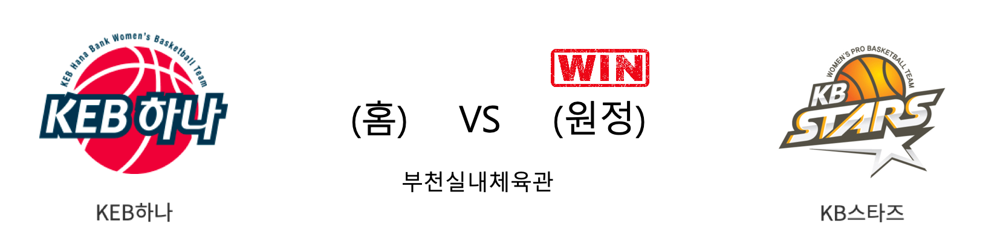

####  KEB하나(홈) VS KB스타즈(원정) 

<table class="tg">
  <tr>
    <th class="tg-rr9t">KEB하나</th>
    <th class="tg-rr9t">팀</th>
    <th class="tg-rr9t">KB스타즈</th>
  </tr>
  <tr>
    <td class="tg-dcpn">0승 3패</td>
    <td class="tg-rr9t">시즌 상대전적</td>
    <td class="tg-dcpn">3승 0패</td>
  </tr>
  <tr>
    <td class="tg-dcpn">58</td>
    <td class="tg-rr9t">점수</td>
    <td class="tg-dcpn">80</td>
  </tr>
  <tr>
    <td class="tg-dcpn">18/39(46%)</td>
    <td class="tg-rr9t">2점(%)</td>
    <td class="tg-dcpn">19/38(50%)</td>
  </tr>
  <tr>
    <td class="tg-dcpn">4/14(29%)</td>
    <td class="tg-rr9t">3점(%)</td>
    <td class="tg-dcpn">13/26(50%)</td>
  </tr>
  <tr>
    <td class="tg-dcpn">10/14(71%)</td>
    <td class="tg-rr9t">자유투(%)</td>
    <td class="tg-dcpn">3/8(38%)</td>
  </tr>
  <tr>
    <td class="tg-dcpn">23</td>
    <td class="tg-rr9t">리바운드</td>
    <td class="tg-dcpn">37</td>
  </tr>
  <tr>
    <td class="tg-dcpn">16</td>
    <td class="tg-rr9t">어시스트</td>
    <td class="tg-dcpn">24</td>
  </tr>
  <tr>
    <td class="tg-dcpn">5</td>
    <td class="tg-rr9t">스틸</td>
    <td class="tg-dcpn">7</td>
  </tr>
  <tr>
    <td class="tg-dcpn">10</td>
    <td class="tg-rr9t">블록</td>
    <td class="tg-dcpn">7</td>
  </tr>
  <tr>
    <td class="tg-dcpn">15</td>
    <td class="tg-rr9t">턴오버</td>
    <td class="tg-dcpn">16</td>
  </tr>
  <tr>
    <td class="tg-dcpn"></td>
    <td class="tg-rr9t">주요 득점선수</td>
    <td class="tg-dcpn">쏜튼(25) 강아정(18)</td>
  </tr>
</table>

#### 경기 관련 주요 기사         

[박지수 없어도 강한 KB…시즌 10승 선착](http://sports.khan.co.kr/news/sk_index.html?art_id=201912152003003&sec_id=530301&pt=nv)

[NO 지수, NO 프러블럼...KB스타즈, 4연승 질주](http://www.rookie.co.kr/news/articleView.html?idxno=36390)

['박지수 없는 KB 상대' 이훈재 감독 "기회가 왔을 때 잡아야 한다"](http://www.basketkorea.com/news/articleView.html?idxno=190781)

[[포토] KB스타즈 80:58로 완승! 단독 선두로!](http://www.rookie.co.kr/news/articleView.html?idxno=36407)

        
        

#### 리그 순위

<table class="tg">
  <tr>
    <th class="tg-d14o">순위</th>
    <th class="tg-d14o">팀명</th>
    <th class="tg-d14o">경기수</th>
    <th class="tg-d14o">승</th>
    <th class="tg-d14o">패</th>
    <th class="tg-d14o">승차</th>
    <th class="tg-d14o">승률</th>
  </tr>
  
<tr>
    <td class="tg-50j8">1</td>
    <td class="tg-50j8">KB스타즈</td>
    <td class="tg-50j8">12</td>
    <td class="tg-50j8">10</td>
    <td class="tg-50j8">2</td>
    <td class="tg-50j8">0</td>
    <td class="tg-50j8">0.833</td>
</tr>

<tr>
    <td class="tg-50j8">2</td>
    <td class="tg-50j8">우리은행</td>
    <td class="tg-50j8">11</td>
    <td class="tg-50j8">9</td>
    <td class="tg-50j8">2</td>
    <td class="tg-50j8">1</td>
    <td class="tg-50j8">0.818</td>
</tr>

<tr>
    <td class="tg-50j8">3</td>
    <td class="tg-50j8">신한은행</td>
    <td class="tg-50j8">10</td>
    <td class="tg-50j8">5</td>
    <td class="tg-50j8">5</td>
    <td class="tg-50j8">5</td>
    <td class="tg-50j8">0.5</td>
</tr>

<tr>
    <td class="tg-50j8">4</td>
    <td class="tg-50j8">KEB하나</td>
    <td class="tg-50j8">11</td>
    <td class="tg-50j8">4</td>
    <td class="tg-50j8">7</td>
    <td class="tg-50j8">6</td>
    <td class="tg-50j8">0.364</td>
</tr>

<tr>
    <td class="tg-50j8">5</td>
    <td class="tg-50j8">삼성생명</td>
    <td class="tg-50j8">11</td>
    <td class="tg-50j8">3</td>
    <td class="tg-50j8">8</td>
    <td class="tg-50j8">7</td>
    <td class="tg-50j8">0.273</td>
</tr>

<tr>
    <td class="tg-50j8">6</td>
    <td class="tg-50j8">BNK썸</td>
    <td class="tg-50j8">11</td>
    <td class="tg-50j8">2</td>
    <td class="tg-50j8">9</td>
    <td class="tg-50j8">8</td>
    <td class="tg-50j8">0.182</td>
</tr>
</table> 

        
        
#wkbl #국내농구 #여자농구 #농구분석 #토토 #스포츠토토 #경기예측 #농구결과 #20191215 #KEB하나 #KB스타즈 #KEB하나KB스타즈 