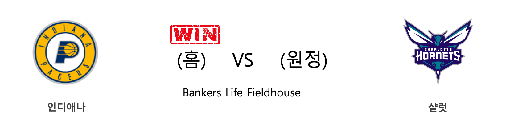
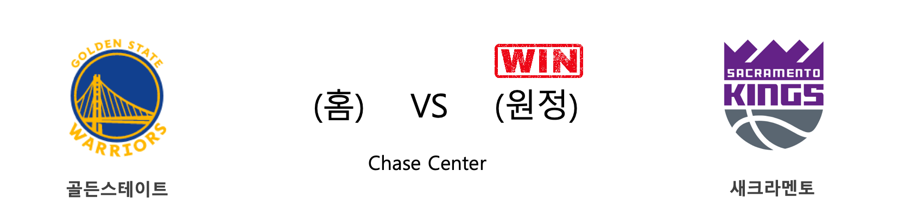

####  인디애나(홈) VS 샬럿(원정) 

<table class="tg">
  <tr>
    <th class="tg-rr9t">IND</th>
    <th class="tg-rr9t">팀</th>
    <th class="tg-rr9t">CHA</th>
  </tr>
  <tr>
    <td class="tg-dcpn">1승 1패</td>
    <td class="tg-rr9t">시즌 상대전적</td>
    <td class="tg-dcpn">1승 1패</td>
  </tr>
  <tr>
    <td class="tg-dcpn">107</td>
    <td class="tg-rr9t">점수</td>
    <td class="tg-dcpn">85</td>
  </tr>
  <tr>
    <td class="tg-dcpn">30/53(57%)</td>
    <td class="tg-rr9t">2점(%)</td>
    <td class="tg-dcpn">23/59(39%)</td>
  </tr>
  <tr>
    <td class="tg-dcpn">10/35(29%)</td>
    <td class="tg-rr9t">3점(%)</td>
    <td class="tg-dcpn">5/32(16%)</td>
  </tr>
  <tr>
    <td class="tg-dcpn">17/20(85%)</td>
    <td class="tg-rr9t">자유투(%)</td>
    <td class="tg-dcpn">24/35(69%)</td>
  </tr>
  <tr>
    <td class="tg-dcpn">51</td>
    <td class="tg-rr9t">리바운드</td>
    <td class="tg-dcpn">56</td>
  </tr>
  <tr>
    <td class="tg-dcpn">30</td>
    <td class="tg-rr9t">어시스트</td>
    <td class="tg-dcpn">18</td>
  </tr>
  <tr>
    <td class="tg-dcpn">6</td>
    <td class="tg-rr9t">스틸</td>
    <td class="tg-dcpn">4</td>
  </tr>
  <tr>
    <td class="tg-dcpn">9</td>
    <td class="tg-rr9t">블록</td>
    <td class="tg-dcpn">5</td>
  </tr>
  <tr>
    <td class="tg-dcpn">9</td>
    <td class="tg-rr9t">턴오버</td>
    <td class="tg-dcpn">10</td>
  </tr>
  <tr>
    <td class="tg-dcpn">AaronHoliday(23)</td>
    <td class="tg-rr9t">주요 득점선수</td>
    <td class="tg-dcpn">CodyZellerF(19)</td>
  </tr>
</table>

#### 경기 관련 주요 기사         

[[오늘의 NBA] (12/10) 데릭 로즈, 모터 시티의 해결사](http://sports.news.naver.com/basketball/news/read.nhn?oid=486&aid=0000001162)

[[오늘의 NBA] (12/12) 제임스 하든 선생님의 심폐소생술](http://sports.news.naver.com/basketball/news/read.nhn?oid=486&aid=0000001164)

[[오늘의 NBA] (12/14) 레이커스, 마이애미 홈 코트를 점령하다](http://sports.news.naver.com/basketball/news/read.nhn?oid=486&aid=0000001166)

[[오늘의 NBA] (12/7) 르브론 제임스, 멜로(carmelo) 드라마의 주인공](http://sports.news.naver.com/basketball/news/read.nhn?oid=486&aid=0000001159)

[[오늘의 NBA] (12/16) 스펜서 딘위디, 브루클린 상승세를 이끈다!](http://sports.news.naver.com/basketball/news/read.nhn?oid=486&aid=0000001168)

        
        

####  뉴올리언스(홈) VS 올랜도(원정) 

<table class="tg">
  <tr>
    <th class="tg-rr9t">NOP</th>
    <th class="tg-rr9t">팀</th>
    <th class="tg-rr9t">ORL</th>
  </tr>
  <tr>
    <td class="tg-dcpn">0승 1패</td>
    <td class="tg-rr9t">시즌 상대전적</td>
    <td class="tg-dcpn">1승 0패</td>
  </tr>
  <tr>
    <td class="tg-dcpn">119</td>
    <td class="tg-rr9t">점수</td>
    <td class="tg-dcpn">130</td>
  </tr>
  <tr>
    <td class="tg-dcpn">28/45(62%)</td>
    <td class="tg-rr9t">2점(%)</td>
    <td class="tg-dcpn">29/55(53%)</td>
  </tr>
  <tr>
    <td class="tg-dcpn">19/43(44%)</td>
    <td class="tg-rr9t">3점(%)</td>
    <td class="tg-dcpn">17/34(50%)</td>
  </tr>
  <tr>
    <td class="tg-dcpn">6/12(50%)</td>
    <td class="tg-rr9t">자유투(%)</td>
    <td class="tg-dcpn">21/26(81%)</td>
  </tr>
  <tr>
    <td class="tg-dcpn">40</td>
    <td class="tg-rr9t">리바운드</td>
    <td class="tg-dcpn">39</td>
  </tr>
  <tr>
    <td class="tg-dcpn">34</td>
    <td class="tg-rr9t">어시스트</td>
    <td class="tg-dcpn">32</td>
  </tr>
  <tr>
    <td class="tg-dcpn">6</td>
    <td class="tg-rr9t">스틸</td>
    <td class="tg-dcpn">8</td>
  </tr>
  <tr>
    <td class="tg-dcpn">7</td>
    <td class="tg-rr9t">블록</td>
    <td class="tg-dcpn">2</td>
  </tr>
  <tr>
    <td class="tg-dcpn">17</td>
    <td class="tg-rr9t">턴오버</td>
    <td class="tg-dcpn">9</td>
  </tr>
  <tr>
    <td class="tg-dcpn">BrandonIngram(21) JrueHolidayG(29) JJRedickG(23) JoshHart(20)</td>
    <td class="tg-rr9t">주요 득점선수</td>
    <td class="tg-dcpn">JonathanIsaac(21) NikolaVucevic(20) D.J.Augustin(17) EvanFournierG(16)</td>
  </tr>
</table>

#### 경기 관련 주요 기사         

[[오늘의 NBA] (12/8) 뉴욕, NBA의 방랑자](http://sports.news.naver.com/basketball/news/read.nhn?oid=486&aid=0000001160)

[[오늘의 NBA] (11/11) 토론토, 디펜딩 챔피언의 저력](http://sports.news.naver.com/basketball/news/read.nhn?oid=486&aid=0000001134)

[[오늘의 NBA] (12/3) 켈리 우브레 주니어, 피닉스의 터프가이](http://sports.news.naver.com/basketball/news/read.nhn?oid=486&aid=0000001155)

[[오늘의 NBA] (12/15) 밤 아데바요, 연장전의 지배자](http://sports.news.naver.com/basketball/news/read.nhn?oid=486&aid=0000001167)

[[오늘의 NBA] (12/14) 레이커스, 마이애미 홈 코트를 점령하다](http://sports.news.naver.com/basketball/news/read.nhn?oid=486&aid=0000001166)

        
        

####  애틀랜타(홈) VS LA레이커스(원정) 

<table class="tg">
  <tr>
    <th class="tg-rr9t">ATL</th>
    <th class="tg-rr9t">팀</th>
    <th class="tg-rr9t">LAL</th>
  </tr>
  <tr>
    <td class="tg-dcpn">0승 2패</td>
    <td class="tg-rr9t">시즌 상대전적</td>
    <td class="tg-dcpn">2승 0패</td>
  </tr>
  <tr>
    <td class="tg-dcpn">96</td>
    <td class="tg-rr9t">점수</td>
    <td class="tg-dcpn">101</td>
  </tr>
  <tr>
    <td class="tg-dcpn">19/44(43%)</td>
    <td class="tg-rr9t">2점(%)</td>
    <td class="tg-dcpn">31/53(58%)</td>
  </tr>
  <tr>
    <td class="tg-dcpn">12/42(29%)</td>
    <td class="tg-rr9t">3점(%)</td>
    <td class="tg-dcpn">5/31(16%)</td>
  </tr>
  <tr>
    <td class="tg-dcpn">22/25(88%)</td>
    <td class="tg-rr9t">자유투(%)</td>
    <td class="tg-dcpn">24/33(73%)</td>
  </tr>
  <tr>
    <td class="tg-dcpn">42</td>
    <td class="tg-rr9t">리바운드</td>
    <td class="tg-dcpn">56</td>
  </tr>
  <tr>
    <td class="tg-dcpn">18</td>
    <td class="tg-rr9t">어시스트</td>
    <td class="tg-dcpn">21</td>
  </tr>
  <tr>
    <td class="tg-dcpn">8</td>
    <td class="tg-rr9t">스틸</td>
    <td class="tg-dcpn">14</td>
  </tr>
  <tr>
    <td class="tg-dcpn">5</td>
    <td class="tg-rr9t">블록</td>
    <td class="tg-dcpn">9</td>
  </tr>
  <tr>
    <td class="tg-dcpn">19</td>
    <td class="tg-rr9t">턴오버</td>
    <td class="tg-dcpn">22</td>
  </tr>
  <tr>
    <td class="tg-dcpn">TraeYoungG(30)</td>
    <td class="tg-rr9t">주요 득점선수</td>
    <td class="tg-dcpn">LeBronJamesF(32) AnthonyDavisF(27)</td>
  </tr>
</table>

#### 경기 관련 주요 기사         

[[오늘의 NBA] (12/12) 제임스 하든 선생님의 심폐소생술](http://sports.news.naver.com/basketball/news/read.nhn?oid=486&aid=0000001164)

[[오늘의 NBA] (12/16) 스펜서 딘위디, 브루클린 상승세를 이끈다!](http://sports.news.naver.com/basketball/news/read.nhn?oid=486&aid=0000001168)

[[오늘의 NBA] (12/11) 마이애미의 커리어 나이트 파티](http://sports.news.naver.com/basketball/news/read.nhn?oid=486&aid=0000001163)

[[오늘의 NBA] (12/10) 데릭 로즈, 모터 시티의 해결사](http://sports.news.naver.com/basketball/news/read.nhn?oid=486&aid=0000001162)

[[오늘의 NBA] (12/14) 레이커스, 마이애미 홈 코트를 점령하다](http://sports.news.naver.com/basketball/news/read.nhn?oid=486&aid=0000001166)

        
        

####  덴버(홈) VS 뉴욕(원정) 

<table class="tg">
  <tr>
    <th class="tg-rr9t">DEN</th>
    <th class="tg-rr9t">팀</th>
    <th class="tg-rr9t">NYK</th>
  </tr>
  <tr>
    <td class="tg-dcpn">2승 0패</td>
    <td class="tg-rr9t">시즌 상대전적</td>
    <td class="tg-dcpn">0승 2패</td>
  </tr>
  <tr>
    <td class="tg-dcpn">111</td>
    <td class="tg-rr9t">점수</td>
    <td class="tg-dcpn">105</td>
  </tr>
  <tr>
    <td class="tg-dcpn">34/66(52%)</td>
    <td class="tg-rr9t">2점(%)</td>
    <td class="tg-dcpn">36/62(58%)</td>
  </tr>
  <tr>
    <td class="tg-dcpn">10/28(36%)</td>
    <td class="tg-rr9t">3점(%)</td>
    <td class="tg-dcpn">8/32(25%)</td>
  </tr>
  <tr>
    <td class="tg-dcpn">13/19(68%)</td>
    <td class="tg-rr9t">자유투(%)</td>
    <td class="tg-dcpn">9/10(90%)</td>
  </tr>
  <tr>
    <td class="tg-dcpn">48</td>
    <td class="tg-rr9t">리바운드</td>
    <td class="tg-dcpn">47</td>
  </tr>
  <tr>
    <td class="tg-dcpn">27</td>
    <td class="tg-rr9t">어시스트</td>
    <td class="tg-dcpn">20</td>
  </tr>
  <tr>
    <td class="tg-dcpn">5</td>
    <td class="tg-rr9t">스틸</td>
    <td class="tg-dcpn">9</td>
  </tr>
  <tr>
    <td class="tg-dcpn">6</td>
    <td class="tg-rr9t">블록</td>
    <td class="tg-dcpn">2</td>
  </tr>
  <tr>
    <td class="tg-dcpn">9</td>
    <td class="tg-rr9t">턴오버</td>
    <td class="tg-dcpn">11</td>
  </tr>
  <tr>
    <td class="tg-dcpn">WillBartonF(16) GaryHarrisG(15) NikolaJokicC(25)</td>
    <td class="tg-rr9t">주요 득점선수</td>
    <td class="tg-dcpn">MarcusMorrisS(22) JuliusRandleF(20)</td>
  </tr>
</table>

#### 경기 관련 주요 기사         

[[오늘의 NBA] (12/6) 마이크 댄토니, 토론토 수비를 농락하다](http://sports.news.naver.com/basketball/news/read.nhn?oid=486&aid=0000001158)

[[오늘의 NBA] (12/8) 뉴욕, NBA의 방랑자](http://sports.news.naver.com/basketball/news/read.nhn?oid=486&aid=0000001160)

[[오늘의 NBA] (12/12) 제임스 하든 선생님의 심폐소생술](http://sports.news.naver.com/basketball/news/read.nhn?oid=486&aid=0000001164)

[[오늘의 NBA] (12/14) 레이커스, 마이애미 홈 코트를 점령하다](http://sports.news.naver.com/basketball/news/read.nhn?oid=486&aid=0000001166)

[[오늘의 NBA] (12/16) 스펜서 딘위디, 브루클린 상승세를 이끈다!](http://sports.news.naver.com/basketball/news/read.nhn?oid=486&aid=0000001168)

        
        

####  골든스테이트(홈) VS 새크라멘토(원정) 

<table class="tg">
  <tr>
    <th class="tg-rr9t">GSW</th>
    <th class="tg-rr9t">팀</th>
    <th class="tg-rr9t">SAC</th>
  </tr>
  <tr>
    <td class="tg-dcpn">0승 1패</td>
    <td class="tg-rr9t">시즌 상대전적</td>
    <td class="tg-dcpn">1승 0패</td>
  </tr>
  <tr>
    <td class="tg-dcpn">79</td>
    <td class="tg-rr9t">점수</td>
    <td class="tg-dcpn">100</td>
  </tr>
  <tr>
    <td class="tg-dcpn">24/52(46%)</td>
    <td class="tg-rr9t">2점(%)</td>
    <td class="tg-dcpn">28/41(68%)</td>
  </tr>
  <tr>
    <td class="tg-dcpn">6/25(24%)</td>
    <td class="tg-rr9t">3점(%)</td>
    <td class="tg-dcpn">10/22(45%)</td>
  </tr>
  <tr>
    <td class="tg-dcpn">13/18(72%)</td>
    <td class="tg-rr9t">자유투(%)</td>
    <td class="tg-dcpn">14/16(88%)</td>
  </tr>
  <tr>
    <td class="tg-dcpn">26</td>
    <td class="tg-rr9t">리바운드</td>
    <td class="tg-dcpn">38</td>
  </tr>
  <tr>
    <td class="tg-dcpn">24</td>
    <td class="tg-rr9t">어시스트</td>
    <td class="tg-dcpn">27</td>
  </tr>
  <tr>
    <td class="tg-dcpn">14</td>
    <td class="tg-rr9t">스틸</td>
    <td class="tg-dcpn">9</td>
  </tr>
  <tr>
    <td class="tg-dcpn">1</td>
    <td class="tg-rr9t">블록</td>
    <td class="tg-dcpn">4</td>
  </tr>
  <tr>
    <td class="tg-dcpn">20</td>
    <td class="tg-rr9t">턴오버</td>
    <td class="tg-dcpn">27</td>
  </tr>
  <tr>
    <td class="tg-dcpn"></td>
    <td class="tg-rr9t">주요 득점선수</td>
    <td class="tg-dcpn">MarvinBagleyI(17) BuddyHieldG(19) BogdanBogdano(25) HarrisonBarne(15)</td>
  </tr>
</table>

#### 경기 관련 주요 기사         

[[오늘의 NBA] (12/14) 레이커스, 마이애미 홈 코트를 점령하다](http://sports.news.naver.com/basketball/news/read.nhn?oid=486&aid=0000001166)

[[오늘의 NBA] (12/16) 스펜서 딘위디, 브루클린 상승세를 이끈다!](http://sports.news.naver.com/basketball/news/read.nhn?oid=486&aid=0000001168)

[[오늘의 NBA] (12/8) 뉴욕, NBA의 방랑자](http://sports.news.naver.com/basketball/news/read.nhn?oid=486&aid=0000001160)

['보그다노비치 25점' SAC, GSW에 21점차 완승](http://www.rookie.co.kr/news/articleView.html?idxno=36428)

[[오늘의 NBA] (12/12) 제임스 하든 선생님의 심폐소생술](http://sports.news.naver.com/basketball/news/read.nhn?oid=486&aid=0000001164)

        
        

####  브루클린(홈) VS 필라델피아(원정) 

<table class="tg">
  <tr>
    <th class="tg-rr9t">BKN</th>
    <th class="tg-rr9t">팀</th>
    <th class="tg-rr9t">PHI</th>
  </tr>
  <tr>
    <td class="tg-dcpn">1승 0패</td>
    <td class="tg-rr9t">시즌 상대전적</td>
    <td class="tg-dcpn">0승 1패</td>
  </tr>
  <tr>
    <td class="tg-dcpn">109</td>
    <td class="tg-rr9t">점수</td>
    <td class="tg-dcpn">89</td>
  </tr>
  <tr>
    <td class="tg-dcpn">34/70(49%)</td>
    <td class="tg-rr9t">2점(%)</td>
    <td class="tg-dcpn">32/60(53%)</td>
  </tr>
  <tr>
    <td class="tg-dcpn">9/24(38%)</td>
    <td class="tg-rr9t">3점(%)</td>
    <td class="tg-dcpn">5/26(19%)</td>
  </tr>
  <tr>
    <td class="tg-dcpn">14/18(78%)</td>
    <td class="tg-rr9t">자유투(%)</td>
    <td class="tg-dcpn">10/17(59%)</td>
  </tr>
  <tr>
    <td class="tg-dcpn">51</td>
    <td class="tg-rr9t">리바운드</td>
    <td class="tg-dcpn">38</td>
  </tr>
  <tr>
    <td class="tg-dcpn">22</td>
    <td class="tg-rr9t">어시스트</td>
    <td class="tg-dcpn">19</td>
  </tr>
  <tr>
    <td class="tg-dcpn">9</td>
    <td class="tg-rr9t">스틸</td>
    <td class="tg-dcpn">9</td>
  </tr>
  <tr>
    <td class="tg-dcpn">1</td>
    <td class="tg-rr9t">블록</td>
    <td class="tg-dcpn">13</td>
  </tr>
  <tr>
    <td class="tg-dcpn">16</td>
    <td class="tg-rr9t">턴오버</td>
    <td class="tg-dcpn">16</td>
  </tr>
  <tr>
    <td class="tg-dcpn">SpencerDinwid(24) JoeHarrisF(16)</td>
    <td class="tg-rr9t">주요 득점선수</td>
    <td class="tg-dcpn">BenSimmonsG(20) TobiasHarrisF(17)</td>
  </tr>
</table>

#### 경기 관련 주요 기사         

[[오늘의 NBA] (12/12) 제임스 하든 선생님의 심폐소생술](http://sports.news.naver.com/basketball/news/read.nhn?oid=486&aid=0000001164)

[[오늘의 NBA] (12/6) 마이크 댄토니, 토론토 수비를 농락하다](http://sports.news.naver.com/basketball/news/read.nhn?oid=486&aid=0000001158)

[[오늘의 NBA] (12/16) 스펜서 딘위디, 브루클린 상승세를 이끈다!](http://sports.news.naver.com/basketball/news/read.nhn?oid=486&aid=0000001168)

[[오늘의 NBA] (12/10) 데릭 로즈, 모터 시티의 해결사](http://sports.news.naver.com/basketball/news/read.nhn?oid=486&aid=0000001162)

[[오늘의 NBA] (12/14) 레이커스, 마이애미 홈 코트를 점령하다](http://sports.news.naver.com/basketball/news/read.nhn?oid=486&aid=0000001166)

        
        

#### 리그 (Eastern) 순위
    

<table class="tg">
  <tr>
    <th class="tg-d14o">순위</th>
    <th class="tg-d14o">팀명</th>
    <th class="tg-d14o">경기수</th>
    <th class="tg-d14o">승</th>
    <th class="tg-d14o">패</th>
    <th class="tg-d14o">승차</th>
    <th class="tg-d14o">승률</th>
  </tr>
  
<tr>
    <td class="tg-50j8">1</td>
    <td class="tg-50j8">MIL</td>
    <td class="tg-50j8">27</td>
    <td class="tg-50j8">24</td>
    <td class="tg-50j8">3</td>
    <td class="tg-50j8">0</td>
    <td class="tg-50j8">0.889</td>
</tr>

<tr>
    <td class="tg-50j8">2</td>
    <td class="tg-50j8">MIA</td>
    <td class="tg-50j8">26</td>
    <td class="tg-50j8">19</td>
    <td class="tg-50j8">7</td>
    <td class="tg-50j8">5</td>
    <td class="tg-50j8">0.731</td>
</tr>

<tr>
    <td class="tg-50j8">3</td>
    <td class="tg-50j8">PHI</td>
    <td class="tg-50j8">27</td>
    <td class="tg-50j8">19</td>
    <td class="tg-50j8">8</td>
    <td class="tg-50j8">5</td>
    <td class="tg-50j8">0.704</td>
</tr>

<tr>
    <td class="tg-50j8">4</td>
    <td class="tg-50j8">IND</td>
    <td class="tg-50j8">27</td>
    <td class="tg-50j8">18</td>
    <td class="tg-50j8">9</td>
    <td class="tg-50j8">6</td>
    <td class="tg-50j8">0.667</td>
</tr>

<tr>
    <td class="tg-50j8">5</td>
    <td class="tg-50j8">BOS</td>
    <td class="tg-50j8">23</td>
    <td class="tg-50j8">17</td>
    <td class="tg-50j8">6</td>
    <td class="tg-50j8">7</td>
    <td class="tg-50j8">0.739</td>
</tr>

<tr>
    <td class="tg-50j8">6</td>
    <td class="tg-50j8">TOR</td>
    <td class="tg-50j8">25</td>
    <td class="tg-50j8">17</td>
    <td class="tg-50j8">8</td>
    <td class="tg-50j8">7</td>
    <td class="tg-50j8">0.68</td>
</tr>

<tr>
    <td class="tg-50j8">7</td>
    <td class="tg-50j8">BKN</td>
    <td class="tg-50j8">26</td>
    <td class="tg-50j8">14</td>
    <td class="tg-50j8">12</td>
    <td class="tg-50j8">10</td>
    <td class="tg-50j8">0.538</td>
</tr>

<tr>
    <td class="tg-50j8">8</td>
    <td class="tg-50j8">ORL</td>
    <td class="tg-50j8">26</td>
    <td class="tg-50j8">12</td>
    <td class="tg-50j8">14</td>
    <td class="tg-50j8">12</td>
    <td class="tg-50j8">0.462</td>
</tr>

<tr>
    <td class="tg-50j8">9</td>
    <td class="tg-50j8">CHA</td>
    <td class="tg-50j8">29</td>
    <td class="tg-50j8">12</td>
    <td class="tg-50j8">17</td>
    <td class="tg-50j8">12</td>
    <td class="tg-50j8">0.414</td>
</tr>

<tr>
    <td class="tg-50j8">10</td>
    <td class="tg-50j8">DET</td>
    <td class="tg-50j8">25</td>
    <td class="tg-50j8">11</td>
    <td class="tg-50j8">14</td>
    <td class="tg-50j8">13</td>
    <td class="tg-50j8">0.44</td>
</tr>

<tr>
    <td class="tg-50j8">11</td>
    <td class="tg-50j8">CHI</td>
    <td class="tg-50j8">28</td>
    <td class="tg-50j8">10</td>
    <td class="tg-50j8">18</td>
    <td class="tg-50j8">14</td>
    <td class="tg-50j8">0.357</td>
</tr>

<tr>
    <td class="tg-50j8">12</td>
    <td class="tg-50j8">WAS</td>
    <td class="tg-50j8">24</td>
    <td class="tg-50j8">7</td>
    <td class="tg-50j8">17</td>
    <td class="tg-50j8">17</td>
    <td class="tg-50j8">0.292</td>
</tr>

<tr>
    <td class="tg-50j8">13</td>
    <td class="tg-50j8">NYK</td>
    <td class="tg-50j8">27</td>
    <td class="tg-50j8">6</td>
    <td class="tg-50j8">21</td>
    <td class="tg-50j8">18</td>
    <td class="tg-50j8">0.222</td>
</tr>

<tr>
    <td class="tg-50j8">13</td>
    <td class="tg-50j8">ATL</td>
    <td class="tg-50j8">27</td>
    <td class="tg-50j8">6</td>
    <td class="tg-50j8">21</td>
    <td class="tg-50j8">18</td>
    <td class="tg-50j8">0.222</td>
</tr>

<tr>
    <td class="tg-50j8">15</td>
    <td class="tg-50j8">CLE</td>
    <td class="tg-50j8">25</td>
    <td class="tg-50j8">5</td>
    <td class="tg-50j8">20</td>
    <td class="tg-50j8">19</td>
    <td class="tg-50j8">0.2</td>
</tr>
</table> 
#### 리그 (Western) 순위
    

<table class="tg">
  <tr>
    <th class="tg-d14o">순위</th>
    <th class="tg-d14o">팀명</th>
    <th class="tg-d14o">경기수</th>
    <th class="tg-d14o">승</th>
    <th class="tg-d14o">패</th>
    <th class="tg-d14o">승차</th>
    <th class="tg-d14o">승률</th>
  </tr>
  
<tr>
    <td class="tg-50j8">1</td>
    <td class="tg-50j8">LAL</td>
    <td class="tg-50j8">27</td>
    <td class="tg-50j8">24</td>
    <td class="tg-50j8">3</td>
    <td class="tg-50j8">0</td>
    <td class="tg-50j8">0.889</td>
</tr>

<tr>
    <td class="tg-50j8">2</td>
    <td class="tg-50j8">LAC</td>
    <td class="tg-50j8">28</td>
    <td class="tg-50j8">20</td>
    <td class="tg-50j8">8</td>
    <td class="tg-50j8">4</td>
    <td class="tg-50j8">0.714</td>
</tr>

<tr>
    <td class="tg-50j8">3</td>
    <td class="tg-50j8">HOU</td>
    <td class="tg-50j8">26</td>
    <td class="tg-50j8">17</td>
    <td class="tg-50j8">9</td>
    <td class="tg-50j8">7</td>
    <td class="tg-50j8">0.654</td>
</tr>

<tr>
    <td class="tg-50j8">4</td>
    <td class="tg-50j8">DEN</td>
    <td class="tg-50j8">24</td>
    <td class="tg-50j8">16</td>
    <td class="tg-50j8">8</td>
    <td class="tg-50j8">8</td>
    <td class="tg-50j8">0.667</td>
</tr>

<tr>
    <td class="tg-50j8">4</td>
    <td class="tg-50j8">DAL</td>
    <td class="tg-50j8">24</td>
    <td class="tg-50j8">16</td>
    <td class="tg-50j8">8</td>
    <td class="tg-50j8">8</td>
    <td class="tg-50j8">0.667</td>
</tr>

<tr>
    <td class="tg-50j8">6</td>
    <td class="tg-50j8">UTA</td>
    <td class="tg-50j8">26</td>
    <td class="tg-50j8">15</td>
    <td class="tg-50j8">11</td>
    <td class="tg-50j8">9</td>
    <td class="tg-50j8">0.577</td>
</tr>

<tr>
    <td class="tg-50j8">7</td>
    <td class="tg-50j8">SAC</td>
    <td class="tg-50j8">26</td>
    <td class="tg-50j8">12</td>
    <td class="tg-50j8">14</td>
    <td class="tg-50j8">12</td>
    <td class="tg-50j8">0.462</td>
</tr>

<tr>
    <td class="tg-50j8">8</td>
    <td class="tg-50j8">OKC</td>
    <td class="tg-50j8">25</td>
    <td class="tg-50j8">11</td>
    <td class="tg-50j8">14</td>
    <td class="tg-50j8">13</td>
    <td class="tg-50j8">0.44</td>
</tr>

<tr>
    <td class="tg-50j8">8</td>
    <td class="tg-50j8">PHX</td>
    <td class="tg-50j8">25</td>
    <td class="tg-50j8">11</td>
    <td class="tg-50j8">14</td>
    <td class="tg-50j8">13</td>
    <td class="tg-50j8">0.44</td>
</tr>

<tr>
    <td class="tg-50j8">10</td>
    <td class="tg-50j8">SAS</td>
    <td class="tg-50j8">24</td>
    <td class="tg-50j8">10</td>
    <td class="tg-50j8">14</td>
    <td class="tg-50j8">14</td>
    <td class="tg-50j8">0.417</td>
</tr>

<tr>
    <td class="tg-50j8">11</td>
    <td class="tg-50j8">POR</td>
    <td class="tg-50j8">25</td>
    <td class="tg-50j8">10</td>
    <td class="tg-50j8">15</td>
    <td class="tg-50j8">14</td>
    <td class="tg-50j8">0.4</td>
</tr>

<tr>
    <td class="tg-50j8">11</td>
    <td class="tg-50j8">MIN</td>
    <td class="tg-50j8">25</td>
    <td class="tg-50j8">10</td>
    <td class="tg-50j8">15</td>
    <td class="tg-50j8">14</td>
    <td class="tg-50j8">0.4</td>
</tr>

<tr>
    <td class="tg-50j8">13</td>
    <td class="tg-50j8">MEM</td>
    <td class="tg-50j8">26</td>
    <td class="tg-50j8">9</td>
    <td class="tg-50j8">17</td>
    <td class="tg-50j8">15</td>
    <td class="tg-50j8">0.346</td>
</tr>

<tr>
    <td class="tg-50j8">14</td>
    <td class="tg-50j8">NOP</td>
    <td class="tg-50j8">27</td>
    <td class="tg-50j8">6</td>
    <td class="tg-50j8">21</td>
    <td class="tg-50j8">18</td>
    <td class="tg-50j8">0.222</td>
</tr>

<tr>
    <td class="tg-50j8">15</td>
    <td class="tg-50j8">GSW</td>
    <td class="tg-50j8">28</td>
    <td class="tg-50j8">5</td>
    <td class="tg-50j8">23</td>
    <td class="tg-50j8">19</td>
    <td class="tg-50j8">0.179</td>
</tr>
</table> 

        
        
#nba #미국농구 #엔비에이 #농구분석 #토토 #스포츠토토 #경기예측 #농구결과 #20191216 #인디애나 #샬럿 #뉴올리언스 #올랜도 #애틀랜타 #LA레이커스 #덴버 #뉴욕 #골든스테이트 #새크라멘토 #브루클린 #필라델피아 #인디애나샬럿 #뉴올리언스올랜도 #애틀랜타LA레이커스 #덴버뉴욕 #골든스테이트새크라멘토 #브루클린필라델피아 