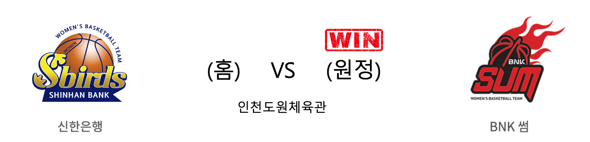

####  신한은행(홈) VS BNK썸(원정) 

<table class="tg">
  <tr>
    <th class="tg-rr9t">신한은행</th>
    <th class="tg-rr9t">팀</th>
    <th class="tg-rr9t">BNK썸</th>
  </tr>
  <tr>
    <td class="tg-dcpn">2승 1패</td>
    <td class="tg-rr9t">시즌 상대전적</td>
    <td class="tg-dcpn">1승 2패</td>
  </tr>
  <tr>
    <td class="tg-dcpn">59</td>
    <td class="tg-rr9t">점수</td>
    <td class="tg-dcpn">63</td>
  </tr>
  <tr>
    <td class="tg-dcpn">17/47(36%)</td>
    <td class="tg-rr9t">2점(%)</td>
    <td class="tg-dcpn">18/45(40%)</td>
  </tr>
  <tr>
    <td class="tg-dcpn">4/12(33%)</td>
    <td class="tg-rr9t">3점(%)</td>
    <td class="tg-dcpn">6/18(33%)</td>
  </tr>
  <tr>
    <td class="tg-dcpn">13/18(72%)</td>
    <td class="tg-rr9t">자유투(%)</td>
    <td class="tg-dcpn">9/12(75%)</td>
  </tr>
  <tr>
    <td class="tg-dcpn">35</td>
    <td class="tg-rr9t">리바운드</td>
    <td class="tg-dcpn">31</td>
  </tr>
  <tr>
    <td class="tg-dcpn">14</td>
    <td class="tg-rr9t">어시스트</td>
    <td class="tg-dcpn">12</td>
  </tr>
  <tr>
    <td class="tg-dcpn">5</td>
    <td class="tg-rr9t">스틸</td>
    <td class="tg-dcpn">8</td>
  </tr>
  <tr>
    <td class="tg-dcpn">17</td>
    <td class="tg-rr9t">블록</td>
    <td class="tg-dcpn">15</td>
  </tr>
  <tr>
    <td class="tg-dcpn">18</td>
    <td class="tg-rr9t">턴오버</td>
    <td class="tg-dcpn">19</td>
  </tr>
  <tr>
    <td class="tg-dcpn"></td>
    <td class="tg-rr9t">주요 득점선수</td>
    <td class="tg-dcpn">단타스(17)</td>
  </tr>
</table>

#### 경기 관련 주요 기사         

[우리은행 그레이, WKBL 2라운드 MVP…BNK썸 진안 MIP 수상](http://www.stnsports.co.kr/news/articleView.html?idxno=107985)

[[WKBL] '단타스·구슬·노현지 41점 합작' BNK썸, 신한은행 꺾고 3연패 탈출](http://www.sportsw.kr/news/newsview.php?ncode=1065615632611415)

[BNK, 접전 끝에 신한은행 격파…3연패 탈출](http://stoo.asiae.co.kr/article.php?aid=60545131259)

['단타스 더블-더블' BNK, 접전 끝 신한은행 꺾고 3연패 탈출](http://www.rookie.co.kr/news/articleView.html?idxno=36452)

        
        

#### 리그 순위

<table class="tg">
  <tr>
    <th class="tg-d14o">순위</th>
    <th class="tg-d14o">팀명</th>
    <th class="tg-d14o">경기수</th>
    <th class="tg-d14o">승</th>
    <th class="tg-d14o">패</th>
    <th class="tg-d14o">승차</th>
    <th class="tg-d14o">승률</th>
  </tr>
  
<tr>
    <td class="tg-50j8">1</td>
    <td class="tg-50j8">KB스타즈</td>
    <td class="tg-50j8">12</td>
    <td class="tg-50j8">10</td>
    <td class="tg-50j8">2</td>
    <td class="tg-50j8">0</td>
    <td class="tg-50j8">0.833</td>
</tr>

<tr>
    <td class="tg-50j8">2</td>
    <td class="tg-50j8">우리은행</td>
    <td class="tg-50j8">11</td>
    <td class="tg-50j8">9</td>
    <td class="tg-50j8">2</td>
    <td class="tg-50j8">1</td>
    <td class="tg-50j8">0.818</td>
</tr>

<tr>
    <td class="tg-50j8">3</td>
    <td class="tg-50j8">신한은행</td>
    <td class="tg-50j8">11</td>
    <td class="tg-50j8">5</td>
    <td class="tg-50j8">6</td>
    <td class="tg-50j8">5</td>
    <td class="tg-50j8">0.455</td>
</tr>

<tr>
    <td class="tg-50j8">4</td>
    <td class="tg-50j8">KEB하나</td>
    <td class="tg-50j8">11</td>
    <td class="tg-50j8">4</td>
    <td class="tg-50j8">7</td>
    <td class="tg-50j8">6</td>
    <td class="tg-50j8">0.364</td>
</tr>

<tr>
    <td class="tg-50j8">5</td>
    <td class="tg-50j8">삼성생명</td>
    <td class="tg-50j8">11</td>
    <td class="tg-50j8">3</td>
    <td class="tg-50j8">8</td>
    <td class="tg-50j8">7</td>
    <td class="tg-50j8">0.273</td>
</tr>

<tr>
    <td class="tg-50j8">6</td>
    <td class="tg-50j8">BNK썸</td>
    <td class="tg-50j8">12</td>
    <td class="tg-50j8">3</td>
    <td class="tg-50j8">9</td>
    <td class="tg-50j8">7</td>
    <td class="tg-50j8">0.25</td>
</tr>
</table> 

        
        
#wkbl #국내농구 #여자농구 #농구분석 #토토 #스포츠토토 #경기예측 #농구결과 #20191216 #신한은행 #BNK썸 #신한은행BNK썸 